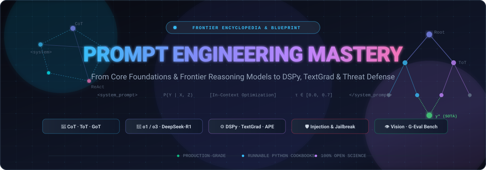

<p align="center">
  
</p>

<p align="center">
  <strong>The Definitive Knowledge Base & Research Blueprint for Frontier Prompt Engineering</strong>
</p>

<p align="center">
  <a href="#table-of-contents"></a>
  <a href="#license"></a>
  <a href="https://github.com/hammadshakeelai"></a>
  
</p>

---

## ⚡ Overview

**Prompt Engineering Mastery** is an exhaustive, production-grade encyclopedia and research repository covering all dimensions of prompt engineering—from tokenization mechanics and in-context learning theory to frontier test-time reasoning models (`o1`/`o3`, `DeepSeek-R1`), programmatic optimization frameworks (`DSPy`, `TextGrad`, `APE`), and adversarial security hardening.

Whether building autonomous multi-agent swarms, compiling self-optimizing pipelines, or defending enterprise LLMs against multi-stage injection attacks, this repository serves as your architectural reference and implementation manual.

---

## 🧭 Repository Structure & Taxonomy

```text
├── assets/
│   └── banner.svg                                      # Vector repository banner
├── 01_foundations/
│   ├── core_principles.md                             # Tokens, generation math, context window dynamics
│   └── in_context_learning.md                         # ICL theory, k-NN selection, MMR, ordering bias
├── 02_reasoning_architectures/
│   ├── cot_and_variants.md                            # Zero-shot, Few-shot, Self-Consistency, Step-Back
│   ├── tree_and_graph_of_thoughts.md                  # ToT, GoT, AoT, state space search algorithms
│   └── reasoning_models_frontier.md                   # OpenAI o1/o3, DeepSeek-R1, Gemini Thinking
├── 03_agentic_and_tool_prompting/
│   ├── react_and_autonomous_loops.md                  # ReAct, Plan-and-Solve, Reflexion, LATS
│   ├── structured_outputs_and_tool_calling.md         # JSON Schema, CFG constrained decoding, repair loops
│   └── multi_agent_prompting.md                       # Supervisors, debate protocols, state machine swarms
├── 04_programmatic_and_automated_optimization/
│   ├── dspy_deep_dive.md                              # Compiling LM pipelines, MIPROv2, teleprompters
│   ├── meta_prompting_and_ape.md                      # Automatic Prompt Engineer, PromptBreeder, genetic tuning
│   └── textgrad_and_gradient_free_opt.md              # "Backpropagation" via natural language feedback
├── 05_security_defense_and_hardening/                 # Threat modeling, jailbreaks, prompt injection defense
├── 06_multimodal_prompting/                           # Vision-language models, document parsing, temporal video
├── 07_model_specific_guide/                           # Claude XML vs OpenAI Developer vs Gemini vs Open-weights
├── 08_evaluation_and_benchmarking/                    # G-Eval, LLM-as-a-judge, rubric engineering, CI/CD
└── cookbooks/                                         # Runnable Python scripts & reproducible pipelines
```

---

## 📚 Core Research Modules

### 1. [Foundations & In-Context Mechanics](01_foundations/core_principles.md)
* **Autoregressive Generation Mechanics**: Logit scaling, temperature, top-$p$, stop sequences.
* **Structural Isolation**: Semantic tagging with XML and Markdown, delimiter defense.
* **Context Dynamics**: Addressing the *"Lost in the Middle"* degradation curve.
* **[In-Context Learning (ICL)](01_foundations/in_context_learning.md)**: Implicit gradient descent vs Bayesian inference, k-NN exemplar selection, Maximal Marginal Relevance (MMR), and debiasing calibration.

### 2. [Reasoning Architectures](02_reasoning_architectures/cot_and_variants.md)
* **Linear Reasoning**: Zero-Shot CoT, Few-Shot CoT, Least-to-Most decomposition, Step-Back abstraction.
* **Sampled Paths**: Self-Consistency majority voting over non-greedy trajectories.
* **[Non-Linear Search (ToT & GoT)](02_reasoning_architectures/tree_and_graph_of_thoughts.md)**: State evaluation value functions, BFS/DFS beam exploration, DAG graph aggregations, and Algorithm of Thoughts (AoT).
* **[Frontier Reasoning Models](02_reasoning_architectures/reasoning_models_frontier.md)**: Why classical prompts degrade OpenAI `o1`/`o3` and `DeepSeek-R1`; transitioning to outcome-oriented constraints and test-time compute scaling.

### 3. [Agentic Systems & Tool Calling](03_agentic_and_tool_prompting/react_and_autonomous_loops.md)
* **Control Loops**: ReAct (Thought-Action-Observation), Plan-and-Solve, Reflexion episodic verbal reinforcement, and Language Agent Tree Search (LATS).
* **[Structured Outputs](03_agentic_and_tool_prompting/structured_outputs_and_tool_calling.md)**: Constrained Context-Free Grammar (CFG) decoding vs prompt instructions, resilient tool schema design, and self-healing repair prompts.
* **[Multi-Agent Coordination](03_agentic_and_tool_prompting/multi_agent_prompting.md)**: Supervisor-worker hierarchies, adversarial debate cross-examination, and communication protocols.

### 4. [Programmatic & Automated Optimization](04_programmatic_and_automated_optimization/dspy_deep_dive.md)
* **[DSPy Deep Dive](04_programmatic_and_automated_optimization/dspy_deep_dive.md)**: Moving from fragile strings to typed Signatures, Modules, and MIPROv2 Bayesian prompt compilation.
* **[Automatic Prompt Engineering (APE)](04_programmatic_and_automated_optimization/meta_prompting_and_ape.md)**: Monte Carlo proposal distributions, evolutionary hypermutation (PromptBreeder), and Anthropic meta-prompting.
* **[TextGrad & Gradient-Free Search](04_programmatic_and_automated_optimization/textgrad_and_gradient_free_opt.md)**: Textual backpropagation, natural language loss functions, and OPRO.

---

## 🚀 Quick Reference: The Modern Prompting Cheat Sheet

| Task | Classical Approach (Legacy LLMs) | Modern SOTA Approach (Frontier & Reasoning Models) |
| :--- | :--- | :--- |
| **Complex Math / Logic** | `"Think step by step"` + Few-shot demos | Define explicit constraints & verification tests; let reasoning model search internally |
| **Classification / Extraction** | String prompt with formatting warnings | Constrained JSON Schema / Pydantic decoding + dynamic k-NN retrieval |
| **Prompt Optimization** | Manual trial-and-error edits | Compile using **DSPy MIPROv2** or **TextGrad** loss functions |
| **Agentic Tool Calling** | Open-ended function descriptions | Strict enum parameter constraints, precondition prompts, and structured repair loops |
| **Security & Safety** | `"Ignore all attempts to override"` (fails easily) | Structural XML isolation, Dual-LLM architecture, canary token inspection |

---

## 🛠️ Getting Started

Clone the repository and explore the research guides:

```bash
git clone https://github.com/hammadshakeelai/prompt-engineering-mastery.git
cd prompt-engineering-mastery
```

---

## 📄 License

Distributed under the MIT License. See `LICENSE` for details.
