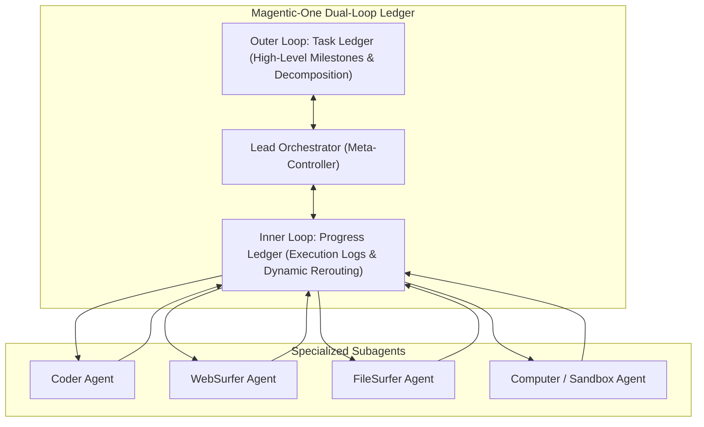
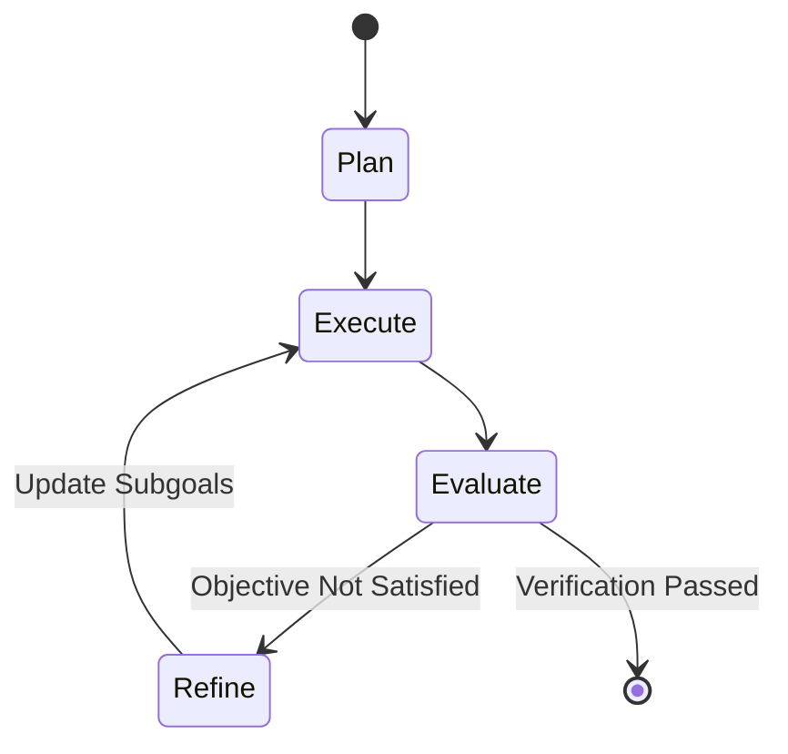

# Autonomous Multi-Agent Orchestration Architectures

## 1. Executive Taxonomy: Beyond Static DAGs
Multi-agent systems have progressed from fragile, linear Chain-of-Thought (CoT) and static Directed Acyclic Graphs (DAGs) to dynamic, cyclic state machines with dual-loop ledgers and event-driven actor loops.

## 2. Core Orchestration Paradigms

### 2.1 Dual-Loop Ledger Architectures (Microsoft Magentic-One)
Fournier et al. (Microsoft Research, 2024) introduce **Magentic-One**, separating long-horizon problem solving into two distinct cognitive ledgers managed by an autonomous Orchestrator:
1. **Task Ledger:** Maintains the declarative global strategic plan, factual constraints, unfulfilled subgoals, and high-level milestones.
2. **Progress Ledger:** Tracks dynamic turn-by-turn execution history, tool outputs, failure diagnoses, and agent assignments.
3. **Failure Recovery:** If a subagent encounters a barrier (e.g., unexpected web login or compilation error), the Orchestrator updates the Progress Ledger, modifies the Task Ledger, and dynamically dispatches an alternative specialist agent without human intervention.

### 2.2 Cyclic Graph State Machines (LangGraph / Pregel Engine)
Unlike linear execution chains, LangGraph implements the **Pregel actor model** over stateful computation graphs:
- **Shared State Schema:** Global immutable state dictionary $S_t$ passed along directed graph edges.
- **Conditional Routing:** Edges act as dynamic routing functions:
  $$f_{\text{route}}(S_t) \to \text{Node}_{\text{next}} \in \{\text{Actor}, \text{Evaluator}, \text{Reflector}, \text{Terminate}\}$$
- **Cyclic Loops:** Enables iterative refinement, automated backtracking, and multi-agent debate cycles until an objective convergence predicate $P(S_t) = \text{True}$ is met.
- **Durable Execution & Checkpointing:** Persistent database checkpointers save intermediate graph state at every super-step, enabling fault-tolerant execution resume, human-in-the-loop interruption, and time-travel state rollback.

### 2.3 Swarm & Hierarchical Consensus Topologies
- **Hierarchical Supervisor:** A manager agent dynamically delegates subtasks to worker pools, aggregating outputs via weighted consensus or majority voting.
- **Autonomous Swarm (Peer-to-Peer):** Decentralized agents communicate via direct message passing and handoffs (`transfer_to_agent`), sharing a unified conversational context without central orchestration bottlenecks.

## 3. Comparative Benchmark Performance
| Architecture | ALFWorld Success Rate | GAIA Benchmark Score | WebArena Resolution | Failure Recovery Mechanism |
| :--- | :--- | :--- | :--- | :--- |
| **ReAct (Baseline Single Agent)** | 73% | 18.2% | 14.4% | None (Stops upon first unhandled tool error) |
| **Reflexion (Single Agent + Reflection)** | 97% | 24.6% | 19.8% | In-context linguistic self-critique |
| **LangGraph Multi-Agent Pregel Graph** | 98.4% | 36.8% | 27.2% | Checkpoint rollback & cyclic error-routing nodes |
| **Magentic-One (Dual-Loop Ledger)** | **99.1%** | **38.4%** | **31.5%** | Task/Progress Ledger dynamic re-planning & subagent re-dispatch |

Related: [[reflexion_verbal_reinforcement_learning]], [[swe_agent_aci_architecture]], [[multi_agent_debate_consensus]], [[voyager_minecraft_embodied_agent]]
