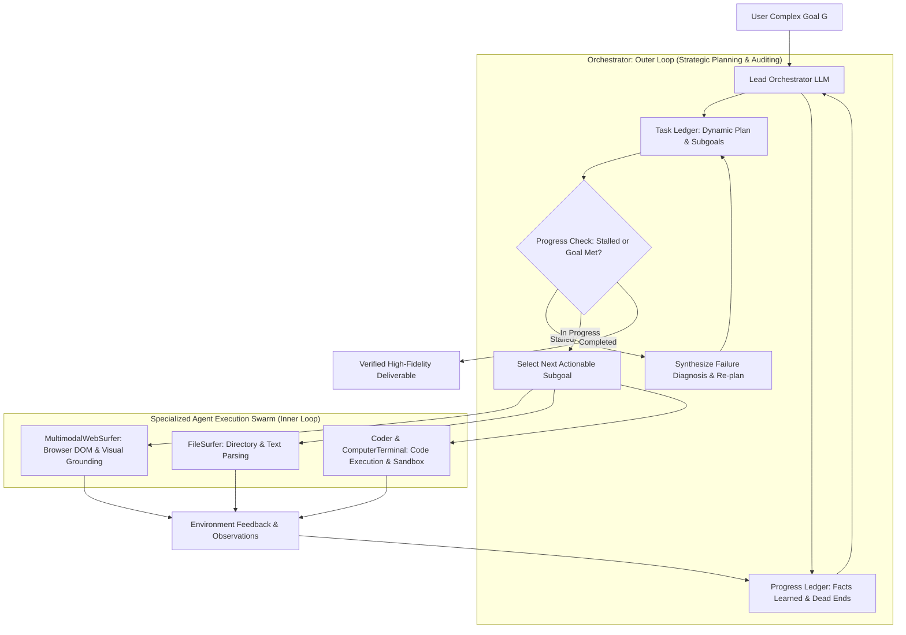
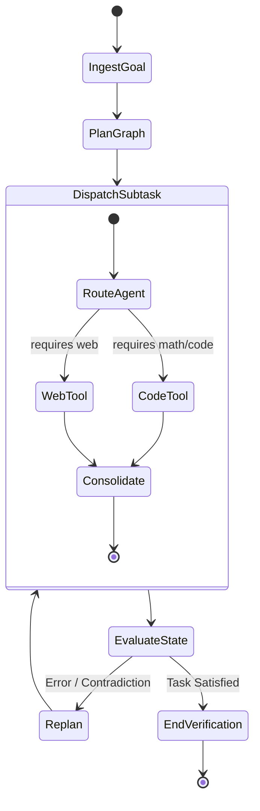

# Agent Orchestration: Dual-Loop Ledgers, Cyclic State Machines & Multi-Agent Swarms (Magentic-One & LangGraph)

## 1. Executive Summary & The Orchestration Frontier

Monolithic single-agent loops (e.g., vanilla ReAct) rapidly collapse when confronted with long-horizon, multi-modal tasks spanning heterogeneous environments (web browsing, code compilation, file system exploration, multi-step data synthesis). The failure modes of un-orchestrated agents include:
1. **Context Bloat & Attention Distraction:** As scratchpads exceed dozens of interaction turns, models suffer from "lost-in-the-middle" attention degradation, forgetting root goals or repeating failing tool calls.
2. **Action Space Saturation:** Equipping a single LLM with 50+ tool schemas degrades tool-calling precision, increasing hallucinated parameters and syntax violations.
3. **Fragile Recovery:** When an environment action fails (e.g., HTTP 403 or broken Python script), single-loop agents lack formal outer-loop mechanisms to backtrack, re-plan, or change strategies.

To overcome these structural limits, modern agent architectures decouple into **Dual-Loop Orchestrators** (Fourney et al., *Magentic-One*, Microsoft Research 2024 / arXiv:2411.04468) and **Cyclic Graph State Machines** (LangGraph / Pregel actor model).

---

## 2. Magentic-One Architecture: Dual-Loop Ledger System

Microsoft's Magentic-One formalizes multi-agent coordination by separating strategic planning from environment execution through two explicit, structured ledgers:

### 2.1 The Task Ledger (Plan Tracking)
The Task Ledger maintains an actionable decomposition of the user query $G$:
$$\mathcal{L}_{\text{task}} = \langle g_{\text{root}}, \{s_1, s_2, \dots, s_K\}, i_{\text{active}} \rangle$$
where each step $s_k$ has an execution status $c_k \in \{\text{Pending}, \text{In-Progress}, \text{Completed}, \text{Blocked}\}$.
- **Dynamic Re-planning:** If step $s_k$ fails repeatedly, the Orchestrator freezes $s_k$, logs the error context, and inserts compensating repair steps $\{s'_{k, 1}, s'_{k, 2}\}$ rather than repeating the failing action.

### 2.2 The Progress Ledger (Epistemic State Tracking)
Unlike raw conversation transcripts that retain transient noise and bulky tool payloads, the Progress Ledger tracks high-level epistemic facts:
$$\mathcal{L}_{\text{progress}} = \langle \mathcal{F}_{\text{verified}}, \mathcal{D}_{\text{dead\_ends}}, \mathcal{U}_{\text{uncertainties}} \rangle$$
- $\mathcal{F}_{\text{verified}}$: Hard factual claims verified by environment feedback (e.g., `"Downloaded dataset containing 1,024 rows; columns: [id, price, timestamp]"`).
- $\mathcal{D}_{\text{dead\_ends}}$: Explored paths that yielded failure, preventing cyclic exploration (e.g., `"URL endpoint /api/v1/auth returned 401 Unauthorized with API key"`).
- $\mathcal{U}_{\text{uncertainties}}$: Ambiguities requiring active verification.

### 2.3 Modular Agent Specialization
Magentic-One routes tasks across specialized subagents with tailored action spaces:
1. **MultimodalWebSurfer:** Ingests rendered browser DOMs and screenshots, executing actions (click, scroll, type, select) via Set-of-Mark visual grounding and Playwright automation.
2. **FileSurfer:** Navigates directory structures, inspects binary/tabular formats (CSV, Parquet, PDF), and streams chunked file slices to prevent context window saturation.
3. **Coder & ComputerTerminal:** An isolated pairwise loop where `Coder` authors executable Python scripts and `ComputerTerminal` runs them in a sandboxed Docker container, capturing stdout/stderr and tracebacks for deterministic debugging.

---

## 3. Cyclic Graph State Machines & Durable Execution (LangGraph)

While Magentic-One implements an LLM-driven ledger orchestrator, production systems require deterministic state transitions and fault tolerance. LangGraph formulates agent workflows as **Cyclic Directed Graphs governed by the Pregel message-passing abstraction**.

### 3.1 Mathematical Graph State Machine
An agent workflow is modeled as a state graph $\mathcal{G} = \langle \mathcal{V}, \mathcal{E}, \mathcal{S} \rangle$:
- **State Schema $\mathcal{S}$:** A typed data structure shared across all graph nodes:
  $$\mathcal{S} = \{ \text{messages}: \operatorname{List}[M], \quad \text{artifacts}: \operatorname{Dict}[K, V], \quad \text{step\_count}: \mathbb{N} \}$$
  State updates occur via functional reducers:
  $$S_{t+1} = S_t \oplus \Delta S_{\text{node}}$$
- **Nodes $\mathcal{V}$:** Pure functions or LLM invocations transforming state: $f_v(S) \to \Delta S$.
- **Edges $\mathcal{E}$:** Conditional routing functions selecting the next active node:
  $$e(S) \to v_{\text{next}} \in \mathcal{V} \cup \{\text{END}\}$$

### 3.2 Durable Checkpointing & Human-in-the-Loop Interrupts
Production agent runtimes require persistence across infrastructure crashes:
1. **Durable Checkpointing:** After each node transition $v \in \mathcal{V}$, state $S_t$ is atomically serialized into an append-only relational store (e.g., PostgreSQL or SQLite):
   $$\operatorname{Savepoint}(T_{\text{id}}, \text{step}_t, S_t)$$
2. **Deterministic Time-Travel & Backtracking:** If an agent executes an erroneous irreversible action, the orchestrator rolls back the execution pointer to $\text{step}_{t-k}$ and branches with a modified prompt constraint.
3. **Human-in-the-Loop (HitL) Interrupts:** Graph edges can specify `interrupt_before=[v_action]` flags. The execution suspends state, presents the pending action payload to a human operator, and resumes upon signed approval.

---

## 4. Empirical Benchmarks: GAIA, AssistantBench & WebArena

| System Architecture | Models | GAIA (General AI Assistant) | WebArena (Web Navigation) | AssistantBench |
| :--- | :--- | :---: | :---: | :---: |
| **Direct ReAct Baseline** | GPT-4 Turbo | $15.4\%$ | $11.2\%$ | $18.7\%$ |
| **AutoGen Swarm (Flat Chat)** | GPT-4 Turbo | $24.8\%$ | $19.5\%$ | $26.1\%$ |
| **LangGraph Structured Graph** | GPT-4 Omni | $38.2\%$ | $28.4\%$ | $34.5\%$ |
| **Magentic-One (Dual Ledger)** | GPT-4 Omni | **$42.6\%$** | **$35.8\%$** | **$39.2\%$** |

> [!IMPORTANT]
> The Dual-Loop Ledger architecture in Magentic-One and Cyclic Graph State Machines deliver a **$+27.2\%$ absolute improvement** on GAIA over un-orchestrated ReAct baselines. The primary driver of this gain is the prompt isolation of specialized agents coupled with epistemic dead-end tracking in the Progress Ledger.

---

## 5. Architectural Directives for Agent Engineering Mastery

1. **Strict Context Isolation:** Never expose low-level raw HTML or massive terminal stack traces to the lead Orchestrator. Subagents (`WebSurfer`, `Coder`) must filter and synthesize observations into concise semantic updates before emitting them to the shared ledger.
2. **Explicit Dead-End Registration:** Prevent cyclic failure loops by explicitly forcing the progress ledger to register failed strategies under $\mathcal{D}_{\text{dead\_ends}}$, preventing downstream subagents from re-attempting known failing actions.
3. **Deterministic Graph Boundaries:** Use cyclic state machine graphs (LangGraph/Pregel) for mission-critical production pipelines requiring durable state persistence, transactional rollback, and auditability.
