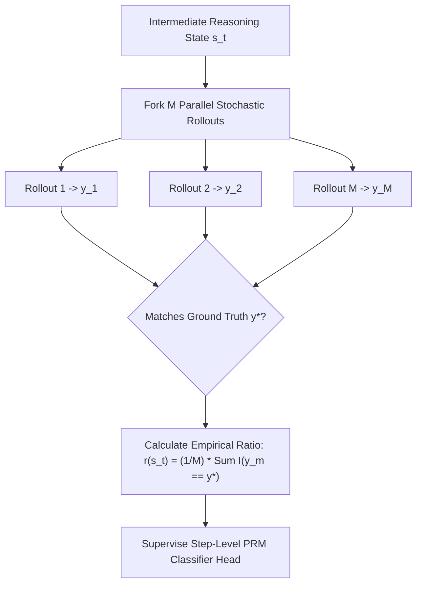

# Automated Step-Level Process Supervision & PRM Scaling (Math-Shepherd & Test-Time Search)

## 1. The Credit Assignment Crisis in Complex Reasoning
In multi-step mathematical, symbolic, and programmatic reasoning, language models must execute long sequences of interdependent logical transitions:
$$x \xrightarrow{a_1} s_1 \xrightarrow{a_2} s_2 \dots \xrightarrow{a_T} s_T \implies y$$

Conventional reinforcement learning from human or AI feedback (RLHF / RLAIF) relies predominantly on **Outcome Reward Models (ORMs)**, which evaluate only the final emitted answer $y$ with a binary terminal scalar $R \in \{0, 1\}$. This produces two severe alignment and steerability failures:
1. **False-Negative Attribution (Credit Starvation):** If an agent executes 25 impeccable algebraic derivations but makes a single minor arithmetic error on step 26, the ORM assigns $R = 0$. The backpropagation update penalizes the entire trajectory, depressing the probabilities of valid, sophisticated reasoning patterns.
2. **False-Positive Attribution (Reward Hacking):** If an agent produces nonsensical or fallacious intermediate logic that coincidentally arrives at the correct numerical answer due to cancelling errors, the ORM assigns $R = 1$. The update reinforces catastrophic hallucination paths.

---

## 2. Process Reward Models (PRMs) & The Supervision Bottleneck
A **Process Reward Model (PRM)** resolves credit assignment by assigning an evaluation score $r_t = \text{PRM}(s_t) \in [0, 1]$ to every individual reasoning step $s_t$:
$$\mathcal{S} = \{s_1, s_2, \dots, s_T\}$$

While Hunter Lightman et al. (*Let's Verify Step by Step*, OpenAI 2023) demonstrated that PRMs drastically outperform ORMs in guiding search, their PRM800K dataset required **800,000 human step-level annotations**, rendering continuous scaling and domain adaptation intractable.

---

## 3. Math-Shepherd: Automated Monte Carlo Step Attribution (Wang et al., ACL 2024)

Peiyi Wang et al. (*Math-Shepherd: Verify and Reinforce LLMs Step-by-step without Human Annotations*, ACL 2024 / arXiv:2312.08935) establish that step-level supervision can be derived automatically without human annotation through **Monte Carlo Rollout Estimation**:

### 3.1 Mathematical Definition of Step Quality
Let $s_t = (x, a_{1:t})$ denote the reasoning trajectory up to step $t$. The intrinsic quality $Q^*(s_t)$ is the expected probability that a stochastic policy $\pi_{\text{gen}}$ can successfully complete the proof from state $s_t$ to ground truth $y^*$:
$$Q^*(s_t) = \mathbb{E}_{\tau \sim \pi_{\text{gen}}(\cdot \mid s_t)} \left[ \mathbb{I}\left( \text{Terminal}(\tau) = y^* \right) \right]$$

### 3.2 Empirical Rollout Estimation
By sampling $M$ independent Monte Carlo completions from step $s_t$, the empirical reward target is:
$$\hat{r}(s_t) = \frac{1}{M} \sum_{m=1}^M \mathbb{I}\left( \text{Terminal}\left(\tau_m(s_t)\right) = y^* \right)$$

To eliminate label noise:
- Hard thresholding: $y_t = \mathbb{I}\left(\hat{r}(s_t) \ge \tau_{\text{pos}}\right)$ with $\tau_{\text{pos}} = 0.5$.
- Soft regression targets: $y_t = \hat{r}(s_t) \in [0, 1]$.

### 3.3 PRM Optimization
A classification head $w \in \mathbb{R}^d$ is appended to the transformer representation at step delimiter tokens (`\n\n`):
$$\mathcal{L}_{\text{PRM}}(\theta) = -\sum_{t=1}^T \left[ y_t \log \sigma\left(w^\top h_t\right) + (1 - y_t) \log\left(1 - \sigma\left(w^\top h_t\right)\right) \right]$$

---

## 4. Test-Time Compute (TTC) & Search Topologies

With an automated PRM, inference-time computation can be scaled systematically:

### 4.1 Trajectory Aggregation Strategies
When evaluating candidate solution $\tau = (a_1, \dots, a_T)$, candidate quality is aggregated using:
1. **Product Scoring (Independent Step Joint Probability):**
   $$S_{\text{prod}}(\tau) = \prod_{t=1}^T r_t = \exp\left( \sum_{t=1}^T \ln r_t \right)$$
2. **Bottleneck / Minimum Scoring (Weakest Link Rule):**
   $$S_{\text{min}}(\tau) = \min_{t \in \{1, \dots, T\}} r_t$$
   Empirically, $S_{\text{min}}$ provides greater robustness against long trajectories where a single false step destroys validity despite high average step confidence.

### 4.2 Step-Level Beam Search & PRM-Guided MCTS
Instead of generating full trajectories blindly:
1. At each step $t$, branch $B$ candidate steps.
2. Score all active branches using $\text{PRM}(s_t)$.
3. Prune candidate steps falling below confidence threshold $\epsilon$.
4. Retain top-$K$ beams, dynamically shifting compute from dead ends to promising derivations.

---

## 5. Policy Optimization: Step-Level PPO / GRPO
In addition to test-time search, Math-Shepherd provides dense credit signals for reinforcement learning:
$$\mathcal{L}_{\text{Step-PPO}}(\theta) = -\mathbb{E}_{(x, a) \sim \mathcal{D}} \left[ \sum_{t=1}^T \frac{\pi_\theta(a_t \mid s_{t-1})}{\pi_{\text{old}}(a_t \mid s_{t-1})} \hat{A}_t - \beta D_{\text{KL}}(\pi_\theta \,\|\, \pi_{\text{ref}}) \right]$$
where $\hat{A}_t$ is computed via Generalized Advantage Estimation (GAE) over step rewards $r_t$, eliminating the high variance of terminal-only advantage estimates.

---

## 6. Empirical Benchmarks & Impact
- **Best-of-N Re-ranking:** Math-Shepherd achieves **$84.1\%$ on GSM8K** and **$39.8\%$ on MATH** with Mistral-7B, outperforming ORM reranking by **$+5.2\%$** and **$+3.8\%$** respectively.
- **Data Efficiency:** Matches the performance of OpenAI's PRM800K while requiring zero human step labels, establishing automated process supervision as the foundational engine for verifiable reasoning in frontier LLMs.
