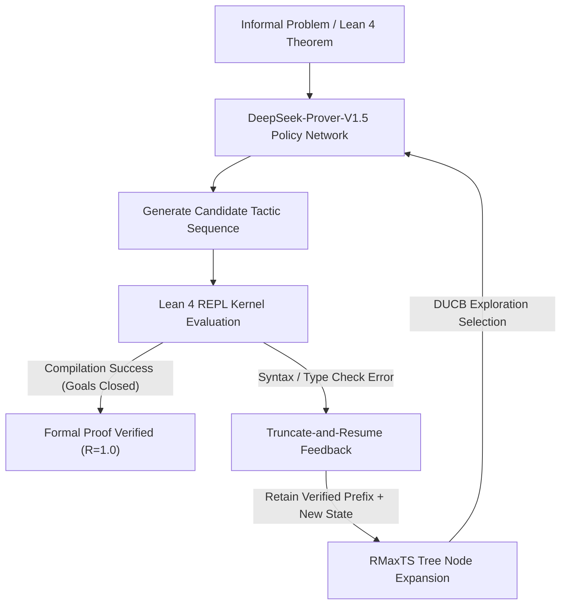

# Compiler-in-the-Loop Reasoning & Lean 4 Formal Verification (DeepSeek-Prover-V1.5 & RMaxTS)

## 1. The Neuro-Symbolic Verification Imperative
Autoregressive language models generate compelling chain-of-thought (CoT) derivations in natural language, but suffer from subtle semantic hallucinations, non-sequiturs, and unverified lemma assumptions. In contrast, formal interactive theorem provers (ITPs) such as **Lean 4**, **Coq**, and **Isabelle** operate under rigorous dependent type theory (Calculus of Inductive Constructions, CIC). Every proof step is a sequence of tactics that transforms an input goal state into zero or more subgoals. A proof is admitted if and only if the kernel compiles the complete proof term with type correctness:
$$\vdash p : T$$

The fundamental challenge in neuro-symbolic theorem proving is the **extreme sparsity of binary reward signals**: a 200-line formal proof that fails on line 199 yields an extrinsic reward of $R = 0$.

---

## 2. DeepSeek-Prover-V1.5 Architecture (Xin et al., ICLR 2025 / arXiv:2408.08152)

DeepSeek-Prover-V1.5 bridges deep autoregressive representation learning with deterministic interactive compiler feedback through three core innovations:

### 2.1 Tactic-State Conditioned Generation
Rather than generating an entire monolithic proof file end-to-end, DeepSeek-Prover-V1.5 is trained to condition dynamically on the current Lean 4 tactic state:
$$\pi_\theta(a_t \mid s_t) = \prod_{i=1}^{|a_t|} p_\theta(w_i \mid w_{<i}, s_t)$$
where $s_t$ serializes the local hypotheses $H_1 : T_1, \dots, H_k : T_k$ and target goal $\vdash G_t$.

### 2.2 Truncate-and-Resume Mechanism
When an autoregressive proof generation trajectory encounters a compile-time failure at tactic step $k$:
1. The execution trace is truncated immediately prior to step $k$.
2. All verified tactic prefixes $a_{1:k-1}$ and the resulting intermediate proof assistant state $s_{k-1}$ are preserved.
3. The verified prefix $a_{1:k-1}$ and state $s_{k-1}$ serve as the prompt context for subsequent tactic generation attempts, preventing catastrophic rollback to root.

---

## 3. RMaxTS: Reward-Maximizing Tree Search

To navigate the sparse reward landscape, DeepSeek-Prover-V1.5 introduces **RMaxTS**, adapting the classic R-Max exploration heuristic to Monte Carlo Tree Search.

### 3.1 Intrinsic Exploration Reward
In formal theorem proving, visiting novel tactic states provides critical exploratory value even if the final goal is not yet closed. Let $N(s)$ denote the visitation frequency of Lean 4 state $s$. The intrinsic exploration bonus $r_{\text{int}}(s)$ is defined as:
$$r_{\text{int}}(s) = \begin{cases} R_{\text{max}}, & \text{if } N(s) < M \\ 0, & \text{if } N(s) \ge M \end{cases}$$
where $M$ is a novelty threshold parameter. This guarantees that unvisited branches receive maximal exploration priority before falling back to exploitation.

### 3.2 Discounted Upper Confidence Bound (DUCB)
To account for non-stationary value updates across tree search iterations $k \in [1, K]$, RMaxTS applies a discount factor $\gamma = 0.99$ across search iterations rather than trajectory steps:

1. **Discounted Visit Count:**
   $$N_\gamma(s, a) = \sum_{i=1}^k \gamma^{k - i} \mathbb{I}(s_i = s, a_i = a)$$
2. **Discounted Q-Value:**
   $$\bar{Q}_\gamma(s, a) = \frac{1}{N_\gamma(s, a)} \sum_{i=1}^k \gamma^{k - i} R_i(s, a)$$
3. **Action Selection Policy:**
   $$a_t^* = \arg\max_{a \in \mathcal{A}(s)} \left[ \bar{Q}_\gamma(s, a) + c_{\text{puct}} \cdot P(s, a) \cdot \frac{\sqrt{\sum_{a'} N_\gamma(s, a')}}{1 + N_\gamma(s, a)} \right]$$

---

## 4. Reinforcement Learning from Proof Assistant Feedback (RLPAF)
Beyond Supervised Fine-Tuning (SFT) on formal math libraries (Mathlib4), the policy is optimized directly against the Lean 4 compiler via Group Relative Policy Optimization (GRPO) or PPO variants:
$$\mathcal{L}_{\text{RLPAF}}(\theta) = -\mathbb{E}_{(q, \tau) \sim \mathcal{D}, a \sim \pi_\theta} \left[ \frac{\pi_\theta(a \mid s)}{\pi_{\text{old}}(a \mid s)} \hat{A}_t - \beta D_{\text{KL}}(\pi_\theta \,\|\, \pi_{\text{ref}}) \right]$$
where the advantage $\hat{A}_t$ is computed from compiler outcome:
$$\hat{A}_t = \mathbb{I}(\text{Proof Passes Lean 4 Kernel}) - \bar{R}_{\text{group}}$$

---

## 5. Benchmark Performance & Verification Results
On rigorous formal mathematics benchmarks, DeepSeek-Prover-V1.5 with RMaxTS establishes new open-source frontiers:
- **miniF2F-test (High School Competition Olympiad Math):** **63.5%** pass rate.
- **ProofNet (Undergraduate Real Analysis, Abstract Algebra, Topology):** **25.3%** pass rate.

This confirms that combining continuous neural language representations with discrete interactive compiler verification loops provides an effective antidote to hallucination in high-stakes reasoning.
