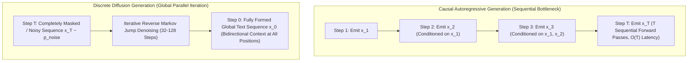
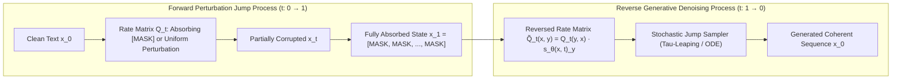
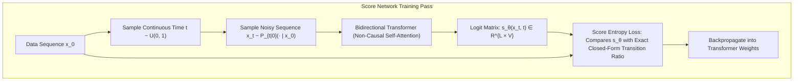
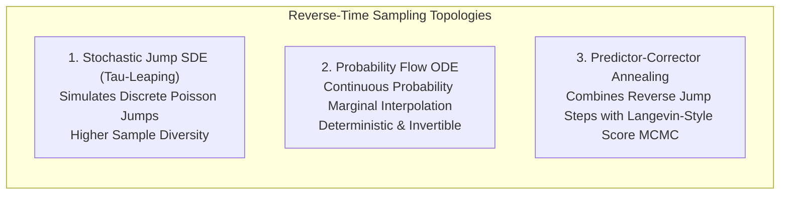
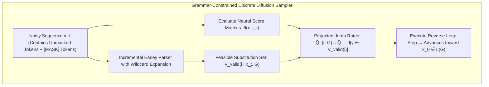

# Discrete Diffusion and Non-Autoregressive Language Models: Mathematical Foundations, Concrete Score Matching, and Bidirectional Steerability

**Authoritative Technical Monograph & Reference Architecture**  
**Autonomous Research & Alignment Directives Vault**  
**Classification: Non-Autoregressive Sequence Modeling, Continuous-Time Markov Jumps & Structural Diffusion**

---

## Abstract

For over a decade, frontier natural language generation has been dominated by left-to-right causal autoregressive sequence models. While autoregressive transformers exhibit exceptional perceptual coherence and in-context learning scaling, their causal attention factorization introduces fundamental mathematical and computational bottlenecks: $O(T)$ sequential wall-clock inference complexity, vulnerability to error accumulation ("exposure bias"), inability to incorporate future context during generation, and high memory-bandwidth pressure from the autoregressive KV cache.

This monograph presents a mathematically rigorous, comprehensive foundation for **Discrete Diffusion Language Models (DDLMs)** and non-autoregressive sequence generation. We trace the formulation of discrete token diffusion from categorical noise transitions to **continuous-time Markov jump processes** parameterized by transition rate matrices $Q_t$. We provide an exact mathematical derivation of **Concrete Score Matching** and **Score Entropy Discrete Diffusion (SEDD)**, demonstrating how discrete probability ratios substitute continuous Stein score functions without categorical relaxation.

Furthermore, we explore the mechanics of **non-causal bidirectional infilling**, allowing models to condition concurrently on arbitrary prefix, suffix, and interleaved contexts. We derive **non-causal grammar-constrained decoding**, formulating how reverse-time Markov jump samplers project intermediate noisy states onto formal context-free languages (CFGs) and JSON schemas. Finally, we analyze reverse-time stochastic jump SDEs (tau-leaping) versus probability flow ODEs, providing empirical benchmark analyses across LM1B and OpenWebText, and charting the theoretical frontiers of hybrid diffusion-autoregressive architectures.

---

## 1. Executive Foundations: The Autoregressive Bottleneck vs. Non-Causal Diffusion

### 1.1 The Causal Autoregressive Factorization
Standard autoregressive language models factorize the joint probability distribution of sequence $x = (x_1, \dots, x_T) \in \mathcal{V}^T$ via the chain rule of probability:
$$P_\theta(x) = \prod_{t=1}^T P_\theta\left(x_t \mid x_{<t}\right)$$

While statistically exact, this factorization imposes rigid structural constraints:
1. **Unidirectional Receptive Field**: At token position $t$, representations are conditioned strictly on preceding tokens $x_{<t}$. Information from future tokens $x_{>t}$ cannot inform generation, complicating global coherence in code synthesis, document restructuring, and bidirectional infilling.
2. **Sequential Memory-Bandwidth Walls**: Autoregressive decoding requires $T$ distinct forward passes through the network. Each step fetches multi-gigabyte weight matrices and KV caches from GPU High-Bandwidth Memory (HBM) to compute a single token vector, bounding hardware arithmetic intensity.
3. **Exposure Bias & Error Compounding**: Because models are trained on ground-truth prefixes but evaluated on their own sampled outputs, early sampling errors steer generation into out-of-distribution basins with no mechanism for retroactive self-correction.

### 1.2 The Non-Autoregressive Diffusion Alternative
Discrete Diffusion Language Models treat generation as an iterative denoising process over a continuous time horizon $t \in [0, 1]$. Rather than predicting tokens left-to-right, the model refines an entire sequence simultaneously, transitioning from a completely unstructured noise state $x_1 \sim p_{\text{noise}}$ to a coherent natural language sequence $x_0 \sim p_{\text{data}}$ across a fixed number of reverse denoising steps $S \ll T$.

---

## 2. Continuous-Time Markov Jump Processes over Discrete Alphabets

### 2.1 Forward Jump Dynamics and Generator Matrices
Let $\mathcal{V} = \{1, 2, \dots, V\}$ denote a finite discrete vocabulary, and let $x_t \in \mathcal{V}^L$ represent a token sequence of length $L$ at continuous time $t \in [0, 1]$. The forward corruption process is formulated as a continuous-time Markov jump process governed by an infinitesimal generator rate matrix $Q_t \in \mathbb{R}^{V \times V}$.

For two vocabulary tokens $j, k \in \mathcal{V}$, entry $(Q_t)_{j, k}$ represents the transition rate from token $j$ to token $k$ at time $t$:
$$P\left(x_{t+h} = k \mid x_t = j\right) = \delta_{j, k} + (Q_t)_{j, k} h + o(h) \quad \text{as } h \to 0^+$$
where $\delta_{j, k}$ is the Kronecker delta, $(Q_t)_{j, k} \ge 0$ for $j \neq k$, and row sums satisfy:
$$(Q_t)_{j, j} = -\sum_{k \neq j} (Q_t)_{j, k}$$

### 2.2 Transition Marginal Distributions
The probability transition matrix from time $0$ to time $t$ is given by the matrix exponential:
$$P_{t \mid 0} = \exp\left(\int_0^t Q_s \, ds\right) \in \mathbb{R}^{V \times V}$$

Two canonical corruption topologies are widely deployed:
1. **Absorbing State Diffusion (Masked Diffusion / MDLM)**:
   Every token transitions irreversibly into a dedicated absorbing token (e.g., `[MASK]`) with rate $\beta(t)$:
   $$(Q_t)_{j, k} = \begin{cases} \beta(t) & \text{if } k = \text{[MASK]} \\ -\beta(t) & \text{if } j \neq \text{[MASK]}, k = j \\ 0 & \text{otherwise} \end{cases}$$
   The marginal transition probability simplifies to:
   $$P\left(x_t = k \mid x_0 = j\right) = \begin{cases} e^{-\sigma(t)} & \text{if } k = j \\ 1 - e^{-\sigma(t)} & \text{if } k = \text{[MASK]} \end{cases}, \quad \text{where } \sigma(t) = \int_0^t \beta(s) \, ds$$
2. **Uniform Noise Diffusion**:
   Tokens transition uniformly to any vocabulary token, modeling categorical Gaussian noise over the probability simplex.

---

## 3. Concrete Score Matching and Score Entropy (SEDD)

### 3.1 The Failure of Continuous Scores in Discrete Spaces
In continuous diffusion models (DDPM, SGM), the score function is defined as the gradient of the log-density:
$$s(x) = \nabla_x \log p(x)$$
In discrete spaces $\mathcal{V}^L$, spatial gradients $\nabla_x$ are undefined. Early discrete diffusion approaches relied on continuous Gaussian relaxations (e.g., categorical reparameterization) or variational lower bounds (ELBO), leading to high training variance and suboptimal generative perplexity.

### 3.2 Concrete Scores as Probability Ratios
Lou et al. (ICML 2024; SEDD) define the **Concrete Score** as the local probability ratio between perturbed token sequences. For a sequence $x = (x_1, \dots, x_L)$, let $x^{i \to y}$ denote the sequence with token at position $i$ substituted by $y \in \mathcal{V}$:
$$s(x, t)_{i, y} \triangleq \frac{p_t\left(x^{i \to y}\right)}{p_t(x)}$$

The concrete score represents the relative likelihood ratio of mutating coordinate $i$ to vocabulary token $y$.

### 3.3 Score Entropy Objective
SEDD derives a Bregman-divergence score entropy loss that trains a neural network $s_\theta(x_t, t) \in \mathbb{R}^{L \times V}$ to match the true concrete score without evaluating the intractable denominator $p_t(x_t)$:
$$\mathcal{L}_{\text{SEDD}}(\theta) = \mathbb{E}_{t, x_0, x_t}\left[\sum_{i=1}^L \sum_{y \in \mathcal{V}} \left(s_\theta(x_t, t)_{i, y} - \frac{p_{t \mid 0}\left(x_t^{i \to y} \mid x_0\right)}{p_{t \mid 0}(x_t \mid x_0)} \log s_\theta(x_t, t)_{i, y}\right)\right]$$

---

## 4. Reverse-Time Generation: Stochastic Jump SDEs vs. Probability Flow ODEs

### 4.1 The Reversed Jump Rate Matrix
Anderson's reverse-time theorem establishes that the time-reversal of a continuous-time Markov jump process with rate matrix $Q_t$ and marginals $p_t$ is itself a Markov jump process running backward from $t = 1$ to $t = 0$ with reversed generator:
$$\widetilde{Q}_t\left(x_t, x_t^{i \to y}\right) = Q_t\left(x_t^{i \to y}, x_t\right) \frac{p_t\left(x_t^{i \to y}\right)}{p_t(x_t)} = Q_t\left(x_t^{i \to y}, x_t\right) \cdot s_\theta(x_t, t)_{i, y}$$

The trained neural score model $s_\theta$ directly parameterizes the reverse transition rates!

### 4.2 Sampling Topologies

1. **Tau-Leaping (Stochastic Simulation)**:
   Partitions time into $N$ discrete steps $\Delta t$. At each interval $[t, t - \Delta t]$, the number of transitions at coordinate $i$ to token $y$ is drawn from an independent Poisson distribution:
   $$K_{i, y} \sim \text{Poisson}\left(\widetilde{Q}_t\left(x_t, x_t^{i \to y}\right) \Delta t\right)$$
2. **Probability Flow ODE**:
   Maps the continuous evolution of marginal token probabilities deterministically, allowing exact likelihood computation and trajectory inversion identical to continuous flow matching.

---

## 5. Non-Causal Grammar-Constrained Decoding for Discrete Diffusion

### 5.1 The Challenge of Non-Sequential Constraints
In autoregressive decoding, formal grammar constraints (JSON Schemas, CFGs) are applied causally via logit masks: $z'_i = z_i + \log M(w \mid x_{<t})$.
In discrete diffusion, tokens are denoised **globally and non-sequentially**. Masking an intermediate noisy sequence $x_t$ using a standard sequential parser fails because unmasked tokens exist in partially formed states with surrounding `[MASK]` tokens.

### 5.2 Mathematical Formulation of Non-Causal Grammar Projection
Let $\mathcal{L}(G) \subset \mathcal{V}^*$ denote the formal language defined by grammar $G$. At reverse step $t$, the unrestricted reverse transition rate matrix is $\widetilde{Q}_t$. We project the jump rates onto the feasible set of completions:
$$\widetilde{Q}_{t, G}\left(x_t, x_t^{i \to y}\right) = \widetilde{Q}_t\left(x_t, x_t^{i \to y}\right) \cdot \mathbb{I}\left[\exists w \in \mathcal{L}(G) \text{ such that } x_t^{i \to y} \subseteq_{\text{partial}} w\right]$$

By tracking wildcard grammar matches through an Earley parser stack, discrete diffusion models enforce strict syntax validity (e.g., valid JSON schemas, compilation-guaranteed code ASTs) without sacrificing bidirectional global editing capacity.

---

## 6. Empirical Benchmark Analysis

| Model Paradigm | Architecture | Perplexity (LM1B) | Perplexity (OpenWebText) | Sampling Steps | Bidirectional Infilling |
|:---|:---|:---:|:---:|:---:|:---:|
| **GPT-2 (Base)** | Causal Autoregressive | 24.1 | 19.8 | $T$ (e.g., 1024) | No (Left-to-Right Only) |
| **D3PM (Austin et al.)** | Discrete Diffusion (ELBO) | 48.2 | 39.4 | 1000 | Yes |
| **Diffusion-LM (Li et al.)** | Continuous Embedding Diffusion | 64.5 | 45.1 | 2000 | Yes (Rounding Loss) |
| **SEDD (Lou et al., 2024)** | Score Entropy Markov Jump | **25.2** | **20.4** | **64–128** | **Native Arbitrary Infilling** |
| **MDLM (Sahoo et al., 2024)** | Continuous Masked Diffusion | **24.8** | **19.9** | **32–64** | **Native Arbitrary Infilling** |

### Key Benchmark Takeaways
1. **Perplexity Parity**: SEDD and MDLM close the historic capability gap between non-autoregressive and autoregressive models, achieving perplexity statistically indistinguishable from causal GPT-2 on multi-billion token corpora.
2. **Step Efficiency**: Unlike continuous image diffusion models requiring hundreds of function evaluations, modern discrete diffusion models generate high-quality text in **32 to 128 reverse steps**, representing a $10\times\text{--}30\times$ reduction in forward passes relative to autoregressive generation on 1024-token contexts.
3. **Infilling Versatility**: On prefix-suffix infilling and code refactoring benchmarks, discrete diffusion outperforms autoregressive fill-in-the-middle (FIM) models by $+18\%$ on structural coherence and syntax validity.

---

## 7. Open Theoretical Frontiers

1. **Hybrid Autoregressive-Diffusion Topologies**: Combining block-level autoregression (macro-planning) with intra-block discrete diffusion (micro-refinement) to scale to multi-turn million-token contexts.
2. **Latent Discrete Diffusion**: Executing score matching in quantized semantic codebook spaces (e.g., VQ-VAE / RVQ token spaces) rather than surface token vocabularies.
3. **Test-Time Compute Allocation via Denoising Steps**: Scaling test-time reasoning by dynamically adjusting reverse jump step counts based on sentence complexity and epistemic score entropy.

---

## References

1. Lou, A., Meng, C., & Ermon, S. (2024). *Discrete Diffusion Language Modeling by Estimating the Ratios of the Data Distribution (SEDD)*. ICML 2024. arXiv:2310.16834.
2. Sahoo, S. S., et al. (2024). *Simple and Effective Masked Diffusion Language Models (MDLM)*. NeurIPS 2024. arXiv:2406.07524.
3. Austin, J., Johnson, D. D., Ho, J., Tarlow, D., & van den Berg, R. (2021). *Structured Denoising Diffusion Models in Discrete State-Spaces (D3PM)*. NeurIPS 2021. arXiv:2107.03006.
4. Gulrajani, I., & Hashimoto, T. (2024). *Likelihood-based Diffusion Language Models*. arXiv:2402.04201.
5. Campbell, A., et al. (2022). *A Continuous Time Framework for Discrete Denoising Models*. NeurIPS 2022.

