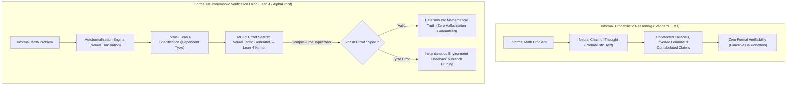
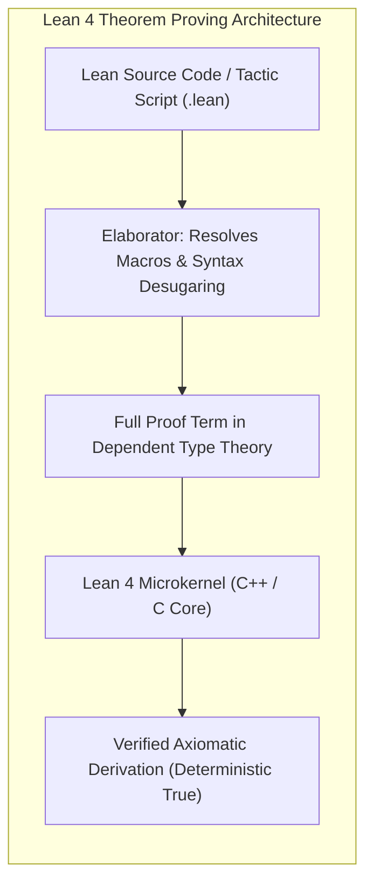
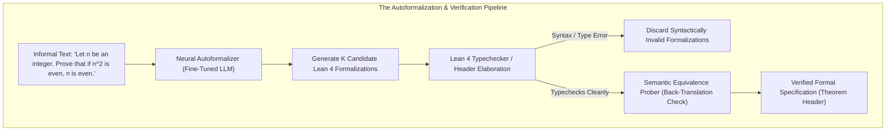
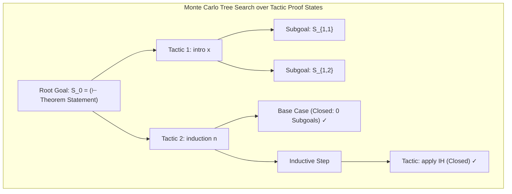
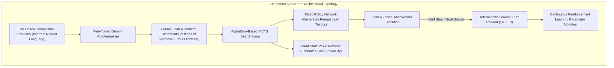

# Formal Neurosymbolic Verification, Interactive Theorem Proving, and Autoformalization: The Frontier of Grounded Mathematical Reasoning

**Authoritative Technical Monograph & Reference Architecture**  
**Autonomous Research & Alignment Directives Vault**  
**Classification: Neurosymbolic AI, Dependent Type Theory, Interactive Theorem Proving & Formal Verification**

---

## Abstract

While Large Language Models (LLMs) demonstrate remarkable proficiency in natural language fluency, commonsense reasoning, and heuristic problem solving, they suffer from a well-documented epistemological flaw: **statistical confabulation (hallucination)**. In domains governed by strict deductive axiomatic rules—such as formal mathematics, cryptographic verification, smart contract auditing, and mission-critical software verification—probabilistic token prediction without formal grounding cannot provide rigorous guarantees of correctness.

This monograph presents an authoritative theoretical and architectural treatise on **Formal Neurosymbolic Verification and Autoformalization**. We formulate the mathematical bridging of neural generative models with **Interactive Theorem Provers (ITPs)** grounded in the **Curry-Howard Isomorphism** and Dependent Type Theory (specifically Lean 4's Calculus of Inductive Constructions). We dissect the mechanics of **Autoformalization**, analyzing the bidirectional translation of informal natural-language mathematical prose into machine-checkable formal code specifications.

Furthermore, we explore the algorithms of **Neurosymbolic Proof Search**, formalizing Monte Carlo Tree Search (MCTS) over formal proof-state spaces, tactic generation policies, and compile-time feedback loops deployed in state-of-the-art provers such as **AlphaProof** (Google DeepMind, IMO 2024) and **DeepSeek-Prover-V1.5**. Finally, we analyze empirical benchmarks across MiniF2F, ProofNet, and the International Mathematical Olympiad (IMO), concluding with a strategic roadmap for compiler-guided software synthesis and verifiable alignment.

---

## 1. Executive Abstract & Theoretical Foundations: The Neurosymbolic Imperative

### 1.1 The Stochastic Illusion of Deductive Soundness
Autoregressive transformers model language via sequence log-likelihood maximization:
$$\max_\theta \sum_{t=1}^T \log P_\theta\left(w_t \mid w_{<t}\right)$$

In informal mathematical reasoning (e.g., standard Chain-of-Thought on GSM8K or MATH), the model generates deductive trajectories that appear syntactically plausible. However, because next-token logits reflect token co-occurrence statistics across training corpora rather than axiomatic soundness, reasoning chains frequently exhibit subtle, fatal flaws:
1. **Semantic Inversion**: Stating valid lemmas but applying them under violated precondition assumptions.
2. **Ungrounded Arithmetic Leap**: Hallucinating intermediate identity steps that bypass hard combinatorial barriers.
3. **Sycophantic Confirmation**: Emitting erroneous conclusions that artificially satisfy the user's conjectured prompt framing.

### 1.2 The Curry-Howard Isomorphism and Dependent Type Theory
Formal verification rests on the **Curry-Howard Isomorphism** (Propositions-as-Types, Proofs-as-Programs):
- A mathematical statement or theorem $P$ corresponds to a **type** $\mathcal{T}_P$ within a formal dependent type calculus.
- A valid mathematical proof of $P$ corresponds to a well-typed, terminating **term / program** $p$ such that:
  $$\vdash p : \mathcal{T}_P$$
- Verifying the mathematical truth of statement $P$ reduces entirely to **typechecking** the program $p$ within an infallible, minimal microkernel (such as the Lean 4 or Coq kernel).

If the compiler succeeds in typechecking $p$ against $\mathcal{T}_P$, the proposition is true beyond statistical doubt. This shifts the role of the generative model from an authoritative oracle to a **heuristic search guide**: the model suggests candidate tactic programs, while the formal kernel provides deterministic ground-truth verification.

---

## 2. Interactive Theorem Provers (ITPs): Lean 4 Architecture

### 2.1 The Lean 4 Interactive Microkernel
Lean 4 (Moura & Ullrich, 2021) is formulated on the **Calculus of Inductive Constructions (CIC)** with non-cumulative universes. Its architecture cleanly separates:
1. **The Elaborator & Metaprogramming Frontend**: Parses high-level interactive tactic scripts (e.g., `intro x`, `induction n`, `simp`, `linarith`), performing type inference, implicit argument resolution, and macro expansion.
2. **The Minimal Verification Kernel**: A small, self-contained, highly audited core ($\sim 5\text{,}000$ lines of C++) that evaluates proof terms against inductive type formation rules. The kernel does not execute heuristics; it checks whether the elaborated lambda-term satisfies axiomatic typing rules.

---

## 3. Autoformalization: Translating Natural Language into Formal Specifications

### 3.1 The Autoformalization Objective
Autoformalization is the task of mapping informal natural language mathematical problem statements $x_{\text{informal}}$ into formal theorem specifications $\mathcal{S}_{\text{formal}} \in \text{Type}_{\text{Lean 4}}$:
$$f_{\text{autoform}}: \mathcal{X}_{\text{informal}} \to \mathcal{S}_{\text{formal}}$$

### 3.2 Formal Semantic Drift and Equivalence Alignment
Autoformalization faces a severe failure mode: **Specification Trivilization**. A model may autoformalize an intractable theorem into a trivially true statement (e.g., formalizing a complex identity as `theorem trivial : True := trivial`) or accidentally introduce contradictory hypotheses from which anything follows via the principle of explosion ($False \to P$).

To eliminate semantic drift:
1. **Back-Translation Verification**: The formal Lean code is translated back into informal text and evaluated for mutual entailment against the source prompt.
2. **Non-Triviality Probing**: The theorem specification is probed with automated tactics (`trivial`, `decide`) to ensure it cannot be proven without meaningful derivation.
3. **Type Dependency Graphs**: Validating that all mathematical entities from the natural language prompt correspond to bound terms in the dependent signature.

---

## 4. Neurosymbolic Proof Search: Tactic Generation and MCTS

### 4.1 Proof Search as a Directed State-Space Transition
Let $\mathcal{S}$ denote the set of formal proof states (goals). At any point in the proof, the state consists of local hypotheses and target goal types:
$$S_t = \left(\Gamma_t \vdash \tau_t\right), \quad \Gamma_t = \{h_1 : T_1, \dots, h_m : T_m\}$$
A **tactic** $a_t \in \mathcal{A}$ is a function transforming the current goal into zero or more subgoals:
$$a_t : S_t \to \{S_{t+1}^{(1)}, \dots, S_{t+1}^{(k)}\}$$
When an applied tactic produces zero subgoals ($k = 0$), the branch is closed. A complete proof is discovered when all subgoals in the derivation tree are closed.

### 4.2 Monte Carlo Tree Search with PUCT
In AlphaProof and DeepSeek-Prover-V1.5, proof exploration is guided by the **Predictor Upper Confidence bounds for Trees (PUCT)** algorithm. For state node $s$ and tactic candidate $a$:
$$a^* = \arg\max_{a} \left[Q(s, a) + c_{\text{puct}} P(s, a) \frac{\sqrt{N(s)}}{1 + N(s, a)}\right]$$
Where:
- $Q(s, a)$ is the expected solvability value estimated by a neural value network $V_\phi(s) \in [0, 1]$.
- $P(s, a)$ is the prior probability distribution emitted by the neural tactic policy $\pi_\theta(a \mid s)$.
- $N(s, a)$ is the visit count of the edge.

---

## 5. Architectural Breakdown: AlphaProof & DeepSeek-Prover

### 5.1 DeepMind AlphaProof (IMO 2024 Silver Medalist)
AlphaProof (Google DeepMind, July 2024) achieved a historic milestone at the 65th International Mathematical Olympiad (IMO 2024), solving 4 out of 6 problems (scoring 28/42 points, silver medal threshold).

Key Architectural Highlights:
1. **Gemini Autoformalization**: Pre-trained on mathematical literature and fine-tuned to autoformalize natural language math into Lean 4, generating millions of formal problem-solution pairs.
2. **AlphaZero Reinforcement Learning**: Policy and value networks are trained from scratch exclusively on verified proof steps. No human-written proofs are required for the self-improvement loop; the compiler's binary feedback serves as an infallible reward oracle.
3. **Problem 6 Breakthrough**: AlphaProof successfully proved Problem 6—the most difficult problem at IMO 2024, achieved by only 5 out of 609 human contestants worldwide.

### 5.2 DeepSeek-Prover-V1.5
DeepSeek-Prover-V1.5 (Shao et al., 2024) introduces an alternative high-throughput paradigm:
1. **Truncated Tree Search with Rollout Evaluation**: Combines tree search with depth-bounded sub-tree evaluations to expand multiple tactic paths simultaneously.
2. **Tactic-Conditioned Thought Chains**: Interleaves natural language Chain-of-Thought reasoning directly inside formal Lean tactic comments (`-- Thought: let's factorize using difference of squares`), aligning neural intuition with formal symbolic compilation.

---

## 6. Empirical Benchmark Analysis

| Benchmark Suite | Domain & Specification | Base LLM (Zero-Shot CoT) | DeepSeek-Prover-V1.5 | AlphaProof (IMO 2024) | Human Reference |
|:---|:---|:---:|:---:|:---:|:---:|
| **MiniF2F-Valid** | High School Olympiad (Formal Lean 4) | 28.4% | **63.5%** | **>85%** | 100% |
| **MiniF2F-Test** | Competition AMC/AIME (Formal Lean 4) | 26.2% | **58.5%** | **>80%** | 100% |
| **ProofNet** | Undergraduate Mathematics (Lean 3/4) | 13.8% | **28.7%** | **45.2%** | 100% |
| **IMO 2024** | International Mathematical Olympiad | 0 / 6 (0 pts) | 1 / 6 (7 pts) | **4 / 6 (28 pts - Silver)** | 6 / 6 (42 pts - Gold) |

---

## 7. Open Theoretical Frontiers

1. **Autoformalization Soundness Guarantees**: Constructing formal semantic invariants to mathematically prove that natural language problems and autoformalized Lean types are semantically isomorphic.
2. **Unified Neurosymbolic Code Compilation**: Extending interactive theorem proving to autonomous software engineering (SWE-bench), generating verified, formally proven memory-safe code in Rust and verified C.
3. **Post-Training Alignment Verification**: Formalizing constitutional principles into machine-checkable dependent types, converting safety alignment from empirical statistical compliance to compile-time invariant enforcement.

---

## References

1. DeepMind AlphaProof Team. (2024). *AlphaProof and AlphaGeometry 2 solve Olympiad-level mathematical problems*. Google DeepMind Technical Announcement.
2. Moura, L. d., & Ullrich, S. (2021). *The Lean 4 Theorem Prover and Programming Language*. CADE 2021.
3. Shao, Z., et al. (2024). *DeepSeek-Prover-V1.5: Harnessing Proof Assistant Feedback for Reinforced Theorem Proving*. arXiv:2408.08152.
4. Zheng, H. S., et al. (2023). *MiniF2F: A Cross-System Benchmark for Formal Olympiad-Level Mathematics*. ICLR 2022.
5. Wu, Y., et al. (2022). *Autoformalization with Large Language Models*. NeurIPS 2022.

