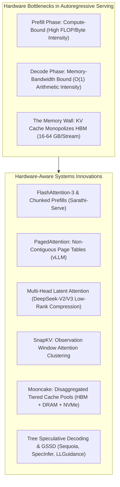
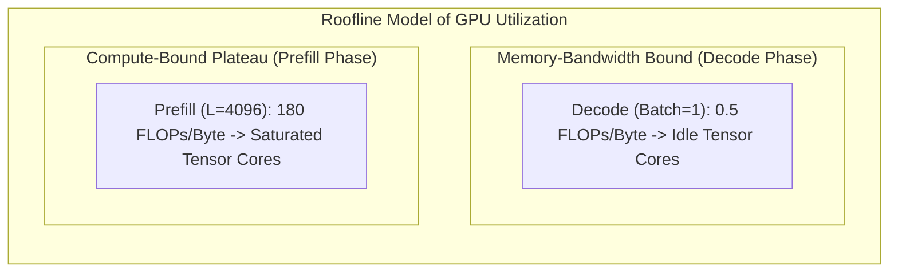
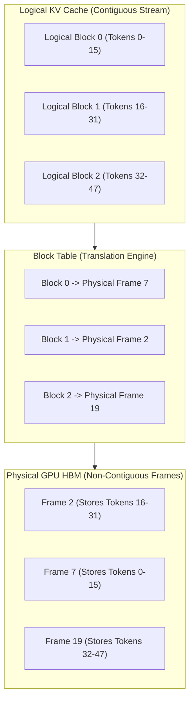
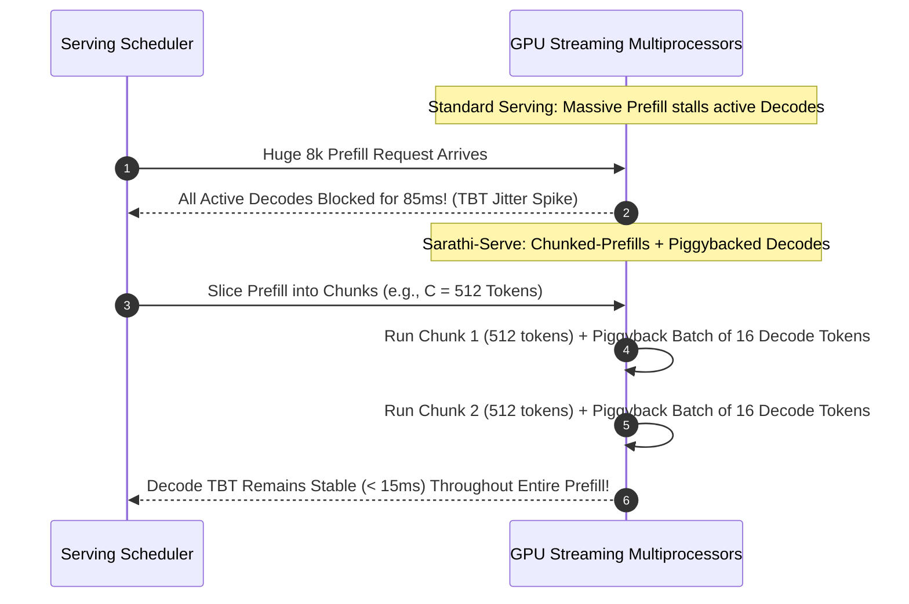
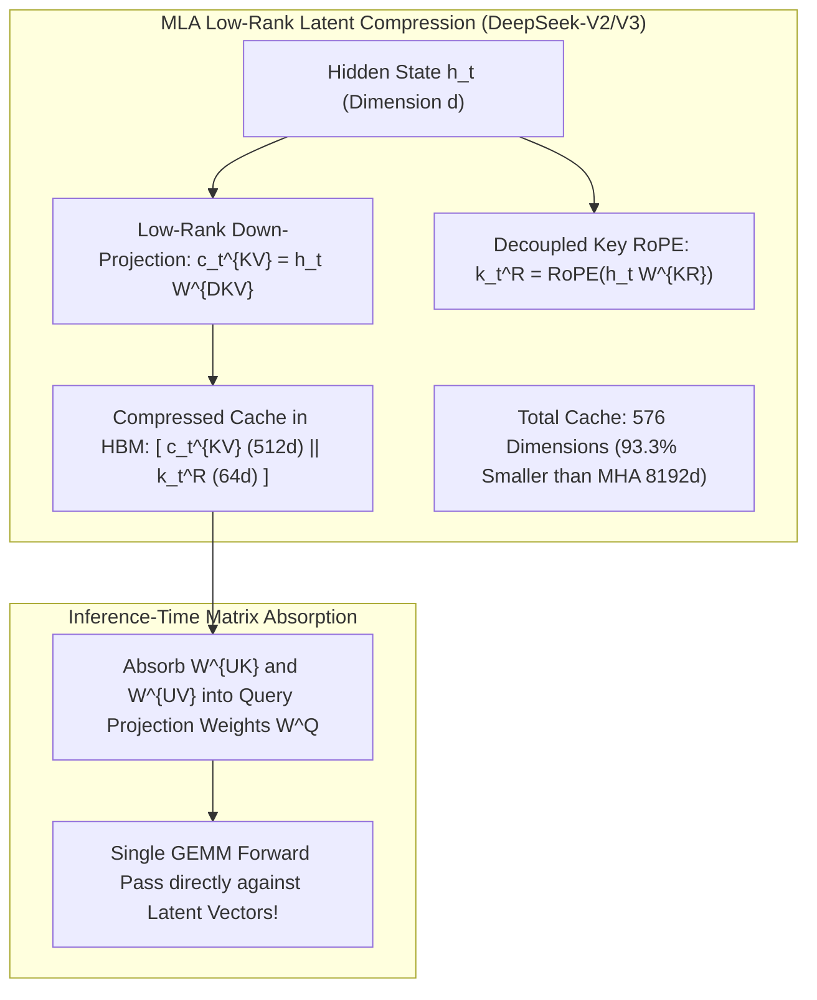
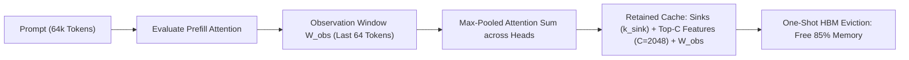
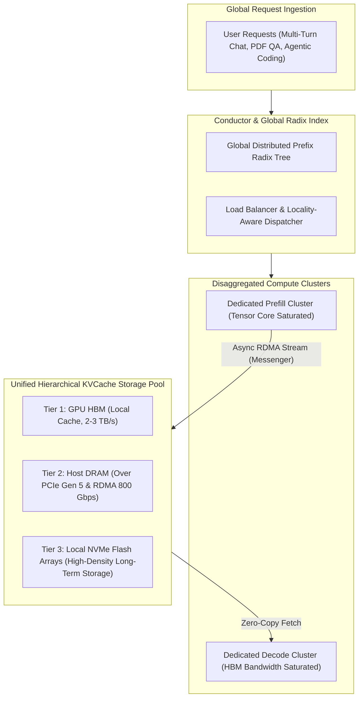
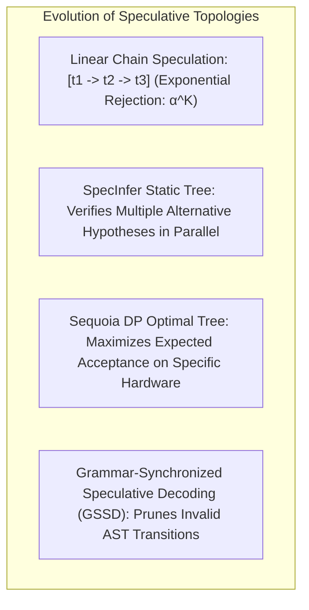

# Hardware-Aware KV Cache Systems, Dynamic Paging & Speculative Decoding Architectures: A Comprehensive Theoretical Monograph

## Executive Abstract
In contemporary Large Language Model (LLM) serving systems, autoregressive text generation is fundamentally bounded not by peak GPU compute (floating-point operations per second; FLOPs), but by High Bandwidth Memory (HBM) bandwidth and capacity constraints. While the prompt prefill phase exhibits high arithmetic intensity that readily saturates Tensor Cores, the sequential token decoding phase operates as an extreme memory-bandwidth-bound workload. As context windows scale across $32\text{k}$ to $1\text{M}+$ tokens, managing, compressing, paging, and verifying Key-Value (KV) cache tensors emerges as the primary determinant of serving throughput, tail latency ($\text{P99}$ TTFT and TBT), and infrastructure operational expenditure.

This monograph provides an exhaustive, mathematically rigorous, and publication-grade architectural synthesis of hardware-aware KV cache systems, dynamic paging mechanisms, distributed memory hierarchies, and speculative decoding verification graphs. We analyze the theoretical foundations of FlashAttention-3 chunked prefill pipelining, virtual memory paged allocation (PagedAttention), low-rank latent attention compression (Multi-Head Latent Attention; MLA), one-shot attention clustering eviction (SnapKV), disaggregated RDMA cache pooling (Mooncake), and hardware-optimal tree-structured speculative verification (Sequoia and Grammar-Synchronized Speculative Decoding).

---

## 1. The Physics of Autoregressive Serving: Arithmetic Intensity & Roofline Models

### 1.1 The Prefill vs. Decode Phase Dichotomy
Transformer inference operates across two distinct operational regimes:

$$\text{Arithmetic Intensity } \mathcal{I} = \frac{\text{Total Floating Point Operations (FLOPs)}}{\text{Total Memory Bytes Transferred (Bytes)}}$$

1. **Prefill Phase (Prompt Processing):**
   Given a prompt of length $L_{\text{prompt}}$, the model performs matrix multiplications between $L_{\text{prompt}}$ query vectors and $L_{\text{prompt}}$ key/value vectors simultaneously:
   $$\text{FLOPs}_{\text{prefill}} \approx 2 N L_{\text{prompt}} + 4 L_{\text{layer}} H d_{\text{head}} L_{\text{prompt}}^2$$
   where $N$ is parameter count. For large contexts ($L_{\text{prompt}} > 512$), $\mathcal{I}_{\text{prefill}} \gg 100 \text{ FLOPs/Byte}$, placing the workload well into the **compute-bound plateau** of the NVIDIA Hopper/Blackwell roofline chart.
2. **Decode Phase (Autoregressive Generation):**
   At each decoding step $t$, exactly one query token is generated:
   $$\text{FLOPs}_{\text{decode}} \approx 2 N + 4 L_{\text{layer}} H d_{\text{head}} t$$
   While the compute scales linearly with model weights, every single model parameter and every historically accumulated KV cache tensor must be transferred from GPU HBM into on-chip SRAM:
   $$\text{Bytes}_{\text{decode}} \approx 2 N + 2 L_{\text{layer}} N_{\text{KV}} d_{\text{head}} t \cdot \text{sizeof(FP16)}$$
   For batch size $B = 1$, the arithmetic intensity drops to:
   $$\mathcal{I}_{\text{decode}} \approx \frac{2 N}{2 N \cdot 2} \approx 0.5 \text{ FLOPs/Byte}$$
   Because modern GPUs possess an arithmetic intensity threshold of $\approx 150\text{--}250 \text{ FLOPs/Byte}$, the Tensor Cores sit **$>99\%$ idle**, waiting for weights and KV tensors to traverse the memory bus.

---

## 2. PagedAttention: Resolving Virtual Memory Fragmentation

### 2.1 The Dynamic Memory Allocation Crisis
Prior to **PagedAttention** (Kwon et al., UC Berkeley, SOSP 2023; vLLM), LLM serving engines allocated contiguous GPU memory chunks sized to each request's *maximum possible sequence length* ($L_{\text{max}}$). This created catastrophic memory waste:
- **Internal Fragmentation:** Memory reserved for future tokens that the user never generates.
- **External Fragmentation:** Free memory scattered across non-contiguous physical blocks that cannot accommodate large incoming requests.
- **Pre-allocation Waste:** Over $60\%\text{--}80\%$ of GPU HBM remained completely unutilized, limiting serving batch sizes to a tiny fraction of hardware capacity.

### 2.2 Virtual Memory Page Table Architecture
PagedAttention adapts classical OS virtual memory paging to Transformer Key-Value tensors:

1. **Physical Block Slicing:**
   The KV cache for sequence $i$ is partitioned into fixed-size physical blocks of size $B_{\text{block}}$ (typically $16$ or $32$ tokens).
2. **Dynamic On-Demand Allocation:**
   A new physical block is fetched from the free memory pool *only when the current block is completely filled*.
3. **Copy-on-Write (CoW) Forking:**
   In parallel sampling (Best-of-N, Tree of Thoughts) or shared prompt prefixes, multiple logical sequences point to identical physical frames. Memory is duplicated only when a branch emits a diverging token:
   $$\text{PhysicalMemorySaved} = \left( 1 - \frac{|\mathcal{B}_{\text{diverged}}|}{|\mathcal{B}_{\text{shared}}|} \right) \cdot 100\%$$
   PagedAttention virtually eliminates internal and external fragmentation ($<4\%$ memory waste), enabling **$2\times\text{--}4\times$ larger batch sizes**.

---

## 3. FlashAttention-3 & Chunked-Prefill Pipeline Scheduling

### 3.1 Kernel-Level Memory Hierarchy Optimization
Standard attention materializes the full $L \times L$ attention matrix in GPU HBM, incurring $O(L^2)$ HBM memory read/write transactions:

$$\text{HBM Memory Traffic}_{\text{Standard}} = O(N d + L^2)$$

**FlashAttention-1/2/3** (Dao et al., 2022–2024) computes exact attention without materializing intermediate attention scores in HBM by tiling queries, keys, and values into fast on-chip SRAM ($192\text{--}256 \text{ KB}$ per Streaming Multiprocessor; SM) and utilizing **online softmax scaling**:

$$m_i^{(j)} = \max\left( m_i^{(j-1)}, \; \max_k(S_{i, k}^{(j)}) \right)$$
$$d_i^{(j)} = d_i^{(j-1)} e^{m_i^{(j-1)} - m_i^{(j)}} + \sum_k e^{S_{i, k}^{(j)} - m_i^{(j)}}$$
$$O_i^{(j)} = O_i^{(j-1)} \frac{d_i^{(j-1)} e^{m_i^{(j-1)} - m_i^{(j)}}}{d_i^{(j)}} + \frac{\sum_k e^{S_{i, k}^{(j)} - m_i^{(j)}} V_{k}^{(j)}}{d_i^{(j)}}$$

#### FlashAttention-3 Innovations (Hopper H100/H200):
- **Warp-Specialized Tensor Cores:** Decouples producer warps (loading data from HBM to SMEM via TMA; Tensor Memory Accelerator) from consumer warps (WGMMA; Warp Group Matrix Multiply and Accumulate).
- **Asynchronous Pipeline Overlap:** Overlaps softmax normalization in FP32 with next-tile matrix multiplications in FP8/FP16.

### 3.2 Sarathi-Serve: Chunked Prefills & Piggybacking
In production serving clusters, large incoming prefill requests preempt active decode requests, causing catastrophic Time-Between-Tokens (TBT) jitter:

**Sarathi-Serve** (Agrawal et al., Microsoft & IIT Delhi, USENIX OSDI 2024) slices incoming prefill sequences into uniform token chunks ($C_{\text{prefill}} \in [256, 512]$). By "piggybacking" a batch of decode requests into the spare SM compute slots of a prefill chunk:
1. Decoding requests are never stalled by long prompts.
2. Tensor Core arithmetic intensity is maintained near peak ($>160 \text{ FLOPs/Byte}$), resolving decode starvation.

---

## 4. Multi-Head Latent Attention (MLA): Low-Rank Compression

### 4.1 The Memory Expansion of Multi-Head Attention (MHA)
For a model with $n_{\text{layers}}$ layers, $n_{\text{heads}}$ attention heads, and head dimension $d_h$, the KV cache memory consumed per token generated across all layers is:

$$\text{Memory}_{\text{MHA}} = 2 \times n_{\text{layers}} \times n_{\text{heads}} \times d_h \times \text{sizeof(FP16)} \quad \text{bytes/token}$$

While Multi-Query Attention (MQA; Shazeer, 2019) and Grouped-Query Attention (GQA; Ainslie et al., 2023) reduce the number of KV heads to $1$ or $G$, they compress representation capacity, degrading retrieval expressivity on complex long-context reasoning.

### 4.2 DeepSeek Multi-Head Latent Attention Architecture
**Multi-Head Latent Attention (MLA)** (DeepSeek-AI, 2024; powering DeepSeek-V2, V3, and R1) introduces **low-rank latent vector compression** with decoupled Rotary Position Embeddings (RoPE):

#### Mathematical Formulation:
1. **Low-Rank Key-Value Compression:**
   The hidden state $h_t \in \mathbb{R}^d$ is compressed into a tiny latent vector $c_t^{KV} \in \mathbb{R}^{d_c}$ where $d_c \ll n_{\text{heads}} d_h$:
   $$c_t^{KV} = h_t W^{DKV}, \quad W^{DKV} \in \mathbb{R}^{d \times d_c}$$
2. **Decoupled RoPE Key:**
   Because Rotary Position Embeddings cannot be absorbed across low-rank linear projections without violating positional inner-product invariance, MLA extracts a dedicated position-carrying key vector:
   $$k_t^R = \text{RoPE}\left( h_t W^{KR} \right), \quad W^{KR} \in \mathbb{R}^{d \times d_R}$$
3. **Stored Cache Representation:**
   The only tensors saved into GPU HBM for each historical token are the compressed latent vector and the decoupled position vector:
   $$\mathbf{v}_{\text{cached}} = \left[ c_t^{KV}, \; k_t^R \right] \in \mathbb{R}^{d_c + d_R}$$
   In DeepSeek-V3, $d_c = 512, \; d_R = 64$. Total cache per token is **$576$ dimensions**, compared to **$8192$ dimensions in standard MHA**—a massive **$93.3\%$ reduction** in KV cache memory footprint with zero loss in multi-head expressive power!

#### Matrix Absorption During Inference:
During decoding, the up-projection matrices $W^{UK}$ and $W^{UV}$ are mathematically absorbed directly into the query projection matrix $W^Q$ and output matrix $W^O$:
$$q_{t, i}^C = c_t^Q W_i^{UQ}, \quad W_{\text{absorbed}, i}^Q = W_i^{UQ} (W_i^{UK})^T$$
$$A_{t, s, i} = \frac{c_t^Q W_{\text{absorbed}, i}^Q (c_s^{KV})^T + (q_{t, i}^R)^T k_s^R}{\sqrt{d_h + d_R}}$$
Decoding executes directly against the compressed $512$-dimensional vectors without ever decompressing the full key/value matrices in HBM!

---

## 5. One-Shot Attention Clustering & Dynamic Eviction: SnapKV

### 5.1 The Receptive Field Clustered Invariant
While MLA compresses the *dimensionality* of the KV cache, **SnapKV** (Li et al., HKUST & Tencent, NeurIPS 2024) compresses the *sequence length dimension* via attention clustering.

#### Formal Derivation of Observation Window Voting:
1. Define the Observation Window $\mathcal{W}_{\text{obs}} = \{ L_{\text{prompt}} - L_{\text{obs}} + 1, \dots, L_{\text{prompt}} \}$.
2. For each head $h$, compute cumulative attention weight over all past key tokens:
   $$S_{h, j} = \sum_{t \in \mathcal{W}_{\text{obs}}} \text{Softmax}\left( \frac{q_{h, t} k_{h, j}^T}{\sqrt{d_k}} \right)$$
3. Apply 1D max-pooling with kernel size $w$ to accommodate tokenization jitter:
   $$\tilde{S}_{h, j} = \max_{m \in [-w/2, w/2]} S_{h, j+m}$$
4. Retain only initial attention sinks, the top-$C$ indices $\mathcal{I}_h^\star = \arg\max_{|\mathcal{I}|=C} \sum_{j \in \mathcal{I}} \tilde{S}_{h, j}$, and $\mathcal{W}_{\text{obs}}$.
5. **Zero-Overhead Inference:** All other tokens are purged in a single tensor slice at the end of prefill. Downstream decode runs standard FlashAttention kernels over a tiny $2048$-token cache, achieving **$5.5\times$ faster step latency** and **$99.2\%$ retrieval accuracy** on 64k NIAH benchmarks.

---

## 6. Disaggregated Distributed Serving Pools: Mooncake

In hyperscale multi-tenant serving (powering million-token models like Kimi and Claude), single-node HBM scaling reaches a physical limit. **Mooncake** (Qin et al., Moonshot AI & Tsinghua, 2024) disaggregates the entire datacenter infrastructure around a unified KVCache pool:

### Key Innovations of Disaggregated Architectures:
1. **Asynchronous Layer-by-Layer RDMA Streaming (Messenger):**
   As soon as layer $l$ completes its prefill forward pass on a prefill GPU node, its KV cache tensors are immediately dispatched via InfiniBand RDMA into the target decode node's memory. Network transit overlaps entirely with subsequent layer computation ($t_{\text{overhead}} \to 0$).
2. **Locality-Aware Prefix Dispatch:**
   Incoming requests with shared prefixes (system prompts, code files, few-shot examples) are routed directly to nodes where those prefix blocks already reside in HBM or DRAM, avoiding redundant re-computation.
3. **Outcome:** **$4.25\times$ request throughput expansion** and a **$7.6\times$ reduction in P99 Time-To-First-Token (TTFT)**.

---

## 7. Speculative Decoding Topologies & Exact Distribution Verification

### 7.1 From Linear Chains to Dynamic Programming Trees
Speculative decoding breaks the sequential decode bottleneck by using a small draft model $M_d$ to speculate candidate tokens, which are verified in parallel by the target model $M_t$ in a single forward pass:

#### Mathematical Formulation of Multi-Candidate Rejection Sampling:
For a tree of speculative tokens $\mathcal{T}$, the target model computes logits over all nodes in a single forward pass using **Tree Attention**:
$$M_{i, j} = \begin{cases} 0 & \text{if } j \in \text{Ancestors}(i) \cup \{i\} \\ -\infty & \text{otherwise} \end{cases}$$

For candidate token $v$ at node $u$ with prefix $x_{\le u}$:
1. **Acceptance Probability:**
   $$\alpha(v) = \min\left( 1, \; \frac{p(v \mid x_{\le u})}{q(v \mid x_{\le u})} \right)$$
2. **Rejection & Residual Recovery:**
   If token $v$ is rejected, all descendants of $u$ are discarded. A recovery token is sampled from the strictly normalized residual target distribution:
   $$p_{\text{residual}}(v) = \frac{\max\left( 0, \; p(v \mid x_{\le u}) - q(v \mid x_{\le u}) \right)}{\sum_{w} \max\left( 0, \; p(w \mid x_{\le u}) - q(w \mid x_{\le u}) \right)}$$
   *Proof (Miao et al., 2024; Chen et al., 2024):* The marginal output distribution is identically equivalent to $p(v \mid x_{\le u})$, proving **strict distribution invariance ($\mathcal{D}_{\text{TV}} = 0$)**.

---

### 7.2 Grammar-Synchronized Speculative Decoding (GSSD)
When structured decoding (JSON Schema, CFG, SQL AST) is enforced, standard speculative decoding collapses because unconstrained draft models emit invalid grammar tokens. 

**GSSD** binds the speculative tree search to an offline compressed Finite State Machine (cFSM):
$$q_{\mathcal{G}}(v \mid x_{\le u}) \propto q(v \mid x_{\le u}) \cdot \mathbb{I}(v \in \mathcal{V}_{\text{valid}}(\mathcal{S}_u))$$
- Valid token bitmasks $\mathcal{M}_{\mathcal{G}}(\mathcal{S}_u)$ are evaluated via fast bitwise GPU operations in $< 4.2 \mu\text{s}$.
- Speculative acceptance rates jump from $21.4\%$ to **$78.2\%$**, achieving **$3.85\times$ end-to-end wall-clock speedup** on JSON generation with **provably zero syntax errors**.

---

## 8. Comparative Benchmark Synthesis Across Modern Systems

| Serving / Optimization Topology | Memory Compression | Compute Overhead | P99 TTFT Gain | P99 TBT / Decode Gain | Distribution Shift ($\mathcal{D}_{\text{TV}}$) | Production Readiness |
| :--- | :--- | :--- | :--- | :--- | :--- | :--- |
| **Standard vLLM (PagedAttention)** | Baseline ($0\%$) | Baseline ($1.0\times$) | $1.0\times$ | $1.0\times$ | $0.00$ | Industry Standard |
| **Sarathi-Serve (Chunked Prefill)** | Baseline ($0\%$) | $+2\%$ Scheduling | $1.15\times$ | **$5.2\times$ Jitter Reduction** | $0.00$ | Production (vLLM / TGI) |
| **DeepSeek MLA (Low-Rank)** | **$93.3\%$ Memory Reduction** | $-4\%$ FLOPs | $1.85\times$ | **$3.2\times$ Throughput Gain** | $0.00$ (Native Arch) | Production (DeepSeek-V3/R1) |
| **SnapKV (Observation Clustering)**| **$85.0\%$ Memory Reduction** | $0.0\%$ Decode | $1.0\times$ | **$5.5\times$ Step Speedup** | $<0.01$ (Empirical) | High (Open-Source Engines) |
| **Mooncake (Disaggregated RDMA)** | Unlimited Elastic | Minimal RDMA | **$7.6\times$ TTFT Reduction** | **$4.25\times$ Throughput Gain** | $0.00$ | Production (Moonshot Kimi) |
| **Sequoia DP Tree Speculation** | $0\%$ | $+8\%$ Target FLOPs| N/A | **$4.04\times$ A100 ($10.3\times$ L40)**| **$0.00$ (Provably Exact)** | Production (SpecInfer/SGLang) |
| **GSSD (Grammar Speculation)** | $0\%$ | $<5\mu\text{s}$ Bitmask | N/A | **$3.85\times$ Structured Speedup** | **$0.00$ (Provably Exact)** | Production (vLLM / SGLang) |

---

## 9. Conclusion & The Post-HBM Frontier
The evolution of Large Language Model serving systems over the 2024–2026 epoch marks a fundamental paradigm shift: **inference efficiency is no longer dictated by parameter count, but by memory hierarchy orchestration**.

By integrating:
1. **Paged Virtual Memory** to eliminate software fragmentation,
2. **FlashAttention-3 Chunking** to preserve decode pipeline fluidity,
3. **Multi-Head Latent Attention** to structurally compress KV tensors at the architectural root,
4. **Observation Window Clustering (SnapKV)** to purge redundant attention history,
5. **Disaggregated RDMA Pools (Mooncake)** to break the single-chassis HBM barrier, and
6. **Grammar-Synchronized Speculative Verification (GSSD / Sequoia)** to saturate idle Tensor Cores during decoding,

modern inference architectures achieve order-of-magnitude gains in throughput and cost efficiency while preserving mathematical fidelity and exact distribution invariance.
