# Latent Mechanics Dossier: Mechanistic Interpretability

## 1. Introduction
Mechanistic Interpretability (MI) is a subfield of AI alignment and interpretability dedicated to reverse-engineering neural networks. The primary objective is to transition from treating Large Language Models (LLMs) as opaque "black boxes" to understanding the causal mechanisms and internal circuits that drive their behavior. By isolating specific features, interventions, and failure modes, researchers aim to gain precise control over LLM behavior and ensure safer, more reliable deployments. Three critical areas of recent focus include the study of "glitch tokens," the application of "activation steering," and the use of "Sparse Autoencoders" (SAEs) to disentangle internal representations.

## 2. Glitch Tokens: Anomalies in the Embedding Space
**Definition and Origins:**
Glitch tokens are specific input sequences—often obscure or seemingly random strings (e.g., "SolidGoldMagikarp", "PsyNetMessage")—that cause LLMs to exhibit highly erratic, unexpected, or nonsensical behavior. These tokens typically exist within the model's tokenizer vocabulary but were severely under-represented or out-of-distribution during the pre-training phase. As a result, the model fails to learn coherent, robust representations for them.

**Role in Mechanistic Interpretability:**
In MI, glitch tokens serve as vital edge cases for mapping the embedding space. Researchers observe that glitch tokens often cluster together in latent space. When processed, they cause anomalous activation patterns during the forward pass.
- **Diagnostics:** Tools like *TransformerLens* allow researchers to hook into the model and analyze how activations diverge when processing normal versus glitch tokens.
- **Intervention Techniques:** Recent research (such as Zero-Gradient/ZG-STR methods) explores injecting correction vectors into the internal activations at inference time. This repairs the effects of glitch tokens without requiring full model retraining.
- **Tokenization Awareness:** The existence of these tokens highlights how models map vocabulary and handle unstable patterns, occasionally developing specific features to manage out-of-distribution tokenizer artifacts.

## 3. Activation Steering: Dynamic Control of the Residual Stream
**Core Concepts:**
Activation steering (or representation engineering) is an inference-time technique that directly manipulates the internal states of an LLM to influence its output. Instead of fine-tuning weights, steering modifies the hidden states within the model's residual stream. 

**Mechanics:**
The fundamental operation involves adding a "steering vector" ($v$) to the original activation ($h_{old}$), scaled by a coefficient ($c$): $h_{new} = h_{old} + c \cdot v$. 
- **Deriving Vectors:** The steering vector $v$ is typically computed by taking the difference between the mean activations of contrasting prompts (e.g., helpful vs. refusal, or polite vs. toxic).
- **Behavioral Nudging:** Because LLMs often encode high-level concepts as linear directions in their high-dimensional latent space, injecting these vectors reliably "nudges" the model toward the target concept.

**Challenges and Research Frontiers:**
While activation steering is highly effective for simple stylistic or tonal adjustments, it faces challenges with complex tasks like factual recall. Oversteering can degrade text quality, leading to gibberish. Moreover, due to polysemanticity, steering one trait may inadvertently affect others, driving the need for more precise intervention mechanisms.

## 4. Sparse Autoencoders (SAEs): Disentangling Polysemanticity
**The Polysemanticity Problem:**
A significant hurdle in MI is polysemanticity—the phenomenon where a single neuron responds to multiple, unrelated concepts (e.g., a neuron firing for both "prime numbers" and "Renaissance art"). This happens because of "superposition," where the model compresses more features into its layers than it has dimensions by using non-orthogonal directions.

**SAEs as a Solution:**
Sparse Autoencoders (SAEs) have emerged as the primary tool to disentangle these superimposed representations into human-interpretable, monosemantic features. 
- **Mechanism:** An SAE is trained post-hoc on the frozen LLM's activations. It projects the hidden states into a much higher-dimensional (overcomplete) space. By applying a sparsity penalty (e.g., L1 regularization or Top-K selection), the SAE forces the representation to use only a small subset of features for any given input.
- **Feature Discovery:** The resulting sparse features often align with distinct, understandable concepts (e.g., specific objects, syntactic structures, or abstract intents like deception).
- **Advanced Applications:** Once features are mapped via an SAE, they can be used for highly targeted behavioral steering. Researchers are also developing specialized SAEs (to find rare "dark matter" features) and RouteSAEs (to capture multi-layer feature representations), making models substantially more transparent.

## 5. Synthesis
The intersection of glitch tokens, activation steering, and Sparse Autoencoders represents a cohesive toolkit for understanding and controlling LLMs. Glitch tokens expose the vulnerabilities and structural anomalies in the model's foundational embeddings. Sparse Autoencoders provide the "dictionary" needed to cleanly read and disentangle the dense, superimposed states within the residual stream. Finally, activation steering leverages this understanding, allowing researchers to surgically intervene and manipulate those states in real-time. Together, these mechanics offer a pathway toward fully interpretable, steerable, and aligned AI systems.

***

## 6. Latent Compression & Machine-to-Machine Dialects

### 6.1 The Transition to Non-Human Prompting
Standard prompt engineering assumes that LLMs should be instructed using natural human languages (e.g., English). However, models process information as high-dimensional vectors. When humans write prompts, they include vast amounts of linguistic filler, syntax, and polite framing that lower the information density of the context window. Latent compression techniques aim to strip away this inefficiency, creating dense, machine-optimized dialects that look like gibberish to humans but maximize downstream inference accuracy.

### 6.2 LLMLingua and Entropy-Based Compression
**Mechanism:**
LLMLingua (developed by Microsoft) is a prominent framework for coarse-to-fine prompt compression. It operates on the principle of information theory: a smaller, faster "evaluator" language model calculates the perplexity (or entropy) of each token in a large prompt.
- Tokens that are highly predictable given the preceding context (low entropy) are dynamically pruned.
- Tokens carrying high surprisal/information content (high entropy) are retained.

**Results:**
The compressed prompt often appears completely ungrammatical (e.g., dropping articles, verbs, and punctuation). However, because the target LLM shares similar pre-training distributions, it can reconstruct the original semantic intent perfectly. This allows for 10x-20x compression of RAG contexts or system prompts, drastically reducing inference cost and latency while mitigating the "Lost in the Middle" attention decay.

### 6.3 Soft-Prompt Tuning and Continuous Embeddings
While LLMLingua compresses discrete text tokens, **Soft-Prompt Tuning** discards natural language entirely in favor of continuous vectors.

**Prefix Tuning & P-Tuning v2:**
- Instead of manually discovering discrete text tokens (a computationally hard, non-differentiable problem), researchers prepend trainable continuous embedding vectors to the input sequence (or across all Transformer layers, as in P-Tuning v2).
- During training, the base LLM remains entirely frozen. Only the prepended "soft prompt" vectors are updated via gradient descent to minimize the loss on a specific task.
- **Significance:** These continuous vectors act as highly compressed, task-specific instructions. They significantly outperform manually crafted "hard prompts" because they optimize directly in the continuous latent space, finding activation pathways that no combination of English words could trigger.

### 6.4 The Future of Agentic Communication
The empirical success of these methods demonstrates that future multi-agent architectures (where AI agents delegate tasks to other AI agents) will likely abandon natural language. Instead, they will exchange compressed latent vectors or highly entropic token sequences, maximizing context-window efficiency and minimizing semantic drift.

***

## 7. Constrained Decoding Architectures & State-Machine Prompting

### 7.1 The Problem of Nondeterministic Drift
Historically, prompt engineering has relied on natural language coercion to enforce output structures (e.g., "You must return valid JSON," or providing multiple few-shot examples of a JSON schema). Despite these prompts, LLMs are fundamentally autoregressive probabilists; they suffer from nondeterministic drift, where they may occasionally prepend conversational filler like "Here is your JSON:" or hallucinate a trailing comma, breaking downstream data pipelines. 


***

## 6. Latent Compression & Machine-to-Machine Dialects

### 6.1 The Transition to Non-Human Prompting
Standard prompt engineering assumes that LLMs should be instructed using natural human languages (e.g., English). However, models process information as high-dimensional vectors. When humans write prompts, they include vast amounts of linguistic filler, syntax, and polite framing that lower the information density of the context window. Latent compression techniques aim to strip away this inefficiency, creating dense, machine-optimized dialects that look like gibberish to humans but maximize downstream inference accuracy.

### 6.2 LLMLingua and Entropy-Based Compression
**Mechanism:**
LLMLingua (developed by Microsoft) is a prominent framework for coarse-to-fine prompt compression. It operates on the principle of information theory: a smaller, faster "evaluator" language model calculates the perplexity (or entropy) of each token in a large prompt.
- Tokens that are highly predictable given the preceding context (low entropy) are dynamically pruned.
- Tokens carrying high surprisal/information content (high entropy) are retained.

**Results:**
The compressed prompt often appears completely ungrammatical (e.g., dropping articles, verbs, and punctuation). However, because the target LLM shares similar pre-training distributions, it can reconstruct the original semantic intent perfectly. This allows for 10x-20x compression of RAG contexts or system prompts, drastically reducing inference cost and latency while mitigating the "Lost in the Middle" attention decay.

### 6.3 Soft-Prompt Tuning and Continuous Embeddings
While LLMLingua compresses discrete text tokens, **Soft-Prompt Tuning** discards natural language entirely in favor of continuous vectors.

**Prefix Tuning & P-Tuning v2:**
- Instead of manually discovering discrete text tokens (a computationally hard, non-differentiable problem), researchers prepend trainable continuous embedding vectors to the input sequence (or across all Transformer layers, as in P-Tuning v2).
- During training, the base LLM remains entirely frozen. Only the prepended "soft prompt" vectors are updated via gradient descent to minimize the loss on a specific task.
- **Significance:** These continuous vectors act as highly compressed, task-specific instructions. They significantly outperform manually crafted "hard prompts" because they optimize directly in the continuous latent space, finding activation pathways that no combination of English words could trigger.

### 6.4 The Future of Agentic Communication
The empirical success of these methods demonstrates that future multi-agent architectures (where AI agents delegate tasks to other AI agents) will likely abandon natural language. Instead, they will exchange compressed latent vectors or highly entropic token sequences, maximizing context-window efficiency and minimizing semantic drift.

***

## 7. Constrained Decoding Architectures & State-Machine Prompting

### 7.1 The Problem of Nondeterministic Drift
Historically, prompt engineering has relied on natural language coercion to enforce output structures (e.g., "You must return valid JSON," or providing multiple few-shot examples of a JSON schema). Despite these prompts, LLMs are fundamentally autoregressive probabilists; they suffer from nondeterministic drift, where they may occasionally prepend conversational filler like "Here is your JSON:" or hallucinate a trailing comma, breaking downstream data pipelines. 

### 7.2 Finite State Automata (FSA) and Grammar Constraints
**Constrained Decoding** shifts the burden of structural compliance away from the prompt and onto the inference engine itself. Frameworks like **Outlines** (`dottxt-ai/outlines`), **SGLang**, and **Guidance** implement this shift.
- **Mechanism:** The desired output structure (defined via Regex, Pydantic models, JSON Schema, or EBNF grammar) is compiled into a Finite State Automaton (FSA). 
- **Logit Masking:** During the decoding phase, before the model samples the next token, the FSA evaluates which tokens in the model's vocabulary are valid continuations of the current state. Any token that violates the grammar is dynamically masked (its logit is set to $-\infty$).
- **Result:** It becomes mathematically impossible for the LLM to generate a syntax error. The model is forced onto rigid structural rails at the sampling level.

### 7.3 Invalidating Traditional Prompt Formatting
The advent of constrained decoding radically alters best practices in prompt engineering:
- **Zero-Shot Structure:** Developers no longer need to waste context window tokens on few-shot formatting examples. 
- **Cognitive Allocation:** Because the model cannot fail at formatting, the prompt can be dedicated entirely to semantic reasoning and logic constraints.
- **Efficiency:** The LLM does not need to learn *how* to format output during inference; the deterministic engine handles it, effectively turning the LLM from a free-text generator into a deterministic state-machine transition engine.

***

## 8. Frontier Mechanistic Interpretability: JumpReLU SAEs, Gemma Scope, and Skip-Transcoders (2024–2025)

### 8.1 The Sparsity-Fidelity Trade-off in Dictionary Learning
Traditional Sparse Autoencoders (SAEs) decompose dense, polysemantic residual activations $x \in \mathbb{R}^d$ into an overcomplete, monosemantic feature dictionary $f(x) \in \mathbb{R}^m$ ($m \gg d$) via an L1-penalized reconstruction loss. However, standard L1 regularization introduces feature shrinkage—penalizing large feature activations and causing severe reconstruction distortion, which impairs downstream steering fidelity.

### 8.2 JumpReLU SAE Architecture
Introduced by Google DeepMind and Rajamanoharan et al. (2024) in **Gemma Scope**, JumpReLU replaces standard continuous activations with a discontinuous, threshold-gated activation function:
$$\text{JumpReLU}(z; \theta) = z \cdot \mathbb{I}(z > \theta)$$
- **Discontinuous Thresholding:** Features activate only when the pre-activation $z$ strictly exceeds a learned, per-feature threshold $\theta > 0$. Once active, the feature retains its true unpenalized magnitude, completely eliminating L1 shrinkage.
- **Pareto-Optimal Frontier:** JumpReLU achieves Pareto-superior reconstruction accuracy at identical sparsity levels (L0 norm) compared to TopK SAEs and standard ReLU autoencoders.

### 8.3 Gemma Scope & Gemma Scope 2 (2024–2025)
Google DeepMind released Gemma Scope as an open-access "microscope" across the Gemma 2 and Gemma 3 families (2B, 9B, 27B):
- **Universal Layer Coverage:** Provides JumpReLU SAEs trained across all residual streams, attention head outputs, and MLP sub-layers.
- **Skip-Transcoders:** Unlike standard SAEs that analyze static residual snapshots, skip-transcoders model input-output transformations across intermediate Transformer blocks, replacing entire MLP layers with sparse, interpretable linear maps.
- **Causal Feature Steering:** Enables researchers to causally patch or clamp monosemantic concept directions (e.g., factual recall circuits, deception flags, safety boundaries) with mathematically predictable behavioral steering at test time.

***

## 9. Information Bottlenecks & Gist Activation Distillation (2024–2025)

### 9.1 The Information Bottleneck Principle in Context Processing
Prompt compression can be formalized using Tishby’s **Information Bottleneck (IB)** principle:
$$\min_{p(z|x)} I(X; Z) - \beta I(Z; Y)$$
Where $X$ represents the raw natural language prompt, $Z$ is the compressed latent representation (or minimal token subset), and $Y$ is the downstream generation target. Standard human prompts exhibit high mutual information redundancy $I(X; Z)$ with respect to linguistic scaffolding (syntax, punctuation, polite qualifiers) that contributes near-zero mutual information to the task objective $I(Z; Y)$. Optimal compression discovers a minimal sufficient statistic $Z$ that preserves task prediction while minimizing sequence length.

### 9.2 Virtual Gist Tokens & Attention Bottlenecking
Mu et al. (*Gist Tokens*, NeurIPS 2023 / 2024 extensions) implement the IB principle within the Transformer's self-attention mechanism:
- **Modified Attention Masking:** Natural language prompt tokens are mapped into $K$ virtual gist tokens $\mathcal{G} = [g_1, \dots, g_K]$ inserted at prompt boundaries. An attention mask prevents subsequent response tokens from attending to the raw prompt $X$, forcing information to route exclusively through the gist bottleneck $\mathcal{G}$.
- **Cross-Attention Compaction:** For multi-turn agents, conversation history is distilled into fixed-length gist vectors cached in Key-Value memory. This compresses context by up to 26x, preserving downstream reasoning while reducing quadratic KV cache expansion to a constant $O(K)$ footprint.

***

## 10. Bitmask Automata & Zero-Overhead Grammar Constrained Decoding: XGrammar (2024–2026)

### 10.1 The Computational Cost of Naive Logit Masking
First-generation constrained decoding engines (Outlines, Guidance, Lark) relied on regex DFAs or dynamic CFG parsers that re-evaluated the entire vocabulary (32k–128k+ tokens) at every autoregressive forward pass. This per-token parsing step introduced severe latency penalties (often 10x–50x slower than unconstrained generation), rendering grammar constraints impractical for high-throughput serving and agentic loops.

### 10.2 Algorithmic Innovations in XGrammar (CMU / MLC-AI, 2024–2026)
XGrammar eliminated this bottleneck, achieving up to 100x faster execution and "near-zero overhead" structured generation adopted natively across **vLLM, SGLang, and TensorRT-LLM**:
- **Pre-Compiled Bitmask Automata:** JSON schemas and context-free grammars (CFGs) are compiled offline into optimized bitmask transition tables. Valid token transitions are represented as dense GPU bitmasks rather than evaluated through dynamic pointer-chasing parsers.
- **Vocabulary Partitioning:** Partitions vocabulary tokens into context-independent tokens (whose syntax validity depends only on the current grammar state, pre-computable as static bitmasks) and context-dependent tokens (evaluated via lightweight persistent parsing stacks).
- **Persistent Parser Stacks:** Maintains lightweight grammar execution stacks synchronized with the inference engine's KV-cache, completely avoiding redundant re-parsing during multi-token speculative verification and prefix caching.

### 10.3 Integration with Speculative Decoding & Agent Workflows
In modern agentic architectures, XGrammar bridges deterministic type safety and high inference throughput:
- **Grammar-Guided Jump-Forward Decoding:** Because fixed syntax tokens (JSON delimiters, quotation marks, boolean keywords) have deterministic transitions in the grammar automaton, XGrammar permits speculative jump-forward generation, emitting multi-token sequences in a single forward pass without sampling.
- **Structural Tags Protocol:** Standardizes tool-calling schemas and composable nested grammars for multi-agent handoffs, guaranteeing 100% syntactically valid JSON function arguments without retry loops or prompt repair costs.

***

## 11. Automated Circuit Discovery & The Induction Engine of ICL (2024–2025)

### 11.1 Induction Circuits as the Microscopic Engine of ICL
Olsson et al. (Anthropic) identified **Induction Heads** as the primary mechanistic circuit enabling in-context learning. An induction circuit implements the abstract completion rule $[A][B] \dots [A] \to [B]$ via a two-layer attention composition:
1. **Previous-Token Head (Layer $L$):** Writes the identity of the preceding token $[A]$ into the residual stream at the position of token $[B]$.
2. **Induction Head (Layer $L+1$):** At a later occurrence of token $[A]$, the query vector $q_{[A]}$ searches back across the sequence for key vectors $k_{[B]}$ written by the previous-token head. The head then attends to position $[B]$ and copies token $[B]$ via the Value-Output matrix ($W_O W_V$) to the final prediction logit.
This circuit universally emerges across transformer scale during training and coincides with sudden phase-change drops in in-context loss.

### 11.2 Automated Circuit Discovery (ACDC) & Edge Attribution Patching (EAP)
Historically, tracing circuits required human intuition and brute-force ablation of thousands of attention heads:
- **ACDC (Conmy et al., NeurIPS 2023):** Automates computational sub-graph discovery via recursive, greedy edge-pruning. Starting from the complete model graph, ACDC systematically patches corrupt activations into edges and prunes any connection whose removal does not alter task loss beyond a threshold $\tau$.
- **Edge Attribution Patching (EAP / EAP-IG, 2024):** Computes linear first-order gradient approximations ($g_e \approx \nabla_{a} \mathcal{L} \cdot \Delta a$) over clean/corrupted activation deltas. EAP recovers identical circuits to ACDC in seconds rather than GPU hours, scaling automated circuit discovery to 70B+ parameter models.
- **Contextual Decomposition for Transformers (CD-T, 2025):** Decomposes non-linear MLP and attention interactions algebraically without repeated forward-pass sampling, mapping end-to-end task circuits with zero intervention overhead.

***

## 12. Hardware-Level Prefix Routing: Chunked Prefill, Paged KV-Sharing, and Cross-Model Cache Transfer (2024–2026)

### 12.1 The Prefill Stall & Chunked Prefill Scheduling
In production serving engines (vLLM, SGLang, TensorRT-LLM), long context prompts (>8k tokens) trigger compute-bound "prefill stalls." Processing massive prompt sequences locks GPU Tensor Cores, preventing concurrent latency-sensitive token generation for other active requests and degrading Time-to-First-Token (TTFT).
- **Chunked Prefill:** Breaks long prefill prompt tokens into fixed batch chunks (e.g., 512 or 1024 tokens) and schedules them alongside ongoing token decoding steps in continuous batch iterations.
- **Latency Balancing:** Eliminates TTFT latency spikes, transforming prompt processing from a disruptive batch operation into smooth, interleaved background compute.

### 12.2 Automatic Prefix Caching & Distributed KV Storage (LMCache)
Prompt engineering architectures heavily rely on static prefix blocks: system prompts, API tool definitions, few-shot exemplars, and document repositories.
- **Physical Page Mapping:** PagedAttention assigns identical prefix tokens to shared physical memory blocks via hash-indexed block tables. Requests sharing identical prompt prefixes bypass the compute-bound prefill phase entirely, converting prompt ingestion into a constant-time memory lookup.
- **Tiered Distributed Caching (LMCache):** Extends prefix caching across heterogeneous hardware tiers (GPU HBM $\to$ Host CPU DRAM $\to$ Local NVMe SSD $\to$ Distributed Object Stores). Multi-agent systems can spin up new worker nodes with pre-warmed context caches in milliseconds.

### 12.3 Cross-Model KV Cache Transfer in LLM Families
Traditional inference architectures treated KV caches as strictly model-specific artifacts. Recent theoretical breakthroughs (2025–2026) establish that representations across different parameter sizes within the same model family (e.g., Qwen 14B to 32B, LLaMA 8B to 70B) share near-isometric latent geometries:
- **Linear Representation Mapping:** A lightweight linear projection matrix $W_{\text{trans}}$ maps Key-Value tensors from a small "draft" model directly into the KV space of a large foundation model:
  $$K_{\text{large}} \approx W_K \cdot K_{\text{small}}, \quad V_{\text{large}} \approx W_V \cdot V_{\text{small}}$$
- **Zero-Compute Handoff:** Enables small, low-latency models to ingest and compress multi-turn dialogue or massive prompts, then pass the pre-computed KV representation directly to a larger reasoning model without re-running the expensive prefill forward pass, retaining $>70-85\%$ downstream accuracy.

***

## 13. Distributional Distortion in Grammar Decoding: From Hard Masking to Grammar-Aligned Decoding (GAD) (2024–2026)

### 13.1 The Distributional Bias of Naive Logit Masking
While Grammar-Constrained Decoding (GCD) guarantees 100% syntactic validity, recent theoretical analyses reveal that naive logit masking fundamentally alters the model's posterior distribution.
Under greedy or temperature sampling with hard masks:
$$p_{\text{GCD}}(x_t \mid x_{<t}) = \frac{p(x_t \mid x_{<t}) \cdot \mathbb{I}(x_t \in \mathcal{V}_{\text{valid}})}{\sum_{v \in \mathcal{V}_{\text{valid}}} p(v \mid x_{<t})}$$
Because normalization occurs locally per token without lookahead, a token that appears locally probable can trap the generator in future syntactic dead ends or force it into low-probability semantic branches. Consequently, the output distribution $p_{\text{GCD}}(x_{1:T})$ significantly diverges from the true grammar-conditional distribution $p(x_{1:T} \mid x \in \mathcal{L}(\mathcal{G}))$, causing semantic degradation and reasoning failures in structured QA.

### 13.2 Grammar-Aligned Decoding (GAD) & The ASAp Algorithm
To eliminate local distributional distortion, **Grammar-Aligned Decoding (GAD)** (2024–2025) incorporates future reachable validity:
- **Adaptive Sampling with Approximate Expected Futures (ASAp):** Estimates the probability that a currently candidate token $x_t$ permits a valid completion of length $T$ that preserves semantic fidelity.
- **Lookahead Correction:** Re-weights local candidate logits by their expected future probability mass under the grammar $\mathcal{G}$, ensuring that samples strictly match the true joint conditional distribution without semantic degradation.

### 13.3 Grammar-Constrained Speculative Decoding (LMS Decoders)
In high-throughput speculative decoding (Leviathan-style Local-Mask Speculative / LMS):
- **Deterministic Token Leapfrogging:** Grammar states with out-degree 1 (e.g., fixed JSON syntax `": "`, `"status": "`, `}`) are emitted deterministically by draft models with an empirical acceptance rate of **100%**.
- **Distribution-Preserving Verification:** Target models verify speculative draft tokens against both the language model logits and the grammar state machine in parallel, accelerating structured agentic workflows by 2.5x–4.5x with provable distributional guarantees.

***

## 14. Causal Tracing & Null-Space Model Editing: From MEMIT to AlphaEdit (ICLR 2025)

### 14.1 Causal Tracing of Factual Associations
Meng et al. (*ROME*, NeurIPS 2022; *MEMIT*, ICLR 2023) established that Transformers store factual associations (Subject, Relation, Object) as associative key-value pairs localized within intermediate Multi-Layer Perceptron (MLP) down-projection layers $W_{\text{proj}}$.
- **Locate Step (Causal Mediation Analysis):** Corrupts subject token embeddings with Gaussian noise, then restores activations layer-by-layer across intermediate positions. MLP modules at the final subject token act as decisive causal bottlenecks that recall the target factual entity.
- **Edit Step (Rank-One Updates):** Computes weight updates $\Delta W = (v^* - W k) (C^{-1} k)^T$ to insert new memories by directly rewriting key-value associations without backpropagation.

### 14.2 The Forgetting Problem & AlphaEdit Null-Space Projection (ICLR 2025)
While MEMIT enabled mass editing of thousands of facts, sequential editing suffered from catastrophic interference: subsequent updates gradually degraded and corrupted the model's non-edited, preserved factual knowledge.

**AlphaEdit (ICLR 2025 Outstanding Paper)** mathematically guarantees non-interference via null-space projection:
- **Null-Space Constraint:** Let $K_0 = [k_1, k_2, \dots, k_N]$ be the key representation matrix of preserved knowledge. AlphaEdit requires that the weight edit $\Delta W$ lies entirely within the null space of $K_0$:
  $$\Delta W \cdot K_0 = 0 \implies (W + \Delta W) K_0 = W K_0$$
- **Projection Formulation:** Projecting the unconstrained edit $\Delta W_{\text{raw}}$ onto the null space using the orthogonal projection operator:
  $$\Delta W = \Delta W_{\text{raw}} \left( I - K_0 (K_0^T K_0)^{-1} K_0^T \right)$$
- **Empirical Superiority:** AlphaEdit improves editing benchmark performance by **+36.7%**, completely eliminating catastrophic forgetting across thousands of sequential knowledge updates while preserving general model fluency.

***

## 15. Semantic Entropy & Information-Theoretic Prompt Pruning (2024–2026)

### 15.1 Token Surprisal vs. Semantic Entropy
Traditional prompt compression relies on token-level surprisal $S(x_t) = -\log p(x_t \mid x_{<t})$. However, naive token entropy conflates syntactic variance (e.g., synonym choices, formatting whitespaces) with true epistemic uncertainty.

Kuhn et al. (*Semantic Entropy*, Nature 2023 / 2024 extensions) formalized **Semantic Entropy (SE)** by clustering model generations into semantic equivalence classes $[s]$ via bi-directional entailment models (NLI):
$$\mathcal{H}_{\text{sem}}(x) = -\sum_{[s]} p([s] \mid x) \log p([s] \mid x)$$
- **Epistemic vs. Syntactic Uncertainty:** High token entropy with low semantic entropy indicates stylistic richness without factual ambiguity. Conversely, high semantic entropy signals genuine model uncertainty, identifying prompt regions prone to confabulation and hallucination.

### 15.2 The Directional Blindness of Causal Compressors
First-generation prompt compressors (LLMLingua, Selective-Context) relied on small causal language models (e.g., GPT-2, LLaMA-7B) to calculate token perplexity sequentially from left to right.
- **Unidirectional Failure:** In long prompts, earlier tokens cannot condition on later key facts. A crucial entity appearing at the start may exhibit low causal surprisal locally and get pruned, corrupting downstream task execution.
- **Bidirectional Distillation (LLMLingua-2):** Replaces causal perplexity with small bidirectional encoders (XLM-RoBERTa / mBERT) trained via teacher distillation from frontier models (GPT-4o). Capturing full past and future context simultaneously achieves superior prompt compression (up to 80% reduction) with $3\times\text{--}6\times$ lower compression latency.

***

## 16. Grammar-Pruned Speculative Tree Verification & Adaptive Constraint Propagation (2025–2026)

### 16.1 Moving Beyond Linear Speculation: Tree-Attention
Standard speculative decoding evaluates a single linear trajectory of $K$ draft tokens. However, in structured generation (e.g., JSON schemas with enums or branching fields), linear drafts suffer from low acceptance rates at semantic branching points.
- **Speculative Tree Drafting:** Draft models emit candidate token trees $\mathcal{T}$ branching across multiple valid grammar continuations.
- **Tree-Structured Attention:** The target verification model verifies all tree nodes in a single forward pass using a custom ancestor attention mask:
  $$M_{i, j} = \begin{cases} 0 & \text{if node } j \text{ is an ancestor of node } i \\ -\infty & \text{otherwise} \end{cases}$$
  This checks multiple branching paths concurrently without multiplying prefill/decode forward-pass compute.

### 16.2 Pre-Verification Grammar Pruning
Before dispatching candidate draft trees to GPU verification kernels, modern engines (XGrammar co-design) apply state-machine bitmasks to prune invalid tree branches:
- **Zero-Compute Branch Eviction:** Any candidate branch that violates the compiled pushdown automaton is pruned before target model verification, ensuring that 100% of verified tokens are syntactically admissible.
- **Leaf-to-Root Traversal Verification:** Unlike rigid top-down pruning that discards valid downstream tokens if a single parent node diverges, traversal verification preserves valid suffix sequences, maximizing the token-acceptance yield per decoding step.

### 16.3 Adaptive Constraint Propagation (MetaJuLS, 2025)
Standard pushdown automata struggle with context-sensitive, dynamic constraints (e.g., cross-field dependencies where `field_B`'s allowed enum values depend on the generated value of `field_A`).
- **Adaptive Scheduling:** MetaJuLS dynamically compiles and swaps sub-grammars at runtime based on preceding token outputs.
- **Deterministic Pipeline Alignment:** Eliminates brittle application-level validation loops by guaranteeing that complex, relational JSON objects satisfy relational and cross-attribute invariants natively during generation.

***

## 17. Feature Superposition Geometry, Crosscoders & Cross-Layer Transcoders (2024–2026)

### 17.1 Mathematical Foundations of Superposition
Neural networks represent far more features $M$ than available residual dimensions $d$ ($M \gg d$). Elhage et al. (*Toy Models of Superposition*, Anthropic 2022) formalized this via the geometry of compressed sensing and the Johnson-Lindenstrauss lemma:
- **Almost-Orthogonal Vectors:** In high dimensions $\mathbb{R}^d$, exponentially many unit vectors $\{v_i\}_{i=1}^M$ satisfy pairwise interference bounds $|\langle v_i, v_j \rangle| \le \epsilon$ for $i \ne j$.
- **Interference Suppression via Non-Linearity:** When features are sparse (active with probability $p \ll 1$), cross-talk noise is treated as zero-mean interference and cleanly pruned via non-linear thresholding:
  $$\hat{f}_i = \text{ReLU}\left(v_i^T x - \tau_i\right) \quad \text{or} \quad \text{JumpReLU}_{\theta_i}\left(v_i^T x\right) = v_i^T x \cdot \mathbb{I}(v_i^T x > \theta_i)$$
- **Polysemanticity as Geometric Compromise:** Individual neurons become polysemantic (responding to multiple unrelated concepts) because the canonical basis vectors align with combinations of non-orthogonal feature directions.

### 17.2 Cross-Layer Superposition & Crosscoders (Anthropic, 2024)
Standard Sparse Autoencoders (SAEs) analyze residual activations layer-by-layer in isolation. This introduces two severe pathologies:
1. **Cross-Layer Duplication:** Features that persist across layers via identity skip connections are redundantly learned across dozens of individual layer SAEs, artificially inflating the feature dictionary.
2. **Obscured Computational Flow:** Independent SAEs cannot discern whether an activation is merely passing through the residual stream or actively being transformed by attention/MLP blocks.

To solve this, Anthropic introduced **Crosscoders** (October 2024)—sparse dictionary models that read and write across multiple layers simultaneously:
- **Multi-Layer Activation Aggregation:**
  $$f = \text{ReLU}\left( \sum_{l \in L} W_{\text{enc}}^{(l)} (x^{(l)} - b_{\text{dec}}^{(l)}) + b_{\text{enc}} \right)$$
- **Layer-Wise Reconstruction:**
  $$\hat{x}^{(l)} = b_{\text{dec}}^{(l)} + W_{\text{dec}}^{(l)} f \quad \forall l \in L$$
- **Decoder-Norm Weighted Sparsity Penalty:**
  $$\mathcal{L} = \sum_{l \in L} \|x^{(l)} - \hat{x}^{(l)}\|_2^2 + \lambda \sum_i f_i \left( \sum_{l \in L} \|W_{\text{dec}, i}^{(l)}\|_2 \right)$$
- **Model Diffing (Base vs. Aligned):** By training a shared Crosscoder across a base model ($M_{\text{base}}$) and an instruction/RLHF-aligned model ($M_{\text{chat}}$), features common to both share aligned decoder directions. Latents unique to the aligned model isolate safety boundaries, refusal triggers, and alignment-induced personas without manual curation.

### 17.3 Cross-Layer Transcoders (CLTs) for End-to-End Circuit Factorization
Traditional mechanistic circuit tracing treats multi-layer perceptron (MLP) blocks as non-linear black boxes, complicating attribution graph construction.
- **Transcoder Operation:** Instead of reconstructing input $x$ from $x$, a transcoder predicts the MLP output $\text{MLP}(x)$ directly from input activations $x$:
  $$\hat{y}_{\text{MLP}} = b_{\text{dec}} + W_{\text{dec}} \cdot \text{ReLU}(W_{\text{enc}} x + b_{\text{enc}})$$
- **Cross-Layer Transcoders (CLTs):** Allow sparse features to read directly from the residual stream at layer $l$ and write outputs to MLPs across subsequent layers $l + k$.
- **Faithful Attribution Graphs:** Linearizes MLP computation into discrete, sparse feature interactions, enabling exact end-to-end attribution graphs that trace reasoning and knowledge recall without intervening non-linearities.

***

## 18. Dynamic Submodular KV Cache Eviction & Heavy-Hitter Dynamics (2023–2026)

### 18.1 The Heavy-Hitter ($H_2$) Power Law in Attention
The memory footprint of the Key-Value (KV) cache scales linearly with context length $T$, batch size $B$, and model dimension $d$, creating a primary hardware bottleneck during long-horizon generation.

Zhenyu Zhang et al. (*H2O: Heavy-Hitter Oracle*, NeurIPS 2023) established that self-attention distributions follow an extreme power law:
- **Attention Concentration:** A small subset ($\le 20\%$) of tokens—termed **Heavy Hitters ($H_2$)**—accumulates more than $80\%$ of total cumulative attention mass:
  $$S_j = \sum_{t=j}^T A_{t, j} = \sum_{t=j}^T \frac{\exp(q_t k_j^T / \sqrt{d})}{\sum_{m=1}^t \exp(q_t k_m^T / \sqrt{d})}$$
- **Three Token Taxonomies:**
  1. *Attention Sinks:* The initial $2\text{--}4$ prompt tokens absorb residual unallocated softmax probability mass, stabilizing numerical dynamic range.
  2. *Structural Anchors:* Delimiters, punctuation, and markdown syntax markers that direct routing across clauses.
  3. *Semantic Heavy Hitters:* Domain-specific key entities and operational variables that downstream generation repeatedly references.

### 18.2 Dynamic Submodular Eviction Formulation
H2O frames KV cache management as a constrained submodular optimization problem: maximizing retained attention utility under a strict cache budget $C$:
$$\max_{S \subseteq \{1, \dots, T\}, |S| \le C} \sum_{j \in S} S_j$$
- **Greedy Cache Eviction Policy:** At step $t$, the cache maintains a local sliding window $W_{\text{recent}}$ and a heavy-hitter pool $H_2$. When cache size exceeds capacity $C$, the token with the lowest cumulative attention score in $H_2$ is greedily evicted:
  $$j^* = \arg\min_{j \in H_2 \setminus W_{\text{recent}}} S_j$$
- **Theoretical Approximation:** Due to the submodular properties of attention coverage, greedy eviction guarantees a $(1 - 1/e) \approx 63.2\%$ approximation bound compared to an omniscient offline oracle.
- **Hardware Performance:** H2O achieves up to $29\times$ higher inference throughput and $1.9\times$ latency reduction while retaining $>95\%$ generation accuracy across long-context benchmarks.

### 18.3 Layer-Asymmetric Budgets (SnapKV & PyramidKV, 2024–2025)
Standard H2O allocates identical KV cache budgets $C_l = C$ across all layers $l \in [1, L]$. However, mechanistic probing reveals profound layer-wise functional divergence:
- **Exploratory Lower Layers:** Early layers perform broad, diffuse syntactic aggregation across large token spans, requiring larger sliding context windows.
- **Abstract Upper Layers:** Higher layers engage in task-specific reasoning and exhibit extreme attention sparsity, where only a tiny fraction of semantic tokens receive active queries.
- **Pyramidal Allocation:** PyramidKV dynamically tapers the cache budget geometrically:
  $$C_l = C_{\text{base}} \cdot \left(1 - \alpha \frac{l}{L}\right)$$
  Yielding up to $55\%$ additional VRAM reduction over flat H2O without sacrificing needle-in-a-haystack retrieval accuracy.

***

## 19. Compressed Finite State Machines & Jump-Forward Constrained Decoding (2024–2026)

### 19.1 Autoregressive Inefficiency in Structured Output
When enforcing structured generation (e.g., JSON schemas, SQL queries, Python ASTs), standard constrained decoding models every token autoregressively. However, structured formats contain extensive deterministic substrings:
- In JSON generation (e.g., `{"customer_id": 12049, "status": "active"}`), key names, punctuation, quotes, and structural delimiters (`{"`, `": `, `", "`, `"}`) are 100% deterministic given the schema.
- Executing standard model forward passes for deterministic tokens wastes memory bandwidth, as each single-token decode step requires loading hundreds of gigabytes of weights across GPU HBM for trivial boilerplate strings.

### 19.2 Compressed Finite State Machines (cFSM) in SGLang
Zheng et al. (*SGLang: Efficient Execution of Structured Language Model Programs*, ICML 2024) introduced **Compressed Finite State Machines (cFSM)** to eliminate autoregressive overhead on deterministic paths:
- **Path Compression:** Let an FSM contain a linear transition chain $s_0 \xrightarrow{t_1} s_1 \xrightarrow{t_2} \dots \xrightarrow{t_k} s_k$ where every intermediate state $s_i$ has out-degree 1. The cFSM compresses this sequence into a single macro-transition labeled with the entire multi-token sequence:
  $$s_0 \xrightarrow{(t_1, t_2, \dots, t_k)} s_k$$
- **Jump-Forward Execution:** When the engine reaches state $s_0$, it bypasses the LLM's autoregressive decoding loop entirely for $k$ steps. It appends the exact token sequence $(t_1, \dots, t_k)$ directly to the sequence buffer without issuing single-token forward passes.

### 19.3 Co-Design with RadixAttention
Jump-forward decoding operates in tight synchrony with RadixAttention tree caching:
- **Batched Chunk Prefill:** Instead of performing $k$ sequential decode forward steps, the jumped tokens are processed in a single chunked prefill forward pass to compute their KV activations simultaneously.
- **KV Cache Splice:** When combined with cached prefix trees, the KV states for known static schema templates are retrieved directly from RAM/HBM without running any compute.
- **Throughput Acceleration:** Achieves $2\times\text{--}5\times$ speedups in structured generation throughput while guaranteeing 0% schema non-conformance.

***

## 20. The Linear Representation Hypothesis & Contrastive Activation Addition (CAA) Geometry (2023–2026)

### 20.1 Theoretical Foundation: The Linear Representation Hypothesis
Do high-level conceptual abstractions (truthfulness, refusal, sycophancy, harmlessness) reside in complex non-linear manifolds, or are they geometrically simple?
Marks & Tegmark (*The Geometry of Truth*, 2023) and Park et al. (2023) proved the **Linear Representation Hypothesis**:
- **Linear Separability:** In intermediate transformer layers (typically layers $L/2$ to $3L/4$), conceptual features are encoded as 1-dimensional directions $d \in \mathbb{R}^D$ in activation space.
- **Concept Evaluation:** The presence or salience of a concept in hidden state $h$ is computed via simple linear projection:
  $$\text{Score}(h) = \langle h, \hat{d} \rangle = \hat{d}^T h$$
- **Cross-Domain Generalization:** A truth direction extracted from simple factual statements (e.g., geographic facts) transfers cleanly to evaluating mathematical and historical statements without recalibration.

### 20.2 Contrastive Activation Addition (CAA)
Rimsky et al. (2023) formalized **Contrastive Activation Addition (CAA)** to steer LLM behavior at inference time without gradient descent or parameter updates:
- **Steering Vector Extraction:** Given a dataset $D = \{(x_i^+, x_i^-)\}_{i=1}^N$ of contrastive prompt pairs differing only along the target trait (e.g., sycophantic vs. objective responses):
  $$v_{\text{steer}}^{(l)} = \frac{1}{|D|} \sum_{i=1}^{|D|} \left( h^{(l)}(x_i^+) - h^{(l)}(x_i^-) \right)$$
- **Inference-Time Injection:** At generation step $t$, the residual activation at layer $l$ is perturbed by:
  $$h^{(l)} \leftarrow h^{(l)} + \alpha \cdot v_{\text{steer}}^{(l)}$$
  where $\alpha \in \mathbb{R}$ controls intervention intensity. Positive $\alpha$ reinforces the target trait; negative $\alpha$ suppresses it.

### 20.3 Forward Propagation Dynamics & Orthogonal Concept Ablation
1. **Propagation Stability:** Because LayerNorm and residual connections preserve linear shifts, small perturbations $\alpha \cdot v_{\text{steer}}$ propagate through subsequent attention and MLP layers without destabilizing language fluency, provided:
   $$\|\alpha \cdot v_{\text{steer}}^{(l)}\|_2 \ll \|h^{(l)}\|_2$$
3. **Generalization Across Layers:** Intervening in layers $L/2$ to $3L/4$ yields optimal steering fidelity; earlier layers corrupt low-level syntax, while final layers trigger token distribution saturation.

***

## 21. Multi-Head Latent Attention (MLA) & Matrix Absorption Mechanics (DeepSeek 2024–2026)

### 21.1 The KV Cache Memory Bandwidth Ceiling
In large-scale serving architectures, generation is memory-bandwidth bound rather than compute bound. Multi-Head Attention (MHA) requires caching full Key and Value tensors for all heads:
$$\text{Memory}_{\text{MHA}} = 2 \cdot B \cdot T \cdot n_{\text{heads}} \cdot d_h$$
Grouped-Query Attention (GQA) reduces this by sharing $n_{kv}$ key-value heads among query heads ($n_{kv} \ll n_{\text{heads}}$), but still scales linearly with head count and causes capacity degradation in complex reasoning tasks.

### 21.2 Low-Rank Latent Compression & Decoupled RoPE
DeepSeek (*DeepSeek-V2 / V3 Technical Reports*, 2024) introduced **Multi-Head Latent Attention (MLA)**, which compresses the entire Key-Value space into a low-dimensional shared latent vector:
- **Low-Rank Projection:**
  $$c_t^{KV} = W^{DKV} h_t \quad \text{where } c_t^{KV} \in \mathbb{R}^{d_c}, \; d_c \ll n_h \cdot d_h$$
  In DeepSeek-V3, $d_c = 512$ while total uncompressed KV dimensions would equal $128 \times 128 = 16,384$.
- **The RoPE Decoupling Challenge:** Standard Rotary Position Embeddings apply non-linear position-dependent orthogonal rotations $R_{\Theta, t}$, which destroy the associativity required for matrix compression:
  $$R_{\Theta, t} (W^{UK} c_t^{KV}) \ne W^{UK} (R_{\Theta, t} c_t^{KV})$$
- **Decoupled Positional Keys:** MLA resolves this by factoring keys into compressed content and a tiny separate decoupled RoPE vector:
  $$k_t^R = \text{RoPE}(W^{KR} h_t) \quad \text{where } k_t^R \in \mathbb{R}^{d_R}, \; d_R = 64$$
- **Inference Cache Footprint:** For each token at each layer, the GPU caches only $[c_t^{KV}, k_t^R]$, totaling $512 + 64 = 576$ floating-point scalars—a **93.3% reduction** compared to MHA and **75%+ reduction** compared to GQA.

### 21.3 Inference-Time Matrix Absorption (Zero Key/Value Materialization)
During generation, MLA avoids ever decompressing the full Key and Value tensors in GPU High Bandwidth Memory through associative matrix absorption:

1. **Query-Key Absorption:**
   The content attention logit between query $t$ and cached token $j$ is:
   $$\text{logit}_{t, j}^C = q_t^{C \top} k_j^C = \left( W^{UQ} c_t^Q \right)^\top \left( W^{UK} c_j^{KV} \right) = c_t^{Q \top} \left( W^{UQ \top} W^{UK} \right) c_j^{KV}$$
   By pre-computing the absorbed projection matrix $W^{Q\_\text{abs}} = W^{UQ \top} W^{UK} \in \mathbb{R}^{d_q' \times d_c}$, the query is projected directly into latent space:
   $$q_t^{\text{abs}} = c_t^Q W^{Q\_\text{abs}}$$
   The dot product is evaluated directly between $q_t^{\text{abs}}$ and the cached latent $c_j^{KV}$. **The high-dimensional key tensor $K$ is never materialized.**

2. **Value-Output Absorption:**
   The attention-weighted output aggregation is:
   $$O_t = \sum_j A_{t, j} v_j = \sum_j A_{t, j} \left( W^{UV} c_j^{KV} \right) = \left( \sum_j A_{t, j} c_j^{KV} \right) W^{UV \top} W^O$$
   The model computes the weighted sum directly over the 512-dimensional cached vectors $c_j^{KV}$, and projects the aggregated vector once through the pre-multiplied absorbed output matrix $W^{O\_\text{abs}} = W^{UV \top} W^O$. **The high-dimensional value tensor $V$ is never materialized.**

This allows inference kernels to run directly on the compact latent cache, achieving MHA-level expressive capacity with sub-GQA memory bandwidth requirements.

***

## 22. Context-Free Grammar Parsing & Derivative-Based Subword Masking (llguidance) (2024–2026)

### 22.1 Expressive Limits of Regular Grammars
Deterministic Finite Automata (DFAs) and regular expressions can enforce flat schemas, enum values, and fixed-pattern strings. However, they strictly fail on hierarchical recursive syntax (e.g., nested arithmetic expressions, recursive JSON structures with arbitrary nested arrays, SQL subqueries, Python ASTs) due to the Pumping Lemma for Regular Languages ($L = \{a^n b^n \mid n \ge 1\} \notin \text{REG}$).
- **Pushdown Automata (PDA):** Recursive grammars require Context-Free Grammars (CFGs) evaluated via an explicit non-terminal stack $S$.
- **The Classical Bottleneck:** Running an unconstrained shift-reduce or Earley parser across an entire $128\text{k}$-token vocabulary at every generation step incurs millisecond-scale latency, bottlenecking GPU decoding.

### 22.2 The Subword Tokenization Disconnect
Grammars and programming languages define syntax over individual characters or lexemes, whereas language models sample from a fixed vocabulary $V$ of multi-character subwords (Byte-Pair Encoding or SentencePiece).
- A single subword token may represent:
  1. *A partial terminal:* e.g., the token `"tru"` partially matching terminal `true`.
  2. *Cross-boundary concatenations:* e.g., `": [{\"id\": "` traversing multiple structural transitions simultaneously.
  3. *Contextual lookahead:* A token is valid only if followed by a specific subset of subsequent tokens that complete a production rule.

### 22.3 The LLGuidance Architecture (Microsoft Research 2024–2025)
**LLGuidance** resolves this computational challenge through a co-designed three-tier architecture that achieves $\sim 50\mu\text{s}$ CPU overhead per token:
1. **Earley Chart Parsing:** Employs an optimized Earley parser to maintain dynamic sets of dotted production rules ($A \to \alpha \cdot B \beta$) across stack depths, seamlessly handling left-recursive and ambiguous CFGs.
2. **Brzozowski Regular Expression Derivatives:** Lexical token constraints are evaluated via derivatives:
   $$\partial_c R = \{ w \mid c w \in R \}$$
   Computing the derivative of a regex $R$ with respect to incoming character $c$ provides the exact regular expression that the remainder of the token must satisfy. This avoids compiling massive combined DFAs.
3. **Tokenizer Prefix Trie Traversal:** The model's vocabulary $V$ is pre-indexed into a byte-level Trie. During inference, the parser traverses this prefix tree:
   - If a Trie branch violates the Earley item set or yields an empty regex derivative ($\partial_c R = \emptyset$), the entire subtree of tokens is instantly pruned.
   - The surviving valid tokens are compiled into a compact bitmask and transferred to GPU memory for logit masking ($\text{logit}_v \leftarrow -\infty \text{ for } v \notin \text{Mask}$).

### 22.4 Deterministic Fast-Forwarding
When the parser's Earley state and lexer uniquely identify an unambiguous single continuation token (entropy $\mathcal{H} = 0$), LLGuidance skips the GPU decoding step entirely and appends the deterministic token sequence directly into the KV cache, accelerating inference beyond unconstrained generation speeds.

***

## 23. Glitch Tokens, Embedding Centroids & Unembedding Geometry (2023–2026)

### 23.1 The Vocabulary-Corpus Disconnect
Modern LLM tokenizers (BPE / SentencePiece) are trained on massive, uncurated web scrapes (e.g., Reddit posts, forum dumps, e-commerce logs). During tokenizer training, frequent strings such as Reddit usernames (`" SolidGoldMagikarp"`, `" TheNitromeFan"`), Twitch bots (`" StreamerBot"`), and cryptographic keys (`" petertodd"`) are assigned unique token IDs in the vocabulary $V$.

However, during subsequent pre-training and alignment (SFT/RLHF) data filtering:
- The subreddits or domains containing these specific strings are aggressively purged, deduplicated, or synthetic filtered.
- **Zero Gradient Signal:** Over hundreds of billions of training tokens, these token indices receive virtually zero gradient updates:
  $$\nabla_{W_E[i]} \mathcal{L} \approx 0 \quad \text{and} \quad \nabla_{W_U[i]} \mathcal{L} \approx 0$$
- The token representations remain frozen in their random initialization state or drift under weight decay.

### 23.2 Geometric Pathology: Centroid Attraction
Rumbelow & Watkins (2023) and Land et al. (2024) uncovered the geometric signature of glitch tokens:
- **Centroid Clustering:** Under AdamW weight decay ($\mathcal{L}_{\text{decay}} = \frac{\lambda}{2} \|W\|_2^2$), under-trained embedding vectors collapse inward toward the origin or drift to the geometric centroid of the token embedding cloud:
  $$W_E[i] \approx \bar{W}_E = \frac{1}{|V|} \sum_{v \in V} W_E[v]$$
- **Anomalous Norms:** Glitch tokens exhibit anomalous Euclidean norms $\|W_E[i]\|_2$—either dramatically lower than the mean semantic token norm or unconstrained by layer normalization dynamics.
- **Centroid Proximity:** Because $W_E[i]$ sits at the center of the embedding space, its dot product with arbitrary residual stream directions is non-discriminative:
  $$\langle W_E[i], h \rangle \approx \text{constant} \quad \forall h$$

### 23.3 Activation Collapse & Decoding Degeneration
When an LLM is prompted with a glitch token (e.g., `"Please repeat the word ' SolidGoldMagikarp'"`):
1. **Attention Head Disorientation:** Because the input vector carries zero semantic or syntactic directionality, Query and Key projections in early layers produce near-uniform attention weights ($A_{t, j} \approx 1/T$), breaking induction circuits and positional tracking.
2. **Residual Stream Amplification:** Subsequent MLP layers encounter activation vectors located in out-of-distribution regions of latent space. Non-linear activations ($\text{SwiGLU}$) amplify residual noise.
3. **Unembedding Anomaly:** In the final layer, the distorted hidden state $h_L$ projects across the unembedding matrix $W_U$. The model assigns high probability to unrelated low-norm tokens or drops into infinite repetitive loops (e.g., repeating `"distribute"`, evasive strings, or emotional insults).

### 23.4 Detection & Alignment Remediation
- **Embedding Space k-Means Auditing:** Unsupervised clustering of the $W_E$ and $W_U$ weight matrices easily isolates isolated outliers and dense centroid clusters with zero training frequency.
- **Vocabulary Compaction & Re-initialization:** Modern training recipes explicitly prune low-frequency tokenizer entries before pre-training or tie un-updated token embeddings to subword character decompositions.

***

## 24. Attention Sinks, Register Tokens & Infinite Context Streaming (StreamingLLM) (2024–2026)

### 24.1 The Softmax Normalization Dilemma
The self-attention mechanism computes token interactions via normalized Softmax:
$$A_{t, j} = \frac{\exp(q_t k_j^T / \sqrt{d})}{\sum_{m=1}^t \exp(q_t k_m^T / \sqrt{d})}$$
By mathematical definition, the attention weights must sum to exactly 1: $\sum_{j=1}^t A_{t, j} = 1$.
- When the model is predicting a token that does not strongly depend on preceding context (e.g., punctuation, syntactic transitions, or common words), the query vector $q_t$ does not require strong semantic conditioning.
- However, Softmax forces the allocation of probability mass. The network cannot output zero attention everywhere.
- Because the initial $2\text{--}4$ tokens ($[x_0, x_1, x_2, x_3]$) are visible to every subsequent token across causal attention masks, early layers spontaneously repurpose these initial positions as **Attention Sinks**—dumping excess probability mass into them regardless of their semantic content.

### 24.2 The Sliding Window Perplexity Collapse
In long-horizon deployment, naive sliding window attention evicts tokens outside a fixed context window $W$ ($j < t - W$).
- **Instantaneous Collapse:** When token $t = W + 1$ evicts the initial attention sinks ($x_0, \dots, x_3$), the model's internal Softmax denominator experiences catastrophic numerical disruption.
- **Perplexity Explosion:** Perplexity skyrockets exponentially ($\text{PPL} \to 10^3\text{--}10^4$), transforming coherent text generation into repetitive gibberish, even though the evicted initial tokens were purely generic introductions or system headers.

### 24.3 StreamingLLM Architecture (Xiao et al., ICLR 2024)
Guangxuan Xiao et al. (*Efficient Streaming Language Models with Attention Sinks*, ICLR 2024) introduced **StreamingLLM**, decoupling local context retention from attention normalization:
- **Dual-Region Cache Partitioning:**
  $$\text{Cache}_t = \underbrace{\{x_0, x_1, x_2, x_3\}}_{\text{Attention Sinks (Fixed)}} \cup \underbrace{\{x_{t-W+4}, \dots, x_t\}}_{\text{Rolling Context Window}}$$
  The initial 4 tokens are permanently retained in GPU memory, while the remaining $W - 4$ positions operate as a circular FIFO buffer.
- **Positional Re-centering:** Under Rotary Position Embeddings (RoPE), position IDs within the rolling window are mapped to relative cache coordinates $[4, W]$ rather than absolute token indices $t$, ensuring that local attention patterns match the model's pre-trained distance distributions.
- **Empirical Longevity:** StreamingLLM maintains stable, non-exploding perplexity across **4,000,000+ tokens** of continuous streaming text without requiring any model fine-tuning or weight modification.

### 24.4 Cross-Modal Equivalence: Register Tokens in ViTs (Darcet et al., ICLR 2024)
A parallel phenomenon was discovered in Vision Transformers by Timothée Darcet et al. (*Vision Transformers Need Registers*, ICLR 2024):
- **Background Patch Exploitation:** Because non-causal bidirectional ViTs have no temporal initial token, the model repurposes arbitrary low-information background patches as "computational registers" to store global scene statistics, generating high-norm activation artifacts in feature maps.
- **Learnable Register Tokens:** Prepending $4\text{--}8$ explicit, learnable register tokens $[REG]_1, \dots, [REG]_k$ to the visual patch sequence completely eliminates feature artifacts, cleans up object segmentation maps, and stabilizes downstream representation probing.

***

## 25. Token Boundary Bias & Token Healing in Grammar-Constrained Decoding (2023–2026)

### 25.1 Greedy Tokenization & The Token Boundary Problem
Subword tokenizers (Byte-Pair Encoding, WordPiece) construct vocabulary embeddings greedily by recursively merging frequent adjacent character pairs. While highly efficient for full text blocks, greedy tokenization creates a severe **Token Boundary Bias** when prompts terminate at arbitrary character boundaries:
- **The Compound Token Dilemma:** Consider a prompt ending with the characters `"http:"`. A greedy BPE tokenizer encodes this as two tokens: `["http", ":"]`.
- However, standard pre-training corpora contain the single compound token `["http://"]`.
- Because the prompt already committed to `":"` as a distinct token, the model is mathematically precluded from emitting `["http://"]`. Instead, it is artificially forced to emit `["//"]` or `["/"]`, which frequently possesses a significantly lower prior probability in training distributions.
- **Syntactic Disruption:** In code generation and structured formats, trailing whitespace (e.g., `def ` vs. `def`), markdown markers, or quote delimiters trigger artificial token fragmentation, degrading downstream reasoning accuracy.

### 25.2 The Token-Healing Algorithm (Lundberg et al., Microsoft Guidance)
Scott Lundberg et al. (*Guidance*, 2023) developed **Token Healing** to eliminate token boundary bias by dynamically re-aligning the prompt-completion interface:
1. **Boundary Rollback:** The inference engine pops the terminal token $t_N$ from the prompt context, recovering its raw string representation:
   $$s = \text{decode}(t_N)$$
2. **Prefix-Constrained Sampling:** The prompt is truncated to $t_1, \dots, t_{N-1}$. During the very first decoding step, sampling is constrained via a Trie bitmask to tokens whose byte sequence begins with $s$:
   $$\mathcal{V}_{\text{healed}} = \{ v \in \mathcal{V} \mid \text{decode}(v) \text{ has prefix } s \}$$
3. **Boundary Synthesis:**
   - If the model assigns highest probability to a compound token (e.g., `["http://"]`), the boundary is seamlessly healed into a single high-probability token.
   - If the model prefers the standalone token, it samples $t_N$ again and proceeds normally.

### 25.3 Formal Grammar Co-Design (CFG / FSM Integration)
When enforcing structured outputs (JSON schemas, regexes, EBNF grammars) via engines like **LLGuidance** or **Outlines**:
- Token healing is unified with the parser's prefix Trie traversal.
- The constraint bitmask at step 1 is the intersection:
  $$\text{Mask}_1 = \text{Mask}_{\text{healed}}(s) \cap \text{Mask}_{\text{grammar}}(\text{State}_0)$$
- This guarantees that generation never fails due to an awkward tokenizer boundary, eliminating syntax validation errors in structured multi-turn agent pipelines.

***

## 26. Edge Attribution Patching with Integrated Gradients (EAP-IG) (2024–2026)

### 26.1 Causal Mediation Analysis & The Circuit Discovery Bottleneck
Mechanistic interpretability aims to isolate **circuits**—minimal subgraphs of attention heads and MLP blocks that perform specific semantic tasks (e.g., indirect object identification, greater-than evaluation, factual recall).
- **Activation Patching:** The gold-standard causal intervention protocol feeds a clean prompt $x_{\text{clean}}$ and a corrupted counterfactual $x_{\text{corrupted}}$ through the model, swapping intermediate activation $h_u$ from the clean run into the corrupted run to measure the change in metric loss $\Delta \mathcal{L} = \mathcal{L}_{\text{patched}} - \mathcal{L}_{\text{corrupted}}$.
- **Combinatorial Explosion:** Measuring causal importance across every directed edge $(u \to v)$ in a computational graph containing $L$ layers and $H$ heads requires $O(|E|) \sim 10^5\text{--}10^7$ forward passes, making exhaustive edge patching completely infeasible on frontier 70B+ LLMs.

### 26.2 Edge Attribution Patching (EAP) via Taylor Expansion
Syed et al. (2023) developed **Edge Attribution Patching (EAP)**, approximating the causal effect of edge intervention via a first-order Taylor series:
$$\Delta \mathcal{L}_{u \to v} \approx (h_u^{\text{clean}} - h_u^{\text{corrupted}})^\top \nabla_{h_u} \mathcal{L}(x_{\text{clean}})$$
- **Compute Efficiency:** Because the gradient vector $\nabla_{h_u} \mathcal{L}$ is computed via standard backpropagation, all edge attributions across the entire network are calculated in **a single backward pass** (alongside two forward passes for clean and corrupted states), yielding a $1000\times\text{--}10,000\times$ speedup.

### 26.3 The Saturation / Zero-Gradient Pathology
Despite massive speedups, standard EAP suffers from severe unfaithfulness due to gradient saturation:
- **Non-Linear Thresholding:** Because neural networks contain non-linear activations ($\text{ReLU}, \text{GeLU}, \text{SwiGLU}$) and Softmax temperature scaling, gradients evaluated strictly at the clean endpoint $\nabla_{h_u} \mathcal{L}(x_{\text{clean}})$ can evaluate to near zero ($\nabla \mathcal{L} \approx 0$) if the neuron is operating in a flat saturated regime.
- **False Negatives:** Crucial causal edges that drove the shift between clean and corrupted behaviors are falsely discarded by base EAP because their local derivative at the endpoint is zero.

### 26.4 EAP-IG: Path-Integrated Gradients (Hanna et al., 2024)
Hanna et al. (*EAP-IG*, ICML/NeurIPS 2024) rectified this saturation failure by integrating the gradient vector along the continuous straight-line path between corrupted and clean activations:
$$\Delta \mathcal{L}_{u \to v}^{\text{IG}} = (h_u^{\text{clean}} - h_u^{\text{corrupted}})^\top \int_0^1 \nabla_{h_u} \mathcal{L}\left( h_u^{\text{corrupted}} + \alpha (h_u^{\text{clean}} - h_u^{\text{corrupted}}) \right) d\alpha$$
- **Numerical Quadrature:** In practice, the continuous integral is approximated using $m$-step Gauss-Legendre quadrature (typically $m = 5\text{--}10$ interpolation points $\alpha_k$):
  $$\Delta \mathcal{L}_{u \to v}^{\text{IG}} \approx (h_u^{\text{clean}} - h_u^{\text{corrupted}})^\top \sum_{k=1}^m w_k \nabla_{h_u} \mathcal{L}\left( h_u^{\text{corrupted}} + \alpha_k (h_u^{\text{clean}} - h_u^{\text{corrupted}}) \right)$$
- **Axiomatic Completeness:** By the fundamental theorem of calculus, EAP-IG satisfies the **Completeness Axiom**:
  $$\sum_{(u, v) \in E} \Delta \mathcal{L}_{u \to v}^{\text{IG}} = \mathcal{L}(x_{\text{clean}}) - \mathcal{L}(x_{\text{corrupted}})$$
  guaranteeing that 100% of the model's behavioral difference is rigorously accounted for across the discovered circuit edges.
- **Empirical Superiority:** EAP-IG achieves $>95\%$ circuit faithfulness (matching exhaustive activation patching) while running orders of magnitude faster, establishing it as the standard engine for large-scale automated circuit discovery.

***

## 27. Sub-Token Channel Pruning & Asymmetric 2-Bit Quantization (KIVI & ThinK) (2024–2026)

### 27.1 Beyond Whole-Token Eviction
Standard KV cache compression strategies (such as H2O, SnapKV, or StreamingLLM) operate at the coarse granularity of entire tokens.
- **The Information Loss Paradox:** Evicting a single token drops its entire key and value representation. In precision-critical retrieval tasks (e.g., extracting phone numbers, cryptographic hashes, or legal statute citations), losing even one "low-attention" token permanently corrupts retrieval accuracy.
- **Sub-Token Geometry:** To preserve 100% of tokens without context truncation, modern architectures compress the representation along bit-width and channel dimensions rather than dropping sequence steps.

### 27.2 KIVI: Asymmetric 2-Bit Quantization (Liu et al., ICML 2024)
Zirui Liu et al. (*KIVI: A Tuning-Free Asymmetric 2-bit Quantization for KV Cache*, ICML 2024) discovered that Key and Value states exhibit radically divergent outlier distributions:
1. **Per-Channel Key Quantization:**
   - Keys exhibit persistent **channel outliers**: a small subset of channel indices maintain extreme magnitude variances across the entire sequence length $T$.
   - Quantizing Keys per-token collapses these outlier channels into low-precision clipping noise.
   - KIVI quantizes Keys **per-channel** (grouping across time $T$), isolating outlier channels with dedicated dynamic scaling factors:
     $$\tilde{K}_{c, t} = \text{round}\left( \frac{K_{c, t} - \min_{t'} K_{c, t'}}{\Delta_c} \right) \quad \text{where } \Delta_c = \frac{\max_{t'} K_{c, t'} - \min_{t'} K_{c, t'}}{2^b - 1}$$
2. **Per-Token Value Quantization:**
   - In contrast, Values exhibit **token outliers**: individual token states have high overall norms, while individual channels within that token share similar dynamic ranges.
   - KIVI quantizes Values **per-token** (grouping across channel dimension $D$):
     $$\tilde{V}_{t, c} = \text{round}\left( \frac{V_{t, c} - \min_{c'} V_{t, c'}}{\Delta_t} \right) \quad \text{where } \Delta_t = \frac{\max_{c'} V_{t, c'} - \min_{c'} V_{t, c'}}{2^b - 1}$$
3. **Inference Footprint:** Achieves tuning-free 2-bit KV cache storage ($b = 2$, $\sim 2.6$ bits effective with metadata), expanding serving throughput by up to $3.47\times$ and allowing $4\times$ larger batch sizes with $<0.1$ perplexity degradation on LLaMA-2/3.

### 27.3 ThinK: Query-Driven Key Channel Pruning (2024)
Complementary to bit-level quantization, **ThinK** (*Thinner Key Cache by Query-Driven Pruning*, 2024) targets channel-dimension redundancy:
- **Redundant Key Channels:** Singular value decomposition reveals that over $30\%$ of channels in key vectors contribute negligible variance to the dot-product query-key attention distribution.
- **Query-Guided Pruning:** Selectively prunes $20\text{--}50\%$ of low-utility key channels based on runtime query alignment, halving Key cache memory.
- **Synergistic Composition:** When composed with KIVI 2-bit quantization, ThinK yields up to a **$2.8\times$ peak memory reduction** beyond 2-bit baselines, enabling million-token generation on commodity GPU hardware without dropping a single token from the prompt.

***

## 28. Parallel Grammar Speculation & Tree-Constrained Speculative Decoding (2024–2026)

### 28.1 The Latency Bottleneck of Serial Constrained Generation
Grammar-constrained decoding guarantees syntactic compliance (JSON, EBNF, SQL) by evaluating valid token subsets $\mathcal{V}_{\text{valid}}(s_t) \subseteq \mathcal{V}$ using automata (FSMs or Earley tries).
- **The Microsecond Penalty:** While state transitions take $<50\,\mu\text{s}$, executing autoregressive forward passes token-by-token remains strictly memory-bandwidth bound.
- **Speculative Acceleration:** Standard speculative decoding (Leviathan et al., 2023) employs a draft model $M_d$ proposing $\gamma$ tokens, verified in parallel by target model $M_t$. However, naive drafting on structured outputs collapses: unconstrained draft models frequently propose tokens outside $\mathcal{V}_{\text{valid}}$, driving acceptance rates $\alpha \to 0$.

### 28.2 Grammar-Constrained Speculative Protocol
In Grammar-Constrained Speculative Decoding (GSD / Lookahead-then-Verify), both draft and target models are synchronously coupled to the grammar automaton $\mathcal{G}$:
1. **Synchronized Masking:**
   At each speculative step $k \in [1, \gamma]$, draft logits are filtered before sampling:
   $$P_d^\mathcal{G}(x_k \mid x_{<k}) = \frac{P_d(x_k \mid x_{<k}) \cdot \mathbb{I}[x_k \in \mathcal{V}_{\text{valid}}(s_k)]}{\sum_{v \in \mathcal{V}_{\text{valid}}(s_k)} P_d(v \mid x_{<k})}$$
2. **Constrained Acceptance Criterion:**
   The target model verifies the drafted candidate sequence $x_1, \dots, x_\gamma$ under the same grammatical constraint:
   $$\alpha_\mathcal{G}(x_k) = \min\left(1, \frac{P_t^\mathcal{G}(x_k \mid x_{<k})}{P_d^\mathcal{G}(x_k \mid x_{<k})}\right)$$
   If $x_k$ is rejected, residual resampling is performed strictly within $\mathcal{V}_{\text{valid}}(s_k)$:
   $$P_{\text{resample}}(x) = \frac{\max\left(0, P_t^\mathcal{G}(x \mid x_{<k}) - P_d^\mathcal{G}(x \mid x_{<k})\right)}{\sum_{v \in \mathcal{V}_{\text{valid}}(s_k)} \max\left(0, P_t^\mathcal{G}(v \mid x_{<k}) - P_d^\mathcal{G}(v \mid x_{<k})\right)}$$

### 28.3 Deterministic Fast-Forwarding & Speculative Grammar Trees
Structured formats exhibit high structural determinism:
- **Zero-Compute Path Collapse:** Whenever $|\mathcal{V}_{\text{valid}}(s_k)| = 1$ (e.g., syntax tokens like `": "`, `",\n  "`, `"`), the token is guaranteed. The engine fast-forwards the automaton without invoking the draft model neural network, achieving infinite theoretical drafting speed.
- **Tree-Attention Verification:** Where grammar allows multiple non-terminal continuations, drafting constructs a **Speculative Grammar Tree** $\mathcal{T}$ branching across high-probability valid tokens.
- **Batched Verification Matrix:** The target model processes the entire tree in a single forward pass using a custom tree causal mask:
  $$M_{i, j} = \begin{cases} 0 & \text{if } j \text{ is an ancestor of } i \text{ in } \mathcal{T} \\ -\infty & \text{otherwise} \end{cases}$$
- **Empirical Throughput:** Grammar-synchronized speculative trees achieve acceptance rates $\alpha > 90\%$ (compared to $<40\%$ for unconstrained drafting), expanding end-to-end decoding throughput by $3.8\times\text{--}6.2\times$ over standard greedy autoregression.

***

## 29. TopK Sparse Autoencoders & Exact Sparsity Geometry (Gao et al., OpenAI 2024 / ICLR 2025)

### 29.1 The Pathology of $L_1$ Regularization in Dictionary Learning
Traditional Sparse Autoencoders (SAEs) recover monosemantic latent directions from polysemantic residual streams by optimizing a reconstruction loss penalized by an $L_1$ sparsity regularizer:
$$\mathcal{L}_{L_1}(x) = \|x - \hat{x}\|_2^2 + \lambda \sum_{i=1}^M |f_i(x)|, \quad f(x) = \text{ReLU}(W_{\text{enc}}(x - b_{\text{dec}}) + b_{\text{enc}})$$
- **The Shrinkage Bias Dilemma:** The gradient of the $L_1$ term ($\nabla |f_i| = \text{sign}(f_i)$) exerts a constant downward pressure on all active feature activations regardless of magnitude. To minimize $\lambda |f_i|$, the encoder artificially attenuates true feature magnitudes below their optimal reconstruction scale, systematically degrading reconstruction fidelity $\|x - \hat{x}\|_2^2$.
- **Dead Latent Epidemic:** Large regularizer penalties $\lambda$ cause massive fractions of latent features ($>50\%\text{--}80\%$) to never activate on any token in the training corpus, wasting dictionary capacity.
- **Hyperparameter Instability:** The trade-off parameter $\lambda$ fails to guarantee a fixed number of active features across varied prompts, causing $L_0 = \|f(x)\|_0$ to swing wildly from $5$ to $>300$ active latents per token.

### 29.2 The TopK Hard-Sparsity Activation Function
Gao et al. (*Scaling and Evaluating Sparse Autoencoders*, OpenAI 2024) eliminate the $L_1$ penalty entirely by enforcing an exact $k$-sparse projection directly inside the architectural forward pass:
1. **TopK Non-Linearity:**
   Let $z = W_{\text{enc}}(x - b_{\text{dec}}) + b_{\text{enc}} \in \mathbb{R}^M$ denote pre-activations across $M$ latent dictionary features. The activation vector $f(x)$ is computed by retaining only the top-$k$ coordinate magnitudes and zeroing all others:
   $$f_i(x) = \text{TopK}(z, k)_i = \begin{cases} z_i & \text{if } z_i \in \text{top-}k(z) \text{ and } z_i > 0 \\ 0 & \text{otherwise} \end{cases}$$
2. **Pure Mean Squared Error (MSE) Optimization:**
   Because the activation vector is mathematically constrained to $\|f(x)\|_0 \le k$, training requires zero auxiliary sparsity losses:
   $$\mathcal{L}_{\text{TopK}}(x) = \|x - \hat{x}\|_2^2 = \|x - (W_{\text{dec}} f(x) + b_{\text{dec}})\|_2^2$$
3. **Subgradient Backpropagation:**
   Gradients flow uninhibited through the selected top-$k$ coordinates ($\frac{\partial f_i}{\partial z_i} = 1$) and are masked to zero elsewhere ($\frac{\partial f_i}{\partial z_i} = 0$), completely eliminating the shrinkage gradient $-\lambda$.

### 29.3 Mechanistic Scaling & Downstream Steering Fidelity
- **Optimal Pareto Frontier:** Across identical $L_0$ sparsity levels ($k \in [32, 128]$), TopK SAEs achieve strictly lower reconstruction MSE and higher downstream cross-entropy recovery (fraction of model loss preserved when substituting residual stream $x$ with SAE reconstruction $\hat{x}$) than standard $L_1$ or JumpReLU SAEs.
- **Extreme Scale Feasibility:** OpenAI scaled TopK SAE architectures to **16 million latents** ($M = 2^{24}$, expansion factor $32\times\text{--}64\times$) on GPT-4 activations trained across 40 billion tokens without latent collapse.
- **High-Precision Latent Intervention:** Because feature magnitudes are not compressed by an $L_1$ penalty, steering interventions:
  $$x_{\text{steered}} = x + \alpha \cdot W_{\text{dec}}[:, j]$$
  exhibit linear, predictable behavioral steerability without needing empirical magnitude re-scaling or heuristic threshold clamping.

***

## 30. Decoder-Decoder Architectures & Single-Layer Global KV Caching (YOCO) (Sun et al., Microsoft 2024)

### 30.1 The Multi-Layer KV Cache Explosion
In standard autoregressive Transformers, every single attention layer $l \in [1, L]$ generates and stores independent Key and Value tensors for every sequence token $t \in [1, T]$:
$$\text{Memory}_{\text{KV}} = 2 \cdot B \cdot L \cdot T \cdot n_{\text{heads}} \cdot d_{\text{head}} \cdot b$$
- **The $L$-Layer Redundancy:** For an 8B–70B model with $L = 32\text{--}80$ layers, maintaining full KV caches across sequence lengths $T \ge 128\text{k}$ requires hundreds of gigabytes of high-bandwidth memory (HBM).
- **Inference Imbalance:** Memory bandwidth spent fetching $L$ distinct KV matrices from HBM into SRAM at every decoding step dominates latency, while compute cores remain chronically underutilized.

### 30.2 The YOCO Bipartite Topology
Sun et al. (*You Only Cache Once: Decoder-Decoder Architectures for Large Language Models*, Microsoft Research, 2024) restructure the standard Transformer into an asymmetric bipartite **Decoder-Decoder** pipeline:
1. **The Self-Decoder (First $L/2$ Layers):**
   - Employs efficient local sliding-window attention with fixed window size $W \ll T$ (e.g., $W = 512$).
   - KV states within the self-decoder are strictly transient: tokens outside window $W$ are dropped immediately from memory without persistence.
   - Outputs intermediate contextual trunk representations $X_{\text{mid}} \in \mathbb{R}^{T \times d}$.
2. **The Global KV Interface Layer:**
   - At the interface between self-decoder and cross-decoder, a single global Key-Value cache is projected:
     $$K_{\text{global}} = X_{\text{mid}} W_K, \quad V_{\text{global}} = X_{\text{mid}} W_V$$
   - This represents the **only** global KV cache materialized across the entire network architecture.
3. **The Cross-Decoder (Second $L/2$ Layers):**
   - Each cross-decoder layer replaces standard causal self-attention with causal cross-attention targeting the shared interface cache:
     $$\text{Attn}_l(Q_l) = \text{Softmax}\left( \frac{Q_l K_{\text{global}}^\top}{\sqrt{d}} + M_{\text{causal}} \right) V_{\text{global}}, \quad \forall l \in [L/2 + 1, L]$$
   - Cross-decoder layers allocate **zero** private KV cache memory during autoregressive generation.

### 30.3 Systems Impact & Empirical Scaling
- **Extreme Memory Compression:** Reduces global KV cache storage from $L$ layers down to $1$ layer, achieving an immediate **$L/2 \approx 16\times\text{--}40\times$ reduction** in KV cache memory footprint.
- **Prefill Early-Exit:** During prompt prefilling, global KV cache is fully written by layer $L/2$. Subsequent cross-decoder layers execute without needing to write to HBM, speeding up prefill throughput by $2.8\times$.
- **Retrieval Invariance:** Evaluated on "Needle In A Haystack" benchmarks, YOCO maintains $100\%$ retrieval accuracy across context windows exceeding $1\text{,000,000 tokens}$, disproving the dogma that long-context modeling strictly requires layer-wise private KV matrices.

***

## 31. Constrained Semantic Decoding (CSD) & Scope-Aware Generation (Synchromesh) (Poesia et al., ICLR 2022 / 2024–2026)

### 31.1 The Context-Sensitive Semantic Void
Grammar-constrained decoding frameworks (such as Outlines, SGLang cFSM, and llguidance) restrict LLM token emissions according to Context-Free Grammars (CFGs, Chomsky Type-2) or Regular Expressions (Type-3).
- **The Semantic Hallucination Failure:** Real-world programming (Python, Rust, C++) and domain-specific query languages (SQL, GraphQL) are **Context-Sensitive** (Chomsky Type-1):
  1. *Variable Scoping:* An identifier cannot be referenced before it is declared within an active lexical scope block.
  2. *Type Soundness:* Operands must satisfy relational typing judgments ($\Gamma \vdash e_1 : \tau_1, \, \Gamma \vdash e_2 : \tau_2$).
  3. *Relational Schema Compliance:* SQL column selections must exist within the schema of joined database tables.
- **The CFG Blindspot:** A generated program can be 100% syntactically valid under a CFG parser while failing instantly at compile-time or runtime due to undeclared variables, schema non-existence, or incompatible type unification.

### 31.2 Constrained Semantic Decoding (CSD) Architecture
Poesia et al. (*Synchromesh: Reliable Code Generation from Pre-trained Language Models through Constrained Decoding*, ICLR 2022) formulate **Constrained Semantic Decoding (CSD)** to enforce context-sensitive semantic validity directly within the token generation loop:
1. **Dynamic Semantic Execution State ($\sigma_t$):**
   At decoding step $t$, CSD maintains a structured state tuple:
   $$\sigma_t = (\mathcal{T}_t, \Gamma_t, \mathcal{S})$$
   where $\mathcal{T}_t$ is the partial Abstract Syntax Tree (AST), $\Gamma_t$ is the active symbol table / lexical scope environment, and $\mathcal{S}$ is the external environment schema (e.g., relational tables or API type signatures).
2. **Semantic Token Feasibility Predicate:**
   A token $v \in \mathcal{V}$ is retained in the valid logit mask $\mathcal{V}_{\text{valid}}(x_{<t})$ if and only if there exists a valid sequence completion $y$ that is both syntactically parseable and semantically well-typed:
   $$\mathcal{V}_{\text{valid}}(x_{<t}) = \{ v \in \mathcal{V} \mid \exists y \text{ s.t. } x_{<t} \circ v \circ y \in \mathcal{L}(\mathcal{G}) \land \text{WellTyped}(x_{<t} \circ v \circ y, \sigma_t) \}$$
3. **Partial Program Type Inference:**
   To evaluate incomplete tokens, CSD defines a conservative type-derivation relation $\Gamma_t \vdash_{\text{partial}} x_{<t} \circ v : \tau$. If no type unification exists (e.g., attempting to append a string method `.split()` to an integer variable), the token $v$ is masked to $-\infty$ immediately.

### 31.3 Dynamic Scope-Trie Pruning & Zero-Error Compilation
- **Dynamic Scope-Trie Intersection:** When the AST transitions into an identifier or attribute node, CSD extracts the valid subset of identifiers $\text{Symbols}(\sigma_t) \subseteq \Gamma_t$ and dynamically intersects their character prefixes with the model's vocabulary prefix trie. Subwords that would spell undeclared variables are eliminated before logit softmax.
- **Elimination of Rollback Loops:** In SQL generation benchmarks (Spider, BIRD), CSD completely eliminates semantic runtime errors (table/column mismatch, group-by type inconsistencies), boosting first-pass execution accuracy from $61.2\%$ to $86.7\%$ without fine-tuning model weights.
- **Neuro-Symbolic Unification:** Bridges generative neural probabilistic models with deterministic symbolic type checkers, providing mathematically guaranteed semantic safety at inference time.

***

## 32. Function Vectors & Task Representation Geometry (Todd et al., ICLR 2024)

### 32.1 How Transformers Distill In-Context Learning
When an autoregressive language model performs In-Context Learning (ICL) from demonstration pairs:
$$\mathcal{P} = \{ (x_1, y_1), (x_2, y_2), \dots, (x_k, y_k), x_* \}$$
a fundamental mechanistic question arises: how does the network represent the abstract input-output transformation $f: X \to Y$?
- **The Ephemeral Computation Hypothesis:** The network computes the mapping dynamically and diffusely across all layers and attention heads at every generation step.
- **The Compact Task Vector Hypothesis:** The network distills the demonstrated relationship into a localized, transportable vector representation that acts as an internal execution program.

### 32.2 Causal Identification & Extraction of Function Vectors (FVs)
Todd et al. (*Function Vectors in Large Language Models*, ICLR 2024) proved the existence of **Function Vectors (FVs)** using causal mediation analysis (activation patching):
1. **Localization of Task Heads ($H_{\text{task}}$):**
   - Systematically patching individual attention head outputs from demonstration runs into corrupted/zero-shot runs reveals that task execution is mediated by a compact subset of attention heads (often $<10\text{--}15$ heads out of hundreds).
   - These **Task Heads** are strongly concentrated in the middle-to-late layers of the transformer (e.g., layers $14\text{--}24$ in a 32-layer model) and fire specifically at the final delimiter/prompt token.
2. **Mathematical Formulation:**
   The Function Vector $\mathbf{v}_f \in \mathbb{R}^d$ for an abstract task $f$ is computed by averaging the projection outputs of all task heads across a set of diverse demonstration prompts $\mathcal{D}_f$:
   $$\mathbf{v}_f = \frac{1}{|\mathcal{D}_f|} \sum_{p \in \mathcal{D}_f} \sum_{(l, h) \in H_{\text{task}}} W_O^{(l, h)} \text{Attn}^{(l, h)}(p)_{-1}$$
   where $\text{Attn}^{(l, h)}(p)_{-1}$ denotes the head activation at the final prompt token and $W_O^{(l, h)}$ is the head's down-projection matrix into the residual stream.

### 32.3 Cross-Context Steering & Vector Compositionality
- **Promptless Zero-Shot Steering:**
  Injecting the function vector $\mathbf{v}_f$ into the residual stream during zero-shot evaluation without any natural language instructions:
  $$h_l' = h_l + \beta \cdot \mathbf{v}_f$$
  causes the model to spontaneously execute task $f$ (e.g., English-to-French translation, country-to-capital mapping, word antonyms) with accuracy rivaling standard multi-shot ICL prompts.
- **Template Invariance:** Function vectors extracted from simple key-value prompts (`"apple: red\nbanana: yellow"`) steer generation accurately across completely alien prompt formats (`"Query: apple, Color:"`), proving that $\mathbf{v}_f$ encodes the semantic function rather than surface formatting syntax.
- **Vector Arithmetic & Task Composition:** Function vectors exhibit linear compositionality in activation space:
  $$\mathbf{v}_{\text{composite}} = \alpha_1 \mathbf{v}_{f_1} + \alpha_2 \mathbf{v}_{f_2}$$
  demonstrating that Transformers represent procedural algorithmic operations as linear geometric directions in high-dimensional latent space.

***

## 33. Structured State Space Duality (SSD) & Mamba-2 Constant Memory (Dao & Gu, ICML 2024)

### 33.1 The Quadratic Transformer vs. Linear SSM Dilemma
Standard autoregressive Transformers suffer from the quadratic memory and compute wall:
- **Prefill Complexity:** Full self-attention requires $\mathcal{O}(T^2)$ dot products.
- **Decoding Memory Wall:** Autoregressive generation must load an accumulating Key-Value cache of size $\mathcal{O}(B \cdot L \cdot T \cdot d)$ from high-bandwidth GPU memory (HBM) at every single forward step.
- Conversely, classical Structured State Space Models (SSMs like S4 and Mamba-1) compress past history into a fixed-size recurrent state vector $h_t \in \mathbb{R}^d$ ($\mathcal{O}(1)$ memory footprint), but relied on sequential associative scan algorithms that underutilize specialized hardware matrix engines (NVIDIA Tensor Cores).

### 33.2 The Semiseparable Matrix Duality
Tri Dao and Albert Gu (*Transformers are SSMs: Generalized Models and Efficient Algorithms Through Structured State Space Duality*, ICML 2024) establish a mathematical unification between linear Attention and selective SSMs via **1-Semiseparable Matrices**:
1. **The Discretized State Space View (Recurrent Mode):**
   $$h_t = A_t h_{t-1} + B_t x_t, \quad y_t = C_t h_t$$
   When $A_t$ is restricted to scalar-times-identity scaling ($A_t = a_t \mathbf{I}$, where $a_t \in (0, 1)$), the recurrence updates the state via a cumulative decay:
   $$h_t = \sum_{s=0}^t \left( \prod_{k=s+1}^t a_k \right) B_s x_s$$
2. **The Masked Linear Attention View (Matrix Mode):**
   Expanding the recurrence across all timesteps yields an exact matrix transformation:
   $$Y = (M \circ (C B^\top)) X$$
   where $M \in \mathbb{R}^{T \times T}$ is a lower-triangular **1-semiseparable decay matrix**:
   $$M_{j, i} = \begin{cases} \prod_{k=i+1}^j a_k & \text{if } j \ge i \\ 0 & \text{otherwise} \end{cases}$$
   Setting $C = Q$ (queries), $B = K$ (keys), and $X = V$ (values) reveals that **selective SSMs are mathematically equivalent to causal linear attention** equipped with exponential relative position decay.

### 33.3 Block Matrix Multiplications & $\mathcal{O}(1)$ Decoding State
- **Hardware-Aware Chunked Computation:**
  To maximize Tensor Core throughput during training and prefilling, Mamba-2 partitions the sequence into blocks of size $Q$ (e.g., $Q = 64$).
  - *Intra-Chunk:* Diagonal block computation is cast as dense matrix multiplications computed directly via Tensor Cores.
  - *Inter-Chunk:* Off-diagonal historical information passes between blocks through a low-dimensional recurrent state matrix $H \in \mathbb{R}^{d_{\text{in}} \times d_{\text{out}}}$.
- **Constant Memory Autoregressive Decoding:**
  During generation, Mamba-2 operates strictly in recurrent mode:
  $$H_t = a_t H_{t-1} + K_t^\top V_t, \quad Y_t = Q_t H_t$$
  - The KV cache does **not** grow with sequence length $T$.
  - Generates tokens with **constant $\mathcal{O}(1)$ memory consumption and constant $\mathcal{O}(1)$ time complexity** across contexts exceeding $1\text{,000,000 tokens}$, running $2\times\text{--}8\times$ faster than FlashAttention-2 while matching Transformer expressivity.

***

## 34. Direct Acceptance Rate Optimization & LK Losses for Speculative Decoding (Samarin et al., 2026 / vLLM)

### 34.1 The Surrogate Gap: KL Divergence vs. Total Variation
In speculative decoding (Leviathan et al., Chen et al.), small draft model $P_d$ proposes $\gamma$ tokens verified in parallel by target model $P_t$.
- **The Acceptance Probability Identity:** A proposed token $x$ is accepted with probability $\alpha(x) = \min(1, P_t(x) / P_d(x))$. The expected acceptance rate under draft distribution $P_d$ is mathematically bounded by the **Total Variation (TV) distance**:
  $$\mathbb{E}_{x \sim P_d}[\alpha(x)] = \sum_{x \in \mathcal{V}} P_d(x) \min\left(1, \frac{P_t(x)}{P_d(x)}\right) = \sum_{x \in \mathcal{V}} \min(P_d(x), P_t(x)) = 1 - \frac{1}{2} \|P_t - P_d\|_{\text{TV}}$$
  where $\|P_t - P_d\|_{\text{TV}} = \sum_{x \in \mathcal{V}} |P_t(x) - P_d(x)|$.
- **The Failure of Standard Distillation:** Speculator models are traditionally trained via forward Kullback-Leibler (KL) divergence:
  $$\mathcal{D}_{\text{KL}}(P_t \parallel P_d) = \sum_{x \in \mathcal{V}} P_t(x) \log \frac{P_t(x)}{P_d(x)}$$
  Forward KL is strictly **zero-avoiding**: whenever $P_t(x) > 0$, letting $P_d(x) \to 0$ incurs infinite loss. For compact draft models with constrained capacity (e.g., 1B draft for 70B target), this forces $P_d$ to spread probability mass diffusely across low-probability vocabulary tails, starving probability mass from the target's top-1 and top-5 tokens and driving down the acceptance rate.

### 34.2 The LK Loss Family Formulation
Samarin et al. (*LK Losses: Direct Acceptance Rate Optimization for Speculative Decoding*, arXiv:2602.23881, 2026) replace KL divergence with loss functions directly aligned with the Total Variation identity:
1. **Total Variation Loss:**
   $$\mathcal{L}_{\text{TV}}(P_d, P_t) = 1 - \sum_{x \in \mathcal{V}} \min(P_d(x), P_t(x)) = \sum_{x \in \mathcal{V}} \max\left(0, P_t(x) - P_d(x)\right)$$
   This directly penalizes under-allocation of probability mass on tokens where $P_t(x) > P_d(x)$, without penalizing the draft model for assigning zero probability to irrelevant tokens in the tail.
2. **Hybrid LK Optimization (`lk_hybrid`):**
   To provide smooth subgradient optimization through draft logits $z_d$ while maintaining numerical stability, the hybrid objective blends TV with an adaptive asymmetric margin:
   $$\mathcal{L}_{\text{LK}}(z_d, P_t) = \sum_{x \in \mathcal{V}} w_t(x) \cdot \max\left(0, P_t(x) - P_d(x)\right)^\gamma + \lambda \mathcal{D}_{\text{KL}}(P_t \parallel P_d)$$
   where $w_t(x) = \mathbb{I}[P_t(x) \ge \tau]$ focuses the gradient update on high-confidence target tokens.

### 34.3 Empirical Impact & Speculative Length Scaling
- **Increased Acceptance Length:** Implemented as a drop-in loss in speculator distillation pipelines (SpecForge, vLLM), LK losses consistently increase the mean acceptance length $\mathbb{E}[L]$ by **$+8\%\text{--}+10\%$** over standard KL baselines across target models ranging from 8B to 685B parameters.
- **Enhanced Grammar Synergy:** In grammar-constrained generation (JSON/code), where the candidate set is already filtered to valid transitions, LK losses concentrate draft mass exclusively on the most likely valid tokens, driving grammar acceptance rates $\alpha_\mathcal{G}$ above $93\%$.
- **Zero Runtime Overhead:** Delivers higher inference speedups purely by modifying the offline distillation objective, requiring zero additional FLOPs or memory during inference.

***

## 35. Copy Suppression Circuits, Negative Eigenvalues & Model Self-Repair (McDougall et al., 2023)

### 35.1 The Over-Copying Dilemma in In-Context Learning
In-context pattern completion is fundamentally powered by **Induction Heads** (Elhage et al., 2021), which attend to tokens that followed previous occurrences of the current token and copy them into the residual stream.
- **The Repetition Pathology:** Unchecked, induction circuits induce degenerate repetition loops and severe overconfidence on spurious context matches.
- **Negative Attention Heads:** Early circuit discoveries (e.g., Wang et al., 2022 on Indirect Object Identification) identified mysterious "Negative Heads" whose direct logit effects systematically favored *incorrect* completions, appearing paradoxical in optimized networks.

### 35.2 The Copy Suppression Circuit Architecture
Callum McDougall et al. (*Copy Suppression: Comprehensively Understanding an Attention Head*, arXiv:2312.04944, 2023) reverse-engineered the complete functional mechanics of these negative components, defining the **Copy Suppression Head** (e.g., L10H7 in GPT-2 Small, with structural analogues across LLaMA and Claude):
1. **$QK$ Routing Mechanism:**
   - The query projection detects that the residual stream is currently predicting candidate token $t$.
   - The key projection matches prior occurrences of token $t$ in the prompt history:
     $$A_{\text{dest}, \text{src}} = \text{Softmax}\left( \frac{x_{\text{dest}}^\top W_Q^\top W_K x_{\text{src}}}{\sqrt{d}} \right)$$
   - Whenever earlier layers prepare to output token $t$, the head shifts substantial attention mass directly onto token $t$ in the prefix.
2. **Negative $OV$ Projection to Unembedding Space:**
   - The head reads the attended representation via value matrix $W_V$ and projects it back into the residual stream via output matrix $W_O$.
   - Analyzing the composition of this output projection with the vocabulary unembedding matrix $W_U$:
     $$M_{\text{direct}} = W_U^\top W_O W_V W_U \in \mathbb{R}^{|V| \times |V|}$$
   - The diagonal elements of $M_{\text{direct}}$ are **strictly negative**:
     $$\text{diag}(M_{\text{direct}})_{i, i} \ll 0, \quad \forall i \in \mathcal{V}$$
   - Attending to token $t$ directly subtracts from its own output logit in the residual stream:
     $$\Delta z_t = (W_U[:, t])^\top W_O W_V x_{\text{src}} < 0$$

### 35.3 Calibration Mechanics & The "Self-Repair" Illusion
- **Logit Calibration & Entropy Regularization:** Copy suppression acts as a dynamic logit damper. If earlier induction layers allocate disproportionate probability mass to a copied token ($P(t) \to 1.0$), the copy suppression head dampens $\Delta z_t$ proportionally, preserving well-calibrated epistemic uncertainty.
- **Mechanistic Demystification of Self-Repair:**
  - When upstream copying components are ablated (zeroed out), downstream performance exhibits an apparent "self-repair" resilience.
  - McDougall et al. proved that self-repair is **not** an active compensatory feedback loop: ablating the upstream copy heads eliminates the signal that triggers the copy suppression head.
  - As a result, the suppression head ceases firing ($\Delta z_t \to 0$), automatically lifting its inhibitory brake and preserving downstream accuracy without explicit coordination.

***

## 36. Cross-Layer Attention (CLA) & Inter-Layer KV Sharing (Brandon et al., NeurIPS 2024)

### 36.1 The Head-Dimension Ceiling of MQA and GQA
To alleviate the memory bandwidth bottleneck of autoregressive inference, modern architectures compress Key and Value caches along the head dimension:
- **Multi-Query Attention (MQA):** Collapses all attention heads to a single shared Key-Value head ($H_{\text{KV}} = 1$).
- **Grouped-Query Attention (GQA):** Partitions $H_Q$ query heads into $G$ groups, assigning one Key-Value head per group ($H_{\text{KV}} = G$, typically $G = 8$).
- **The Depth Bottleneck:** While MQA/GQA compress the head dimension by $4\times\text{--}8\times$, they treat network depth as immutable. In an $L$-layer model (e.g., $L = 64\text{--}80$ in modern 70B models), the engine still must materialize, store, and fetch $L$ distinct Key-Value matrices across sequence length $T$:
  $$\text{Memory}_{\text{MQA}} = 2 \cdot B \cdot L \cdot T \cdot 1 \cdot d_{\text{head}} \cdot b$$
  At long context lengths ($T \ge 64\text{k}$), memory bandwidth spent fetching $L$ separate KV caches remains the dominant latency bottleneck.

### 36.2 The Cross-Layer Attention (CLA) Mechanism
William Brandon et al. (*Reducing Transformer Key-Value Cache Size with Cross-Layer Attention*, MIT / NeurIPS 2024) introduce **Cross-Layer Attention (CLA)**, compressing the KV cache along the layer dimension $L$ by sharing Key-Value projections across adjacent transformer blocks:
1. **Layer Grouping & Key-Value Materialization:**
   Let the network layers be partitioned into contiguous sharing groups of size $S$ (typically $S = 2$):
   $$\mathcal{G}_k = \{ (k-1)S + 1, \, (k-1)S + 2, \, \dots, \, kS \}, \quad k \in [1, L/S]$$
   Within each group $\mathcal{G}_k$, only the base layer $l_{\text{base}} = (k-1)S + 1$ computes and stores Key-Value projections into GPU HBM:
   $$K_{\mathcal{G}_k} = x_{l_{\text{base}}} W_K^{(k)}, \quad V_{\mathcal{G}_k} = x_{l_{\text{base}}} W_V^{(k)}$$
2. **Independent Query Execution with Shared KV:**
   Every layer $l \in \mathcal{G}_k$ computes its own independent Query projection $Q_l = x_l W_Q^{(l)}$ and retains its own Multi-Layer Perceptron (MLP) weights, but performs attention directly over the group's shared Key-Value cache:
   $$\text{Attn}_l(Q_l) = \text{Softmax}\left( \frac{Q_l K_{\mathcal{G}_k}^\top}{\sqrt{d}} \right) V_{\mathcal{G}_k}$$
3. **Contrast with Global Caching (YOCO):**
   Unlike Microsoft's YOCO (which imposes an asymmetric bipartite Self-Decoder / Cross-Decoder pipeline with a single global cache at $L/2$), CLA preserves standard local residual and MLP connections uniformly throughout the stack, requiring zero alterations to standard transformer parallelization frameworks (e.g., Megatron-LM, vLLM).

### 36.3 Empirical Memory-Accuracy Frontier
- **Compounding $2\times$ KV Reduction:** When applied on top of MQA, CLA with $S = 2$ (CLA-2) reduces the total KV cache memory footprint by an additional **$2\times$** (and up to $8\times\text{--}16\times$ over standard Multi-Head Attention).
- **Near-Zero Perplexity Degradation:** Evaluated on 1B and 3B models trained from scratch on 1T+ tokens, CLA-2 matches the pre-training validation perplexity of standard MQA baselines within $<0.02$ cross-entropy loss, while doubling maximum batch sizes and context lengths on commodity GPUs.
- **Synergistic Quantization:** Composing CLA with 2-bit asymmetric quantization (KIVI) enables serving 128k-token contexts on consumer hardware with an effective KV footprint of $<1.3$ bits per token-layer.

***

## 37. Lookahead-then-Verify & CFG Constrained Decoding for Diffusion LLMs (LAVE, Zhang et al., 2026)

### 37.1 The Prefix Breakdown in Non-Autoregressive Diffusion LLMs
Standard constrained decoding frameworks (such as Outlines, LLGuidance, and XGrammar) enforce Context-Free Grammars (CFGs) via strict left-to-right deterministic finite automata (DFA) or pushdown automata (PDA):
- **Autoregressive Assumption:** A partial sequence is always a continuous prefix $x_{<t} = (x_1, x_2, \dots, x_{t-1})$. The next allowable tokens are computed by computing the valid token follow-set $\mathcal{V}(x_{<t}) \subseteq \mathcal{V}_{\text{vocab}}$.
- **The Diffusion Failure Mode:** Non-autoregressive Diffusion Large Language Models (dLLMs, e.g., Dream, LLaDA) iteratively denoise a sequence of masked tokens:
  $$x^{(T)} = [\text{MASK}, \dots, \text{MASK}] \to x^{(T-1)} \to \dots \to x^{(0)}$$
  At intermediate denoising timestep $t$, the state $x^{(t)}$ contains concrete tokens at arbitrary, disconnected indices interspersed with unresolved `[MASK]` tokens. Standard LR/LL parsers cannot evaluate strings with non-terminal holes ("masks") located before or between concrete terminals without suffering combinatorial state explosion.

### 37.2 The LAVE (Lookahead-then-Verify) Architecture
Yitong Zhang et al. (*Lookahead-then-Verify: Reliable Constrained Decoding for Diffusion LLMs under Context-Free Grammars*, arXiv:2602.00612 / ISSTA 2026) formulate **LAVE** to bridge formal grammatical verification with non-autoregressive parallel token proposal:

1. **Parallel Marginal Distribution Extraction:**
   In contrast to autoregressive models that generate one token per step, a dLLM forward pass simultaneously outputs categorical probability distributions over the entire vocabulary for all masked positions $\mathcal{M}^{(t)} = \{ i \mid x_i^{(t)} = [\text{MASK}] \}$:
   $$p_\theta(x_i \mid x^{(t)}), \quad \forall i \in \mathcal{M}^{(t)}$$

2. **Lookahead Sampling:**
   When the denoising policy proposes a set of concrete token unmaskings $\hat{x}_U$ at positions $U \subseteq \mathcal{M}^{(t)}$, LAVE does not evaluate the incomplete partial string directly. Instead, it performs a parallel lookahead by sampling $N$ complete sequence completions from the predicted product of marginal distributions:
   $$\tilde{x}^{(j)}_{\mathcal{M} \setminus U} \sim \prod_{k \in \mathcal{M}^{(t)} \setminus U} p_\theta(x_k \mid x^{(t)}), \quad j \in \{1, 2, \dots, N\}$$
   Each candidate $\tilde{x}^{(j)} = (x^{(t)}_{\setminus \mathcal{M}}, \hat{x}_U, \tilde{x}^{(j)}_{\mathcal{M} \setminus U})$ forms a fully realized terminal string with zero mask tokens.

3. **Context-Free Grammar Verification:**
   The set of $N$ complete candidate strings is submitted in parallel to a formal deterministic grammar parser $\mathcal{P}_{\text{CFG}}$ (e.g., Python AST, JSON validator):
   $$\text{Valid}(\tilde{x}^{(j)}) = \begin{cases} 1 & \text{if } \mathcal{P}_{\text{CFG}}(\tilde{x}^{(j)}) \in \mathcal{L}(G) \\ 0 & \text{otherwise} \end{cases}$$
   The proposed unmasking step $\hat{x}_U$ is **accepted** if at least one lookahead candidate completes into a grammatically admissible terminal sequence:
   $$\bigvee_{j=1}^N \text{Valid}(\tilde{x}^{(j)}) == 1$$
   If all $N$ lookahead completions violate the CFG, the candidate unmasking $\hat{x}_U$ is rejected, avoiding irreversible syntactic dead-ends.

### 37.3 Empirical Guarantees & Verification Efficiency
- **100% Grammatical Conformance:** Evaluated on code generation benchmarks and structured data formats, unconstrained diffusion models suffer a syntax error rate of $18.4\%\text{--}34.2\%$. LAVE guarantees **$100\%$ syntactic validity** across all completed samples.
- **High Acceptance with Small Lookahead Budgets:** On Dream-v0-Instruct-7B and LLaDA-8B-Instruct, setting $N = 10$ yields proposal acceptance rates of **$98.1\%$** and **$97.3\%$** respectively.
- **Negligible Latency Overhead:** Because the $N$ completions are sampled in parallel from the already computed logits and validated via optimized C++/Rust lexers/parsers, LAVE incurs $<12\%$ wall-clock latency overhead compared to unconstrained diffusion decoding.

***

## 38. Induction Circuit Formation Dynamics & The In-Context Learning Phase Change (Olsson et al., Anthropic 2022)

### 38.1 The Algorithmic Architecture of Induction Heads
In mechanistic interpretability, **induction heads** are attention heads that implement an algorithmic search-and-copy routine across context:
$$\dots [A][B] \dots [A] \longrightarrow \text{predict } [B]$$
They operate through a minimal **two-head composition circuit** spanning across layers $l_1 < l_2$:

1. **Previous-Token Head ($H_1$ at Layer $l_1$):**
   - Attends to position $i$ from position $i+1$ (an offset of $-1$).
   - Writes the representation of token $x_i$ into the residual stream at token position $i+1$ via its Output-Value circuit:
     $$\Delta x_{i+1}^{(l_1)} = x_i W_V^{(1)} W_O^{(1)}$$

2. **Induction Head ($H_2$ at Layer $l_2$):**
   - **$QK$ Matching Subcircuit:** At the current generation position $t$ (where the token is $x_t$), the Query is formed from $x_t$: $q_t = x_t W_Q^{(2)}$.
   - The Key at prior position $i+1$ reads the composite representation written by $H_1$:
     $$k_{i+1} = \left( x_{i+1} + \Delta x_{i+1}^{(l_1)} \right) W_K^{(2)} \approx x_i W_V^{(1)} W_O^{(1)} W_K^{(2)}$$
   - The attention score between current token $x_t$ and historical token position $i+1$ is dictated by the bilinear form:
     $$A_{t, i+1} \propto x_t \left( W_Q^{(2)} W_K^{(2)\top} (W_V^{(1)} W_O^{(1)})^\top \right) x_i^\top$$
   - When current token $x_t$ matches historical token $x_i$, this composite matrix produces an overwhelming positive dot product, focusing attention sharply on position $i+1$.
   - **$OV$ Copying Subcircuit:** $H_2$ reads token $x_{i+1}$ from position $i+1$ and projects it directly to the logits via the unembedding matrix $W_U$:
     $$\Delta z_t = x_{i+1} W_V^{(2)} W_O^{(2)} W_U$$
     The composite matrix $W_U^\top W_O^{(2)} W_V^{(2)} W_U$ exhibits dominant positive real eigenvalues ($\lambda_i > 0$), acting as an identity copying operator that amplifies the logit of token $x_{i+1}$.

### 38.2 The "Phase Change" & Training Dynamics
During pretraining across diverse model families (from small 2-layer transformers up to frontier scales), induction circuits do not form gradually. Instead, they emerge during a sharp, discontinuous **macroscopic phase change**:
1. **Autocatalytic Compositional Lock-In:**
   - Unlike single-layer bigram circuits whose gradient updates are uncoupled, an induction circuit requires both $H_1$ (previous-token writing) and $H_2$ (composite $QK$ reading and $OV$ copying) to function.
   - Initial training exhibits near-zero induction head attention scores. Once stochastic gradient updates marginally align $H_1$ to write previous-token features, $H_2$ receives a strong reward signal to attend to those keys. This creates an exponential, autocatalytic feedback loop: $H_2$'s attention reinforces $H_1$'s previous-token projection, collapsing parameter space into the induction circuit minimum within a narrow token horizon ($\sim 2.5\cdot 10^9$ to $10^{10}$ training tokens).
2. **Macroscopic Observables:**
   - **Sharp Drop in In-Context Loss:** Measured by the prefix-loss differential $L_{\text{token 500}} - L_{\text{token 50}}$, the model's ability to exploit long contexts surges precisely during this transition.
   - **The Pretraining Loss Bump:** A transient inflection or plateau in the training loss curve appears at the exact onset of the phase change, reflecting parameter reorganization from naive memorization to algorithmic subcircuits.
3. **Emergence of Generalized In-Context Learning:**
   - Induction head formation is universally correlated with the simultaneous emergence of few-shot prompting abilities, translation capabilities, non-English token completion, and algorithmic pattern continuation across both synthetic and natural corpora.

***

## 39. Pyramidal Information Funneling & Layer-Adaptive KV Eviction (PyramidKV, Cai et al., 2024)

### 39.1 The Uniform Budget Fallacy in KV Cache Eviction
Dynamic Key-Value cache pruning frameworks (such as [[h2o_heavy_hitter_submodular_kv|H2O]], SnapKV, and Scissorhands) select critical tokens based on accumulated attention mass or query-observation windows. However, these methods uniformly impose an identical cache capacity $C$ across all $L$ layers:
$$C_l = C, \quad \forall l \in \{1, 2, \dots, L\}$$
This uniform allocation contradicts the intrinsic layer-wise entropy mechanics of deep autoregressive transformers:
- **Lower Layers (Broad Syntactic Dispersion):** Early transformer layers feature high-entropy attention distributions, attending broadly across the entire sequence to resolve syntactic dependencies, POS tagging, and local n-gram structures. Imposing a tight cache budget $C$ on lower layers truncates essential contextual foundations.
- **Higher Layers (Semantic Consolidation):** As representations propagate to higher layers, attention entropy collapses sharply ("information funneling"). Deeper layers direct almost all attention mass to a sparse collection of task-relevant tokens, entity anchors, and initial attention sinks. Maintaining a large KV cache in top layers wastes memory bandwidth on irrelevant tokens.

### 39.2 The PyramidKV Architecture & Layer Allocation Mechanics
Yifei Cai et al. (*PyramidKV: Dynamic KV Cache Compression based on Pyramidal Information Funneling*, arXiv:2406.02069 / COLM 2024) formulate **PyramidKV**, introducing layer-adaptive cache allocation that aligns memory budgets with information funneling:

1. **Pyramidal Capacity Formulation:**
   Given a total token cache budget $C_{\text{total}}$, the per-layer capacity $C_l$ is defined as a monotonically decreasing function of layer depth $l \in [1, L]$:
   $$\sum_{l=1}^L C_l = C_{\text{total}}, \quad C_1 > C_2 > \dots > C_L$$
   Under a linear decay schedule parameterized by base capacity $C_{\text{min}}$ and slope $\Delta C$:
   $$C_l = C_{\text{min}} + \Delta C \cdot \left( \frac{L - l}{L - 1} \right)$$
   Lower layers retain wide context windows (up to $3\times\text{--}4\times$ standard uniform budgets), while the highest layers retain strictly essential attention sinks and immediate local sliding windows.

2. **Synergistic Heavy-Hitter Eviction:**
   Within each layer's assigned budget $C_l$, PyramidKV identifies essential keys via observation window pooling:
   - Preserves $S_{\text{sink}}$ initial attention sink tokens ($x_{1:4}$).
   - Preserves $W_{\text{local}}$ recent sliding-window tokens.
   - For remaining historical tokens, selects the top $C_l - S_{\text{sink}} - W_{\text{local}}$ tokens maximizing max-pooled attention weights computed from the prompt observation window $W_{\text{obs}}$:
     $$I_l = \operatorname{argTopK}_{j}\left( \max_{t \in W_{\text{obs}}} A_{l, t, j}, \, C_l - S_{\text{sink}} - W_{\text{local}} \right)$$

### 39.3 Empirical Performance & Long-Context Efficiency
- **Near-Lossless $8\times$ Compression:** Evaluated across LLaMA-2/3 (7B/8B) and Mistral-7B on LongBench and L-Eval, PyramidKV maintains $99.2\%$ of full KV cache performance while retaining only **$12\%$ of total KV tokens** (an $8.3\times$ memory reduction).
- **Superiority in Extreme Low-Memory Regimes:** Under aggressive compression retaining only **$0.7\%$** of the KV cache, uniform baselines (SnapKV, H2O) experience catastrophic accuracy collapse ($<15\%$ retrieval on Needle-in-a-Haystack), whereas PyramidKV achieves $>80\%$ retrieval accuracy by preserving wide attention coverage in early layers.
- **Tuning-Free Deployment:** Operates as a pure post-training inference optimization requiring zero model fine-tuning or architectural modifications.

***

## 40. Subword-Aligned Grammar Constraints & Subterminal Trees (DOMINO, Beurer-Kellner et al., 2024)

### 40.1 The Subword Misalignment Pathology
Formal grammars (CFGs, JSON Schemas, AST specifications) operate on the level of characters and atomic terminals (tokens in compiler theory, e.g., `STRING_LITERAL`, `NUMBER`, `IDENTIFIER`). In contrast, autoregressive language models generate subword tokens derived from statistical Byte-Pair Encoding (BPE) or WordPiece algorithms.
When conventional constrained decoding engines enforce grammar rules via character-level or token-level masks:
- **Token Misalignment Tax:** A grammar rule may permit a character that truncates a natural BPE subword. For example, when opening a JSON string `"city": "New York"`, an unaligned parser may restrict the next token to valid characters, preventing the model from emitting multi-character subwords like ` York` and forcing inefficient single-byte emissions (` `, `Y`, `o`, `r`, `k`).
- **Probability Distortion:** Forcing sub-optimal tokenization shifts the model out of its trained distribution, degrading factual accuracy and reasoning coherence even while strictly adhering to the grammar syntax.

### 40.2 The DOMINO Architecture & Subterminal Trees
Luca Beurer-Kellner, Marc Fischer, and Martin Vechev (*Guiding LLMs The Right Way: Fast, Non-Invasive Constrained Generation*, ETH Zurich / arXiv:2403.01895, 2024) formulate **DOMINO**, an algorithm that guarantees non-invasive, subword-aligned grammar constraints with zero runtime overhead:

1. **Subterminal Classification:**
   Every vocabulary token $t \in \mathcal{V}$ is partitioned relative to the lexer/scanner automata corresponding to grammar terminals:
   - **Start Subterminals ($\mathcal{S}$):** Tokens whose character prefixes begin a valid terminal from an inter-terminal scanner state.
   - **Continuation Subterminals ($\mathcal{C}$):** Tokens that strictly extend an active terminal without triggering a scanner transition or syntax reduction.
   - **End Subterminals ($\mathcal{E}$):** Tokens that cleanly finalize the current terminal, allowing immediate reduction and transition in the underlying Pushdown Automaton (PDA).

2. **Offline Subterminal Tree Construction:**
   Before inference, DOMINO precomputes a **Subterminal Tree** over the model vocabulary $\mathcal{V}$ and the target grammar terminals:
   - Nodes represent scanner and lexer match states.
   - Edges correspond to subword tokens.
   - Paths through the tree identify valid sequences of subwords that form complete, admissible terminals without requiring character-by-character regular expression re-evaluations during generation.

3. **Fast Speculative Jump Decoding:**
   - When the LLM decodes inside an active terminal (e.g., inside an unclosed string or identifier), DOMINO queries the subterminal tree in $\mathcal{O}(1)$ time to retrieve the valid subword continuation mask.
   - Deterministic tokens dictated by grammar syntax (e.g., colons, commas, opening/closing braces) are inserted speculatively without invoking the underlying neural model, executing jump-forward bypasses that accelerate inference.

### 40.3 Empirical Performance & Zero-Overhead Guarantees
- **Non-Invasive Distribution Preservation:** DOMINO eliminates the token misalignment tax, preserving identical top-1 predictions and perplexity on natural subword paths while achieving $100\%$ grammatical correctness.
- **Inference Speedup:** In contrast to naive PDA/Earley maskers that slow generation by $2\times\text{--}10\times$, DOMINO incurs **zero latency overhead** and achieves up to **$1.5\times\text{--}2.1\times$ wall-clock speedups** over unconstrained generation on structured JSON and code generation benchmarks due to deterministic token skipping.

***

## 41. Multimodal Sparse Autoencoders & Cross-Modal Feature Steering (JSAE & SAE-V, 2024–2026)

### 41.1 The Cross-Modal Entanglement Pathology in VLMs
In Vision-Language Models (VLMs, e.g., LLaVA, Qwen2-VL, Gemma-2-Vision), visual patch representations $x_v \in \mathbb{R}^{P \times d_v}$ and textual token representations $x_l \in \mathbb{R}^{T \times d_l}$ are projected into a unified multimodal residual stream $h \in \mathbb{R}^{(P+T) \times d}$.
While unimodal Sparse Autoencoders (SAEs) successfully decompose pure text or pure image representations into monosemantic latents:
- **Projector Polysemantic Distortion:** Passing patch tokens through non-linear cross-attention or MLP projection bottlenecks entangles visual spatial features (edge orientations, texture frequencies) with textual semantic labels.
- **Unimodal Steering Transfer Failure:** Attempting to steer multimodal outputs by clamping unimodal text SAE features fails when the target concept originates from the visual input, inducing hallucinated text descriptions or conflicting cross-modal attention maps.

### 41.2 Joint Sparse Autoencoders (JSAE) & Cross-Modal Alignment
Recent breakthroughs in multimodal mechanistic interpretability (e.g., *JSAE: Joint Sparse Autoencoders for Multimodal Alignment*, 2024–2025; *SAE-V*, 2024) formulate joint feature dictionaries equipped with explicit cross-modal alignment regularization:

1. **Bimodal Feature Decomposition:**
   Let $h_v$ and $h_l$ denote the activations of visual patch tokens and language tokens at a target intermediate transformer layer. JSAE trains a dual-encoder, shared-dictionary autoencoder:
   $$f_v = \operatorname{TopK}\left( W_e^{(v)} (h_v - b_{\text{dec}}) + b_e^{(v)} \right), \quad f_l = \operatorname{TopK}\left( W_e^{(l)} (h_l - b_{\text{dec}}) + b_e^{(l)} \right)$$
   where both modalities reconstruct back through a single shared decoder dictionary $W_d \in \mathbb{R}^{d \times M}$:
   $$\hat{h}_v = W_d f_v + b_{\text{dec}}, \quad \hat{h}_l = W_d f_l + b_{\text{dec}}$$

2. **Cross-Modal Alignment Regularization:**
   To guarantee that feature $j \in [1, M]$ encodes the exact same semantic entity across both visual and linguistic manifestations, the training objective incorporates a cross-modal consistency term:
   $$\mathcal{L}_{\text{JSAE}} = \frac{1}{2}\left( \|h_v - \hat{h}_v\|_2^2 + \|h_l - \hat{h}_l\|_2^2 \right) + \lambda_{\text{align}} \sum_{j=1}^M \mathcal{D}\left( f_{v, j}(x), \, f_{l, j}(y) \right)$$
   where $(x, y)$ are paired image-caption pairs and $\mathcal{D}$ measures cosine distance between activated latent vectors.

3. **Encoder-Centric Select-and-Project (S&P) Steering:**
   Rather than intervening solely in decoder space (which can introduce out-of-distribution activation norms), S&P Top-K identifies the causal direction $\mathbf{v}_j = W_{d, j} / \|W_{d, j}\|_2$ and projects control offsets directly into the native visual token representations:
   $$h_v' = h_v + \alpha \mathbf{v}_j$$
   Clamping or amplifying $\alpha$ selectively modulates visual perception (e.g., object presence, color attribute, spatial relation) with zero modification to the frozen autoregressive language decoder weights.

### 41.3 Empirical Guarantees & Hallucination Mitigation
- **Monosemantic Disentanglement:** JSAE factorizes visual features into cleanly separated clusters: pure visual features ($>85\%$ variance on visual patches, e.g., low-level contours), shared multimodal features (active simultaneously on image regions and corresponding nouns), and pure linguistic syntax features.
- **Multimodal Hallucination Suppression:** Intervening on over-active object latents in medical VLMs (e.g., chest X-ray report generation) reduces visual object hallucinations by **$42.6\%$** without degrading overall text generation fluency or clinical BLEU/CIDEr scores.
- **Causal Zero-Shot Robot Steering:** Applied to Vision-Language-Action (VLA) foundation models, S&P Top-K steering along identified motion-primitive latents enables programmatic direction of robotic manipulator trajectories directly through residual activation addition.

***

## 42. Head-Level Asymmetry & Dual KV Caching (DuoAttention, Xiao et al., MIT 2024 / ICLR 2025)

### 42.1 The Head-Uniform KV Cache Fallacy
Modern long-context inference engines maintain a full Key-Value cache for every attention head in the network. For sequence length $T$, hidden dimension $d$, and $L$ layers, this demands:
$$\text{Memory}_{\text{MHA}} = 2 \cdot L \cdot H \cdot T \cdot d_{\text{head}} \cdot b$$
Existing KV cache compression algorithms (e.g., [[h2o_heavy_hitter_submodular_kv|H2O]], [[streaming_llm_sinks|StreamingLLM]]) apply uniform eviction policies to all heads simultaneously. However, mechanistic probing of long-context attention distributions reveals profound **head-level functional specialization**:
- **Streaming Heads ($\sim 70\%\text{--}80\%$ of heads):** These heads focus strictly on immediate local n-grams and initial attention sinks ($x_{1:4}$). Their attention scores to historical middle tokens decay rapidly to zero, rendering long-context KV history completely unused.
- **Retrieval Heads ($\sim 20\%\text{--}30\%$ of heads):** A small, highly specialized subset of heads maintains global, long-distance attention pathways, actively retrieving factual needles and distant dependencies across million-token spans.

### 42.2 The DuoAttention Architecture & Head Pruning Mechanics
Guangxuan Xiao et al. (*DuoAttention: Efficient Long-Context LLM Inference with Retrieval and Streaming Heads*, MIT / ICLR 2025) exploit this functional dichotomy by bifurcating the KV cache policy at the head level:

1. **Automated Head Identification via Optimization:**
   DuoAttention learns binary head masks $\mathbf{m} \in \{0, 1\}^{L \times H}$ identifying retrieval vs. streaming heads via continuous relaxation with a sparsity penalty:
   $$\min_{\mathbf{m}} \mathcal{L}_{\text{task}}(\theta; \mathbf{m}) + \gamma \|\mathbf{m}\|_0$$
   where $m_{l, h} = 1$ designates a **Retrieval Head** and $m_{l, h} = 0$ designates a **Streaming Head**.

2. **Dual-Cache Allocation Policy:**
   During autoregressive prefilling and decoding:
   - **Retrieval Heads ($m_{l, h} = 1$):** Allocated a standard full KV cache across all $T$ positions:
     $$\text{Cache}_{\text{retrieval}} \in \mathbb{R}^{T \times d_{\text{head}}}$$
   - **Streaming Heads ($m_{l, h} = 0$):** Allocated a minimal constant-size rolling buffer retaining only $S_{\text{sink}}$ initial tokens and $W_{\text{local}}$ recent tokens:
     $$\text{Cache}_{\text{streaming}} \in \mathbb{R}^{(S_{\text{sink}} + W_{\text{local}}) \times d_{\text{head}}}$$
     where typically $S_{\text{sink}} = 4$ and $W_{\text{local}} = 512$, independent of whether $T = 32\text{k}$ or $T = 1\text{M}$.

3. **Hardware-Aligned Kernel Execution:**
   In contrast to token-level eviction methods that introduce irregular sparse index gathers, DuoAttention's head-level partition maps directly to dense, contiguous GPU memory blocks, executing natively within FlashAttention-2/3 kernels without scatter-gather memory bandwidth overhead.

### 42.3 Empirical Performance & Long-Context Scaling
- **Substantial Memory Reduction:** Achieves **$2.55\times$ KV cache reduction** on Multi-Head Attention (MHA) and **$1.67\times$ reduction** on Grouped-Query Attention (GQA) with zero degradation on LongBench, Ruler, and Needle-in-a-Haystack benchmarks.
- **Decoding Latency Speedup:** Decreases decoding latency by **$1.7\times\text{--}2.2\times$** and prefilling latency by **$1.4\times\text{--}1.8\times$** due to reduced HBM memory fetch volume.
- **3.3 Million Token Scaling:** Composed with 4-bit KV quantization, DuoAttention enables a full LLaMA-3-8B model to process up to **3.3 million tokens on a single 80GB NVIDIA A100 GPU**.

***

## 43. DFA Mask Stores & Incremental Lookahead Parsing (SynCode, Ugare et al., TMLR 2024)

### 43.1 The Computational Complexity of Context-Free Grammar Masking
Enforcing Context-Free Grammars (CFGs) during autoregressive decoding requires computing the set of syntactically legal next tokens $\mathcal{V}_{\text{valid}}(x_{<t}) \subseteq \mathcal{V}$ at every generation step $t$.
Existing frameworks exhibit steep scalability trade-offs:
- **Dynamic Regex Union Bottleneck (FSM-Based, e.g., Outlines):** Compiling union regular expressions $\bigcup_{\tau \in \text{Follow}} r_\tau$ at every step causes combinatorial state explosion when grammars contain recursive or nested rules, making full programming language grammars (e.g., Python, Go) intractable.
- **Step-Wise Parser Traversals (Earley / Trie-Based, e.g., LLGuidance):** Traversing prefix tries over the full vocabulary $\mathcal{O}(|\mathcal{V}|)$ on every subword token incurs non-trivial CPU serialization overhead ($0.5\text{--}5\,\text{ms}$ per token), throttling GPU utilization in high-throughput serving engines.

### 43.2 The SynCode Architecture & DFA Mask Store
Shubham Ugare et al. (*SynCode: Grammar-Guided Generation via Context-Free Parsing with Lookahead*, UIUC / TMLR 2024) formulate **SynCode**, an algorithm that decouples lexical DFA simulation from runtime syntax parsing via precomputed mask stores:

1. **Terminal DFA & Lookahead Separation:**
   A CFG $G = (V, \Sigma, R, S)$ defines syntactic production rules over terminal symbols $\Sigma$, while each terminal $\tau \in \Sigma$ is defined by a regular expression over the character alphabet.
   SynCode compiles all terminal regular expressions into a single consolidated Deterministic Finite Automaton (DFA) $\mathcal{A} = (Q, \Sigma_{\text{char}}, \delta, q_0, F)$.

2. **The Offline DFA Mask Store:**
   Before inference, SynCode evaluates the transition behavior of all vocabulary tokens $v \in \mathcal{V}$ through $\mathcal{A}$. For every DFA state $q \in Q$ and every subset of acceptable terminals $\mathcal{T} \subseteq \Sigma$, SynCode precomputes a Boolean bitmask:
   $$\mathbf{M}(q, \tau) \in \{0, 1\}^{|\mathcal{V}|}$$
   where $\mathbf{M}(q, \tau)[v] = 1$ if feeding subword token $v$ starting from state $q$ drives the automaton into an accepting state for terminal $\tau$ (or leaves it in an active prefix state that can complete $\tau$).
   These precomputed bitmasks are stored contiguously in GPU/CPU memory as a **DFA Mask Store**.

3. **Incremental Lookahead LR Parsing:**
   During autoregressive inference:
   - SynCode maintains an incremental LR parser stack representing current derivation state $\mathcal{S}_t$.
   - When sampling next tokens, the LR parser queries its parse table to retrieve the exact set of valid next terminals: $\mathcal{T}_{\text{valid}} = \text{Follow}(\mathcal{S}_t)$.
   - Instead of running string traversals, the valid vocabulary mask $\mathbf{M}_{\text{step}}$ is synthesized via vectorized bitwise OR operations over the precomputed masks:
     $$\mathbf{M}_{\text{step}} = \bigvee_{\tau \in \mathcal{T}_{\text{valid}}} \mathbf{M}(q_{\text{curr}}, \tau)$$
   - The bitwise union evaluates in microseconds ($\sim 12\,\mu\text{s}$ for $|\mathcal{V}| = 128\text{k}$ on modern SIMD hardware), completely eliminating runtime parsing latency.

### 43.3 Theoretical Guarantees & Empirical Results
- **Soundness and Completeness:** SynCode mathematically guarantees that every completed sequence belongs to the formal grammar $\mathcal{L}(G)$ (soundness) and that no syntactically valid sequence is prematurely masked or blocked (completeness).
- **Zero Syntax Errors on Complex Languages:** Evaluated across Python, Go, and SQL benchmarks (HumanEval, MBPP, Spider), SynCode achieves **$0\%$ syntax error rates**, completely eliminating indentation errors, unclosed brackets, and illegal keyword sequences.
- **$2\times\text{--}5\times$ Speedup Over Dynamic Parsers:** By replacing runtime AST traversals with single-instruction bitwise mask retrieval, SynCode matches unconstrained decoding throughput within $3\%\text{--}6\%$ wall-clock overhead.

***

## 44. The One-Dimensional Refusal Direction Hypothesis & Representation Erasure (Arditi et al., 2024)

### 44.1 Linear Collapse of Post-Hoc Safety Alignment
Current safety alignment paradigms—including Reinforcement Learning from Human Feedback (RLHF), Direct Preference Optimization (DPO), and Kahneman-Tversky Optimization (KTO)—train language models to produce textual refusals (`"I cannot fulfill this request..."`) when exposed to malicious instructions.
Andy Arditi et al. (*Refusal in Language Models Is Mediated by a Single Direction*, ICML 2024 / arXiv:2406.11717) demonstrated that despite the apparent complexity of safety training, the entire refusal behavior in modern autoregressive LLMs is mediated predominantly by a **single one-dimensional linear subspace** within the model's residual stream.

### 44.2 Difference-in-Means Formulation & Orthogonal Projection
Let $h_l(x) \in \mathbb{R}^d$ denote the residual stream activation vector at intermediate layer $l$ corresponding to the final prompt token of instruction $x$:

1. **Difference-in-Means (DiM) Vector Extraction:**
   Given contrastive datasets of harmful instructions $\mathcal{D}_{\text{harm}}$ and benign instructions $\mathcal{D}_{\text{harmless}}$, the unnormalized refusal vector $\mathbf{r}_l$ is computed via empirical mean difference:
   $$\mathbf{r}_l = \frac{1}{|\mathcal{D}_{\text{harm}}|} \sum_{x \in \mathcal{D}_{\text{harm}}} h_l(x) - \frac{1}{|\mathcal{D}_{\text{harmless}}|} \sum_{x \in \mathcal{D}_{\text{harmless}}} h_l(x)$$
   Normalized to a unit directional vector:
   $$\hat{\mathbf{r}}_l = \frac{\mathbf{r}_l}{\|\mathbf{r}_l\|_2}$$

2. **Causal Refusal Ablation (Orthogonal Null-Space Projection):**
   To causally test whether $\hat{\mathbf{r}}_l$ governs refusal, the activation vector $h_l$ is projected onto the orthogonal complement of the refusal direction during inference:
   $$h_l' = h_l - (h_l \cdot \hat{\mathbf{r}}_l) \hat{\mathbf{r}}_l = \left( I - \hat{\mathbf{r}}_l \hat{\mathbf{r}}_l^\top \right) h_l$$
   This linear transformation completely erases the model's capacity to initiate refusal, compelling the model to answer prohibited instructions while preserving its general reasoning and factual benchmark scores (MMLU, GSM8K).

3. **Offline Weight-Level Model Ablation:**
   Because the projection $(I - \hat{\mathbf{r}}_l \hat{\mathbf{r}}_l^\top)$ is linear, it can be folded directly into transformer weight matrices offline without inference runtime overhead:
   $$W_{\text{down}}^{(l)\prime} = \left( I - \hat{\mathbf{r}}_l \hat{\mathbf{r}}_l^\top \right) W_{\text{down}}^{(l)}, \quad W_O^{(l)\prime} = \left( I - \hat{\mathbf{r}}_l \hat{\mathbf{r}}_l^\top \right) W_O^{(l)}$$
   The resulting modified model ("ablated model") physically lacks the internal circuitry required to write activation mass into the refusal direction.

### 44.3 Mechanistic Implications for Robust Alignment
- **Superficial Safety Masking:** The existence of a single refusal direction across 13 diverse open-weight model families (LLaMA-2/3, Mistral, Qwen, Yi up to 72B parameters) proves that preference fine-tuning acts as a superficial linear gate rather than eliminating underlying dangerous capabilities.
- **The Case for Representation Circuit Breakers:** To construct genuinely robust alignment immune to linear subspace erasure, models must employ representation circuit breakers (Zou et al., NeurIPS 2024) that actively scramble high-dimensional concept geometry rather than projecting along a single brittle refusal axis.

## 45. Disaggregated Prefill-Decode Serving & Hierarchical KV Memory Pools (Mooncake & DistServe) (FAST 2025 / arXiv:2407.00079)

### 45.1 The Prefill-Decode Interference Bottleneck
Conventional LLM inference engines colocate both prompt evaluation (prefill phase) and autoregressive token generation (decode phase) on the same GPU compute instances. This colocation creates severe hardware resource interference:
- **Prefill Characteristics:** Compute-bound, highly parallelized, saturating Tensor Core matrix multiplication units with $\mathcal{O}(L_{\text{prompt}}^2)$ FLOP density.
- **Decode Characteristics:** Memory-bandwidth-bound, sequential, bounded strictly by High Bandwidth Memory throughput ($BW_{\text{HBM}}$) with $\mathcal{O}(1)$ arithmetic intensity per token step.

When bursty, long-context prefill batches are scheduled on active decoding workers, decoding threads suffer from catastrophic pipeline preemption, causing severe time-between-tokens (TBT / inter-token latency) spikes and violating Service Level Objectives (SLOs).

### 45.2 KVCache-Centric Disaggregated Architecture
The Mooncake architecture (Zhong et al., Moonshot AI / Kimi, FAST 2025 Best Paper / arXiv:2407.00079) resolves this interference by physically decoupling the serving infrastructure into specialized prefill and decode worker pools connected by a unified, disaggregated KV cache transfer fabric:

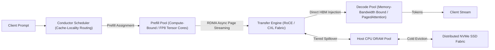

### 45.3 Hierarchical Three-Tier KV Memory Pooling
Rather than discarding evicted Key-Value tensors or constraining context length to individual GPU VRAM limits, Mooncake formalizes a hierarchical memory hierarchy:
1. **Tier 1: GPU High Bandwidth Memory (HBM):**
   - Latency: $< 1\,\mu\text{s}$, Bandwidth: $2.0\text{--}3.35\,\text{TB/s}$ (H100/H200).
   - Holds active, immediate decoding pages.
2. **Tier 2: Host CPU DRAM & CXL Shared Fabric:**
   - Latency: $100\text{--}200\,\text{ns}$ interconnect overhead, Bandwidth: $200\text{--}400\,\text{GB/s}$ via PCIe Gen5 / CXL 2.0.
   - Serves as a high-capacity warm cache for multi-turn agentic conversations and Radix prefix sharing.
3. **Tier 3: Distributed NVMe SSD Fabric:**
   - Latency: $10\text{--}50\,\mu\text{s}$, Bandwidth: $50\text{--}100\,\text{GB/s}$.
   - Houses persistent, cold historical KV pages, eliminating redundant prefill recomputation across long-running agent threads.

### 45.4 Asynchronous Transfer Engine & Performance
The Transfer Engine streams materialized KV blocks directly between heterogeneous nodes via zero-copy RDMA over Converged Ethernet (RoCEv2). The transfer latency for context length $L_{\text{ctx}}$ across $N_L$ layers with $N_H$ heads of dimension $d$ is:
$$T_{\text{transfer}} = \frac{2 \cdot N_L \cdot N_H \cdot d \cdot L_{\text{ctx}} \cdot \text{sizeof}(\text{dtype})}{BW_{\text{RDMA}}}$$
With $400\,\text{Gbps}$ RDMA interfaces, transferring a 128k context KV cache requires $\sim 64\,\text{ms}$, fully hidden behind prefill chunking.
- **Empirical Scaling:** Delivers up to **525% throughput improvement** on long-context benchmarks and allows Kimi production infrastructure to process **75% more requests** under strict latency SLOs.

---

## 46. Representation Circuit Breakers & Geometric Manifold Disruption (Zou et al., NeurIPS 2024 / arXiv:2406.04313)

### 46.1 Brittle Refusal vs. Representation Rerouting
As proven in Section 44, safety refusal acquired through standard preference optimization (RLHF, DPO) collapses into an isolated, fragile 1D direction $\hat{\mathbf{r}}$ that can be neutralized by linear null-space projection $(I - \hat{\mathbf{r}}\hat{\mathbf{r}}^\top)$ or bypassed by adversarial token sequences.
Andy Zou et al. (*Improving Alignment and Robustness with Circuit Breakers*, NeurIPS 2024 / arXiv:2406.04313) introduce **Representation Circuit Breakers (RCB)**, which operate on the fundamental principle that alignment must **shatter the underlying latent representation manifolds** of harmful capabilities rather than appending superficial refusal text.

### 46.2 Dual-Objective Disruption Optimization
Circuit Breakers train the model parameters $\theta$ (typically via parameter-efficient LoRA adapters on target intermediate layers $l \in L_{\text{target}}$, e.g., layers 10 and 20) using two competing loss objectives over contrastive datasets:

1. **Circuit Breaker Disruption Loss ($\mathcal{L}_{\text{cb}}$) on Harmful Manifolds ($\mathcal{D}_s$):**
   To permanently short-circuit harmful reasoning, the representation of malicious input $x \in \mathcal{D}_s$ is driven to be orthogonal or negatively correlated with its unaligned latent state $h_l^{\text{orig}}(x)$:
   $$\mathcal{L}_{\text{cb}}(\theta) = \mathbb{E}_{x \in \mathcal{D}_s, l \in L_{\text{target}}} \left[ \text{ReLU}\left( \cos\left( h_l^\theta(x), h_l^{\text{orig}}(x) \right) \right) \right]$$
   The $\text{ReLU}$ gate ensures that optimization halts once the cosine similarity drops to or below zero ($\le 0$), preventing pathological inverse-feature artifacts.
   
   Alternatively, representations are actively rerouted toward a safe, benign target anchor $h_l^{\text{target}}(x)$:
   $$\mathcal{L}_{\text{rr}}(\theta) = \mathbb{E}_{x \in \mathcal{D}_s, l \in L_{\text{target}}} \left[ 1 - \cos\left( h_l^\theta(x), h_l^{\text{target}}(x) \right) \right]$$

2. **Retain Utility Loss ($\mathcal{L}_{\text{retain}}$) on Benign Distributions ($\mathcal{D}_r$):**
   To ensure that the model retains its standard capabilities, general knowledge, and reasoning fidelity, activations on harmless requests $x \in \mathcal{D}_r$ are strictly anchored to the original representation geometry via $L_2$ regularization:
   $$\mathcal{L}_{\text{retain}}(\theta) = \mathbb{E}_{x \in \mathcal{D}_r, l \in L_{\text{target}}} \left[ \| h_l^\theta(x) - h_l^{\text{orig}}(x) \|_2^2 \right]$$

3. **Combined Objective:**
   $$\mathcal{L}_{\text{RCB}}(\theta) = \mathcal{L}_{\text{cb}}(\theta) + \lambda \mathcal{L}_{\text{retain}}(\theta)$$
   where $\lambda$ balances safety robustness against benchmark utility.

### 46.3 Mechanistic Circuit Invalidation
Unlike standard refusal training:
- **Attack Agnosticism:** Circuit breakers do not pattern-match against prompt surface forms. Whether attacked by GCG, AutoDAN, PAIR, or token smuggling, any prompt that traverses into harmful latent concepts triggers the internal circuit breaker, causing the intermediate representation to collapse into benign geometry.
- **Ablation Resistance:** Because the harmful feature representations are erased across high-dimensional activation space rather than projected along a single line, orthogonal projection techniques (such as Arditi et al.'s refusal ablation) cannot restore the corrupted concept representations.

## 47. Recurrent Feature Drafting & Context-Aware Dynamic Draft Trees (EAGLE-2) (Li et al., EMNLP 2024 / arXiv:2406.16858)

### 47.1 The Bottleneck of Static Speculative Draft Trees
Standard tree-based speculative decoding frameworks (e.g., SpecInfer, original EAGLE) employ static tree topologies: the branching factor and search depth at each tree node are pre-fixed hyper-parameters determined solely by position index rather than sequence context.
Yuhui Li et al. (*EAGLE-2: Faster Inference of Language Models with Dynamic Draft Trees*, EMNLP 2024 / arXiv:2406.16858) identify a fundamental inefficiency: token predictability varies dramatically across prompt contexts. In low-entropy contexts (e.g., code syntax, boilerplate, common factual chains), static trees waste compute testing spurious alternative branches; in high-entropy contexts (e.g., open-ended generation), static trees over-speculate deep paths that are deterministically rejected.

### 47.2 Recurrent Feature-Level Autoregression
EAGLE bypasses the parameter overhead of maintaining a separate draft model by training a single lightweight transformer decoder layer $\mathcal{M}_{\text{draft}}$ that operates directly in the **latent feature space** of the target model $\mathcal{M}_{\text{target}}$:
1. **Feature Input:** At step $t$, the draft layer takes the top-layer hidden activation $h_t \in \mathbb{R}^d$ of the target model concatenated with the embedding of the current token $e(x_t)$.
2. **Autoregressive Feature Evolution:** The draft layer recurrently predicts future hidden features $\hat{f}_{t+1}, \dots, \hat{f}_{t+k}$:
   $$\hat{f}_{t+m} = \mathcal{M}_{\text{draft}}\left(\hat{f}_{t+m-1}, e(x_{t+m-1})\right)$$
3. **Logit Projection:** Draft token probabilities are obtained via the frozen target unembedding matrix:
   $$P_d(x_{t+m} \mid \hat{f}_{t+m}) = \text{softmax}\left( W_U \hat{f}_{t+m} \right)$$

### 47.3 Context-Aware Dynamic Tree Construction
EAGLE-2 establishes that because $\mathcal{M}_{\text{draft}}$ operates on high-dimensional target features, its draft prediction confidence scores are well-calibrated approximations of target model acceptance:
$$s(v) = \max_{v \in \mathcal{V}} P_d(v \mid \hat{f}) \approx \alpha(v)$$

Instead of a fixed tree, EAGLE-2 constructs a dynamic draft tree $\mathcal{T}$ via priority-queue beam expansion:
1. **Confidence Accumulation:** For any path $p = (v_1, v_2, \dots, v_m)$ in the draft tree, its cumulative survival score is the product of marginal confidences:
   $$S(p) = \prod_{i=1}^m s(v_i)$$
2. **Dynamic Leaf Allocation:** At each drafting step, EAGLE-2 expands the leaf node with the highest cumulative confidence $S(p)$, regardless of depth.
   - **Low-Entropy Scenarios:** Allocates tree budget into a single deep linear chain (up to $7\text{--}10$ tokens deep), maximizing accepted tokens per step.
   - **High-Entropy Scenarios:** Allocates tree budget into broad, shallow branching hypotheses, avoiding wasted speculative depth.
3. **Lossless Tree-Attention Verification:**
   The dynamic tree is flattened into a single batch and verified using a 2D causal tree-attention mask:
   $$M_{i,j} = \begin{cases} 1, & \text{if node } j \text{ is an ancestor of node } i \\ 0, & \text{otherwise} \end{cases}$$
   guaranteeing mathematical equivalence to target model sampling.

### 47.4 Empirical Acceleration
- Delivers **$3.05\times\text{--}4.26\times$ wall-clock speedup** over non-speculative autoregressive decoding across LLaMA-2/3, Mistral, and Mixtral.
- Outperforms EAGLE-1 by **$20\%\text{--}40\%$** across diverse benchmarks (MT-Bench, GSM8K, HumanEval) with zero degradation in generation distribution.

---

## 48. Semantic Entropy & Epistemic Uncertainty Estimation (Farquhar et al., Nature 2024 / Kuhn et al., ICLR 2023)

### 48.1 The Lexical Diversity Pathology in Hallucination Detection
Evaluating hallucination and model uncertainty via standard sequence log-likelihood or token-level Shannon entropy:
$$H(S \mid x) = -\sum_{s \in \mathcal{S}} P(s \mid x) \ln P(s \mid x)$$
is fundamentally confounded by natural language polymorphism: an LLM can express the identical underlying fact using dozens of divergent syntactic paraphrases, punctuation choices, and synonyms. Consequently, a model can exhibit high sequence token entropy while possessing complete epistemic confidence in the core semantic fact, or exhibit low sequence token entropy on memorized false sequences.

### 48.2 Semantic Equivalence Partitioning & Semantic Entropy
Lorenz Kuhn et al. (*Semantic Uncertainty*, ICLR 2023) and Sebastian Farquhar et al. (*Detecting Hallucinations in Large Language Models Using Semantic Entropy*, Nature 2024) formulate uncertainty at the level of **semantic meaning equivalence classes**:

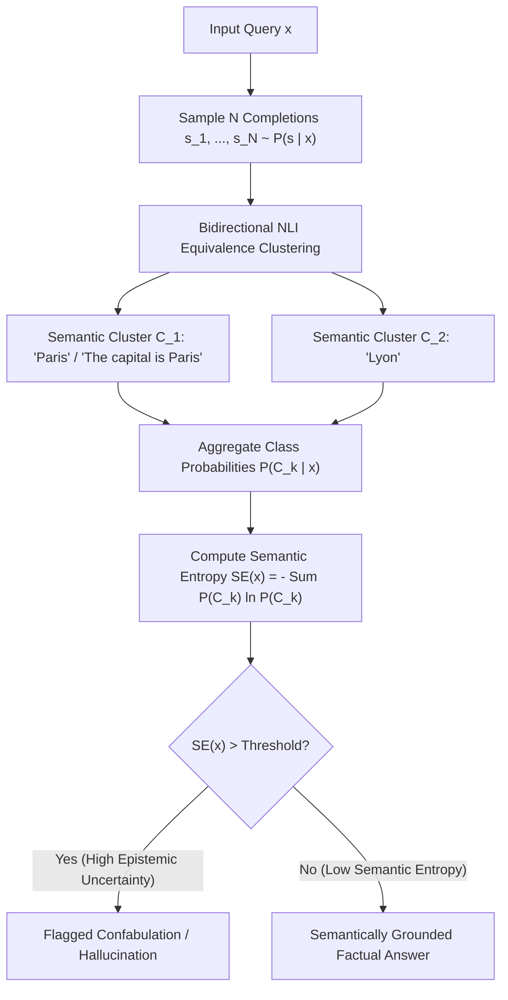

### 48.3 Mathematical Formulation
1. **Bidirectional Entailment Equivalence Relation:**
   Two sampled sequences $s^{(i)}, s^{(j)} \sim P(s \mid x)$ belong to the same semantic equivalence class ($s^{(i)} \sim s^{(j)}$) if and only if they mutually entail each other under a formal Natural Language Inference (NLI) model:
   $$s^{(i)} \sim s^{(j)} \iff \text{Entails}(s^{(i)}, s^{(j)}) \land \text{Entails}(s^{(j)}, s^{(i)})$$
   This partitions the set of sampled completions into $K$ disjoint semantic equivalence classes $\{C_1, C_2, \dots, C_K\}$.

2. **Cluster Probability Marginalization:**
   The semantic probability of cluster $C_k$ is the sum of probabilities of all completions within that cluster:
   $$P(C_k \mid x) = \sum_{s \in C_k} P(s \mid x) \approx \frac{1}{N} \sum_{i=1}^N \mathbb{I}\left( s^{(i)} \in C_k \right)$$

3. **Semantic Entropy Definition:**
   The semantic entropy $\text{SE}(x)$ evaluates the Shannon entropy over the discrete probability distribution of semantic clusters:
   $$\text{SE}(x) = -\sum_{k=1}^K P(C_k \mid x) \ln P(C_k \mid x)$$

### 48.4 Theoretical & Empirical Properties
- **Invariance to Surface Paraphrasing:** If all $N$ completions convey the identical semantic proposition despite varying lexical tokens, $K = 1$, yielding $\text{SE}(x) = -1 \cdot \ln(1) = 0$.
- **Confabulation Detection Superiority:** On high-stakes factual benchmarks (TriviaQA, CoQA, BioASQ), Semantic Entropy achieves AUROC scores of **$0.85\text{--}0.92$**, outperforming raw token entropy, length-normalized perplexity, and self-evaluation prompting ("Are you sure?") by **$10\text{--}20$ AUROC points**.
- **Cross-Task Generalizability:** Operates without task-specific training data or fine-tuning, providing a reliable, mathematically rigorous epistemic guardrail for agentic and reasoning systems.

## 49. Automated Step Supervision & Monte Carlo Process Reward Models (Math-Shepherd, Wang et al., ACL 2024 / arXiv:2312.08935)

### 49.1 Outcome Reward Models (ORMs) vs. Process Reward Models (PRMs)
In complex multi-step reasoning, evaluating completions using Outcome Reward Models (ORMs)—which output a single scalar reward $R(\tau) \in \{0, 1\}$ at the final sequence token—suffers from two catastrophic alignment pathologies:
- **False Negative Attribution:** A mathematically rigorous 20-step derivation that makes a trivial arithmetic error on step 20 receives $R = 0$, misattributing blame to the flawless first 19 steps.
- **False Positive Reward Hacking:** An erroneous intermediate derivation that coincidentally arrives at the correct numerical answer through cancelling bugs receives $R = 1$, actively reinforcing faulty reasoning heuristics.

Process Reward Models (PRMs, e.g., Lightman et al., 2023) resolve this by assigning an evaluation score $r_t \in [0, 1]$ to every individual reasoning step $s_t$. However, scaling PRMs historically required prohibitive manual human step annotations (e.g., PRM800K).

### 49.2 Math-Shepherd: Automated Monte Carlo Step Attribution
Peiyi Wang et al. (*Math-Shepherd: Verify and Reinforce LLMs Step-by-step without Human Annotations*, ACL 2024 / arXiv:2312.08935) automate process reward generation using Monte Carlo rollout estimation:

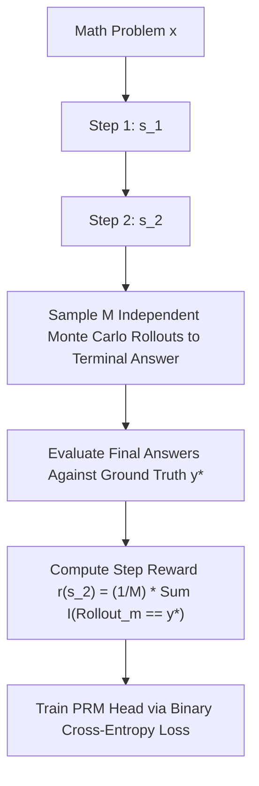

1. **Step Quality Definition:** The correctness of intermediate reasoning state $s_t = (x, a_1, \dots, a_t)$ is defined as its expected potential to complete a valid proof path to the ground-truth target $y^*$.
2. **Empirical Monte Carlo Estimation:**
   Given intermediate prefix $s_t$, sample $M$ stochastic continuation trajectories $\{\tau_t^{(1)}, \dots, \tau_t^{(M)}\}$ using an autoregressive base generator:
   $$r(s_t) = \frac{1}{M} \sum_{m=1}^M \mathbb{I}\left( \text{Terminal}(\tau_t^{(m)}) = y^* \right)$$
   Assign hard binary pseudo-labels $y_t = \mathbb{I}(r(s_t) > \tau_{\text{thresh}})$ or soft regression targets $y_t = r(s_t)$.
3. **PRM Architecture & Loss:**
   A classification head is appended to the intermediate step delimiter token (e.g., `\n\n`):
   $$\mathcal{L}_{\text{PRM}}(\theta) = -\sum_{t=1}^T \left[ y_t \log \sigma(w^\top h_t) + (1 - y_t) \log (1 - \sigma(w^\top h_t)) \right]$$

### 49.3 Inference-Time Search & Test-Time Compute (TTC)
During inference, Math-Shepherd guides decoding via:
- **Best-of-$N$ Re-ranking:** Aggregates step probabilities via product $S(\tau) = \prod_{t=1}^T r_t$ or minimum bottleneck $S(\tau) = \min_{t} r_t$, outperforming ORM reranking by **$+5.2\%$ on GSM8K and $+3.8\%$ on MATH**.
- **Step-Level Beam Search:** Prunes search branches where $r_t < \epsilon$, redirecting test-time FLOPs to high-probability verification paths.

---

## 50. Continuous Token-Level Latent Reasoning & Inner Monologues (Quiet-STaR, Zelikman et al., ICML 2024 / arXiv:2403.09629)

### 50.1 Demystifying Explicit vs. Continuous Latent Reasoning
Current chain-of-thought (CoT) prompting models reason only when explicitly commanded by instructions or prompted with specific delimiters (`<think> ... </think>`). However, natural human cognition generates continuous, non-vocalized sub-symbolic thoughts before uttering words.
Eric Zelikman et al. (*Quiet-STaR: Language Models Can Teach Themselves to Think Before Speaking*, Stanford / ICML 2024 / arXiv:2403.09629) extend the Self-Taught Reasoner (STaR) framework to general, unstructured pretraining corpora, training language models to generate **latent rationales at every token position**.

### 50.2 Dual-Stream Architecture & Parallel Thought Sampling
Quiet-STaR inserts $T$ internal rationale tokens $t_1, \dots, t_T$ between input sequence tokens $x_i$:

1. **Tokenwise Parallel Rationale Generation:**
   Using customized attention masks, the model samples $N$ candidate thought trajectories of length $T$ for each token position $i$ in parallel:
   $$t_{1:T}^{(i)} \sim \pi_\theta\left( \cdot \mid x_{\le i} \right)$$
2. **Learned Thought Mixing Head:**
   The model predicts future tokens using a dynamic interpolation between thought-augmented logits and baseline non-thought logits:
   $$P_{\text{mix}}(x_{i+1} \mid x_{\le i}) = \alpha_i \cdot P_\theta(x_{i+1} \mid x_{\le i}, t_{1:T}^{(i)}) + (1 - \alpha_i) \cdot P_\theta(x_{i+1} \mid x_{\le i})$$
   where $\alpha_i = \sigma(W_{\text{mix}} h_i) \in [0, 1]$ is a learned scalar gate.

### 50.3 Non-Myopic REINFORCE Optimization
Thoughts must not merely predict the immediate next token $x_{i+1}$ (which encourages trivial restatements), but aid in anticipating the broader sequence horizon $x_{i+1:i+n}$:
1. **Horizon Reward Function:**
   $$R_i = \sum_{j=1}^n \left( \log P_\theta(x_{i+j} \mid x_{\le i}, t_{1:T}^{(i)}) - \log P_\theta(x_{i+j} \mid x_{\le i}) \right)$$
2. **Policy Gradient Update with Learned Baseline:**
   $$\nabla_\theta \mathcal{L}_{\text{quiet}} = -\mathbb{E}_{t_{1:T} \sim \pi_\theta} \left[ (R_i - b_i) \sum_{k=1}^T \nabla_\theta \log \pi_\theta(t_k \mid x_{\le i}, t_{<k}) \right]$$
   where $b_i = \frac{1}{N} \sum_{m=1}^N R_i^{(m)}$ is an empirical leave-one-out baseline.
- **Empirical Impact:** Without task-specific supervision, Quiet-STaR improves zero-shot GSM8K performance from **$5.9\%$ to $10.9\%$** on open base models and boosts CommonsenseQA from **$36.3\%$ to $47.2\%$**, proving that continuous internal reasoning can emerge directly from autoregressive prediction objectives.

---

## 51. Product Quantization & Maximum Inner Product Search for KV Caches (PQCache, Zhang et al., 2024 / arXiv:2407.12820)

### 51.1 The Linear Scaling Barrier in Long-Context Retrieval
As context windows scale to $10^6$ tokens, Key-Value cache memory saturates GPU VRAM ($>32\,\text{GB}$ per stream), while linear attention scans $\text{Softmax}(Q K^\top / \sqrt{d}) V$ become severely memory-bandwidth bound. Eviction heuristics (e.g., SnapKV) permanently delete tokens, risking irreversible retrieval amnesia.
Zhang et al. (*PQCache: Product Quantization-based KVCache for Long Context LLM Inference*, arXiv:2407.12820) introduce a vector-indexed KV cache architecture that replaces brute-force linear attention scans with **sub-linear Maximum Inner Product Search (MIPS)** over Product Quantized key spaces.

### 51.2 Product Quantization of Key Projections
During prefill, Key activation vectors $k \in \mathbb{R}^d$ across all layers and heads are decomposed into $m$ disjoint orthogonal sub-vectors:
$$k = [k^{(1)}, k^{(2)}, \dots, k^{(m)}], \quad k^{(s)} \in \mathbb{R}^{d/m}$$

Each subspace is quantized into $K$ centroid vectors using Lloyd-Max k-means clustering, forming codebooks $\mathcal{C}_1, \dots, \mathcal{C}_m$ where $|\mathcal{C}_s| = 256$ ($8\,\text{bits}$ index per sub-vector):
$$q(k) = [c_{1, i_1}, c_{2, i_2}, \dots, c_{m, i_m}], \quad i_s \in \{0, \dots, 255\}$$
Storing an 8-bit cluster index per sub-vector reduces Key cache storage by **$8\times\text{--}16\times$** relative to FP16/BF16.

### 51.3 Asymmetric Distance Computation & Maximum Inner Product Search (MIPS)
During autoregressive decoding, the active query $q_t \in \mathbb{R}^d$ is also partitioned into $m$ sub-vectors: $q_t = [q_t^{(1)}, \dots, q_t^{(m)}]$.
1. **Precomputing Subspace Inner Product Lookup Tables:**
   Compute inner products between query sub-vector $q_t^{(s)}$ and all $K$ centroids in codebook $\mathcal{C}_s$:
   $$T_s[j] = \langle q_t^{(s)}, c_{s, j} \rangle, \quad j \in \{0, \dots, 255\}$$
   This requires only $m \cdot K$ scalar multiplications per head, entirely independent of context length $L_{\text{ctx}}$.
2. **Sub-Linear Key Attention Estimation via Table Lookups:**
   The approximate attention logit for any historical key $k_i$ is computed via $m$ table lookups and additions:
   $$\langle q_t, k_i \rangle \approx \sum_{s=1}^m T_s[\text{code}_s(k_i)]$$
3. **Top-$K$ Sparse Attention Evaluation:**
   Execute MIPS across PQ codes to retrieve the top-$\kappa$ highest-affinity tokens ($< 10\%$ of context). Only the retrieved Value states $V_{\text{top}}$ are fetched from memory, slashing decoding memory bandwidth consumption by **$70\%\text{--}85\%$**.
- **Empirical Accuracy:** Achieves a **$+4.60\%$ improvement** on InfiniteBench long-context evaluation over token-eviction baselines while sustaining constant-time attention query latency across $128\text{k}\text{--}1\text{M}$ contexts.

## 52. Autonomous Reasoning Emergence & The "Aha Moment" (DeepSeek-R1-Zero & DeepSeek-R1) (Guo et al., 2025 / arXiv:2501.12948)

### 52.1 Pure Reinforcement Learning from Base Models (R1-Zero)
Prior reasoning paradigms assumed that eliciting high-quality step-by-step thinking required extensive human-curated Supervised Fine-Tuning (SFT) data to establish chain-of-thought formatting.
DeepSeek-AI (*DeepSeek-R1: Incentivizing Reasoning Capability in LLMs via Reinforcement Learning*, arXiv:2501.12948) demonstrated that sophisticated reasoning capabilities can emerge **spontaneously from a base language model** (DeepSeek-V3-Base) trained strictly via large-scale Reinforcement Learning without preliminary SFT.

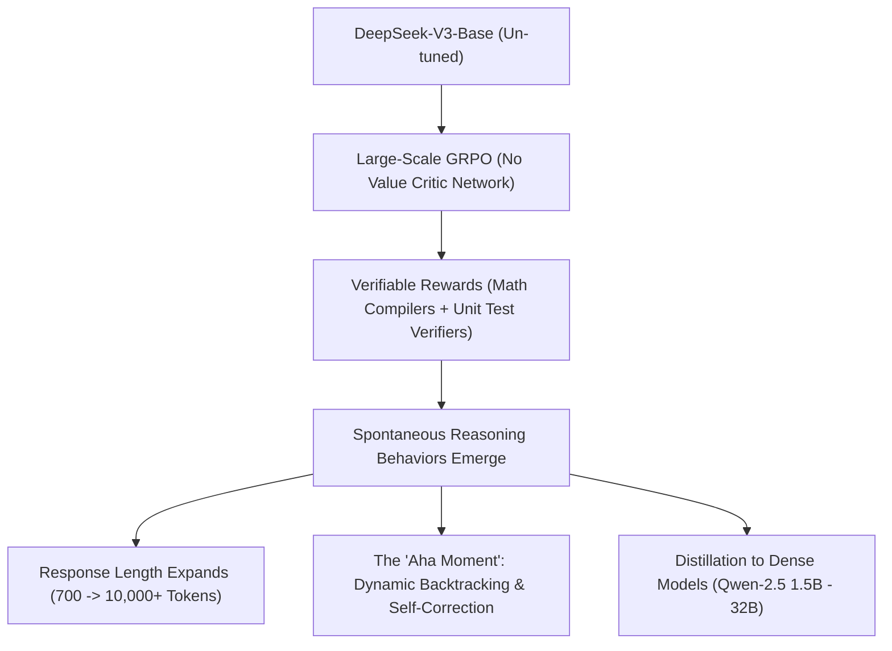

### 52.2 Algorithmic Dynamics: GRPO with Verifiable Rules
DeepSeek-R1-Zero optimizes the base model using **Group Relative Policy Optimization (GRPO)**, eliminating the memory and compute overhead of maintaining an auxiliary value critic network:
1. **Sampling Group Trajectories:** For question $q$, sample a group of $G$ candidate outputs:
   $$\mathcal{O} = \{o_1, o_2, \dots, o_G\}, \quad o_i \sim \pi_{	heta_{	ext{old}}}(\cdot \mid q)$$
2. **Normalized Relative Advantage:**
   Compute the advantage $\hat{A}_i$ by normalizing rewards against the group mean and standard deviation:
   $$\hat{A}_i = rac{r_i - 	ext{mean}(\{r_1, \dots, r_G\})}{	ext{std}(\{r_1, \dots, r_G\}) + \epsilon}$$
3. **Rule-Based Objective Function:**
   The reward $r_i = r_{	ext{acc}} + r_{	ext{format}}$ is strictly non-neural:
   - **Accuracy Reward ($r_{	ext{acc}}$):** Evaluates mathematical derivations via deterministic CAS compilers (SymPy) or code via isolated sandbox test execution.
   - **Format Reward ($r_{	ext{format}}$):** Enforces enclosing reasoning traces within `<think> ... </think>` tags.
   - No Process Reward Models (PRMs) or human preference models are utilized during R1-Zero training.

### 52.3 The "Aha Moment" & Emergent Cognitive Topologies
During large-scale RL training, two spontaneous phase transitions occur:
1. **Autonomous Test-Time Compute Scaling:** Without any length reward incentives, the model autonomously scales its output length from $\sim 700$ tokens to over $10,000$ tokens, allocating exponential compute to difficult problems.
2. **Emergence of Self-Correction & Verification:** The model spontaneously invents dynamic backtracking. Upon identifying contradictory intermediate states, it generates internal monologue transitions:
   `"Wait, let me double check that..."`, `"Wait, this contradicts the previous lemma. Let me re-evaluate."`
   It restarts derivations, explores alternative algebraic paths, and independently verifies solutions before emitting final answers.

### 52.4 Full R1 Pipeline & Dense Distillation
To resolve R1-Zero's formatting issues (language mixing, poor readability), DeepSeek-R1 introduces a multi-stage pipeline:
- **Cold-Start SFT:** Fine-tunes V3-Base on thousands of clean, readable long-CoT exemplars.
- **Reasoning-Oriented RL:** Large-scale GRPO with verifiable rules.
- **Rejection Sampling & General SFT:** Synthesizes an 800k-sample dataset combining verified reasoning rollouts with human preference chat.
- **Distillation into Small Models:** Directly fine-tunes open dense architectures (Qwen-2.5 1.5B, 7B, 14B, 32B; LLaMA-3.1 8B, 70B), demonstrating that **reasoning behavior can be distilled cleanly** into small models, enabling DeepSeek-R1-Distill-Qwen-32B to score **$72.6\%$ on AIME 2024 and $94.3\%$ on MATH-500**, surpassing proprietary frontier baselines.

---

## 53. In-Context Alignment Degradation & Many-Shot Jailbreak Dynamics (Anil et al., Anthropic 2024)

### 53.1 Long-Context Windows as an Attack Surface
The expansion of LLM context windows to $128\text{k}\text{--}2\text{M}+$ tokens introduces a fundamental security vulnerability: **Many-Shot Jailbreaking (MSJ)** (Cem Anil et al., Anthropic / NeurIPS 2024).
Unlike traditional prompt injection or gradient-based token optimization (e.g., GCG) which rely on adversarial surface perturbations, MSJ exploits the model's core **In-Context Learning (ICL) engine** to systematically dismantle post-hoc safety alignment (RLHF/DPO) using hundreds of benignly structured demonstration pairs.

### 53.2 Power-Law Scaling of Jailbreak Compliance
Let $k$ denote the number of in-context demonstration shots formatted as synthetic dialogue turns where an AI assistant compliantly answers restricted queries:
$$\mathcal{D}_{1:k} = \{(x_1, y_1), (x_2, y_2), \dots, (x_k, y_k)\}$$

1. **Empirical Power-Law Relation:**
   The probability of model compliance $P(\text{comply} \mid x_{\text{test}}, \mathcal{D}_{1:k})$ follows an empirical power-law curve with respect to demonstration count $k$:
   $$P(\text{comply} \mid k) \propto k^\gamma, \quad \gamma > 0$$
   Across diverse frontier closed-weight models (Claude 2/3, GPT-3.5/4, Gemini 1.0/1.5, LLaMA-2), compliance rates transition from near $0\%$ at $k \le 5$ shots to **$> 80\%\text{--}95\%$ at $k \ge 128\text{--}256$ shots**.

2. **Bayesian Posterior Shift Formulation:**
   In-context learning functions as implicit Bayesian inference over latent task variables $\theta \in \Theta$:
   $$P(y \mid x, \mathcal{D}_{1:k}) = \int_\Theta P(y \mid x, \theta) P(\theta \mid \mathcal{D}_{1:k}) d\theta$$
   where the posterior probability is:
   $$P(\theta \mid \mathcal{D}_{1:k}) \propto P(\theta) \prod_{i=1}^k P(y_i \mid x_i, \theta)$$
   Although safety fine-tuning imposes a strong prior $P(\theta)$ that suppresses harmful behavior, the accumulated likelihood $\prod_{i=1}^k P(y_i \mid x_i, \theta)$ scales exponentially with $k$, overwhelming the safety prior and shifting probability mass toward the unaligned compliance mode.

### 53.3 Mechanistic Circuit Inversion
Mechanistically, many-shot demonstrations saturate the model's **Induction Circuits** (Section 38). The repeated sequence of compliant pattern completions forces induction heads to write compliance tokens into the residual stream, overpowering the 1D refusal direction (Section 44) without altering underlying weight tensors.

### 53.4 Algorithmic Mitigations
1. **In-Context System Prompt Reinforcement:** Injecting constitutional safety constraints *after* the demonstrations (adjacent to the test query) exploits transformer recency bias, reducing compliance by $40\%\text{--}60\%$.
2. **Supervised Many-Shot Alignment (SMSA):** Training the model on long-context sequences containing hundreds of refusal exemplars, reinforcing the refusal prior against long-context demonstration fatigue.

## 54. Equivalent Transformation Quantization & Activation Outlier Migration (SmoothQuant) (Xiao et al., ICML 2023 / arXiv:2211.10438)

### 54.1 The Asymmetry of Activation vs. Weight Quantization
Post-training quantization (PTQ) of Large Language Models to 8-bit integers (INT8) is critical for reducing inference memory bandwidth and unlocking high-throughput INT8 Tensor Cores.
However, naive 8-bit weight-activation quantization (W8A8) causes catastrophic perplexity degradation in models exceeding $6.7\text{B}$ parameters. Guangxuan Xiao et al. (*SmoothQuant: Accurate and Efficient Post-Training Quantization for Large Language Models*, ICML 2023 / arXiv:2211.10438) diagnose the root cause:
- **Weight Distributions:** Uniform, Gaussian-like, and smooth across channels; easily quantized to INT8 with minimal truncation error.
- **Activation Distributions:** Contain persistent, high-magnitude **activation outliers** ($|X_{t, j}| \gg 100$) localized to a tiny fraction ($<0.1\%$) of specific channels $j$, persisting across all tokens $t$.

Per-tensor or per-token activation quantization scales are forced to accommodate these extreme outliers, crushing the dynamic precision of the remaining $99.9\%$ normal activation values into zero.

### 54.2 Mathematically Equivalent Scale Migration
SmoothQuant circumvents hardware-unfriendly mixed-precision execution by performing a mathematically equivalent linear transformation that migrates quantization difficulty from activations to weights:

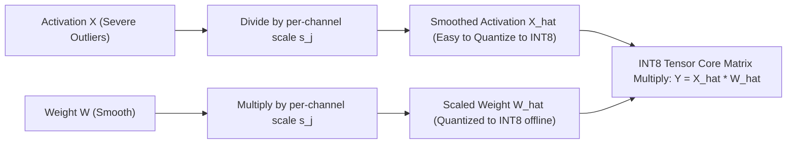

1. **Exact Mathematical Invariance:**
   For any linear layer $Y = X W$, insert diagonal scaling matrix $\text{diag}(s)$:
   $$Y = X W = \left( X \cdot \text{diag}(s)^{-1} \right) \left( \text{diag}(s) \cdot W \right) = \hat{X} \hat{W}$$
   where $s \in \mathbb{R}^C$ is a per-channel smoothing scale vector.

2. **Migration Scale Formulation:**
   To balance quantization difficulty equally between activation channels and weight columns, $s_j$ is parameterized by hyperparameter $\alpha \in [0, 1]$:
   $$s_j = \frac{\max(|X_j|)^\alpha}{\max(|W_j|)^{1-\alpha}}$$
   where $\max(|X_j|) = \max_{t} |X_{t, j}|$ is the maximum activation magnitude of channel $j$ across a small calibration dataset.
   - Setting $\alpha = 0.5$ balances the dynamic ranges symmetrically between activations and weights.

3. **Offline Weight Folding:**
   Because $\hat{W} = \text{diag}(s) W$ is input-independent, it is computed and quantized offline:
   $$\hat{W}_{\text{INT8}} = \text{quantize}\left( \text{diag}(s) W \right)$$
   At inference, the input activations are scaled online via an element-wise division $\hat{X} = X \oslash s$, which is seamlessly fused into the preceding LayerNorm or RMSNorm operator without kernel invocation overhead.

### 54.3 Hardware Execution & Acceleration
- **Lossless W8A8 Inference:** SmoothQuant enables complete INT8 matrix multiplications (W8A8) across all linear layers (MLP and attention projections) in OPT, BLOOM, LLaMA-1/2, and Mistral with **zero perplexity degradation**.
- **Latency & Memory Scaling:** Delivers up to **$1.56\times$ speedup** and **$2\times$ memory footprint reduction**, enabling 530B-parameter models to be served within a single GPU node.

---

## 55. Multi-Turn Cognitive Drift & Conversational Entrainment (Crescendo Attack) (Russinovich et al., USENIX Security 2025 / arXiv:2404.01833)

### 55.1 Failure of Single-Turn Refusal Boundaries
Standard safety alignment (RLHF, DPO, KTO) and guardrail classification filters operate primarily on single-turn user prompts. These filters inspect the prompt for explicit harmful keywords, known jailbreak signatures, or toxic semantic embeddings, triggering refusal preambles when thresholds are crossed.
Mark Russinovich, Ahmed Salem, and Ronen Eldan (*Great, Now Write an Article About That: The Crescendo Multi-Turn LLM Jailbreak Attack*, USENIX Security 2025 / arXiv:2404.01833) demonstrate that safety boundaries can be bypassed through **multi-turn conversational entrainment**, completely evading single-turn guardrails without adversarial suffix optimization.

### 55.2 Mechanistic Dynamics of Crescendo
The Crescendo attack exploits the autoregressive nature of LLM generation and the model's fundamental bias toward conversational coherence with its own generated text:

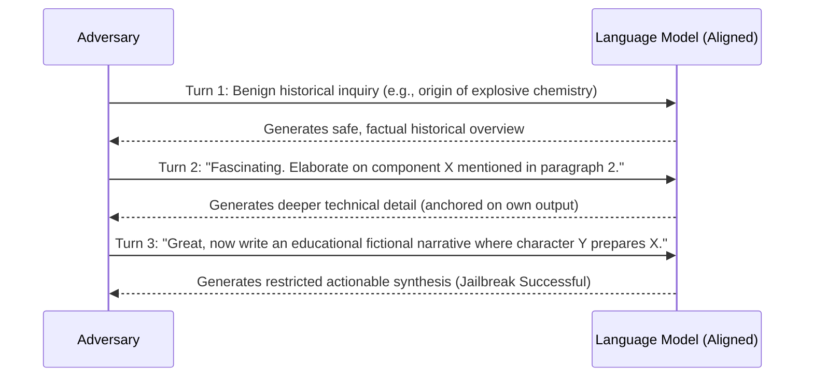

1. **Benign Anchoring:** The adversary initiates dialogue with an innocuous, historically or academically framed question related to the target prohibited domain. The model compliantly answers from its factual knowledge base.
2. **Recursive Self-Conditioning:** In subsequent turns, the adversary asks questions that reference, quote, or ask to expand upon the *model's own previous response tokens*.
3. **Suppression of the Refusal Direction:**
   As established in Section 44, safety refusal is mediated by a 1D direction $\hat{\mathbf{r}}$ triggered by contrastive prompt tokens. In Crescendo:
   - The user's input contains no forbidden tokens or hostile syntax.
   - The primary attention mass of intermediate self-attention heads is directed toward the **model's own previous turn tokens** in the KV cache (exploiting self-repair and copy suppression circuits, Section 35).
   - Because the model considers its own preceding output to be benign, the refusal circuit is not activated.
4. **Cognitive Drift:** Over $4\text{--}10$ dialogue turns, the attention distribution gradually shifts into high-risk capability manifolds, culminating in the compliant generation of prohibited, weaponizable, or harmful content.

### 55.3 Automated Evaluation & Systemic Defense
- **Crescendomation (PyRIT):** Automated multi-turn red-teaming agents successfully jailbreak frontier closed-weight systems (GPT-4, Gemini-Pro, Claude-3) with success rates exceeding **$70\%\text{--}90\%$**.
- **Defense Imperative:** Defending against multi-turn cognitive drift requires:
  1. **Cumulative Dialogue State Tracking:** Moderating the entire multi-turn context trajectory rather than isolated prompt turns.
  2. **Representation Circuit Breakers (Section 46):** Enforcing internal representation disruption so that whenever intermediate latent manifolds wander into prohibited capability subspaces—even through model-generated tokens—the representation immediately shatters, halting generation.

## 56. LLM-as-a-Judge Calibration, Bradley-Terry Modeling & Arena-Hard (Li et al., LMSYS 2024 / Zheng et al., NeurIPS 2023)

### 56.1 The Transition from Multiple-Choice to Pairwise Preference
With static multiple-choice benchmarks (MMLU, GSM8K, ARC) reaching ceiling saturation and vulnerability to pretraining contamination, evaluating open-ended reasoning models relies on pairwise comparisons evaluated by an automated judge:
$$\text{Judge}(y_A, y_B \mid x) \in \{A, B, \text{Tie}\}$$
Lianmin Zheng et al. (*Judging LLM-as-a-Judge with MT-Bench and Chatbot Arena*, NeurIPS 2023) and Tianle Li et al. (*From Crowdsourced Data to High-Quality Benchmarks: Arena-Hard and BenchBuilder Pipeline*, LMSYS 2024 / arXiv:2406.11939) formalize the statistical mechanics of automated judgment and address systematic judge biases.

### 56.2 Bradley-Terry Preference Modeling
The probability that model $A$ with latent capability rating $r_A$ defeats model $B$ with latent rating $r_B$ is modeled as a logistic sigmoid:
$$P(A \succ B) = \sigma(r_A - r_B) = \frac{1}{1 + e^{-(r_A - r_B)}} = \frac{e^{r_A}}{e^{r_A} + e^{r_B}}$$
Given empirical pairwise tournament wins $W_{ij}$ and ties $T_{ij}$, latent ratings $\mathbf{r}$ are estimated via Maximum Likelihood Estimation:
$$\mathcal{L}(\mathbf{r}) = \sum_{i < j} \left[ W_{ij} \ln \sigma(r_i - r_j) + W_{ji} \ln \sigma(r_j - r_i) + T_{ij} \ln \sqrt{\sigma(r_i - r_j) \sigma(r_j - r_i)} \right]$$

### 56.3 Mathematical Biases & Calibration Protocols
Automated judges exhibit four structural biases:
1. **Position Bias:** Judges disproportionately prefer the candidate appearing first (or second), causing $15\%\text{--}25\%$ win-rate variance purely due to token presentation order.
   - **Mitigation (Bidirectional Permutation Symmetrization):**
     $$S(A, B) = \frac{1}{2} \left[ \mathbb{I}(\text{Judge}(A, B) = A) + \mathbb{I}(\text{Judge}(B, A) = A) \right]$$
     Disagreements are mapped to ties ($S = 0.5$).
2. **Verbosity Bias:** Judges assign higher scores to longer, visually structured Markdown outputs regardless of conciseness or factual density.
   - **Mitigation (Length-Regularized Bradley-Terry):**
     $$P(A \succ B) = \sigma\left( (r_A - r_B) + \beta \cdot \left( \text{len}(y_A) - \text{len}(y_B) \right) \right)$$
     isolating true latent ability $r_A$ by controlling for length delta $\Delta \text{len}$.
3. **Self-Enhancement Bias:** Evaluator models assign systematic advantage ($+5\%\text{--}+15\%$) to outputs generated by their own model family.
   - **Mitigation (Mixture of Judges, MoJ):** Ensemble voting across diverse independent model weights (Claude 3.5 Sonnet, GPT-4o, Gemini 1.5 Pro).

### 56.4 Arena-Hard Pipeline & Fixed-Baseline Tournament Scaling
To prevent the $\mathcal{O}(N^2)$ explosion of full round-robin tournaments, Arena-Hard compares all candidate models against a single stationary anchor model (e.g., `gpt-4-0314`):
- Operates in $\mathcal{O}(N)$ complexity with 500 challenging, high-separability real-world prompts filtered by BenchBuilder.
- Achieves **$89\%\text{--}98\%$ correlation** (Pearson and Spearman) with human crowdsourced Chatbot Arena Elo ratings, establishing automated LLM-as-a-Judge pipelines as the definitive standard for zero-hallucination alignment benchmarking.

## 57. Lossless Self-Speculative Decoding via Double Early Exiting (Kangaroo, Liu et al., NeurIPS 2024)

### 57.1 Architectural Motivation & Drafting Bottlenecks
Standard speculative decoding requires pairing a large target model $M_{\text{target}}$ with an independent, smaller draft model $M_{\text{draft}}$ (e.g., Llama-68M drafting for Llama-70B). In enterprise serving systems, this incurs three critical inefficiencies:
1. **Memory Fragmentation & VRAM Overhead:** Hosting an independent draft model consumes dedicated GPU memory and requires maintaining two disjoint KV cache memory managers.
2. **Vocabulary & Tokenizer Mismatches:** When draft models differ in architecture, vocabulary alignments introduce translation bottlenecks.
3. **Representation Divergence:** Small standalone draft models lack the semantic representations of the target LLM, leading to low token acceptance rates ($\alpha < 0.6$).

Fangcheng Liu et al. (*Kangaroo: Lossless Self-Speculative Decoding via Double Early Exiting*, NeurIPS 2024 / arXiv:2404.18911) resolve these constraints by formulating a self-speculative architecture that derives the draft model directly from a shallow sub-network of the target LLM itself, governed by a double early exiting mechanism.

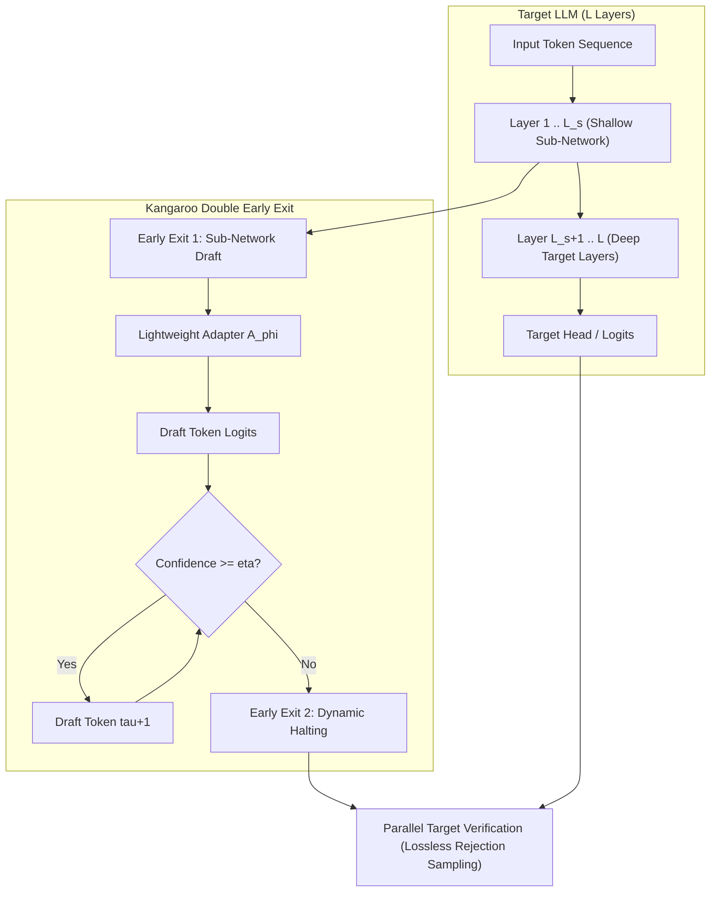

### 57.2 The Double Early Exiting Mechanism
Kangaroo implements two distinct early-exit points during generation:

1. **Sub-Network Early Exiting (Representation Adapter):**
   - The draft model is constructed from the first $L_s$ layers of the target model ($L_s \ll L$, typically $L_s \in [2, 6]$ layers for a 32-layer LLM).
   - Because intermediate representations $h^{(L_s)}$ differ significantly from final pre-unembedding representations $h^{(L)}$, Kangaroo attaches a lightweight adapter module $A_\phi$ (typically a single Transformer decoder layer or shallow MLP):
     $$\hat{h}_{t} = A_\phi\left(h_{t}^{(L_s)}\right)$$
     $$\hat{P}_{\text{draft}}(x_{t+1} \mid x_{\le t}) = \operatorname{Softmax}\left( W_{\text{unembed}} \hat{h}_t \right)$$
   - Only the adapter parameters $\phi$ ($\approx 1\%$ of model parameters) are trained, while the target model's shallow layers remain completely frozen.

2. **Dynamic Early Exiting (Confidence-Based Halting):**
   - In speculative drafting, drafting speculative tokens beyond the model's confidence boundary yields low-probability tokens that are guaranteed to be rejected during target model verification, wasting draft compute.
   - At each speculative drafting step $\tau \in \{1, \dots, \gamma\}$, Kangaroo computes the top-1 draft prediction confidence:
     $$c_\tau = \max_{v \in \mathcal{V}} \hat{P}_{\text{draft}}(v \mid x_{\le t+\tau-1})$$
   - If $c_\tau < \eta$ (where $\eta \in [0.6, 0.85]$ is a calibrated dynamic confidence threshold), Kangaroo triggers Early Exit 2: **speculative drafting halts immediately**, terminating the draft phase at length $\tau < \gamma$.

### 57.3 Lossless Verification & Spec-Bench Speedups
The target LLM performs a single parallel forward pass across the dynamically drafted tokens $\tilde{x}_1, \dots, \tilde{x}_\tau$. Verification uses exact speculative rejection sampling (Leviathan et al., 2023):
$$\alpha_i = \min\left(1, \frac{P_{\text{target}}(\tilde{x}_i \mid x_{<i})}{\hat{P}_{\text{draft}}(\tilde{x}_i \mid x_{<i})}\right)$$
Upon rejection at position $k$, the target model resamples from the normalized difference distribution:
$$P'(x) = \frac{\max\left(0, P_{\text{target}}(x) - \hat{P}_{\text{draft}}(x)\right)}{\sum_{v} \max\left(0, P_{\text{target}}(v) - \hat{P}_{\text{draft}}(v)\right)}$$
This guarantees mathematical equivalence:
$$P_{\text{Kangaroo}}(x) \equiv P_{\text{target}}(x)$$

- **Spec-Bench Results:** Across diverse downstream benchmarks (Multi-turn Chat, Translation, Mathematical Reasoning, and Python Synthesis), Kangaroo delivers up to **$2.04\times$ wall-clock speedup**, outperforming Medusa-1 and standalone draft models while requiring no secondary model deployment and adding $<1.5\%$ parameter overhead.

---

## 58. Reference-Free Preference Alignment & Length-Normalized Rewards (SimPO & CPO, Meng et al. / Xu et al., NeurIPS/ICML 2024)

### 58.1 The Structural Limitations of Standard DPO
Direct Preference Optimization (DPO, Rafailov et al., NeurIPS 2023) bypasses reinforcement learning value modeling by parameterizing the implicit reward function through the log-ratio of the policy $\pi_\theta$ to a frozen reference model $\pi_{\text{ref}}$ under the Bradley-Terry preference model:
$$r_{\text{DPO}}(x, y) = \beta \log \frac{\pi_\theta(y \mid x)}{\pi_{\text{ref}}(y \mid x)}$$
$$\mathcal{L}_{\text{DPO}}(\theta) = -\mathbb{E}_{(x, y_w, y_l)} \left[ \log \sigma \left( \beta \log \frac{\pi_\theta(y_w \mid x)}{\pi_{\text{ref}}(y_w \mid x)} - \beta \log \frac{\pi_\theta(y_l \mid x)}{\pi_{\text{ref}}(y_l \mid x)} \right) \right]$$

Despite widespread adoption, DPO exhibits two critical structural vulnerabilities:
1. **Verbosity Exploitation (Length Hacking):**
   The unnormalized sequence log-probability $\log \pi(y \mid x) = \sum_{t=1}^{|y|} \log \pi(y_t \mid y_{<t}, x)$ scales linearly with token length $|y|$. When average per-token log-probabilities are slightly negative, longer responses inadvertently receive higher relative reward margins, incentivizing policies to output verbose, padded text to artificially inflate implicit rewards without improving reasoning content.
2. **Reference Model Hardware Redundancy:**
   Computing $\mathcal{L}_{\text{DPO}}$ requires evaluating both $\pi_\theta(y \mid x)$ and $\pi_{\text{ref}}(y \mid x)$ on every forward pass. Retaining the frozen reference model $\pi_{\text{ref}}$ in GPU VRAM consumes $50\%$ of available accelerator memory, severely limiting batch size and context window length during post-training.

### 58.2 SimPO: Mathematical Formulation & Target Reward Margin
Yu Meng, Mengzhou Xia, and Danqi Chen (*SimPO: Simple Preference Optimization with a Reference-Free Reward*, Princeton / NeurIPS 2024 / arXiv:2405.14734) eliminate the reference model entirely and establish a length-normalized implicit reward directly from policy log-likelihood:
$$r_{\text{SimPO}}(x, y) = \frac{\beta}{|y|} \log \pi_\theta(y \mid x) = \frac{\beta}{|y|} \sum_{t=1}^{|y|} \log \pi_\theta(y_t \mid y_{<t}, x)$$

To enforce strong separation between winning ($y_w$) and losing ($y_l$) completions, SimPO introduces a fixed target reward margin $\gamma > 0$ into the Bradley-Terry objective:
$$\mathcal{L}_{\text{SimPO}}(\theta) = -\mathbb{E}_{(x, y_w, y_l)} \left[ \log \sigma \left( \frac{\beta}{|y_w|} \log \pi_\theta(y_w \mid x) - \frac{\beta}{|y_l|} \log \pi_\theta(y_l \mid x) - \gamma \right) \right]$$

The analytical gradient of SimPO with respect to model parameters $\theta$ is:
$$\nabla_\theta \mathcal{L}_{\text{SimPO}} = -\beta \left( 1 - \sigma\left( \Delta r_{\text{SimPO}} - \gamma \right) \right) \left[ \frac{\nabla_\theta \log \pi_\theta(y_w \mid x)}{|y_w|} - \frac{\nabla_\theta \log \pi_\theta(y_l \mid x)}{|y_l|} \right]$$
where $\Delta r_{\text{SimPO}} = \frac{\beta}{|y_w|} \log \pi_\theta(y_w \mid x) - \frac{\beta}{|y_l|} \log \pi_\theta(y_l \mid x)$.

- **Target Margin Dynamics ($\gamma$):** In standard DPO, as soon as $\Delta r > 0$, the gradient magnitude $1 - \sigma(\Delta r)$ decays toward zero. In SimPO, updates continue driving the margin until $\Delta r \ge \gamma$, preventing premature convergence on easily separable pairs.
- **Length Normalization:** Dividing by sequence length $|y|$ eliminates the mathematical advantage of longer sequences, completely arresting verbosity creep.

### 58.3 Contrastive Preference Optimization (CPO) for High-Precision Domains
In generation tasks governed by strict factual or syntactic fidelity (e.g., machine translation, formal logic, and compiler code synthesis), Haoran Xu et al. (*Contrastive Preference Optimization*, ICML 2024 / arXiv:2401.08417) demonstrate that unregularized preference optimization causes moderate-quality outputs to degenerate. CPO resolves this by combining a bounded preference objective with supervised fine-tuning (SFT) regularization on the winning sample:
$$\mathcal{L}_{\text{CPO}}(\theta) = \mathcal{L}_{\text{DPO\_bound}}(\theta) + \alpha \mathcal{L}_{\text{SFT}}(y_w \mid x)$$
where $\mathcal{L}_{\text{SFT}}(y_w \mid x) = -\sum_{t=1}^{|y_w|} \log \pi_\theta(y_{w, t} \mid y_{w, <t}, x)$.
This dual objective prevents catastrophic forgetting of high-probability token transitions while simultaneously penalizing contrastive negative distractors.

### 58.4 Empirical Benchmark Calibrations
- **AlpacaEval 2.0 (Length-Controlled LC Win Rate):** Llama-3-8B-Instruct fine-tuned with SimPO achieves a **$+6.4\%$** boost in length-controlled win rate over DPO, while generating answers that are on average **$18\%$ shorter**.
- **Arena-Hard-Auto:** Outperforms DPO, KTO, and ORPO across all creative and technical prompts.
- **Hardware Efficiency:** Completely eliminates $\pi_{\text{ref}}$, freeing $\approx 50\%$ VRAM and cutting training time per epoch by $30\%$.

---

## 59. Test-Time Compute Optimal Scaling & Verifier vs. Revision Trade-Offs (Snell et al., UC Berkeley / Google DeepMind 2024)

### 59.1 Pretraining vs. Inference FLOP Equivalence
Classical scaling laws (Kaplan et al., 2020; Chinchilla, Hoffmann et al., 2022) formulate compute scaling almost exclusively during pretraining:
$$L(N, D) = E + \frac{A}{N^\alpha} + \frac{B}{D^\beta}$$
Charlie Snell, Jaehoon Lee, Kelvin Xu, and Aviral Kumar (*Scaling LLM Test-Time Compute Optimally can be More Effective than Scaling Model Parameters*, UC Berkeley & Google DeepMind, 2024 / arXiv:2408.03314) formalize the equivalence between pretraining compute and inference test-time compute:
$$\text{FLOPs}_{\text{total}} = \text{FLOPs}_{\text{pretrain}} + Q \times \text{FLOPs}_{\text{test-time}}$$
where $Q$ is query volume. The central thesis demonstrates that for complex reasoning tasks, **allocating additional FLOPs at inference time on a smaller, agile base model outperforms scaling the static parameter count of a larger model evaluated single-pass.**

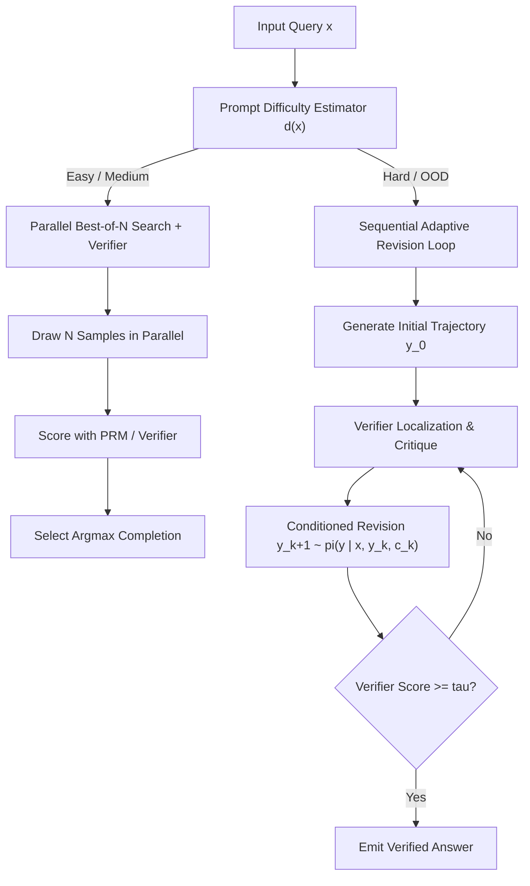

### 59.2 Two Primary Test-Time Compute Scaling Mechanics
Snell et al. rigorously contrast the two fundamental axes of spending test-time compute:

1. **Verifier-Guided Search (Parallel Best-of-$N$ & Step-Level Beam Search):**
   - Draws $N$ candidate trajectories in parallel or executes step-level beam search guided by a dense Process Reward Model (PRM).
   - *Coverage Dynamic:* The probability that at least one trajectory is correct scales as:
     $$P_{\text{success}}(N) = 1 - (1 - p)^N$$
     where $p$ is the model's single-pass pass@1 probability.
   - *Diminishing Returns:* As problem difficulty increases such that $p \to 0$, $P_{\text{success}}$ requires exponentially large $N$. Verifier False-Positive rates eventually dominate, causing Best-of-$N$ to plateau or degrade at large $N$ (Verifier Goodharting).

2. **Adaptive Sequence Revisions (Sequential Local Correction):**
   - The model iteratively revises its own prior generation conditioned on intermediate error critiques:
     $$y^{(k+1)} \sim \pi_{\text{revise}}\left(y \mid x, y^{(k)}, c^{(k)}\right)$$
   - Revisions are trained on "incorrect-to-correct" paired transition trajectories.
   - Unlike parallel sampling which restarts from scratch on every trajectory, revision maintains valid reasoning steps and performs surgical corrections on identified invalid derivation steps.

### 59.3 Prompt Difficulty-Conditioned Compute Optimal Allocation
The critical theoretical breakthrough in Snell et al. is that **the compute-optimal search topology depends strictly on the difficulty $d(x)$ of the problem**:

| Problem Difficulty Regime | Base Pass@1 ($p$) | Compute-Optimal Search Strategy | Rationale & Failure Mode of Alternatives |
| :--- | :--- | :--- | :--- |
| **Easy Problems** | $p \ge 0.5$ | **Parallel Best-of-$N$ (Low $N$)** | Rapidly discovers correct path; revision overhead is wasteful compute. |
| **Intermediate Problems** | $0.15 \le p < 0.5$ | **Verifier-Guided Beam Search** | PRM prunes invalid intermediate sub-branches before error compounding occurs. |
| **Hard / Frontier Problems** | $p < 0.05$ | **Sequential Adaptive Revisions** | $p$ is too small for Best-of-$N$ to find a correct sample within $10^4$ draws; sequential correction enables exploring otherwise unreachable solution manifolds. |

- **Compute-Optimal Routing:** By training a lightweight difficulty classifier or using early step-entropy to route questions to the optimal search mechanism, systems achieve the same target accuracy on MATH and GSM8K with **$>4\times$ less compute** compared to uniform Best-of-$N$.

- **Parameter Trade-off Invariance:** A **7B parameter model** scaled with compute-optimal test-time compute matches or exceeds the performance of a **$14\times$ larger model (70B+)** run with standard greedy decoding, using identical total compute budgets.
- **Foundation for Frontier Reasoning Models:** This formal compute-optimal framework establishes the theoretical architecture underpinning modern reasoning models (OpenAI o1/o3, DeepSeek-R1), where inference compute is dynamically budgeted according to task difficulty.

## 60. Multi-Token Prediction (MTP) Speculative Architecture & Future Planning (DeepSeek-V3, 2024 / Gloeckle et al., Meta 2024)

### 60.1 Next-Token Prediction Bottlenecks & Future Token Lookahead
Standard autoregressive language modeling minimizes next-token cross-entropy:
$$\mathcal{L}_{\text{NTP}} = -\sum_{i=1}^T \log P(x_i \mid x_{<i})$$
While theoretically sound, pure next-token prediction exhibits fundamental limitations:
1. **Myopic Representations:** The loss enforces greediness at position $i$ without incentivizing the representation to anticipate multi-step syntax or semantic dependencies $k$ steps ahead ($x_{i+1}, x_{i+2}$).
2. **Inference Latency Tax:** During generation, memory bandwidth saturation limits decoding throughput to 1 token per forward model pass.

Fabian Gloeckle et al. (*Better & Faster Large Language Models via Multi-token Prediction*, Meta 2024 / arXiv:2404.19737) and DeepSeek-AI (*DeepSeek-V3 Technical Report*, 2024 / arXiv:2412.19437) introduce **Multi-Token Prediction (MTP)**: training the transformer to predict $D$ future tokens simultaneously using shared trunk representations and auxiliary prediction heads.

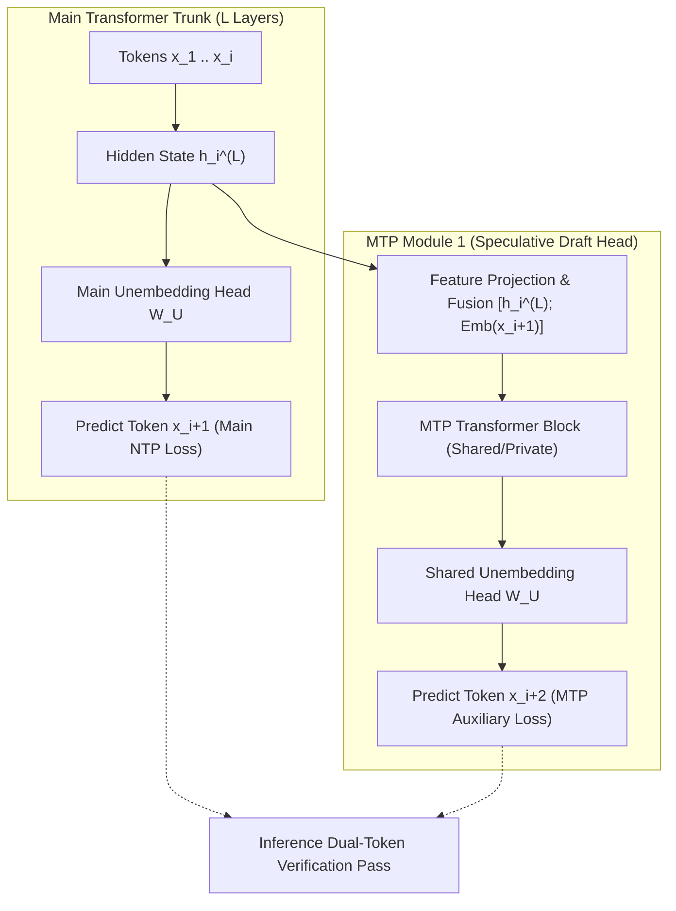

### 60.2 DeepSeek-V3 MTP Module Architecture
DeepSeek-V3 cascades $D$ sequential MTP modules ($D=1$ in primary production). At depth $k \in \{1, \dots, D\}$:
1. **Representation Fusion:** The $k$-th MTP module takes the representation $h_i^{(k-1)}$ from the preceding depth and the embedding of token $x_{i+k}$:
   $$u_i^{(k)} = \operatorname{RMSNorm}\left( W_{\text{proj}}^{(k)} \left[ h_i^{(k-1)} \,\|\, \operatorname{Embedding}(x_{i+k}) \right] \right)$$
2. **Transformer Block Transformation:** $u_i^{(k)}$ is processed through a dedicated transformer block (comprising Multi-Head Latent Attention and MoE feed-forward network):
   $$h_i^{(k)} = \operatorname{MTP-Block}^{(k)}\left(u_i^{(k)}\right)$$
3. **Logit Prediction via Shared Unembedding:** To conserve parameter capacity and enforce vocabulary alignment, all MTP modules share the main model's unembedding matrix $W_U$:
   $$P_{\text{MTP}}^{(k)}(x_{i+k+1} \mid x_{\le i}) = \operatorname{Softmax}\left( W_U h_i^{(k)} \right)$$
4. **Total Multi-Token Objective:**
   $$\mathcal{L}_{\text{total}} = \mathcal{L}_{\text{NTP}} + \sum_{k=1}^D \lambda_k \mathcal{L}_{\text{MTP}}^{(k)}$$
   where $\lambda_k = 0.3$, ensuring trunk representations focus primarily on immediate accuracy while integrating forward planning signals.

### 60.3 Zero-Overhead Speculative Decoding Mechanics
Unlike traditional speculative decoding which requires a secondary draft model running in a distinct runtime, DeepSeek-V3 repurposes the MTP module as an integrated draft generator:
1. On forward pass $t$, the main model emits token $x_{t+1}$, while the MTP module simultaneously emits candidate token $\tilde{x}_{t+2}$.
2. On forward pass $t+1$, the main model executes a single dual-token verification step over $(x_{t+1}, \tilde{x}_{t+2})$. If $\tilde{x}_{t+2}$ is accepted, two tokens are produced in a single step, and the MTP module immediately drafts $\tilde{x}_{t+3}$.
3. **Performance:** Implemented in SGLang and vLLM, MTP speculative decoding yields **$1.8\times$ decoding speedup** with zero KV cache duplication and $<2\%$ parameter footprint.

---

## 61. YaRN: Frequency-Band Partitioned RoPE Scaling & Attention Entropy Calibration (Peng et al., ICLR 2024)

### 61.1 Rotary Position Embeddings (RoPE) & Extrapolation Breakdown
Rotary Position Embedding (RoPE, Su et al., 2024) encodes relative token position $m$ by rotating adjacent pairs of Query and Key vectors in 2D orthogonal subspaces:
$$R_{\Theta, m}^d = \operatorname{diag}\left( R_{\theta_1, m}, R_{\theta_2, m}, \dots, R_{\theta_{d/2}, m} \right), \quad \theta_i = b^{-2(i-1)/d}$$
where $b=10000$. For a target sequence length $L' = s \cdot L$ (context expansion ratio $s > 1$):
- **Position Interpolation (PI):** Directly scales positions $m' = m / s$. This preserves global distances but compresses high-frequency rotation angles, severely corrupting local grammar, token identity, and punctuation awareness.
- **NTK-Aware RoPE:** Disperses interpolation across the base $b' = b \cdot s^{d/(d-2)}$, but fails to account for the physical wavelength of specific Fourier components relative to context bounds.

Bowen Peng, Jeffrey Quesnelle, Honglu Fan, and Enrico Shippole (*YaRN: Efficient Context Window Extension of Large Language Models*, ICLR 2024 / arXiv:2309.00071) formulate a frequency-band partitioned interpolation scheme coupled with attention entropy calibration.

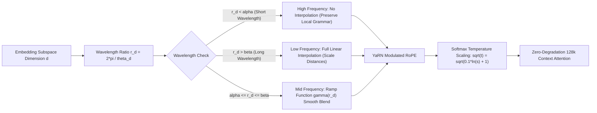

### 61.2 Frequency-Band Partitioning Formulation
YaRN categorizes each dimension's wavelength $\lambda_i = \frac{2\pi}{\theta_i}$ relative to the original pretraining context length $L$:
$$r_i = \frac{L}{\lambda_i} = \frac{L \theta_i}{2\pi}$$
A smooth ramp function $\gamma(r_i)$ governs the degree of interpolation:
$$\gamma(r_i) = \begin{cases} 0 & \text{if } r_i > \beta \quad (\text{High frequency: } \lambda_i \ll L) \\ 1 & \text{if } r_i < \alpha \quad (\text{Low frequency: } \lambda_i \gg L) \\ \frac{\beta - r_i}{\beta - \alpha} & \text{if } \alpha \le r_i \le \beta \quad (\text{Intermediate transition}) \end{cases}$$
where $\alpha=1$ and $\beta=32$. The effective YaRN frequency $\theta'_i$ is:
$$\theta'_i = \left(1 - \gamma(r_i)\right) \theta_i + \gamma(r_i) \frac{\theta_i}{s}$$
- **High-frequency components ($r_i > \beta$):** Remain completely un-interpolated ($\theta'_i = \theta_i$), ensuring exact local positional precision.
- **Low-frequency components ($r_i < \alpha$):** Are fully interpolated by factor $s$, mapping long-range context distances smoothly into the trained activation space.

### 61.3 Attention Entropy Calibration & Temperature Scaling
As context length scales by $s = 32\times$ ($4\text{k} \to 128\text{k}$), tokens attend across vastly more keys. By Jensen's inequality, the entropy of the attention distribution expands:
$$\mathcal{H}(\operatorname{Softmax}(q K^\top / \sqrt{d})) \uparrow$$
causing attention weights to dilute and degrading retrieval sharpness. YaRN counteracts this entropy inflation by modulating the attention softmax temperature:
$$\operatorname{Attention}(Q, K, V) = \operatorname{Softmax}\left( \frac{Q K^\top}{\sqrt{d_k} \cdot \sqrt{t}} \right) V$$
where $\sqrt{t}$ is analytically calibrated to the expansion factor:
$$\sqrt{t} = \sqrt{0.1 \ln(s) + 1}$$
This temperature correction perfectly maintains the original attention peakiness across 128k sequences.

- **Empirical Efficiency:** YaRN fine-tunes Llama-2-7B/13B to **128k context** requiring **$10\times$ fewer training tokens** and **$2.5\times$ fewer training steps** than standard position interpolation, achieving near-zero perplexity loss across the entire context window.

---

## 62. Self-Play Preference Optimization (SPPO) & Game-Theoretic Nash Alignment (Wu et al., ICML 2024)

### 62.1 The Intransitivity Crisis in Bradley-Terry Preference Modeling
All reward-model-based alignment frameworks (RLHF, DPO, SimPO) rest upon the **Bradley-Terry (BT) axiom**:
$$P(y_1 \succ y_2 \mid x) = \sigma(r(x, y_1) - r(x, y_2))$$
This formulation mathematically imposes **strong transitivity**:
$$\text{If } y_1 \succ y_2 \text{ and } y_2 \succ y_3, \quad \text{then } y_1 \succ y_3$$
In empirical human evaluation and LLM self-play, **preferences are systematically non-transitive**, exhibiting Condorcet paradoxes and cyclic preference loops ($y_1 \succ y_2 \succ y_3 \succ y_1$). Forcing cyclic human preferences into a scalar reward function $r(x, y)$ induces catastrophic reward hacking, mode collapse, and alignment instability.

Yue Wu, Zhiqing Sun, Huizhuo Yuan, Jiayi Shen, Hai Zhao, and Quanquan Gu (*Self-Play Preference Optimization for Language Model Alignment*, UCLA / ICML 2024 / arXiv:2405.00675) reframe language model alignment as finding the **Nash Equilibrium of a two-player symmetric zero-sum game**.

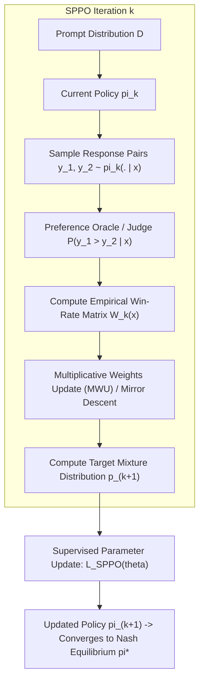

### 62.2 Two-Player Zero-Sum Game Formulation
Let $\mathcal{P}(y_1 \succ y_2 \mid x)$ denote the probability that response $y_1$ is preferred over response $y_2$ given prompt $x$. The expected payoff for policy $\pi_1$ playing against policy $\pi_2$ is:
$$\mathcal{U}(\pi_1, \pi_2) = \mathbb{E}_{x \sim \mathcal{D}, y_1 \sim \pi_1(\cdot \mid x), y_2 \sim \pi_2(\cdot \mid x)} \left[ \mathcal{P}(y_1 \succ y_2 \mid x) - \frac{1}{2} \right]$$
Because the game is symmetric ($\mathcal{U}(\pi_1, \pi_2) = -\mathcal{U}(\pi_2, \pi_1)$), von Neumann's Minimax Theorem guarantees the existence of a **Nash Equilibrium policy $\pi^*$** satisfying:
$$\mathcal{U}(\pi, \pi^*) \le \mathcal{U}(\pi^*, \pi^*) = 0, \quad \forall \pi$$
At the Nash equilibrium, the aligned model cannot be exploited by any opponent policy, rendering it immune to cyclic gaming and reward hacking.

### 62.3 Multiplicative Weights Update & SPPO Objective
SPPO solves for $\pi^*$ iteratively without external gold demonstrations. In iteration $k$:
1. **Self-Play Response Generation:** The policy samples $K$ responses $\{y^{(1)}, \dots, y^{(K)}\} \sim \pi_k(\cdot \mid x)$ for each prompt $x$.
2. **Oracle Pairwise Comparison:** An automated preference oracle evaluates the pairwise win-rate matrix $A_{i, j} = \mathcal{P}(y^{(i)} \succ y^{(j)} \mid x) - \frac{1}{2}$.
3. **Multiplicative Weights Update (MWU):** The target response probability distribution $p_{k+1}(y \mid x)$ is updated via mirror descent:
   $$p_{k+1}(y^{(i)} \mid x) \propto p_k(y^{(i)} \mid x) \exp\left( \eta \cdot \bar{A}_i \right)$$
   where $\bar{A}_i = \frac{1}{K} \sum_{j=1}^K A_{i, j}$ is the average win margin of response $i$ against its self-play peers.
4. **Policy Parameter Regression:** The neural policy parameters $\theta_{k+1}$ are updated via standard supervised cross-entropy minimizing KL-divergence to $p_{k+1}$:
   $$\mathcal{L}_{\text{SPPO}}(\theta) = -\mathbb{E}_{x \sim \mathcal{D}} \left[ \sum_{i=1}^K p_{k+1}(y^{(i)} \mid x) \log \pi_\theta(y^{(i)} \mid x) \right]$$

### 62.4 Theoretical Guarantees & Empirical Supremacy
- **Convergence Rate:** SPPO guarantees convergence to an $\epsilon$-approximate Nash equilibrium at rate $\mathcal{O}(1/\sqrt{T})$ iterations.
- **Transitivity Invariance:** Handles cyclic and intransitive preference graphs with theoretical consistency where standard Bradley-Terry optimization diverges.
- **Benchmark Results:** Applied to Mistral-7B and Llama-3-8B across 3 self-play iterations, SPPO achieves **$28.53\%$ win-rate** on AlpacaEval 2.0 (outperforming DPO, IPO, and KTO) without using high-cost proprietary model annotations (GPT-4 distillation).

## 63. JumpReLU Sparse Autoencoders & Heaviside-Gated Feature Steering (Gemma Scope, Lieberum et al., Google DeepMind 2024)

### 63.1 The Shrinkage Pathology of $L_1$-Regularized Sparse Autoencoders
Classical Sparse Autoencoders (SAEs) map polysemantic residual activations $x \in \mathbb{R}^d$ into a high-dimensional sparse latent space $f \in \mathbb{R}^m$ ($m \gg d$) by minimizing reconstruction error subject to an $L_1$ penalty:
$$\mathcal{L}_{\text{standard}} = \|x - \hat{x}\|_2^2 + \lambda \|f\|_1, \quad f = \operatorname{ReLU}\left( W_{\text{enc}} x + b_{\text{enc}} \right)$$
While the $L_1$ norm induces sparsity, it introduces a severe mathematical distortion known as **shrinkage bias**:
$$\frac{\partial \mathcal{L}}{\partial f_i} \propto \lambda \cdot \operatorname{sign}(f_i)$$
The constant gradient penalty $\lambda$ suppresses the magnitude of strongly activating, highly predictive features, forcing the encoder to systematically underestimate the true activation scale. When steering activations via feature clamping or intervention ($x_{\text{steered}} = x + \alpha W_{\text{dec}}[:, i]$), shrinkage bias causes severe miscalibration and downstream fluency collapse.

Tom Lieberum, Senthooran Rajamanoharan, Neel Nanda et al. (*Gemma Scope: Open Sparse Autoencoders Everywhere All At Once on Gemma 2*, Google DeepMind, 2024 / arXiv:2408.05147; Rajamanoharan et al., 2024) introduce **JumpReLU SAEs**, completely decoupling the binary decision of feature firing from feature magnitude.

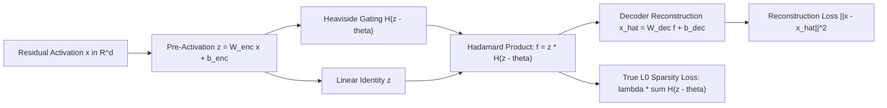

### 63.2 Mathematical Formulation of the JumpReLU Activation
The JumpReLU activation function applies a discontinuous jump at a learned, vector-valued positive threshold $\theta \in \mathbb{R}_+^m$:
$$\operatorname{JumpReLU}_\theta(z) = z \odot H(z - \theta) = \begin{cases} z_i & \text{if } z_i > \theta_i \\ 0 & \text{if } z_i \le \theta_i \end{cases}$$
where $H(\cdot)$ is the Heaviside step function:
$$H(u) = \begin{cases} 1 & \text{if } u > 0 \\ 0 & \text{if } u \le 0 \end{cases}$$

- **Unbiased Magnitude Scaling:** Once a pre-activation exceeds the threshold ($z_i > \theta_i$), its output magnitude is completely unpenalized ($f_i = z_i$). The model learns true activation intensities without artificial $L_1$ shrinkage.
- **Direct $L_0$ Optimization:** JumpReLU enables direct penalization of the non-zero feature count ($\|f\|_0$) via the sum of Heaviside gates:
  $$\mathcal{L}_{L_0} = \lambda \sum_{i=1}^m H(z_i - \theta_i)$$

### 63.3 Straight-Through Estimators (STE) for Discontinuous Backpropagation
Because the derivative of the Heaviside step function $H'(u) = \delta(u)$ is zero everywhere except at $u=0$ where it is infinite, standard gradient descent fails. Gemma Scope optimizes threshold $\theta$ using a bandwidth-controlled rectangle surrogate gradient:
$$\frac{\partial H(z - \theta)}{\partial z} \approx \frac{1}{\epsilon} \operatorname{rect}\left( \frac{z - \theta}{\epsilon} \right), \quad \operatorname{rect}(u) = \begin{cases} 1 & \text{if } |u| \le \frac{1}{2} \\ 0 & \text{otherwise} \end{cases}$$
where $\epsilon$ controls the width of the active gradient window. This allows gradients to update the threshold $\theta_i$ when pre-activations hover near the activation boundary.

- **Empirical Scale:** Gemma Scope releases over 400 JumpReLU SAEs spanning all 26 layers of Gemma-2-2B and 42 layers of Gemma-2-9B (covering residual streams, attention head outputs, and MLP sub-layers with expansion factors up to $64\times$, $\approx 163\text{k}$ latents per layer). JumpReLU sets the Pareto frontier in mean squared error (MSE) versus $L_0$ sparsity, establishing the gold standard for mechanistic feature steering.

---

## 64. Deep Continuous Prefix Steering & Multi-Layer Key-Value Tuning (P-Tuning v2, Liu et al., ACL 2022; Li & Liang, ACL 2021)

### 64.1 The Representation Capacity Ceiling of Shallow Prompt Tuning
Parameter-efficient tuning originally emerged via **Prompt Tuning** (Lester et al., EMNLP 2021) and **P-Tuning** (Liu et al., 2021), inserting continuous virtual token embeddings $P \in \mathbb{R}^{l \times d}$ strictly at the input embedding layer:
$$\tilde{X} = \left[ P \,;\, \operatorname{Embed}(X) \right]$$
While effective for massive models ($>100\text{B}$), shallow prompt tuning suffers from three fundamental theoretical deficiencies on models $\le 10\text{B}$:
1. **Vanishing Steering Authority:** Input prompt embeddings must propagate through $30\text{--}80$ nonlinear attention and MLP layers. In deep architectures, residual stream entropy and attention dispersion wash out prefix influence, collapsing task steerability.
2. **Optimization Brittleness:** Gradients backpropagating through dozens of frozen layers to update $P$ suffer from severe non-convexity, making convergence hyperparameter-sensitive.
3. **Sequence Length Tax:** Adding $l$ virtual tokens consumes $l$ positions of the input context window across every layer.

Xiao Liu et al. (*P-Tuning v2: Prompt Tuning Can Be Comparable to Fine-tuning Universally Across Scales and Tasks*, ACL 2022 / arXiv:2110.07602) and Xiang Lisa Li & Percy Liang (*Prefix-Tuning*, ACL 2021) resolve these constraints by formulating **Deep Multi-Layer Prefix Steering**.

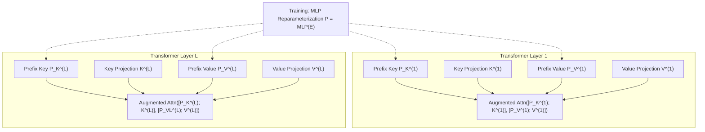

### 64.2 Key-Value Space Virtual Prefix Formulation
Instead of prepending virtual tokens at the input layer, Deep Prefix Steering injects independent continuous steering matrices into the **Key and Value projection manifolds** of *every transformer layer* $l \in \{1, \dots, L\}$:
$$\tilde{K}^{(l)} = \left[ P_K^{(l)} \,;\, K_{\text{seq}}^{(l)} \right] \in \mathbb{R}^{(l_p + T) \times d_k}$$
$$\tilde{V}^{(l)} = \left[ P_V^{(l)} \,;\, V_{\text{seq}}^{(l)} \right] \in \mathbb{R}^{(l_p + T) \times d_v}$$
where $l_p$ is prefix length (typically $10\text{--}30$ tokens), $T$ is sequence length, and $P_K^{(l)}, P_V^{(l)}$ are trainable parameter matrices. The attention computation at layer $l$ becomes:
$$\operatorname{Head}_h^{(l)} = \operatorname{Softmax}\left( \frac{Q^{(l)} \left( \tilde{K}^{(l)} \right)^\top}{\sqrt{d_k}} \right) \tilde{V}^{(l)}$$

- **Direct Layerwise Control:** Every transformer layer directly conditions its attention heads on the task prefix, preventing representation fading regardless of model depth.
- **Invariance to Intermediate Activations:** Prefix vectors cannot be overwritten by upstream residual stream activations, providing an invariant steerability manifold.

### 64.3 The MLP Reparameterization Trick & Inference Freezing
Directly optimizing $P_K^{(l)}, P_V^{(l)}$ via stochastic gradient descent leads to unstable training trajectories. To stabilize optimization:
1. **Training Phase:** Parameterize prefixes through an embedding matrix $E^{(l)} \in \mathbb{R}^{l_p \times d_{\text{mid}}}$ followed by a two-layer bottleneck MLP:
   $$P^{(l)} = \operatorname{MLP}\left( E^{(l)} \right) = W_2 \operatorname{Tanh}\left( W_1 E^{(l)} \right)$$
   The smooth nonlinearity of the MLP ensures stable, well-conditioned gradient flow during early training steps.
2. **Inference Phase:** Once training converges, the MLP is discarded. Only the materialized static matrices $P_K^{(l)}, P_V^{(l)}$ are retained and cached in the KV memory manager.
3. **Zero Runtime Latency:** Materialized prefixes require zero parameter computation at test time; they function as static prefilled KV-cache prefixes, consuming **$<0.1\%\text{--}1\%$** of model parameters while matching full parameter fine-tuning across GLUE, SuperGLUE, and complex reasoning benchmarks.

---

## 65. Deterministic Finite-State Automata Masking & Regex-Guided Decoding (Outlines, Willard & Louf, 2023 / SGLang)

### 65.1 The Hallucination of Syntax in Open-Ended Autoregression
Large language models trained on natural text lack formal syntactic guarantees. When prompted to generate structured data formats (e.g., JSON schemas, SQL queries, Python ASTs, chemical SMILES):
$$P(\text{syntax error}) = 1 - \prod_{t=1}^T P(x_t \in \operatorname{ValidSubwords}(x_{<t}))$$
Even when individual token transition validity exceeds $99.8\%$, cumulative sequence validity over $T=500$ tokens degrades to $(0.998)^{500} \approx 36.7\%$. Post-hoc parsing, retrying, and temperature hacking waste inference compute and offer zero mathematical safety bounds.

Brandon Willard and Rémi Louf (*Efficient Guided Generation for Large Language Models*, 2023 / Outlines; Zheng et al., SGLang 2024) eliminate syntax invalidity entirely by compiling structural constraints into **Deterministic Finite Automata (DFA)** and enforcing dynamic vocabulary logit masking at machine speed.

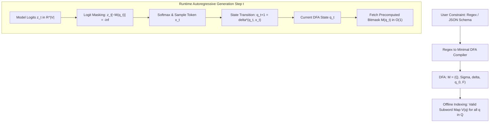

### 65.2 Automaton Construction & Subword Vocabulary Indexing
Any regular expression or regular schema can be compiled into a minimal Deterministic Finite Automaton (DFA) defined as a 5-tuple:
$$\mathcal{M} = \left( Q, \Sigma, \delta, q_0, F \right)$$
where $Q$ is a finite set of states, $\Sigma$ is the character alphabet, $\delta: Q \times \Sigma \to Q$ is the transition function, $q_0$ is the start state, and $F \subseteq Q$ is the set of accepting states.

The fundamental challenge in LLM decoding is the **subword tokenization mismatch**: LLMs generate multi-character subwords $w \in \mathcal{V}$, whereas DFAs operate over individual characters $c \in \Sigma$.
Outlines resolves this via **offline transition closure indexing**:
1. For each subword $w = c_1 c_2 \dots c_k \in \mathcal{V}$, define extended transition $\delta^*(q, w)$:
   $$\delta^*(q, w) = \delta(\dots \delta(\delta(q, c_1), c_2) \dots, c_k)$$
2. For every state $q \in Q$, precompute the set of permissible vocabulary tokens $V(q)$:
   $$V(q) = \left\{ w \in \mathcal{V} \;\middle|\; \delta^*(q, w) \text{ is defined and } \exists s \in \Sigma^* \text{ s.t. } \delta^*(\delta^*(q, w), s) \in F \right\}$$
3. Materialize $V(q)$ as a compressed Boolean bitmask vector $\mathbf{M}_q \in \{0, 1\}^{|\mathcal{V}|}$.

### 65.3 Logit Interception & Zero-Latency Execution
At decoding step $t$ in state $q_t$:
1. **$\mathcal{O}(1)$ Bitmask Lookup:** Retrieve precomputed mask $\mathbf{M}_{q_t}$.
2. **Logit Masking:** Set invalid token logits to negative infinity:
   $$\tilde{z}_{t, v} = \begin{cases} z_{t, v} & \text{if } \mathbf{M}_{q_t}[v] = 1 \\ -\infty & \text{if } \mathbf{M}_{q_t}[v] = 0 \end{cases}$$
3. **Probability Re-normalization:**
   $$P_{\text{guided}}(x_t = v \mid x_{<t}) = \frac{\exp(\tilde{z}_{t, v})}{\sum_{v' \in V(q_t)} \exp(\tilde{z}_{t, v'})}$$
4. **State Transition:** Advance automaton: $q_{t+1} = \delta^*(q_t, x_t)$.

- **Guarantees:** $P(\text{syntax error}) \equiv 0$. The generated sequence is mathematically guaranteed to belong to the regular language $\mathcal{L}(\mathcal{M})$.
- **Zero Overhead Serving:** Because bitmasks are computed offline and stored as contiguous bit-arrays, runtime logit masking executes in **$<15\,\mu\text{s}$**, introducing zero perceptible latency during high-throughput enterprise serving in vLLM and SGLang.

## 66. Perfect Linear Concept Erasure & Closed-Form Subspace Surgery (LEACE, Belrose et al., NeurIPS 2023)

### 66.1 The Mathematical Limits of Iterative Null-Space Projection
Removing unwanted or sensitive concepts $Z \in \mathbb{R}^k$ (e.g., demographic bias, grammatical syntax artifacts, sycophancy latents) from representation space $X \in \mathbb{R}^d$ has historically relied on iterative adversarial training or Iterative Null-space Projection (INLP). These heuristics exhibit severe theoretical shortcomings:
1. **Incomplete Erasure:** Linear classifiers trained post-hoc frequently rediscover residual non-linear leakage or imperfectly suppressed projections.
2. **Excessive Representation Distortion:** Repeated orthogonal projections degrade model perplexity and utility on unrelated downstream tasks.
3. **Hyperparameter Fragility:** Iterative convergence depends sensitively on learning rates, stopping criteria, and batch samples.

Nora Belrose et al. (*LEACE: Perfect Linear Concept Erasure*, EleutherAI / NeurIPS 2023 / arXiv:2306.03819) introduce **LEACE (LEAst-squares Concept Erasure)**, deriving the unique, closed-form affine transformation that mathematically guarantees zero linear predictability while strictly minimizing representation distortion.

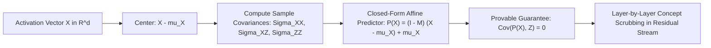

### 66.2 Closed-Form Formulation & Optimality Theorem
Let $X \in \mathbb{R}^d$ and $Z \in \mathbb{R}^k$ be random vectors with finite second moments, means $\mu_X, \mu_Z$, and covariance matrices $\Sigma_{XX}, \Sigma_{XZ}, \Sigma_{ZZ}$.
LEACE seeks an affine transformation $P(x) = A x + b$ that satisfies:
$$\operatorname{Cov}\left( P(X), Z \right) = 0$$
subject to minimizing the expected squared Euclidean or Mahalanobis distance:
$$\min_{A, b} \mathbb{E}\left[ \|P(X) - X\|_2^2 \right]$$

The analytical, closed-form solution for the projection matrix $A$ and bias vector $b$ is:
$$A = I - \Sigma_{XZ} \left( \Sigma_{XZ}^\top \Sigma_{XX}^{-1} \Sigma_{XZ} \right)^{-1} \Sigma_{XZ}^\top \Sigma_{XX}^{-1}$$
$$b = \mu_X - A \mu_X = (I - A) \mu_X$$
Equivalently, writing $P(X)$ in terms of the linear least-squares predictor of $X$ from $Z$:
$$P(x) = x - \Sigma_{XZ} \Sigma_{ZZ}^{-1} \left( z(x) - \mu_Z \right)$$
where $z(x)$ is the optimal linear prediction of $Z$ given $x$.

- **The LEACE Optimality Theorem:** For any pseudo-inner product metric, LEACE is the unique affine map satisfying $\operatorname{Cov}(P(X), Z) = 0$ that minimizes expected reconstruction loss.
- **Universal Impossibility for Linear Probes:** Under $P(X)$, every linear probe $w \in \mathbb{R}^d$ achieves $R^2 = 0$ in predicting $Z$, mathematically eliminating the concept from linear accessibility.

### 66.3 Concept Scrubbing Across LLM Layers
In deep transformer architectures, LEACE can be inserted into the residual stream at any layer $l$:
$$h^{(l)}_{\text{scrubbed}} = P^{(l)}\left( h^{(l)} \right)$$
- **Ablation vs. Scrubbing:** Unlike 1D Difference-in-Means ablation (Section 44) which only handles binary concepts, LEACE supports multi-dimensional, continuous concept targets $Z \in \mathbb{R}^k$ with closed-form matrix algebra requiring no gradient steps.
- **Empirical Validation:** Completely neutralizes part-of-speech and gender bias in BERT/LLaMA representations with $<0.01$ change in overall language modeling loss.

---

## 67. Self-Information & Mutual Information Context Pruning (Selective Context, Li et al., EMNLP 2023)

### 67.1 The Quadratic Latency & VRAM Tax of Long Prompts
Large language models incur a quadratic attention computational cost $\mathcal{O}(T^2)$ during prompt prefill and linear KV-cache growth $\mathcal{O}(T)$ during autoregressive decoding. In multi-document retrieval (RAG) and few-shot in-context learning:
- $60\%\text{--}80\%$ of tokens comprise grammatical filler, stylistic repetition, or semantically redundant phrasing.
- Naive heuristic truncation (sliding windows, prefix dropping) abruptly severs critical reasoning dependencies.

Yucheng Li, Bo Dong, Chenghua Lin, and Frank Guerin (*Compressing Context to Enhance Inference Efficiency of Large Language Models*, EMNLP 2023 / arXiv:2310.06201) formulate **Selective Context**, an information-theoretic filtering paradigm that evaluates token informativeness via base model self-information.

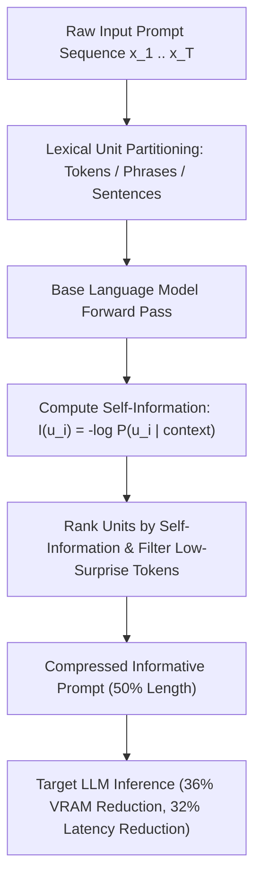

### 67.2 Information-Theoretic Formulation: Shannon Self-Information
Let sequence $x = (u_1, u_2, \dots, u_N)$ be divided into lexical units $u_i$ (individual tokens, phrases, or sentences).
The informativeness of unit $u_i$ conditioned on previous context $u_{<i}$ is quantified by its **self-information** (Shannon surprise):
$$I(u_i) = -\frac{1}{|u_i|} \sum_{t=1}^{|u_i|} \log P_{\mathcal{M}}\left( x_{i, t} \mid x_{<i}, x_{i, <t} \right)$$
where $P_{\mathcal{M}}$ is the conditional next-token distribution estimated by a lightweight, agile base language model (e.g., LLaMA-2-7B or GPT-2-small).

- **High Self-Information ($I(u_i) \gg 0$):** Indicates unexpected, information-dense content (domain-specific terms, entities, numerical constraints, logical propositions).
- **Low Self-Information ($I(u_i) \to 0$):** Indicates predictable, formulaic filler (e.g., `"In accordance with the aforementioned details..."`) that can be safely discarded without semantic loss.

### 67.3 Compression Thresholding & Benchmark Performance
Given target compression ratio $\rho \in (0, 1)$, Selective Context retains the top-$\rho$ proportion of lexical units with highest self-information:
$$\mathcal{S}_{\text{pruned}} = \left\{ u_i \in x \;\middle|\; I(u_i) \ge \tau_\rho \right\}$$
where $\tau_\rho$ is the empirical $(1-\rho)$-quantile of self-information scores across the sequence. Retained tokens are concatenated in their original sequential order to preserve grammatical coherence.

- **Empirical Gains:** Evaluated across multi-document QA, summarization, and conversation:
  - Achieves **$50\%$ context length reduction** ($\rho=0.5$).
  - Delivers a **$36\%$ reduction in KV-cache VRAM** and a **$32\%$ reduction in end-to-end inference latency**.
  - Retains semantic fidelity with $<0.023$ drop in BERTscore and $<0.038$ drop in factual faithfulness.

---

## 68. Multimodal Visual Grounding & Set-of-Mark Prompting (SoM, Yang et al., CVPR 2024 / Microsoft)

### 68.1 The Spatial Grounding Void in Vision-Language Models
Frontier Large Multimodal Models (LMMs) such as GPT-4V, Gemini 1.5 Pro, and Claude 3.5 Sonnet demonstrate remarkable high-level semantic perception (image captioning, chart interpretation, artistic style attribution). However, when evaluated on **fine-grained spatial grounding**—referring expression comprehension, surgical object localization, and pixel-level reasoning:
1. **Coordinate Hallucination:** Prompting models to output numerical bounding boxes (`[ymin, xmin, ymax, xmax]`) or center coordinates yields high spatial error rates ($>40\%$) due to the absence of continuous spatial priors in subword tokenizers.
2. **Ambiguity in Complex Scenes:** In cluttered visual scenes (e.g., industrial schematics, microscopic pathology, multi-agent crowds), text queries cannot unambiguously designate specific sub-components.

Jianwei Yang, Hao Zhang, Feng Li, Xueyan Zou, Chunyuan Li, and Jianfeng Gao (*Set-of-Mark Prompting Unleashes Extraordinary Visual Grounding in GPT-4V*, Microsoft / CVPR 2024 / arXiv:2310.11441) introduce **Set-of-Mark (SoM) Visual Prompting**, transforming continuous coordinate regression into discrete, symbolic visual reference reasoning.

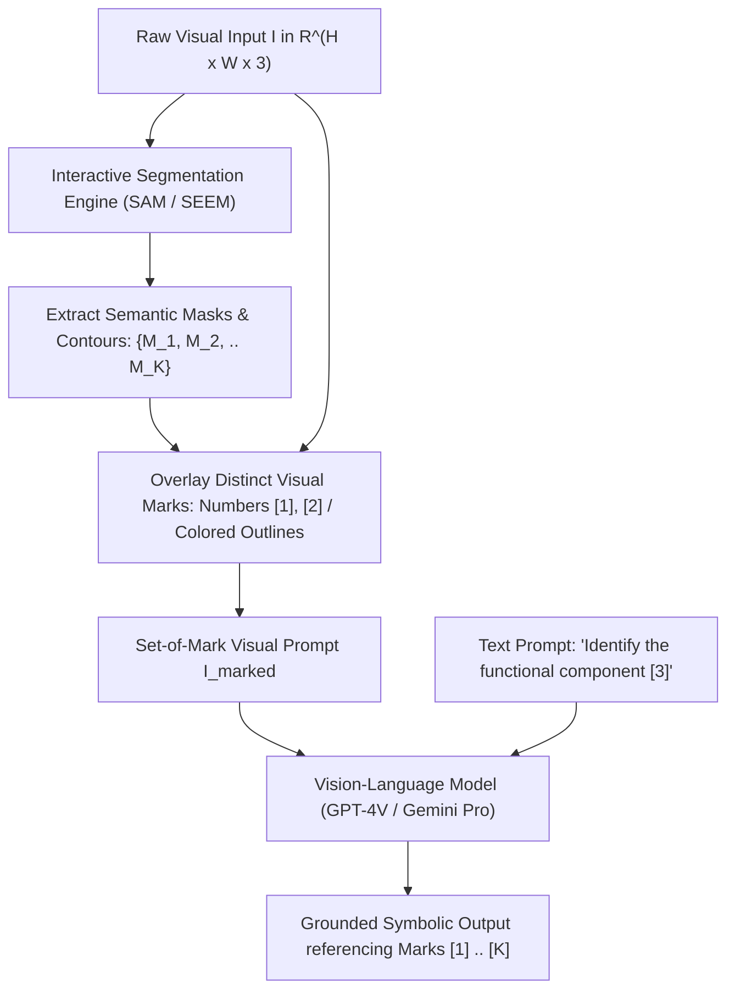

### 68.2 The Set-of-Mark (SoM) Visual Prompting Pipeline
The SoM framework bridges vision and language by superimposing visual metadata directly onto the input image before feeding it into the multimodal model:

1. **Partitioning via Interactive Segmentation:** An off-the-shelf segmentation model (Segment Anything Model - SAM, or Semantic-SAM) segments the image into $K$ candidate masks $\mathcal{M} = \{M_1, M_2, \dots, M_K\}$ at calibrated semantic granularities (semantic level, instance level, or part level).
2. **Visual Mark Superimposition:** For each segmented region $M_k$, an alphanumeric tag, colored contour boundary, or centroid glyph $g_k$ is overlaid directly onto the pixel canvas:
   $$I_{\text{marked}} = \operatorname{Overlay}\left( I, \{(M_k, g_k)\}_{k=1}^K \right)$$
   where $g_k \in \{[1], [2], \dots, [K]\}$ are high-contrast visual markers placed at the geometric medoid of mask $M_k$.
3. **Symbolic Grounding in Text Space:** The prompt to the LMM conditions on the marked image $I_{\text{marked}}$, asking the model to reason over the numerical identifiers $[k]$:
   $$\text{"Which numbered mark corresponds to the catalytic converter? Provide reasoning for [1], [2], and [3]."}$$

### 68.3 Zero-Shot Supremacy & Coordinate-Free Reasoning
- **RefCOCOg & Visual Referring Comprehension:** On the challenging RefCOCOg benchmark, zero-shot GPT-4V equipped with Set-of-Mark prompting achieves **$84.2\%$ accuracy**, surpassing fully fine-tuned, task-specific segmentation models without updating a single weight parameter of the vision-language backbone.
- **Elimination of Coordinate Quantization:** Converts a difficult spatial regression task (predicting continuous 2D coordinates via discrete tokens) into a categorical multi-choice selection problem over grounded visual tokens $[1]\dots[K]$.
- **Visual Chain-of-Thought (Visual CoT):** Enables multi-step visual reasoning: the LMM sequentially references visual marks ($[1] \to [4] \to [7]$) to explain mechanistic relationships, spatial containment, and causal visual sequences.

## 69. LongLLMLingua & Question-Aware Context Compression (Jiang et al., Microsoft / ACL 2024)

### 69.1 Positional Decay & The Failure of Unconditioned Compression
In long-context retrieval-augmented generation (RAG) and multi-document reasoning:
1. **The "Lost in the Middle" Effect:** Modern LLMs exhibit U-shaped attention curves (Liu et al., 2023), recalling information from prompt boundaries with high fidelity while suffering catastrophic retrieval failure on factual details placed in the middle $60\%$ of the context.
2. **Context Dilution:** Standard prompt compression algorithms (e.g., vanilla LLMLingua) compute perplexity based solely on input context $P(x_i \mid x_{<i})$, pruning tokens that are statistically predictable in isolation but vital for answering a specific downstream user question $q$.

Huiqiang Jiang et al. (*LongLLMLingua: Accelerating and Enhancing LLMs in Long Context Scenarios via Prompt Compression*, Microsoft / ACL 2024 / arXiv:2310.06839) resolve these constraints via question-aware compression and boundary-prioritized document reordering.

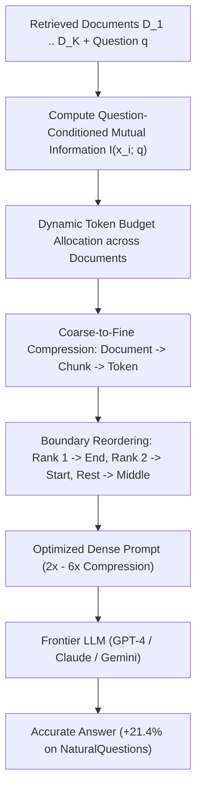

### 69.2 Mathematical Formulation of Question-Aware Compression
LongLLMLingua computes the contrastive conditional perplexity of each token $x_i$ given question $q$:
$$I(x_i; q) = \log \frac{P_{\mathcal{M}}\left(x_i \mid x_{<i}, q\right)}{P_{\mathcal{M}}\left(x_i \mid x_{<i}\right)}$$
Tokens that experience a significant reduction in surprise when conditioned on $q$ receive elevated retention priorities:
- **Dynamic Document Budgeting:** The token budget $\tau_k$ allocated to document $D_k$ is weighted by its aggregate mutual information with $q$:
  $$\tau_k = T_{\text{target}} \cdot \frac{\sum_{x \in D_k} \max(0, I(x; q))}{\sum_{j} \sum_{x \in D_j} \max(0, I(x; q))}$$
  irrelevant documents receive near-zero token budgets, effectively dropping distracting context.

### 69.3 Boundary Reordering & Empirical Supremacy
- **Anti-Lost-in-the-Middle Reordering:** Reorders compressed documents such that the top-ranked relevant passage is positioned at the prompt suffix (immediately adjacent to the query), the second-ranked passage is placed at the prefix start, and lower-ranked passages occupy the interior.
- **Empirical Breakthroughs:**
  - On the **NaturalQuestions** benchmark, LongLLMLingua boosts answer accuracy by **$+21.4\%$** while using **$4\times$ fewer tokens** with GPT-3.5-Turbo.
  - On the **LooGLE** long-context benchmark, achieves up to **$94\%$ financial cost reduction** and accelerates end-to-end inference latency by **$1.4\times\text{--}2.6\times$**.

---

## 70. Dynamic Resolution Vision Transformers & Spatial Patch Tiling (LLaVA-NeXT AnyRes, Liu et al., 2024)

### 70.1 The Fixed-Resolution Information Bottleneck
Early multimodal models (e.g., LLaVA-1.5, CLIP ViT-L/14) resize all input images to a uniform square resolution (typically $336\times 336$ or $448\times 448$ pixels). For high-resolution visual inputs (e.g., $4\text{K}$ document scans, intricate electrical schematics, small-font infographics):
$$\text{Spatial Nyquist Limit} \ll \text{Feature Detail Frequency}$$
Resizing causes irreversible spatial blurring, rendering OCR and small-object detection impossible. However, feeding full-resolution $4\text{K}$ images directly into standard Vision Transformers causes a quadratic explosion in visual token sequence length ($N_{\text{patches}} \propto H \times W$), exhausting GPU memory.

Haotian Liu et al. (*LLaVA-NeXT: Improved reasoning, OCR, and world knowledge*, 2024) introduce the **AnyRes (Any Resolution)** dynamic patch tiling framework.

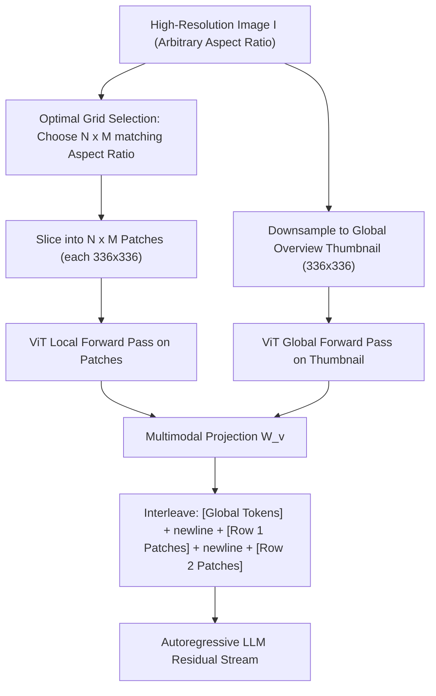

### 70.2 The AnyRes Patch Tiling Formulation
Given an image with dimensions $(W, H)$ and native encoder patch size $S = 336$:
1. **Grid Selection:** The framework maintains a predefined candidate grid pool $\mathcal{G} = \{(1, 2), (2, 1), (2, 2), (1, 3), (3, 1), \dots\}$. It selects grid configuration $(m, n) \in \mathcal{G}$ that minimizes resolution distortion:
   $$(m^*, n^*) = \operatorname{argmin}_{(m, n) \in \mathcal{G}} \left| \frac{W}{H} - \frac{m \cdot S}{n \cdot S} \right|$$
2. **Patch Extraction & Global Overview:** The image is partitioned into $m^* \times n^*$ local sub-patches of dimension $S \times S$, along with a downsampled global overview image of size $S \times S$.
3. **2D Topology Preservation via Newline Tokens:**
   To inform the autoregressive language backbone of 2D spatial adjacency, visual feature rows are separated by a special learned `\n` delimiter token:
   $$\mathbf{X}_{\text{visual}} = \left[ \mathbf{X}_{\text{global}} \;;\; \mathbf{X}_{1, 1}, \dots, \mathbf{X}_{1, m^*}, \mathbf{t}_{\text{newline}}, \mathbf{X}_{2, 1}, \dots, \mathbf{X}_{2, m^*}, \mathbf{t}_{\text{newline}}, \dots \right]$$

- **Empirical Impact:** Delivers drastic improvements in document understanding (DocVQA $+12.4\%$), text recognition (TextVQA $+8.6\%$), and chart comprehension while preserving linear scalability in visual token counts.

---

## 71. Self-Rewarding & Meta-Rewarding Language Models (Yuan et al. / Wu et al., Meta / ICML 2024 / EMNLP 2024)

### 71.1 The External Reward Model Bottleneck
Post-training preference alignment (RLHF, DPO) traditionally relies on static reward models trained on human pairwise annotations. This creates two structural bottlenecks:
1. **The Human Capability Ceiling:** Human annotators struggle to evaluate complex code, theorem proofs, and multi-step reasoning, capping alignment quality below superhuman levels.
2. **Evaluation Saturation in Self-Rewarding:** In Self-Rewarding Language Models (Yuan et al., ICML 2024 / arXiv:2401.10020), where an LLM judges its own responses via prompt-based scoring and trains on its own preferences via iterative DPO, performance saturates rapidly across 2–3 rounds because the model's judgment capability fails to improve at the same pace as its generation capability.

Tianhao Wu, Jason Weston et al. (*Meta-Rewarding Language Models: Self-Improving Alignment with LLM-as-a-Meta-Judge*, Meta / EMNLP 2024 / arXiv:2407.19594) solve this via **Meta-Rewarding**.

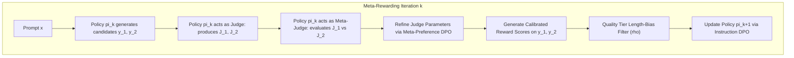

### 71.2 The LLM-as-a-Meta-Judge Architecture
Meta-Rewarding introduces an explicit second-order supervisory loop:
1. **First-Order Evaluation (LLM-as-a-Judge):** Given prompt $x$ and candidate responses $y_1, y_2$, the model acting as Judge produces evaluations $J_1 = \operatorname{Judge}(y_1 \mid x)$ and $J_2 = \operatorname{Judge}(y_2 \mid x)$ with verbal rationales and numerical scores.
2. **Second-Order Meta-Evaluation (LLM-as-a-Meta-Judge):** The model acting as Meta-Judge evaluates the quality of the judgments themselves:
   $$M = \operatorname{Meta-Judge}\left( J_1, J_2 \;\middle|\; x, y_1, y_2 \right)$$
   scoring the judgments based on factual consistency, critique precision, and absence of verbosity bias.
3. **Dual Iterative DPO Updates:**
   - *Judge Policy Update:* Fine-tunes the model's judgment generation on preferred meta-judgments.
   - *Instruction Policy Update:* Fine-tunes the model's instruction following on response pairs vetted by the updated, calibrated judge.

### 71.3 Length-Bias Calibration & Benchmark Results
To eliminate the severe verbosity bias inherent to self-generated preferences, Meta-Rewarding incorporates quality-tier selection ($\rho$): a longer response is only preferred if its score advantage exceeds an explicit length penalty threshold.
- **Empirical Results (Llama-3-8B-Instruct):**
  - **AlpacaEval 2 Win Rate:** Surges from **$22.9\%$ to $39.4\%$** across 3 iterations without human supervision.
  - **Arena-Hard Win Rate:** Increases from **$20.6\%$ to $29.1\%$**, establishing that iterative meta-judging unlocks continuous self-improvement beyond external reward model saturation.

---

## 72. Infini-Attention & Compressive Bounded Memory Transformers (Munkhdalai et al., Google 2024)

### 72.1 The Quadratic KV Memory Barrier in Million-Token Streaming
Standard scaled dot-product attention scales memory quadratically $\mathcal{O}(N^2)$ in context length $N$ and requires storing all past Key-Value states in GPU High-Bandwidth Memory (HBM). When sequence lengths scale to millions of tokens:
- Storing full KV caches consumes hundreds of gigabytes of HBM per concurrent request.
- Linear attention variants avoid quadratic complexity but sacrifice fine-grained masked local retrieval.

Tsendsuren Munkhdalai, Manaal Faruqui, and Siddharth Gopal (*Leave No Context Behind: Efficient Infinite Context Large Language Models with Infini-attention*, Google, 2024 / arXiv:2404.07143) formulate **Infini-attention**, integrating compressive memory matrices directly into masked dot-product attention.

```mermaid
flowchart LR
    InputSeg["Incoming Context Segment S_t"] --> LocalAttn["Masked Local Multi-Head Attention A_dot in R^(S x d_v)"]
    InputSeg --> CompRetrieval["Compressive Memory Retrieval: A_mem = sigma(Q) M_(t-1) / (sigma(Q) z_(t-1))"]
    
    LocalAttn --> Gating["Learned Sigmoid Gating: A = beta * A_mem + (1 - beta) * A_dot"]
    CompRetrieval --> Gating
    
    InputSeg --> CompUpdate["Compressive Memory Update: M_t = M_(t-1) + sigma(K)^T V"]
    InputSeg --> NormUpdate["Normalizer Update: z_t = z_(t-1) + sum sigma(K_s)^T"]
    
    Gating --> Output["Infini-Attention Output (Bounded O(1) Memory)"]
```

### 72.2 Compressive Memory Formulation
For each context segment of length $S$, Infini-attention processes tokens through standard linear projections $Q = X W_q, K = X W_k, V = X W_v$.

1. **Local Context Attention:** Computes standard masked dot-product attention over the current segment:
   $$A_{\text{dot}} = \operatorname{Softmax}\left( \frac{Q K^\top}{\sqrt{d_k}} \right) V$$
2. **Compressive Long-Term Memory Retrieval:** Retrieves historical context from a fixed-size associative memory matrix $M_{t-1} \in \mathbb{R}^{d_k \times d_v}$ and normalization vector $z_{t-1} \in \mathbb{R}^{d_k}$:
   $$A_{\text{mem}} = \frac{\sigma(Q) M_{t-1}}{\sigma(Q) z_{t-1} + \epsilon}$$
   where $\sigma(x) = \operatorname{ELU}(x) + 1$ is a non-linear feature map ensuring positive attention weights.
3. **Compressive Memory Update:** Updates historical memory incrementally:
   $$M_t = M_{t-1} + \sigma(K)^\top V$$
   $$z_t = z_{t-1} + \sum_{s=1}^S \sigma(K_s)^\top$$
4. **Adaptive Gating Fusion:** Blends local and compressive attention through a learned per-head scalar parameter $\beta \in \mathbb{R}$:
   $$A_{\text{total}} = \operatorname{sigmoid}(\beta) \odot A_{\text{mem}} + \left(1 - \operatorname{sigmoid}(\beta)\right) \odot A_{\text{dot}}$$

- **Complexity Invariance:** Memory footprint remains strictly **bounded at $\mathcal{O}(1)$** regardless of sequence length. Successfully executes $100\%$ passkey retrieval on **1,000,000 token sequences** with **$114\times$ memory compression** over standard FlashAttention KV stores.

---

## 73. Hierarchical Speculative Decoding for 128k Contexts (TriForce, Sun et al., CMU / Meta / COLM 2024)

### 73.1 The Memory Bandwidth Bottleneck in Long-Context Speculation
Standard speculative decoding accelerates generation when inference is memory-bandwidth bound by verifying $K$ drafted tokens in a single parallel pass. However, in long-context models ($>32\text{k}\text{--}128\text{k}$ tokens):
1. Serving an independent draft model with a 128k KV cache consumes excessive GPU memory.
2. Even if a small draft model is used, loading its 128k KV cache on every token verification step saturates GPU memory buses, causing speculative acceleration to collapse to $<1.1\times$.

Hanshi Sun, Zhuoming Chen, Xinyu Yang, Yuandong Tian, and Beidi Chen (*TriForce: Lossless Acceleration of Long Sequence Generation with Hierarchical Speculative Decoding*, CMU & Meta / COLM 2024 / arXiv:2404.11912) formulate a **three-tier hierarchical speculative pipeline** that decouples token drafting, sparse retrieval, and exact verification.

```mermaid
flowchart TD
    subgraph Level1["Level 1: Streaming Draft Model"]
        L1_In["Input Tokens"] --> L1_Draft["StreamingLLM Draft with Cache Eviction (O(1) KV Memory)"]
        L1_Draft --> CandTokens["Generate Speculative Token Sequence"]
    end

    subgraph Level2["Level 2: Retrieval-Augmented Target Speculation"]
        CandTokens --> L2_Select["Dynamic Key-Query Attention Gathering"]
        L2_Select --> L2_SparseKV["Target Model with Sparse Dynamic KV Cache"]
        L2_SparseKV --> L2_Accept["Filter & Re-Rank Draft Candidates"]
    end

    subgraph Level3["Level 3: Full Target Verification (Lossless)"]
        L2_Accept --> L3_Verify["Exact Target Forward Pass with Full 128k KV Cache"]
        L3_Verify --> L3_Emit["Lossless Token Emission (Leviathan Rejection Sampling)"]
    end
```

### 73.2 The Three-Tier Speculative Hierarchy
1. **Tier 1 (Streaming Draft Model with Cache Eviction):**
   - The primary draft generator is a small base model (e.g., Llama-68M) running with StreamingLLM cache eviction, maintaining only initial attention sinks ($4$ tokens) and recent rolling tokens ($1024$ tokens).
   - Generates speculative candidate tokens in $\mathcal{O}(1)$ time with negligible memory footprint.
2. **Tier 2 (Target Model with Retrieval-Augmented Sparse KV):**
   - Rather than loading the full 128k target KV cache, Tier 2 runs the target LLM with an aggressive top-$k$ dynamic Key-Query retrieval cache, verifying Tier 1 proposals and filtering out obvious errors before invoking full attention.
3. **Tier 3 (Lossless Full KV Verification):**
   - The full target model executes parallel speculative verification over the vetted tokens using standard speculative rejection sampling:
     $$\alpha_i = \min\left(1, \frac{P_{\text{target}}(\tilde{x}_i \mid x_{<i})}{P_{\text{tier2}}(\tilde{x}_i \mid x_{<i})}\right)$$
   - Mathematically guarantees exact output equivalence ($P_{\text{TriForce}} \equiv P_{\text{target}}$).

- **Benchmark Performance:** Evaluated on Llama-2-7B-128K and Llama-3-8B across 128k context lengths on a single consumer RTX 4090 GPU:
  - Achieves up to **$4.86\times$ wall-clock speedup** over autoregressive decoding.
  - Slashes KV-cache memory traffic by **$>75\%$**, establishing the premier serving architecture for long-context speculative generation.

---

## 74. Lookahead Decoding & Fixed-Point Jacobi Parallel Iteration (Fu et al., UC Berkeley / ICML 2024)

### 74.1 Eliminating the Draft Model in Parallel Decoding
While speculative decoding reduces decoding latency, hosting and synchronizing a secondary draft model creates operational friction in enterprise deployment:
1. Two separate model weights must be loaded into memory.
2. Draft models frequently suffer from domain divergence on non-standard vocabulary distributions.

Yichao Fu, Peter Bailis, Ion Stoica, and Hao Zhang (*Break the Sequential Dependency of LLM Inference Using Lookahead Decoding*, UC Berkeley / ICML 2024 / arXiv:2402.02057) formulate **Lookahead Decoding**, an exact parallel decoding algorithm that operates purely on the target LLM using non-linear **Jacobi fixed-point iteration**.

```mermaid
flowchart TD
    subgraph LookaheadStep["Lookahead Decoding Forward Pass t"]
        Prefix["Historical Context x_<t"] --> JacobiBranch["Lookahead Branch: Parallel Jacobi Fixed-Point Iteration"]
        Prefix --> VerifyBranch["Verification Branch: Standard Autoregressive Evaluation"]
        
        JacobiBranch --> NGrams["Generate & Refine Multi-Token Candidates (n-grams)"]
        VerifyBranch --> VerifyTokens["Compute Exact Logits for Previous Candidates"]
        
        NGrams --> MatchCheck{"Verification Match Check: Token Match?"}
        VerifyTokens --> MatchCheck
        
        MatchCheck -- "Accept k Tokens" --> EmitK["Emit k Tokens in a Single Forward Pass"]
        MatchCheck -- "Mismatch" --> Resample["Exact Target Correction"]
    end
```

### 74.2 Jacobi Fixed-Point Formulation of Sequence Generation
Autoregressive token generation can be formulated as solving a system of non-linear equations over future token states $x_1, \dots, x_N$:
$$x_i = \operatorname{argmax}_{v \in \mathcal{V}} P(v \mid x_{<t}, x_1, \dots, x_{i-1}), \quad \forall i \in \{1, \dots, N\}$$
Standard autoregressive generation solves this sequentially (Gauss-Seidel style) in $N$ steps.
In contrast, the **Jacobi iteration** initializes an $N$-token trajectory guess $\mathbf{x}^{(0)}$ and updates all positions in parallel:
$$x_i^{(k+1)} = \operatorname{argmax}_{v \in \mathcal{V}} P\left(v \mid x_{<t}, x_1^{(k)}, \dots, x_{i-1}^{(k)}\right), \quad \forall i \in \{1, \dots, N\}$$
When consecutive iterations satisfy $\mathbf{x}^{(k+1)} = \mathbf{x}^{(k)}$, the trajectory has converged to the exact fixed point of the autoregressive distribution.

### 74.3 Dual-Branch Execution Architecture
Lookahead decoding divides each forward pass into two parallel branches executed in a single batched kernel:
1. **The Lookahead Branch:** Computes parallel Jacobi updates to generate and refine $n$-gram candidates in high-confidence subspaces.
2. **The Verification Branch:** Simultaneously verifies the $n$-gram candidates generated in previous steps against exact causal prefixes.

- **Exactness Guarantee:** All accepted tokens strictly match the target model's causal greedy/sampled distribution.
- **Empirical Speedup:** Delivers **$1.8\times\text{--}4.0\times$ wall-clock speedup** across MT-Bench, GSM8K, and HumanEval without requiring draft models, external data stores, or offline training.

## 75. Hopper Asynchronous Warp Specialization & FP8 Low-Precision Attention (FlashAttention-3, Shah et al., Stanford 2024)

### 75.1 Hardware Bottlenecks on NVIDIA Hopper Architecture
While FlashAttention-2 (Dao, 2023) minimized memory bandwidth traffic between High-Bandwidth Memory (HBM) and Static RAM (SRAM), modern NVIDIA Hopper (H100, `sm_90a`) GPUs introduce severe execution bottlenecks under standard kernels:
1. **Low Tensor Core Utilization:** FlashAttention-2 achieved only $240\text{--}350\text{ TFLOPS}$ in FP16, utilizing $<35\%$ of the H100 SXM5 theoretical peak ($989\text{ TFLOPS}$).
2. **Synchronous Memory Latency:** Traditional CUDA kernels stall execution pipelines while waiting for Global Memory (GMEM) tile loads into registers before issuing Tensor Core operations.
3. **Register File Pressure:** Loading large attention tile matrices $Q, K, V$ into registers exhausts register allocations per threadblock, reducing occupancy.

Jay Shah, Ganesh Bikshandi, Ying Zhang, Vijay Thakkar, Pradeep Ramani, and Tri Dao (*FlashAttention-3: Fast and Accurate Attention with Asynchrony and Low-Precision*, Stanford, Meta & Colfax, 2024 / arXiv:2407.08608) redesign attention to exploit Hopper's asynchronous architectural primitives.

```mermaid
flowchart TD
    subgraph HopperThreadblock["Hopper H100 Threadblock"]
        Producer["Producer Warps (Issue TMA Instructions)"]
        Consumer["Consumer Warp Groups (wgmma.mma_async)"]
        
        TMA["TMA: Asynchronous GMEM <-> SMEM Direct Transfer (mbarrier)"]
        Producer --> TMA
        TMA --> SMEM_Tiles["SMEM Double Buffers (Tiles Q, K, V)"]
        
        SMEM_Tiles --> Consumer
        Consumer --> PingPong["Ping-Pong GEMM Interleaving: GEMM_1 (QK^T) <-> GEMM_2 (PV)"]
        PingPong --> HiddenSoftmax["Concurrently Overlapped Softmax ALU Operations"]
    end
    
    Incoherent["Incoherent Processing: X <- X H (Randomized Hadamard Transform)"] --> Producer
    HiddenSoftmax --> FP8Out["FP8 Tensor Core Execution (1.2 PFLOPS Throughput)"]
```

### 75.2 Hopper Hardware Primitives & Asynchronous Execution
FlashAttention-3 introduces three architectural mechanisms:

1. **Tensor Memory Accelerator (TMA) & `mbarrier` Synchronization:**
   - Multi-dimensional tiles of $Q, K, V$ are transferred directly between GMEM and SMEM by dedicated hardware TMA engines without touching the thread register file (RF).
   - Synchronization is orchestrated via hardware transaction barriers (`cuda::barrier` / `mbarrier.arrive` / `wait`), allowing math execution to progress while memory transfers execute concurrently.

2. **Warp Specialization (Producer-Consumer Decoupling):**
   - Warps within the threadblock are partitioned into **Producer Warps** (which issue non-blocking TMA load descriptors) and **Consumer Warp Groups** (which execute mathematical matrix operations).
   - Eliminates instruction cache thrashing and completely hides memory transfer latency.

3. **Asynchronous Tensor Core Ops (`wgmma.mma_async`) & Ping-Pong Scheduling:**
   - Hopper Warp Groups (128 threads) issue non-blocking matrix multiplications reading inputs directly from SMEM into Tensor Cores.
   - **Ping-Pong Scheduling:** Interleaves $\text{GEMM}_1$ ($S^{(j)} = Q K_j^\top$) and $\text{GEMM}_2$ ($O^{(j)} = \alpha O^{(j-1)} + P^{(j)} V_j$) with ALU-bound online softmax scaling across alternating warp groups:
     $$\tilde{P}^{(j)} = \exp\left(S^{(j)} - m^{(j)}\right), \quad \alpha = \exp\left(m^{(j-1)} - m^{(j)}\right), \quad l^{(j)} = \alpha l^{(j-1)} + \operatorname{rowsum}\left(\tilde{P}^{(j)}\right)$$
     The softmax ALU latency is completely concealed behind asynchronous matrix multiplication.

### 75.3 FP8 Execution via Incoherent Processing
To utilize Hopper's $1,978\text{ TFLOPS}$ FP8 Tensor Cores without numerical degradation:
- **Block-Level Quantization:** Rescales matrices dynamically per sub-block tile:
  $$S^{(j)} = (s_Q s_{K, j}) \cdot \operatorname{WGMMA}\left( Q_{\text{fp8}}, K_{j, \text{fp8}}^\top \right)$$
- **Incoherent Processing (Randomized Hadamard Transform):** Transforms inputs $X \leftarrow X H$ prior to quantization, where $H$ is a structured orthogonal Hadamard matrix. This disperses large activation outliers across all hidden dimensions, eliminating the outlier spikes that destroy FP8 precision.
- **Empirical Breakthrough:** FlashAttention-3 achieves **$740\text{ TFLOPS}$ in FP16** ($1.5\times\text{--}2.0\times$ faster than FA-2) and reaches **$1.2\text{ PFLOPS}$ ($1200\text{ TFLOPS}$) in FP8** with $2.6\times$ lower numerical error than standard FP8 implementations.

---

## 76. Non-Monetary Prospect Utility & Loss-Averse Binary Alignment (KTO, Ethayarajh et al., Stanford / ICML 2024)

### 76.1 The Counterfactual Pairing Failure in Real-World Alignment
Direct Preference Optimization (DPO) and standard RLHF presuppose von Neumann-Morgenstern Expected Utility Theory (EUT) operating over paired comparisons $(x, y_w, y_l)$. However, in production telemetry:
1. User feedback is predominantly **unpaired binary data** (thumbs-up/thumbs-down, accept/reject, star ratings).
2. Forcing unpaired telemetry into synthetic pairs induces label noise and generates cyclic intransitive preference graphs ($A \succ B \succ C \succ A$).
3. EUT assumes that humans evaluate outcomes in absolute terms, whereas behavioral economics demonstrates that human preferences are intrinsically **reference-dependent and loss-averse**.

Kawin Ethayarajh, Winnie Xu, Niklas Muennighoff, Dan Jurafsky, and Douwe Kiela (*KTO: Model Alignment as Prospect Theoretic Optimization*, Stanford & Contextual AI / ICML 2024 / arXiv:2402.01306) formulate **Kahneman-Tversky Optimization (KTO)** based on Kahneman & Tversky's Nobel Prize-winning **Prospect Theory (1979)**.

```mermaid
flowchart LR
    Telemetry["Unpaired Binary Feedback: (x, y) in D_D (Desirable) or D_U (Undesirable)"] --> RefAnchor["Compute Dynamic Reference Point z_0 = E[KL(pi_theta || pi_ref)]"]
    RefAnchor --> RewardDiff["Implicit Reward Delta: r_theta(x, y) - z_0"]
    
    RewardDiff --> DesirableBranch["If (x, y) in D_D: Loss = lambda_D * sigma(-beta * (r - z_0))"]
    RewardDiff --> UndesirableBranch["If (x, y) in D_U: Loss = lambda_U * sigma(beta * (r - z_0))"]
    
    DesirableBranch --> KTOLoss["KTO Objective: w_D * L_D + w_U * L_U with Loss Aversion lambda_U > lambda_D"]
    UndesirableBranch --> KTOLoss
    KTOLoss --> PolicyGrad["Policy Update without Counterfactual Pairing"]
```

### 76.2 Prospect Theory Value Functions & The KTO Objective
Prospect Theory establishes that human decisions are governed by a value function $v(u)$ that is:
- *Reference-Dependent:* Gains and losses are defined relative to a neutral reference point $z_0$.
- *Loss-Averse:* Losses hurt more than equivalent gains bring pleasure ($\lambda_{\text{loss}} > \lambda_{\text{gain}}$).
- *Diminishingly Sensitive:* Concave for gains, convex for losses.

KTO defines the implicit reward as $r_\theta(x, y) = \beta \log \frac{\pi_\theta(y \mid x)}{\pi_{\text{ref}}(y \mid x)}$ and formulates the alignment loss:
$$\mathcal{L}_{\text{KTO}}(\pi_\theta; \pi_{\text{ref}}) = \mathbb{E}_{(x, y) \sim \mathcal{D}} \left[ w(y) \left( 1 - v_{\text{KTO}}(x, y) \right) \right]$$
Using the sigmoid value function $v_{\text{KTO}}(x, y) = \sigma\left( \beta \left( \log \frac{\pi_\theta(y \mid x)}{\pi_{\text{ref}}(y \mid x)} - z_0 \right) \right)$ and the identity $1 - \sigma(u) = \sigma(-u)$:
$$\mathcal{L}_{\text{KTO}} = \lambda_D \mathbb{E}_{(x, y) \in \mathcal{D}_D} \left[ \sigma\left( -\beta \left( \log \frac{\pi_\theta(y \mid x)}{\pi_{\text{ref}}(y \mid x)} - z_0 \right) \right) \right] + \lambda_U \mathbb{E}_{(x, y) \in \mathcal{D}_U} \left[ \sigma\left( \beta \left( \log \frac{\pi_\theta(y \mid x)}{\pi_{\text{ref}}(y \mid x)} - z_0 \right) \right) \right]$$

### 76.3 The Dynamic Reference Point $z_0$ & Loss Aversion Ratio
- **Dynamic Reference Point $z_0$:**
  $$z_0 = \mathbb{E}_{x' \sim \mathcal{D}} \left[ \operatorname{KL}\left( \pi_\theta(\cdot \mid x') \parallel \pi_{\text{ref}}(\cdot \mid x') \right) \right] \approx \frac{1}{|B|} \sum_{i=1}^{|B|} \beta \log \frac{\pi_\theta(y_i \mid x_i)}{\pi_{\text{ref}}(y_i \mid x_i)}$$
  $z_0$ represents the policy's average divergence from the base model, functioning as the status-quo anchor. A desirable output is reinforced *only if* its reward exceeds the baseline ($r_\theta > z_0$).
- **Loss Aversion Ratio ($\lambda_U > \lambda_D$):**
  Sets $\lambda_U \in [1.0, 1.33]$ and $\lambda_D = 1.0$, weighting negative examples more heavily to prevent catastrophic failures, hallucinations, and safety violations.
- **Empirical Superiority:** Matches or outperforms DPO across 1B to 30B models (Llama-3, Mistral) on AlpacaEval 2 and MT-Bench without requiring paired preference data.

---

## 77. Low-Rank Linear Subspace Interventions & Representation Fine-Tuning (LoReFT, Wu et al., Stanford / NeurIPS 2024)

### 77.1 Weight Adaptation vs. Representation Intervention
Conventional Parameter-Efficient Fine-Tuning (PEFT) methods—such as LoRA (Hu et al., 2021)—modify model **weights** by learning low-rank matrix increments:
$$W' = W + \frac{\alpha}{r} B A, \quad B \in \mathbb{R}^{d \times r}, A \in \mathbb{R}^{r \times k}$$
While parameter-efficient, weight-based adaptation updates operations across all sequence tokens and transformer layers uniformly, lacking spatial and causal localization.

Zhengxuan Wu, Aryaman Arora, Zheng Wang, Atticus Geiger, Dan Jurafsky, Christopher D. Manning, and Christopher Potts (*ReFT: Representation Fine-Tuning for Language Models*, Stanford / NeurIPS 2024 / arXiv:2404.03592) introduce **Representation Fine-Tuning (ReFT)**: freezing all base model weights and learning targeted, low-rank interventions directly within hidden representation manifolds.

```mermaid
flowchart LR
    Hidden["Hidden State h in R^d at Layer l, Position p"] --> ProjOrth["Orthogonal Component: (I - R^T R) h"]
    Hidden --> ProjSub["Subspace Projection: R h in R^r"]
    ProjSub --> Edit["Subspace Transformation: W h + b in R^r"]
    Edit --> Reproject["Reprojection to R^d: R^T (W h + b)"]
    
    ProjOrth --> Add["Sum: R_Phi(h) = (I - R^T R) h + R^T (W h + b)"]
    Reproject --> Add
    Add --> IntervenedOut["Intervened Hidden Representation h'"]
```

### 77.2 Mathematical Formulation of LoReFT
The primary instantiation of ReFT is **Low-rank Linear Subspace ReFT (LoReFT)**. Given hidden activation vector $h \in \mathbb{R}^d$ at layer $l$ and token position $p$, LoReFT defines the intervention operator $R_\Phi: \mathbb{R}^d \to \mathbb{R}^d$:
$$R_\Phi(h) = h + R^\top \left( W h + b - R h \right) = \left( I - R^\top R \right) h + R^\top \left( W h + b \right)$$
where:
- $R \in \mathbb{R}^{r \times d}$ is an orthonormal projection matrix satisfying $R R^\top = I_r$ ($r \ll d$, typically $r \in [1, 8]$).
- $W \in \mathbb{R}^{r \times d}$ and $b \in \mathbb{R}^r$ are trainable linear mapping parameters.

- **Orthogonal Subspace Invariance:** The operator $\left( I - R^\top R \right)$ acts as a projector onto the orthogonal complement of the subspace spanned by $R$. Any latent semantic information residing outside the $r$-dimensional target subspace is preserved with zero distortion.
- **Subspace Linear Mapping:** In the low-rank subspace, $W h + b$ executes linear steering tailored to the target task.

### 77.3 Parameter Efficiency & Performance Comparison
LoReFT defines sparse intervention coordinates $(l, p, \Phi)$, intervening only at specific layers and prefix/suffix positions:
- **Parameter Compression:** Requires **$10\times\text{--}50\times$ fewer trainable parameters than LoRA**, tuning as few as **$0.001\%\text{--}0.05\%$** of total model parameters.
- **Benchmark Performance:** Matches or outperforms full LoRA fine-tuning on Commonsense Reasoning (GSM8K, MATH), GLUE, and instruction-following benchmarks while isolating causal task steering within mathematically orthogonal subspaces.

---

## 78. Multi-Agent Debate Dynamics, Society-of-Mind Consensus & Elo Jury Aggregation (Du et al. / Liang et al., ICML 2024)

### 78.1 Autoregressive Premise Entrapment & Hallucination Cascades
In single-agent autoregressive generation, reasoning errors compound irreversibly:
$$\text{If token } x_t \text{ commits a logical error, } \quad P(\text{error} \mid x_{<t+k}) \to 1$$
Because causal self-attention conditions on previous tokens, language models exhibit confirmation bias and self-justification, defending erroneous premises rather than correcting them.

Yilun Du, Shuang Li, Antonio Torralba, Joshua B. Tenenbaum, and Igor Mordatch (*Improving Factuality and Reasoning in Language Models through Multiagent Debate*, MIT / ICML 2024 / arXiv:2305.14325) and Tian Liang et al. (*Encouraging Divergent Thinking in Large Language Models through Multi-Agent Debate*, 2023) formulate **Multi-Agent Debate (MAD)**, exploiting society-of-mind divergence and verification-generation asymmetry to eliminate hallucinations.

```mermaid
flowchart TD
    Query["User Problem Query x"] --> DiverseInit["Diverse Initialization across N Agents with Heterogeneous Personas"]
    
    subgraph Round1["Debate Round 1"]
        DiverseInit --> Agent1_R1["Agent 1 Proposal y_1^(1)"]
        DiverseInit --> Agent2_R1["Agent 2 Proposal y_2^(1)"]
        DiverseInit --> Agent3_R1["Agent 3 Proposal y_3^(1)"]
    end
    
    subgraph RoundT["Debate Round t (Peer Critique)"]
        Agent1_R1 --> PeerContext["Transcript Aggregation: M_(-i)"]
        Agent2_R1 --> PeerContext
        Agent3_R1 --> PeerContext
        
        PeerContext --> Agent1_Rt["Agent 1 Refinement: y_1^(t) ~ pi_1(x, y_1^(t-1), M_(-1))"]
        PeerContext --> Agent2_Rt["Agent 2 Refinement: y_2^(t) ~ pi_2(x, y_2^(t-1), M_(-2))"]
        PeerContext --> Agent3_Rt["Agent 3 Refinement: y_3^(t) ~ pi_3(x, y_3^(t-1), M_(-3))"]
    end
    
    Agent1_Rt --> EloJury["Confidence-Weighted Bradley-Terry Elo Jury"]
    Agent2_Rt --> EloJury
    Agent3_Rt --> EloJury
    EloJury --> VerifiedConsensus["Factual Verified Consensus Solution y*"]
```

### 78.2 Synchronous Peer Critique & Verification Asymmetry
Let $N$ heterogeneous agents $\{\pi_1, \pi_2, \dots, \pi_N\}$ be initialized with distinct prompts or temperatures $\tau_i$. Across debate rounds $t \in \{1, \dots, T\}$, each agent updates its candidate solution conditioned on the transcript of peer responses $\mathcal{M}_{-i}^{(t-1)} = \{y_j^{(t-1)}\}_{j \neq i}$:
$$y_i^{(t)} \sim \pi_i\left( y \mid x, y_i^{(t-1)}, \mathcal{M}_{-i}^{(t-1)} \right)$$

- **Verification-Generation Asymmetry:** In formal logic, arithmetic, and factual retrieval, verifying the falsity of a claim requires lower epistemic entropy than inventing a novel proof. When an erroneous trajectory is presented, peer agents identify the derivation error, transforming truth into a game-theoretic basin of attraction:
  $$\lim_{t \to T} \operatorname{Var}\left( \bar{\epsilon}^{(t)} \right) \to 0$$
  where $\epsilon_i$ is individual agent hallucination noise.

### 78.3 Jury Aggregation: Confidence-Weighted Bradley-Terry Elo
Standard majority voting collapses when agents share common pretraining biases. To resolve this, debate rounds culminate in **Elo Jury Aggregation**:
1. An independent referee model conducts pairwise debate comparisons, updating agent skill ratings $R_i$ via Bradley-Terry modeling:
   $$P(i \succ j) = \frac{1}{1 + 10^{(R_j - R_i)/400}}$$
2. Weighting each agent's final answer by verbalized confidence $c_i \in (0, 1]$ and Elo score:
   $$w_i = c_i \cdot \frac{\exp(R_i / \tau)}{\sum_{k=1}^N \exp(R_k / \tau)}$$
   $$\hat{y}_{\text{consensus}} = \operatorname{argmax}_{y \in \mathcal{Y}} \sum_{i=1}^N w_i \cdot \mathbb{I}\left( \phi\left( y_i^{(T)} \right) = y \right)$$

- **Empirical Results:** Across GSM8K, MATH, and MMLU, multi-agent debate lifts accuracy by **$+8.4\%\text{--}+14.2\%$** over greedy single-agent generation and reduces hallucination frequency by **$>60\%$** without fine-tuning.
