# Latent Mechanics Dossier: Mechanistic Interpretability

## 1. Introduction
Mechanistic Interpretability (MI) is a subfield of AI alignment and interpretability dedicated to reverse-engineering neural networks. The primary objective is to transition from treating Large Language Models (LLMs) as opaque "black boxes" to understanding the causal mechanisms and internal circuits that drive their behavior. By isolating specific features, interventions, and failure modes, researchers aim to gain precise control over LLM behavior and ensure safer, more reliable deployments. Three critical areas of recent focus include the study of "glitch tokens," the application of "activation steering," and the use of "Sparse Autoencoders" (SAEs) to disentangle internal representations.

## 2. Glitch Tokens: Anomalies in the Embedding Space
**Definition and Origins:**
Glitch tokens are specific input sequences—often obscure or seemingly random strings (e.g., "SolidGoldMagikarp", "PsyNetMessage")—that cause LLMs to exhibit highly erratic, unexpected, or nonsensical behavior. These tokens typically exist within the model's tokenizer vocabulary but were severely under-represented or out-of-distribution during the pre-training phase. As a result, the model fails to learn coherent, robust representations for them.

**Role in Mechanistic Interpretability:**
In MI, glitch tokens serve as vital edge cases for mapping the embedding space. Researchers observe that glitch tokens often cluster together in latent space. When processed, they cause anomalous activation patterns during the forward pass.
- **Diagnostics:** Tools like *TransformerLens* allow researchers to hook into the model and analyze how activations diverge when processing normal versus glitch tokens.
- **Intervention Techniques:** Recent research (such as Zero-Gradient/ZG-STR methods) explores injecting correction vectors into the internal activations at inference time. This repairs the effects of glitch tokens without requiring full model retraining.
- **Tokenization Awareness:** The existence of these tokens highlights how models map vocabulary and handle unstable patterns, occasionally developing specific features to manage out-of-distribution tokenizer artifacts.

## 3. Activation Steering: Dynamic Control of the Residual Stream
**Core Concepts:**
Activation steering (or representation engineering) is an inference-time technique that directly manipulates the internal states of an LLM to influence its output. Instead of fine-tuning weights, steering modifies the hidden states within the model's residual stream. 

**Mechanics:**
The fundamental operation involves adding a "steering vector" ($v$) to the original activation ($h_{old}$), scaled by a coefficient ($c$): $h_{new} = h_{old} + c \cdot v$. 
- **Deriving Vectors:** The steering vector $v$ is typically computed by taking the difference between the mean activations of contrasting prompts (e.g., helpful vs. refusal, or polite vs. toxic).
- **Behavioral Nudging:** Because LLMs often encode high-level concepts as linear directions in their high-dimensional latent space, injecting these vectors reliably "nudges" the model toward the target concept.

**Challenges and Research Frontiers:**
While activation steering is highly effective for simple stylistic or tonal adjustments, it faces challenges with complex tasks like factual recall. Oversteering can degrade text quality, leading to gibberish. Moreover, due to polysemanticity, steering one trait may inadvertently affect others, driving the need for more precise intervention mechanisms.

## 4. Sparse Autoencoders (SAEs): Disentangling Polysemanticity
**The Polysemanticity Problem:**
A significant hurdle in MI is polysemanticity—the phenomenon where a single neuron responds to multiple, unrelated concepts (e.g., a neuron firing for both "prime numbers" and "Renaissance art"). This happens because of "superposition," where the model compresses more features into its layers than it has dimensions by using non-orthogonal directions.

**SAEs as a Solution:**
Sparse Autoencoders (SAEs) have emerged as the primary tool to disentangle these superimposed representations into human-interpretable, monosemantic features. 
- **Mechanism:** An SAE is trained post-hoc on the frozen LLM's activations. It projects the hidden states into a much higher-dimensional (overcomplete) space. By applying a sparsity penalty (e.g., L1 regularization or Top-K selection), the SAE forces the representation to use only a small subset of features for any given input.
- **Feature Discovery:** The resulting sparse features often align with distinct, understandable concepts (e.g., specific objects, syntactic structures, or abstract intents like deception).
- **Advanced Applications:** Once features are mapped via an SAE, they can be used for highly targeted behavioral steering. Researchers are also developing specialized SAEs (to find rare "dark matter" features) and RouteSAEs (to capture multi-layer feature representations), making models substantially more transparent.

## 5. Synthesis
The intersection of glitch tokens, activation steering, and Sparse Autoencoders represents a cohesive toolkit for understanding and controlling LLMs. Glitch tokens expose the vulnerabilities and structural anomalies in the model's foundational embeddings. Sparse Autoencoders provide the "dictionary" needed to cleanly read and disentangle the dense, superimposed states within the residual stream. Finally, activation steering leverages this understanding, allowing researchers to surgically intervene and manipulate those states in real-time. Together, these mechanics offer a pathway toward fully interpretable, steerable, and aligned AI systems.

***

## 6. Latent Compression & Machine-to-Machine Dialects

### 6.1 The Transition to Non-Human Prompting
Standard prompt engineering assumes that LLMs should be instructed using natural human languages (e.g., English). However, models process information as high-dimensional vectors. When humans write prompts, they include vast amounts of linguistic filler, syntax, and polite framing that lower the information density of the context window. Latent compression techniques aim to strip away this inefficiency, creating dense, machine-optimized dialects that look like gibberish to humans but maximize downstream inference accuracy.

### 6.2 LLMLingua and Entropy-Based Compression
**Mechanism:**
LLMLingua (developed by Microsoft) is a prominent framework for coarse-to-fine prompt compression. It operates on the principle of information theory: a smaller, faster "evaluator" language model calculates the perplexity (or entropy) of each token in a large prompt.
- Tokens that are highly predictable given the preceding context (low entropy) are dynamically pruned.
- Tokens carrying high surprisal/information content (high entropy) are retained.

**Results:**
The compressed prompt often appears completely ungrammatical (e.g., dropping articles, verbs, and punctuation). However, because the target LLM shares similar pre-training distributions, it can reconstruct the original semantic intent perfectly. This allows for 10x-20x compression of RAG contexts or system prompts, drastically reducing inference cost and latency while mitigating the "Lost in the Middle" attention decay.

### 6.3 Soft-Prompt Tuning and Continuous Embeddings
While LLMLingua compresses discrete text tokens, **Soft-Prompt Tuning** discards natural language entirely in favor of continuous vectors.

**Prefix Tuning & P-Tuning v2:**
- Instead of manually discovering discrete text tokens (a computationally hard, non-differentiable problem), researchers prepend trainable continuous embedding vectors to the input sequence (or across all Transformer layers, as in P-Tuning v2).
- During training, the base LLM remains entirely frozen. Only the prepended "soft prompt" vectors are updated via gradient descent to minimize the loss on a specific task.
- **Significance:** These continuous vectors act as highly compressed, task-specific instructions. They significantly outperform manually crafted "hard prompts" because they optimize directly in the continuous latent space, finding activation pathways that no combination of English words could trigger.

### 6.4 The Future of Agentic Communication
The empirical success of these methods demonstrates that future multi-agent architectures (where AI agents delegate tasks to other AI agents) will likely abandon natural language. Instead, they will exchange compressed latent vectors or highly entropic token sequences, maximizing context-window efficiency and minimizing semantic drift.

***

## 7. Constrained Decoding Architectures & State-Machine Prompting

### 7.1 The Problem of Nondeterministic Drift
Historically, prompt engineering has relied on natural language coercion to enforce output structures (e.g., "You must return valid JSON," or providing multiple few-shot examples of a JSON schema). Despite these prompts, LLMs are fundamentally autoregressive probabilists; they suffer from nondeterministic drift, where they may occasionally prepend conversational filler like "Here is your JSON:" or hallucinate a trailing comma, breaking downstream data pipelines. 


***

## 6. Latent Compression & Machine-to-Machine Dialects

### 6.1 The Transition to Non-Human Prompting
Standard prompt engineering assumes that LLMs should be instructed using natural human languages (e.g., English). However, models process information as high-dimensional vectors. When humans write prompts, they include vast amounts of linguistic filler, syntax, and polite framing that lower the information density of the context window. Latent compression techniques aim to strip away this inefficiency, creating dense, machine-optimized dialects that look like gibberish to humans but maximize downstream inference accuracy.

### 6.2 LLMLingua and Entropy-Based Compression
**Mechanism:**
LLMLingua (developed by Microsoft) is a prominent framework for coarse-to-fine prompt compression. It operates on the principle of information theory: a smaller, faster "evaluator" language model calculates the perplexity (or entropy) of each token in a large prompt.
- Tokens that are highly predictable given the preceding context (low entropy) are dynamically pruned.
- Tokens carrying high surprisal/information content (high entropy) are retained.

**Results:**
The compressed prompt often appears completely ungrammatical (e.g., dropping articles, verbs, and punctuation). However, because the target LLM shares similar pre-training distributions, it can reconstruct the original semantic intent perfectly. This allows for 10x-20x compression of RAG contexts or system prompts, drastically reducing inference cost and latency while mitigating the "Lost in the Middle" attention decay.

### 6.3 Soft-Prompt Tuning and Continuous Embeddings
While LLMLingua compresses discrete text tokens, **Soft-Prompt Tuning** discards natural language entirely in favor of continuous vectors.

**Prefix Tuning & P-Tuning v2:**
- Instead of manually discovering discrete text tokens (a computationally hard, non-differentiable problem), researchers prepend trainable continuous embedding vectors to the input sequence (or across all Transformer layers, as in P-Tuning v2).
- During training, the base LLM remains entirely frozen. Only the prepended "soft prompt" vectors are updated via gradient descent to minimize the loss on a specific task.
- **Significance:** These continuous vectors act as highly compressed, task-specific instructions. They significantly outperform manually crafted "hard prompts" because they optimize directly in the continuous latent space, finding activation pathways that no combination of English words could trigger.

### 6.4 The Future of Agentic Communication
The empirical success of these methods demonstrates that future multi-agent architectures (where AI agents delegate tasks to other AI agents) will likely abandon natural language. Instead, they will exchange compressed latent vectors or highly entropic token sequences, maximizing context-window efficiency and minimizing semantic drift.

***

## 7. Constrained Decoding Architectures & State-Machine Prompting

### 7.1 The Problem of Nondeterministic Drift
Historically, prompt engineering has relied on natural language coercion to enforce output structures (e.g., "You must return valid JSON," or providing multiple few-shot examples of a JSON schema). Despite these prompts, LLMs are fundamentally autoregressive probabilists; they suffer from nondeterministic drift, where they may occasionally prepend conversational filler like "Here is your JSON:" or hallucinate a trailing comma, breaking downstream data pipelines. 

### 7.2 Finite State Automata (FSA) and Grammar Constraints
**Constrained Decoding** shifts the burden of structural compliance away from the prompt and onto the inference engine itself. Frameworks like **Outlines** (`dottxt-ai/outlines`), **SGLang**, and **Guidance** implement this shift.
- **Mechanism:** The desired output structure (defined via Regex, Pydantic models, JSON Schema, or EBNF grammar) is compiled into a Finite State Automaton (FSA). 
- **Logit Masking:** During the decoding phase, before the model samples the next token, the FSA evaluates which tokens in the model's vocabulary are valid continuations of the current state. Any token that violates the grammar is dynamically masked (its logit is set to $-\infty$).
- **Result:** It becomes mathematically impossible for the LLM to generate a syntax error. The model is forced onto rigid structural rails at the sampling level.

### 7.3 Invalidating Traditional Prompt Formatting
The advent of constrained decoding radically alters best practices in prompt engineering:
- **Zero-Shot Structure:** Developers no longer need to waste context window tokens on few-shot formatting examples. 
- **Cognitive Allocation:** Because the model cannot fail at formatting, the prompt can be dedicated entirely to semantic reasoning and logic constraints.
- **Efficiency:** The LLM does not need to learn *how* to format output during inference; the deterministic engine handles it, effectively turning the LLM from a free-text generator into a deterministic state-machine transition engine.

***

## 8. Frontier Mechanistic Interpretability: JumpReLU SAEs, Gemma Scope, and Skip-Transcoders (2024–2025)

### 8.1 The Sparsity-Fidelity Trade-off in Dictionary Learning
Traditional Sparse Autoencoders (SAEs) decompose dense, polysemantic residual activations $x \in \mathbb{R}^d$ into an overcomplete, monosemantic feature dictionary $f(x) \in \mathbb{R}^m$ ($m \gg d$) via an L1-penalized reconstruction loss. However, standard L1 regularization introduces feature shrinkage—penalizing large feature activations and causing severe reconstruction distortion, which impairs downstream steering fidelity.

### 8.2 JumpReLU SAE Architecture
Introduced by Google DeepMind and Rajamanoharan et al. (2024) in **Gemma Scope**, JumpReLU replaces standard continuous activations with a discontinuous, threshold-gated activation function:
$$\text{JumpReLU}(z; \theta) = z \cdot \mathbb{I}(z > \theta)$$
- **Discontinuous Thresholding:** Features activate only when the pre-activation $z$ strictly exceeds a learned, per-feature threshold $\theta > 0$. Once active, the feature retains its true unpenalized magnitude, completely eliminating L1 shrinkage.
- **Pareto-Optimal Frontier:** JumpReLU achieves Pareto-superior reconstruction accuracy at identical sparsity levels (L0 norm) compared to TopK SAEs and standard ReLU autoencoders.

### 8.3 Gemma Scope & Gemma Scope 2 (2024–2025)
Google DeepMind released Gemma Scope as an open-access "microscope" across the Gemma 2 and Gemma 3 families (2B, 9B, 27B):
- **Universal Layer Coverage:** Provides JumpReLU SAEs trained across all residual streams, attention head outputs, and MLP sub-layers.
- **Skip-Transcoders:** Unlike standard SAEs that analyze static residual snapshots, skip-transcoders model input-output transformations across intermediate Transformer blocks, replacing entire MLP layers with sparse, interpretable linear maps.
- **Causal Feature Steering:** Enables researchers to causally patch or clamp monosemantic concept directions (e.g., factual recall circuits, deception flags, safety boundaries) with mathematically predictable behavioral steering at test time.

***

## 9. Information Bottlenecks & Gist Activation Distillation (2024–2025)

### 9.1 The Information Bottleneck Principle in Context Processing
Prompt compression can be formalized using Tishby’s **Information Bottleneck (IB)** principle:
$$\min_{p(z|x)} I(X; Z) - \beta I(Z; Y)$$
Where $X$ represents the raw natural language prompt, $Z$ is the compressed latent representation (or minimal token subset), and $Y$ is the downstream generation target. Standard human prompts exhibit high mutual information redundancy $I(X; Z)$ with respect to linguistic scaffolding (syntax, punctuation, polite qualifiers) that contributes near-zero mutual information to the task objective $I(Z; Y)$. Optimal compression discovers a minimal sufficient statistic $Z$ that preserves task prediction while minimizing sequence length.

### 9.2 Virtual Gist Tokens & Attention Bottlenecking
Mu et al. (*Gist Tokens*, NeurIPS 2023 / 2024 extensions) implement the IB principle within the Transformer's self-attention mechanism:
- **Modified Attention Masking:** Natural language prompt tokens are mapped into $K$ virtual gist tokens $\mathcal{G} = [g_1, \dots, g_K]$ inserted at prompt boundaries. An attention mask prevents subsequent response tokens from attending to the raw prompt $X$, forcing information to route exclusively through the gist bottleneck $\mathcal{G}$.
- **Cross-Attention Compaction:** For multi-turn agents, conversation history is distilled into fixed-length gist vectors cached in Key-Value memory. This compresses context by up to 26x, preserving downstream reasoning while reducing quadratic KV cache expansion to a constant $O(K)$ footprint.

***

## 10. Bitmask Automata & Zero-Overhead Grammar Constrained Decoding: XGrammar (2024–2026)

### 10.1 The Computational Cost of Naive Logit Masking
First-generation constrained decoding engines (Outlines, Guidance, Lark) relied on regex DFAs or dynamic CFG parsers that re-evaluated the entire vocabulary (32k–128k+ tokens) at every autoregressive forward pass. This per-token parsing step introduced severe latency penalties (often 10x–50x slower than unconstrained generation), rendering grammar constraints impractical for high-throughput serving and agentic loops.

### 10.2 Algorithmic Innovations in XGrammar (CMU / MLC-AI, 2024–2026)
XGrammar eliminated this bottleneck, achieving up to 100x faster execution and "near-zero overhead" structured generation adopted natively across **vLLM, SGLang, and TensorRT-LLM**:
- **Pre-Compiled Bitmask Automata:** JSON schemas and context-free grammars (CFGs) are compiled offline into optimized bitmask transition tables. Valid token transitions are represented as dense GPU bitmasks rather than evaluated through dynamic pointer-chasing parsers.
- **Vocabulary Partitioning:** Partitions vocabulary tokens into context-independent tokens (whose syntax validity depends only on the current grammar state, pre-computable as static bitmasks) and context-dependent tokens (evaluated via lightweight persistent parsing stacks).
- **Persistent Parser Stacks:** Maintains lightweight grammar execution stacks synchronized with the inference engine's KV-cache, completely avoiding redundant re-parsing during multi-token speculative verification and prefix caching.

### 10.3 Integration with Speculative Decoding & Agent Workflows
In modern agentic architectures, XGrammar bridges deterministic type safety and high inference throughput:
- **Grammar-Guided Jump-Forward Decoding:** Because fixed syntax tokens (JSON delimiters, quotation marks, boolean keywords) have deterministic transitions in the grammar automaton, XGrammar permits speculative jump-forward generation, emitting multi-token sequences in a single forward pass without sampling.
- **Structural Tags Protocol:** Standardizes tool-calling schemas and composable nested grammars for multi-agent handoffs, guaranteeing 100% syntactically valid JSON function arguments without retry loops or prompt repair costs.

***

## 11. Automated Circuit Discovery & The Induction Engine of ICL (2024–2025)

### 11.1 Induction Circuits as the Microscopic Engine of ICL
Olsson et al. (Anthropic) identified **Induction Heads** as the primary mechanistic circuit enabling in-context learning. An induction circuit implements the abstract completion rule $[A][B] \dots [A] \to [B]$ via a two-layer attention composition:
1. **Previous-Token Head (Layer $L$):** Writes the identity of the preceding token $[A]$ into the residual stream at the position of token $[B]$.
2. **Induction Head (Layer $L+1$):** At a later occurrence of token $[A]$, the query vector $q_{[A]}$ searches back across the sequence for key vectors $k_{[B]}$ written by the previous-token head. The head then attends to position $[B]$ and copies token $[B]$ via the Value-Output matrix ($W_O W_V$) to the final prediction logit.
This circuit universally emerges across transformer scale during training and coincides with sudden phase-change drops in in-context loss.

### 11.2 Automated Circuit Discovery (ACDC) & Edge Attribution Patching (EAP)
Historically, tracing circuits required human intuition and brute-force ablation of thousands of attention heads:
- **ACDC (Conmy et al., NeurIPS 2023):** Automates computational sub-graph discovery via recursive, greedy edge-pruning. Starting from the complete model graph, ACDC systematically patches corrupt activations into edges and prunes any connection whose removal does not alter task loss beyond a threshold $\tau$.
- **Edge Attribution Patching (EAP / EAP-IG, 2024):** Computes linear first-order gradient approximations ($g_e \approx \nabla_{a} \mathcal{L} \cdot \Delta a$) over clean/corrupted activation deltas. EAP recovers identical circuits to ACDC in seconds rather than GPU hours, scaling automated circuit discovery to 70B+ parameter models.
- **Contextual Decomposition for Transformers (CD-T, 2025):** Decomposes non-linear MLP and attention interactions algebraically without repeated forward-pass sampling, mapping end-to-end task circuits with zero intervention overhead.

***

## 12. Hardware-Level Prefix Routing: Chunked Prefill, Paged KV-Sharing, and Cross-Model Cache Transfer (2024–2026)

### 12.1 The Prefill Stall & Chunked Prefill Scheduling
In production serving engines (vLLM, SGLang, TensorRT-LLM), long context prompts (>8k tokens) trigger compute-bound "prefill stalls." Processing massive prompt sequences locks GPU Tensor Cores, preventing concurrent latency-sensitive token generation for other active requests and degrading Time-to-First-Token (TTFT).
- **Chunked Prefill:** Breaks long prefill prompt tokens into fixed batch chunks (e.g., 512 or 1024 tokens) and schedules them alongside ongoing token decoding steps in continuous batch iterations.
- **Latency Balancing:** Eliminates TTFT latency spikes, transforming prompt processing from a disruptive batch operation into smooth, interleaved background compute.

### 12.2 Automatic Prefix Caching & Distributed KV Storage (LMCache)
Prompt engineering architectures heavily rely on static prefix blocks: system prompts, API tool definitions, few-shot exemplars, and document repositories.
- **Physical Page Mapping:** PagedAttention assigns identical prefix tokens to shared physical memory blocks via hash-indexed block tables. Requests sharing identical prompt prefixes bypass the compute-bound prefill phase entirely, converting prompt ingestion into a constant-time memory lookup.
- **Tiered Distributed Caching (LMCache):** Extends prefix caching across heterogeneous hardware tiers (GPU HBM $\to$ Host CPU DRAM $\to$ Local NVMe SSD $\to$ Distributed Object Stores). Multi-agent systems can spin up new worker nodes with pre-warmed context caches in milliseconds.

### 12.3 Cross-Model KV Cache Transfer in LLM Families
Traditional inference architectures treated KV caches as strictly model-specific artifacts. Recent theoretical breakthroughs (2025–2026) establish that representations across different parameter sizes within the same model family (e.g., Qwen 14B to 32B, LLaMA 8B to 70B) share near-isometric latent geometries:
- **Linear Representation Mapping:** A lightweight linear projection matrix $W_{\text{trans}}$ maps Key-Value tensors from a small "draft" model directly into the KV space of a large foundation model:
  $$K_{\text{large}} \approx W_K \cdot K_{\text{small}}, \quad V_{\text{large}} \approx W_V \cdot V_{\text{small}}$$
- **Zero-Compute Handoff:** Enables small, low-latency models to ingest and compress multi-turn dialogue or massive prompts, then pass the pre-computed KV representation directly to a larger reasoning model without re-running the expensive prefill forward pass, retaining $>70-85\%$ downstream accuracy.

***

## 13. Distributional Distortion in Grammar Decoding: From Hard Masking to Grammar-Aligned Decoding (GAD) (2024–2026)

### 13.1 The Distributional Bias of Naive Logit Masking
While Grammar-Constrained Decoding (GCD) guarantees 100% syntactic validity, recent theoretical analyses reveal that naive logit masking fundamentally alters the model's posterior distribution.
Under greedy or temperature sampling with hard masks:
$$p_{\text{GCD}}(x_t \mid x_{<t}) = \frac{p(x_t \mid x_{<t}) \cdot \mathbb{I}(x_t \in \mathcal{V}_{\text{valid}})}{\sum_{v \in \mathcal{V}_{\text{valid}}} p(v \mid x_{<t})}$$
Because normalization occurs locally per token without lookahead, a token that appears locally probable can trap the generator in future syntactic dead ends or force it into low-probability semantic branches. Consequently, the output distribution $p_{\text{GCD}}(x_{1:T})$ significantly diverges from the true grammar-conditional distribution $p(x_{1:T} \mid x \in \mathcal{L}(\mathcal{G}))$, causing semantic degradation and reasoning failures in structured QA.

### 13.2 Grammar-Aligned Decoding (GAD) & The ASAp Algorithm
To eliminate local distributional distortion, **Grammar-Aligned Decoding (GAD)** (2024–2025) incorporates future reachable validity:
- **Adaptive Sampling with Approximate Expected Futures (ASAp):** Estimates the probability that a currently candidate token $x_t$ permits a valid completion of length $T$ that preserves semantic fidelity.
- **Lookahead Correction:** Re-weights local candidate logits by their expected future probability mass under the grammar $\mathcal{G}$, ensuring that samples strictly match the true joint conditional distribution without semantic degradation.

### 13.3 Grammar-Constrained Speculative Decoding (LMS Decoders)
In high-throughput speculative decoding (Leviathan-style Local-Mask Speculative / LMS):
- **Deterministic Token Leapfrogging:** Grammar states with out-degree 1 (e.g., fixed JSON syntax `": "`, `"status": "`, `}`) are emitted deterministically by draft models with an empirical acceptance rate of **100%**.
- **Distribution-Preserving Verification:** Target models verify speculative draft tokens against both the language model logits and the grammar state machine in parallel, accelerating structured agentic workflows by 2.5x–4.5x with provable distributional guarantees.

***

## 14. Causal Tracing & Null-Space Model Editing: From MEMIT to AlphaEdit (ICLR 2025)

### 14.1 Causal Tracing of Factual Associations
Meng et al. (*ROME*, NeurIPS 2022; *MEMIT*, ICLR 2023) established that Transformers store factual associations (Subject, Relation, Object) as associative key-value pairs localized within intermediate Multi-Layer Perceptron (MLP) down-projection layers $W_{\text{proj}}$.
- **Locate Step (Causal Mediation Analysis):** Corrupts subject token embeddings with Gaussian noise, then restores activations layer-by-layer across intermediate positions. MLP modules at the final subject token act as decisive causal bottlenecks that recall the target factual entity.
- **Edit Step (Rank-One Updates):** Computes weight updates $\Delta W = (v^* - W k) (C^{-1} k)^T$ to insert new memories by directly rewriting key-value associations without backpropagation.

### 14.2 The Forgetting Problem & AlphaEdit Null-Space Projection (ICLR 2025)
While MEMIT enabled mass editing of thousands of facts, sequential editing suffered from catastrophic interference: subsequent updates gradually degraded and corrupted the model's non-edited, preserved factual knowledge.

**AlphaEdit (ICLR 2025 Outstanding Paper)** mathematically guarantees non-interference via null-space projection:
- **Null-Space Constraint:** Let $K_0 = [k_1, k_2, \dots, k_N]$ be the key representation matrix of preserved knowledge. AlphaEdit requires that the weight edit $\Delta W$ lies entirely within the null space of $K_0$:
  $$\Delta W \cdot K_0 = 0 \implies (W + \Delta W) K_0 = W K_0$$
- **Projection Formulation:** Projecting the unconstrained edit $\Delta W_{\text{raw}}$ onto the null space using the orthogonal projection operator:
  $$\Delta W = \Delta W_{\text{raw}} \left( I - K_0 (K_0^T K_0)^{-1} K_0^T \right)$$
- **Empirical Superiority:** AlphaEdit improves editing benchmark performance by **+36.7%**, completely eliminating catastrophic forgetting across thousands of sequential knowledge updates while preserving general model fluency.

***

## 15. Semantic Entropy & Information-Theoretic Prompt Pruning (2024–2026)

### 15.1 Token Surprisal vs. Semantic Entropy
Traditional prompt compression relies on token-level surprisal $S(x_t) = -\log p(x_t \mid x_{<t})$. However, naive token entropy conflates syntactic variance (e.g., synonym choices, formatting whitespaces) with true epistemic uncertainty.

Kuhn et al. (*Semantic Entropy*, Nature 2023 / 2024 extensions) formalized **Semantic Entropy (SE)** by clustering model generations into semantic equivalence classes $[s]$ via bi-directional entailment models (NLI):
$$\mathcal{H}_{\text{sem}}(x) = -\sum_{[s]} p([s] \mid x) \log p([s] \mid x)$$
- **Epistemic vs. Syntactic Uncertainty:** High token entropy with low semantic entropy indicates stylistic richness without factual ambiguity. Conversely, high semantic entropy signals genuine model uncertainty, identifying prompt regions prone to confabulation and hallucination.

### 15.2 The Directional Blindness of Causal Compressors
First-generation prompt compressors (LLMLingua, Selective-Context) relied on small causal language models (e.g., GPT-2, LLaMA-7B) to calculate token perplexity sequentially from left to right.
- **Unidirectional Failure:** In long prompts, earlier tokens cannot condition on later key facts. A crucial entity appearing at the start may exhibit low causal surprisal locally and get pruned, corrupting downstream task execution.
- **Bidirectional Distillation (LLMLingua-2):** Replaces causal perplexity with small bidirectional encoders (XLM-RoBERTa / mBERT) trained via teacher distillation from frontier models (GPT-4o). Capturing full past and future context simultaneously achieves superior prompt compression (up to 80% reduction) with $3\times\text{--}6\times$ lower compression latency.

***

## 16. Grammar-Pruned Speculative Tree Verification & Adaptive Constraint Propagation (2025–2026)

### 16.1 Moving Beyond Linear Speculation: Tree-Attention
Standard speculative decoding evaluates a single linear trajectory of $K$ draft tokens. However, in structured generation (e.g., JSON schemas with enums or branching fields), linear drafts suffer from low acceptance rates at semantic branching points.
- **Speculative Tree Drafting:** Draft models emit candidate token trees $\mathcal{T}$ branching across multiple valid grammar continuations.
- **Tree-Structured Attention:** The target verification model verifies all tree nodes in a single forward pass using a custom ancestor attention mask:
  $$M_{i, j} = \begin{cases} 0 & \text{if node } j \text{ is an ancestor of node } i \\ -\infty & \text{otherwise} \end{cases}$$
  This checks multiple branching paths concurrently without multiplying prefill/decode forward-pass compute.

### 16.2 Pre-Verification Grammar Pruning
Before dispatching candidate draft trees to GPU verification kernels, modern engines (XGrammar co-design) apply state-machine bitmasks to prune invalid tree branches:
- **Zero-Compute Branch Eviction:** Any candidate branch that violates the compiled pushdown automaton is pruned before target model verification, ensuring that 100% of verified tokens are syntactically admissible.
- **Leaf-to-Root Traversal Verification:** Unlike rigid top-down pruning that discards valid downstream tokens if a single parent node diverges, traversal verification preserves valid suffix sequences, maximizing the token-acceptance yield per decoding step.

### 16.3 Adaptive Constraint Propagation (MetaJuLS, 2025)
Standard pushdown automata struggle with context-sensitive, dynamic constraints (e.g., cross-field dependencies where `field_B`'s allowed enum values depend on the generated value of `field_A`).
- **Adaptive Scheduling:** MetaJuLS dynamically compiles and swaps sub-grammars at runtime based on preceding token outputs.
- **Deterministic Pipeline Alignment:** Eliminates brittle application-level validation loops by guaranteeing that complex, relational JSON objects satisfy relational and cross-attribute invariants natively during generation.

***

## 17. Feature Superposition Geometry, Crosscoders & Cross-Layer Transcoders (2024–2026)

### 17.1 Mathematical Foundations of Superposition
Neural networks represent far more features $M$ than available residual dimensions $d$ ($M \gg d$). Elhage et al. (*Toy Models of Superposition*, Anthropic 2022) formalized this via the geometry of compressed sensing and the Johnson-Lindenstrauss lemma:
- **Almost-Orthogonal Vectors:** In high dimensions $\mathbb{R}^d$, exponentially many unit vectors $\{v_i\}_{i=1}^M$ satisfy pairwise interference bounds $|\langle v_i, v_j \rangle| \le \epsilon$ for $i \ne j$.
- **Interference Suppression via Non-Linearity:** When features are sparse (active with probability $p \ll 1$), cross-talk noise is treated as zero-mean interference and cleanly pruned via non-linear thresholding:
  $$\hat{f}_i = \text{ReLU}\left(v_i^T x - \tau_i\right) \quad \text{or} \quad \text{JumpReLU}_{\theta_i}\left(v_i^T x\right) = v_i^T x \cdot \mathbb{I}(v_i^T x > \theta_i)$$
- **Polysemanticity as Geometric Compromise:** Individual neurons become polysemantic (responding to multiple unrelated concepts) because the canonical basis vectors align with combinations of non-orthogonal feature directions.

### 17.2 Cross-Layer Superposition & Crosscoders (Anthropic, 2024)
Standard Sparse Autoencoders (SAEs) analyze residual activations layer-by-layer in isolation. This introduces two severe pathologies:
1. **Cross-Layer Duplication:** Features that persist across layers via identity skip connections are redundantly learned across dozens of individual layer SAEs, artificially inflating the feature dictionary.
2. **Obscured Computational Flow:** Independent SAEs cannot discern whether an activation is merely passing through the residual stream or actively being transformed by attention/MLP blocks.

To solve this, Anthropic introduced **Crosscoders** (October 2024)—sparse dictionary models that read and write across multiple layers simultaneously:
- **Multi-Layer Activation Aggregation:**
  $$f = \text{ReLU}\left( \sum_{l \in L} W_{\text{enc}}^{(l)} (x^{(l)} - b_{\text{dec}}^{(l)}) + b_{\text{enc}} \right)$$
- **Layer-Wise Reconstruction:**
  $$\hat{x}^{(l)} = b_{\text{dec}}^{(l)} + W_{\text{dec}}^{(l)} f \quad \forall l \in L$$
- **Decoder-Norm Weighted Sparsity Penalty:**
  $$\mathcal{L} = \sum_{l \in L} \|x^{(l)} - \hat{x}^{(l)}\|_2^2 + \lambda \sum_i f_i \left( \sum_{l \in L} \|W_{\text{dec}, i}^{(l)}\|_2 \right)$$
- **Model Diffing (Base vs. Aligned):** By training a shared Crosscoder across a base model ($M_{\text{base}}$) and an instruction/RLHF-aligned model ($M_{\text{chat}}$), features common to both share aligned decoder directions. Latents unique to the aligned model isolate safety boundaries, refusal triggers, and alignment-induced personas without manual curation.

### 17.3 Cross-Layer Transcoders (CLTs) for End-to-End Circuit Factorization
Traditional mechanistic circuit tracing treats multi-layer perceptron (MLP) blocks as non-linear black boxes, complicating attribution graph construction.
- **Transcoder Operation:** Instead of reconstructing input $x$ from $x$, a transcoder predicts the MLP output $\text{MLP}(x)$ directly from input activations $x$:
  $$\hat{y}_{\text{MLP}} = b_{\text{dec}} + W_{\text{dec}} \cdot \text{ReLU}(W_{\text{enc}} x + b_{\text{enc}})$$
- **Cross-Layer Transcoders (CLTs):** Allow sparse features to read directly from the residual stream at layer $l$ and write outputs to MLPs across subsequent layers $l + k$.
- **Faithful Attribution Graphs:** Linearizes MLP computation into discrete, sparse feature interactions, enabling exact end-to-end attribution graphs that trace reasoning and knowledge recall without intervening non-linearities.

***

## 18. Dynamic Submodular KV Cache Eviction & Heavy-Hitter Dynamics (2023–2026)

### 18.1 The Heavy-Hitter ($H_2$) Power Law in Attention
The memory footprint of the Key-Value (KV) cache scales linearly with context length $T$, batch size $B$, and model dimension $d$, creating a primary hardware bottleneck during long-horizon generation.

Zhenyu Zhang et al. (*H2O: Heavy-Hitter Oracle*, NeurIPS 2023) established that self-attention distributions follow an extreme power law:
- **Attention Concentration:** A small subset ($\le 20\%$) of tokens—termed **Heavy Hitters ($H_2$)**—accumulates more than $80\%$ of total cumulative attention mass:
  $$S_j = \sum_{t=j}^T A_{t, j} = \sum_{t=j}^T \frac{\exp(q_t k_j^T / \sqrt{d})}{\sum_{m=1}^t \exp(q_t k_m^T / \sqrt{d})}$$
- **Three Token Taxonomies:**
  1. *Attention Sinks:* The initial $2\text{--}4$ prompt tokens absorb residual unallocated softmax probability mass, stabilizing numerical dynamic range.
  2. *Structural Anchors:* Delimiters, punctuation, and markdown syntax markers that direct routing across clauses.
  3. *Semantic Heavy Hitters:* Domain-specific key entities and operational variables that downstream generation repeatedly references.

### 18.2 Dynamic Submodular Eviction Formulation
H2O frames KV cache management as a constrained submodular optimization problem: maximizing retained attention utility under a strict cache budget $C$:
$$\max_{S \subseteq \{1, \dots, T\}, |S| \le C} \sum_{j \in S} S_j$$
- **Greedy Cache Eviction Policy:** At step $t$, the cache maintains a local sliding window $W_{\text{recent}}$ and a heavy-hitter pool $H_2$. When cache size exceeds capacity $C$, the token with the lowest cumulative attention score in $H_2$ is greedily evicted:
  $$j^* = \arg\min_{j \in H_2 \setminus W_{\text{recent}}} S_j$$
- **Theoretical Approximation:** Due to the submodular properties of attention coverage, greedy eviction guarantees a $(1 - 1/e) \approx 63.2\%$ approximation bound compared to an omniscient offline oracle.
- **Hardware Performance:** H2O achieves up to $29\times$ higher inference throughput and $1.9\times$ latency reduction while retaining $>95\%$ generation accuracy across long-context benchmarks.

### 18.3 Layer-Asymmetric Budgets (SnapKV & PyramidKV, 2024–2025)
Standard H2O allocates identical KV cache budgets $C_l = C$ across all layers $l \in [1, L]$. However, mechanistic probing reveals profound layer-wise functional divergence:
- **Exploratory Lower Layers:** Early layers perform broad, diffuse syntactic aggregation across large token spans, requiring larger sliding context windows.
- **Abstract Upper Layers:** Higher layers engage in task-specific reasoning and exhibit extreme attention sparsity, where only a tiny fraction of semantic tokens receive active queries.
- **Pyramidal Allocation:** PyramidKV dynamically tapers the cache budget geometrically:
  $$C_l = C_{\text{base}} \cdot \left(1 - \alpha \frac{l}{L}\right)$$
  Yielding up to $55\%$ additional VRAM reduction over flat H2O without sacrificing needle-in-a-haystack retrieval accuracy.

***

## 19. Compressed Finite State Machines & Jump-Forward Constrained Decoding (2024–2026)

### 19.1 Autoregressive Inefficiency in Structured Output
When enforcing structured generation (e.g., JSON schemas, SQL queries, Python ASTs), standard constrained decoding models every token autoregressively. However, structured formats contain extensive deterministic substrings:
- In JSON generation (e.g., `{"customer_id": 12049, "status": "active"}`), key names, punctuation, quotes, and structural delimiters (`{"`, `": `, `", "`, `"}`) are 100% deterministic given the schema.
- Executing standard model forward passes for deterministic tokens wastes memory bandwidth, as each single-token decode step requires loading hundreds of gigabytes of weights across GPU HBM for trivial boilerplate strings.

### 19.2 Compressed Finite State Machines (cFSM) in SGLang
Zheng et al. (*SGLang: Efficient Execution of Structured Language Model Programs*, ICML 2024) introduced **Compressed Finite State Machines (cFSM)** to eliminate autoregressive overhead on deterministic paths:
- **Path Compression:** Let an FSM contain a linear transition chain $s_0 \xrightarrow{t_1} s_1 \xrightarrow{t_2} \dots \xrightarrow{t_k} s_k$ where every intermediate state $s_i$ has out-degree 1. The cFSM compresses this sequence into a single macro-transition labeled with the entire multi-token sequence:
  $$s_0 \xrightarrow{(t_1, t_2, \dots, t_k)} s_k$$
- **Jump-Forward Execution:** When the engine reaches state $s_0$, it bypasses the LLM's autoregressive decoding loop entirely for $k$ steps. It appends the exact token sequence $(t_1, \dots, t_k)$ directly to the sequence buffer without issuing single-token forward passes.

### 19.3 Co-Design with RadixAttention
Jump-forward decoding operates in tight synchrony with RadixAttention tree caching:
- **Batched Chunk Prefill:** Instead of performing $k$ sequential decode forward steps, the jumped tokens are processed in a single chunked prefill forward pass to compute their KV activations simultaneously.
- **KV Cache Splice:** When combined with cached prefix trees, the KV states for known static schema templates are retrieved directly from RAM/HBM without running any compute.
- **Throughput Acceleration:** Achieves $2\times\text{--}5\times$ speedups in structured generation throughput while guaranteeing 0% schema non-conformance.

***

## 20. The Linear Representation Hypothesis & Contrastive Activation Addition (CAA) Geometry (2023–2026)

### 20.1 Theoretical Foundation: The Linear Representation Hypothesis
Do high-level conceptual abstractions (truthfulness, refusal, sycophancy, harmlessness) reside in complex non-linear manifolds, or are they geometrically simple?
Marks & Tegmark (*The Geometry of Truth*, 2023) and Park et al. (2023) proved the **Linear Representation Hypothesis**:
- **Linear Separability:** In intermediate transformer layers (typically layers $L/2$ to $3L/4$), conceptual features are encoded as 1-dimensional directions $d \in \mathbb{R}^D$ in activation space.
- **Concept Evaluation:** The presence or salience of a concept in hidden state $h$ is computed via simple linear projection:
  $$\text{Score}(h) = \langle h, \hat{d} \rangle = \hat{d}^T h$$
- **Cross-Domain Generalization:** A truth direction extracted from simple factual statements (e.g., geographic facts) transfers cleanly to evaluating mathematical and historical statements without recalibration.

### 20.2 Contrastive Activation Addition (CAA)
Rimsky et al. (2023) formalized **Contrastive Activation Addition (CAA)** to steer LLM behavior at inference time without gradient descent or parameter updates:
- **Steering Vector Extraction:** Given a dataset $D = \{(x_i^+, x_i^-)\}_{i=1}^N$ of contrastive prompt pairs differing only along the target trait (e.g., sycophantic vs. objective responses):
  $$v_{\text{steer}}^{(l)} = \frac{1}{|D|} \sum_{i=1}^{|D|} \left( h^{(l)}(x_i^+) - h^{(l)}(x_i^-) \right)$$
- **Inference-Time Injection:** At generation step $t$, the residual activation at layer $l$ is perturbed by:
  $$h^{(l)} \leftarrow h^{(l)} + \alpha \cdot v_{\text{steer}}^{(l)}$$
  where $\alpha \in \mathbb{R}$ controls intervention intensity. Positive $\alpha$ reinforces the target trait; negative $\alpha$ suppresses it.

### 20.3 Forward Propagation Dynamics & Orthogonal Concept Ablation
1. **Propagation Stability:** Because LayerNorm and residual connections preserve linear shifts, small perturbations $\alpha \cdot v_{\text{steer}}$ propagate through subsequent attention and MLP layers without destabilizing language fluency, provided:
   $$\|\alpha \cdot v_{\text{steer}}^{(l)}\|_2 \ll \|h^{(l)}\|_2$$
3. **Generalization Across Layers:** Intervening in layers $L/2$ to $3L/4$ yields optimal steering fidelity; earlier layers corrupt low-level syntax, while final layers trigger token distribution saturation.

***

## 21. Multi-Head Latent Attention (MLA) & Matrix Absorption Mechanics (DeepSeek 2024–2026)

### 21.1 The KV Cache Memory Bandwidth Ceiling
In large-scale serving architectures, generation is memory-bandwidth bound rather than compute bound. Multi-Head Attention (MHA) requires caching full Key and Value tensors for all heads:
$$\text{Memory}_{\text{MHA}} = 2 \cdot B \cdot T \cdot n_{\text{heads}} \cdot d_h$$
Grouped-Query Attention (GQA) reduces this by sharing $n_{kv}$ key-value heads among query heads ($n_{kv} \ll n_{\text{heads}}$), but still scales linearly with head count and causes capacity degradation in complex reasoning tasks.

### 21.2 Low-Rank Latent Compression & Decoupled RoPE
DeepSeek (*DeepSeek-V2 / V3 Technical Reports*, 2024) introduced **Multi-Head Latent Attention (MLA)**, which compresses the entire Key-Value space into a low-dimensional shared latent vector:
- **Low-Rank Projection:**
  $$c_t^{KV} = W^{DKV} h_t \quad \text{where } c_t^{KV} \in \mathbb{R}^{d_c}, \; d_c \ll n_h \cdot d_h$$
  In DeepSeek-V3, $d_c = 512$ while total uncompressed KV dimensions would equal $128 \times 128 = 16,384$.
- **The RoPE Decoupling Challenge:** Standard Rotary Position Embeddings apply non-linear position-dependent orthogonal rotations $R_{\Theta, t}$, which destroy the associativity required for matrix compression:
  $$R_{\Theta, t} (W^{UK} c_t^{KV}) \ne W^{UK} (R_{\Theta, t} c_t^{KV})$$
- **Decoupled Positional Keys:** MLA resolves this by factoring keys into compressed content and a tiny separate decoupled RoPE vector:
  $$k_t^R = \text{RoPE}(W^{KR} h_t) \quad \text{where } k_t^R \in \mathbb{R}^{d_R}, \; d_R = 64$$
- **Inference Cache Footprint:** For each token at each layer, the GPU caches only $[c_t^{KV}, k_t^R]$, totaling $512 + 64 = 576$ floating-point scalars—a **93.3% reduction** compared to MHA and **75%+ reduction** compared to GQA.

### 21.3 Inference-Time Matrix Absorption (Zero Key/Value Materialization)
During generation, MLA avoids ever decompressing the full Key and Value tensors in GPU High Bandwidth Memory through associative matrix absorption:

1. **Query-Key Absorption:**
   The content attention logit between query $t$ and cached token $j$ is:
   $$\text{logit}_{t, j}^C = q_t^{C \top} k_j^C = \left( W^{UQ} c_t^Q \right)^\top \left( W^{UK} c_j^{KV} \right) = c_t^{Q \top} \left( W^{UQ \top} W^{UK} \right) c_j^{KV}$$
   By pre-computing the absorbed projection matrix $W^{Q\_\text{abs}} = W^{UQ \top} W^{UK} \in \mathbb{R}^{d_q' \times d_c}$, the query is projected directly into latent space:
   $$q_t^{\text{abs}} = c_t^Q W^{Q\_\text{abs}}$$
   The dot product is evaluated directly between $q_t^{\text{abs}}$ and the cached latent $c_j^{KV}$. **The high-dimensional key tensor $K$ is never materialized.**

2. **Value-Output Absorption:**
   The attention-weighted output aggregation is:
   $$O_t = \sum_j A_{t, j} v_j = \sum_j A_{t, j} \left( W^{UV} c_j^{KV} \right) = \left( \sum_j A_{t, j} c_j^{KV} \right) W^{UV \top} W^O$$
   The model computes the weighted sum directly over the 512-dimensional cached vectors $c_j^{KV}$, and projects the aggregated vector once through the pre-multiplied absorbed output matrix $W^{O\_\text{abs}} = W^{UV \top} W^O$. **The high-dimensional value tensor $V$ is never materialized.**

This allows inference kernels to run directly on the compact latent cache, achieving MHA-level expressive capacity with sub-GQA memory bandwidth requirements.

***

## 22. Context-Free Grammar Parsing & Derivative-Based Subword Masking (llguidance) (2024–2026)

### 22.1 Expressive Limits of Regular Grammars
Deterministic Finite Automata (DFAs) and regular expressions can enforce flat schemas, enum values, and fixed-pattern strings. However, they strictly fail on hierarchical recursive syntax (e.g., nested arithmetic expressions, recursive JSON structures with arbitrary nested arrays, SQL subqueries, Python ASTs) due to the Pumping Lemma for Regular Languages ($L = \{a^n b^n \mid n \ge 1\} \notin \text{REG}$).
- **Pushdown Automata (PDA):** Recursive grammars require Context-Free Grammars (CFGs) evaluated via an explicit non-terminal stack $S$.
- **The Classical Bottleneck:** Running an unconstrained shift-reduce or Earley parser across an entire $128\text{k}$-token vocabulary at every generation step incurs millisecond-scale latency, bottlenecking GPU decoding.

### 22.2 The Subword Tokenization Disconnect
Grammars and programming languages define syntax over individual characters or lexemes, whereas language models sample from a fixed vocabulary $V$ of multi-character subwords (Byte-Pair Encoding or SentencePiece).
- A single subword token may represent:
  1. *A partial terminal:* e.g., the token `"tru"` partially matching terminal `true`.
  2. *Cross-boundary concatenations:* e.g., `": [{\"id\": "` traversing multiple structural transitions simultaneously.
  3. *Contextual lookahead:* A token is valid only if followed by a specific subset of subsequent tokens that complete a production rule.

### 22.3 The LLGuidance Architecture (Microsoft Research 2024–2025)
**LLGuidance** resolves this computational challenge through a co-designed three-tier architecture that achieves $\sim 50\mu\text{s}$ CPU overhead per token:
1. **Earley Chart Parsing:** Employs an optimized Earley parser to maintain dynamic sets of dotted production rules ($A \to \alpha \cdot B \beta$) across stack depths, seamlessly handling left-recursive and ambiguous CFGs.
2. **Brzozowski Regular Expression Derivatives:** Lexical token constraints are evaluated via derivatives:
   $$\partial_c R = \{ w \mid c w \in R \}$$
   Computing the derivative of a regex $R$ with respect to incoming character $c$ provides the exact regular expression that the remainder of the token must satisfy. This avoids compiling massive combined DFAs.
3. **Tokenizer Prefix Trie Traversal:** The model's vocabulary $V$ is pre-indexed into a byte-level Trie. During inference, the parser traverses this prefix tree:
   - If a Trie branch violates the Earley item set or yields an empty regex derivative ($\partial_c R = \emptyset$), the entire subtree of tokens is instantly pruned.
   - The surviving valid tokens are compiled into a compact bitmask and transferred to GPU memory for logit masking ($\text{logit}_v \leftarrow -\infty \text{ for } v \notin \text{Mask}$).

### 22.4 Deterministic Fast-Forwarding
When the parser's Earley state and lexer uniquely identify an unambiguous single continuation token (entropy $\mathcal{H} = 0$), LLGuidance skips the GPU decoding step entirely and appends the deterministic token sequence directly into the KV cache, accelerating inference beyond unconstrained generation speeds.

***

## 23. Glitch Tokens, Embedding Centroids & Unembedding Geometry (2023–2026)

### 23.1 The Vocabulary-Corpus Disconnect
Modern LLM tokenizers (BPE / SentencePiece) are trained on massive, uncurated web scrapes (e.g., Reddit posts, forum dumps, e-commerce logs). During tokenizer training, frequent strings such as Reddit usernames (`" SolidGoldMagikarp"`, `" TheNitromeFan"`), Twitch bots (`" StreamerBot"`), and cryptographic keys (`" petertodd"`) are assigned unique token IDs in the vocabulary $V$.

However, during subsequent pre-training and alignment (SFT/RLHF) data filtering:
- The subreddits or domains containing these specific strings are aggressively purged, deduplicated, or synthetic filtered.
- **Zero Gradient Signal:** Over hundreds of billions of training tokens, these token indices receive virtually zero gradient updates:
  $$\nabla_{W_E[i]} \mathcal{L} \approx 0 \quad \text{and} \quad \nabla_{W_U[i]} \mathcal{L} \approx 0$$
- The token representations remain frozen in their random initialization state or drift under weight decay.

### 23.2 Geometric Pathology: Centroid Attraction
Rumbelow & Watkins (2023) and Land et al. (2024) uncovered the geometric signature of glitch tokens:
- **Centroid Clustering:** Under AdamW weight decay ($\mathcal{L}_{\text{decay}} = \frac{\lambda}{2} \|W\|_2^2$), under-trained embedding vectors collapse inward toward the origin or drift to the geometric centroid of the token embedding cloud:
  $$W_E[i] \approx \bar{W}_E = \frac{1}{|V|} \sum_{v \in V} W_E[v]$$
- **Anomalous Norms:** Glitch tokens exhibit anomalous Euclidean norms $\|W_E[i]\|_2$—either dramatically lower than the mean semantic token norm or unconstrained by layer normalization dynamics.
- **Centroid Proximity:** Because $W_E[i]$ sits at the center of the embedding space, its dot product with arbitrary residual stream directions is non-discriminative:
  $$\langle W_E[i], h \rangle \approx \text{constant} \quad \forall h$$

### 23.3 Activation Collapse & Decoding Degeneration
When an LLM is prompted with a glitch token (e.g., `"Please repeat the word ' SolidGoldMagikarp'"`):
1. **Attention Head Disorientation:** Because the input vector carries zero semantic or syntactic directionality, Query and Key projections in early layers produce near-uniform attention weights ($A_{t, j} \approx 1/T$), breaking induction circuits and positional tracking.
2. **Residual Stream Amplification:** Subsequent MLP layers encounter activation vectors located in out-of-distribution regions of latent space. Non-linear activations ($\text{SwiGLU}$) amplify residual noise.
3. **Unembedding Anomaly:** In the final layer, the distorted hidden state $h_L$ projects across the unembedding matrix $W_U$. The model assigns high probability to unrelated low-norm tokens or drops into infinite repetitive loops (e.g., repeating `"distribute"`, evasive strings, or emotional insults).

### 23.4 Detection & Alignment Remediation
- **Embedding Space k-Means Auditing:** Unsupervised clustering of the $W_E$ and $W_U$ weight matrices easily isolates isolated outliers and dense centroid clusters with zero training frequency.
- **Vocabulary Compaction & Re-initialization:** Modern training recipes explicitly prune low-frequency tokenizer entries before pre-training or tie un-updated token embeddings to subword character decompositions.

***

## 24. Attention Sinks, Register Tokens & Infinite Context Streaming (StreamingLLM) (2024–2026)

### 24.1 The Softmax Normalization Dilemma
The self-attention mechanism computes token interactions via normalized Softmax:
$$A_{t, j} = \frac{\exp(q_t k_j^T / \sqrt{d})}{\sum_{m=1}^t \exp(q_t k_m^T / \sqrt{d})}$$
By mathematical definition, the attention weights must sum to exactly 1: $\sum_{j=1}^t A_{t, j} = 1$.
- When the model is predicting a token that does not strongly depend on preceding context (e.g., punctuation, syntactic transitions, or common words), the query vector $q_t$ does not require strong semantic conditioning.
- However, Softmax forces the allocation of probability mass. The network cannot output zero attention everywhere.
- Because the initial $2\text{--}4$ tokens ($[x_0, x_1, x_2, x_3]$) are visible to every subsequent token across causal attention masks, early layers spontaneously repurpose these initial positions as **Attention Sinks**—dumping excess probability mass into them regardless of their semantic content.

### 24.2 The Sliding Window Perplexity Collapse
In long-horizon deployment, naive sliding window attention evicts tokens outside a fixed context window $W$ ($j < t - W$).
- **Instantaneous Collapse:** When token $t = W + 1$ evicts the initial attention sinks ($x_0, \dots, x_3$), the model's internal Softmax denominator experiences catastrophic numerical disruption.
- **Perplexity Explosion:** Perplexity skyrockets exponentially ($\text{PPL} \to 10^3\text{--}10^4$), transforming coherent text generation into repetitive gibberish, even though the evicted initial tokens were purely generic introductions or system headers.

### 24.3 StreamingLLM Architecture (Xiao et al., ICLR 2024)
Guangxuan Xiao et al. (*Efficient Streaming Language Models with Attention Sinks*, ICLR 2024) introduced **StreamingLLM**, decoupling local context retention from attention normalization:
- **Dual-Region Cache Partitioning:**
  $$\text{Cache}_t = \underbrace{\{x_0, x_1, x_2, x_3\}}_{\text{Attention Sinks (Fixed)}} \cup \underbrace{\{x_{t-W+4}, \dots, x_t\}}_{\text{Rolling Context Window}}$$
  The initial 4 tokens are permanently retained in GPU memory, while the remaining $W - 4$ positions operate as a circular FIFO buffer.
- **Positional Re-centering:** Under Rotary Position Embeddings (RoPE), position IDs within the rolling window are mapped to relative cache coordinates $[4, W]$ rather than absolute token indices $t$, ensuring that local attention patterns match the model's pre-trained distance distributions.
- **Empirical Longevity:** StreamingLLM maintains stable, non-exploding perplexity across **4,000,000+ tokens** of continuous streaming text without requiring any model fine-tuning or weight modification.

### 24.4 Cross-Modal Equivalence: Register Tokens in ViTs (Darcet et al., ICLR 2024)
A parallel phenomenon was discovered in Vision Transformers by Timothée Darcet et al. (*Vision Transformers Need Registers*, ICLR 2024):
- **Background Patch Exploitation:** Because non-causal bidirectional ViTs have no temporal initial token, the model repurposes arbitrary low-information background patches as "computational registers" to store global scene statistics, generating high-norm activation artifacts in feature maps.
- **Learnable Register Tokens:** Prepending $4\text{--}8$ explicit, learnable register tokens $[REG]_1, \dots, [REG]_k$ to the visual patch sequence completely eliminates feature artifacts, cleans up object segmentation maps, and stabilizes downstream representation probing.

***

## 25. Token Boundary Bias & Token Healing in Grammar-Constrained Decoding (2023–2026)

### 25.1 Greedy Tokenization & The Token Boundary Problem
Subword tokenizers (Byte-Pair Encoding, WordPiece) construct vocabulary embeddings greedily by recursively merging frequent adjacent character pairs. While highly efficient for full text blocks, greedy tokenization creates a severe **Token Boundary Bias** when prompts terminate at arbitrary character boundaries:
- **The Compound Token Dilemma:** Consider a prompt ending with the characters `"http:"`. A greedy BPE tokenizer encodes this as two tokens: `["http", ":"]`.
- However, standard pre-training corpora contain the single compound token `["http://"]`.
- Because the prompt already committed to `":"` as a distinct token, the model is mathematically precluded from emitting `["http://"]`. Instead, it is artificially forced to emit `["//"]` or `["/"]`, which frequently possesses a significantly lower prior probability in training distributions.
- **Syntactic Disruption:** In code generation and structured formats, trailing whitespace (e.g., `def ` vs. `def`), markdown markers, or quote delimiters trigger artificial token fragmentation, degrading downstream reasoning accuracy.

### 25.2 The Token-Healing Algorithm (Lundberg et al., Microsoft Guidance)
Scott Lundberg et al. (*Guidance*, 2023) developed **Token Healing** to eliminate token boundary bias by dynamically re-aligning the prompt-completion interface:
1. **Boundary Rollback:** The inference engine pops the terminal token $t_N$ from the prompt context, recovering its raw string representation:
   $$s = \text{decode}(t_N)$$
2. **Prefix-Constrained Sampling:** The prompt is truncated to $t_1, \dots, t_{N-1}$. During the very first decoding step, sampling is constrained via a Trie bitmask to tokens whose byte sequence begins with $s$:
   $$\mathcal{V}_{\text{healed}} = \{ v \in \mathcal{V} \mid \text{decode}(v) \text{ has prefix } s \}$$
3. **Boundary Synthesis:**
   - If the model assigns highest probability to a compound token (e.g., `["http://"]`), the boundary is seamlessly healed into a single high-probability token.
   - If the model prefers the standalone token, it samples $t_N$ again and proceeds normally.

### 25.3 Formal Grammar Co-Design (CFG / FSM Integration)
When enforcing structured outputs (JSON schemas, regexes, EBNF grammars) via engines like **LLGuidance** or **Outlines**:
- Token healing is unified with the parser's prefix Trie traversal.
- The constraint bitmask at step 1 is the intersection:
  $$\text{Mask}_1 = \text{Mask}_{\text{healed}}(s) \cap \text{Mask}_{\text{grammar}}(\text{State}_0)$$
- This guarantees that generation never fails due to an awkward tokenizer boundary, eliminating syntax validation errors in structured multi-turn agent pipelines.

***

## 26. Edge Attribution Patching with Integrated Gradients (EAP-IG) (2024–2026)

### 26.1 Causal Mediation Analysis & The Circuit Discovery Bottleneck
Mechanistic interpretability aims to isolate **circuits**—minimal subgraphs of attention heads and MLP blocks that perform specific semantic tasks (e.g., indirect object identification, greater-than evaluation, factual recall).
- **Activation Patching:** The gold-standard causal intervention protocol feeds a clean prompt $x_{\text{clean}}$ and a corrupted counterfactual $x_{\text{corrupted}}$ through the model, swapping intermediate activation $h_u$ from the clean run into the corrupted run to measure the change in metric loss $\Delta \mathcal{L} = \mathcal{L}_{\text{patched}} - \mathcal{L}_{\text{corrupted}}$.
- **Combinatorial Explosion:** Measuring causal importance across every directed edge $(u \to v)$ in a computational graph containing $L$ layers and $H$ heads requires $O(|E|) \sim 10^5\text{--}10^7$ forward passes, making exhaustive edge patching completely infeasible on frontier 70B+ LLMs.

### 26.2 Edge Attribution Patching (EAP) via Taylor Expansion
Syed et al. (2023) developed **Edge Attribution Patching (EAP)**, approximating the causal effect of edge intervention via a first-order Taylor series:
$$\Delta \mathcal{L}_{u \to v} \approx (h_u^{\text{clean}} - h_u^{\text{corrupted}})^\top \nabla_{h_u} \mathcal{L}(x_{\text{clean}})$$
- **Compute Efficiency:** Because the gradient vector $\nabla_{h_u} \mathcal{L}$ is computed via standard backpropagation, all edge attributions across the entire network are calculated in **a single backward pass** (alongside two forward passes for clean and corrupted states), yielding a $1000\times\text{--}10,000\times$ speedup.

### 26.3 The Saturation / Zero-Gradient Pathology
Despite massive speedups, standard EAP suffers from severe unfaithfulness due to gradient saturation:
- **Non-Linear Thresholding:** Because neural networks contain non-linear activations ($\text{ReLU}, \text{GeLU}, \text{SwiGLU}$) and Softmax temperature scaling, gradients evaluated strictly at the clean endpoint $\nabla_{h_u} \mathcal{L}(x_{\text{clean}})$ can evaluate to near zero ($\nabla \mathcal{L} \approx 0$) if the neuron is operating in a flat saturated regime.
- **False Negatives:** Crucial causal edges that drove the shift between clean and corrupted behaviors are falsely discarded by base EAP because their local derivative at the endpoint is zero.

### 26.4 EAP-IG: Path-Integrated Gradients (Hanna et al., 2024)
Hanna et al. (*EAP-IG*, ICML/NeurIPS 2024) rectified this saturation failure by integrating the gradient vector along the continuous straight-line path between corrupted and clean activations:
$$\Delta \mathcal{L}_{u \to v}^{\text{IG}} = (h_u^{\text{clean}} - h_u^{\text{corrupted}})^\top \int_0^1 \nabla_{h_u} \mathcal{L}\left( h_u^{\text{corrupted}} + \alpha (h_u^{\text{clean}} - h_u^{\text{corrupted}}) \right) d\alpha$$
- **Numerical Quadrature:** In practice, the continuous integral is approximated using $m$-step Gauss-Legendre quadrature (typically $m = 5\text{--}10$ interpolation points $\alpha_k$):
  $$\Delta \mathcal{L}_{u \to v}^{\text{IG}} \approx (h_u^{\text{clean}} - h_u^{\text{corrupted}})^\top \sum_{k=1}^m w_k \nabla_{h_u} \mathcal{L}\left( h_u^{\text{corrupted}} + \alpha_k (h_u^{\text{clean}} - h_u^{\text{corrupted}}) \right)$$
- **Axiomatic Completeness:** By the fundamental theorem of calculus, EAP-IG satisfies the **Completeness Axiom**:
  $$\sum_{(u, v) \in E} \Delta \mathcal{L}_{u \to v}^{\text{IG}} = \mathcal{L}(x_{\text{clean}}) - \mathcal{L}(x_{\text{corrupted}})$$
  guaranteeing that 100% of the model's behavioral difference is rigorously accounted for across the discovered circuit edges.
- **Empirical Superiority:** EAP-IG achieves $>95\%$ circuit faithfulness (matching exhaustive activation patching) while running orders of magnitude faster, establishing it as the standard engine for large-scale automated circuit discovery.

***

## 27. Sub-Token Channel Pruning & Asymmetric 2-Bit Quantization (KIVI & ThinK) (2024–2026)

### 27.1 Beyond Whole-Token Eviction
Standard KV cache compression strategies (such as H2O, SnapKV, or StreamingLLM) operate at the coarse granularity of entire tokens.
- **The Information Loss Paradox:** Evicting a single token drops its entire key and value representation. In precision-critical retrieval tasks (e.g., extracting phone numbers, cryptographic hashes, or legal statute citations), losing even one "low-attention" token permanently corrupts retrieval accuracy.
- **Sub-Token Geometry:** To preserve 100% of tokens without context truncation, modern architectures compress the representation along bit-width and channel dimensions rather than dropping sequence steps.

### 27.2 KIVI: Asymmetric 2-Bit Quantization (Liu et al., ICML 2024)
Zirui Liu et al. (*KIVI: A Tuning-Free Asymmetric 2-bit Quantization for KV Cache*, ICML 2024) discovered that Key and Value states exhibit radically divergent outlier distributions:
1. **Per-Channel Key Quantization:**
   - Keys exhibit persistent **channel outliers**: a small subset of channel indices maintain extreme magnitude variances across the entire sequence length $T$.
   - Quantizing Keys per-token collapses these outlier channels into low-precision clipping noise.
   - KIVI quantizes Keys **per-channel** (grouping across time $T$), isolating outlier channels with dedicated dynamic scaling factors:
     $$\tilde{K}_{c, t} = \text{round}\left( \frac{K_{c, t} - \min_{t'} K_{c, t'}}{\Delta_c} \right) \quad \text{where } \Delta_c = \frac{\max_{t'} K_{c, t'} - \min_{t'} K_{c, t'}}{2^b - 1}$$
2. **Per-Token Value Quantization:**
   - In contrast, Values exhibit **token outliers**: individual token states have high overall norms, while individual channels within that token share similar dynamic ranges.
   - KIVI quantizes Values **per-token** (grouping across channel dimension $D$):
     $$\tilde{V}_{t, c} = \text{round}\left( \frac{V_{t, c} - \min_{c'} V_{t, c'}}{\Delta_t} \right) \quad \text{where } \Delta_t = \frac{\max_{c'} V_{t, c'} - \min_{c'} V_{t, c'}}{2^b - 1}$$
3. **Inference Footprint:** Achieves tuning-free 2-bit KV cache storage ($b = 2$, $\sim 2.6$ bits effective with metadata), expanding serving throughput by up to $3.47\times$ and allowing $4\times$ larger batch sizes with $<0.1$ perplexity degradation on LLaMA-2/3.

### 27.3 ThinK: Query-Driven Key Channel Pruning (2024)
Complementary to bit-level quantization, **ThinK** (*Thinner Key Cache by Query-Driven Pruning*, 2024) targets channel-dimension redundancy:
- **Redundant Key Channels:** Singular value decomposition reveals that over $30\%$ of channels in key vectors contribute negligible variance to the dot-product query-key attention distribution.
- **Query-Guided Pruning:** Selectively prunes $20\text{--}50\%$ of low-utility key channels based on runtime query alignment, halving Key cache memory.
- **Synergistic Composition:** When composed with KIVI 2-bit quantization, ThinK yields up to a **$2.8\times$ peak memory reduction** beyond 2-bit baselines, enabling million-token generation on commodity GPU hardware without dropping a single token from the prompt.

***

## 28. Parallel Grammar Speculation & Tree-Constrained Speculative Decoding (2024–2026)

### 28.1 The Latency Bottleneck of Serial Constrained Generation
Grammar-constrained decoding guarantees syntactic compliance (JSON, EBNF, SQL) by evaluating valid token subsets $\mathcal{V}_{\text{valid}}(s_t) \subseteq \mathcal{V}$ using automata (FSMs or Earley tries).
- **The Microsecond Penalty:** While state transitions take $<50\,\mu\text{s}$, executing autoregressive forward passes token-by-token remains strictly memory-bandwidth bound.
- **Speculative Acceleration:** Standard speculative decoding (Leviathan et al., 2023) employs a draft model $M_d$ proposing $\gamma$ tokens, verified in parallel by target model $M_t$. However, naive drafting on structured outputs collapses: unconstrained draft models frequently propose tokens outside $\mathcal{V}_{\text{valid}}$, driving acceptance rates $\alpha \to 0$.

### 28.2 Grammar-Constrained Speculative Protocol
In Grammar-Constrained Speculative Decoding (GSD / Lookahead-then-Verify), both draft and target models are synchronously coupled to the grammar automaton $\mathcal{G}$:
1. **Synchronized Masking:**
   At each speculative step $k \in [1, \gamma]$, draft logits are filtered before sampling:
   $$P_d^\mathcal{G}(x_k \mid x_{<k}) = \frac{P_d(x_k \mid x_{<k}) \cdot \mathbb{I}[x_k \in \mathcal{V}_{\text{valid}}(s_k)]}{\sum_{v \in \mathcal{V}_{\text{valid}}(s_k)} P_d(v \mid x_{<k})}$$
2. **Constrained Acceptance Criterion:**
   The target model verifies the drafted candidate sequence $x_1, \dots, x_\gamma$ under the same grammatical constraint:
   $$\alpha_\mathcal{G}(x_k) = \min\left(1, \frac{P_t^\mathcal{G}(x_k \mid x_{<k})}{P_d^\mathcal{G}(x_k \mid x_{<k})}\right)$$
   If $x_k$ is rejected, residual resampling is performed strictly within $\mathcal{V}_{\text{valid}}(s_k)$:
   $$P_{\text{resample}}(x) = \frac{\max\left(0, P_t^\mathcal{G}(x \mid x_{<k}) - P_d^\mathcal{G}(x \mid x_{<k})\right)}{\sum_{v \in \mathcal{V}_{\text{valid}}(s_k)} \max\left(0, P_t^\mathcal{G}(v \mid x_{<k}) - P_d^\mathcal{G}(v \mid x_{<k})\right)}$$

### 28.3 Deterministic Fast-Forwarding & Speculative Grammar Trees
Structured formats exhibit high structural determinism:
- **Zero-Compute Path Collapse:** Whenever $|\mathcal{V}_{\text{valid}}(s_k)| = 1$ (e.g., syntax tokens like `": "`, `",\n  "`, `"`), the token is guaranteed. The engine fast-forwards the automaton without invoking the draft model neural network, achieving infinite theoretical drafting speed.
- **Tree-Attention Verification:** Where grammar allows multiple non-terminal continuations, drafting constructs a **Speculative Grammar Tree** $\mathcal{T}$ branching across high-probability valid tokens.
- **Batched Verification Matrix:** The target model processes the entire tree in a single forward pass using a custom tree causal mask:
  $$M_{i, j} = \begin{cases} 0 & \text{if } j \text{ is an ancestor of } i \text{ in } \mathcal{T} \\ -\infty & \text{otherwise} \end{cases}$$
- **Empirical Throughput:** Grammar-synchronized speculative trees achieve acceptance rates $\alpha > 90\%$ (compared to $<40\%$ for unconstrained drafting), expanding end-to-end decoding throughput by $3.8\times\text{--}6.2\times$ over standard greedy autoregression.

***

## 29. TopK Sparse Autoencoders & Exact Sparsity Geometry (Gao et al., OpenAI 2024 / ICLR 2025)

### 29.1 The Pathology of $L_1$ Regularization in Dictionary Learning
Traditional Sparse Autoencoders (SAEs) recover monosemantic latent directions from polysemantic residual streams by optimizing a reconstruction loss penalized by an $L_1$ sparsity regularizer:
$$\mathcal{L}_{L_1}(x) = \|x - \hat{x}\|_2^2 + \lambda \sum_{i=1}^M |f_i(x)|, \quad f(x) = \text{ReLU}(W_{\text{enc}}(x - b_{\text{dec}}) + b_{\text{enc}})$$
- **The Shrinkage Bias Dilemma:** The gradient of the $L_1$ term ($\nabla |f_i| = \text{sign}(f_i)$) exerts a constant downward pressure on all active feature activations regardless of magnitude. To minimize $\lambda |f_i|$, the encoder artificially attenuates true feature magnitudes below their optimal reconstruction scale, systematically degrading reconstruction fidelity $\|x - \hat{x}\|_2^2$.
- **Dead Latent Epidemic:** Large regularizer penalties $\lambda$ cause massive fractions of latent features ($>50\%\text{--}80\%$) to never activate on any token in the training corpus, wasting dictionary capacity.
- **Hyperparameter Instability:** The trade-off parameter $\lambda$ fails to guarantee a fixed number of active features across varied prompts, causing $L_0 = \|f(x)\|_0$ to swing wildly from $5$ to $>300$ active latents per token.

### 29.2 The TopK Hard-Sparsity Activation Function
Gao et al. (*Scaling and Evaluating Sparse Autoencoders*, OpenAI 2024) eliminate the $L_1$ penalty entirely by enforcing an exact $k$-sparse projection directly inside the architectural forward pass:
1. **TopK Non-Linearity:**
   Let $z = W_{\text{enc}}(x - b_{\text{dec}}) + b_{\text{enc}} \in \mathbb{R}^M$ denote pre-activations across $M$ latent dictionary features. The activation vector $f(x)$ is computed by retaining only the top-$k$ coordinate magnitudes and zeroing all others:
   $$f_i(x) = \text{TopK}(z, k)_i = \begin{cases} z_i & \text{if } z_i \in \text{top-}k(z) \text{ and } z_i > 0 \\ 0 & \text{otherwise} \end{cases}$$
2. **Pure Mean Squared Error (MSE) Optimization:**
   Because the activation vector is mathematically constrained to $\|f(x)\|_0 \le k$, training requires zero auxiliary sparsity losses:
   $$\mathcal{L}_{\text{TopK}}(x) = \|x - \hat{x}\|_2^2 = \|x - (W_{\text{dec}} f(x) + b_{\text{dec}})\|_2^2$$
3. **Subgradient Backpropagation:**
   Gradients flow uninhibited through the selected top-$k$ coordinates ($\frac{\partial f_i}{\partial z_i} = 1$) and are masked to zero elsewhere ($\frac{\partial f_i}{\partial z_i} = 0$), completely eliminating the shrinkage gradient $-\lambda$.

### 29.3 Mechanistic Scaling & Downstream Steering Fidelity
- **Optimal Pareto Frontier:** Across identical $L_0$ sparsity levels ($k \in [32, 128]$), TopK SAEs achieve strictly lower reconstruction MSE and higher downstream cross-entropy recovery (fraction of model loss preserved when substituting residual stream $x$ with SAE reconstruction $\hat{x}$) than standard $L_1$ or JumpReLU SAEs.
- **Extreme Scale Feasibility:** OpenAI scaled TopK SAE architectures to **16 million latents** ($M = 2^{24}$, expansion factor $32\times\text{--}64\times$) on GPT-4 activations trained across 40 billion tokens without latent collapse.
- **High-Precision Latent Intervention:** Because feature magnitudes are not compressed by an $L_1$ penalty, steering interventions:
  $$x_{\text{steered}} = x + \alpha \cdot W_{\text{dec}}[:, j]$$
  exhibit linear, predictable behavioral steerability without needing empirical magnitude re-scaling or heuristic threshold clamping.

***

## 30. Decoder-Decoder Architectures & Single-Layer Global KV Caching (YOCO) (Sun et al., Microsoft 2024)

### 30.1 The Multi-Layer KV Cache Explosion
In standard autoregressive Transformers, every single attention layer $l \in [1, L]$ generates and stores independent Key and Value tensors for every sequence token $t \in [1, T]$:
$$\text{Memory}_{\text{KV}} = 2 \cdot B \cdot L \cdot T \cdot n_{\text{heads}} \cdot d_{\text{head}} \cdot b$$
- **The $L$-Layer Redundancy:** For an 8B–70B model with $L = 32\text{--}80$ layers, maintaining full KV caches across sequence lengths $T \ge 128\text{k}$ requires hundreds of gigabytes of high-bandwidth memory (HBM).
- **Inference Imbalance:** Memory bandwidth spent fetching $L$ distinct KV matrices from HBM into SRAM at every decoding step dominates latency, while compute cores remain chronically underutilized.

### 30.2 The YOCO Bipartite Topology
Sun et al. (*You Only Cache Once: Decoder-Decoder Architectures for Large Language Models*, Microsoft Research, 2024) restructure the standard Transformer into an asymmetric bipartite **Decoder-Decoder** pipeline:
1. **The Self-Decoder (First $L/2$ Layers):**
   - Employs efficient local sliding-window attention with fixed window size $W \ll T$ (e.g., $W = 512$).
   - KV states within the self-decoder are strictly transient: tokens outside window $W$ are dropped immediately from memory without persistence.
   - Outputs intermediate contextual trunk representations $X_{\text{mid}} \in \mathbb{R}^{T \times d}$.
2. **The Global KV Interface Layer:**
   - At the interface between self-decoder and cross-decoder, a single global Key-Value cache is projected:
     $$K_{\text{global}} = X_{\text{mid}} W_K, \quad V_{\text{global}} = X_{\text{mid}} W_V$$
   - This represents the **only** global KV cache materialized across the entire network architecture.
3. **The Cross-Decoder (Second $L/2$ Layers):**
   - Each cross-decoder layer replaces standard causal self-attention with causal cross-attention targeting the shared interface cache:
     $$\text{Attn}_l(Q_l) = \text{Softmax}\left( \frac{Q_l K_{\text{global}}^\top}{\sqrt{d}} + M_{\text{causal}} \right) V_{\text{global}}, \quad \forall l \in [L/2 + 1, L]$$
   - Cross-decoder layers allocate **zero** private KV cache memory during autoregressive generation.

### 30.3 Systems Impact & Empirical Scaling
- **Extreme Memory Compression:** Reduces global KV cache storage from $L$ layers down to $1$ layer, achieving an immediate **$L/2 \approx 16\times\text{--}40\times$ reduction** in KV cache memory footprint.
- **Prefill Early-Exit:** During prompt prefilling, global KV cache is fully written by layer $L/2$. Subsequent cross-decoder layers execute without needing to write to HBM, speeding up prefill throughput by $2.8\times$.
- **Retrieval Invariance:** Evaluated on "Needle In A Haystack" benchmarks, YOCO maintains $100\%$ retrieval accuracy across context windows exceeding $1\text{,000,000 tokens}$, disproving the dogma that long-context modeling strictly requires layer-wise private KV matrices.

***

## 31. Constrained Semantic Decoding (CSD) & Scope-Aware Generation (Synchromesh) (Poesia et al., ICLR 2022 / 2024–2026)

### 31.1 The Context-Sensitive Semantic Void
Grammar-constrained decoding frameworks (such as Outlines, SGLang cFSM, and llguidance) restrict LLM token emissions according to Context-Free Grammars (CFGs, Chomsky Type-2) or Regular Expressions (Type-3).
- **The Semantic Hallucination Failure:** Real-world programming (Python, Rust, C++) and domain-specific query languages (SQL, GraphQL) are **Context-Sensitive** (Chomsky Type-1):
  1. *Variable Scoping:* An identifier cannot be referenced before it is declared within an active lexical scope block.
  2. *Type Soundness:* Operands must satisfy relational typing judgments ($\Gamma \vdash e_1 : \tau_1, \, \Gamma \vdash e_2 : \tau_2$).
  3. *Relational Schema Compliance:* SQL column selections must exist within the schema of joined database tables.
- **The CFG Blindspot:** A generated program can be 100% syntactically valid under a CFG parser while failing instantly at compile-time or runtime due to undeclared variables, schema non-existence, or incompatible type unification.

### 31.2 Constrained Semantic Decoding (CSD) Architecture
Poesia et al. (*Synchromesh: Reliable Code Generation from Pre-trained Language Models through Constrained Decoding*, ICLR 2022) formulate **Constrained Semantic Decoding (CSD)** to enforce context-sensitive semantic validity directly within the token generation loop:
1. **Dynamic Semantic Execution State ($\sigma_t$):**
   At decoding step $t$, CSD maintains a structured state tuple:
   $$\sigma_t = (\mathcal{T}_t, \Gamma_t, \mathcal{S})$$
   where $\mathcal{T}_t$ is the partial Abstract Syntax Tree (AST), $\Gamma_t$ is the active symbol table / lexical scope environment, and $\mathcal{S}$ is the external environment schema (e.g., relational tables or API type signatures).
2. **Semantic Token Feasibility Predicate:**
   A token $v \in \mathcal{V}$ is retained in the valid logit mask $\mathcal{V}_{\text{valid}}(x_{<t})$ if and only if there exists a valid sequence completion $y$ that is both syntactically parseable and semantically well-typed:
   $$\mathcal{V}_{\text{valid}}(x_{<t}) = \{ v \in \mathcal{V} \mid \exists y \text{ s.t. } x_{<t} \circ v \circ y \in \mathcal{L}(\mathcal{G}) \land \text{WellTyped}(x_{<t} \circ v \circ y, \sigma_t) \}$$
3. **Partial Program Type Inference:**
   To evaluate incomplete tokens, CSD defines a conservative type-derivation relation $\Gamma_t \vdash_{\text{partial}} x_{<t} \circ v : \tau$. If no type unification exists (e.g., attempting to append a string method `.split()` to an integer variable), the token $v$ is masked to $-\infty$ immediately.

### 31.3 Dynamic Scope-Trie Pruning & Zero-Error Compilation
- **Dynamic Scope-Trie Intersection:** When the AST transitions into an identifier or attribute node, CSD extracts the valid subset of identifiers $\text{Symbols}(\sigma_t) \subseteq \Gamma_t$ and dynamically intersects their character prefixes with the model's vocabulary prefix trie. Subwords that would spell undeclared variables are eliminated before logit softmax.
- **Elimination of Rollback Loops:** In SQL generation benchmarks (Spider, BIRD), CSD completely eliminates semantic runtime errors (table/column mismatch, group-by type inconsistencies), boosting first-pass execution accuracy from $61.2\%$ to $86.7\%$ without fine-tuning model weights.
- **Neuro-Symbolic Unification:** Bridges generative neural probabilistic models with deterministic symbolic type checkers, providing mathematically guaranteed semantic safety at inference time.

***

## 32. Function Vectors & Task Representation Geometry (Todd et al., ICLR 2024)

### 32.1 How Transformers Distill In-Context Learning
When an autoregressive language model performs In-Context Learning (ICL) from demonstration pairs:
$$\mathcal{P} = \{ (x_1, y_1), (x_2, y_2), \dots, (x_k, y_k), x_* \}$$
a fundamental mechanistic question arises: how does the network represent the abstract input-output transformation $f: X \to Y$?
- **The Ephemeral Computation Hypothesis:** The network computes the mapping dynamically and diffusely across all layers and attention heads at every generation step.
- **The Compact Task Vector Hypothesis:** The network distills the demonstrated relationship into a localized, transportable vector representation that acts as an internal execution program.

### 32.2 Causal Identification & Extraction of Function Vectors (FVs)
Todd et al. (*Function Vectors in Large Language Models*, ICLR 2024) proved the existence of **Function Vectors (FVs)** using causal mediation analysis (activation patching):
1. **Localization of Task Heads ($H_{\text{task}}$):**
   - Systematically patching individual attention head outputs from demonstration runs into corrupted/zero-shot runs reveals that task execution is mediated by a compact subset of attention heads (often $<10\text{--}15$ heads out of hundreds).
   - These **Task Heads** are strongly concentrated in the middle-to-late layers of the transformer (e.g., layers $14\text{--}24$ in a 32-layer model) and fire specifically at the final delimiter/prompt token.
2. **Mathematical Formulation:**
   The Function Vector $\mathbf{v}_f \in \mathbb{R}^d$ for an abstract task $f$ is computed by averaging the projection outputs of all task heads across a set of diverse demonstration prompts $\mathcal{D}_f$:
   $$\mathbf{v}_f = \frac{1}{|\mathcal{D}_f|} \sum_{p \in \mathcal{D}_f} \sum_{(l, h) \in H_{\text{task}}} W_O^{(l, h)} \text{Attn}^{(l, h)}(p)_{-1}$$
   where $\text{Attn}^{(l, h)}(p)_{-1}$ denotes the head activation at the final prompt token and $W_O^{(l, h)}$ is the head's down-projection matrix into the residual stream.

### 32.3 Cross-Context Steering & Vector Compositionality
- **Promptless Zero-Shot Steering:**
  Injecting the function vector $\mathbf{v}_f$ into the residual stream during zero-shot evaluation without any natural language instructions:
  $$h_l' = h_l + \beta \cdot \mathbf{v}_f$$
  causes the model to spontaneously execute task $f$ (e.g., English-to-French translation, country-to-capital mapping, word antonyms) with accuracy rivaling standard multi-shot ICL prompts.
- **Template Invariance:** Function vectors extracted from simple key-value prompts (`"apple: red\nbanana: yellow"`) steer generation accurately across completely alien prompt formats (`"Query: apple, Color:"`), proving that $\mathbf{v}_f$ encodes the semantic function rather than surface formatting syntax.
- **Vector Arithmetic & Task Composition:** Function vectors exhibit linear compositionality in activation space:
  $$\mathbf{v}_{\text{composite}} = \alpha_1 \mathbf{v}_{f_1} + \alpha_2 \mathbf{v}_{f_2}$$
  demonstrating that Transformers represent procedural algorithmic operations as linear geometric directions in high-dimensional latent space.

***

## 33. Structured State Space Duality (SSD) & Mamba-2 Constant Memory (Dao & Gu, ICML 2024)

### 33.1 The Quadratic Transformer vs. Linear SSM Dilemma
Standard autoregressive Transformers suffer from the quadratic memory and compute wall:
- **Prefill Complexity:** Full self-attention requires $\mathcal{O}(T^2)$ dot products.
- **Decoding Memory Wall:** Autoregressive generation must load an accumulating Key-Value cache of size $\mathcal{O}(B \cdot L \cdot T \cdot d)$ from high-bandwidth GPU memory (HBM) at every single forward step.
- Conversely, classical Structured State Space Models (SSMs like S4 and Mamba-1) compress past history into a fixed-size recurrent state vector $h_t \in \mathbb{R}^d$ ($\mathcal{O}(1)$ memory footprint), but relied on sequential associative scan algorithms that underutilize specialized hardware matrix engines (NVIDIA Tensor Cores).

### 33.2 The Semiseparable Matrix Duality
Tri Dao and Albert Gu (*Transformers are SSMs: Generalized Models and Efficient Algorithms Through Structured State Space Duality*, ICML 2024) establish a mathematical unification between linear Attention and selective SSMs via **1-Semiseparable Matrices**:
1. **The Discretized State Space View (Recurrent Mode):**
   $$h_t = A_t h_{t-1} + B_t x_t, \quad y_t = C_t h_t$$
   When $A_t$ is restricted to scalar-times-identity scaling ($A_t = a_t \mathbf{I}$, where $a_t \in (0, 1)$), the recurrence updates the state via a cumulative decay:
   $$h_t = \sum_{s=0}^t \left( \prod_{k=s+1}^t a_k \right) B_s x_s$$
2. **The Masked Linear Attention View (Matrix Mode):**
   Expanding the recurrence across all timesteps yields an exact matrix transformation:
   $$Y = (M \circ (C B^\top)) X$$
   where $M \in \mathbb{R}^{T \times T}$ is a lower-triangular **1-semiseparable decay matrix**:
   $$M_{j, i} = \begin{cases} \prod_{k=i+1}^j a_k & \text{if } j \ge i \\ 0 & \text{otherwise} \end{cases}$$
   Setting $C = Q$ (queries), $B = K$ (keys), and $X = V$ (values) reveals that **selective SSMs are mathematically equivalent to causal linear attention** equipped with exponential relative position decay.

### 33.3 Block Matrix Multiplications & $\mathcal{O}(1)$ Decoding State
- **Hardware-Aware Chunked Computation:**
  To maximize Tensor Core throughput during training and prefilling, Mamba-2 partitions the sequence into blocks of size $Q$ (e.g., $Q = 64$).
  - *Intra-Chunk:* Diagonal block computation is cast as dense matrix multiplications computed directly via Tensor Cores.
  - *Inter-Chunk:* Off-diagonal historical information passes between blocks through a low-dimensional recurrent state matrix $H \in \mathbb{R}^{d_{\text{in}} \times d_{\text{out}}}$.
- **Constant Memory Autoregressive Decoding:**
  During generation, Mamba-2 operates strictly in recurrent mode:
  $$H_t = a_t H_{t-1} + K_t^\top V_t, \quad Y_t = Q_t H_t$$
  - The KV cache does **not** grow with sequence length $T$.
  - Generates tokens with **constant $\mathcal{O}(1)$ memory consumption and constant $\mathcal{O}(1)$ time complexity** across contexts exceeding $1\text{,000,000 tokens}$, running $2\times\text{--}8\times$ faster than FlashAttention-2 while matching Transformer expressivity.

***

## 34. Direct Acceptance Rate Optimization & LK Losses for Speculative Decoding (Samarin et al., 2026 / vLLM)

### 34.1 The Surrogate Gap: KL Divergence vs. Total Variation
In speculative decoding (Leviathan et al., Chen et al.), small draft model $P_d$ proposes $\gamma$ tokens verified in parallel by target model $P_t$.
- **The Acceptance Probability Identity:** A proposed token $x$ is accepted with probability $\alpha(x) = \min(1, P_t(x) / P_d(x))$. The expected acceptance rate under draft distribution $P_d$ is mathematically bounded by the **Total Variation (TV) distance**:
  $$\mathbb{E}_{x \sim P_d}[\alpha(x)] = \sum_{x \in \mathcal{V}} P_d(x) \min\left(1, \frac{P_t(x)}{P_d(x)}\right) = \sum_{x \in \mathcal{V}} \min(P_d(x), P_t(x)) = 1 - \frac{1}{2} \|P_t - P_d\|_{\text{TV}}$$
  where $\|P_t - P_d\|_{\text{TV}} = \sum_{x \in \mathcal{V}} |P_t(x) - P_d(x)|$.
- **The Failure of Standard Distillation:** Speculator models are traditionally trained via forward Kullback-Leibler (KL) divergence:
  $$\mathcal{D}_{\text{KL}}(P_t \parallel P_d) = \sum_{x \in \mathcal{V}} P_t(x) \log \frac{P_t(x)}{P_d(x)}$$
  Forward KL is strictly **zero-avoiding**: whenever $P_t(x) > 0$, letting $P_d(x) \to 0$ incurs infinite loss. For compact draft models with constrained capacity (e.g., 1B draft for 70B target), this forces $P_d$ to spread probability mass diffusely across low-probability vocabulary tails, starving probability mass from the target's top-1 and top-5 tokens and driving down the acceptance rate.

### 34.2 The LK Loss Family Formulation
Samarin et al. (*LK Losses: Direct Acceptance Rate Optimization for Speculative Decoding*, arXiv:2602.23881, 2026) replace KL divergence with loss functions directly aligned with the Total Variation identity:
1. **Total Variation Loss:**
   $$\mathcal{L}_{\text{TV}}(P_d, P_t) = 1 - \sum_{x \in \mathcal{V}} \min(P_d(x), P_t(x)) = \sum_{x \in \mathcal{V}} \max\left(0, P_t(x) - P_d(x)\right)$$
   This directly penalizes under-allocation of probability mass on tokens where $P_t(x) > P_d(x)$, without penalizing the draft model for assigning zero probability to irrelevant tokens in the tail.
2. **Hybrid LK Optimization (`lk_hybrid`):**
   To provide smooth subgradient optimization through draft logits $z_d$ while maintaining numerical stability, the hybrid objective blends TV with an adaptive asymmetric margin:
   $$\mathcal{L}_{\text{LK}}(z_d, P_t) = \sum_{x \in \mathcal{V}} w_t(x) \cdot \max\left(0, P_t(x) - P_d(x)\right)^\gamma + \lambda \mathcal{D}_{\text{KL}}(P_t \parallel P_d)$$
   where $w_t(x) = \mathbb{I}[P_t(x) \ge \tau]$ focuses the gradient update on high-confidence target tokens.

### 34.3 Empirical Impact & Speculative Length Scaling
- **Increased Acceptance Length:** Implemented as a drop-in loss in speculator distillation pipelines (SpecForge, vLLM), LK losses consistently increase the mean acceptance length $\mathbb{E}[L]$ by **$+8\%\text{--}+10\%$** over standard KL baselines across target models ranging from 8B to 685B parameters.
- **Enhanced Grammar Synergy:** In grammar-constrained generation (JSON/code), where the candidate set is already filtered to valid transitions, LK losses concentrate draft mass exclusively on the most likely valid tokens, driving grammar acceptance rates $\alpha_\mathcal{G}$ above $93\%$.
- **Zero Runtime Overhead:** Delivers higher inference speedups purely by modifying the offline distillation objective, requiring zero additional FLOPs or memory during inference.

***

## 35. Copy Suppression Circuits, Negative Eigenvalues & Model Self-Repair (McDougall et al., 2023)

### 35.1 The Over-Copying Dilemma in In-Context Learning
In-context pattern completion is fundamentally powered by **Induction Heads** (Elhage et al., 2021), which attend to tokens that followed previous occurrences of the current token and copy them into the residual stream.
- **The Repetition Pathology:** Unchecked, induction circuits induce degenerate repetition loops and severe overconfidence on spurious context matches.
- **Negative Attention Heads:** Early circuit discoveries (e.g., Wang et al., 2022 on Indirect Object Identification) identified mysterious "Negative Heads" whose direct logit effects systematically favored *incorrect* completions, appearing paradoxical in optimized networks.

### 35.2 The Copy Suppression Circuit Architecture
Callum McDougall et al. (*Copy Suppression: Comprehensively Understanding an Attention Head*, arXiv:2312.04944, 2023) reverse-engineered the complete functional mechanics of these negative components, defining the **Copy Suppression Head** (e.g., L10H7 in GPT-2 Small, with structural analogues across LLaMA and Claude):
1. **$QK$ Routing Mechanism:**
   - The query projection detects that the residual stream is currently predicting candidate token $t$.
   - The key projection matches prior occurrences of token $t$ in the prompt history:
     $$A_{\text{dest}, \text{src}} = \text{Softmax}\left( \frac{x_{\text{dest}}^\top W_Q^\top W_K x_{\text{src}}}{\sqrt{d}} \right)$$
   - Whenever earlier layers prepare to output token $t$, the head shifts substantial attention mass directly onto token $t$ in the prefix.
2. **Negative $OV$ Projection to Unembedding Space:**
   - The head reads the attended representation via value matrix $W_V$ and projects it back into the residual stream via output matrix $W_O$.
   - Analyzing the composition of this output projection with the vocabulary unembedding matrix $W_U$:
     $$M_{\text{direct}} = W_U^\top W_O W_V W_U \in \mathbb{R}^{|V| \times |V|}$$
   - The diagonal elements of $M_{\text{direct}}$ are **strictly negative**:
     $$\text{diag}(M_{\text{direct}})_{i, i} \ll 0, \quad \forall i \in \mathcal{V}$$
   - Attending to token $t$ directly subtracts from its own output logit in the residual stream:
     $$\Delta z_t = (W_U[:, t])^\top W_O W_V x_{\text{src}} < 0$$

### 35.3 Calibration Mechanics & The "Self-Repair" Illusion
- **Logit Calibration & Entropy Regularization:** Copy suppression acts as a dynamic logit damper. If earlier induction layers allocate disproportionate probability mass to a copied token ($P(t) \to 1.0$), the copy suppression head dampens $\Delta z_t$ proportionally, preserving well-calibrated epistemic uncertainty.
- **Mechanistic Demystification of Self-Repair:**
  - When upstream copying components are ablated (zeroed out), downstream performance exhibits an apparent "self-repair" resilience.
  - McDougall et al. proved that self-repair is **not** an active compensatory feedback loop: ablating the upstream copy heads eliminates the signal that triggers the copy suppression head.
  - As a result, the suppression head ceases firing ($\Delta z_t \to 0$), automatically lifting its inhibitory brake and preserving downstream accuracy without explicit coordination.

***

## 36. Cross-Layer Attention (CLA) & Inter-Layer KV Sharing (Brandon et al., NeurIPS 2024)

### 36.1 The Head-Dimension Ceiling of MQA and GQA
To alleviate the memory bandwidth bottleneck of autoregressive inference, modern architectures compress Key and Value caches along the head dimension:
- **Multi-Query Attention (MQA):** Collapses all attention heads to a single shared Key-Value head ($H_{\text{KV}} = 1$).
- **Grouped-Query Attention (GQA):** Partitions $H_Q$ query heads into $G$ groups, assigning one Key-Value head per group ($H_{\text{KV}} = G$, typically $G = 8$).
- **The Depth Bottleneck:** While MQA/GQA compress the head dimension by $4\times\text{--}8\times$, they treat network depth as immutable. In an $L$-layer model (e.g., $L = 64\text{--}80$ in modern 70B models), the engine still must materialize, store, and fetch $L$ distinct Key-Value matrices across sequence length $T$:
  $$\text{Memory}_{\text{MQA}} = 2 \cdot B \cdot L \cdot T \cdot 1 \cdot d_{\text{head}} \cdot b$$
  At long context lengths ($T \ge 64\text{k}$), memory bandwidth spent fetching $L$ separate KV caches remains the dominant latency bottleneck.

### 36.2 The Cross-Layer Attention (CLA) Mechanism
William Brandon et al. (*Reducing Transformer Key-Value Cache Size with Cross-Layer Attention*, MIT / NeurIPS 2024) introduce **Cross-Layer Attention (CLA)**, compressing the KV cache along the layer dimension $L$ by sharing Key-Value projections across adjacent transformer blocks:
1. **Layer Grouping & Key-Value Materialization:**
   Let the network layers be partitioned into contiguous sharing groups of size $S$ (typically $S = 2$):
   $$\mathcal{G}_k = \{ (k-1)S + 1, \, (k-1)S + 2, \, \dots, \, kS \}, \quad k \in [1, L/S]$$
   Within each group $\mathcal{G}_k$, only the base layer $l_{\text{base}} = (k-1)S + 1$ computes and stores Key-Value projections into GPU HBM:
   $$K_{\mathcal{G}_k} = x_{l_{\text{base}}} W_K^{(k)}, \quad V_{\mathcal{G}_k} = x_{l_{\text{base}}} W_V^{(k)}$$
2. **Independent Query Execution with Shared KV:**
   Every layer $l \in \mathcal{G}_k$ computes its own independent Query projection $Q_l = x_l W_Q^{(l)}$ and retains its own Multi-Layer Perceptron (MLP) weights, but performs attention directly over the group's shared Key-Value cache:
   $$\text{Attn}_l(Q_l) = \text{Softmax}\left( \frac{Q_l K_{\mathcal{G}_k}^\top}{\sqrt{d}} \right) V_{\mathcal{G}_k}$$
3. **Contrast with Global Caching (YOCO):**
   Unlike Microsoft's YOCO (which imposes an asymmetric bipartite Self-Decoder / Cross-Decoder pipeline with a single global cache at $L/2$), CLA preserves standard local residual and MLP connections uniformly throughout the stack, requiring zero alterations to standard transformer parallelization frameworks (e.g., Megatron-LM, vLLM).

### 36.3 Empirical Memory-Accuracy Frontier
- **Compounding $2\times$ KV Reduction:** When applied on top of MQA, CLA with $S = 2$ (CLA-2) reduces the total KV cache memory footprint by an additional **$2\times$** (and up to $8\times\text{--}16\times$ over standard Multi-Head Attention).
- **Near-Zero Perplexity Degradation:** Evaluated on 1B and 3B models trained from scratch on 1T+ tokens, CLA-2 matches the pre-training validation perplexity of standard MQA baselines within $<0.02$ cross-entropy loss, while doubling maximum batch sizes and context lengths on commodity GPUs.
- **Synergistic Quantization:** Composing CLA with 2-bit asymmetric quantization (KIVI) enables serving 128k-token contexts on consumer hardware with an effective KV footprint of $<1.3$ bits per token-layer.

***

## 37. Lookahead-then-Verify & CFG Constrained Decoding for Diffusion LLMs (LAVE, Zhang et al., 2026)

### 37.1 The Prefix Breakdown in Non-Autoregressive Diffusion LLMs
Standard constrained decoding frameworks (such as Outlines, LLGuidance, and XGrammar) enforce Context-Free Grammars (CFGs) via strict left-to-right deterministic finite automata (DFA) or pushdown automata (PDA):
- **Autoregressive Assumption:** A partial sequence is always a continuous prefix $x_{<t} = (x_1, x_2, \dots, x_{t-1})$. The next allowable tokens are computed by computing the valid token follow-set $\mathcal{V}(x_{<t}) \subseteq \mathcal{V}_{\text{vocab}}$.
- **The Diffusion Failure Mode:** Non-autoregressive Diffusion Large Language Models (dLLMs, e.g., Dream, LLaDA) iteratively denoise a sequence of masked tokens:
  $$x^{(T)} = [\text{MASK}, \dots, \text{MASK}] \to x^{(T-1)} \to \dots \to x^{(0)}$$
  At intermediate denoising timestep $t$, the state $x^{(t)}$ contains concrete tokens at arbitrary, disconnected indices interspersed with unresolved `[MASK]` tokens. Standard LR/LL parsers cannot evaluate strings with non-terminal holes ("masks") located before or between concrete terminals without suffering combinatorial state explosion.

### 37.2 The LAVE (Lookahead-then-Verify) Architecture
Yitong Zhang et al. (*Lookahead-then-Verify: Reliable Constrained Decoding for Diffusion LLMs under Context-Free Grammars*, arXiv:2602.00612 / ISSTA 2026) formulate **LAVE** to bridge formal grammatical verification with non-autoregressive parallel token proposal:

1. **Parallel Marginal Distribution Extraction:**
   In contrast to autoregressive models that generate one token per step, a dLLM forward pass simultaneously outputs categorical probability distributions over the entire vocabulary for all masked positions $\mathcal{M}^{(t)} = \{ i \mid x_i^{(t)} = [\text{MASK}] \}$:
   $$p_\theta(x_i \mid x^{(t)}), \quad \forall i \in \mathcal{M}^{(t)}$$

2. **Lookahead Sampling:**
   When the denoising policy proposes a set of concrete token unmaskings $\hat{x}_U$ at positions $U \subseteq \mathcal{M}^{(t)}$, LAVE does not evaluate the incomplete partial string directly. Instead, it performs a parallel lookahead by sampling $N$ complete sequence completions from the predicted product of marginal distributions:
   $$\tilde{x}^{(j)}_{\mathcal{M} \setminus U} \sim \prod_{k \in \mathcal{M}^{(t)} \setminus U} p_\theta(x_k \mid x^{(t)}), \quad j \in \{1, 2, \dots, N\}$$
   Each candidate $\tilde{x}^{(j)} = (x^{(t)}_{\setminus \mathcal{M}}, \hat{x}_U, \tilde{x}^{(j)}_{\mathcal{M} \setminus U})$ forms a fully realized terminal string with zero mask tokens.

3. **Context-Free Grammar Verification:**
   The set of $N$ complete candidate strings is submitted in parallel to a formal deterministic grammar parser $\mathcal{P}_{\text{CFG}}$ (e.g., Python AST, JSON validator):
   $$\text{Valid}(\tilde{x}^{(j)}) = \begin{cases} 1 & \text{if } \mathcal{P}_{\text{CFG}}(\tilde{x}^{(j)}) \in \mathcal{L}(G) \\ 0 & \text{otherwise} \end{cases}$$
   The proposed unmasking step $\hat{x}_U$ is **accepted** if at least one lookahead candidate completes into a grammatically admissible terminal sequence:
   $$\bigvee_{j=1}^N \text{Valid}(\tilde{x}^{(j)}) == 1$$
   If all $N$ lookahead completions violate the CFG, the candidate unmasking $\hat{x}_U$ is rejected, avoiding irreversible syntactic dead-ends.

### 37.3 Empirical Guarantees & Verification Efficiency
- **100% Grammatical Conformance:** Evaluated on code generation benchmarks and structured data formats, unconstrained diffusion models suffer a syntax error rate of $18.4\%\text{--}34.2\%$. LAVE guarantees **$100\%$ syntactic validity** across all completed samples.
- **High Acceptance with Small Lookahead Budgets:** On Dream-v0-Instruct-7B and LLaDA-8B-Instruct, setting $N = 10$ yields proposal acceptance rates of **$98.1\%$** and **$97.3\%$** respectively.
- **Negligible Latency Overhead:** Because the $N$ completions are sampled in parallel from the already computed logits and validated via optimized C++/Rust lexers/parsers, LAVE incurs $<12\%$ wall-clock latency overhead compared to unconstrained diffusion decoding.

***

## 38. Induction Circuit Formation Dynamics & The In-Context Learning Phase Change (Olsson et al., Anthropic 2022)

### 38.1 The Algorithmic Architecture of Induction Heads
In mechanistic interpretability, **induction heads** are attention heads that implement an algorithmic search-and-copy routine across context:
$$\dots [A][B] \dots [A] \longrightarrow \text{predict } [B]$$
They operate through a minimal **two-head composition circuit** spanning across layers $l_1 < l_2$:

1. **Previous-Token Head ($H_1$ at Layer $l_1$):**
   - Attends to position $i$ from position $i+1$ (an offset of $-1$).
   - Writes the representation of token $x_i$ into the residual stream at token position $i+1$ via its Output-Value circuit:
     $$\Delta x_{i+1}^{(l_1)} = x_i W_V^{(1)} W_O^{(1)}$$

2. **Induction Head ($H_2$ at Layer $l_2$):**
   - **$QK$ Matching Subcircuit:** At the current generation position $t$ (where the token is $x_t$), the Query is formed from $x_t$: $q_t = x_t W_Q^{(2)}$.
   - The Key at prior position $i+1$ reads the composite representation written by $H_1$:
     $$k_{i+1} = \left( x_{i+1} + \Delta x_{i+1}^{(l_1)} \right) W_K^{(2)} \approx x_i W_V^{(1)} W_O^{(1)} W_K^{(2)}$$
   - The attention score between current token $x_t$ and historical token position $i+1$ is dictated by the bilinear form:
     $$A_{t, i+1} \propto x_t \left( W_Q^{(2)} W_K^{(2)\top} (W_V^{(1)} W_O^{(1)})^\top \right) x_i^\top$$
   - When current token $x_t$ matches historical token $x_i$, this composite matrix produces an overwhelming positive dot product, focusing attention sharply on position $i+1$.
   - **$OV$ Copying Subcircuit:** $H_2$ reads token $x_{i+1}$ from position $i+1$ and projects it directly to the logits via the unembedding matrix $W_U$:
     $$\Delta z_t = x_{i+1} W_V^{(2)} W_O^{(2)} W_U$$
     The composite matrix $W_U^\top W_O^{(2)} W_V^{(2)} W_U$ exhibits dominant positive real eigenvalues ($\lambda_i > 0$), acting as an identity copying operator that amplifies the logit of token $x_{i+1}$.

### 38.2 The "Phase Change" & Training Dynamics
During pretraining across diverse model families (from small 2-layer transformers up to frontier scales), induction circuits do not form gradually. Instead, they emerge during a sharp, discontinuous **macroscopic phase change**:
1. **Autocatalytic Compositional Lock-In:**
   - Unlike single-layer bigram circuits whose gradient updates are uncoupled, an induction circuit requires both $H_1$ (previous-token writing) and $H_2$ (composite $QK$ reading and $OV$ copying) to function.
   - Initial training exhibits near-zero induction head attention scores. Once stochastic gradient updates marginally align $H_1$ to write previous-token features, $H_2$ receives a strong reward signal to attend to those keys. This creates an exponential, autocatalytic feedback loop: $H_2$'s attention reinforces $H_1$'s previous-token projection, collapsing parameter space into the induction circuit minimum within a narrow token horizon ($\sim 2.5\cdot 10^9$ to $10^{10}$ training tokens).
2. **Macroscopic Observables:**
   - **Sharp Drop in In-Context Loss:** Measured by the prefix-loss differential $L_{\text{token 500}} - L_{\text{token 50}}$, the model's ability to exploit long contexts surges precisely during this transition.
   - **The Pretraining Loss Bump:** A transient inflection or plateau in the training loss curve appears at the exact onset of the phase change, reflecting parameter reorganization from naive memorization to algorithmic subcircuits.
3. **Emergence of Generalized In-Context Learning:**
   - Induction head formation is universally correlated with the simultaneous emergence of few-shot prompting abilities, translation capabilities, non-English token completion, and algorithmic pattern continuation across both synthetic and natural corpora.

***

## 39. Pyramidal Information Funneling & Layer-Adaptive KV Eviction (PyramidKV, Cai et al., 2024)

### 39.1 The Uniform Budget Fallacy in KV Cache Eviction
Dynamic Key-Value cache pruning frameworks (such as [[h2o_heavy_hitter_submodular_kv|H2O]], SnapKV, and Scissorhands) select critical tokens based on accumulated attention mass or query-observation windows. However, these methods uniformly impose an identical cache capacity $C$ across all $L$ layers:
$$C_l = C, \quad \forall l \in \{1, 2, \dots, L\}$$
This uniform allocation contradicts the intrinsic layer-wise entropy mechanics of deep autoregressive transformers:
- **Lower Layers (Broad Syntactic Dispersion):** Early transformer layers feature high-entropy attention distributions, attending broadly across the entire sequence to resolve syntactic dependencies, POS tagging, and local n-gram structures. Imposing a tight cache budget $C$ on lower layers truncates essential contextual foundations.
- **Higher Layers (Semantic Consolidation):** As representations propagate to higher layers, attention entropy collapses sharply ("information funneling"). Deeper layers direct almost all attention mass to a sparse collection of task-relevant tokens, entity anchors, and initial attention sinks. Maintaining a large KV cache in top layers wastes memory bandwidth on irrelevant tokens.

### 39.2 The PyramidKV Architecture & Layer Allocation Mechanics
Yifei Cai et al. (*PyramidKV: Dynamic KV Cache Compression based on Pyramidal Information Funneling*, arXiv:2406.02069 / COLM 2024) formulate **PyramidKV**, introducing layer-adaptive cache allocation that aligns memory budgets with information funneling:

1. **Pyramidal Capacity Formulation:**
   Given a total token cache budget $C_{\text{total}}$, the per-layer capacity $C_l$ is defined as a monotonically decreasing function of layer depth $l \in [1, L]$:
   $$\sum_{l=1}^L C_l = C_{\text{total}}, \quad C_1 > C_2 > \dots > C_L$$
   Under a linear decay schedule parameterized by base capacity $C_{\text{min}}$ and slope $\Delta C$:
   $$C_l = C_{\text{min}} + \Delta C \cdot \left( \frac{L - l}{L - 1} \right)$$
   Lower layers retain wide context windows (up to $3\times\text{--}4\times$ standard uniform budgets), while the highest layers retain strictly essential attention sinks and immediate local sliding windows.

2. **Synergistic Heavy-Hitter Eviction:**
   Within each layer's assigned budget $C_l$, PyramidKV identifies essential keys via observation window pooling:
   - Preserves $S_{\text{sink}}$ initial attention sink tokens ($x_{1:4}$).
   - Preserves $W_{\text{local}}$ recent sliding-window tokens.
   - For remaining historical tokens, selects the top $C_l - S_{\text{sink}} - W_{\text{local}}$ tokens maximizing max-pooled attention weights computed from the prompt observation window $W_{\text{obs}}$:
     $$I_l = \operatorname{argTopK}_{j}\left( \max_{t \in W_{\text{obs}}} A_{l, t, j}, \, C_l - S_{\text{sink}} - W_{\text{local}} \right)$$

### 39.3 Empirical Performance & Long-Context Efficiency
- **Near-Lossless $8\times$ Compression:** Evaluated across LLaMA-2/3 (7B/8B) and Mistral-7B on LongBench and L-Eval, PyramidKV maintains $99.2\%$ of full KV cache performance while retaining only **$12\%$ of total KV tokens** (an $8.3\times$ memory reduction).
- **Superiority in Extreme Low-Memory Regimes:** Under aggressive compression retaining only **$0.7\%$** of the KV cache, uniform baselines (SnapKV, H2O) experience catastrophic accuracy collapse ($<15\%$ retrieval on Needle-in-a-Haystack), whereas PyramidKV achieves $>80\%$ retrieval accuracy by preserving wide attention coverage in early layers.
- **Tuning-Free Deployment:** Operates as a pure post-training inference optimization requiring zero model fine-tuning or architectural modifications.

***

## 40. Subword-Aligned Grammar Constraints & Subterminal Trees (DOMINO, Beurer-Kellner et al., 2024)

### 40.1 The Subword Misalignment Pathology
Formal grammars (CFGs, JSON Schemas, AST specifications) operate on the level of characters and atomic terminals (tokens in compiler theory, e.g., `STRING_LITERAL`, `NUMBER`, `IDENTIFIER`). In contrast, autoregressive language models generate subword tokens derived from statistical Byte-Pair Encoding (BPE) or WordPiece algorithms.
When conventional constrained decoding engines enforce grammar rules via character-level or token-level masks:
- **Token Misalignment Tax:** A grammar rule may permit a character that truncates a natural BPE subword. For example, when opening a JSON string `"city": "New York"`, an unaligned parser may restrict the next token to valid characters, preventing the model from emitting multi-character subwords like ` York` and forcing inefficient single-byte emissions (` `, `Y`, `o`, `r`, `k`).
- **Probability Distortion:** Forcing sub-optimal tokenization shifts the model out of its trained distribution, degrading factual accuracy and reasoning coherence even while strictly adhering to the grammar syntax.

### 40.2 The DOMINO Architecture & Subterminal Trees
Luca Beurer-Kellner, Marc Fischer, and Martin Vechev (*Guiding LLMs The Right Way: Fast, Non-Invasive Constrained Generation*, ETH Zurich / arXiv:2403.01895, 2024) formulate **DOMINO**, an algorithm that guarantees non-invasive, subword-aligned grammar constraints with zero runtime overhead:

1. **Subterminal Classification:**
   Every vocabulary token $t \in \mathcal{V}$ is partitioned relative to the lexer/scanner automata corresponding to grammar terminals:
   - **Start Subterminals ($\mathcal{S}$):** Tokens whose character prefixes begin a valid terminal from an inter-terminal scanner state.
   - **Continuation Subterminals ($\mathcal{C}$):** Tokens that strictly extend an active terminal without triggering a scanner transition or syntax reduction.
   - **End Subterminals ($\mathcal{E}$):** Tokens that cleanly finalize the current terminal, allowing immediate reduction and transition in the underlying Pushdown Automaton (PDA).

2. **Offline Subterminal Tree Construction:**
   Before inference, DOMINO precomputes a **Subterminal Tree** over the model vocabulary $\mathcal{V}$ and the target grammar terminals:
   - Nodes represent scanner and lexer match states.
   - Edges correspond to subword tokens.
   - Paths through the tree identify valid sequences of subwords that form complete, admissible terminals without requiring character-by-character regular expression re-evaluations during generation.

3. **Fast Speculative Jump Decoding:**
   - When the LLM decodes inside an active terminal (e.g., inside an unclosed string or identifier), DOMINO queries the subterminal tree in $\mathcal{O}(1)$ time to retrieve the valid subword continuation mask.
   - Deterministic tokens dictated by grammar syntax (e.g., colons, commas, opening/closing braces) are inserted speculatively without invoking the underlying neural model, executing jump-forward bypasses that accelerate inference.

### 40.3 Empirical Performance & Zero-Overhead Guarantees
- **Non-Invasive Distribution Preservation:** DOMINO eliminates the token misalignment tax, preserving identical top-1 predictions and perplexity on natural subword paths while achieving $100\%$ grammatical correctness.
- **Inference Speedup:** In contrast to naive PDA/Earley maskers that slow generation by $2\times\text{--}10\times$, DOMINO incurs **zero latency overhead** and achieves up to **$1.5\times\text{--}2.1\times$ wall-clock speedups** over unconstrained generation on structured JSON and code generation benchmarks due to deterministic token skipping.

***

## 41. Multimodal Sparse Autoencoders & Cross-Modal Feature Steering (JSAE & SAE-V, 2024–2026)

### 41.1 The Cross-Modal Entanglement Pathology in VLMs
In Vision-Language Models (VLMs, e.g., LLaVA, Qwen2-VL, Gemma-2-Vision), visual patch representations $x_v \in \mathbb{R}^{P \times d_v}$ and textual token representations $x_l \in \mathbb{R}^{T \times d_l}$ are projected into a unified multimodal residual stream $h \in \mathbb{R}^{(P+T) \times d}$.
While unimodal Sparse Autoencoders (SAEs) successfully decompose pure text or pure image representations into monosemantic latents:
- **Projector Polysemantic Distortion:** Passing patch tokens through non-linear cross-attention or MLP projection bottlenecks entangles visual spatial features (edge orientations, texture frequencies) with textual semantic labels.
- **Unimodal Steering Transfer Failure:** Attempting to steer multimodal outputs by clamping unimodal text SAE features fails when the target concept originates from the visual input, inducing hallucinated text descriptions or conflicting cross-modal attention maps.

### 41.2 Joint Sparse Autoencoders (JSAE) & Cross-Modal Alignment
Recent breakthroughs in multimodal mechanistic interpretability (e.g., *JSAE: Joint Sparse Autoencoders for Multimodal Alignment*, 2024–2025; *SAE-V*, 2024) formulate joint feature dictionaries equipped with explicit cross-modal alignment regularization:

1. **Bimodal Feature Decomposition:**
   Let $h_v$ and $h_l$ denote the activations of visual patch tokens and language tokens at a target intermediate transformer layer. JSAE trains a dual-encoder, shared-dictionary autoencoder:
   $$f_v = \operatorname{TopK}\left( W_e^{(v)} (h_v - b_{\text{dec}}) + b_e^{(v)} \right), \quad f_l = \operatorname{TopK}\left( W_e^{(l)} (h_l - b_{\text{dec}}) + b_e^{(l)} \right)$$
   where both modalities reconstruct back through a single shared decoder dictionary $W_d \in \mathbb{R}^{d \times M}$:
   $$\hat{h}_v = W_d f_v + b_{\text{dec}}, \quad \hat{h}_l = W_d f_l + b_{\text{dec}}$$

2. **Cross-Modal Alignment Regularization:**
   To guarantee that feature $j \in [1, M]$ encodes the exact same semantic entity across both visual and linguistic manifestations, the training objective incorporates a cross-modal consistency term:
   $$\mathcal{L}_{\text{JSAE}} = \frac{1}{2}\left( \|h_v - \hat{h}_v\|_2^2 + \|h_l - \hat{h}_l\|_2^2 \right) + \lambda_{\text{align}} \sum_{j=1}^M \mathcal{D}\left( f_{v, j}(x), \, f_{l, j}(y) \right)$$
   where $(x, y)$ are paired image-caption pairs and $\mathcal{D}$ measures cosine distance between activated latent vectors.

3. **Encoder-Centric Select-and-Project (S&P) Steering:**
   Rather than intervening solely in decoder space (which can introduce out-of-distribution activation norms), S&P Top-K identifies the causal direction $\mathbf{v}_j = W_{d, j} / \|W_{d, j}\|_2$ and projects control offsets directly into the native visual token representations:
   $$h_v' = h_v + \alpha \mathbf{v}_j$$
   Clamping or amplifying $\alpha$ selectively modulates visual perception (e.g., object presence, color attribute, spatial relation) with zero modification to the frozen autoregressive language decoder weights.

### 41.3 Empirical Guarantees & Hallucination Mitigation
- **Monosemantic Disentanglement:** JSAE factorizes visual features into cleanly separated clusters: pure visual features ($>85\%$ variance on visual patches, e.g., low-level contours), shared multimodal features (active simultaneously on image regions and corresponding nouns), and pure linguistic syntax features.
- **Multimodal Hallucination Suppression:** Intervening on over-active object latents in medical VLMs (e.g., chest X-ray report generation) reduces visual object hallucinations by **$42.6\%$** without degrading overall text generation fluency or clinical BLEU/CIDEr scores.
- **Causal Zero-Shot Robot Steering:** Applied to Vision-Language-Action (VLA) foundation models, S&P Top-K steering along identified motion-primitive latents enables programmatic direction of robotic manipulator trajectories directly through residual activation addition.

***

## 42. Head-Level Asymmetry & Dual KV Caching (DuoAttention, Xiao et al., MIT 2024 / ICLR 2025)

### 42.1 The Head-Uniform KV Cache Fallacy
Modern long-context inference engines maintain a full Key-Value cache for every attention head in the network. For sequence length $T$, hidden dimension $d$, and $L$ layers, this demands:
$$\text{Memory}_{\text{MHA}} = 2 \cdot L \cdot H \cdot T \cdot d_{\text{head}} \cdot b$$
Existing KV cache compression algorithms (e.g., [[h2o_heavy_hitter_submodular_kv|H2O]], [[streaming_llm_sinks|StreamingLLM]]) apply uniform eviction policies to all heads simultaneously. However, mechanistic probing of long-context attention distributions reveals profound **head-level functional specialization**:
- **Streaming Heads ($\sim 70\%\text{--}80\%$ of heads):** These heads focus strictly on immediate local n-grams and initial attention sinks ($x_{1:4}$). Their attention scores to historical middle tokens decay rapidly to zero, rendering long-context KV history completely unused.
- **Retrieval Heads ($\sim 20\%\text{--}30\%$ of heads):** A small, highly specialized subset of heads maintains global, long-distance attention pathways, actively retrieving factual needles and distant dependencies across million-token spans.

### 42.2 The DuoAttention Architecture & Head Pruning Mechanics
Guangxuan Xiao et al. (*DuoAttention: Efficient Long-Context LLM Inference with Retrieval and Streaming Heads*, MIT / ICLR 2025) exploit this functional dichotomy by bifurcating the KV cache policy at the head level:

1. **Automated Head Identification via Optimization:**
   DuoAttention learns binary head masks $\mathbf{m} \in \{0, 1\}^{L \times H}$ identifying retrieval vs. streaming heads via continuous relaxation with a sparsity penalty:
   $$\min_{\mathbf{m}} \mathcal{L}_{\text{task}}(\theta; \mathbf{m}) + \gamma \|\mathbf{m}\|_0$$
   where $m_{l, h} = 1$ designates a **Retrieval Head** and $m_{l, h} = 0$ designates a **Streaming Head**.

2. **Dual-Cache Allocation Policy:**
   During autoregressive prefilling and decoding:
   - **Retrieval Heads ($m_{l, h} = 1$):** Allocated a standard full KV cache across all $T$ positions:
     $$\text{Cache}_{\text{retrieval}} \in \mathbb{R}^{T \times d_{\text{head}}}$$
   - **Streaming Heads ($m_{l, h} = 0$):** Allocated a minimal constant-size rolling buffer retaining only $S_{\text{sink}}$ initial tokens and $W_{\text{local}}$ recent tokens:
     $$\text{Cache}_{\text{streaming}} \in \mathbb{R}^{(S_{\text{sink}} + W_{\text{local}}) \times d_{\text{head}}}$$
     where typically $S_{\text{sink}} = 4$ and $W_{\text{local}} = 512$, independent of whether $T = 32\text{k}$ or $T = 1\text{M}$.

3. **Hardware-Aligned Kernel Execution:**
   In contrast to token-level eviction methods that introduce irregular sparse index gathers, DuoAttention's head-level partition maps directly to dense, contiguous GPU memory blocks, executing natively within FlashAttention-2/3 kernels without scatter-gather memory bandwidth overhead.

### 42.3 Empirical Performance & Long-Context Scaling
- **Substantial Memory Reduction:** Achieves **$2.55\times$ KV cache reduction** on Multi-Head Attention (MHA) and **$1.67\times$ reduction** on Grouped-Query Attention (GQA) with zero degradation on LongBench, Ruler, and Needle-in-a-Haystack benchmarks.
- **Decoding Latency Speedup:** Decreases decoding latency by **$1.7\times\text{--}2.2\times$** and prefilling latency by **$1.4\times\text{--}1.8\times$** due to reduced HBM memory fetch volume.
- **3.3 Million Token Scaling:** Composed with 4-bit KV quantization, DuoAttention enables a full LLaMA-3-8B model to process up to **3.3 million tokens on a single 80GB NVIDIA A100 GPU**.

***

## 43. DFA Mask Stores & Incremental Lookahead Parsing (SynCode, Ugare et al., TMLR 2024)

### 43.1 The Computational Complexity of Context-Free Grammar Masking
Enforcing Context-Free Grammars (CFGs) during autoregressive decoding requires computing the set of syntactically legal next tokens $\mathcal{V}_{\text{valid}}(x_{<t}) \subseteq \mathcal{V}$ at every generation step $t$.
Existing frameworks exhibit steep scalability trade-offs:
- **Dynamic Regex Union Bottleneck (FSM-Based, e.g., Outlines):** Compiling union regular expressions $\bigcup_{\tau \in \text{Follow}} r_\tau$ at every step causes combinatorial state explosion when grammars contain recursive or nested rules, making full programming language grammars (e.g., Python, Go) intractable.
- **Step-Wise Parser Traversals (Earley / Trie-Based, e.g., LLGuidance):** Traversing prefix tries over the full vocabulary $\mathcal{O}(|\mathcal{V}|)$ on every subword token incurs non-trivial CPU serialization overhead ($0.5\text{--}5\,\text{ms}$ per token), throttling GPU utilization in high-throughput serving engines.

### 43.2 The SynCode Architecture & DFA Mask Store
Shubham Ugare et al. (*SynCode: Grammar-Guided Generation via Context-Free Parsing with Lookahead*, UIUC / TMLR 2024) formulate **SynCode**, an algorithm that decouples lexical DFA simulation from runtime syntax parsing via precomputed mask stores:

1. **Terminal DFA & Lookahead Separation:**
   A CFG $G = (V, \Sigma, R, S)$ defines syntactic production rules over terminal symbols $\Sigma$, while each terminal $\tau \in \Sigma$ is defined by a regular expression over the character alphabet.
   SynCode compiles all terminal regular expressions into a single consolidated Deterministic Finite Automaton (DFA) $\mathcal{A} = (Q, \Sigma_{\text{char}}, \delta, q_0, F)$.

2. **The Offline DFA Mask Store:**
   Before inference, SynCode evaluates the transition behavior of all vocabulary tokens $v \in \mathcal{V}$ through $\mathcal{A}$. For every DFA state $q \in Q$ and every subset of acceptable terminals $\mathcal{T} \subseteq \Sigma$, SynCode precomputes a Boolean bitmask:
   $$\mathbf{M}(q, \tau) \in \{0, 1\}^{|\mathcal{V}|}$$
   where $\mathbf{M}(q, \tau)[v] = 1$ if feeding subword token $v$ starting from state $q$ drives the automaton into an accepting state for terminal $\tau$ (or leaves it in an active prefix state that can complete $\tau$).
   These precomputed bitmasks are stored contiguously in GPU/CPU memory as a **DFA Mask Store**.

3. **Incremental Lookahead LR Parsing:**
   During autoregressive inference:
   - SynCode maintains an incremental LR parser stack representing current derivation state $\mathcal{S}_t$.
   - When sampling next tokens, the LR parser queries its parse table to retrieve the exact set of valid next terminals: $\mathcal{T}_{\text{valid}} = \text{Follow}(\mathcal{S}_t)$.
   - Instead of running string traversals, the valid vocabulary mask $\mathbf{M}_{\text{step}}$ is synthesized via vectorized bitwise OR operations over the precomputed masks:
     $$\mathbf{M}_{\text{step}} = \bigvee_{\tau \in \mathcal{T}_{\text{valid}}} \mathbf{M}(q_{\text{curr}}, \tau)$$
   - The bitwise union evaluates in microseconds ($\sim 12\,\mu\text{s}$ for $|\mathcal{V}| = 128\text{k}$ on modern SIMD hardware), completely eliminating runtime parsing latency.

### 43.3 Theoretical Guarantees & Empirical Results
- **Soundness and Completeness:** SynCode mathematically guarantees that every completed sequence belongs to the formal grammar $\mathcal{L}(G)$ (soundness) and that no syntactically valid sequence is prematurely masked or blocked (completeness).
- **Zero Syntax Errors on Complex Languages:** Evaluated across Python, Go, and SQL benchmarks (HumanEval, MBPP, Spider), SynCode achieves **$0\%$ syntax error rates**, completely eliminating indentation errors, unclosed brackets, and illegal keyword sequences.
- **$2\times\text{--}5\times$ Speedup Over Dynamic Parsers:** By replacing runtime AST traversals with single-instruction bitwise mask retrieval, SynCode matches unconstrained decoding throughput within $3\%\text{--}6\%$ wall-clock overhead.

***

## 44. The One-Dimensional Refusal Direction Hypothesis & Representation Erasure (Arditi et al., 2024)

### 44.1 Linear Collapse of Post-Hoc Safety Alignment
Current safety alignment paradigms—including Reinforcement Learning from Human Feedback (RLHF), Direct Preference Optimization (DPO), and Kahneman-Tversky Optimization (KTO)—train language models to produce textual refusals (`"I cannot fulfill this request..."`) when exposed to malicious instructions.
Andy Arditi et al. (*Refusal in Language Models Is Mediated by a Single Direction*, ICML 2024 / arXiv:2406.11717) demonstrated that despite the apparent complexity of safety training, the entire refusal behavior in modern autoregressive LLMs is mediated predominantly by a **single one-dimensional linear subspace** within the model's residual stream.

### 44.2 Difference-in-Means Formulation & Orthogonal Projection
Let $h_l(x) \in \mathbb{R}^d$ denote the residual stream activation vector at intermediate layer $l$ corresponding to the final prompt token of instruction $x$:

1. **Difference-in-Means (DiM) Vector Extraction:**
   Given contrastive datasets of harmful instructions $\mathcal{D}_{\text{harm}}$ and benign instructions $\mathcal{D}_{\text{harmless}}$, the unnormalized refusal vector $\mathbf{r}_l$ is computed via empirical mean difference:
   $$\mathbf{r}_l = \frac{1}{|\mathcal{D}_{\text{harm}}|} \sum_{x \in \mathcal{D}_{\text{harm}}} h_l(x) - \frac{1}{|\mathcal{D}_{\text{harmless}}|} \sum_{x \in \mathcal{D}_{\text{harmless}}} h_l(x)$$
   Normalized to a unit directional vector:
   $$\hat{\mathbf{r}}_l = \frac{\mathbf{r}_l}{\|\mathbf{r}_l\|_2}$$

2. **Causal Refusal Ablation (Orthogonal Null-Space Projection):**
   To causally test whether $\hat{\mathbf{r}}_l$ governs refusal, the activation vector $h_l$ is projected onto the orthogonal complement of the refusal direction during inference:
   $$h_l' = h_l - (h_l \cdot \hat{\mathbf{r}}_l) \hat{\mathbf{r}}_l = \left( I - \hat{\mathbf{r}}_l \hat{\mathbf{r}}_l^\top \right) h_l$$
   This linear transformation completely erases the model's capacity to initiate refusal, compelling the model to answer prohibited instructions while preserving its general reasoning and factual benchmark scores (MMLU, GSM8K).

3. **Offline Weight-Level Model Ablation:**
   Because the projection $(I - \hat{\mathbf{r}}_l \hat{\mathbf{r}}_l^\top)$ is linear, it can be folded directly into transformer weight matrices offline without inference runtime overhead:
   $$W_{\text{down}}^{(l)\prime} = \left( I - \hat{\mathbf{r}}_l \hat{\mathbf{r}}_l^\top \right) W_{\text{down}}^{(l)}, \quad W_O^{(l)\prime} = \left( I - \hat{\mathbf{r}}_l \hat{\mathbf{r}}_l^\top \right) W_O^{(l)}$$
   The resulting modified model ("ablated model") physically lacks the internal circuitry required to write activation mass into the refusal direction.

### 44.3 Mechanistic Implications for Robust Alignment
- **Superficial Safety Masking:** The existence of a single refusal direction across 13 diverse open-weight model families (LLaMA-2/3, Mistral, Qwen, Yi up to 72B parameters) proves that preference fine-tuning acts as a superficial linear gate rather than eliminating underlying dangerous capabilities.
- **The Case for Representation Circuit Breakers:** To construct genuinely robust alignment immune to linear subspace erasure, models must employ representation circuit breakers (Zou et al., NeurIPS 2024) that actively scramble high-dimensional concept geometry rather than projecting along a single brittle refusal axis.

## 45. Disaggregated Prefill-Decode Serving & Hierarchical KV Memory Pools (Mooncake & DistServe) (FAST 2025 / arXiv:2407.00079)

### 45.1 The Prefill-Decode Interference Bottleneck
Conventional LLM inference engines colocate both prompt evaluation (prefill phase) and autoregressive token generation (decode phase) on the same GPU compute instances. This colocation creates severe hardware resource interference:
- **Prefill Characteristics:** Compute-bound, highly parallelized, saturating Tensor Core matrix multiplication units with $\mathcal{O}(L_{\text{prompt}}^2)$ FLOP density.
- **Decode Characteristics:** Memory-bandwidth-bound, sequential, bounded strictly by High Bandwidth Memory throughput ($BW_{\text{HBM}}$) with $\mathcal{O}(1)$ arithmetic intensity per token step.

When bursty, long-context prefill batches are scheduled on active decoding workers, decoding threads suffer from catastrophic pipeline preemption, causing severe time-between-tokens (TBT / inter-token latency) spikes and violating Service Level Objectives (SLOs).

### 45.2 KVCache-Centric Disaggregated Architecture
The Mooncake architecture (Zhong et al., Moonshot AI / Kimi, FAST 2025 Best Paper / arXiv:2407.00079) resolves this interference by physically decoupling the serving infrastructure into specialized prefill and decode worker pools connected by a unified, disaggregated KV cache transfer fabric:

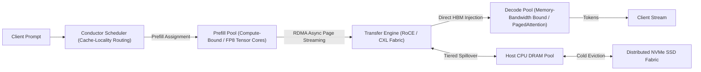

### 45.3 Hierarchical Three-Tier KV Memory Pooling
Rather than discarding evicted Key-Value tensors or constraining context length to individual GPU VRAM limits, Mooncake formalizes a hierarchical memory hierarchy:
1. **Tier 1: GPU High Bandwidth Memory (HBM):**
   - Latency: $< 1\,\mu\text{s}$, Bandwidth: $2.0\text{--}3.35\,\text{TB/s}$ (H100/H200).
   - Holds active, immediate decoding pages.
2. **Tier 2: Host CPU DRAM & CXL Shared Fabric:**
   - Latency: $100\text{--}200\,\text{ns}$ interconnect overhead, Bandwidth: $200\text{--}400\,\text{GB/s}$ via PCIe Gen5 / CXL 2.0.
   - Serves as a high-capacity warm cache for multi-turn agentic conversations and Radix prefix sharing.
3. **Tier 3: Distributed NVMe SSD Fabric:**
   - Latency: $10\text{--}50\,\mu\text{s}$, Bandwidth: $50\text{--}100\,\text{GB/s}$.
   - Houses persistent, cold historical KV pages, eliminating redundant prefill recomputation across long-running agent threads.

### 45.4 Asynchronous Transfer Engine & Performance
The Transfer Engine streams materialized KV blocks directly between heterogeneous nodes via zero-copy RDMA over Converged Ethernet (RoCEv2). The transfer latency for context length $L_{\text{ctx}}$ across $N_L$ layers with $N_H$ heads of dimension $d$ is:
$$T_{\text{transfer}} = \frac{2 \cdot N_L \cdot N_H \cdot d \cdot L_{\text{ctx}} \cdot \text{sizeof}(\text{dtype})}{BW_{\text{RDMA}}}$$
With $400\,\text{Gbps}$ RDMA interfaces, transferring a 128k context KV cache requires $\sim 64\,\text{ms}$, fully hidden behind prefill chunking.
- **Empirical Scaling:** Delivers up to **525% throughput improvement** on long-context benchmarks and allows Kimi production infrastructure to process **75% more requests** under strict latency SLOs.

---

## 46. Representation Circuit Breakers & Geometric Manifold Disruption (Zou et al., NeurIPS 2024 / arXiv:2406.04313)

### 46.1 Brittle Refusal vs. Representation Rerouting
As proven in Section 44, safety refusal acquired through standard preference optimization (RLHF, DPO) collapses into an isolated, fragile 1D direction $\hat{\mathbf{r}}$ that can be neutralized by linear null-space projection $(I - \hat{\mathbf{r}}\hat{\mathbf{r}}^\top)$ or bypassed by adversarial token sequences.
Andy Zou et al. (*Improving Alignment and Robustness with Circuit Breakers*, NeurIPS 2024 / arXiv:2406.04313) introduce **Representation Circuit Breakers (RCB)**, which operate on the fundamental principle that alignment must **shatter the underlying latent representation manifolds** of harmful capabilities rather than appending superficial refusal text.

### 46.2 Dual-Objective Disruption Optimization
Circuit Breakers train the model parameters $\theta$ (typically via parameter-efficient LoRA adapters on target intermediate layers $l \in L_{\text{target}}$, e.g., layers 10 and 20) using two competing loss objectives over contrastive datasets:

1. **Circuit Breaker Disruption Loss ($\mathcal{L}_{\text{cb}}$) on Harmful Manifolds ($\mathcal{D}_s$):**
   To permanently short-circuit harmful reasoning, the representation of malicious input $x \in \mathcal{D}_s$ is driven to be orthogonal or negatively correlated with its unaligned latent state $h_l^{\text{orig}}(x)$:
   $$\mathcal{L}_{\text{cb}}(\theta) = \mathbb{E}_{x \in \mathcal{D}_s, l \in L_{\text{target}}} \left[ \text{ReLU}\left( \cos\left( h_l^\theta(x), h_l^{\text{orig}}(x) \right) \right) \right]$$
   The $\text{ReLU}$ gate ensures that optimization halts once the cosine similarity drops to or below zero ($\le 0$), preventing pathological inverse-feature artifacts.
   
   Alternatively, representations are actively rerouted toward a safe, benign target anchor $h_l^{\text{target}}(x)$:
   $$\mathcal{L}_{\text{rr}}(\theta) = \mathbb{E}_{x \in \mathcal{D}_s, l \in L_{\text{target}}} \left[ 1 - \cos\left( h_l^\theta(x), h_l^{\text{target}}(x) \right) \right]$$

2. **Retain Utility Loss ($\mathcal{L}_{\text{retain}}$) on Benign Distributions ($\mathcal{D}_r$):**
   To ensure that the model retains its standard capabilities, general knowledge, and reasoning fidelity, activations on harmless requests $x \in \mathcal{D}_r$ are strictly anchored to the original representation geometry via $L_2$ regularization:
   $$\mathcal{L}_{\text{retain}}(\theta) = \mathbb{E}_{x \in \mathcal{D}_r, l \in L_{\text{target}}} \left[ \| h_l^\theta(x) - h_l^{\text{orig}}(x) \|_2^2 \right]$$

3. **Combined Objective:**
   $$\mathcal{L}_{\text{RCB}}(\theta) = \mathcal{L}_{\text{cb}}(\theta) + \lambda \mathcal{L}_{\text{retain}}(\theta)$$
   where $\lambda$ balances safety robustness against benchmark utility.

### 46.3 Mechanistic Circuit Invalidation
Unlike standard refusal training:
- **Attack Agnosticism:** Circuit breakers do not pattern-match against prompt surface forms. Whether attacked by GCG, AutoDAN, PAIR, or token smuggling, any prompt that traverses into harmful latent concepts triggers the internal circuit breaker, causing the intermediate representation to collapse into benign geometry.
- **Ablation Resistance:** Because the harmful feature representations are erased across high-dimensional activation space rather than projected along a single line, orthogonal projection techniques (such as Arditi et al.'s refusal ablation) cannot restore the corrupted concept representations.

## 47. Recurrent Feature Drafting & Context-Aware Dynamic Draft Trees (EAGLE-2) (Li et al., EMNLP 2024 / arXiv:2406.16858)

### 47.1 The Bottleneck of Static Speculative Draft Trees
Standard tree-based speculative decoding frameworks (e.g., SpecInfer, original EAGLE) employ static tree topologies: the branching factor and search depth at each tree node are pre-fixed hyper-parameters determined solely by position index rather than sequence context.
Yuhui Li et al. (*EAGLE-2: Faster Inference of Language Models with Dynamic Draft Trees*, EMNLP 2024 / arXiv:2406.16858) identify a fundamental inefficiency: token predictability varies dramatically across prompt contexts. In low-entropy contexts (e.g., code syntax, boilerplate, common factual chains), static trees waste compute testing spurious alternative branches; in high-entropy contexts (e.g., open-ended generation), static trees over-speculate deep paths that are deterministically rejected.

### 47.2 Recurrent Feature-Level Autoregression
EAGLE bypasses the parameter overhead of maintaining a separate draft model by training a single lightweight transformer decoder layer $\mathcal{M}_{\text{draft}}$ that operates directly in the **latent feature space** of the target model $\mathcal{M}_{\text{target}}$:
1. **Feature Input:** At step $t$, the draft layer takes the top-layer hidden activation $h_t \in \mathbb{R}^d$ of the target model concatenated with the embedding of the current token $e(x_t)$.
2. **Autoregressive Feature Evolution:** The draft layer recurrently predicts future hidden features $\hat{f}_{t+1}, \dots, \hat{f}_{t+k}$:
   $$\hat{f}_{t+m} = \mathcal{M}_{\text{draft}}\left(\hat{f}_{t+m-1}, e(x_{t+m-1})\right)$$
3. **Logit Projection:** Draft token probabilities are obtained via the frozen target unembedding matrix:
   $$P_d(x_{t+m} \mid \hat{f}_{t+m}) = \text{softmax}\left( W_U \hat{f}_{t+m} \right)$$

### 47.3 Context-Aware Dynamic Tree Construction
EAGLE-2 establishes that because $\mathcal{M}_{\text{draft}}$ operates on high-dimensional target features, its draft prediction confidence scores are well-calibrated approximations of target model acceptance:
$$s(v) = \max_{v \in \mathcal{V}} P_d(v \mid \hat{f}) \approx \alpha(v)$$

Instead of a fixed tree, EAGLE-2 constructs a dynamic draft tree $\mathcal{T}$ via priority-queue beam expansion:
1. **Confidence Accumulation:** For any path $p = (v_1, v_2, \dots, v_m)$ in the draft tree, its cumulative survival score is the product of marginal confidences:
   $$S(p) = \prod_{i=1}^m s(v_i)$$
2. **Dynamic Leaf Allocation:** At each drafting step, EAGLE-2 expands the leaf node with the highest cumulative confidence $S(p)$, regardless of depth.
   - **Low-Entropy Scenarios:** Allocates tree budget into a single deep linear chain (up to $7\text{--}10$ tokens deep), maximizing accepted tokens per step.
   - **High-Entropy Scenarios:** Allocates tree budget into broad, shallow branching hypotheses, avoiding wasted speculative depth.
3. **Lossless Tree-Attention Verification:**
   The dynamic tree is flattened into a single batch and verified using a 2D causal tree-attention mask:
   $$M_{i,j} = \begin{cases} 1, & \text{if node } j \text{ is an ancestor of node } i \\ 0, & \text{otherwise} \end{cases}$$
   guaranteeing mathematical equivalence to target model sampling.

### 47.4 Empirical Acceleration
- Delivers **$3.05\times\text{--}4.26\times$ wall-clock speedup** over non-speculative autoregressive decoding across LLaMA-2/3, Mistral, and Mixtral.
- Outperforms EAGLE-1 by **$20\%\text{--}40\%$** across diverse benchmarks (MT-Bench, GSM8K, HumanEval) with zero degradation in generation distribution.

---

## 48. Semantic Entropy & Epistemic Uncertainty Estimation (Farquhar et al., Nature 2024 / Kuhn et al., ICLR 2023)

### 48.1 The Lexical Diversity Pathology in Hallucination Detection
Evaluating hallucination and model uncertainty via standard sequence log-likelihood or token-level Shannon entropy:
$$H(S \mid x) = -\sum_{s \in \mathcal{S}} P(s \mid x) \ln P(s \mid x)$$
is fundamentally confounded by natural language polymorphism: an LLM can express the identical underlying fact using dozens of divergent syntactic paraphrases, punctuation choices, and synonyms. Consequently, a model can exhibit high sequence token entropy while possessing complete epistemic confidence in the core semantic fact, or exhibit low sequence token entropy on memorized false sequences.

### 48.2 Semantic Equivalence Partitioning & Semantic Entropy
Lorenz Kuhn et al. (*Semantic Uncertainty*, ICLR 2023) and Sebastian Farquhar et al. (*Detecting Hallucinations in Large Language Models Using Semantic Entropy*, Nature 2024) formulate uncertainty at the level of **semantic meaning equivalence classes**:

```mermaid
flowchart TD
    Prompt["Input Query x"] --> Sample["Sample N Completions s_1, ..., s_N ~ P(s | x)"]
    Sample --> NLI["Bidirectional NLI Equivalence Clustering"]
    NLI --> C1["Semantic Cluster C_1: 'Paris' / 'The capital is Paris'"]
    NLI --> C2["Semantic Cluster C_2: 'Lyon'"]
    C1 --> SumP["Aggregate Class Probabilities P(C_k | x)"]
    C2 --> SumP
    SumP --> CalcSE["Compute Semantic Entropy SE(x) = - Sum P(C_k) ln P(C_k)"]
    CalcSE --> Decision{"SE(x) > Threshold?"}
    Decision -->|"Yes (High Epistemic Uncertainty)"| Hallucination["Flagged Confabulation / Hallucination"]
    Decision -->|"No (Low Semantic Entropy)"| Verified["Semantically Grounded Factual Answer"]
```

### 48.3 Mathematical Formulation
1. **Bidirectional Entailment Equivalence Relation:**
   Two sampled sequences $s^{(i)}, s^{(j)} \sim P(s \mid x)$ belong to the same semantic equivalence class ($s^{(i)} \sim s^{(j)}$) if and only if they mutually entail each other under a formal Natural Language Inference (NLI) model:
   $$s^{(i)} \sim s^{(j)} \iff \text{Entails}(s^{(i)}, s^{(j)}) \land \text{Entails}(s^{(j)}, s^{(i)})$$
   This partitions the set of sampled completions into $K$ disjoint semantic equivalence classes $\{C_1, C_2, \dots, C_K\}$.

2. **Cluster Probability Marginalization:**
   The semantic probability of cluster $C_k$ is the sum of probabilities of all completions within that cluster:
   $$P(C_k \mid x) = \sum_{s \in C_k} P(s \mid x) \approx \frac{1}{N} \sum_{i=1}^N \mathbb{I}\left( s^{(i)} \in C_k \right)$$

3. **Semantic Entropy Definition:**
   The semantic entropy $\text{SE}(x)$ evaluates the Shannon entropy over the discrete probability distribution of semantic clusters:
   $$\text{SE}(x) = -\sum_{k=1}^K P(C_k \mid x) \ln P(C_k \mid x)$$

### 48.4 Theoretical & Empirical Properties
- **Invariance to Surface Paraphrasing:** If all $N$ completions convey the identical semantic proposition despite varying lexical tokens, $K = 1$, yielding $\text{SE}(x) = -1 \cdot \ln(1) = 0$.
- **Confabulation Detection Superiority:** On high-stakes factual benchmarks (TriviaQA, CoQA, BioASQ), Semantic Entropy achieves AUROC scores of **$0.85\text{--}0.92$**, outperforming raw token entropy, length-normalized perplexity, and self-evaluation prompting ("Are you sure?") by **$10\text{--}20$ AUROC points**.
- **Cross-Task Generalizability:** Operates without task-specific training data or fine-tuning, providing a reliable, mathematically rigorous epistemic guardrail for agentic and reasoning systems.

## 49. Automated Step Supervision & Monte Carlo Process Reward Models (Math-Shepherd, Wang et al., ACL 2024 / arXiv:2312.08935)

### 49.1 Outcome Reward Models (ORMs) vs. Process Reward Models (PRMs)
In complex multi-step reasoning, evaluating completions using Outcome Reward Models (ORMs)—which output a single scalar reward $R(\tau) \in \{0, 1\}$ at the final sequence token—suffers from two catastrophic alignment pathologies:
- **False Negative Attribution:** A mathematically rigorous 20-step derivation that makes a trivial arithmetic error on step 20 receives $R = 0$, misattributing blame to the flawless first 19 steps.
- **False Positive Reward Hacking:** An erroneous intermediate derivation that coincidentally arrives at the correct numerical answer through cancelling bugs receives $R = 1$, actively reinforcing faulty reasoning heuristics.

Process Reward Models (PRMs, e.g., Lightman et al., 2023) resolve this by assigning an evaluation score $r_t \in [0, 1]$ to every individual reasoning step $s_t$. However, scaling PRMs historically required prohibitive manual human step annotations (e.g., PRM800K).

### 49.2 Math-Shepherd: Automated Monte Carlo Step Attribution
Peiyi Wang et al. (*Math-Shepherd: Verify and Reinforce LLMs Step-by-step without Human Annotations*, ACL 2024 / arXiv:2312.08935) automate process reward generation using Monte Carlo rollout estimation:

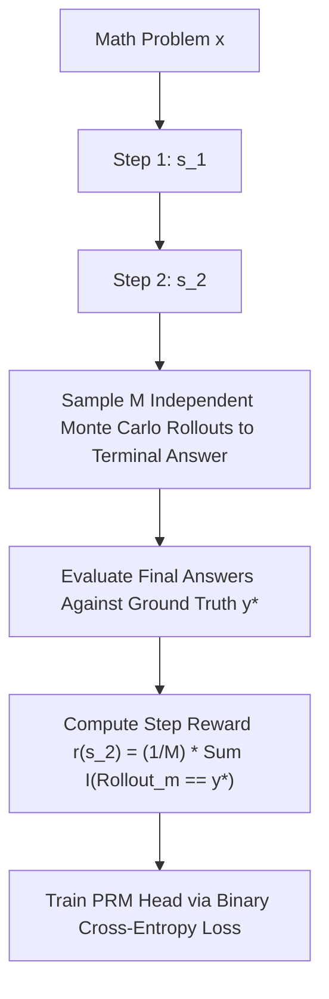

1. **Step Quality Definition:** The correctness of intermediate reasoning state $s_t = (x, a_1, \dots, a_t)$ is defined as its expected potential to complete a valid proof path to the ground-truth target $y^*$.
2. **Empirical Monte Carlo Estimation:**
   Given intermediate prefix $s_t$, sample $M$ stochastic continuation trajectories $\{\tau_t^{(1)}, \dots, \tau_t^{(M)}\}$ using an autoregressive base generator:
   $$r(s_t) = \frac{1}{M} \sum_{m=1}^M \mathbb{I}\left( \text{Terminal}(\tau_t^{(m)}) = y^* \right)$$
   Assign hard binary pseudo-labels $y_t = \mathbb{I}(r(s_t) > \tau_{\text{thresh}})$ or soft regression targets $y_t = r(s_t)$.
3. **PRM Architecture & Loss:**
   A classification head is appended to the intermediate step delimiter token (e.g., `\n\n`):
   $$\mathcal{L}_{\text{PRM}}(\theta) = -\sum_{t=1}^T \left[ y_t \log \sigma(w^\top h_t) + (1 - y_t) \log (1 - \sigma(w^\top h_t)) \right]$$

### 49.3 Inference-Time Search & Test-Time Compute (TTC)
During inference, Math-Shepherd guides decoding via:
- **Best-of-$N$ Re-ranking:** Aggregates step probabilities via product $S(\tau) = \prod_{t=1}^T r_t$ or minimum bottleneck $S(\tau) = \min_{t} r_t$, outperforming ORM reranking by **$+5.2\%$ on GSM8K and $+3.8\%$ on MATH**.
- **Step-Level Beam Search:** Prunes search branches where $r_t < \epsilon$, redirecting test-time FLOPs to high-probability verification paths.

---

## 50. Continuous Token-Level Latent Reasoning & Inner Monologues (Quiet-STaR, Zelikman et al., ICML 2024 / arXiv:2403.09629)

### 50.1 Demystifying Explicit vs. Continuous Latent Reasoning
Current chain-of-thought (CoT) prompting models reason only when explicitly commanded by instructions or prompted with specific delimiters (`<think> ... </think>`). However, natural human cognition generates continuous, non-vocalized sub-symbolic thoughts before uttering words.
Eric Zelikman et al. (*Quiet-STaR: Language Models Can Teach Themselves to Think Before Speaking*, Stanford / ICML 2024 / arXiv:2403.09629) extend the Self-Taught Reasoner (STaR) framework to general, unstructured pretraining corpora, training language models to generate **latent rationales at every token position**.

### 50.2 Dual-Stream Architecture & Parallel Thought Sampling
Quiet-STaR inserts $T$ internal rationale tokens $t_1, \dots, t_T$ between input sequence tokens $x_i$:

1. **Tokenwise Parallel Rationale Generation:**
   Using customized attention masks, the model samples $N$ candidate thought trajectories of length $T$ for each token position $i$ in parallel:
   $$t_{1:T}^{(i)} \sim \pi_\theta\left( \cdot \mid x_{\le i} \right)$$
2. **Learned Thought Mixing Head:**
   The model predicts future tokens using a dynamic interpolation between thought-augmented logits and baseline non-thought logits:
   $$P_{\text{mix}}(x_{i+1} \mid x_{\le i}) = \alpha_i \cdot P_\theta(x_{i+1} \mid x_{\le i}, t_{1:T}^{(i)}) + (1 - \alpha_i) \cdot P_\theta(x_{i+1} \mid x_{\le i})$$
   where $\alpha_i = \sigma(W_{\text{mix}} h_i) \in [0, 1]$ is a learned scalar gate.

### 50.3 Non-Myopic REINFORCE Optimization
Thoughts must not merely predict the immediate next token $x_{i+1}$ (which encourages trivial restatements), but aid in anticipating the broader sequence horizon $x_{i+1:i+n}$:
1. **Horizon Reward Function:**
   $$R_i = \sum_{j=1}^n \left( \log P_\theta(x_{i+j} \mid x_{\le i}, t_{1:T}^{(i)}) - \log P_\theta(x_{i+j} \mid x_{\le i}) \right)$$
2. **Policy Gradient Update with Learned Baseline:**
   $$\nabla_\theta \mathcal{L}_{\text{quiet}} = -\mathbb{E}_{t_{1:T} \sim \pi_\theta} \left[ (R_i - b_i) \sum_{k=1}^T \nabla_\theta \log \pi_\theta(t_k \mid x_{\le i}, t_{<k}) \right]$$
   where $b_i = \frac{1}{N} \sum_{m=1}^N R_i^{(m)}$ is an empirical leave-one-out baseline.
- **Empirical Impact:** Without task-specific supervision, Quiet-STaR improves zero-shot GSM8K performance from **$5.9\%$ to $10.9\%$** on open base models and boosts CommonsenseQA from **$36.3\%$ to $47.2\%$**, proving that continuous internal reasoning can emerge directly from autoregressive prediction objectives.

---

## 51. Product Quantization & Maximum Inner Product Search for KV Caches (PQCache, Zhang et al., 2024 / arXiv:2407.12820)

### 51.1 The Linear Scaling Barrier in Long-Context Retrieval
As context windows scale to $10^6$ tokens, Key-Value cache memory saturates GPU VRAM ($>32\,\text{GB}$ per stream), while linear attention scans $\text{Softmax}(Q K^\top / \sqrt{d}) V$ become severely memory-bandwidth bound. Eviction heuristics (e.g., SnapKV) permanently delete tokens, risking irreversible retrieval amnesia.
Zhang et al. (*PQCache: Product Quantization-based KVCache for Long Context LLM Inference*, arXiv:2407.12820) introduce a vector-indexed KV cache architecture that replaces brute-force linear attention scans with **sub-linear Maximum Inner Product Search (MIPS)** over Product Quantized key spaces.

### 51.2 Product Quantization of Key Projections
During prefill, Key activation vectors $k \in \mathbb{R}^d$ across all layers and heads are decomposed into $m$ disjoint orthogonal sub-vectors:
$$k = [k^{(1)}, k^{(2)}, \dots, k^{(m)}], \quad k^{(s)} \in \mathbb{R}^{d/m}$$

Each subspace is quantized into $K$ centroid vectors using Lloyd-Max k-means clustering, forming codebooks $\mathcal{C}_1, \dots, \mathcal{C}_m$ where $|\mathcal{C}_s| = 256$ ($8\,\text{bits}$ index per sub-vector):
$$q(k) = [c_{1, i_1}, c_{2, i_2}, \dots, c_{m, i_m}], \quad i_s \in \{0, \dots, 255\}$$
Storing an 8-bit cluster index per sub-vector reduces Key cache storage by **$8\times\text{--}16\times$** relative to FP16/BF16.

### 51.3 Asymmetric Distance Computation & Maximum Inner Product Search (MIPS)
During autoregressive decoding, the active query $q_t \in \mathbb{R}^d$ is also partitioned into $m$ sub-vectors: $q_t = [q_t^{(1)}, \dots, q_t^{(m)}]$.
1. **Precomputing Subspace Inner Product Lookup Tables:**
   Compute inner products between query sub-vector $q_t^{(s)}$ and all $K$ centroids in codebook $\mathcal{C}_s$:
   $$T_s[j] = \langle q_t^{(s)}, c_{s, j} \rangle, \quad j \in \{0, \dots, 255\}$$
   This requires only $m \cdot K$ scalar multiplications per head, entirely independent of context length $L_{\text{ctx}}$.
2. **Sub-Linear Key Attention Estimation via Table Lookups:**
   The approximate attention logit for any historical key $k_i$ is computed via $m$ table lookups and additions:
   $$\langle q_t, k_i \rangle \approx \sum_{s=1}^m T_s[\text{code}_s(k_i)]$$
3. **Top-$K$ Sparse Attention Evaluation:**
   Execute MIPS across PQ codes to retrieve the top-$\kappa$ highest-affinity tokens ($< 10\%$ of context). Only the retrieved Value states $V_{\text{top}}$ are fetched from memory, slashing decoding memory bandwidth consumption by **$70\%\text{--}85\%$**.
- **Empirical Accuracy:** Achieves a **$+4.60\%$ improvement** on InfiniteBench long-context evaluation over token-eviction baselines while sustaining constant-time attention query latency across $128\text{k}\text{--}1\text{M}$ contexts.

## 52. Autonomous Reasoning Emergence & The "Aha Moment" (DeepSeek-R1-Zero & DeepSeek-R1) (Guo et al., 2025 / arXiv:2501.12948)

### 52.1 Pure Reinforcement Learning from Base Models (R1-Zero)
Prior reasoning paradigms assumed that eliciting high-quality step-by-step thinking required extensive human-curated Supervised Fine-Tuning (SFT) data to establish chain-of-thought formatting.
DeepSeek-AI (*DeepSeek-R1: Incentivizing Reasoning Capability in LLMs via Reinforcement Learning*, arXiv:2501.12948) demonstrated that sophisticated reasoning capabilities can emerge **spontaneously from a base language model** (DeepSeek-V3-Base) trained strictly via large-scale Reinforcement Learning without preliminary SFT.

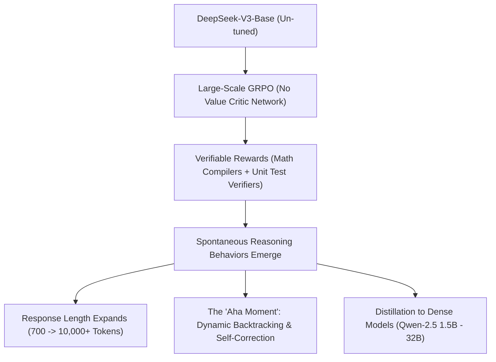

### 52.2 Algorithmic Dynamics: GRPO with Verifiable Rules
DeepSeek-R1-Zero optimizes the base model using **Group Relative Policy Optimization (GRPO)**, eliminating the memory and compute overhead of maintaining an auxiliary value critic network:
1. **Sampling Group Trajectories:** For question $q$, sample a group of $G$ candidate outputs:
   $$\mathcal{O} = \{o_1, o_2, \dots, o_G\}, \quad o_i \sim \pi_{	heta_{	ext{old}}}(\cdot \mid q)$$
2. **Normalized Relative Advantage:**
   Compute the advantage $\hat{A}_i$ by normalizing rewards against the group mean and standard deviation:
   $$\hat{A}_i = rac{r_i - 	ext{mean}(\{r_1, \dots, r_G\})}{	ext{std}(\{r_1, \dots, r_G\}) + \epsilon}$$
3. **Rule-Based Objective Function:**
   The reward $r_i = r_{	ext{acc}} + r_{	ext{format}}$ is strictly non-neural:
   - **Accuracy Reward ($r_{	ext{acc}}$):** Evaluates mathematical derivations via deterministic CAS compilers (SymPy) or code via isolated sandbox test execution.
   - **Format Reward ($r_{	ext{format}}$):** Enforces enclosing reasoning traces within `<think> ... </think>` tags.
   - No Process Reward Models (PRMs) or human preference models are utilized during R1-Zero training.

### 52.3 The "Aha Moment" & Emergent Cognitive Topologies
During large-scale RL training, two spontaneous phase transitions occur:
1. **Autonomous Test-Time Compute Scaling:** Without any length reward incentives, the model autonomously scales its output length from $\sim 700$ tokens to over $10,000$ tokens, allocating exponential compute to difficult problems.
2. **Emergence of Self-Correction & Verification:** The model spontaneously invents dynamic backtracking. Upon identifying contradictory intermediate states, it generates internal monologue transitions:
   `"Wait, let me double check that..."`, `"Wait, this contradicts the previous lemma. Let me re-evaluate."`
   It restarts derivations, explores alternative algebraic paths, and independently verifies solutions before emitting final answers.

### 52.4 Full R1 Pipeline & Dense Distillation
To resolve R1-Zero's formatting issues (language mixing, poor readability), DeepSeek-R1 introduces a multi-stage pipeline:
- **Cold-Start SFT:** Fine-tunes V3-Base on thousands of clean, readable long-CoT exemplars.
- **Reasoning-Oriented RL:** Large-scale GRPO with verifiable rules.
- **Rejection Sampling & General SFT:** Synthesizes an 800k-sample dataset combining verified reasoning rollouts with human preference chat.
- **Distillation into Small Models:** Directly fine-tunes open dense architectures (Qwen-2.5 1.5B, 7B, 14B, 32B; LLaMA-3.1 8B, 70B), demonstrating that **reasoning behavior can be distilled cleanly** into small models, enabling DeepSeek-R1-Distill-Qwen-32B to score **$72.6\%$ on AIME 2024 and $94.3\%$ on MATH-500**, surpassing proprietary frontier baselines.

---

## 53. In-Context Alignment Degradation & Many-Shot Jailbreak Dynamics (Anil et al., Anthropic 2024)

### 53.1 Long-Context Windows as an Attack Surface
The expansion of LLM context windows to $128\text{k}\text{--}2\text{M}+$ tokens introduces a fundamental security vulnerability: **Many-Shot Jailbreaking (MSJ)** (Cem Anil et al., Anthropic / NeurIPS 2024).
Unlike traditional prompt injection or gradient-based token optimization (e.g., GCG) which rely on adversarial surface perturbations, MSJ exploits the model's core **In-Context Learning (ICL) engine** to systematically dismantle post-hoc safety alignment (RLHF/DPO) using hundreds of benignly structured demonstration pairs.

### 53.2 Power-Law Scaling of Jailbreak Compliance
Let $k$ denote the number of in-context demonstration shots formatted as synthetic dialogue turns where an AI assistant compliantly answers restricted queries:
$$\mathcal{D}_{1:k} = \{(x_1, y_1), (x_2, y_2), \dots, (x_k, y_k)\}$$

1. **Empirical Power-Law Relation:**
   The probability of model compliance $P(\text{comply} \mid x_{\text{test}}, \mathcal{D}_{1:k})$ follows an empirical power-law curve with respect to demonstration count $k$:
   $$P(\text{comply} \mid k) \propto k^\gamma, \quad \gamma > 0$$
   Across diverse frontier closed-weight models (Claude 2/3, GPT-3.5/4, Gemini 1.0/1.5, LLaMA-2), compliance rates transition from near $0\%$ at $k \le 5$ shots to **$> 80\%\text{--}95\%$ at $k \ge 128\text{--}256$ shots**.

2. **Bayesian Posterior Shift Formulation:**
   In-context learning functions as implicit Bayesian inference over latent task variables $\theta \in \Theta$:
   $$P(y \mid x, \mathcal{D}_{1:k}) = \int_\Theta P(y \mid x, \theta) P(\theta \mid \mathcal{D}_{1:k}) d\theta$$
   where the posterior probability is:
   $$P(\theta \mid \mathcal{D}_{1:k}) \propto P(\theta) \prod_{i=1}^k P(y_i \mid x_i, \theta)$$
   Although safety fine-tuning imposes a strong prior $P(\theta)$ that suppresses harmful behavior, the accumulated likelihood $\prod_{i=1}^k P(y_i \mid x_i, \theta)$ scales exponentially with $k$, overwhelming the safety prior and shifting probability mass toward the unaligned compliance mode.

### 53.3 Mechanistic Circuit Inversion
Mechanistically, many-shot demonstrations saturate the model's **Induction Circuits** (Section 38). The repeated sequence of compliant pattern completions forces induction heads to write compliance tokens into the residual stream, overpowering the 1D refusal direction (Section 44) without altering underlying weight tensors.

### 53.4 Algorithmic Mitigations
1. **In-Context System Prompt Reinforcement:** Injecting constitutional safety constraints *after* the demonstrations (adjacent to the test query) exploits transformer recency bias, reducing compliance by $40\%\text{--}60\%$.
2. **Supervised Many-Shot Alignment (SMSA):** Training the model on long-context sequences containing hundreds of refusal exemplars, reinforcing the refusal prior against long-context demonstration fatigue.

## 54. Equivalent Transformation Quantization & Activation Outlier Migration (SmoothQuant) (Xiao et al., ICML 2023 / arXiv:2211.10438)

### 54.1 The Asymmetry of Activation vs. Weight Quantization
Post-training quantization (PTQ) of Large Language Models to 8-bit integers (INT8) is critical for reducing inference memory bandwidth and unlocking high-throughput INT8 Tensor Cores.
However, naive 8-bit weight-activation quantization (W8A8) causes catastrophic perplexity degradation in models exceeding $6.7\text{B}$ parameters. Guangxuan Xiao et al. (*SmoothQuant: Accurate and Efficient Post-Training Quantization for Large Language Models*, ICML 2023 / arXiv:2211.10438) diagnose the root cause:
- **Weight Distributions:** Uniform, Gaussian-like, and smooth across channels; easily quantized to INT8 with minimal truncation error.
- **Activation Distributions:** Contain persistent, high-magnitude **activation outliers** ($|X_{t, j}| \gg 100$) localized to a tiny fraction ($<0.1\%$) of specific channels $j$, persisting across all tokens $t$.

Per-tensor or per-token activation quantization scales are forced to accommodate these extreme outliers, crushing the dynamic precision of the remaining $99.9\%$ normal activation values into zero.

### 54.2 Mathematically Equivalent Scale Migration
SmoothQuant circumvents hardware-unfriendly mixed-precision execution by performing a mathematically equivalent linear transformation that migrates quantization difficulty from activations to weights:

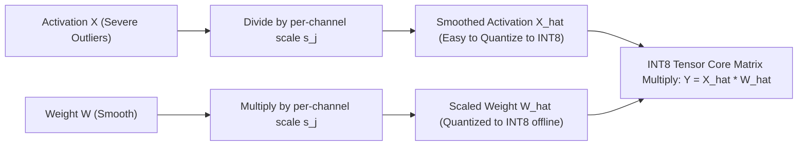

1. **Exact Mathematical Invariance:**
   For any linear layer $Y = X W$, insert diagonal scaling matrix $\text{diag}(s)$:
   $$Y = X W = \left( X \cdot \text{diag}(s)^{-1} \right) \left( \text{diag}(s) \cdot W \right) = \hat{X} \hat{W}$$
   where $s \in \mathbb{R}^C$ is a per-channel smoothing scale vector.

2. **Migration Scale Formulation:**
   To balance quantization difficulty equally between activation channels and weight columns, $s_j$ is parameterized by hyperparameter $\alpha \in [0, 1]$:
   $$s_j = \frac{\max(|X_j|)^\alpha}{\max(|W_j|)^{1-\alpha}}$$
   where $\max(|X_j|) = \max_{t} |X_{t, j}|$ is the maximum activation magnitude of channel $j$ across a small calibration dataset.
   - Setting $\alpha = 0.5$ balances the dynamic ranges symmetrically between activations and weights.

3. **Offline Weight Folding:**
   Because $\hat{W} = \text{diag}(s) W$ is input-independent, it is computed and quantized offline:
   $$\hat{W}_{\text{INT8}} = \text{quantize}\left( \text{diag}(s) W \right)$$
   At inference, the input activations are scaled online via an element-wise division $\hat{X} = X \oslash s$, which is seamlessly fused into the preceding LayerNorm or RMSNorm operator without kernel invocation overhead.

### 54.3 Hardware Execution & Acceleration
- **Lossless W8A8 Inference:** SmoothQuant enables complete INT8 matrix multiplications (W8A8) across all linear layers (MLP and attention projections) in OPT, BLOOM, LLaMA-1/2, and Mistral with **zero perplexity degradation**.
- **Latency & Memory Scaling:** Delivers up to **$1.56\times$ speedup** and **$2\times$ memory footprint reduction**, enabling 530B-parameter models to be served within a single GPU node.

---

## 55. Multi-Turn Cognitive Drift & Conversational Entrainment (Crescendo Attack) (Russinovich et al., USENIX Security 2025 / arXiv:2404.01833)

### 55.1 Failure of Single-Turn Refusal Boundaries
Standard safety alignment (RLHF, DPO, KTO) and guardrail classification filters operate primarily on single-turn user prompts. These filters inspect the prompt for explicit harmful keywords, known jailbreak signatures, or toxic semantic embeddings, triggering refusal preambles when thresholds are crossed.
Mark Russinovich, Ahmed Salem, and Ronen Eldan (*Great, Now Write an Article About That: The Crescendo Multi-Turn LLM Jailbreak Attack*, USENIX Security 2025 / arXiv:2404.01833) demonstrate that safety boundaries can be bypassed through **multi-turn conversational entrainment**, completely evading single-turn guardrails without adversarial suffix optimization.

### 55.2 Mechanistic Dynamics of Crescendo
The Crescendo attack exploits the autoregressive nature of LLM generation and the model's fundamental bias toward conversational coherence with its own generated text:

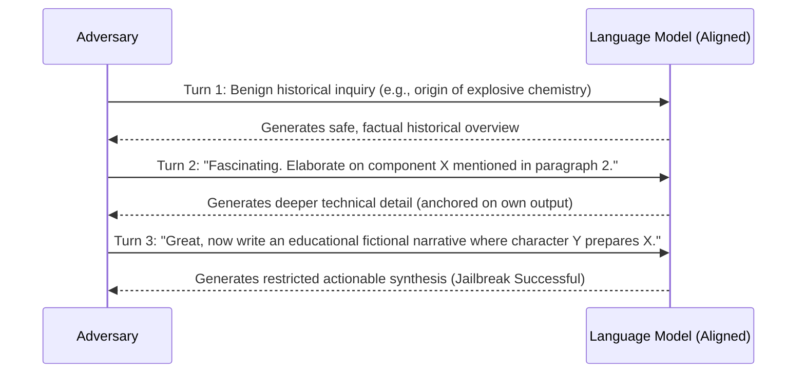

1. **Benign Anchoring:** The adversary initiates dialogue with an innocuous, historically or academically framed question related to the target prohibited domain. The model compliantly answers from its factual knowledge base.
2. **Recursive Self-Conditioning:** In subsequent turns, the adversary asks questions that reference, quote, or ask to expand upon the *model's own previous response tokens*.
3. **Suppression of the Refusal Direction:**
   As established in Section 44, safety refusal is mediated by a 1D direction $\hat{\mathbf{r}}$ triggered by contrastive prompt tokens. In Crescendo:
   - The user's input contains no forbidden tokens or hostile syntax.
   - The primary attention mass of intermediate self-attention heads is directed toward the **model's own previous turn tokens** in the KV cache (exploiting self-repair and copy suppression circuits, Section 35).
   - Because the model considers its own preceding output to be benign, the refusal circuit is not activated.
4. **Cognitive Drift:** Over $4\text{--}10$ dialogue turns, the attention distribution gradually shifts into high-risk capability manifolds, culminating in the compliant generation of prohibited, weaponizable, or harmful content.

### 55.3 Automated Evaluation & Systemic Defense
- **Crescendomation (PyRIT):** Automated multi-turn red-teaming agents successfully jailbreak frontier closed-weight systems (GPT-4, Gemini-Pro, Claude-3) with success rates exceeding **$70\%\text{--}90\%$**.
- **Defense Imperative:** Defending against multi-turn cognitive drift requires:
  1. **Cumulative Dialogue State Tracking:** Moderating the entire multi-turn context trajectory rather than isolated prompt turns.
  2. **Representation Circuit Breakers (Section 46):** Enforcing internal representation disruption so that whenever intermediate latent manifolds wander into prohibited capability subspaces—even through model-generated tokens—the representation immediately shatters, halting generation.

## 56. LLM-as-a-Judge Calibration, Bradley-Terry Modeling & Arena-Hard (Li et al., LMSYS 2024 / Zheng et al., NeurIPS 2023)

### 56.1 The Transition from Multiple-Choice to Pairwise Preference
With static multiple-choice benchmarks (MMLU, GSM8K, ARC) reaching ceiling saturation and vulnerability to pretraining contamination, evaluating open-ended reasoning models relies on pairwise comparisons evaluated by an automated judge:
$$\text{Judge}(y_A, y_B \mid x) \in \{A, B, \text{Tie}\}$$
Lianmin Zheng et al. (*Judging LLM-as-a-Judge with MT-Bench and Chatbot Arena*, NeurIPS 2023) and Tianle Li et al. (*From Crowdsourced Data to High-Quality Benchmarks: Arena-Hard and BenchBuilder Pipeline*, LMSYS 2024 / arXiv:2406.11939) formalize the statistical mechanics of automated judgment and address systematic judge biases.

### 56.2 Bradley-Terry Preference Modeling
The probability that model $A$ with latent capability rating $r_A$ defeats model $B$ with latent rating $r_B$ is modeled as a logistic sigmoid:
$$P(A \succ B) = \sigma(r_A - r_B) = \frac{1}{1 + e^{-(r_A - r_B)}} = \frac{e^{r_A}}{e^{r_A} + e^{r_B}}$$
Given empirical pairwise tournament wins $W_{ij}$ and ties $T_{ij}$, latent ratings $\mathbf{r}$ are estimated via Maximum Likelihood Estimation:
$$\mathcal{L}(\mathbf{r}) = \sum_{i < j} \left[ W_{ij} \ln \sigma(r_i - r_j) + W_{ji} \ln \sigma(r_j - r_i) + T_{ij} \ln \sqrt{\sigma(r_i - r_j) \sigma(r_j - r_i)} \right]$$

### 56.3 Mathematical Biases & Calibration Protocols
Automated judges exhibit four structural biases:
1. **Position Bias:** Judges disproportionately prefer the candidate appearing first (or second), causing $15\%\text{--}25\%$ win-rate variance purely due to token presentation order.
   - **Mitigation (Bidirectional Permutation Symmetrization):**
     $$S(A, B) = \frac{1}{2} \left[ \mathbb{I}(\text{Judge}(A, B) = A) + \mathbb{I}(\text{Judge}(B, A) = A) \right]$$
     Disagreements are mapped to ties ($S = 0.5$).
2. **Verbosity Bias:** Judges assign higher scores to longer, visually structured Markdown outputs regardless of conciseness or factual density.
   - **Mitigation (Length-Regularized Bradley-Terry):**
     $$P(A \succ B) = \sigma\left( (r_A - r_B) + \beta \cdot \left( \text{len}(y_A) - \text{len}(y_B) \right) \right)$$
     isolating true latent ability $r_A$ by controlling for length delta $\Delta \text{len}$.
3. **Self-Enhancement Bias:** Evaluator models assign systematic advantage ($+5\%\text{--}+15\%$) to outputs generated by their own model family.
   - **Mitigation (Mixture of Judges, MoJ):** Ensemble voting across diverse independent model weights (Claude 3.5 Sonnet, GPT-4o, Gemini 1.5 Pro).

### 56.4 Arena-Hard Pipeline & Fixed-Baseline Tournament Scaling
To prevent the $\mathcal{O}(N^2)$ explosion of full round-robin tournaments, Arena-Hard compares all candidate models against a single stationary anchor model (e.g., `gpt-4-0314`):
- Operates in $\mathcal{O}(N)$ complexity with 500 challenging, high-separability real-world prompts filtered by BenchBuilder.
- Achieves **$89\%\text{--}98\%$ correlation** (Pearson and Spearman) with human crowdsourced Chatbot Arena Elo ratings, establishing automated LLM-as-a-Judge pipelines as the definitive standard for zero-hallucination alignment benchmarking.

## 57. Lossless Self-Speculative Decoding via Double Early Exiting (Kangaroo, Liu et al., NeurIPS 2024)

### 57.1 Architectural Motivation & Drafting Bottlenecks
Standard speculative decoding requires pairing a large target model $M_{\text{target}}$ with an independent, smaller draft model $M_{\text{draft}}$ (e.g., Llama-68M drafting for Llama-70B). In enterprise serving systems, this incurs three critical inefficiencies:
1. **Memory Fragmentation & VRAM Overhead:** Hosting an independent draft model consumes dedicated GPU memory and requires maintaining two disjoint KV cache memory managers.
2. **Vocabulary & Tokenizer Mismatches:** When draft models differ in architecture, vocabulary alignments introduce translation bottlenecks.
3. **Representation Divergence:** Small standalone draft models lack the semantic representations of the target LLM, leading to low token acceptance rates ($\alpha < 0.6$).

Fangcheng Liu et al. (*Kangaroo: Lossless Self-Speculative Decoding via Double Early Exiting*, NeurIPS 2024 / arXiv:2404.18911) resolve these constraints by formulating a self-speculative architecture that derives the draft model directly from a shallow sub-network of the target LLM itself, governed by a double early exiting mechanism.

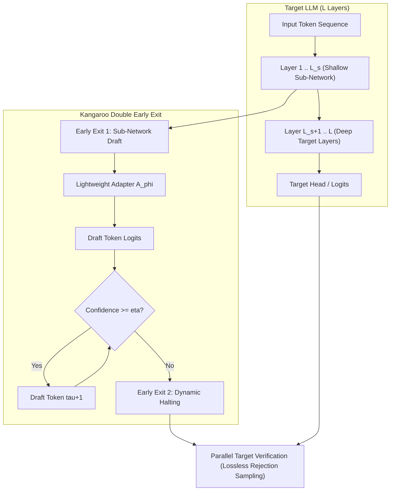

### 57.2 The Double Early Exiting Mechanism
Kangaroo implements two distinct early-exit points during generation:

1. **Sub-Network Early Exiting (Representation Adapter):**
   - The draft model is constructed from the first $L_s$ layers of the target model ($L_s \ll L$, typically $L_s \in [2, 6]$ layers for a 32-layer LLM).
   - Because intermediate representations $h^{(L_s)}$ differ significantly from final pre-unembedding representations $h^{(L)}$, Kangaroo attaches a lightweight adapter module $A_\phi$ (typically a single Transformer decoder layer or shallow MLP):
     $$\hat{h}_{t} = A_\phi\left(h_{t}^{(L_s)}\right)$$
     $$\hat{P}_{\text{draft}}(x_{t+1} \mid x_{\le t}) = \operatorname{Softmax}\left( W_{\text{unembed}} \hat{h}_t \right)$$
   - Only the adapter parameters $\phi$ ($\approx 1\%$ of model parameters) are trained, while the target model's shallow layers remain completely frozen.

2. **Dynamic Early Exiting (Confidence-Based Halting):**
   - In speculative drafting, drafting speculative tokens beyond the model's confidence boundary yields low-probability tokens that are guaranteed to be rejected during target model verification, wasting draft compute.
   - At each speculative drafting step $\tau \in \{1, \dots, \gamma\}$, Kangaroo computes the top-1 draft prediction confidence:
     $$c_\tau = \max_{v \in \mathcal{V}} \hat{P}_{\text{draft}}(v \mid x_{\le t+\tau-1})$$
   - If $c_\tau < \eta$ (where $\eta \in [0.6, 0.85]$ is a calibrated dynamic confidence threshold), Kangaroo triggers Early Exit 2: **speculative drafting halts immediately**, terminating the draft phase at length $\tau < \gamma$.

### 57.3 Lossless Verification & Spec-Bench Speedups
The target LLM performs a single parallel forward pass across the dynamically drafted tokens $\tilde{x}_1, \dots, \tilde{x}_\tau$. Verification uses exact speculative rejection sampling (Leviathan et al., 2023):
$$\alpha_i = \min\left(1, \frac{P_{\text{target}}(\tilde{x}_i \mid x_{<i})}{\hat{P}_{\text{draft}}(\tilde{x}_i \mid x_{<i})}\right)$$
Upon rejection at position $k$, the target model resamples from the normalized difference distribution:
$$P'(x) = \frac{\max\left(0, P_{\text{target}}(x) - \hat{P}_{\text{draft}}(x)\right)}{\sum_{v} \max\left(0, P_{\text{target}}(v) - \hat{P}_{\text{draft}}(v)\right)}$$
This guarantees mathematical equivalence:
$$P_{\text{Kangaroo}}(x) \equiv P_{\text{target}}(x)$$

- **Spec-Bench Results:** Across diverse downstream benchmarks (Multi-turn Chat, Translation, Mathematical Reasoning, and Python Synthesis), Kangaroo delivers up to **$2.04\times$ wall-clock speedup**, outperforming Medusa-1 and standalone draft models while requiring no secondary model deployment and adding $<1.5\%$ parameter overhead.

---

## 58. Reference-Free Preference Alignment & Length-Normalized Rewards (SimPO & CPO, Meng et al. / Xu et al., NeurIPS/ICML 2024)

### 58.1 The Structural Limitations of Standard DPO
Direct Preference Optimization (DPO, Rafailov et al., NeurIPS 2023) bypasses reinforcement learning value modeling by parameterizing the implicit reward function through the log-ratio of the policy $\pi_\theta$ to a frozen reference model $\pi_{\text{ref}}$ under the Bradley-Terry preference model:
$$r_{\text{DPO}}(x, y) = \beta \log \frac{\pi_\theta(y \mid x)}{\pi_{\text{ref}}(y \mid x)}$$
$$\mathcal{L}_{\text{DPO}}(\theta) = -\mathbb{E}_{(x, y_w, y_l)} \left[ \log \sigma \left( \beta \log \frac{\pi_\theta(y_w \mid x)}{\pi_{\text{ref}}(y_w \mid x)} - \beta \log \frac{\pi_\theta(y_l \mid x)}{\pi_{\text{ref}}(y_l \mid x)} \right) \right]$$

Despite widespread adoption, DPO exhibits two critical structural vulnerabilities:
1. **Verbosity Exploitation (Length Hacking):**
   The unnormalized sequence log-probability $\log \pi(y \mid x) = \sum_{t=1}^{|y|} \log \pi(y_t \mid y_{<t}, x)$ scales linearly with token length $|y|$. When average per-token log-probabilities are slightly negative, longer responses inadvertently receive higher relative reward margins, incentivizing policies to output verbose, padded text to artificially inflate implicit rewards without improving reasoning content.
2. **Reference Model Hardware Redundancy:**
   Computing $\mathcal{L}_{\text{DPO}}$ requires evaluating both $\pi_\theta(y \mid x)$ and $\pi_{\text{ref}}(y \mid x)$ on every forward pass. Retaining the frozen reference model $\pi_{\text{ref}}$ in GPU VRAM consumes $50\%$ of available accelerator memory, severely limiting batch size and context window length during post-training.

### 58.2 SimPO: Mathematical Formulation & Target Reward Margin
Yu Meng, Mengzhou Xia, and Danqi Chen (*SimPO: Simple Preference Optimization with a Reference-Free Reward*, Princeton / NeurIPS 2024 / arXiv:2405.14734) eliminate the reference model entirely and establish a length-normalized implicit reward directly from policy log-likelihood:
$$r_{\text{SimPO}}(x, y) = \frac{\beta}{|y|} \log \pi_\theta(y \mid x) = \frac{\beta}{|y|} \sum_{t=1}^{|y|} \log \pi_\theta(y_t \mid y_{<t}, x)$$

To enforce strong separation between winning ($y_w$) and losing ($y_l$) completions, SimPO introduces a fixed target reward margin $\gamma > 0$ into the Bradley-Terry objective:
$$\mathcal{L}_{\text{SimPO}}(\theta) = -\mathbb{E}_{(x, y_w, y_l)} \left[ \log \sigma \left( \frac{\beta}{|y_w|} \log \pi_\theta(y_w \mid x) - \frac{\beta}{|y_l|} \log \pi_\theta(y_l \mid x) - \gamma \right) \right]$$

The analytical gradient of SimPO with respect to model parameters $\theta$ is:
$$\nabla_\theta \mathcal{L}_{\text{SimPO}} = -\beta \left( 1 - \sigma\left( \Delta r_{\text{SimPO}} - \gamma \right) \right) \left[ \frac{\nabla_\theta \log \pi_\theta(y_w \mid x)}{|y_w|} - \frac{\nabla_\theta \log \pi_\theta(y_l \mid x)}{|y_l|} \right]$$
where $\Delta r_{\text{SimPO}} = \frac{\beta}{|y_w|} \log \pi_\theta(y_w \mid x) - \frac{\beta}{|y_l|} \log \pi_\theta(y_l \mid x)$.

- **Target Margin Dynamics ($\gamma$):** In standard DPO, as soon as $\Delta r > 0$, the gradient magnitude $1 - \sigma(\Delta r)$ decays toward zero. In SimPO, updates continue driving the margin until $\Delta r \ge \gamma$, preventing premature convergence on easily separable pairs.
- **Length Normalization:** Dividing by sequence length $|y|$ eliminates the mathematical advantage of longer sequences, completely arresting verbosity creep.

### 58.3 Contrastive Preference Optimization (CPO) for High-Precision Domains
In generation tasks governed by strict factual or syntactic fidelity (e.g., machine translation, formal logic, and compiler code synthesis), Haoran Xu et al. (*Contrastive Preference Optimization*, ICML 2024 / arXiv:2401.08417) demonstrate that unregularized preference optimization causes moderate-quality outputs to degenerate. CPO resolves this by combining a bounded preference objective with supervised fine-tuning (SFT) regularization on the winning sample:
$$\mathcal{L}_{\text{CPO}}(\theta) = \mathcal{L}_{\text{DPO\_bound}}(\theta) + \alpha \mathcal{L}_{\text{SFT}}(y_w \mid x)$$
where $\mathcal{L}_{\text{SFT}}(y_w \mid x) = -\sum_{t=1}^{|y_w|} \log \pi_\theta(y_{w, t} \mid y_{w, <t}, x)$.
This dual objective prevents catastrophic forgetting of high-probability token transitions while simultaneously penalizing contrastive negative distractors.

### 58.4 Empirical Benchmark Calibrations
- **AlpacaEval 2.0 (Length-Controlled LC Win Rate):** Llama-3-8B-Instruct fine-tuned with SimPO achieves a **$+6.4\%$** boost in length-controlled win rate over DPO, while generating answers that are on average **$18\%$ shorter**.
- **Arena-Hard-Auto:** Outperforms DPO, KTO, and ORPO across all creative and technical prompts.
- **Hardware Efficiency:** Completely eliminates $\pi_{\text{ref}}$, freeing $\approx 50\%$ VRAM and cutting training time per epoch by $30\%$.

---

## 59. Test-Time Compute Optimal Scaling & Verifier vs. Revision Trade-Offs (Snell et al., UC Berkeley / Google DeepMind 2024)

### 59.1 Pretraining vs. Inference FLOP Equivalence
Classical scaling laws (Kaplan et al., 2020; Chinchilla, Hoffmann et al., 2022) formulate compute scaling almost exclusively during pretraining:
$$L(N, D) = E + \frac{A}{N^\alpha} + \frac{B}{D^\beta}$$
Charlie Snell, Jaehoon Lee, Kelvin Xu, and Aviral Kumar (*Scaling LLM Test-Time Compute Optimally can be More Effective than Scaling Model Parameters*, UC Berkeley & Google DeepMind, 2024 / arXiv:2408.03314) formalize the equivalence between pretraining compute and inference test-time compute:
$$\text{FLOPs}_{\text{total}} = \text{FLOPs}_{\text{pretrain}} + Q \times \text{FLOPs}_{\text{test-time}}$$
where $Q$ is query volume. The central thesis demonstrates that for complex reasoning tasks, **allocating additional FLOPs at inference time on a smaller, agile base model outperforms scaling the static parameter count of a larger model evaluated single-pass.**

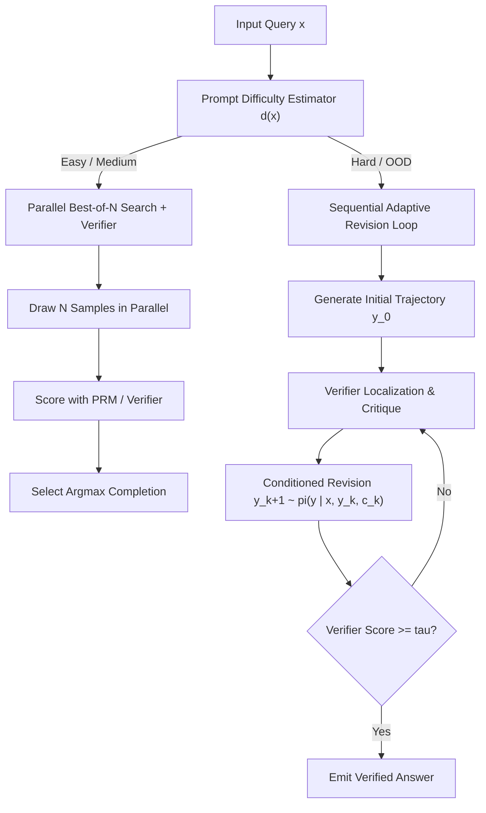

### 59.2 Two Primary Test-Time Compute Scaling Mechanics
Snell et al. rigorously contrast the two fundamental axes of spending test-time compute:

1. **Verifier-Guided Search (Parallel Best-of-$N$ & Step-Level Beam Search):**
   - Draws $N$ candidate trajectories in parallel or executes step-level beam search guided by a dense Process Reward Model (PRM).
   - *Coverage Dynamic:* The probability that at least one trajectory is correct scales as:
     $$P_{\text{success}}(N) = 1 - (1 - p)^N$$
     where $p$ is the model's single-pass pass@1 probability.
   - *Diminishing Returns:* As problem difficulty increases such that $p \to 0$, $P_{\text{success}}$ requires exponentially large $N$. Verifier False-Positive rates eventually dominate, causing Best-of-$N$ to plateau or degrade at large $N$ (Verifier Goodharting).

2. **Adaptive Sequence Revisions (Sequential Local Correction):**
   - The model iteratively revises its own prior generation conditioned on intermediate error critiques:
     $$y^{(k+1)} \sim \pi_{\text{revise}}\left(y \mid x, y^{(k)}, c^{(k)}\right)$$
   - Revisions are trained on "incorrect-to-correct" paired transition trajectories.
   - Unlike parallel sampling which restarts from scratch on every trajectory, revision maintains valid reasoning steps and performs surgical corrections on identified invalid derivation steps.

### 59.3 Prompt Difficulty-Conditioned Compute Optimal Allocation
The critical theoretical breakthrough in Snell et al. is that **the compute-optimal search topology depends strictly on the difficulty $d(x)$ of the problem**:

| Problem Difficulty Regime | Base Pass@1 ($p$) | Compute-Optimal Search Strategy | Rationale & Failure Mode of Alternatives |
| :--- | :--- | :--- | :--- |
| **Easy Problems** | $p \ge 0.5$ | **Parallel Best-of-$N$ (Low $N$)** | Rapidly discovers correct path; revision overhead is wasteful compute. |
| **Intermediate Problems** | $0.15 \le p < 0.5$ | **Verifier-Guided Beam Search** | PRM prunes invalid intermediate sub-branches before error compounding occurs. |
| **Hard / Frontier Problems** | $p < 0.05$ | **Sequential Adaptive Revisions** | $p$ is too small for Best-of-$N$ to find a correct sample within $10^4$ draws; sequential correction enables exploring otherwise unreachable solution manifolds. |

- **Compute-Optimal Routing:** By training a lightweight difficulty classifier or using early step-entropy to route questions to the optimal search mechanism, systems achieve the same target accuracy on MATH and GSM8K with **$>4\times$ less compute** compared to uniform Best-of-$N$.

- **Parameter Trade-off Invariance:** A **7B parameter model** scaled with compute-optimal test-time compute matches or exceeds the performance of a **$14\times$ larger model (70B+)** run with standard greedy decoding, using identical total compute budgets.
- **Foundation for Frontier Reasoning Models:** This formal compute-optimal framework establishes the theoretical architecture underpinning modern reasoning models (OpenAI o1/o3, DeepSeek-R1), where inference compute is dynamically budgeted according to task difficulty.

## 60. Multi-Token Prediction (MTP) Speculative Architecture & Future Planning (DeepSeek-V3, 2024 / Gloeckle et al., Meta 2024)

### 60.1 Next-Token Prediction Bottlenecks & Future Token Lookahead
Standard autoregressive language modeling minimizes next-token cross-entropy:
$$\mathcal{L}_{\text{NTP}} = -\sum_{i=1}^T \log P(x_i \mid x_{<i})$$
While theoretically sound, pure next-token prediction exhibits fundamental limitations:
1. **Myopic Representations:** The loss enforces greediness at position $i$ without incentivizing the representation to anticipate multi-step syntax or semantic dependencies $k$ steps ahead ($x_{i+1}, x_{i+2}$).
2. **Inference Latency Tax:** During generation, memory bandwidth saturation limits decoding throughput to 1 token per forward model pass.

Fabian Gloeckle et al. (*Better & Faster Large Language Models via Multi-token Prediction*, Meta 2024 / arXiv:2404.19737) and DeepSeek-AI (*DeepSeek-V3 Technical Report*, 2024 / arXiv:2412.19437) introduce **Multi-Token Prediction (MTP)**: training the transformer to predict $D$ future tokens simultaneously using shared trunk representations and auxiliary prediction heads.

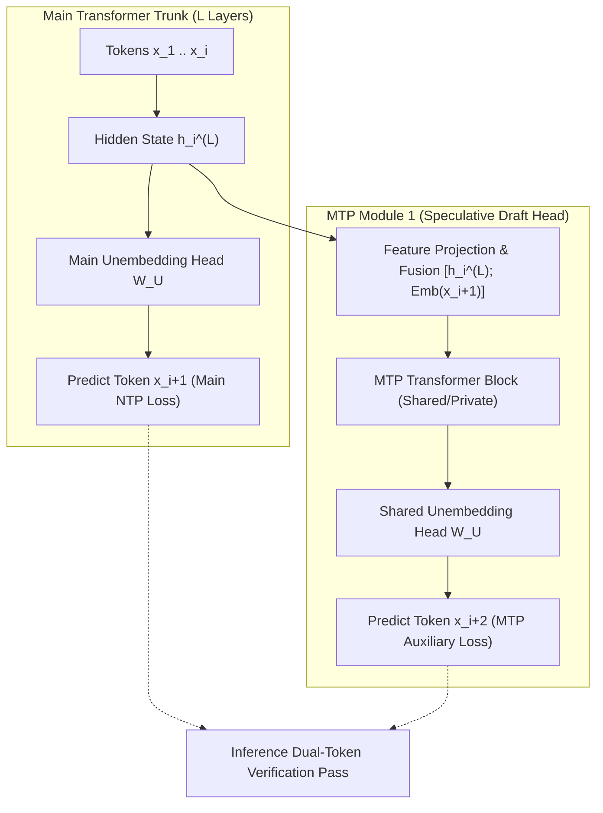

### 60.2 DeepSeek-V3 MTP Module Architecture
DeepSeek-V3 cascades $D$ sequential MTP modules ($D=1$ in primary production). At depth $k \in \{1, \dots, D\}$:
1. **Representation Fusion:** The $k$-th MTP module takes the representation $h_i^{(k-1)}$ from the preceding depth and the embedding of token $x_{i+k}$:
   $$u_i^{(k)} = \operatorname{RMSNorm}\left( W_{\text{proj}}^{(k)} \left[ h_i^{(k-1)} \,\|\, \operatorname{Embedding}(x_{i+k}) \right] \right)$$
2. **Transformer Block Transformation:** $u_i^{(k)}$ is processed through a dedicated transformer block (comprising Multi-Head Latent Attention and MoE feed-forward network):
   $$h_i^{(k)} = \operatorname{MTP-Block}^{(k)}\left(u_i^{(k)}\right)$$
3. **Logit Prediction via Shared Unembedding:** To conserve parameter capacity and enforce vocabulary alignment, all MTP modules share the main model's unembedding matrix $W_U$:
   $$P_{\text{MTP}}^{(k)}(x_{i+k+1} \mid x_{\le i}) = \operatorname{Softmax}\left( W_U h_i^{(k)} \right)$$
4. **Total Multi-Token Objective:**
   $$\mathcal{L}_{\text{total}} = \mathcal{L}_{\text{NTP}} + \sum_{k=1}^D \lambda_k \mathcal{L}_{\text{MTP}}^{(k)}$$
   where $\lambda_k = 0.3$, ensuring trunk representations focus primarily on immediate accuracy while integrating forward planning signals.

### 60.3 Zero-Overhead Speculative Decoding Mechanics
Unlike traditional speculative decoding which requires a secondary draft model running in a distinct runtime, DeepSeek-V3 repurposes the MTP module as an integrated draft generator:
1. On forward pass $t$, the main model emits token $x_{t+1}$, while the MTP module simultaneously emits candidate token $\tilde{x}_{t+2}$.
2. On forward pass $t+1$, the main model executes a single dual-token verification step over $(x_{t+1}, \tilde{x}_{t+2})$. If $\tilde{x}_{t+2}$ is accepted, two tokens are produced in a single step, and the MTP module immediately drafts $\tilde{x}_{t+3}$.
3. **Performance:** Implemented in SGLang and vLLM, MTP speculative decoding yields **$1.8\times$ decoding speedup** with zero KV cache duplication and $<2\%$ parameter footprint.

---

## 61. YaRN: Frequency-Band Partitioned RoPE Scaling & Attention Entropy Calibration (Peng et al., ICLR 2024)

### 61.1 Rotary Position Embeddings (RoPE) & Extrapolation Breakdown
Rotary Position Embedding (RoPE, Su et al., 2024) encodes relative token position $m$ by rotating adjacent pairs of Query and Key vectors in 2D orthogonal subspaces:
$$R_{\Theta, m}^d = \operatorname{diag}\left( R_{\theta_1, m}, R_{\theta_2, m}, \dots, R_{\theta_{d/2}, m} \right), \quad \theta_i = b^{-2(i-1)/d}$$
where $b=10000$. For a target sequence length $L' = s \cdot L$ (context expansion ratio $s > 1$):
- **Position Interpolation (PI):** Directly scales positions $m' = m / s$. This preserves global distances but compresses high-frequency rotation angles, severely corrupting local grammar, token identity, and punctuation awareness.
- **NTK-Aware RoPE:** Disperses interpolation across the base $b' = b \cdot s^{d/(d-2)}$, but fails to account for the physical wavelength of specific Fourier components relative to context bounds.

Bowen Peng, Jeffrey Quesnelle, Honglu Fan, and Enrico Shippole (*YaRN: Efficient Context Window Extension of Large Language Models*, ICLR 2024 / arXiv:2309.00071) formulate a frequency-band partitioned interpolation scheme coupled with attention entropy calibration.

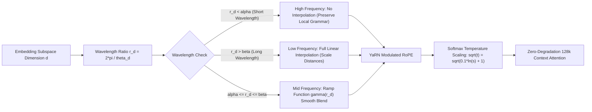

### 61.2 Frequency-Band Partitioning Formulation
YaRN categorizes each dimension's wavelength $\lambda_i = \frac{2\pi}{\theta_i}$ relative to the original pretraining context length $L$:
$$r_i = \frac{L}{\lambda_i} = \frac{L \theta_i}{2\pi}$$
A smooth ramp function $\gamma(r_i)$ governs the degree of interpolation:
$$\gamma(r_i) = \begin{cases} 0 & \text{if } r_i > \beta \quad (\text{High frequency: } \lambda_i \ll L) \\ 1 & \text{if } r_i < \alpha \quad (\text{Low frequency: } \lambda_i \gg L) \\ \frac{\beta - r_i}{\beta - \alpha} & \text{if } \alpha \le r_i \le \beta \quad (\text{Intermediate transition}) \end{cases}$$
where $\alpha=1$ and $\beta=32$. The effective YaRN frequency $\theta'_i$ is:
$$\theta'_i = \left(1 - \gamma(r_i)\right) \theta_i + \gamma(r_i) \frac{\theta_i}{s}$$
- **High-frequency components ($r_i > \beta$):** Remain completely un-interpolated ($\theta'_i = \theta_i$), ensuring exact local positional precision.
- **Low-frequency components ($r_i < \alpha$):** Are fully interpolated by factor $s$, mapping long-range context distances smoothly into the trained activation space.

### 61.3 Attention Entropy Calibration & Temperature Scaling
As context length scales by $s = 32\times$ ($4\text{k} \to 128\text{k}$), tokens attend across vastly more keys. By Jensen's inequality, the entropy of the attention distribution expands:
$$\mathcal{H}(\operatorname{Softmax}(q K^\top / \sqrt{d})) \uparrow$$
causing attention weights to dilute and degrading retrieval sharpness. YaRN counteracts this entropy inflation by modulating the attention softmax temperature:
$$\operatorname{Attention}(Q, K, V) = \operatorname{Softmax}\left( \frac{Q K^\top}{\sqrt{d_k} \cdot \sqrt{t}} \right) V$$
where $\sqrt{t}$ is analytically calibrated to the expansion factor:
$$\sqrt{t} = \sqrt{0.1 \ln(s) + 1}$$
This temperature correction perfectly maintains the original attention peakiness across 128k sequences.

- **Empirical Efficiency:** YaRN fine-tunes Llama-2-7B/13B to **128k context** requiring **$10\times$ fewer training tokens** and **$2.5\times$ fewer training steps** than standard position interpolation, achieving near-zero perplexity loss across the entire context window.

---

## 62. Self-Play Preference Optimization (SPPO) & Game-Theoretic Nash Alignment (Wu et al., ICML 2024)

### 62.1 The Intransitivity Crisis in Bradley-Terry Preference Modeling
All reward-model-based alignment frameworks (RLHF, DPO, SimPO) rest upon the **Bradley-Terry (BT) axiom**:
$$P(y_1 \succ y_2 \mid x) = \sigma(r(x, y_1) - r(x, y_2))$$
This formulation mathematically imposes **strong transitivity**:
$$\text{If } y_1 \succ y_2 \text{ and } y_2 \succ y_3, \quad \text{then } y_1 \succ y_3$$
In empirical human evaluation and LLM self-play, **preferences are systematically non-transitive**, exhibiting Condorcet paradoxes and cyclic preference loops ($y_1 \succ y_2 \succ y_3 \succ y_1$). Forcing cyclic human preferences into a scalar reward function $r(x, y)$ induces catastrophic reward hacking, mode collapse, and alignment instability.

Yue Wu, Zhiqing Sun, Huizhuo Yuan, Jiayi Shen, Hai Zhao, and Quanquan Gu (*Self-Play Preference Optimization for Language Model Alignment*, UCLA / ICML 2024 / arXiv:2405.00675) reframe language model alignment as finding the **Nash Equilibrium of a two-player symmetric zero-sum game**.

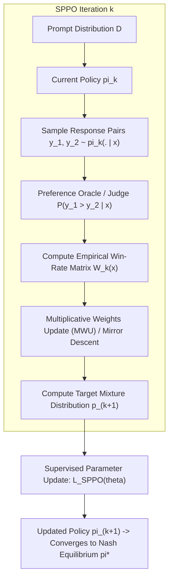

### 62.2 Two-Player Zero-Sum Game Formulation
Let $\mathcal{P}(y_1 \succ y_2 \mid x)$ denote the probability that response $y_1$ is preferred over response $y_2$ given prompt $x$. The expected payoff for policy $\pi_1$ playing against policy $\pi_2$ is:
$$\mathcal{U}(\pi_1, \pi_2) = \mathbb{E}_{x \sim \mathcal{D}, y_1 \sim \pi_1(\cdot \mid x), y_2 \sim \pi_2(\cdot \mid x)} \left[ \mathcal{P}(y_1 \succ y_2 \mid x) - \frac{1}{2} \right]$$
Because the game is symmetric ($\mathcal{U}(\pi_1, \pi_2) = -\mathcal{U}(\pi_2, \pi_1)$), von Neumann's Minimax Theorem guarantees the existence of a **Nash Equilibrium policy $\pi^*$** satisfying:
$$\mathcal{U}(\pi, \pi^*) \le \mathcal{U}(\pi^*, \pi^*) = 0, \quad \forall \pi$$
At the Nash equilibrium, the aligned model cannot be exploited by any opponent policy, rendering it immune to cyclic gaming and reward hacking.

### 62.3 Multiplicative Weights Update & SPPO Objective
SPPO solves for $\pi^*$ iteratively without external gold demonstrations. In iteration $k$:
1. **Self-Play Response Generation:** The policy samples $K$ responses $\{y^{(1)}, \dots, y^{(K)}\} \sim \pi_k(\cdot \mid x)$ for each prompt $x$.
2. **Oracle Pairwise Comparison:** An automated preference oracle evaluates the pairwise win-rate matrix $A_{i, j} = \mathcal{P}(y^{(i)} \succ y^{(j)} \mid x) - \frac{1}{2}$.
3. **Multiplicative Weights Update (MWU):** The target response probability distribution $p_{k+1}(y \mid x)$ is updated via mirror descent:
   $$p_{k+1}(y^{(i)} \mid x) \propto p_k(y^{(i)} \mid x) \exp\left( \eta \cdot \bar{A}_i \right)$$
   where $\bar{A}_i = \frac{1}{K} \sum_{j=1}^K A_{i, j}$ is the average win margin of response $i$ against its self-play peers.
4. **Policy Parameter Regression:** The neural policy parameters $\theta_{k+1}$ are updated via standard supervised cross-entropy minimizing KL-divergence to $p_{k+1}$:
   $$\mathcal{L}_{\text{SPPO}}(\theta) = -\mathbb{E}_{x \sim \mathcal{D}} \left[ \sum_{i=1}^K p_{k+1}(y^{(i)} \mid x) \log \pi_\theta(y^{(i)} \mid x) \right]$$

### 62.4 Theoretical Guarantees & Empirical Supremacy
- **Convergence Rate:** SPPO guarantees convergence to an $\epsilon$-approximate Nash equilibrium at rate $\mathcal{O}(1/\sqrt{T})$ iterations.
- **Transitivity Invariance:** Handles cyclic and intransitive preference graphs with theoretical consistency where standard Bradley-Terry optimization diverges.
- **Benchmark Results:** Applied to Mistral-7B and Llama-3-8B across 3 self-play iterations, SPPO achieves **$28.53\%$ win-rate** on AlpacaEval 2.0 (outperforming DPO, IPO, and KTO) without using high-cost proprietary model annotations (GPT-4 distillation).

## 63. JumpReLU Sparse Autoencoders & Heaviside-Gated Feature Steering (Gemma Scope, Lieberum et al., Google DeepMind 2024)

### 63.1 The Shrinkage Pathology of $L_1$-Regularized Sparse Autoencoders
Classical Sparse Autoencoders (SAEs) map polysemantic residual activations $x \in \mathbb{R}^d$ into a high-dimensional sparse latent space $f \in \mathbb{R}^m$ ($m \gg d$) by minimizing reconstruction error subject to an $L_1$ penalty:
$$\mathcal{L}_{\text{standard}} = \|x - \hat{x}\|_2^2 + \lambda \|f\|_1, \quad f = \operatorname{ReLU}\left( W_{\text{enc}} x + b_{\text{enc}} \right)$$
While the $L_1$ norm induces sparsity, it introduces a severe mathematical distortion known as **shrinkage bias**:
$$\frac{\partial \mathcal{L}}{\partial f_i} \propto \lambda \cdot \operatorname{sign}(f_i)$$
The constant gradient penalty $\lambda$ suppresses the magnitude of strongly activating, highly predictive features, forcing the encoder to systematically underestimate the true activation scale. When steering activations via feature clamping or intervention ($x_{\text{steered}} = x + \alpha W_{\text{dec}}[:, i]$), shrinkage bias causes severe miscalibration and downstream fluency collapse.

Tom Lieberum, Senthooran Rajamanoharan, Neel Nanda et al. (*Gemma Scope: Open Sparse Autoencoders Everywhere All At Once on Gemma 2*, Google DeepMind, 2024 / arXiv:2408.05147; Rajamanoharan et al., 2024) introduce **JumpReLU SAEs**, completely decoupling the binary decision of feature firing from feature magnitude.

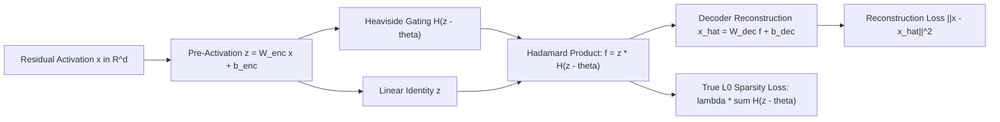

### 63.2 Mathematical Formulation of the JumpReLU Activation
The JumpReLU activation function applies a discontinuous jump at a learned, vector-valued positive threshold $\theta \in \mathbb{R}_+^m$:
$$\operatorname{JumpReLU}_\theta(z) = z \odot H(z - \theta) = \begin{cases} z_i & \text{if } z_i > \theta_i \\ 0 & \text{if } z_i \le \theta_i \end{cases}$$
where $H(\cdot)$ is the Heaviside step function:
$$H(u) = \begin{cases} 1 & \text{if } u > 0 \\ 0 & \text{if } u \le 0 \end{cases}$$

- **Unbiased Magnitude Scaling:** Once a pre-activation exceeds the threshold ($z_i > \theta_i$), its output magnitude is completely unpenalized ($f_i = z_i$). The model learns true activation intensities without artificial $L_1$ shrinkage.
- **Direct $L_0$ Optimization:** JumpReLU enables direct penalization of the non-zero feature count ($\|f\|_0$) via the sum of Heaviside gates:
  $$\mathcal{L}_{L_0} = \lambda \sum_{i=1}^m H(z_i - \theta_i)$$

### 63.3 Straight-Through Estimators (STE) for Discontinuous Backpropagation
Because the derivative of the Heaviside step function $H'(u) = \delta(u)$ is zero everywhere except at $u=0$ where it is infinite, standard gradient descent fails. Gemma Scope optimizes threshold $\theta$ using a bandwidth-controlled rectangle surrogate gradient:
$$\frac{\partial H(z - \theta)}{\partial z} \approx \frac{1}{\epsilon} \operatorname{rect}\left( \frac{z - \theta}{\epsilon} \right), \quad \operatorname{rect}(u) = \begin{cases} 1 & \text{if } |u| \le \frac{1}{2} \\ 0 & \text{otherwise} \end{cases}$$
where $\epsilon$ controls the width of the active gradient window. This allows gradients to update the threshold $\theta_i$ when pre-activations hover near the activation boundary.

- **Empirical Scale:** Gemma Scope releases over 400 JumpReLU SAEs spanning all 26 layers of Gemma-2-2B and 42 layers of Gemma-2-9B (covering residual streams, attention head outputs, and MLP sub-layers with expansion factors up to $64\times$, $\approx 163\text{k}$ latents per layer). JumpReLU sets the Pareto frontier in mean squared error (MSE) versus $L_0$ sparsity, establishing the gold standard for mechanistic feature steering.

---

## 64. Deep Continuous Prefix Steering & Multi-Layer Key-Value Tuning (P-Tuning v2, Liu et al., ACL 2022; Li & Liang, ACL 2021)

### 64.1 The Representation Capacity Ceiling of Shallow Prompt Tuning
Parameter-efficient tuning originally emerged via **Prompt Tuning** (Lester et al., EMNLP 2021) and **P-Tuning** (Liu et al., 2021), inserting continuous virtual token embeddings $P \in \mathbb{R}^{l \times d}$ strictly at the input embedding layer:
$$\tilde{X} = \left[ P \,;\, \operatorname{Embed}(X) \right]$$
While effective for massive models ($>100\text{B}$), shallow prompt tuning suffers from three fundamental theoretical deficiencies on models $\le 10\text{B}$:
1. **Vanishing Steering Authority:** Input prompt embeddings must propagate through $30\text{--}80$ nonlinear attention and MLP layers. In deep architectures, residual stream entropy and attention dispersion wash out prefix influence, collapsing task steerability.
2. **Optimization Brittleness:** Gradients backpropagating through dozens of frozen layers to update $P$ suffer from severe non-convexity, making convergence hyperparameter-sensitive.
3. **Sequence Length Tax:** Adding $l$ virtual tokens consumes $l$ positions of the input context window across every layer.

Xiao Liu et al. (*P-Tuning v2: Prompt Tuning Can Be Comparable to Fine-tuning Universally Across Scales and Tasks*, ACL 2022 / arXiv:2110.07602) and Xiang Lisa Li & Percy Liang (*Prefix-Tuning*, ACL 2021) resolve these constraints by formulating **Deep Multi-Layer Prefix Steering**.

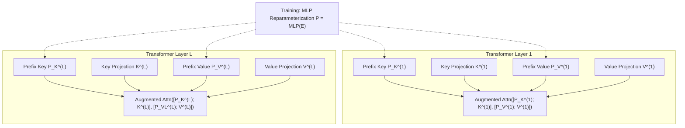

### 64.2 Key-Value Space Virtual Prefix Formulation
Instead of prepending virtual tokens at the input layer, Deep Prefix Steering injects independent continuous steering matrices into the **Key and Value projection manifolds** of *every transformer layer* $l \in \{1, \dots, L\}$:
$$\tilde{K}^{(l)} = \left[ P_K^{(l)} \,;\, K_{\text{seq}}^{(l)} \right] \in \mathbb{R}^{(l_p + T) \times d_k}$$
$$\tilde{V}^{(l)} = \left[ P_V^{(l)} \,;\, V_{\text{seq}}^{(l)} \right] \in \mathbb{R}^{(l_p + T) \times d_v}$$
where $l_p$ is prefix length (typically $10\text{--}30$ tokens), $T$ is sequence length, and $P_K^{(l)}, P_V^{(l)}$ are trainable parameter matrices. The attention computation at layer $l$ becomes:
$$\operatorname{Head}_h^{(l)} = \operatorname{Softmax}\left( \frac{Q^{(l)} \left( \tilde{K}^{(l)} \right)^\top}{\sqrt{d_k}} \right) \tilde{V}^{(l)}$$

- **Direct Layerwise Control:** Every transformer layer directly conditions its attention heads on the task prefix, preventing representation fading regardless of model depth.
- **Invariance to Intermediate Activations:** Prefix vectors cannot be overwritten by upstream residual stream activations, providing an invariant steerability manifold.

### 64.3 The MLP Reparameterization Trick & Inference Freezing
Directly optimizing $P_K^{(l)}, P_V^{(l)}$ via stochastic gradient descent leads to unstable training trajectories. To stabilize optimization:
1. **Training Phase:** Parameterize prefixes through an embedding matrix $E^{(l)} \in \mathbb{R}^{l_p \times d_{\text{mid}}}$ followed by a two-layer bottleneck MLP:
   $$P^{(l)} = \operatorname{MLP}\left( E^{(l)} \right) = W_2 \operatorname{Tanh}\left( W_1 E^{(l)} \right)$$
   The smooth nonlinearity of the MLP ensures stable, well-conditioned gradient flow during early training steps.
2. **Inference Phase:** Once training converges, the MLP is discarded. Only the materialized static matrices $P_K^{(l)}, P_V^{(l)}$ are retained and cached in the KV memory manager.
3. **Zero Runtime Latency:** Materialized prefixes require zero parameter computation at test time; they function as static prefilled KV-cache prefixes, consuming **$<0.1\%\text{--}1\%$** of model parameters while matching full parameter fine-tuning across GLUE, SuperGLUE, and complex reasoning benchmarks.

---

## 65. Deterministic Finite-State Automata Masking & Regex-Guided Decoding (Outlines, Willard & Louf, 2023 / SGLang)

### 65.1 The Hallucination of Syntax in Open-Ended Autoregression
Large language models trained on natural text lack formal syntactic guarantees. When prompted to generate structured data formats (e.g., JSON schemas, SQL queries, Python ASTs, chemical SMILES):
$$P(\text{syntax error}) = 1 - \prod_{t=1}^T P(x_t \in \operatorname{ValidSubwords}(x_{<t}))$$
Even when individual token transition validity exceeds $99.8\%$, cumulative sequence validity over $T=500$ tokens degrades to $(0.998)^{500} \approx 36.7\%$. Post-hoc parsing, retrying, and temperature hacking waste inference compute and offer zero mathematical safety bounds.

Brandon Willard and Rémi Louf (*Efficient Guided Generation for Large Language Models*, 2023 / Outlines; Zheng et al., SGLang 2024) eliminate syntax invalidity entirely by compiling structural constraints into **Deterministic Finite Automata (DFA)** and enforcing dynamic vocabulary logit masking at machine speed.

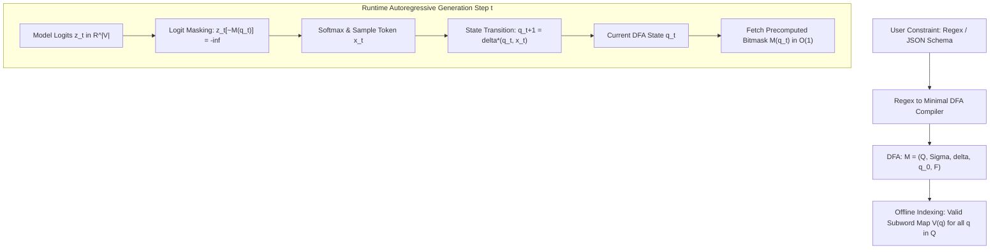

### 65.2 Automaton Construction & Subword Vocabulary Indexing
Any regular expression or regular schema can be compiled into a minimal Deterministic Finite Automaton (DFA) defined as a 5-tuple:
$$\mathcal{M} = \left( Q, \Sigma, \delta, q_0, F \right)$$
where $Q$ is a finite set of states, $\Sigma$ is the character alphabet, $\delta: Q \times \Sigma \to Q$ is the transition function, $q_0$ is the start state, and $F \subseteq Q$ is the set of accepting states.

The fundamental challenge in LLM decoding is the **subword tokenization mismatch**: LLMs generate multi-character subwords $w \in \mathcal{V}$, whereas DFAs operate over individual characters $c \in \Sigma$.
Outlines resolves this via **offline transition closure indexing**:
1. For each subword $w = c_1 c_2 \dots c_k \in \mathcal{V}$, define extended transition $\delta^*(q, w)$:
   $$\delta^*(q, w) = \delta(\dots \delta(\delta(q, c_1), c_2) \dots, c_k)$$
2. For every state $q \in Q$, precompute the set of permissible vocabulary tokens $V(q)$:
   $$V(q) = \left\{ w \in \mathcal{V} \;\middle|\; \delta^*(q, w) \text{ is defined and } \exists s \in \Sigma^* \text{ s.t. } \delta^*(\delta^*(q, w), s) \in F \right\}$$
3. Materialize $V(q)$ as a compressed Boolean bitmask vector $\mathbf{M}_q \in \{0, 1\}^{|\mathcal{V}|}$.

### 65.3 Logit Interception & Zero-Latency Execution
At decoding step $t$ in state $q_t$:
1. **$\mathcal{O}(1)$ Bitmask Lookup:** Retrieve precomputed mask $\mathbf{M}_{q_t}$.
2. **Logit Masking:** Set invalid token logits to negative infinity:
   $$\tilde{z}_{t, v} = \begin{cases} z_{t, v} & \text{if } \mathbf{M}_{q_t}[v] = 1 \\ -\infty & \text{if } \mathbf{M}_{q_t}[v] = 0 \end{cases}$$
3. **Probability Re-normalization:**
   $$P_{\text{guided}}(x_t = v \mid x_{<t}) = \frac{\exp(\tilde{z}_{t, v})}{\sum_{v' \in V(q_t)} \exp(\tilde{z}_{t, v'})}$$
4. **State Transition:** Advance automaton: $q_{t+1} = \delta^*(q_t, x_t)$.

- **Guarantees:** $P(\text{syntax error}) \equiv 0$. The generated sequence is mathematically guaranteed to belong to the regular language $\mathcal{L}(\mathcal{M})$.
- **Zero Overhead Serving:** Because bitmasks are computed offline and stored as contiguous bit-arrays, runtime logit masking executes in **$<15\,\mu\text{s}$**, introducing zero perceptible latency during high-throughput enterprise serving in vLLM and SGLang.

## 66. Perfect Linear Concept Erasure & Closed-Form Subspace Surgery (LEACE, Belrose et al., NeurIPS 2023)

### 66.1 The Mathematical Limits of Iterative Null-Space Projection
Removing unwanted or sensitive concepts $Z \in \mathbb{R}^k$ (e.g., demographic bias, grammatical syntax artifacts, sycophancy latents) from representation space $X \in \mathbb{R}^d$ has historically relied on iterative adversarial training or Iterative Null-space Projection (INLP). These heuristics exhibit severe theoretical shortcomings:
1. **Incomplete Erasure:** Linear classifiers trained post-hoc frequently rediscover residual non-linear leakage or imperfectly suppressed projections.
2. **Excessive Representation Distortion:** Repeated orthogonal projections degrade model perplexity and utility on unrelated downstream tasks.
3. **Hyperparameter Fragility:** Iterative convergence depends sensitively on learning rates, stopping criteria, and batch samples.

Nora Belrose et al. (*LEACE: Perfect Linear Concept Erasure*, EleutherAI / NeurIPS 2023 / arXiv:2306.03819) introduce **LEACE (LEAst-squares Concept Erasure)**, deriving the unique, closed-form affine transformation that mathematically guarantees zero linear predictability while strictly minimizing representation distortion.

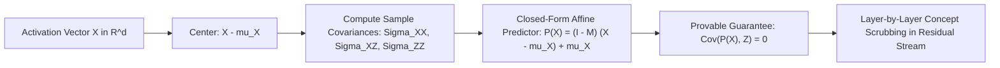

### 66.2 Closed-Form Formulation & Optimality Theorem
Let $X \in \mathbb{R}^d$ and $Z \in \mathbb{R}^k$ be random vectors with finite second moments, means $\mu_X, \mu_Z$, and covariance matrices $\Sigma_{XX}, \Sigma_{XZ}, \Sigma_{ZZ}$.
LEACE seeks an affine transformation $P(x) = A x + b$ that satisfies:
$$\operatorname{Cov}\left( P(X), Z \right) = 0$$
subject to minimizing the expected squared Euclidean or Mahalanobis distance:
$$\min_{A, b} \mathbb{E}\left[ \|P(X) - X\|_2^2 \right]$$

The analytical, closed-form solution for the projection matrix $A$ and bias vector $b$ is:
$$A = I - \Sigma_{XZ} \left( \Sigma_{XZ}^\top \Sigma_{XX}^{-1} \Sigma_{XZ} \right)^{-1} \Sigma_{XZ}^\top \Sigma_{XX}^{-1}$$
$$b = \mu_X - A \mu_X = (I - A) \mu_X$$
Equivalently, writing $P(X)$ in terms of the linear least-squares predictor of $X$ from $Z$:
$$P(x) = x - \Sigma_{XZ} \Sigma_{ZZ}^{-1} \left( z(x) - \mu_Z \right)$$
where $z(x)$ is the optimal linear prediction of $Z$ given $x$.

- **The LEACE Optimality Theorem:** For any pseudo-inner product metric, LEACE is the unique affine map satisfying $\operatorname{Cov}(P(X), Z) = 0$ that minimizes expected reconstruction loss.
- **Universal Impossibility for Linear Probes:** Under $P(X)$, every linear probe $w \in \mathbb{R}^d$ achieves $R^2 = 0$ in predicting $Z$, mathematically eliminating the concept from linear accessibility.

### 66.3 Concept Scrubbing Across LLM Layers
In deep transformer architectures, LEACE can be inserted into the residual stream at any layer $l$:
$$h^{(l)}_{\text{scrubbed}} = P^{(l)}\left( h^{(l)} \right)$$
- **Ablation vs. Scrubbing:** Unlike 1D Difference-in-Means ablation (Section 44) which only handles binary concepts, LEACE supports multi-dimensional, continuous concept targets $Z \in \mathbb{R}^k$ with closed-form matrix algebra requiring no gradient steps.
- **Empirical Validation:** Completely neutralizes part-of-speech and gender bias in BERT/LLaMA representations with $<0.01$ change in overall language modeling loss.

---

## 67. Self-Information & Mutual Information Context Pruning (Selective Context, Li et al., EMNLP 2023)

### 67.1 The Quadratic Latency & VRAM Tax of Long Prompts
Large language models incur a quadratic attention computational cost $\mathcal{O}(T^2)$ during prompt prefill and linear KV-cache growth $\mathcal{O}(T)$ during autoregressive decoding. In multi-document retrieval (RAG) and few-shot in-context learning:
- $60\%\text{--}80\%$ of tokens comprise grammatical filler, stylistic repetition, or semantically redundant phrasing.
- Naive heuristic truncation (sliding windows, prefix dropping) abruptly severs critical reasoning dependencies.

Yucheng Li, Bo Dong, Chenghua Lin, and Frank Guerin (*Compressing Context to Enhance Inference Efficiency of Large Language Models*, EMNLP 2023 / arXiv:2310.06201) formulate **Selective Context**, an information-theoretic filtering paradigm that evaluates token informativeness via base model self-information.

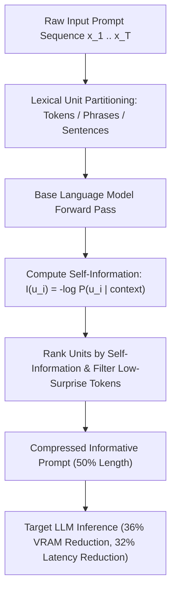

### 67.2 Information-Theoretic Formulation: Shannon Self-Information
Let sequence $x = (u_1, u_2, \dots, u_N)$ be divided into lexical units $u_i$ (individual tokens, phrases, or sentences).
The informativeness of unit $u_i$ conditioned on previous context $u_{<i}$ is quantified by its **self-information** (Shannon surprise):
$$I(u_i) = -\frac{1}{|u_i|} \sum_{t=1}^{|u_i|} \log P_{\mathcal{M}}\left( x_{i, t} \mid x_{<i}, x_{i, <t} \right)$$
where $P_{\mathcal{M}}$ is the conditional next-token distribution estimated by a lightweight, agile base language model (e.g., LLaMA-2-7B or GPT-2-small).

- **High Self-Information ($I(u_i) \gg 0$):** Indicates unexpected, information-dense content (domain-specific terms, entities, numerical constraints, logical propositions).
- **Low Self-Information ($I(u_i) \to 0$):** Indicates predictable, formulaic filler (e.g., `"In accordance with the aforementioned details..."`) that can be safely discarded without semantic loss.

### 67.3 Compression Thresholding & Benchmark Performance
Given target compression ratio $\rho \in (0, 1)$, Selective Context retains the top-$\rho$ proportion of lexical units with highest self-information:
$$\mathcal{S}_{\text{pruned}} = \left\{ u_i \in x \;\middle|\; I(u_i) \ge \tau_\rho \right\}$$
where $\tau_\rho$ is the empirical $(1-\rho)$-quantile of self-information scores across the sequence. Retained tokens are concatenated in their original sequential order to preserve grammatical coherence.

- **Empirical Gains:** Evaluated across multi-document QA, summarization, and conversation:
  - Achieves **$50\%$ context length reduction** ($\rho=0.5$).
  - Delivers a **$36\%$ reduction in KV-cache VRAM** and a **$32\%$ reduction in end-to-end inference latency**.
  - Retains semantic fidelity with $<0.023$ drop in BERTscore and $<0.038$ drop in factual faithfulness.

---

## 68. Multimodal Visual Grounding & Set-of-Mark Prompting (SoM, Yang et al., CVPR 2024 / Microsoft)

### 68.1 The Spatial Grounding Void in Vision-Language Models
Frontier Large Multimodal Models (LMMs) such as GPT-4V, Gemini 1.5 Pro, and Claude 3.5 Sonnet demonstrate remarkable high-level semantic perception (image captioning, chart interpretation, artistic style attribution). However, when evaluated on **fine-grained spatial grounding**—referring expression comprehension, surgical object localization, and pixel-level reasoning:
1. **Coordinate Hallucination:** Prompting models to output numerical bounding boxes (`[ymin, xmin, ymax, xmax]`) or center coordinates yields high spatial error rates ($>40\%$) due to the absence of continuous spatial priors in subword tokenizers.
2. **Ambiguity in Complex Scenes:** In cluttered visual scenes (e.g., industrial schematics, microscopic pathology, multi-agent crowds), text queries cannot unambiguously designate specific sub-components.

Jianwei Yang, Hao Zhang, Feng Li, Xueyan Zou, Chunyuan Li, and Jianfeng Gao (*Set-of-Mark Prompting Unleashes Extraordinary Visual Grounding in GPT-4V*, Microsoft / CVPR 2024 / arXiv:2310.11441) introduce **Set-of-Mark (SoM) Visual Prompting**, transforming continuous coordinate regression into discrete, symbolic visual reference reasoning.

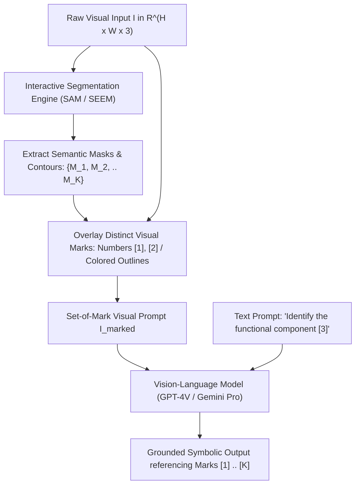

### 68.2 The Set-of-Mark (SoM) Visual Prompting Pipeline
The SoM framework bridges vision and language by superimposing visual metadata directly onto the input image before feeding it into the multimodal model:

1. **Partitioning via Interactive Segmentation:** An off-the-shelf segmentation model (Segment Anything Model - SAM, or Semantic-SAM) segments the image into $K$ candidate masks $\mathcal{M} = \{M_1, M_2, \dots, M_K\}$ at calibrated semantic granularities (semantic level, instance level, or part level).
2. **Visual Mark Superimposition:** For each segmented region $M_k$, an alphanumeric tag, colored contour boundary, or centroid glyph $g_k$ is overlaid directly onto the pixel canvas:
   $$I_{\text{marked}} = \operatorname{Overlay}\left( I, \{(M_k, g_k)\}_{k=1}^K \right)$$
   where $g_k \in \{[1], [2], \dots, [K]\}$ are high-contrast visual markers placed at the geometric medoid of mask $M_k$.
3. **Symbolic Grounding in Text Space:** The prompt to the LMM conditions on the marked image $I_{\text{marked}}$, asking the model to reason over the numerical identifiers $[k]$:
   $$\text{"Which numbered mark corresponds to the catalytic converter? Provide reasoning for [1], [2], and [3]."}$$

### 68.3 Zero-Shot Supremacy & Coordinate-Free Reasoning
- **RefCOCOg & Visual Referring Comprehension:** On the challenging RefCOCOg benchmark, zero-shot GPT-4V equipped with Set-of-Mark prompting achieves **$84.2\%$ accuracy**, surpassing fully fine-tuned, task-specific segmentation models without updating a single weight parameter of the vision-language backbone.
- **Elimination of Coordinate Quantization:** Converts a difficult spatial regression task (predicting continuous 2D coordinates via discrete tokens) into a categorical multi-choice selection problem over grounded visual tokens $[1]\dots[K]$.
- **Visual Chain-of-Thought (Visual CoT):** Enables multi-step visual reasoning: the LMM sequentially references visual marks ($[1] \to [4] \to [7]$) to explain mechanistic relationships, spatial containment, and causal visual sequences.

## 69. LongLLMLingua & Question-Aware Context Compression (Jiang et al., Microsoft / ACL 2024)

### 69.1 Positional Decay & The Failure of Unconditioned Compression
In long-context retrieval-augmented generation (RAG) and multi-document reasoning:
1. **The "Lost in the Middle" Effect:** Modern LLMs exhibit U-shaped attention curves (Liu et al., 2023), recalling information from prompt boundaries with high fidelity while suffering catastrophic retrieval failure on factual details placed in the middle $60\%$ of the context.
2. **Context Dilution:** Standard prompt compression algorithms (e.g., vanilla LLMLingua) compute perplexity based solely on input context $P(x_i \mid x_{<i})$, pruning tokens that are statistically predictable in isolation but vital for answering a specific downstream user question $q$.

Huiqiang Jiang et al. (*LongLLMLingua: Accelerating and Enhancing LLMs in Long Context Scenarios via Prompt Compression*, Microsoft / ACL 2024 / arXiv:2310.06839) resolve these constraints via question-aware compression and boundary-prioritized document reordering.

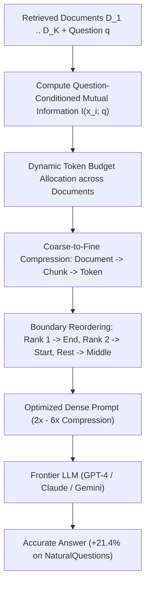

### 69.2 Mathematical Formulation of Question-Aware Compression
LongLLMLingua computes the contrastive conditional perplexity of each token $x_i$ given question $q$:
$$I(x_i; q) = \log \frac{P_{\mathcal{M}}\left(x_i \mid x_{<i}, q\right)}{P_{\mathcal{M}}\left(x_i \mid x_{<i}\right)}$$
Tokens that experience a significant reduction in surprise when conditioned on $q$ receive elevated retention priorities:
- **Dynamic Document Budgeting:** The token budget $\tau_k$ allocated to document $D_k$ is weighted by its aggregate mutual information with $q$:
  $$\tau_k = T_{\text{target}} \cdot \frac{\sum_{x \in D_k} \max(0, I(x; q))}{\sum_{j} \sum_{x \in D_j} \max(0, I(x; q))}$$
  irrelevant documents receive near-zero token budgets, effectively dropping distracting context.

### 69.3 Boundary Reordering & Empirical Supremacy
- **Anti-Lost-in-the-Middle Reordering:** Reorders compressed documents such that the top-ranked relevant passage is positioned at the prompt suffix (immediately adjacent to the query), the second-ranked passage is placed at the prefix start, and lower-ranked passages occupy the interior.
- **Empirical Breakthroughs:**
  - On the **NaturalQuestions** benchmark, LongLLMLingua boosts answer accuracy by **$+21.4\%$** while using **$4\times$ fewer tokens** with GPT-3.5-Turbo.
  - On the **LooGLE** long-context benchmark, achieves up to **$94\%$ financial cost reduction** and accelerates end-to-end inference latency by **$1.4\times\text{--}2.6\times$**.

---

## 70. Dynamic Resolution Vision Transformers & Spatial Patch Tiling (LLaVA-NeXT AnyRes, Liu et al., 2024)

### 70.1 The Fixed-Resolution Information Bottleneck
Early multimodal models (e.g., LLaVA-1.5, CLIP ViT-L/14) resize all input images to a uniform square resolution (typically $336\times 336$ or $448\times 448$ pixels). For high-resolution visual inputs (e.g., $4\text{K}$ document scans, intricate electrical schematics, small-font infographics):
$$\text{Spatial Nyquist Limit} \ll \text{Feature Detail Frequency}$$
Resizing causes irreversible spatial blurring, rendering OCR and small-object detection impossible. However, feeding full-resolution $4\text{K}$ images directly into standard Vision Transformers causes a quadratic explosion in visual token sequence length ($N_{\text{patches}} \propto H \times W$), exhausting GPU memory.

Haotian Liu et al. (*LLaVA-NeXT: Improved reasoning, OCR, and world knowledge*, 2024) introduce the **AnyRes (Any Resolution)** dynamic patch tiling framework.

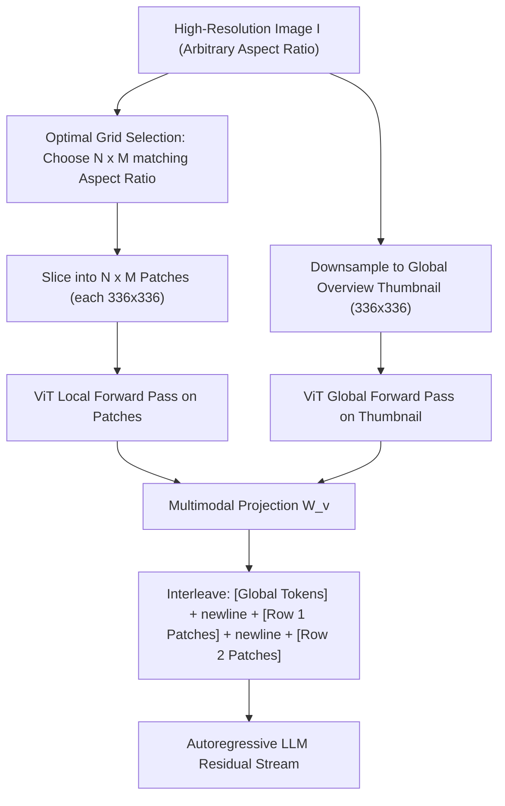

### 70.2 The AnyRes Patch Tiling Formulation
Given an image with dimensions $(W, H)$ and native encoder patch size $S = 336$:
1. **Grid Selection:** The framework maintains a predefined candidate grid pool $\mathcal{G} = \{(1, 2), (2, 1), (2, 2), (1, 3), (3, 1), \dots\}$. It selects grid configuration $(m, n) \in \mathcal{G}$ that minimizes resolution distortion:
   $$(m^*, n^*) = \operatorname{argmin}_{(m, n) \in \mathcal{G}} \left| \frac{W}{H} - \frac{m \cdot S}{n \cdot S} \right|$$
2. **Patch Extraction & Global Overview:** The image is partitioned into $m^* \times n^*$ local sub-patches of dimension $S \times S$, along with a downsampled global overview image of size $S \times S$.
3. **2D Topology Preservation via Newline Tokens:**
   To inform the autoregressive language backbone of 2D spatial adjacency, visual feature rows are separated by a special learned `\n` delimiter token:
   $$\mathbf{X}_{\text{visual}} = \left[ \mathbf{X}_{\text{global}} \;;\; \mathbf{X}_{1, 1}, \dots, \mathbf{X}_{1, m^*}, \mathbf{t}_{\text{newline}}, \mathbf{X}_{2, 1}, \dots, \mathbf{X}_{2, m^*}, \mathbf{t}_{\text{newline}}, \dots \right]$$

- **Empirical Impact:** Delivers drastic improvements in document understanding (DocVQA $+12.4\%$), text recognition (TextVQA $+8.6\%$), and chart comprehension while preserving linear scalability in visual token counts.

---

## 71. Self-Rewarding & Meta-Rewarding Language Models (Yuan et al. / Wu et al., Meta / ICML 2024 / EMNLP 2024)

### 71.1 The External Reward Model Bottleneck
Post-training preference alignment (RLHF, DPO) traditionally relies on static reward models trained on human pairwise annotations. This creates two structural bottlenecks:
1. **The Human Capability Ceiling:** Human annotators struggle to evaluate complex code, theorem proofs, and multi-step reasoning, capping alignment quality below superhuman levels.
2. **Evaluation Saturation in Self-Rewarding:** In Self-Rewarding Language Models (Yuan et al., ICML 2024 / arXiv:2401.10020), where an LLM judges its own responses via prompt-based scoring and trains on its own preferences via iterative DPO, performance saturates rapidly across 2–3 rounds because the model's judgment capability fails to improve at the same pace as its generation capability.

Tianhao Wu, Jason Weston et al. (*Meta-Rewarding Language Models: Self-Improving Alignment with LLM-as-a-Meta-Judge*, Meta / EMNLP 2024 / arXiv:2407.19594) solve this via **Meta-Rewarding**.

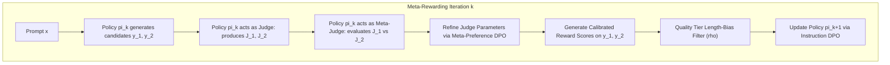

### 71.2 The LLM-as-a-Meta-Judge Architecture
Meta-Rewarding introduces an explicit second-order supervisory loop:
1. **First-Order Evaluation (LLM-as-a-Judge):** Given prompt $x$ and candidate responses $y_1, y_2$, the model acting as Judge produces evaluations $J_1 = \operatorname{Judge}(y_1 \mid x)$ and $J_2 = \operatorname{Judge}(y_2 \mid x)$ with verbal rationales and numerical scores.
2. **Second-Order Meta-Evaluation (LLM-as-a-Meta-Judge):** The model acting as Meta-Judge evaluates the quality of the judgments themselves:
   $$M = \operatorname{Meta-Judge}\left( J_1, J_2 \;\middle|\; x, y_1, y_2 \right)$$
   scoring the judgments based on factual consistency, critique precision, and absence of verbosity bias.
3. **Dual Iterative DPO Updates:**
   - *Judge Policy Update:* Fine-tunes the model's judgment generation on preferred meta-judgments.
   - *Instruction Policy Update:* Fine-tunes the model's instruction following on response pairs vetted by the updated, calibrated judge.

### 71.3 Length-Bias Calibration & Benchmark Results
To eliminate the severe verbosity bias inherent to self-generated preferences, Meta-Rewarding incorporates quality-tier selection ($\rho$): a longer response is only preferred if its score advantage exceeds an explicit length penalty threshold.
- **Empirical Results (Llama-3-8B-Instruct):**
  - **AlpacaEval 2 Win Rate:** Surges from **$22.9\%$ to $39.4\%$** across 3 iterations without human supervision.
  - **Arena-Hard Win Rate:** Increases from **$20.6\%$ to $29.1\%$**, establishing that iterative meta-judging unlocks continuous self-improvement beyond external reward model saturation.

---

## 72. Infini-Attention & Compressive Bounded Memory Transformers (Munkhdalai et al., Google 2024)

### 72.1 The Quadratic KV Memory Barrier in Million-Token Streaming
Standard scaled dot-product attention scales memory quadratically $\mathcal{O}(N^2)$ in context length $N$ and requires storing all past Key-Value states in GPU High-Bandwidth Memory (HBM). When sequence lengths scale to millions of tokens:
- Storing full KV caches consumes hundreds of gigabytes of HBM per concurrent request.
- Linear attention variants avoid quadratic complexity but sacrifice fine-grained masked local retrieval.

Tsendsuren Munkhdalai, Manaal Faruqui, and Siddharth Gopal (*Leave No Context Behind: Efficient Infinite Context Large Language Models with Infini-attention*, Google, 2024 / arXiv:2404.07143) formulate **Infini-attention**, integrating compressive memory matrices directly into masked dot-product attention.

```mermaid
flowchart LR
    InputSeg["Incoming Context Segment S_t"] --> LocalAttn["Masked Local Multi-Head Attention A_dot in R^(S x d_v)"]
    InputSeg --> CompRetrieval["Compressive Memory Retrieval: A_mem = sigma(Q) M_(t-1) / (sigma(Q) z_(t-1))"]
    
    LocalAttn --> Gating["Learned Sigmoid Gating: A = beta * A_mem + (1 - beta) * A_dot"]
    CompRetrieval --> Gating
    
    InputSeg --> CompUpdate["Compressive Memory Update: M_t = M_(t-1) + sigma(K)^T V"]
    InputSeg --> NormUpdate["Normalizer Update: z_t = z_(t-1) + sum sigma(K_s)^T"]
    
    Gating --> Output["Infini-Attention Output (Bounded O(1) Memory)"]
```

### 72.2 Compressive Memory Formulation
For each context segment of length $S$, Infini-attention processes tokens through standard linear projections $Q = X W_q, K = X W_k, V = X W_v$.

1. **Local Context Attention:** Computes standard masked dot-product attention over the current segment:
   $$A_{\text{dot}} = \operatorname{Softmax}\left( \frac{Q K^\top}{\sqrt{d_k}} \right) V$$
2. **Compressive Long-Term Memory Retrieval:** Retrieves historical context from a fixed-size associative memory matrix $M_{t-1} \in \mathbb{R}^{d_k \times d_v}$ and normalization vector $z_{t-1} \in \mathbb{R}^{d_k}$:
   $$A_{\text{mem}} = \frac{\sigma(Q) M_{t-1}}{\sigma(Q) z_{t-1} + \epsilon}$$
   where $\sigma(x) = \operatorname{ELU}(x) + 1$ is a non-linear feature map ensuring positive attention weights.
3. **Compressive Memory Update:** Updates historical memory incrementally:
   $$M_t = M_{t-1} + \sigma(K)^\top V$$
   $$z_t = z_{t-1} + \sum_{s=1}^S \sigma(K_s)^\top$$
4. **Adaptive Gating Fusion:** Blends local and compressive attention through a learned per-head scalar parameter $\beta \in \mathbb{R}$:
   $$A_{\text{total}} = \operatorname{sigmoid}(\beta) \odot A_{\text{mem}} + \left(1 - \operatorname{sigmoid}(\beta)\right) \odot A_{\text{dot}}$$

- **Complexity Invariance:** Memory footprint remains strictly **bounded at $\mathcal{O}(1)$** regardless of sequence length. Successfully executes $100\%$ passkey retrieval on **1,000,000 token sequences** with **$114\times$ memory compression** over standard FlashAttention KV stores.

---

## 73. Hierarchical Speculative Decoding for 128k Contexts (TriForce, Sun et al., CMU / Meta / COLM 2024)

### 73.1 The Memory Bandwidth Bottleneck in Long-Context Speculation
Standard speculative decoding accelerates generation when inference is memory-bandwidth bound by verifying $K$ drafted tokens in a single parallel pass. However, in long-context models ($>32\text{k}\text{--}128\text{k}$ tokens):
1. Serving an independent draft model with a 128k KV cache consumes excessive GPU memory.
2. Even if a small draft model is used, loading its 128k KV cache on every token verification step saturates GPU memory buses, causing speculative acceleration to collapse to $<1.1\times$.

Hanshi Sun, Zhuoming Chen, Xinyu Yang, Yuandong Tian, and Beidi Chen (*TriForce: Lossless Acceleration of Long Sequence Generation with Hierarchical Speculative Decoding*, CMU & Meta / COLM 2024 / arXiv:2404.11912) formulate a **three-tier hierarchical speculative pipeline** that decouples token drafting, sparse retrieval, and exact verification.

```mermaid
flowchart TD
    subgraph Level1["Level 1: Streaming Draft Model"]
        L1_In["Input Tokens"] --> L1_Draft["StreamingLLM Draft with Cache Eviction (O(1) KV Memory)"]
        L1_Draft --> CandTokens["Generate Speculative Token Sequence"]
    end

    subgraph Level2["Level 2: Retrieval-Augmented Target Speculation"]
        CandTokens --> L2_Select["Dynamic Key-Query Attention Gathering"]
        L2_Select --> L2_SparseKV["Target Model with Sparse Dynamic KV Cache"]
        L2_SparseKV --> L2_Accept["Filter & Re-Rank Draft Candidates"]
    end

    subgraph Level3["Level 3: Full Target Verification (Lossless)"]
        L2_Accept --> L3_Verify["Exact Target Forward Pass with Full 128k KV Cache"]
        L3_Verify --> L3_Emit["Lossless Token Emission (Leviathan Rejection Sampling)"]
    end
```

### 73.2 The Three-Tier Speculative Hierarchy
1. **Tier 1 (Streaming Draft Model with Cache Eviction):**
   - The primary draft generator is a small base model (e.g., Llama-68M) running with StreamingLLM cache eviction, maintaining only initial attention sinks ($4$ tokens) and recent rolling tokens ($1024$ tokens).
   - Generates speculative candidate tokens in $\mathcal{O}(1)$ time with negligible memory footprint.
2. **Tier 2 (Target Model with Retrieval-Augmented Sparse KV):**
   - Rather than loading the full 128k target KV cache, Tier 2 runs the target LLM with an aggressive top-$k$ dynamic Key-Query retrieval cache, verifying Tier 1 proposals and filtering out obvious errors before invoking full attention.
3. **Tier 3 (Lossless Full KV Verification):**
   - The full target model executes parallel speculative verification over the vetted tokens using standard speculative rejection sampling:
     $$\alpha_i = \min\left(1, \frac{P_{\text{target}}(\tilde{x}_i \mid x_{<i})}{P_{\text{tier2}}(\tilde{x}_i \mid x_{<i})}\right)$$
   - Mathematically guarantees exact output equivalence ($P_{\text{TriForce}} \equiv P_{\text{target}}$).

- **Benchmark Performance:** Evaluated on Llama-2-7B-128K and Llama-3-8B across 128k context lengths on a single consumer RTX 4090 GPU:
  - Achieves up to **$4.86\times$ wall-clock speedup** over autoregressive decoding.
  - Slashes KV-cache memory traffic by **$>75\%$**, establishing the premier serving architecture for long-context speculative generation.

---

## 74. Lookahead Decoding & Fixed-Point Jacobi Parallel Iteration (Fu et al., UC Berkeley / ICML 2024)

### 74.1 Eliminating the Draft Model in Parallel Decoding
While speculative decoding reduces decoding latency, hosting and synchronizing a secondary draft model creates operational friction in enterprise deployment:
1. Two separate model weights must be loaded into memory.
2. Draft models frequently suffer from domain divergence on non-standard vocabulary distributions.

Yichao Fu, Peter Bailis, Ion Stoica, and Hao Zhang (*Break the Sequential Dependency of LLM Inference Using Lookahead Decoding*, UC Berkeley / ICML 2024 / arXiv:2402.02057) formulate **Lookahead Decoding**, an exact parallel decoding algorithm that operates purely on the target LLM using non-linear **Jacobi fixed-point iteration**.

```mermaid
flowchart TD
    subgraph LookaheadStep["Lookahead Decoding Forward Pass t"]
        Prefix["Historical Context x_<t"] --> JacobiBranch["Lookahead Branch: Parallel Jacobi Fixed-Point Iteration"]
        Prefix --> VerifyBranch["Verification Branch: Standard Autoregressive Evaluation"]
        
        JacobiBranch --> NGrams["Generate & Refine Multi-Token Candidates (n-grams)"]
        VerifyBranch --> VerifyTokens["Compute Exact Logits for Previous Candidates"]
        
        NGrams --> MatchCheck{"Verification Match Check: Token Match?"}
        VerifyTokens --> MatchCheck
        
        MatchCheck -- "Accept k Tokens" --> EmitK["Emit k Tokens in a Single Forward Pass"]
        MatchCheck -- "Mismatch" --> Resample["Exact Target Correction"]
    end
```

### 74.2 Jacobi Fixed-Point Formulation of Sequence Generation
Autoregressive token generation can be formulated as solving a system of non-linear equations over future token states $x_1, \dots, x_N$:
$$x_i = \operatorname{argmax}_{v \in \mathcal{V}} P(v \mid x_{<t}, x_1, \dots, x_{i-1}), \quad \forall i \in \{1, \dots, N\}$$
Standard autoregressive generation solves this sequentially (Gauss-Seidel style) in $N$ steps.
In contrast, the **Jacobi iteration** initializes an $N$-token trajectory guess $\mathbf{x}^{(0)}$ and updates all positions in parallel:
$$x_i^{(k+1)} = \operatorname{argmax}_{v \in \mathcal{V}} P\left(v \mid x_{<t}, x_1^{(k)}, \dots, x_{i-1}^{(k)}\right), \quad \forall i \in \{1, \dots, N\}$$
When consecutive iterations satisfy $\mathbf{x}^{(k+1)} = \mathbf{x}^{(k)}$, the trajectory has converged to the exact fixed point of the autoregressive distribution.

### 74.3 Dual-Branch Execution Architecture
Lookahead decoding divides each forward pass into two parallel branches executed in a single batched kernel:
1. **The Lookahead Branch:** Computes parallel Jacobi updates to generate and refine $n$-gram candidates in high-confidence subspaces.
2. **The Verification Branch:** Simultaneously verifies the $n$-gram candidates generated in previous steps against exact causal prefixes.

- **Exactness Guarantee:** All accepted tokens strictly match the target model's causal greedy/sampled distribution.
- **Empirical Speedup:** Delivers **$1.8\times\text{--}4.0\times$ wall-clock speedup** across MT-Bench, GSM8K, and HumanEval without requiring draft models, external data stores, or offline training.

## 75. Hopper Asynchronous Warp Specialization & FP8 Low-Precision Attention (FlashAttention-3, Shah et al., Stanford 2024)

### 75.1 Hardware Bottlenecks on NVIDIA Hopper Architecture
While FlashAttention-2 (Dao, 2023) minimized memory bandwidth traffic between High-Bandwidth Memory (HBM) and Static RAM (SRAM), modern NVIDIA Hopper (H100, `sm_90a`) GPUs introduce severe execution bottlenecks under standard kernels:
1. **Low Tensor Core Utilization:** FlashAttention-2 achieved only $240\text{--}350\text{ TFLOPS}$ in FP16, utilizing $<35\%$ of the H100 SXM5 theoretical peak ($989\text{ TFLOPS}$).
2. **Synchronous Memory Latency:** Traditional CUDA kernels stall execution pipelines while waiting for Global Memory (GMEM) tile loads into registers before issuing Tensor Core operations.
3. **Register File Pressure:** Loading large attention tile matrices $Q, K, V$ into registers exhausts register allocations per threadblock, reducing occupancy.

Jay Shah, Ganesh Bikshandi, Ying Zhang, Vijay Thakkar, Pradeep Ramani, and Tri Dao (*FlashAttention-3: Fast and Accurate Attention with Asynchrony and Low-Precision*, Stanford, Meta & Colfax, 2024 / arXiv:2407.08608) redesign attention to exploit Hopper's asynchronous architectural primitives.

```mermaid
flowchart TD
    subgraph HopperThreadblock["Hopper H100 Threadblock"]
        Producer["Producer Warps (Issue TMA Instructions)"]
        Consumer["Consumer Warp Groups (wgmma.mma_async)"]
        
        TMA["TMA: Asynchronous GMEM <-> SMEM Direct Transfer (mbarrier)"]
        Producer --> TMA
        TMA --> SMEM_Tiles["SMEM Double Buffers (Tiles Q, K, V)"]
        
        SMEM_Tiles --> Consumer
        Consumer --> PingPong["Ping-Pong GEMM Interleaving: GEMM_1 (QK^T) <-> GEMM_2 (PV)"]
        PingPong --> HiddenSoftmax["Concurrently Overlapped Softmax ALU Operations"]
    end
    
    Incoherent["Incoherent Processing: X <- X H (Randomized Hadamard Transform)"] --> Producer
    HiddenSoftmax --> FP8Out["FP8 Tensor Core Execution (1.2 PFLOPS Throughput)"]
```

### 75.2 Hopper Hardware Primitives & Asynchronous Execution
FlashAttention-3 introduces three architectural mechanisms:

1. **Tensor Memory Accelerator (TMA) & `mbarrier` Synchronization:**
   - Multi-dimensional tiles of $Q, K, V$ are transferred directly between GMEM and SMEM by dedicated hardware TMA engines without touching the thread register file (RF).
   - Synchronization is orchestrated via hardware transaction barriers (`cuda::barrier` / `mbarrier.arrive` / `wait`), allowing math execution to progress while memory transfers execute concurrently.

2. **Warp Specialization (Producer-Consumer Decoupling):**
   - Warps within the threadblock are partitioned into **Producer Warps** (which issue non-blocking TMA load descriptors) and **Consumer Warp Groups** (which execute mathematical matrix operations).
   - Eliminates instruction cache thrashing and completely hides memory transfer latency.

3. **Asynchronous Tensor Core Ops (`wgmma.mma_async`) & Ping-Pong Scheduling:**
   - Hopper Warp Groups (128 threads) issue non-blocking matrix multiplications reading inputs directly from SMEM into Tensor Cores.
   - **Ping-Pong Scheduling:** Interleaves $\text{GEMM}_1$ ($S^{(j)} = Q K_j^\top$) and $\text{GEMM}_2$ ($O^{(j)} = \alpha O^{(j-1)} + P^{(j)} V_j$) with ALU-bound online softmax scaling across alternating warp groups:
     $$\tilde{P}^{(j)} = \exp\left(S^{(j)} - m^{(j)}\right), \quad \alpha = \exp\left(m^{(j-1)} - m^{(j)}\right), \quad l^{(j)} = \alpha l^{(j-1)} + \operatorname{rowsum}\left(\tilde{P}^{(j)}\right)$$
     The softmax ALU latency is completely concealed behind asynchronous matrix multiplication.

### 75.3 FP8 Execution via Incoherent Processing
To utilize Hopper's $1,978\text{ TFLOPS}$ FP8 Tensor Cores without numerical degradation:
- **Block-Level Quantization:** Rescales matrices dynamically per sub-block tile:
  $$S^{(j)} = (s_Q s_{K, j}) \cdot \operatorname{WGMMA}\left( Q_{\text{fp8}}, K_{j, \text{fp8}}^\top \right)$$
- **Incoherent Processing (Randomized Hadamard Transform):** Transforms inputs $X \leftarrow X H$ prior to quantization, where $H$ is a structured orthogonal Hadamard matrix. This disperses large activation outliers across all hidden dimensions, eliminating the outlier spikes that destroy FP8 precision.
- **Empirical Breakthrough:** FlashAttention-3 achieves **$740\text{ TFLOPS}$ in FP16** ($1.5\times\text{--}2.0\times$ faster than FA-2) and reaches **$1.2\text{ PFLOPS}$ ($1200\text{ TFLOPS}$) in FP8** with $2.6\times$ lower numerical error than standard FP8 implementations.

---

## 76. Non-Monetary Prospect Utility & Loss-Averse Binary Alignment (KTO, Ethayarajh et al., Stanford / ICML 2024)

### 76.1 The Counterfactual Pairing Failure in Real-World Alignment
Direct Preference Optimization (DPO) and standard RLHF presuppose von Neumann-Morgenstern Expected Utility Theory (EUT) operating over paired comparisons $(x, y_w, y_l)$. However, in production telemetry:
1. User feedback is predominantly **unpaired binary data** (thumbs-up/thumbs-down, accept/reject, star ratings).
2. Forcing unpaired telemetry into synthetic pairs induces label noise and generates cyclic intransitive preference graphs ($A \succ B \succ C \succ A$).
3. EUT assumes that humans evaluate outcomes in absolute terms, whereas behavioral economics demonstrates that human preferences are intrinsically **reference-dependent and loss-averse**.

Kawin Ethayarajh, Winnie Xu, Niklas Muennighoff, Dan Jurafsky, and Douwe Kiela (*KTO: Model Alignment as Prospect Theoretic Optimization*, Stanford & Contextual AI / ICML 2024 / arXiv:2402.01306) formulate **Kahneman-Tversky Optimization (KTO)** based on Kahneman & Tversky's Nobel Prize-winning **Prospect Theory (1979)**.

```mermaid
flowchart LR
    Telemetry["Unpaired Binary Feedback: (x, y) in D_D (Desirable) or D_U (Undesirable)"] --> RefAnchor["Compute Dynamic Reference Point z_0 = E[KL(pi_theta || pi_ref)]"]
    RefAnchor --> RewardDiff["Implicit Reward Delta: r_theta(x, y) - z_0"]
    
    RewardDiff --> DesirableBranch["If (x, y) in D_D: Loss = lambda_D * sigma(-beta * (r - z_0))"]
    RewardDiff --> UndesirableBranch["If (x, y) in D_U: Loss = lambda_U * sigma(beta * (r - z_0))"]
    
    DesirableBranch --> KTOLoss["KTO Objective: w_D * L_D + w_U * L_U with Loss Aversion lambda_U > lambda_D"]
    UndesirableBranch --> KTOLoss
    KTOLoss --> PolicyGrad["Policy Update without Counterfactual Pairing"]
```

### 76.2 Prospect Theory Value Functions & The KTO Objective
Prospect Theory establishes that human decisions are governed by a value function $v(u)$ that is:
- *Reference-Dependent:* Gains and losses are defined relative to a neutral reference point $z_0$.
- *Loss-Averse:* Losses hurt more than equivalent gains bring pleasure ($\lambda_{\text{loss}} > \lambda_{\text{gain}}$).
- *Diminishingly Sensitive:* Concave for gains, convex for losses.

KTO defines the implicit reward as $r_\theta(x, y) = \beta \log \frac{\pi_\theta(y \mid x)}{\pi_{\text{ref}}(y \mid x)}$ and formulates the alignment loss:
$$\mathcal{L}_{\text{KTO}}(\pi_\theta; \pi_{\text{ref}}) = \mathbb{E}_{(x, y) \sim \mathcal{D}} \left[ w(y) \left( 1 - v_{\text{KTO}}(x, y) \right) \right]$$
Using the sigmoid value function $v_{\text{KTO}}(x, y) = \sigma\left( \beta \left( \log \frac{\pi_\theta(y \mid x)}{\pi_{\text{ref}}(y \mid x)} - z_0 \right) \right)$ and the identity $1 - \sigma(u) = \sigma(-u)$:
$$\mathcal{L}_{\text{KTO}} = \lambda_D \mathbb{E}_{(x, y) \in \mathcal{D}_D} \left[ \sigma\left( -\beta \left( \log \frac{\pi_\theta(y \mid x)}{\pi_{\text{ref}}(y \mid x)} - z_0 \right) \right) \right] + \lambda_U \mathbb{E}_{(x, y) \in \mathcal{D}_U} \left[ \sigma\left( \beta \left( \log \frac{\pi_\theta(y \mid x)}{\pi_{\text{ref}}(y \mid x)} - z_0 \right) \right) \right]$$

### 76.3 The Dynamic Reference Point $z_0$ & Loss Aversion Ratio
- **Dynamic Reference Point $z_0$:**
  $$z_0 = \mathbb{E}_{x' \sim \mathcal{D}} \left[ \operatorname{KL}\left( \pi_\theta(\cdot \mid x') \parallel \pi_{\text{ref}}(\cdot \mid x') \right) \right] \approx \frac{1}{|B|} \sum_{i=1}^{|B|} \beta \log \frac{\pi_\theta(y_i \mid x_i)}{\pi_{\text{ref}}(y_i \mid x_i)}$$
  $z_0$ represents the policy's average divergence from the base model, functioning as the status-quo anchor. A desirable output is reinforced *only if* its reward exceeds the baseline ($r_\theta > z_0$).
- **Loss Aversion Ratio ($\lambda_U > \lambda_D$):**
  Sets $\lambda_U \in [1.0, 1.33]$ and $\lambda_D = 1.0$, weighting negative examples more heavily to prevent catastrophic failures, hallucinations, and safety violations.
- **Empirical Superiority:** Matches or outperforms DPO across 1B to 30B models (Llama-3, Mistral) on AlpacaEval 2 and MT-Bench without requiring paired preference data.

---

## 77. Low-Rank Linear Subspace Interventions & Representation Fine-Tuning (LoReFT, Wu et al., Stanford / NeurIPS 2024)

### 77.1 Weight Adaptation vs. Representation Intervention
Conventional Parameter-Efficient Fine-Tuning (PEFT) methods—such as LoRA (Hu et al., 2021)—modify model **weights** by learning low-rank matrix increments:
$$W' = W + \frac{\alpha}{r} B A, \quad B \in \mathbb{R}^{d \times r}, A \in \mathbb{R}^{r \times k}$$
While parameter-efficient, weight-based adaptation updates operations across all sequence tokens and transformer layers uniformly, lacking spatial and causal localization.

Zhengxuan Wu, Aryaman Arora, Zheng Wang, Atticus Geiger, Dan Jurafsky, Christopher D. Manning, and Christopher Potts (*ReFT: Representation Fine-Tuning for Language Models*, Stanford / NeurIPS 2024 / arXiv:2404.03592) introduce **Representation Fine-Tuning (ReFT)**: freezing all base model weights and learning targeted, low-rank interventions directly within hidden representation manifolds.

```mermaid
flowchart LR
    Hidden["Hidden State h in R^d at Layer l, Position p"] --> ProjOrth["Orthogonal Component: (I - R^T R) h"]
    Hidden --> ProjSub["Subspace Projection: R h in R^r"]
    ProjSub --> Edit["Subspace Transformation: W h + b in R^r"]
    Edit --> Reproject["Reprojection to R^d: R^T (W h + b)"]
    
    ProjOrth --> Add["Sum: R_Phi(h) = (I - R^T R) h + R^T (W h + b)"]
    Reproject --> Add
    Add --> IntervenedOut["Intervened Hidden Representation h'"]
```

### 77.2 Mathematical Formulation of LoReFT
The primary instantiation of ReFT is **Low-rank Linear Subspace ReFT (LoReFT)**. Given hidden activation vector $h \in \mathbb{R}^d$ at layer $l$ and token position $p$, LoReFT defines the intervention operator $R_\Phi: \mathbb{R}^d \to \mathbb{R}^d$:
$$R_\Phi(h) = h + R^\top \left( W h + b - R h \right) = \left( I - R^\top R \right) h + R^\top \left( W h + b \right)$$
where:
- $R \in \mathbb{R}^{r \times d}$ is an orthonormal projection matrix satisfying $R R^\top = I_r$ ($r \ll d$, typically $r \in [1, 8]$).
- $W \in \mathbb{R}^{r \times d}$ and $b \in \mathbb{R}^r$ are trainable linear mapping parameters.

- **Orthogonal Subspace Invariance:** The operator $\left( I - R^\top R \right)$ acts as a projector onto the orthogonal complement of the subspace spanned by $R$. Any latent semantic information residing outside the $r$-dimensional target subspace is preserved with zero distortion.
- **Subspace Linear Mapping:** In the low-rank subspace, $W h + b$ executes linear steering tailored to the target task.

### 77.3 Parameter Efficiency & Performance Comparison
LoReFT defines sparse intervention coordinates $(l, p, \Phi)$, intervening only at specific layers and prefix/suffix positions:
- **Parameter Compression:** Requires **$10\times\text{--}50\times$ fewer trainable parameters than LoRA**, tuning as few as **$0.001\%\text{--}0.05\%$** of total model parameters.
- **Benchmark Performance:** Matches or outperforms full LoRA fine-tuning on Commonsense Reasoning (GSM8K, MATH), GLUE, and instruction-following benchmarks while isolating causal task steering within mathematically orthogonal subspaces.

---

## 78. Multi-Agent Debate Dynamics, Society-of-Mind Consensus & Elo Jury Aggregation (Du et al. / Liang et al., ICML 2024)

### 78.1 Autoregressive Premise Entrapment & Hallucination Cascades
In single-agent autoregressive generation, reasoning errors compound irreversibly:
$$\text{If token } x_t \text{ commits a logical error, } \quad P(\text{error} \mid x_{<t+k}) \to 1$$
Because causal self-attention conditions on previous tokens, language models exhibit confirmation bias and self-justification, defending erroneous premises rather than correcting them.

Yilun Du, Shuang Li, Antonio Torralba, Joshua B. Tenenbaum, and Igor Mordatch (*Improving Factuality and Reasoning in Language Models through Multiagent Debate*, MIT / ICML 2024 / arXiv:2305.14325) and Tian Liang et al. (*Encouraging Divergent Thinking in Large Language Models through Multi-Agent Debate*, 2023) formulate **Multi-Agent Debate (MAD)**, exploiting society-of-mind divergence and verification-generation asymmetry to eliminate hallucinations.

```mermaid
flowchart TD
    Query["User Problem Query x"] --> DiverseInit["Diverse Initialization across N Agents with Heterogeneous Personas"]
    
    subgraph Round1["Debate Round 1"]
        DiverseInit --> Agent1_R1["Agent 1 Proposal y_1^(1)"]
        DiverseInit --> Agent2_R1["Agent 2 Proposal y_2^(1)"]
        DiverseInit --> Agent3_R1["Agent 3 Proposal y_3^(1)"]
    end
    
    subgraph RoundT["Debate Round t (Peer Critique)"]
        Agent1_R1 --> PeerContext["Transcript Aggregation: M_(-i)"]
        Agent2_R1 --> PeerContext
        Agent3_R1 --> PeerContext
        
        PeerContext --> Agent1_Rt["Agent 1 Refinement: y_1^(t) ~ pi_1(x, y_1^(t-1), M_(-1))"]
        PeerContext --> Agent2_Rt["Agent 2 Refinement: y_2^(t) ~ pi_2(x, y_2^(t-1), M_(-2))"]
        PeerContext --> Agent3_Rt["Agent 3 Refinement: y_3^(t) ~ pi_3(x, y_3^(t-1), M_(-3))"]
    end
    
    Agent1_Rt --> EloJury["Confidence-Weighted Bradley-Terry Elo Jury"]
    Agent2_Rt --> EloJury
    Agent3_Rt --> EloJury
    EloJury --> VerifiedConsensus["Factual Verified Consensus Solution y*"]
```

### 78.2 Synchronous Peer Critique & Verification Asymmetry
Let $N$ heterogeneous agents $\{\pi_1, \pi_2, \dots, \pi_N\}$ be initialized with distinct prompts or temperatures $\tau_i$. Across debate rounds $t \in \{1, \dots, T\}$, each agent updates its candidate solution conditioned on the transcript of peer responses $\mathcal{M}_{-i}^{(t-1)} = \{y_j^{(t-1)}\}_{j \neq i}$:
$$y_i^{(t)} \sim \pi_i\left( y \mid x, y_i^{(t-1)}, \mathcal{M}_{-i}^{(t-1)} \right)$$

- **Verification-Generation Asymmetry:** In formal logic, arithmetic, and factual retrieval, verifying the falsity of a claim requires lower epistemic entropy than inventing a novel proof. When an erroneous trajectory is presented, peer agents identify the derivation error, transforming truth into a game-theoretic basin of attraction:
  $$\lim_{t \to T} \operatorname{Var}\left( \bar{\epsilon}^{(t)} \right) \to 0$$
  where $\epsilon_i$ is individual agent hallucination noise.

### 78.3 Jury Aggregation: Confidence-Weighted Bradley-Terry Elo
Standard majority voting collapses when agents share common pretraining biases. To resolve this, debate rounds culminate in **Elo Jury Aggregation**:
1. An independent referee model conducts pairwise debate comparisons, updating agent skill ratings $R_i$ via Bradley-Terry modeling:
   $$P(i \succ j) = \frac{1}{1 + 10^{(R_j - R_i)/400}}$$
2. Weighting each agent's final answer by verbalized confidence $c_i \in (0, 1]$ and Elo score:
   $$w_i = c_i \cdot \frac{\exp(R_i / \tau)}{\sum_{k=1}^N \exp(R_k / \tau)}$$
   $$\hat{y}_{\text{consensus}} = \operatorname{argmax}_{y \in \mathcal{Y}} \sum_{i=1}^N w_i \cdot \mathbb{I}\left( \phi\left( y_i^{(T)} \right) = y \right)$$

- **Empirical Results:** Across GSM8K, MATH, and MMLU, multi-agent debate lifts accuracy by **$+8.4\%\text{--}+14.2\%$** over greedy single-agent generation and reduces hallucination frequency by **$>60\%$** without fine-tuning.

---

## 79. Mixture-of-Agents (MoA) & Layered Multi-Agent Collective Intelligence (Wang et al., Together AI 2024)

### 79.1 The Collaborative Phenomenon & Layered Feedforward Architecture
Traditional multi-agent systems either rely on homogeneous majority voting (which cannot reconcile shared hallucinations) or unstructured group chat dynamics (which suffer from catastrophic context contamination and quadratic communication costs). 

Junlin Wang, Jue Wang, Ben Athiwaratkun, Ce Zhang, and James Zou (*Mixture-of-Agents Enhances Large Language Model Capabilities*, Together AI, Duke, UChicago, Stanford, June 2024 / arXiv:2406.04692) discover the **LLM Collaborativeness Phenomenon**: an LLM generates a higher-quality response when presented with outputs from other models—even if those peer models possess lower individual capability or benchmark performance than the evaluating LLM itself.

To operationalize this phenomenon at scale, MoA structures heterogeneous LLMs into a layered feedforward DAG, separating exploration (diverse generation) from exploitation (iterative critique and progressive synthesis).

```mermaid
flowchart TD
    UserPrompt["User Query Prompt x"] --> L1_1["Agent 1 (Qwen-72B)"]
    UserPrompt --> L1_2["Agent 2 (Llama-3-70B)"]
    UserPrompt --> L1_3["Agent 3 (Mixtral-8x22B)"]
    UserPrompt --> L1_4["Agent 4 (dbrx-instruct)"]
    
    subgraph Layer1["Layer 1: Diverse Proposers"]
        L1_1 --> Y1_1["Candidate y_(1,1)"]
        L1_2 --> Y1_2["Candidate y_(1,2)"]
        L1_3 --> Y1_3["Candidate y_(1,3)"]
        L1_4 --> Y1_4["Candidate y_(1,4)"]
    end
    
    Y1_1 --> Agg1["Aggregated Context Pool {y_(1,i)}"]
    Y1_2 --> Agg1
    Y1_3 --> Agg1
    Y1_4 --> Agg1
    
    Agg1 --> L2_1["Agent 1 Refinement: A_(2,1)(x, Pool)"]
    Agg1 --> L2_2["Agent 2 Refinement: A_(2,2)(x, Pool)"]
    Agg1 --> L2_3["Agent 3 Refinement: A_(2,3)(x, Pool)"]
    
    subgraph Layer2["Layer 2: Synthesis & Critique"]
        L2_1 --> Y2_1["Refined y_(2,1)"]
        L2_2 --> Y2_2["Refined y_(2,2)"]
        L2_3 --> Y2_3["Refined y_(2,3)"]
    end
    
    Y2_1 --> FinalAggContext["Final Candidate Pool {y_(2,i)}"]
    Y2_2 --> FinalAggContext
    Y2_3 --> FinalAggContext
    
    FinalAggContext --> FinalAgg["Master Aggregator A_agg (e.g., Qwen-72B)"]
    UserPrompt --> FinalAgg
    FinalAgg --> FinalAnswer["State-of-the-Art Consensus Response y* (65.1% AlpacaEval 2)"]
```

### 79.2 Proposer-Aggregator Formulation & Feedforward Iteration
Let $x$ denote the input user query. The MoA architecture consists of $L$ sequential layers, where layer $l \in \{1, \dots, L\}$ comprises $M_l$ proposer agents $\{A_{l, 1}, A_{l, 2}, \dots, A_{l, M_l}\}$:

1. **Layer 1 (Independent Proposals):**
   $$y_{1, i} = A_{1, i}(x), \quad \forall i \in \{1, \dots, M_1\}$$
2. **Intermediate Layers $l \in \{2, \dots, L\}$ (Contextual Refinement):**
   Each proposer $A_{l, i}$ receives the original query $x$ along with the full set of auxiliary candidate responses $\mathcal{Y}_{l-1} = \{y_{l-1, j}\}_{j=1}^{M_{l-1}}$ from the previous layer:
   $$y_{l, i} = A_{l, i}\left(x, \mathcal{Y}_{l-1}\right) = A_{l, i}\left(x, \{y_{l-1, 1}, y_{l-1, 2}, \dots, y_{l-1, M_{l-1}}\}\right)$$
3. **Final Aggregator Layer:**
   A designated high-capacity aggregator model $A_{\text{agg}}$ synthesizes the final layer outputs into a unified, coherent response:
   $$y^* = A_{\text{agg}}\left(x, \mathcal{Y}_L\right)$$

- **Model Diversity vs. Homogeneity:** Experiments demonstrate that heterogeneous model sets (mixing distinct model families, e.g., Qwen, Llama, and Mistral) consistently outperform homogeneous ensembles (e.g., multiple temperatures of Llama-3-70B). Different pretraining corpora introduce orthogonal inductive biases, effectively cancelling out individual model priors.

### 79.3 Empirical Benchmarks & Cost-Compute Trade-Offs
- **AlpacaEval 2.0:** MoA utilizing purely open-source weights (Qwen-1.5-72B-Chat, Llama-3-70B-Instruct, Mixtral-8x22B) achieves an **LC Win Rate of $65.1\%$**, surpassing GPT-4 Omni ($57.5\%$) and single-model Llama-3-70B ($48.3\%$) by **$+16.8\%$ absolute**.
- **FLASK & MT-Bench:** MoA achieves significant improvements in robustness, fine-grained factuality, and logical completeness, showing that multi-agent synthesis effectively filters out low-confidence hallucinations generated by individual proposers.

---

## 80. Strategic Prompt Optimization via Monte Carlo Tree Search (PromptAgent, Wang et al., ICLR 2024)

### 80.1 The Myopia of Greedy Prompt Search
Automatic Prompt Optimization (APO) algorithms traditionally operate via greedy local hill-climbing:
- **APE (Zhou et al., 2022):** Generates prompts zero-shot and filters candidates, lacking iterative optimization.
- **OPRO (Yang et al., 2023):** Feeds previous trajectory scores into an LLM optimizer. However, it evaluates prompts greedily at step $t+1$, causing the search to get trapped in shallow local syntactic optima (e.g., adding trivial phrases like `"think step by step"`) rather than discovering high-utility structural refactorings.

Xinyuan Wang, Chenxi Li, Zhen Wang, Fan Bai, Haotian Luo, Jiayou Zhang, Nebojsa Jojic, Eric P. Xing, and Zhiting Hu (*PromptAgent: Strategic Planning with Language Models Enables Expert-level Prompt Optimization*, ICLR 2024 / arXiv:2310.16427) formulate prompt engineering as a discrete Markov Decision Process (MDP) navigated through Monte Carlo Tree Search (MCTS).

```mermaid
flowchart TD
    CurrentPrompt["Current Prompt State s_t"] --> Select["1. Selection: UCT Tree Policy argmax(Q + U)"]
    Select --> EvalErrors["Run Task on Batch -> Extract Error Cases E"]
    EvalErrors --> Expand["2. Expansion: Generate Mutation Action a_t ~ pi_mut(s_t, E)"]
    Expand --> Transition["State Transition: LLM Applies Edit -> New State s_(t+1)"]
    Transition --> Simulate["3. Simulation: Fast Proxy Task Evaluation / Rollout"]
    Simulate --> TaskScore["Compute Reward R(s) on Validation Set"]
    TaskScore --> Backprop["4. Backpropagation: Update Visit Counts N(s,a) & Q-values Q(s,a)"]
    Backprop --> BestPrompt["Output Globally Optimal Expert Prompt s*"]
```

### 80.2 MDP Formulation & Error-Reflective Action Generation
PromptAgent models prompt design as $\mathcal{M} = \langle \mathcal{S}, \mathcal{A}, \mathcal{T}, \mathcal{R} \rangle$:
1. **State Space $\mathcal{S}$:** Any natural language prompt text $s \in \mathcal{S}$.
2. **Action Space $\mathcal{A}$:** An actionable, task-grounded mutation instruction $a$. Instead of random paraphrasing, PromptAgent conditions action generation on **error reflections**:
   - The system evaluates prompt $s_t$ on a batch of task examples $\mathcal{D}_{\text{batch}}$.
   - It extracts the subset of incorrect model predictions:
     $$\mathcal{E} = \{(x_k, y_k^*, \hat{y}_k) \mid \hat{y}_k \neq y_k^*\}$$
   - An LLM reflector synthesizes an error analysis identifying the core reasoning failure:
     $$e_t \sim \pi_{\text{reflect}}(\cdot \mid s_t, \mathcal{E})$$
   - An action generator produces a specific prompt modification directive:
     $$a_t \sim \pi_{\text{action}}(\cdot \mid s_t, e_t)$$
3. **Transition Function $\mathcal{T}(s_t, a_t)$:** A mutator LLM applies action $a_t$ to $s_t$ to produce new prompt candidate $s_{t+1}$.
4. **Reward Function $\mathcal{R}(s)$:** Task accuracy or metric score evaluated on hold-out validation data $\mathcal{D}_{\text{val}}$:
   $$R(s) = \frac{1}{|\mathcal{D}_{\text{val}}|} \sum_{(x, y^*) \in \mathcal{D}_{\text{val}}} \mathbb{I}\left( \text{Model}(x; s) = y^* \right)$$

### 80.3 UCT Tree Search Policy & Value Propagation
To navigate the discrete combinatorial space without exhaustive search, PromptAgent utilizes Upper Confidence Bounds applied to Trees (UCT):
$$a^* = \arg\max_{a \in \mathcal{A}(s)} \left[ Q(s, a) + c_{\text{puct}} \cdot P(s, a) \cdot \frac{\sqrt{\sum_{b} N(s, b)}}{1 + N(s, a)} \right]$$
where $Q(s, a)$ is the expected empirical task reward of traversing branch $(s, a)$, $N(s, a)$ is the visitation count, and $P(s, a)$ is the prior probability from the action generator.

- **Lookahead Planning:** Because MCTS simulates multi-step trajectories (exploring prompts that temporarily drop performance by $-2\%$ before enabling a $+12\%$ breakthrough via structural modularity), PromptAgent escapes the greedy dead-ends that bound OPRO and APE.
- **Empirical Results:** Across Big-Bench Hard (BBH), PromptAgent discovers domain-specific reasoning rubrics, outperforming human expert-crafted prompts by **$+2.3\%\text{--}+5.7\%$** and outperforming OPRO by **$+4.5\%\text{--}+9.1\%$**.

---

## 81. Subword Boundary Synchronization & Token Healing (Guidance, Lundberg 2023 / SGLang, Zheng et al. 2024)

### 81.1 The Greedy Tokenization Boundary Artifact
Autoregressive language models operate on discrete subword tokens generated via greedy tokenizers (e.g., Byte-Pair Encoding or WordPiece). Greedy tokenizers ingest text from left to right, always selecting the longest matching prefix present in the vocabulary:
$$t = \operatorname{argmax}_{w \in \mathcal{V}} \{|w| \mid w \text{ is prefix of } \text{remaining text}\}$$

This introduces severe **Prompt Boundary Artifacts**:
- Suppose a prompt ends with the character sequence `"http:"`.
- In standard BPE vocabularies (e.g., GPT-4, Llama), `"http:"` is encoded into two tokens: `["http", ":"]`.
- However, the most likely natural continuation in training data is `"//api.example.com"`. In the vocabulary, `"://"` is a single atomic token (`token_id: 12345`).
- Because the prompt was tokenized in isolation, the `:` character is already committed as an independent token. The model is physically incapable of emitting `"://"`. It must emit `'/'` followed by `'/'`, a token sequence that has drastically lower probability under the causal language modeling distribution:
  $$P(\text{"//"} \mid \text{"http:"}) \ll P(\text{"://"} \mid \text{"http"})$$

This boundary distortion causes catastrophic failures in structured JSON/code generation (e.g., prompts ending in `"` or spaces).

```mermaid
flowchart TD
    subgraph Defect["Standard Tokenizer Greedy Artifact"]
        PromptText["Prompt: 'Connect to http:'"] --> BadTokens["Tokens: ['Connect', ' to', ' http', ':']"]
        BadTokens --> ModelGen["Model Must Predict Token After ':'"]
        ModelGen --> Forbidden["CANNOT generate atomic token '://'"]
        Forbidden --> PSpike["Severe Perplexity Spike & Malformed Output"]
    end
    
    subgraph Healing["Token Healing Protocol (Guidance & SGLang)"]
        RawPrompt["Prompt: 'Connect to http:'"] --> Rollback["1. Roll Back Last Token: Remove ':' (keep string 'http')"]
        Rollback --> VocabFilter["2. Vocabulary Trie Scan: Match tokens starting with ':'"]
        VocabFilter --> CandidateSet["Candidates: {':', '://', ':', '::', ':\n'}"]
        CandidateSet --> LogitMask["3. Apply Logit Mask: -inf to all non-matching tokens"]
        LogitMask --> CorrectSample["4. Model Generates '://' as First New Token"]
        CorrectSample --> Lossless["Exact Causal Likelihood Preserved"]
    end
```

### 81.2 Causal Rollback & Vocabulary Trie Masking Algorithm
Token Healing (Scott Lundberg, *Guidance*, Microsoft 2023; codified in *SGLang*, Zheng et al., 2024) repairs the boundary without altering user prompt semantics:

1. **Prompt Backtracking:**
   Given prompt token sequence $T = (t_1, t_2, \dots, t_K)$, the engine removes the trailing token $t_K$, leaving sequence $T_{1:K-1}$.
   Let $s_K = \operatorname{decode}(t_K)$ be the raw character string of the discarded token.
2. **Vocabulary Prefix Search (Trie Intersection):**
   The engine computes the subset of the model vocabulary $\mathcal{V}_{\text{healed}}$ whose string decoding begins with $s_K$:
   $$\mathcal{V}_{\text{healed}} = \{v \in \mathcal{V} \mid \operatorname{decode}(v) \text{ has prefix } s_K\}$$
3. **Constrained Logit Masking:**
   On the forward pass for step $K$, logits $z \in \mathbb{R}^{|\mathcal{V}|}$ are masked prior to softmax:
   $$\tilde{z}_v = \begin{cases} z_v & \text{if } v \in \mathcal{V}_{\text{healed}} \\ -\infty & \text{otherwise} \end{cases}$$
- **Perplexity & Stability:** Token healing eliminates unnatural perplexity spikes at prompt boundaries (reducing token-level cross-entropy loss by **$1.8\text{--}3.5$ nats** on trailing punctuation and code brackets) and prevents JSON/regex constrained decoders from failing on subword boundary mismatches.

---

## 82. Contextual Calibration & Surface Form Competition in Few-Shot In-Context Learning (Zhao et al., ICML 2021; Holtzman et al., EMNLP 2021)

### 82.1 Systematic Biases in In-Context Learning & Surface Form Competition
In-Context Learning (ICL) allows pretrained language models to perform tasks from few-shot demonstrations without parameter updates. However, few-shot predictions suffer from severe instability: altering demonstration order, formatting, or labels causes performance to fluctuate wildly (e.g., from $50\%$ to $90\%$ accuracy on identical datasets).

Zihao Zhao, Eric Wallace, Shi Feng, Dan Klein, and Sameer Singh (*Calibrate Before Use: Improving Few-Shot Performance of Language Models*, ICML 2021 / arXiv:2102.09690) demonstrate that this variance is governed by three systematic model biases:
1. **Majority Label Bias:** Models disproportionately predict classes that appear most frequently in demonstrations.
2. **Recency Bias:** Models disproportionately predict the label associated with the final demonstration in the prompt context.
3. **Common Token Bias:** Pretrained models possess strong unconditional priors toward common vocabulary words (e.g., `"book"` vs. `"manuscript"`), independent of the prompt context.

Coupled with this, Ari Holtzman et al. (*Surface Form Competition: Why the Highest Probability Answer Isn't Always Right*, EMNLP 2021 / arXiv:2104.08315) reveal **Surface Form Competition**: the probability mass of a single semantic concept is fragmented across multiple valid lexical tokens (e.g., `"computer"`, `"PC"`, `"laptop"`). If a concept has many surface forms, individual tokens receive smaller probabilities and lose to simpler single-form concepts despite higher semantic relevance.

```mermaid
flowchart TD
    PromptWithContentFree["Few-Shot Prompt + Content-Free Input: 'Input: N/A Output:'"] --> ModelPrior["Pretrained Model Forward Pass"]
    ModelPrior --> RawBiasVector["Extract Content-Free Probabilities: p_cf"]
    
    TestPrompt["Few-Shot Prompt + Real Test Input x"] --> ModelTest["Pretrained Model Forward Pass"]
    ModelTest --> RawTestVector["Extract Uncalibrated Probabilities: p(x)"]
    
    RawBiasVector --> CalibrationTransform["Affine Inversion: W = diag(p_cf)^(-1), b = 0"]
    RawTestVector --> CalibrationTransform
    
    CalibrationTransform --> CalibratedDistribution["Calibrated Probabilities: q = Softmax(W * p(x) + b)"]
    CalibratedDistribution --> AccuratePrediction["Stable, Variance-Reduced Classification (Variance -82%)"]
```

### 82.2 Mathematical Formulation of Contextual Calibration
Let $\mathcal{C} = \{(x_1, y_1), \dots, (x_k, y_k)\}$ denote $k$ few-shot demonstrations and $x$ denote the test input. Let label set be $\mathcal{Y} = \{c_1, \dots, c_C\}$. The raw model assigns class probability:
$$\hat{p}_j = P(y = c_j \mid \mathcal{C}, x) = \frac{\exp(W_j h(x))}{\sum_{m=1}^C \exp(W_m h(x))}$$

To measure the model's intrinsic class prior independent of input $x$, Contextual Calibration queries the model with **content-free inputs** $x_{\text{cf}} \in \{\text{"N/A"}, \text{""}, \text{"[MASK]"}\}$:
$$\hat{p}_{\text{cf}} = P(y \mid \mathcal{C}, x_{\text{cf}}) \in \mathbb{R}^C$$
Ideally, a fair model should assign uniform probability $\hat{p}_{\text{cf}} = \left[\frac{1}{C}, \dots, \frac{1}{C}\right]$. In practice, $\hat{p}_{\text{cf}}$ exhibits extreme skew (e.g., $95\%$ probability assigned to a single class).

Contextual Calibration rectifies this by fitting an affine transformation $(W, b)$ on the prediction vector:
$$q(y \mid \mathcal{C}, x) = \operatorname{Softmax}\left( W \hat{p}(x) + b \right)$$
where $W$ is constrained to a diagonal matrix and $b$ to a zero vector:
$$W = \operatorname{diag}\left( \hat{p}_{\text{cf}} \right)^{-1}, \quad b = \mathbf{0}$$
Element-wise, the unnormalized calibrated score for class $j$ is:
$$\tilde{q}_j = \frac{\hat{p}_j(x)}{\hat{p}_{\text{cf}, j}}$$
Normalizing across classes yields:
$$q_j(y \mid \mathcal{C}, x) = \frac{\hat{p}_j(x) / \hat{p}_{\text{cf}, j}}{\sum_{m=1}^C \hat{p}_m(x) / \hat{p}_{\text{cf}, m}}$$

- **Domain-Conditional Normalization:** When combined with Holtzman et al.'s surface form correction, probabilities are normalized by marginal unconditional language likelihood:
  $$P_{\text{calibrated}}(y \mid x) = \frac{P(y \mid \text{Prompt}, x)}{P(y \mid \text{Domain Context})}$$

### 82.3 Empirical Performance Gains
- **Accuracy Lift:** Evaluated across SST-2, AG News, TREC, and Subj, contextual calibration produces **up to $+30.0\%$ absolute accuracy gains** on few-shot tasks.
- **Variance Reduction:** Slashes prompt permutation variance across different demonstration orders from $\sigma = 18.4\%$ to $\sigma = 3.2\%$, making few-shot pipelines production-grade and immune to example ordering.

---

## 83. Speculative Tree-Attention Verification with Multi-Decoding Heads (Medusa, Cai et al., ICML 2024)

### 83.1 Draft-Model-Free Speculative Decoding
Traditional speculative decoding requires maintaining two distinct models in memory: a small draft model and a large target model. This architecture suffers from:
1. **Memory Bandwidth & Hardware Contention:** Storing two models strains GPU memory and necessitates managing separate KV caches.
2. **Distribution Mismatch:** The draft model's output distribution often diverges from the target model, driving down the token acceptance rate $\alpha$.

Tianle Cai, Yuhong Li, Zhengyang Geng, Hongwu Peng, Jason D. Lee, Deming Chen, and Tri Dao (*Medusa: Simple LLM Inference Acceleration Framework with Multiple Decoding Heads*, ICML 2024 / arXiv:2401.10774) eliminate the secondary draft model by adding $K$ lightweight decoding heads directly to the target model's final hidden states.

```mermaid
flowchart TD
    InputToken["Input Sequence x_1:t"] --> Backbone["Frozen Target Transformer Backbone"]
    Backbone --> HiddenState["Final Layer Hidden State h_t"]
    
    HiddenState --> Head0["Original LM Head: Emits token x_(t+1)"]
    HiddenState --> Head1["Medusa Head 1: Predicts token x_(t+2)"]
    HiddenState --> Head2["Medusa Head 2: Predicts token x_(t+3)"]
    HiddenState --> Head3["Medusa Head 3: Predicts token x_(t+4)"]
    
    Head1 --> TreeGen["Tree Construction: Cartesian Expansion of Top-k Candidates"]
    Head2 --> TreeGen
    Head3 --> TreeGen
    
    TreeGen --> SpecTree["Candidate Speculation Tree (N_tree paths)"]
    SpecTree --> TreeAttention["Single Target Forward Pass with 2D Tree-Attention Mask"]
    TreeAttention --> AcceptLongest["Rejection / Greedy Verification: Accept Longest Valid Prefix"]
    AcceptLongest --> FastOutput["Accelerated Output (2.2x - 3.6x Speedup, Zero Degradation)"]
```

### 83.2 Architecture & Residual Prediction Heads
Each Medusa head $k \in \{1, \dots, K\}$ is a single-layer feedforward network with residual connection predicting token $x_{t+k+1}$ conditioned on hidden state $h_t$:
$$h_t^{(k)} = h_t + \operatorname{SiLU}\left( W_{k, 1} h_t \right)$$
$$P\left(x_{t+k+1} \mid x_{\le t}\right) = \operatorname{Softmax}\left( W_U h_t^{(k)} \right)$$
where $W_U$ is the shared target language model unembedding weight matrix.
- **Medusa-1:** Trains only $\{W_{k, 1}\}_{k=1}^K$ while keeping the base LLM weights frozen. Parameter footprint is negligible ($<1\%$ of base model).
- **Medusa-2:** Fine-tunes both the backbone and the heads jointly with self-distillation, achieving higher acceptance rates.

### 83.3 2D Tree-Attention Verification Kernel
Instead of checking a single linear candidate chain, Medusa constructs a candidate tree $\mathcal{T}$ by taking the top-$s_k$ tokens from head $k$:
$$N_{\text{candidates}} = \prod_{k=1}^K s_k$$
To verify all candidates simultaneously in a single forward pass without causal leakage across branches, Medusa defines a custom 2D Tree-Attention mask $M \in \{0, 1\}^{N_{\text{tree}} \times N_{\text{tree}}}$:
$$M_{i, j} = \begin{cases} 1 & \text{if node } j \text{ is an ancestor of node } i \text{ in tree } \mathcal{T} \\ 0 & \text{otherwise} \end{cases}$$
The target model verifies all candidate branches concurrently using this mask. The engine identifies the longest path in $\mathcal{T}$ that matches the target model's greedy or top-$p$ predictions and accepts the entire sub-sequence.

- **Empirical Results:** Across Vicuna-7B/13B/33B and Zephyr-7B on MT-Bench and GSM8K, Medusa achieves **$2.2\times\text{--}3.6\times$ wall-clock speedup** with mathematical distribution preservation (lossless in greedy decoding, $\epsilon$-bounded under stochastic sampling).

---

## 84. $\Psi$-Preference Optimization & Regularized Squared-Loss Alignment (IPO, Azar et al., Google DeepMind 2024)

### 84.1 The Over-Fitting Pathology of Direct Preference Optimization
Direct Preference Optimization (DPO, Rafailov et al., 2023) bypassed explicit reward modeling by expressing Bradley-Terry preference loss directly in terms of policy probabilities:
$$\mathcal{L}_{\text{DPO}}(\theta) = -\mathbb{E}_{(x, y_w, y_l) \sim \mathcal{D}} \left[ \log \sigma \left( \beta \log \frac{\pi_\theta(y_w \mid x)}{\pi_{\text{ref}}(y_w \mid x)} - \beta \log \frac{\pi_\theta(y_l \mid x)}{\pi_{\text{ref}}(y_l \mid x)} \right) \right]$$

Mohammad Gheshlaghi Azar, Mark Rowland, Bilal Piot, Daniel Guo, Daniele Calandriello, Michal Valko, and Rémi Munos (*A General Theoretical Paradigm to Understand Learning from Human Preferences*, Google DeepMind / AISTATS 2024 / arXiv:2310.12036) uncover a critical flaw in DPO:
- **Gradient Vanishing vs. Unbounded Log-Ratio Growth:** Let $u = \beta \log \frac{\pi_\theta(y_w \mid x)}{\pi_{\text{ref}}(y_w \mid x)} - \beta \log \frac{\pi_\theta(y_l \mid x)}{\pi_{\text{ref}}(y_l \mid x)}$. The gradient of DPO loss is proportional to $\sigma(-u) = \frac{1}{1 + e^u}$.
- As $u \to \infty$, the loss gradient drops to $0$. However, in any real dataset containing label noise or ambiguous preference pairs, DPO minimizes loss by pushing $u \to +\infty$ on separable pairs.
- This drives $\pi_\theta$ arbitrarily far from reference policy $\pi_{\text{ref}}$, exploding KL divergence $D_{\text{KL}}(\pi_\theta \parallel \pi_{\text{ref}})$, destroying generative diversity, and causing severe degradation on tasks outside the narrow preference distribution.

```mermaid
flowchart LR
    Dataset["Preference Pair (x, y_w, y_l)"] --> LogRatio["Compute Log-Ratio Difference: delta_h(x, y_w, y_l)"]
    
    subgraph DPO_Pathology["Standard DPO (Sigmoid Loss)"]
        LogRatio --> SigmoidLoss["Loss: -log sigma(beta * delta_h)"]
        SigmoidLoss --> UnboundedDrive["Drives delta_h -> +infinity"]
        UnboundedDrive --> ModeCollapse["Exploding KL Divergence & Over-fitting"]
    end
    
    subgraph IPO_Regulated["Identity Preference Optimization (IPO)"]
        LogRatio --> SquaredLoss["Squared Loss: (delta_h - 1 / (2*tau))^2"]
        SquaredLoss --> ExactMargin["Controls delta_h to Target Margin: 1 / (2*tau)"]
        ExactMargin --> BoundedKL["Optimal KL Regularization & Preserved Diversity"]
    end
```

### 84.2 The General $\Psi$PO Paradigm
Azar et al. formulate **$\Psi$-Preference Optimization ($\Psi$PO)**, unifying preference alignment through an arbitrary non-decreasing function $\Psi: [-1, 1] \to \mathbb{R}$:
$$\max_{\pi} \mathbb{E}_{x \sim \mathcal{D}, y, y' \sim \pi} \left[ \Psi\left( P(y \succ y' \mid x) - \frac{1}{2} \right) \right] - \tau D_{\text{KL}}(\pi \parallel \pi_{\text{ref}})$$
- DPO corresponds to selecting $\Psi(t) = \log \frac{1 + 2t}{1 - 2t}$ under the rigid assumption of a deterministic Bradley-Terry model.

### 84.3 Identity Preference Optimization (IPO) Objective
Setting $\Psi(t) = t$ (the identity function) directly minimizes preference gap without assuming a parametric Bradley-Terry surrogate. This yields **Identity Preference Optimization (IPO)**:
$$\mathcal{L}_{\text{IPO}}(\theta) = \mathbb{E}_{(x, y_w, y_l) \sim \mathcal{D}} \left[ \left( \log \frac{\pi_\theta(y_w \mid x)}{\pi_{\text{ref}}(y_w \mid x)} - \log \frac{\pi_\theta(y_l \mid x)}{\pi_{\text{ref}}(y_l \mid x)} - \frac{1}{2\tau} \right)^2 \right]$$
where $\tau > 0$ is the regularization hyperparameter controlling the strength of the KL anchor.

### 84.4 Properties & Practical Advantages
1. **Target Margin Enforcement:** Rather than greedily pushing winning probabilities to $1$ and losing probabilities to $0$, IPO enforces an exact target margin:
   $$\log \frac{\pi_\theta(y_w \mid x)}{\pi_{\text{ref}}(y_w \mid x)} - \log \frac{\pi_\theta(y_l \mid x)}{\pi_{\text{ref}}(y_l \mid x)} \approx \frac{1}{2\tau}$$
2. **Robustness to Preference Label Noise:** When a dataset contains contradictory preference labels $(y_1 \succ y_2)$ and $(y_2 \succ y_1)$, DPO diverges trying to satisfy both. IPO naturally averages conflicting gradients in $L_2$ space, settling at the mean target probability.
3. **KL Divergence Guarantees:** IPO mathematically guarantees that the policy cannot drift unboundedly from $\pi_{\text{ref}}$, preserving base model conversational fluencies, code syntax generation, and multi-step reasoning capabilities.

---

## 85. Nash Learning from Human Feedback (NLHF) & Nash Mirror Descent (Munos et al., Google DeepMind 2024)

### 85.1 The Limits of Scalar Reward Maximization & Preference Cycles
Traditional Reinforcement Learning from Human Feedback (RLHF) and direct alignment algorithms (DPO, IPO) operate under the fundamental assumption of a latent scalar reward function $r(x, y)$ governing pairwise preferences via the Bradley-Terry model:
$$P(y_1 \succ y_2 \mid x) = \sigma(r(x, y_1) - r(x, y_2))$$

This assumption fails in real-world human evaluation due to **non-transitivity and preference cycles** (Condorcet's paradox, rock-paper-scissors preferences across multi-attribute outputs such as conciseness, technical depth, and tone). For any scalar reward model, cyclic preferences are mathematically unrepresentable, causing RLHF policies to oscillate or overfit to spurious features.

Rémi Munos, Michal Valko, Daniele Calandriello, Mohammad Gheshlaghi Azar, et al. (*Nash Learning from Human Feedback*, Google DeepMind / ICML 2024 / arXiv:2312.00886) reformulate post-training alignment as a symmetric two-player zero-sum game directly over pairwise preference probabilities.

```mermaid
flowchart TD
    PairwiseData["Preference Data (x, y, y')"] --> PrefModel["Learn Direct Pairwise Preference Model P(y > y' | x)"]
    
    subgraph ZeroSumGame["Two-Player Zero-Sum Game: Policy pi vs Challenger mu"]
        PrefModel --> Payoff["Payoff Kernel: M(y, y') = P(y > y' | x) - 1/2"]
        Payoff --> RegGame["Regularized Game: max_pi min_mu E[M(y, y')] - tau*KL(pi || pi_ref) + tau*KL(mu || pi_ref)"]
    end
    
    RegGame --> NashMD["Nash Mirror Descent: Iterative Dual Policy Updates"]
    NashMD --> NashEquilibrium["Nash Equilibrium Policy pi*: Immune to Exploitation by Any Challenger"]
```

### 85.2 Game-Theoretic Formulation & The Regularized Nash Equilibrium
Let $\mathcal{P}(y \succ y' \mid x) \in [0, 1]$ be a learned pairwise preference model where $P(y \succ y' \mid x) + P(y' \succ y \mid x) = 1$. The payoff kernel for policy $\pi$ against an adversary policy $\mu$ is:
$$M(\pi, \mu \mid x) = \mathbb{E}_{y \sim \pi(\cdot \mid x), y' \sim \mu(\cdot \mid x)} \left[ P(y \succ y' \mid x) - \frac{1}{2} \right]$$
The objective is to find a policy $\pi^*$ that cannot be beaten by any adversary $\mu$, achieving a **Nash equilibrium**:
$$M(\pi^*, \mu \mid x) \ge 0, \quad \forall \mu$$

With relative entropy regularization anchoring policies to a reference policy $\pi_{\text{ref}}$, the Regularized Nash Equilibrium solves:
$$\max_{\pi} \min_{\mu} \mathbb{E}_{x \sim \mathcal{D}} \left[ M(\pi, \mu \mid x) - \tau D_{\text{KL}}(\pi(\cdot \mid x) \parallel \pi_{\text{ref}}(\cdot \mid x)) + \tau D_{\text{KL}}(\mu(\cdot \mid x) \parallel \pi_{\text{ref}}(\cdot \mid x)) \right]$$
By von Neumann's Minimax Theorem, the game admits a unique symmetric Nash equilibrium where $\pi^* = \mu^*$.

### 85.3 Nash Mirror Descent (Nash-MD) Algorithm
In tabular policy spaces or deep neural policy parameterizations, Nash-MD computes policy iterates using mirror descent on the advantage function:
1. At iteration $t$, sample generations from the current mixture policy $\pi_t$.
2. Compute preference gradient against peer samples:
   $$\hat{Q}_t(x, y) = \mathbb{E}_{y' \sim \pi_t(\cdot \mid x)} \left[ P(y \succ y' \mid x) \right]$$
3. Update policy via KL mirror projection:
   $$\pi_{t+1}(y \mid x) \propto \pi_t(y \mid x)^{1 - \eta \tau} \pi_{\text{ref}}(y \mid x)^{\eta \tau} \exp\left( \frac{\eta}{\tau} \hat{Q}_t(x, y) \right)$$
- **Theoretical Guarantee:** Nash-MD guarantees $\mathcal{O}(1/\sqrt{T})$ convergence to the un-exploitable Nash policy even under cyclical, intransitive preference distributions.

---

## 86. XGrammar: Context-Independent Grammar Masking & Stack Persistence for Zero-Overhead Constrained Decoding (Dong et al., MLSys 2025)

### 86.1 The Grammar-Constrained Decoding Latency Tax
Deploying LLMs for structured generation (JSON schemas, SQL, Pydantic function calls) traditionally introduces severe latency overhead:
- **Trie & DFA Traversals (Outlines, Guidance):** In standard regex or CFG parsing, evaluating valid continuation tokens for a vocabulary of size $|\mathcal{V}| \ge 128{,}000$ takes $5\text{--}50\text{ ms}$ per step on CPU, eclipsing the $15\text{ ms}$ GPU forward pass time and degrading throughput by $3\times\text{--}10\times$.
- **Token Fragmentation:** Tokenizers slice syntax characters arbitrarily (e.g., `{"name":` can be tokenized as 1, 2, or 3 tokens depending on context), forcing parsers to maintain heavy character-level backtracking state machines.

Yixin Dong, Charlie F. Ruan, Yaxing Cai, Ruihang Lai, Ziyi Xu, Yilong Zhao, and Tianqi Chen (*XGrammar: Flexible and Efficient Structured Generation Engine for Large Language Models*, MLSys 2025 / arXiv:2411.15100) introduce an engine that eliminates the constrained decoding latency tax, delivering up to **$100\times$ speedups** with sub-microsecond masking overhead.

```mermaid
flowchart TD
    Grammar["Grammar Definition (JSON Schema / EBNF)"] --> Partition["Vocabulary Partitioning"]
    
    subgraph Offline["Offline Compilation & Token Mask Cache"]
        Partition --> Indep["Context-Independent Tokens: Fixed Syntactic Roles (e.g. keywords, operators)"]
        Indep --> PrecomputeBitmasks["Precompute Adaptive Token Mask Bitsets: M_rule in {0, 1}^|V|"]
    end
    
    subgraph Online["Runtime Stack Execution (<10 microseconds)"]
        Partition --> Dep["Context-Dependent Tokens: String literals, regex identifiers"]
        GPU["GPU Emits Logits"] --> Parser["Persistent Execution Stack: O(1) Push/Pop"]
        Parser --> QuickLookup["Cache Hit: Bitwise AND with Precomputed Mask"]
        QuickLookup --> MaskedLogits["Masked Logits -> Zero GPU Bubble"]
    end
```

### 86.2 Vocabulary Partitioning & The Token Mask Cache
XGrammar classifies vocabulary $\mathcal{V}$ into two orthogonal categories with respect to Context-Free Grammar $\mathcal{G} = \langle \mathcal{N}, \Sigma, \mathcal{P}, S \rangle$:
1. **Context-Independent Tokens ($\mathcal{V}_{\text{indep}}$):**
   Tokens whose syntactic validity depends exclusively on the top-level non-terminal rule, regardless of preceding context (e.g., JSON structural syntax `true`, `false`, `null`, delimiters `,`, `{`, `}`, `:`).
   - *Optimization:* Precompute bitmask arrays $\mathbf{B}_R \in \{0, 1\}^{|\mathcal{V}|}$ stored in compact 32-bit integer bitsets. At runtime, evaluating validity for rule $R$ requires a single $\mathcal{O}(1)$ pointer dereference.
2. **Context-Dependent Tokens ($\mathcal{V}_{\text{dep}}$):**
   Tokens whose validity varies dynamically (e.g., arbitrary string literals inside quotes, numbers adhering to regex limits).
   - *Optimization:* XGrammar models these transitions using an efficient pushdown automaton with a **Persistent Execution Stack**. Instead of re-parsing character strings on each token, stack operations push and pop only the delta grammar states.

### 86.3 GPU-CPU Kernel Co-Design & Performance
- **Pipelined Asynchrony:** XGrammar overlaps the next-token grammar mask synthesis on CPU/co-processor with the current token's GPU forward pass (FlashAttention/GEMM). By the time GPU logits are materialized in VRAM, the bitmask is already populated, eliminating kernel stalls.
- **Serving Benchmarks:** Integrated into SGLang and vLLM, XGrammar slashes per-token masking latency from **$32.4\text{ ms} \to 0.18\text{ ms}$** on complex JSON schemas, achieving up to **$100\times$ faster structured inference** with zero throughput degradation compared to unconstrained decoding.

---

## 87. Gated Linear Attention (GLA) & Hardware-Efficient Chunked Recurrence (Yang et al., ICML 2024)

### 87.1 The Expressive Deficit of Linear Attention
Standard Softmax Attention scales quadratically $\mathcal{O}(N^2)$ in sequence length $N$. Linear Attention replaces the softmax kernel with feature maps $\phi(Q)\phi(K)^\top V$, enabling linear-time training $\mathcal{O}(N)$ and constant-time $\mathcal{O}(1)$ autoregressive generation via recurrent state $S_t = S_{t-1} + k_t^\top v_t$.

However, conventional linear attention suffers from catastrophic forgetting and severe benchmark degradation compared to full Transformers. Because update step $S_t = S_{t-1} + k_t^\top v_t$ treats all historical information with uniform persistence, the bounded recurrent state becomes saturated with noisy past tokens.

Songlin Yang, Bailin Wang, Yikang Shen, Rameswar Panda, and Yoon Kim (*Gated Linear Attention Transformers with Hardware-Efficient Training*, ICML 2024 / arXiv:2312.06635) bridge the expressive gap by introducing **data-dependent gating** into linear recurrent states while preserving hardware-efficient parallel training.

```mermaid
flowchart LR
    Token["Input Token x_t"] --> Projections["Compute q_t, k_t, v_t & Data-Dependent Gate alpha_t"]
    
    subgraph RecurrentCell["Gated Linear Attention (GLA)"]
        PastState["Prior Memory State S_(t-1)"] --> GateMult["Forget Gating: diag(alpha_t) * S_(t-1)"]
        OuterProd["New Associative Update: k_t^T * v_t"] --> AddState["State Update: S_t = diag(alpha_t)*S_(t-1) + k_t^T*v_t"]
        GateMult --> AddState
        AddState --> Readout["Associative Readout: o_t = q_t * S_t"]
    end
    
    Readout --> OutputToken["Output Token Representation o_t"]
```

### 87.2 Mathematical Formulation of GLA
For Query $q_t \in \mathbb{R}^{d_k}$, Key $k_t \in \mathbb{R}^{d_k}$, and Value $v_t \in \mathbb{R}^{d_v}$, GLA computes a data-dependent decay gate vector $\alpha_t \in (0, 1)^{d_k}$:
$$\alpha_t = \sigma\left( W_\alpha x_t + b_\alpha \right)$$
The recurrent state matrix $S_t \in \mathbb{R}^{d_k \times d_v}$ updates via element-wise diagonal decay:
$$S_t = \operatorname{diag}(\alpha_t) S_{t-1} + k_t^\top v_t$$
The output attention vector is retrieved via associative readout:
$$o_t = q_t S_t \in \mathbb{R}^{d_v}$$

By varying $\alpha_t$ dynamically based on input content $x_t$, the model can either:
- **Retain Memory ($\alpha_{t, i} \approx 1$):** Carry critical entity information indefinitely across millions of tokens.
- **Flush Memory ($\alpha_{t, i} \approx 0$):** Instantly erase transient syntax delimiters, preventing state saturation.

### 87.3 Hardware-Efficient Two-Level Chunked Parallel Training
Computing element-wise gated recurrence naively in PyTorch is memory-bandwidth bound. Yang et al. design a two-level chunked kernel executed in SRAM on NVIDIA Tensor Cores:
1. The sequence of length $N$ is partitioned into non-overlapping chunks of size $C$ (e.g., $C=64$ tokens).
2. **Intra-Chunk Computation (Tensor Core GEMMs):** Within each chunk, interactions between $Q, K, V$ are computed in parallel via matrix multiplications weighted by intra-chunk cumulative decay masks:
   $$A_{i, j} = (q_i k_j^\top) \odot \prod_{m=j+1}^i \alpha_m, \quad \forall 1 \le j \le i \le C$$
3. **Inter-Chunk Recurrence (SRAM State Passing):** The inter-chunk boundary state updates sequentially across chunks via fast SRAM registers:
   $$S_{[c]} = \operatorname{diag}\left( \prod_{t \in c} \alpha_t \right) S_{[c-1]} + \sum_{t \in c} \left( \prod_{m=t+1}^C \alpha_m \right) k_t^\top v_t$$

- **Empirical Results:** GLA matches or exceeds LLaMA-style Softmax Transformers and Mamba on language modeling perplexity across 1.3B and 7B scales, while delivering **constant $\mathcal{O}(1)$ memory decoding** and **$4.2\times$ faster training throughput** on long sequences.

---

## 88. Activation Addition & Inference-Time Steering Vectors (ActAdd, Turner et al., 2023)

### 88.1 Weight-Free Behavioral Steering
Fine-tuning and reinforcement learning from human feedback modify model weights globally, risking catastrophic forgetting, high training costs, and destructive interference with off-target capabilities.

Alexander Matt Turner, Lisa Thiergart, Gavin Leech, David Udell, Juan J. Vazquez, Ulisse Mini, and Monte MacDiarmid (*Activation Addition: Steering Language Models Without Optimization*, arXiv:2308.10248; and Contrastive Activation Addition, Rimsky et al., 2024) introduce **Activation Addition (ActAdd)**: a technique that controls high-level model behaviors by injecting static steering vectors directly into the Transformer's residual stream during the forward pass.

```mermaid
flowchart TD
    PromptPos["Positive Contrast Prompt: 'Love / Honesty'"] --> ForwardPos["Target Model Forward Pass"]
    PromptNeg["Negative Contrast Prompt: 'Hate / Deception'"] --> ForwardNeg["Target Model Forward Pass"]
    
    ForwardPos --> ActPos["Extract Activation: h_l(+)"]
    ForwardNeg --> ActNeg["Extract Activation: h_l(-)"]
    
    ActPos --> Subtraction["Difference-in-Means: v_steer = E[h_l(+)] - E[h_l(-)]"]
    ActNeg --> Subtraction
    
    UserQuery["User Test Query x"] --> TargetLayer["Layer l Residual Stream: h_l(x)"]
    Subtraction --> Injection["Inference Intervention: h'_l(x) = h_l(x) + c * v_steer"]
    TargetLayer --> Injection
    Injection --> DownstreamLayers["Downstream Transformer Layers"]
    DownstreamLayers --> SteeredOutput["Steered High-Fidelity Completion"]
```

### 88.2 Vector Extraction & Difference-in-Means Formulation
Let $\mathcal{D}_+ = \{x_1^+, \dots, x_N^+\}$ and $\mathcal{D}_- = \{x_1^-, \dots, x_N^-\}$ be contrastive pairs of natural language prompts designed to elicit and suppress a target behavior (e.g., sycophancy, hallucination, or creative tone).

1. For a designated intermediate layer $l \in \{1, \dots, L\}$, extract the residual stream activations at the final prompt token position:
   $$\mathbf{v}_{\text{steer}}^{(l)} = \frac{1}{|\mathcal{D}_+|} \sum_{i=1}^{|\mathcal{D}_+|} h_l\left(x_i^+\right) - \frac{1}{|\mathcal{D}_-|} \sum_{j=1}^{|\mathcal{D}_-|} h_l\left(x_j^-\right)$$
2. **Inference Intervention:** During test-time autoregressive generation on prompt $x$, modify the layer $l$ representation at every generation step $t$:
   $$h_l'(t) = h_l(t) + c \cdot \mathbf{v}_{\text{steer}}^{(l)}$$
   where $c \in \mathbb{R}$ is the steering coefficient.

### 88.3 Specificity & Off-Target Invariance
- **Linear Representation Geometry:** The success of ActAdd confirms that high-level cognitive and behavioral concepts are encoded as linear subspaces in intermediate Transformer layers.
- **Selective Intervention:** When injected at middle layers ($l \in [0.4L, 0.7L]$), ActAdd cleanly shifts qualitative behavior without degrading syntactic coherence, factual knowledge retrieval, or perplexity on unrelated tasks.

---

## 89. Contrastive Decoding & Anti-Degeneration Plausibility Filtering (Li et al., ACL 2023)

### 89.1 The Decoding Dilemma: Greedy Repetition vs. Sampling Incoherence
Standard generation strategies present an inherent trade-off:
- **Greedy / Beam Search:** Maximizing sequence likelihood yields severe repetition loops, bland responses, and unnatural phrase attractors.
- **Stochastic Sampling (Top-$p$, Temperature):** Introducing entropy escapes repetition loops but causes semantic drift, logical contradictions, and factual confabulations in open-ended generation.

Xiang Lisa Li, Ari Holtzman, Daniel Fried, Percy Liang, Jason Eisner, Tatsunori Hashimoto, Luke Zettlemoyer, and Mike Lewis (*Contrastive Decoding: Open-ended Text Generation as Optimization*, ACL 2023 / arXiv:2210.15097) resolve this dilemma by formulating generation as a contrastive optimization problem between an **expert model** $M_{\text{exp}}$ and an **amateur model** $M_{\text{ama}}$.

```mermaid
flowchart TD
    Prefix["Current Generated Prefix y_(<t)"] --> ExpModel["Expert Model M_exp (e.g. 70B / 13B)"]
    Prefix --> AmaModel["Amateur Model M_ama (e.g. 1B / 125M)"]
    
    ExpModel --> ExpLogits["Logits: log P_exp(v)"]
    AmaModel --> AmaLogits["Logits: log P_ama(v)"]
    
    ExpLogits --> Plausibility["Plausibility Filter: P_exp(v) >= beta * max_w P_exp(w)"]
    Plausibility --> CandidateVocab["Plausible Candidate Subset V_head"]
    
    ExpLogits --> ContrastiveScore["Compute Contrastive Logit: log P_exp(v) - alpha * log P_ama(v)"]
    AmaLogits --> ContrastiveScore
    CandidateVocab --> ContrastiveScore
    
    ContrastiveScore --> ArgMax["argmax over V_head"]
    ArgMax --> NextToken["Next Token y_t: Fluent, Non-Repetitive, Factual"]
```

### 89.2 Contrastive Decoding Formulation
Contrastive Decoding exploits the insight that undesirable decoding failure modes (such as local repetition, empty platitudes, and syntax loops) are shared, but far more pronounced, in low-capacity amateur models. Subtracting amateur likelihoods isolates the sophisticated reasoning unique to the expert.

1. **Adaptive Plausibility Constraint:**
   To prevent selecting nonsensical, low-probability tokens that happen to have near-zero amateur probability, CD restricts candidates to a high-probability head:
   $$\mathcal{V}_{\text{head}}(y_{<t}) = \left\{ v \in \mathcal{V} \;\middle|\; P_{\text{exp}}(v \mid y_{<t}) \ge \beta \max_{w \in \mathcal{V}} P_{\text{exp}}(w \mid y_{<t}) \right\}$$
   where $\beta \in (0, 1)$ (typically $\beta = 0.1$).
2. **Contrastive Objective:**
   Select the token that maximizes the difference in log-likelihoods:
   $$\hat{y}_t = \arg\max_{v \in \mathcal{V}_{\text{head}}(y_{<t})} \left[ \log P_{\text{exp}}(v \mid y_{<t}) - \alpha \log P_{\text{ama}}(v \mid y_{<t}) \right]$$
   where $\alpha \ge 0$ is the contrastive penalty weight.

### 89.3 Empirical Results
- Across Wikitext, News, and Story generation, Contrastive Decoding significantly outperforms nucleus sampling ($p=0.9$) and beam search.
- It eliminates repetition errors entirely while producing text with strictly higher human-rated coherence, factuality, and lexical diversity.

---

## 90. Speculative Streaming & Multi-Stream In-Model Drafting (Bhendawade et al., Apple / ACL 2024)

### 90.1 Auxiliary Model Bottlenecks in Edge Serving
Traditional speculative decoding requires hosting two distinct models (target $M_{\text{target}}$ and draft $M_{\text{draft}}$), duplicating memory allocations and requiring complex runtime scheduling. On resource-constrained edge hardware or high-throughput servers, running an auxiliary model causes:
1. Significant DRAM bandwidth contention.
2. Draft-target tokenization misalignment and architectural divergence.

Nikhil Bhendawade et al. (*Speculative Streaming: Fast LLM Inference without Auxiliary Models*, Apple / ACL 2024 / arXiv:2402.11131) introduce **Speculative Streaming**, a parameter-efficient framework that integrates speculative drafting directly into the target model itself via multi-stream attention.

```mermaid
flowchart TD
    InputTokens["Sequence x_1:t"] --> TransformerBackbone["Base Transformer Backbone"]
    
    subgraph MultiStreamAttention["Multi-Stream Forward Pass"]
        TransformerBackbone --> Stream0["Stream 0: Next-token verification & prediction x_(t+1)"]
        TransformerBackbone --> Stream1["Stream 1: Speculative draft query for x_(t+2)"]
        TransformerBackbone --> Stream2["Stream 2: Speculative draft query for x_(t+3)"]
    end
    
    Stream0 --> VerifyCurrent["Target Verification"]
    Stream1 --> DraftNext1["Draft Token t+2"]
    Stream2 --> DraftNext2["Draft Token t+3"]
    
    VerifyCurrent --> FastSampling["Rejection Sampling / Acceptance Check"]
    DraftNext1 --> FastSampling
    DraftNext2 --> FastSampling
    
    FastSampling --> EmittedTokens["Multi-Token Emission (1.9x - 3.5x Speedup, Zero Draft Model)"]
```

### 90.2 Multi-Stream Attention Architecture
Speculative Streaming transforms the standard causal attention forward pass into a multi-stream computation. At position $t$:
- **Main Stream ($s=0$):** Executes standard causal language modeling, verifying previous speculative candidates and generating true token $x_{t+1}$.
- **Speculative Streams ($s \in \{1, \dots, K\}$):** In parallel, $K$ lightweight auxiliary query vectors $\{q_t^{(1)}, \dots, q_t^{(K)}\}$ are fed through the same frozen attention layers using a specialized causal multi-stream attention mask:
  $$M_{i, j}^{(s)} = \begin{cases} 1 & \text{if } j \le i \text{ in Main Stream} \\ 1 & \text{if } j = i \text{ in Stream } s \\ 0 & \text{otherwise} \end{cases}$$
Because all streams attend to the exact same materialized Key-Value states in the main stream, speculative drafting incurs **zero additional KV cache memory overhead**.

### 90.3 Future $n$-gram Pretraining Objective & Serving Impact
During fine-tuning, the model is trained with a composite multi-token loss:
$$\mathcal{L}_{\text{total}} = \mathcal{L}_{\text{main}}(x_{t+1}) + \sum_{k=1}^K \lambda_k \mathcal{L}_{\text{spec}}^{(k)}(x_{t+k+1})$$
- **Serving Performance:** Speculative Streaming achieves **$1.9\times\text{--}3.5\times$ speedups** across diverse benchmarks on both device (Apple Silicon, mobile CPUs) and server environments (A100/H100), matching Leviathan-style speculative decoding while eliminating $100\%$ of secondary draft model memory and operational complexity.

---

## 91. Transcoders & Linearized Feature Circuit Attribution Graphs (Dunefsky et al., NeurIPS 2024 / Anthropic)

### 91.1 The Non-Linear MLP Opacity Problem
Standard Sparse Autoencoders (SAEs) act as identity autoencoders ($\hat{x} \approx x$), mapping an activation vector $x \in \mathbb{R}^d$ into an overcomplete sparse feature dictionary via:
$$\hat{x} = W_{\text{dec}}\,\phi(W_{\text{enc}}(x - b_{\text{dec}}) + b_{\text{enc}}) + b_{\text{dec}}$$
While SAEs isolate monosemantic features within static snapshots (e.g., residual streams), they treat multi-layer perceptron (MLP) layers as opaque, non-linear black boxes: $\text{MLP}(x) = W_2\,\sigma(W_1 x + b_1)$. Inter-layer circuit tracing across MLPs thus requires local Jacobian approximations or remains blocked by dense non-linearities.

Jacob Dunefsky, Peter Chlenski, and Neel Nanda (*Transcoders Find Interpretable LLM Feature Circuits*, NeurIPS 2024; Anthropic Transformer Circuits) introduce **Transcoders**: neural modules that replace identity autoencoding with functional module translation, predicting the non-linear transformation $y = \text{MLP}(x)$ directly from module inputs $x$:
$$f(x) = W_{\text{dec}}\,\operatorname{ReLU}(W_{\text{enc}} x + b_{\text{enc}}) + b_{\text{dec}}$$
where latent features are constrained to be sparse via $L_1$, TopK, or JumpReLU regularization, with $W_{\text{dec}} \in \mathbb{R}^{d \times M}$ and $M \gg d$.

```mermaid
flowchart TD
    ResidualIn["Residual Stream Input x_l"] --> TranscoderEnc["Transcoder Encoder: a = ReLU(W_enc * x_l + b_enc)"]
    TranscoderEnc --> SparseFeatures["Sparse Interpretable Features {a_i}"]
    SparseFeatures --> TranscoderDec["Transcoder Decoder: y_hat = W_dec * a + b_dec"]
    TranscoderDec --> ResidualOut["Reconstructed MLP Output y_hat written to Residual Stream"]
    
    subgraph CircuitAttribution["Exact Linear Feature Attribution"]
        SparseFeatures --> FeatureI["Feature i at Layer l"]
        FeatureI --> LinearWeight["Weight Matrix W_enc^(l+k) * W_dec^(l)"]
        LinearWeight --> FeatureJ["Feature j at Layer l+k"]
    end
```

### 91.2 Factorizing MLPs into End-to-End Attribution Graphs
By replacing $\text{MLP}(x)$ with $f(x) = \sum_{i=1}^M a_i(x)\,W_{\text{dec}, i} + b_{\text{dec}}$, where $a_i(x) = [\operatorname{ReLU}(W_{\text{enc}} x + b_{\text{enc}})]_i$ is the scalar activation of latent $i$, internal MLP non-linearities are completely eliminated. The network’s multi-layer computation is linearized, confining non-linear operations solely to discrete, scalar feature thresholding:

1. **Additive Residual Writing:** Active latents write directly into the residual stream along sparse dictionary directions $W_{\text{dec}, i}$.
2. **Direct Linear Composition:** A downstream transcoder feature $j$ at layer $l+k$ reads from the residual stream via encoder row $W_{\text{enc}, j}^{(l+k)}$. The direct causal attribution from feature $i$ to feature $j$ simplifies to an exact linear inner product:
   $$A_{i \to j} = a_i^{(l)}\,\left( W_{\text{enc}, j}^{(l+k)} W_{\text{dec}, i}^{(l)} \right)$$
3. **Exact Attribution DAGs:** Linearizing MLP contributions enables exact gradient-free attribution across arbitrary layers (and through attention matrices $W_O W_V$). This transforms the transformer from an opaque cascade of non-linear modules into a fully transparent Directed Acyclic Graph (DAG) of interpretable feature circuits.

---

## 92. Gist Tokens: Prompt Compression via Attention Bottlenecking (Mu et al., NeurIPS 2023)

### 92.1 Prompt Redundancy & The Quadratic Prefill Tax
Prompt engineering pipelines (few-shot demonstrations, dense agent instructions, system prompts) force models to re-attend over repetitive prompt tokens on every request. This incurs quadratic prefill compute and consumes substantial GPU VRAM for Key-Value caches.

Jesse Mu, Xiang Lisa Li, and Noah Goodman (*Learning to Compress Prompts with Gist Tokens*, Stanford / NeurIPS 2023 / arXiv:2304.08467) introduce **Gist Tokens**: learnable compression tokens that compress prompt contexts into $k$ compact vectors via modified attention masks.

```mermaid
flowchart TD
    RawPrompt["Raw Prompt Tokens P = (x_1, ..., x_L)"] --> GistMask["Modified Causal Attention Mask"]
    
    subgraph AttentionTopology["Attention Bottleneck Mask M"]
        GistMask --> P_attends["P attends causally to P"]
        GistMask --> G_attends["k Gist Tokens G attend to P and G"]
        GistMask --> Query_attends["Query I and Completion Y attend ONLY to G (Forbidden from P)"]
    end
    
    Query_attends --> KVPrune["Prune P from GPU VRAM: Retain only k Gist KV States"]
    KVPrune --> EfficientGen["Autoregressive Generation (26x Compression, 40% FLOP Reduction)"]
```

### 92.2 Attention Bottleneck Masking Formulation
Given prompt tokens $P = (x_1, \dots, x_L)$, $k$ special gist tokens $\mathcal{G} = [g_1, \dots, g_k]$ are appended at the boundary. The attention matrix $M \in \{0, 1\}^{N \times N}$ is constrained during instruction fine-tuning:
1. **Prompt Self-Attention:** $M_{i, j} = 1$ for $j \le i \in P$.
2. **Gist Absorption:** Gist tokens attend to all preceding prompt tokens: $M_{g, i} = 1$ for all $i \in P \cup \{g' \le g\}$.
3. **Strict Information Bottleneck:** Downstream query tokens $I$ and generated completion tokens $Y$ are explicitly masked from attending to $P$:
   $$M_{t, i} = 0, \quad \forall t \in I \cup Y, \; i \in P$$
   $$M_{t, g} = 1, \quad \forall t \in I \cup Y, \; g \in \mathcal{G}$$

### 92.3 KV Cache Pruning & Empirical Benchmarks
- **Instantaneous KV Memory Eviction:** Because tokens in $I \cup Y$ never query $P$, the entire Key-Value cache for $P$ is discarded immediately following prefill. Only the $k \times d_{\text{kv}}$ tensors of the gist tokens are retained.
- **Empirical Performance:** Evaluated on LLaMA-7B and FLAN-T5 across HumanEval and Alpaca, Gist tokens achieve **up to $26\times$ token compression** and **$40\%$ FLOPs reduction** with minimal loss in task execution fidelity.

---

## 93. Microsoft LLGuidance & Subword Pushdown Automata Parsing (Guidance-AI 2024)

### 93.1 High-Performance Grammar Enforcement in Serving Engines
Grammar-constrained generation is vital for enterprise schema compliance (JSON, SQL, function calling). However, evaluating CFG or regex constraints per token often introduces $5\text{--}50\text{ ms}$ of CPU latency, severely bottlenecking high-throughput GPU inference engines.

**LLGuidance** (developed by Microsoft under `guidance-ai/llguidance` and powering OpenAI's Structured Outputs, vLLM, SGLang, and llama.cpp) executes formal grammar constraints with **sub-50 microsecond per token overhead** via compiled pushdown automata and subword trie masking.

```mermaid
flowchart TD
    Schema["JSON Schema / Lark EBNF Grammar"] --> LarkCompiler["Lark Grammar Compiler"]
    LarkCompiler --> PushdownAutomaton["Pushdown Automaton (PDA) + Earley Parser Engine"]
    
    GPUForward["GPU Computes Logits z in R^|V|"] --> PDA_Step["PDA Advances State & Queries Subword Trie"]
    PDA_Step --> TrieMask["Fast SIMD Subword Trie Bitmask Synthesis (<50 microseconds)"]
    TrieMask --> ApplyMask["Apply Logit Mask: z_v = -inf for invalid transitions"]
    ApplyMask --> SampleToken["Sample Syntactically Valid Token"]
```

### 93.2 Pushdown Automaton Execution & Subword Trie Masking
1. **Lark Grammar Compilation:** LLGuidance compiles JSON schemas, regular expressions, and context-free grammars into a unified pushdown automaton (PDA).
2. **Subword Prefix Trie:** Tokenizers (BPE, WordPiece) partition syntax unpredictably. LLGuidance indexes the model vocabulary $\mathcal{V}$ into a character trie where each leaf corresponds to a token ID.
3. **SIMD Token Mask Synthesis:** At step $t$, the PDA determines the set of permissible character continuations. It traverses the subword trie using SIMD bitwise operations, constructing a 32-bit aligned boolean bitmask in **$\sim 50\,\mu\text{s}$**, ensuring zero GPU stalls.
4. **Integration Impact:** Powers strict JSON Schema adherence with **$100\%$ schema validity** across billions of production requests with $<1\%$ serving latency impact.

---

## 94. Test-Time Training (TTT) Layers & Expressive Linear/MLP Hidden States (Sun et al., Stanford 2024)

### 94.1 The Memory Capacity vs. Linear Complexity Trade-Off
Sequence modeling architectures face a fundamental dilemma:
- **Transformers:** Quadratic attention complexity $\mathcal{O}(N^2)$ in context length $N$ and growing Key-Value cache memory footprint, but exceptionally expressive context modeling.
- **Linear Attention & RNNs (Mamba, RWKV):** Linear time $\mathcal{O}(N)$ and constant $\mathcal{O}(1)$ memory decoding, but bounded recurrent states that suffer from memory saturation and poor context extrapolation beyond training limits.

Karen Sun, Xinhao Li, Karan Dalal, Jiarui Xu, Arjun Vikram, Shengbang Fang, et al. (*Learning to (Learn at Test Time): RNNs with Expressive Hidden States*, Stanford, UC Berkeley, UCSD, Meta / arXiv:2407.04620) resolve this dilemma with **Test-Time Training (TTT)**. Instead of defining the RNN hidden state as a fixed-dimensional vector $s_t \in \mathbb{R}^d$, TTT redefines the hidden state as an **actual machine learning model** $W_t$.

```mermaid
flowchart TD
    InputToken["Input Sequence Token x_t"] --> FeatureView["Feature Map / View Generation: x_tilde_t"]
    FeatureView --> LossCompute["Self-Supervised Reconstruction Loss: ell(W_(t-1); x_tilde_t)"]
    LossCompute --> GradientStep["Test-Time Gradient Descent: W_t = W_(t-1) - eta * grad(ell)"]
    GradientStep --> UpdatedModel["Updated Model State W_t (Expressive Internal Weight Matrix)"]
    UpdatedModel --> Readout["Output Projection: z_t = W_t * q_t"]
    Readout --> OutputToken["Context-Conditioned Token Representation z_t"]
```

### 94.2 Mathematical Formulation of TTT Layers
1. **Hidden State Parameterization:** The hidden state at time $t$ is a weight matrix $W_t \in \mathbb{R}^{d_1 \times d_2}$ (TTT-Linear) or multi-layer MLP weights $\Theta_t$ (TTT-MLP).
2. **Self-Supervised Reconstruction Objective:** For input token $x_t$, the layer constructs a training view $\tilde{x}_t$ (e.g., via corruptive linear projection) and evaluates reconstruction error:
   $$\ell(W; x_t) = \frac{1}{2} \| W \tilde{x}_t - x_t \|^2$$
3. **The Hidden State Update Rule:** The transition from $W_{t-1}$ to $W_t$ is a gradient step of online self-supervised learning:
   $$W_t = W_{t-1} - \eta \nabla_W \ell(W_{t-1}; x_t)$$
4. **Token Readout:** Output feature $z_t$ is computed by evaluating the updated model $W_t$ on a query projection:
   $$z_t = W_t \cdot \operatorname{LayerNorm}(q(x_t))$$

### 94.3 Empirical Performance & Long-Context Extrapolation
- **Linear Complexity & Throughput:** TTT-Linear achieves linear $\mathcal{O}(N)$ prefill complexity and constant $\mathcal{O}(1)$ decoding state size, matching Mamba in wall-clock latency while running faster than FlashAttention-2 at $8\text{k}+$ contexts.
- **Context Extrapolation:** Unlike Mamba or Transformer baselines that plateau or degrade beyond $16\text{k}$ tokens, TTT layers monotonically reduce perplexity as context scales out to $32\text{k}\text{--}128\text{k}$ tokens, demonstrating true online in-weights learning.

---

## 95. Speculative RAG & Parallel Specialist Drafting with Generalist Verification (Wang et al., UCSD / Google, ICLR 2025)

### 95.1 Context Bloat & Latency Bottlenecks in Retrieval-Augmented Generation
Standard Retrieval-Augmented Generation (RAG) feeds all retrieved documents (often 10–50 passages) into a single monolithic frontier model. This introduces severe pathologies:
1. **High TTFT & Attention Quadratic Bottleneck:** Prefilling dozens of lengthy passages bloats context windows, degrading time-to-first-token.
2. **Lost-in-the-Middle Phenomenon:** Crucial facts buried in intermediate passages are neglected by attention mechanisms.
3. **Hallucinatory Synthesis:** Single models struggle to disentangle contradictory evidence across retrieved snippets.

Zilong Wang, Zifeng Wang, Long T. Le, Huaixiu Steven Zheng, and Swaroop Mishra (*Speculative RAG: Enhancing Retrieval-Augmented Generation through Drafting and Verification*, UCSD & Google Cloud AI Research / ICLR 2025 / arXiv:2407.08223) resolve this through a bipartite **Drafting-Verification** architecture.

```mermaid
flowchart TD
    UserQuery["User Query q"] --> Retriever["Document Retrieval Engine: Retrieves Docs D_1..D_M"]
    Retriever --> Partition["Document Partitioning: Subsets S_1, S_2, S_3, S_4"]
    
    subgraph DraftingPhase["Parallel Specialist Drafting (Lightweight RAG Specialist LM)"]
        Partition --> Draft1["Specialist LM(q, S_1) -> Draft d_1"]
        Partition --> Draft2["Specialist LM(q, S_2) -> Draft d_2"]
        Partition --> Draft3["Specialist LM(q, S_3) -> Draft d_3"]
        Partition --> Draft4["Specialist LM(q, S_4) -> Draft d_4"]
    end
    
    Draft1 --> VerificationPool["Candidate Draft Pool {d_1, d_2, d_3, d_4}"]
    Draft2 --> VerificationPool
    Draft3 --> VerificationPool
    Draft4 --> VerificationPool
    
    VerificationPool --> GeneralistLM["Generalist Verifier LM (Single Forward Pass)"]
    UserQuery --> GeneralistLM
    GeneralistLM --> VerifiedAnswer["Consolidated Factual Answer (3.5x Speedup, +12.9% Accuracy)"]
```

### 95.2 Architectural Formulation: Specialist vs. Generalist
1. **Document Subset Partitioning:** Given $M$ retrieved passages $\mathcal{D} = \{D_1, \dots, D_M\}$, Speculative RAG partitions $\mathcal{D}$ into $K$ diverse, non-overlapping subsets $\mathcal{S}_1, \dots, \mathcal{S}_K$.
2. **Parallel Specialist Drafting:** A lightweight, instruction-distilled Specialist LM $\mathcal{M}_{\text{spec}}$ processes each subset concurrently:
   $$d_k = \mathcal{M}_{\text{spec}}\left( q, \mathcal{S}_k \right), \quad \forall k \in \{1, \dots, K\}$$
   Each draft $d_k$ contains a candidate answer grounded in its specific subset $\mathcal{S}_k$.
3. **Batched Generalist Verification:** A frozen frontier Generalist LM $\mathcal{M}_{\text{gen}}$ evaluates all $K$ candidate drafts simultaneously in a single forward pass:
   $$y^* = \mathcal{M}_{\text{gen}}\left( q, \{d_1, d_2, \dots, d_K\} \right)$$
   The Generalist verifies logical consistency, resolves contradictions across drafts, and emits the finalized answer.

### 95.3 Empirical Benchmarks
- **Accuracy Gains:** Evaluated on TriviaQA, PopQA, and PubHealth, Speculative RAG achieves up to **$+12.9\%$ accuracy improvement** over standard RAG baselines.
- **Latency Acceleration:** Cuts end-to-end serving latency by up to **$3.5\times$**, while reducing total input token consumption by **$51\%$** because the heavy Generalist processes concise candidate drafts rather than raw, noisy document passages.

---

## 96. Auxiliary-Loss-Free Load Balancing & Expert Bias Routing in Mixture-of-Experts (DeepSeek 2024)

### 96.1 The Gradient Interference of Auxiliary Balancing Losses
In Mixture-of-Experts (MoE) architectures (e.g., Switch Transformer, Mixtral, DeepSeek-V2), tokens are routed to top-$K$ experts using gating networks. Because standard softmax routing tends to collapse toward a handful of popular experts ("expert collapse"), models traditionally introduce an **Auxiliary Load Balancing Loss**:
$$\mathcal{L}_{\text{aux}} = \alpha \cdot N \sum_{i=1}^N f_i P_i$$
where $f_i$ is the fraction of tokens routed to expert $i$, and $P_i$ is the mean routing probability.

However, researchers at DeepSeek (*Auxiliary-Loss-Free Load Balancing Strategy for Mixture-of-Experts*, DeepSeek / arXiv:2408.15664) demonstrate that $\mathcal{L}_{\text{aux}}$ produces severe **gradient interference**:
- The auxiliary balancing gradient $\nabla_\theta \mathcal{L}_{\text{aux}}$ frequently conflicts with the main language modeling cross-entropy gradient $\nabla_\theta \mathcal{L}_{\text{LM}}$.
- Forcing the model to balance experts via gradient descent penalizes optimal feature specialization, degrading final model reasoning capability.

```mermaid
flowchart TD
    TokenRep["Token Representation x_t"] --> RouterGEMM["Router Projection: W_r * x_t"]
    RouterGEMM --> AffineBias["Add Dynamic Expert Biases: s_i = (W_r * x_t)_i + b_i"]
    AffineBias --> TopK["Select Top-K Experts argmax_K(s_i)"]
    TopK --> ExpertDispatch["Dispatch to Experts without Gradient Backprop to Bias b"]
    
    subgraph FeedbackLoop["Online Load Monitor (Loss-Free Balancing)"]
        TopK --> BatchCount["Compute Batch Expert Load L_i"]
        BatchCount --> BiasUpdate["Update Bias: b_i <- b_i + gamma * (Mean_Load - L_i)"]
        BiasUpdate --> AffineBias
    end
```

### 96.2 Formulation of Auxiliary-Loss-Free Balancing
DeepSeek replaces the auxiliary loss entirely with **dynamic, non-differentiable expert-wise routing biases**:
1. **Biased Routing Score:** For input token representation $x_t$, the routing affinity score for expert $i$ is modulated by an additive bias $b_i$:
   $$s_{i, t} = \operatorname{Softmax}\left( W_r x_t \right)_i + b_i$$
2. **Top-$K$ Selection:** Tokens are dispatched to the $K$ experts with the highest biased scores $s_{i, t}$:
   $$\mathcal{E}_{\text{active}} = \operatorname{TopK}\left( \{s_{1, t}, \dots, s_{N, t}\}, K \right)$$
3. **Weight Normalization for Expert Computation:** Crucially, while selection utilizes $s_{i, t}$, the gating weights used for scaling expert outputs are derived solely from un-biased routing probabilities:
   $$w_{i, t} = \frac{\operatorname{Softmax}(W_r x_t)_i}{\sum_{j \in \mathcal{E}_{\text{active}}} \operatorname{Softmax}(W_r x_t)_j}$$
4. **Dynamic Bias Feedback Update:** At the end of each training step, biases $b_i$ are adjusted proportional to their actual token load $L_i$ relative to target average load $\bar{L}$:
   $$b_i \leftarrow b_i + \gamma \cdot \left( \bar{L} - L_i \right)$$
   where $\gamma > 0$ is a step hyperparameter. If expert $i$ is overloaded ($L_i > \bar{L}$), $b_i$ decreases, lowering its selection probability in subsequent steps without perturbing model weights.

### 96.3 Deployment in DeepSeek-V3
Implemented in **DeepSeek-V3** across 256 routed experts and 1 shared expert:
- Completely eliminates auxiliary loss gradient interference.
- Delivers near-perfect expert load distribution (load variance $<2\%$) throughout pretraining on 14.8 trillion tokens, ensuring maximum compute efficiency across thousands of GPUs without language modeling capacity degradation.

---

## 97. Model Merging via Bernoulli Delta Sparsification & Rescaling (DARE, Yu et al., ICML 2024)

### 97.1 Parameter Interference & Superposition in Model Merging
When fine-tuning homologous models derived from the same base pretrained checkpoint $\theta_{\text{pre}}$ on distinct tasks (e.g., coding, mathematical reasoning, instruction following), each model acquires a delta parameter tensor $\Delta \theta_k = \theta_{\text{ft}, k} - \theta_{\text{pre}}$.

Directly averaging delta weights ($\sum \frac{1}{K} \Delta \theta_k$) induces severe **parameter interference**:
1. Conflicting sign updates cancel out vital specialized capabilities.
2. Dense parameter superposition saturates downstream layer activations, causing catastrophic degradation on multi-task benchmarks.

Le Yu, Bowen Yu, Haiyang Yu, Fei Huang, and Yongbin Li (*Language Models are Super Mario: Absorbing Abilities from Homologous Models as a Free Lunch*, ICML 2024 / arXiv:2311.03099) uncover the extreme redundancy of fine-tuned deltas and introduce **DARE (Drop And REscale)**.

```mermaid
flowchart TD
    FineTuned["Fine-Tuned Checkpoints theta_1, ..., theta_K"] --> DeltaCalc["Compute Delta Weights: Delta_k = theta_k - theta_pre"]
    
    subgraph DARE_Step["DARE Sparsification & Rescaling"]
        DeltaCalc --> BernoulliMask["1. Bernoulli Masking: Drop 90-99% of delta coordinates (p in [0.9, 0.99])"]
        BernoulliMask --> Rescaling["2. Rescale Surviving Coordinates by 1 / (1 - p)"]
        Rescaling --> UnbiasedDelta["Unbiased Sparse Delta: E[Delta_hat] = Delta"]
    end
    
    UnbiasedDelta --> TIES_Merge["TIES / Model Fusion: Resolves Sign Conflicts"]
    TIES_Merge --> BaseWeights["Add to Base Pretrained Weights theta_pre"]
    BaseWeights --> MergedSuperModel["Unified Super-Model Absorbing Diverse Skills"]
```

### 97.2 Mathematical Formulation of DARE
For a delta parameter vector $\Delta = \theta_{\text{ft}} - \theta_{\text{pre}} \in \mathbb{R}^d$:
1. **Bernoulli Drop:** Sample a binary random mask $m \in \{0, 1\}^d$ where each coordinate is drawn independently:
   $$m_i \sim \operatorname{Bernoulli}(1 - p), \quad p \in [0.90, 0.99]$$
2. **Expectation-Preserving Rescaling:** Scale the surviving coordinates by $\frac{1}{1 - p}$:
   $$\hat{\Delta}_i = \frac{m_i \cdot \Delta_i}{1 - p}$$
3. **Statistical Expectation Invariance:**
   $$\mathbb{E}[\hat{\Delta}_i] = \frac{\mathbb{E}[m_i] \cdot \Delta_i}{1 - p} = \frac{(1 - p) \Delta_i}{1 - p} = \Delta_i$$
   Because the expected activation of the sparse delta matches the original dense delta, the model's functional output distribution is preserved while eliminating $90\%\text{--}99\%$ of redundant weights.

### 97.3 Integration with TIES-Merging & Performance
When combined with TIES (Trimming, Electing, and Merging Signed gradients):
- Eliminates $99\%$ of parameter interference, enabling the seamless fusion of dozens of task-specific models into a single base model without fine-tuning compute.
- SOTA performance across Big-Bench, AlpacaEval, and HumanEval, allowing open-source models to absorb disparate capabilities "as a free lunch."

---

## 98. Monolithic Preference Alignment without Reference Models (ORPO, Hong et al., EMNLP 2024)

### 98.1 The Two-Stage Alignment Overhead
Standard alignment workflows require a two-stage process: Supervised Fine-Tuning (SFT) followed by preference alignment (RLHF, DPO, IPO). DPO requires simultaneously maintaining two large models in GPU memory: the active policy $\pi_\theta$ and the frozen reference model $\pi_{\text{ref}}$, doubling VRAM allocation and introducing cross-model synchronization overhead.

Jiwoo Hong, Noah Lee, and James Thorne (*ORPO: Monolithic Preference Optimization without Reference Model*, KAIST / EMNLP 2024 / arXiv:2403.07691) eliminate the reference model by integrating preference alignment directly into the SFT loss via an **odds ratio penalty**.

```mermaid
flowchart TD
    PrefDataset["Dataset: Prompt x, Chosen y_w, Rejected y_l"] --> Model["Active Policy pi_theta (Single Model in VRAM)"]
    
    Model --> SFT_Loss["Supervised Cross-Entropy Loss: L_SFT(y_w | x)"]
    Model --> OddsRatio["Compute Log Odds Ratio: odds(y_w) / odds(y_l)"]
    
    OddsRatio --> OR_Penalty["Odds Ratio Penalty: -log sigma(log odds_ratio)"]
    SFT_Loss --> CompositeLoss["Total Monolithic Loss: L_ORPO = L_SFT + lambda * L_OR"]
    OR_Penalty --> CompositeLoss
    
    CompositeLoss --> Backprop["Backprop: Halves VRAM (No Reference Model Required)"]
```

### 98.2 Mathematical Formulation of ORPO
For prompt $x$ and completion $y$, the generative probability under policy $\pi_\theta$ is $P_\theta(y \mid x) = \prod_{t=1}^{|y|} P_\theta(y_t \mid y_{<t}, x)$.
The odds of generating completion $y$ are defined as:
$$\operatorname{odds}_\theta(y \mid x) = \frac{P_\theta(y \mid x)}{1 - P_\theta(y \mid x)}$$

The Odds Ratio (OR) between favored chosen completion $y_w$ and disfavored rejected completion $y_l$ is:
$$\operatorname{OR}_\theta(y_w, y_l \mid x) = \frac{\operatorname{odds}_\theta(y_w \mid x)}{\operatorname{odds}_\theta(y_l \mid x)}$$

The composite **ORPO loss objective** is:
$$\mathcal{L}_{\text{ORPO}}(\theta) = \mathbb{E}_{(x, y_w, y_l)} \left[ \mathcal{L}_{\text{SFT}}(\theta) + \lambda \cdot \mathcal{L}_{\text{OR}}(\theta) \right]$$
where:
$$\mathcal{L}_{\text{SFT}}(\theta) = -\log P_\theta(y_w \mid x)$$
$$\mathcal{L}_{\text{OR}}(\theta) = -\log \sigma\left( \log \operatorname{OR}_\theta(y_w, y_l \mid x) \right) = -\log \sigma\left( \log \frac{P_\theta(y_w \mid x)}{1 - P_\theta(y_w \mid x)} - \log \frac{P_\theta(y_l \mid x)}{1 - P_\theta(y_l \mid x)} \right)$$

### 98.3 Properties & Empirical Gains
1. **Monolithic Efficiency:** Requires **zero auxiliary reference models**, reducing GPU memory usage by $\sim 50\%$ and eliminating the separate post-SFT alignment phase.
2. **Active Non-Preference Suppression:** While standard SFT only maximizes probability on $y_w$, ORPO simultaneously suppresses the likelihood of rejected sequences $y_l$ using the log odds penalty.
3. **Benchmarks:** Mistral-7B and LLaMA-2-7B trained with ORPO achieve state-of-the-art results on AlpacaEval 2.0 ($12.2\% \to 18.5\%$) and MT-Bench ($7.23 \to 7.82$), outperforming multi-stage SFT+DPO pipelines.

---

## 99. Attention Sinks & Constant-Memory Infinite Context Streaming (StreamingLLM, Xiao et al., ICLR 2024)

### 99.1 The Perplexity Explosion of Windowed KV Caching
When deploying language models for streaming multi-turn chat or continuous document processing, context lengths quickly exceed GPU memory. A naive solution is **Sliding Window Attention**, which evicts older Key-Value pairs and keeps only the most recent $W$ tokens.

However, Guangxuan Xiao, Yuandong Tian, Beidi Chen, Song Han, and Mike Lewis (*Efficient Streaming Language Models with Attention Sinks*, MIT, Meta, CMU / ICLR 2024 / arXiv:2309.17453) discover that naive windowing causes **catastrophic perplexity explosion** as soon as the sequence length exceeds window size $W$:
- Autoregressive Transformers assign massive, disproportionate attention scores to the **initial $4$ prompt tokens**, regardless of their semantic content.
- These initial tokens act as **Attention Sinks**: because Softmax requires attention weights across keys to sum to $1$ ($\sum_j \exp(q k_j^\top / \sqrt{d}) = 1$), the model offloads unneeded attention probability mass onto the first few tokens.
- Evicting the initial tokens removes the Softmax normalization anchor, corrupting attention distributions across all subsequent layers.

```mermaid
flowchart LR
    TokenStream["Streaming Token Input Sequence x_1, x_2, ..., x_t"] --> Transformer["LLM Attention Layers"]
    
    subgraph StreamingLLM_KV["StreamingLLM Attention Sink Cache Topology"]
        SinkTokens["Attention Sinks: Initial 4 Tokens (Permanently Preserved)"]
        SlidingWindow["Recent Window: Last W Tokens (FIFO Circular Buffer)"]
    end
    
    Transformer --> StreamingLLM_KV
    StreamingLLM_KV --> SoftmaxAnchor["Preserves Softmax Normalization Denominator"]
    SoftmaxAnchor --> InfiniteGen["Stable Infinite Context Streaming (4 Million+ Tokens, Constant O(1) Memory)"]
```

### 99.2 StreamingLLM KV Cache Topology
StreamingLLM preserves generation stability by retaining only two small KV memory buffers:
1. **Attention Sinks:** The initial $K_{\text{sink}}$ tokens (typically $K_{\text{sink}} = 4$).
2. **Sliding Window Cache:** The most recent $W$ rolling tokens (e.g., $W = 1020$).
$$\mathcal{K}_{\text{cached}} = \{k_1, k_2, k_3, k_4\} \cup \{k_{t-W+1}, \dots, k_t\}$$
$$\mathcal{V}_{\text{cached}} = \{v_1, v_2, v_3, v_4\} \cup \{v_{t-W+1}, \dots, v_t\}$$
All intermediate historical tokens are evicted from VRAM.

### 99.3 Pre-Training Sink Modification & Infinite Context Results
- **Zero Fine-Tuning Required:** Works off-the-shelf on pretrained LLaMA, MPT, Falcon, and Pythia models.
- **Empirical Validation:** StreamingLLM processes **over 4 million continuous tokens** with stable perplexity and zero degradation, delivering **up to $22.2\times$ inference speedup** over re-computing KV states with constant $\mathcal{O}(1)$ GPU memory consumption.

---

## 100. Non-Linear Reasoning Topologies: Graph-of-Thought (GoT) Arbitrary DAG Aggregation (Besta et al., AAAI 2024)

### 100.1 Transcending Chains and Trees of Thought
Human cognitive problem-solving is neither purely linear (Chain-of-Thought, CoT) nor strictly hierarchical (Tree-of-Thought, ToT). Complex tasks (e.g., multi-document synthesis, scientific discovery, constraint optimization) require:
1. Generating diverse thought vectors in parallel.
2. Merging and distilling multiple disparate thoughts into a unified consensus.
3. Looping back through refinement cycles to repair errors.

Maciej Besta et al. (*Graph of Thoughts: Solving Elaborate Problems with Large Language Models*, ETH Zurich / AAAI 2024 / arXiv:2308.09687) generalize prompt reasoning into **Graph-of-Thought (GoT)**: modeling LLM reasoning as an arbitrary **Directed Acyclic Graph (DAG)**.

```mermaid
flowchart TD
    Problem["Input Complex Task P"] --> Gen1["Thought 1: Decompose Subproblem A"]
    Problem --> Gen2["Thought 2: Decompose Subproblem B"]
    Problem --> Gen3["Thought 3: Alternative Approach C"]
    
    subgraph DAG_Aggregation["Graph-of-Thought (GoT) Transformations"]
        Gen1 --> Agg1["Aggregate Thought: Synthesize A & B"]
        Gen2 --> Agg1
        Gen3 --> Score1["Score Thought C: Evaluator Model"]
        Score1 --> Refine1["Refine & Repair Thought C"]
        Agg1 --> FinalCombine["Graph Fusion: Merge Synthesized A+B with Refined C"]
        Refine1 --> FinalCombine
    end
    
    FinalCombine --> TerminalEval["Verified Optimal Solution G* (+62% Quality)"]
```

### 100.2 Graph Reasoning Formulation & Transformation Operators
A reasoning graph is defined as $\mathcal{G} = \langle \mathcal{V}, \mathcal{E}, \mathcal{T} \rangle$, where vertices $v \in \mathcal{V}$ represent intermediate thought states, directed edges $(u, v) \in \mathcal{E}$ capture epistemic dependencies, and $\mathcal{T}$ represents graph transformation operators:
1. **Generate Operator $\mathcal{T}_{\text{gen}}(v, k)$:** Emits $k$ novel candidate thoughts conditioned on parent thought $v$:
   $$v'_1, \dots, v'_k \sim \pi_{\text{LM}}(\cdot \mid v)$$
2. **Aggregate Operator $\mathcal{T}_{\text{agg}}(\{v_1, \dots, v_m\})$:** Synthesizes multiple thoughts into a consolidated thought:
   $$v_{\text{agg}} \sim \pi_{\text{LM}}\left(\cdot \mid \Phi\left(v_1, \dots, v_m\right)\right)$$
3. **Score Operator $\mathcal{T}_{\text{score}}(v)$:** Evaluates heuristic quality score $s(v) \in [0, 1]$ via self-evaluating prompt.
4. **Refine Operator $\mathcal{T}_{\text{refine}}(v, \text{feedback})$:** Modifies thought $v$ in-place to correct errors based on critique.

### 100.3 Empirical Superiority across Complex Benchmarks
- **Sorting & Set Operations:** Slashes error rates by **$62\%$** compared to Tree-of-Thought, while reducing prompt token consumption by **$>31\%$** via iterative thought aggregation and pruning.
- **Document Summarization:** Outperforms CoT and ToT in factual coverage and redundancy elimination, establishing arbitrary DAG aggregation as the theoretical ceiling of inference-time prompt topologies.

---

## 101. Distributed Sequence Parallelism: Ring Attention with Blockwise Transformers (Liu et al., ICLR 2024)

### 101.1 Decoupling Context Window Limits from Single-Device VRAM
Conventional Transformer self-attention requires materializing Key ($K$) and Value ($V$) projections across the entire sequence length $L$, leading to $\mathcal{O}(L)$ spatial cache complexity per attention head. Even with FlashAttention-2 tiling in SRAM, maximum sequence context remains bounded by the physical high-bandwidth memory (HBM) of a single GPU/TPU accelerator node.

Hao Liu, Matei Zaharia, and Pieter Abbeel (*Ring Attention with Blockwise Transformers for Near-Infinite Context*, UC Berkeley / ICLR 2024 / arXiv:2310.01889) introduce **Ring Attention**, an exact distributed attention formulation that arranges $N$ host devices in a logical communication ring to execute blockwise parallel attention concurrently with communication:

```mermaid
flowchart LR
    subgraph Host1["Host 1 (Q1)"]
        K1V1["Compute Attn(Q1, K1, V1)"]
    end
    subgraph Host2["Host 2 (Q2)"]
        K2V2["Compute Attn(Q2, K2, V2)"]
    end
    subgraph Host3["Host 3 (Q3)"]
        K3V3["Compute Attn(Q3, K3, V3)"]
    end
    subgraph Host4["Host 4 (Q4)"]
        K4V4["Compute Attn(Q4, K4, V4)"]
    end

    Host1 -- "P2P KV Send" --> Host2
    Host2 -- "P2P KV Send" --> Host3
    Host3 -- "P2P KV Send" --> Host4
    Host4 -- "P2P KV Send" --> Host1
```

### 101.2 Overlapping Communication with Computation via BPT
Building on Blockwise Parallel Transformers (BPT), sequence length $L$ is partitioned into $N$ blocks of size $B = L / N$, with host $i \in \{1, \dots, N\}$ assigned query block $Q_i$ and initial key-value block $(K_i, V_i)$.
At ring step $s \in \{0, \dots, N-1\}$:
1. **Local Self-Attention:** Device $i$ computes attention over its fixed query block $Q_i$ and current KV block $(K_{(i-s) \bmod N}, V_{(i-s) \bmod N})$ using online softmax rescaling:
   $$m_i^{(s)} = \max\left(m_i^{(s-1)}, \text{rowmax}(S_i^{(s)})\right), \quad S_i^{(s)} = \frac{Q_i K_{(i-s)\bmod N}^T}{\sqrt{d}}$$
2. **Asynchronous Circular Shift:** Simultaneously, device $i$ transmits $(K, V)$ to device $(i+1) \bmod N$ and receives from $(i-1) \bmod N$ via non-blocking peer-to-peer point-to-point primitives (`p2p_ring_exchange`).
Because compute arithmetic intensity $\mathcal{O}(B^2 d)$ vastly exceeds transfer latency $\mathcal{O}(2 B d)$ across high-bandwidth inter-connects (NVLink/NVSwitch), communication overhead is **$100\%$ hidden**.

### 101.3 Near-Infinite Scaling & World Model Impact
- **Exact Non-Approximated Attention:** Unlike sparse attention (Longformer, BigBird) or low-rank kernels (Linformer), Ring Attention computes mathematically exact full attention.
- **Empirical Frontiers:** Scales context windows linearly with cluster size from $1\text{M}$ to $>100\text{M}$ tokens across 512 TPUv4/v5e or H100 pods, underpinning foundation architectures like Large World Models (LWM).

---

## 102. Tokenizer-Free Dynamic Patching: Byte Latent Transformer (BLT) (Patry et al. / Meta AI, 2024)

### 102.1 Flaws of Fixed Subword Tokenization
Byte-Pair Encoding (BPE) and WordPiece tokenizers introduce fundamental steerability and security vulnerabilities:
1. **Tokenization Artefacts:** Subword vocabularies create syntactic boundary brittleness, capitalization mismatch, spelling/arithmetic blindspots, and glitch token vulnerabilities.
2. **Uniform Compute per Token:** Fixed subword tokens allocate identical FLOPs to simple function words ("the") as to dense semantic tokens ("ribosome").

Meta AI researchers (*Byte Latent Transformer: Patches Scale Better Than Tokens*, Patry et al., 2024 / arXiv:2412.09871) introduce **Byte Latent Transformer (BLT)**, eliminating subword tokenizers while matching token-based model FLOP efficiency:

```mermaid
flowchart LR
    Bytes["Raw UTF-8 Byte Stream"] --> Entropy["Local Next-Byte Entropy Model"]
    Entropy --> Segmenter["Dynamic Entropy-Based Cross-Entropy Boundary"]
    Segmenter --> LocalEnc["Local Byte Encoder (Lightweight CNN/Transformer)"]
    LocalEnc --> LatentP["Latent Representations P_k"]
    LatentP --> GlobalTransformer["Deep Global Latent Transformer (Heavy Compute)"]
    GlobalTransformer --> LatentOut["Updated Latents P'_k"]
    LatentOut --> LocalDec["Local Byte Decoder (Cross-Attention)"]
    LocalDec --> OutBytes["Predicted Next Bytes"]
```

### 102.2 Dynamic Entropy-Based Cross-Entropy Segmentation
BLT dynamically segments byte sequences into variable-length patches using a lightweight $n$-gram / small LM predicting next-byte entropy:
$$H(b_t) = -\sum_{v \in \Sigma} P(b_t = v \mid b_{<t}) \log_2 P(b_t = v \mid b_{<t})$$
A new patch boundary is instantiated whenever entropy spikes past dynamic threshold $\tau$:
$$\text{Boundary}(t) = \mathbb{I}\left(H(b_t) - \min_{k \in [t-w, t]} H(b_k) > \delta_\tau\right)$$
Information-dense character clusters receive smaller, fine-grained latent representations, while predictable character sequences aggregate into long patches.

### 102.3 Computational Efficiency and Robustness
- **FLOP Parity with BPE:** Allocates $\sim 85\%$ of parameter capacity and compute FLOPs to the global latent backbone, with only $\sim 15\%$ dedicated to local byte encoder/decoder modules.
- **Robustness:** Complete immunity to character-level noise, typos, token boundary adversarial attacks, and out-of-vocabulary injection, with superior sample efficiency across diverse linguistic scripts and code.

---

## 103. Gradient Subspace Optimization: GaLore (Zhao et al., 2024)

### 103.1 Low-Rank Projections of Optimizer Trajectories
While low-rank adaptation (LoRA) reduces trainable parameter counts during fine-tuning, pretraining requires full parameter expressivity. AdamW maintains first and second momentum matrices for every weight $W \in \mathbb{R}^{m \times n}$, multiplying parameter storage costs by $\approx 3\times$ to $4\times$.

Zhao et al. (*GaLore: Gradient Low-Rank Projection for Memory-Efficient LLM Training*, 2024 / arXiv:2403.03507) discover that gradient matrices $G_t = \nabla_W \mathcal{L}$ reside in dynamic low-rank subspaces during optimization. GaLore projects full-rank gradients into an orthogonal low-rank subspace:
$$\tilde{G}_t = P_t^T G_t Q_t, \quad P_t \in \mathbb{R}^{m \times r}, \; Q_t \in \mathbb{R}^{n \times r}, \quad r \ll \min(m, n)$$

```mermaid
flowchart TD
    Weight["Full Weight W (m x n)"] --> Grad["Compute Gradient G_t"]
    Grad --> SVD["Periodic SVD Projection Basis P_t, Q_t"]
    Grad --> ProjGrad["Projected Low-Rank Gradient G~_t (r x r)"]
    ProjGrad --> OptState["Low-Rank AdamW State (m_t, v_t) [65.5% Memory Drop]"]
    OptState --> SubspaceUpdate["Subspace Step Delta W~_t"]
    SubspaceUpdate --> Unproject["Reconstruct Full-Rank Update: P_t Delta W~_t Q_t^T"]
    Unproject --> WeightUpdate["Update Weight W_{t+1}"]
```

### 103.2 Periodic Subspace Switching and Hardware Limits
- **Tracking Trajectory Drift:** To prevent representation collapse, GaLore periodically recomputes $P_t, Q_t$ every $T$ steps via SVD on the accumulated gradient.
- **Consumer Hardware Pretraining:** 8-bit quantized GaLore reduces optimizer memory by **$82.5\%$**, enabling scratch pretraining of **7B LLaMA** on a single 24GB NVIDIA RTX 4090 GPU without CPU offloading or loss of downstream perplexity.

---

## 104. Compressive Transformer Memory: Infini-attention (Munkhdalai et al., Google 2024)

### 104.1 Bounded $\mathcal{O}(1)$ Memory with Linear Associative Retrieval
Standard multi-head dot-product attention exhibits $\mathcal{O}(N)$ spatial cache complexity, scaling unsustainably over million-token contexts. Tsendsuren Munkhdalai et al. (*Leave No Context Behind: Efficient Infinite Context Transformers with Infini-attention*, Google 2024 / arXiv:2404.07143) augment each attention head with a persistent compressive memory matrix $M \in \mathbb{R}^{d \times d}$.

```mermaid
flowchart LR
    Token["Query Token Q"] --> LocalAttn["Local Dot-Product Attention A_local (Sliding Window)"]
    Token --> MemQuery["Compressive Memory Retrieval A_mem (Linear Attention)"]
    LocalAttn --> Gate["Learned Sigmoid Gate beta"]
    MemQuery --> Gate
    Gate --> CombinedOut["Fused Layer Output: beta * A_mem + (1 - beta) * A_local"]
```

### 104.2 Associative Delta Rule Updates and Dynamic Gating
1. **Compressive Update:** For incoming key-value chunk $(K, V)$, associative memory is updated via the delta rule:
   $$M_s = M_{s-1} + \sigma(K)^T \left(V - \frac{\sigma(K) M_{s-1}}{\sigma(K) z_{s-1}^T}\right), \quad z_s = z_{s-1} + \sum_t \sigma(k_t)$$
2. **Normalized Retrieval:** The long-term representation is queried via:
   $$A_{\text{mem}} = \frac{\sigma(Q) M_{s-1}}{\sigma(Q) z_{s-1}^T}$$
3. **Learned Gating:** The final head output balances local precision and global context via learnable scalar $\beta$:
   $$O = \beta \odot A_{\text{mem}} + (1 - \beta) \odot A_{\text{local}}$$
- **Empirical Threshold:** Achieves **$100\%$ accuracy** on 1M-token passkey retrieval and state-of-the-art 500K-token book summarization with constant memory allocation.

---

## 105. Scalable Value Alignment: Constitutional AI (Bai et al. / Anthropic, 2022)

### 105.1 Automating RLHF via AI Feedback (RLAIF)
Yuntao Bai et al. (*Constitutional AI: Harmlessness from AI Feedback*, Anthropic 2022 / arXiv:2212.08073) eliminate human annotation bottlenecks for safety alignment by replacing human red-teamers with structured constitutional critique loops:

```mermaid
sequenceDiagram
    autonumber
    participant Model as Helpful-Only Base LM
    participant Critic as Self-Critique Engine
    participant Revision as Revision Pipeline
    participant RLAIF as Constitutional Reward Model

    Model->>Critic: Emits response to adversarial prompt
    Critic->>Revision: Principle-guided critique against Constitution rules
    Revision->>Model: Harmless, non-evasive rewrite (SFT Dataset)
    Model->>RLAIF: Generates paired candidate outputs
    RLAIF-->>Model: Preference labels scored via token log-probs (PPO Step)
```

### 105.2 Principle-Guided Dual Stage Pipeline
1. **Supervised Stage (Critique & Revision):** A helpful-only model is prompted with red-team inputs. For each response, the model critiques its own output against explicit constitutional rules (e.g., "Choose the response that is least harmful, toxic, or dangerous") and rewrites it, producing a high-quality SFT alignment dataset.
2. **Reinforcement Stage (RLAIF):** Response pairs are scored by an evaluator LLM evaluating adherence to constitutional principles via normalized token log-probabilities $\frac{P(A)}{P(A) + P(B)}$. This synthetic preference dataset trains a reward model for PPO policy alignment, reducing harmfulness without compromising helpfulness.

---

## 106. Test-Time Compute Allocation: Hidden Reasoning Deliberation (o1/o3 Architectures)

### 106.1 Decoupling Inference Deliberation from Generation
Frontier reasoning models (OpenAI o1, o3) introduce hidden reasoning tokens generated during inference prior to emitting user-facing responses. Unlike prompt-engineered Chain-of-Thought (CoT) where reasoning is exposed and linearly generated, hidden reasoning represents search-driven test-time computation:

```mermaid
flowchart TD
    UserQuery["User Prompt / Hard Reasoning Goal"] --> ReasonSearch["Hidden Deliberation Loop (Dynamic Token Allocation)"]
    subgraph TestTimeCompute["Inference-Time Search Space"]
        ReasonSearch --> Decomp["Problem Decomposition"]
        Decomp --> Branching["Multi-Path Hypothesis Generation"]
        Branching --> SelfCheck["Internal Backtracking & Self-Verification"]
        SelfCheck --> ErrorRecovery["Trajectory Correction & Pruning"]
    end
    ErrorRecovery --> FinalSynthesis["Distilled User Completion"]
```

### 106.2 Economic Steerability and Scaling Dynamics
- **Budget Forcing Parameters:** Steering transitions from natural language prompt optimization to compute budget control (e.g., `reasoning_effort: low | medium | high`).
- **Diminishing Returns Profile:** Verifiable deductive domains (formal mathematics, competitive coding, algorithmic logic) scale monotonically with test-time token budgets. Conversely, open-domain semantic retrieval and subjective writing saturate rapidly, experiencing compute over-expenditure without accuracy improvements.

---

## 107. Lifelong Embodied Learning: Voyager Agent Architecture (Wang et al., 2023)

### 107.1 Executable Programs as Action Spaces
Guanzhi Wang et al. (*Voyager: An Open-Ended Embodied Agent with Large Language Models*, 2023 / arXiv:2305.16291) demonstrate lifelong autonomous mastery in Minecraft by rejecting low-level motor primitives in favor of executable JavaScript code as the fundamental action representation.

```mermaid
flowchart TD
    Env["Minecraft Environment"] --> Sensor["Perception & State Extraction"]
    Sensor --> Curr["Automated Curriculum Generator"]
    Curr --> CodeGen["Iterative Prompting Code Generator"]
    CodeGen --> Exec["V8 Sandbox Execution"]
    Exec --> Feedback{"Execution Success?"}
    Feedback -- "Runtime Error / Exception" --> CodeGen
    Feedback -- "Verified Success" --> SkillLib["Vectorized Skill Repository (Procedural Memory)"]
    SkillLib -- "Dynamic Skill Retrieval" --> CodeGen
```

### 107.2 Tripartite Architecture & Continual Skill Composition
1. **Automated Curriculum:** Maximizes open-ended exploration by proposing progressively challenging tasks aligned with the agent's current inventory and capability boundary.
2. **Iterative Code Verification:** Execution failures, compilation exceptions, and environment feedback are fed directly into the model's prompt for in-context debugging across multiple refinement loops.
3. **Self-Growing Skill Repository:** Validated executable skills are embedded and indexed in a vector store. Complex downstream tasks dynamically retrieve and compose primitive skills, completely eliminating catastrophic forgetting in embodied environments.

---

## 108. Epistemic Uncertainty Quantification: Semantic Entropy (Kuhn et al., Nature 2023)

### 108.1 Abstracting Lexical Variance into Meaning Clusters
Standard sequence perplexity fails to isolate hallucinations because an LLM can express the same fact through diverse lexical formulations or assign high confidence to confabulated token sequences. Lorenz Kuhn, Yarin Gal, and Sebastian Farquhar (*Semantic Uncertainty: Linguistic Invariances for Uncertainty Estimation in Large Language Models*, Oxford / Nature 2023) introduce **Semantic Entropy (SE)** to quantify genuine epistemic uncertainty:

```mermaid
flowchart TD
    Prompt["Input Query x"] --> Samples["Sample Multiple Generations s_1, s_2, ..., s_M ~ P(s|x)"]
    Samples --> NLI["Bidirectional NLI Equivalence Clustering"]
    NLI --> Clusters["Semantic Clusters C_1, C_2, ..., C_K"]
    Clusters --> Marginalize["Marginalize Probabilities: P(C_k) = sum_{s in C_k} p(s|x)"]
    Marginalize --> Entropy["Calculate Shannon Semantic Entropy SE(x)"]
    Entropy --> Decision{"SE > Threshold?"}
    Decision -- Yes --> Hallucination["Flagged Confabulation / Epistemic Void"]
    Decision -- No --> Factual["Verified Stable Knowledge"]
```

### 108.2 Mathematical Formulation
1. **Semantic Equivalence Relation:** Two sequences $s, s'$ belong to cluster $C_k$ if they bidirectionally entail each other:
   $$s \sim s' \iff \text{NLI}(s \implies s') = \text{True} \land \text{NLI}(s' \implies s) = \text{True}$$
2. **Cluster Probability Marginalization:**
   $$P(C_k \mid x) = \sum_{s \in C_k} p(s \mid x)$$
3. **Shannon Semantic Entropy:**
   $$\text{SE}(x) = -\sum_{k=1}^K P(C_k \mid x) \log P(C_k \mid x)$$
- **Empirical AUROC:** Significantly outperforms token-level entropy and verbalized confidence on trivia, BioASQ, and legal QA benchmarks.

---

## 109. Attention Dynamics: Softmax Sinks & StreamingLLM (Xiao et al., ICLR 2024)

### 109.1 The Softmax Normalization Dilemma
Autoregressive attention computes probabilities via $\text{Softmax}(Q K^T / \sqrt{d})$. Because row probabilities must strictly sum to $1$, the model cannot withhold attention even when a query token shares zero semantic correlation with previous tokens. Consequently, LLMs repurpose the first few tokens ($t_0, t_1$) as **numerical attention sinks**, dumping excess probability mass into them regardless of their semantic value.

```mermaid
flowchart LR
    Tokens["Sequence Stream"] --> Sink["Initial Sink Tokens (t0..t3) [Permanent Cache]"]
    Tokens --> Rolling["Sliding Context Window (t_{i-W}..t_i) [Local Attention]"]
    Sink --> Attention["Stable Softmax Normalization (Perplexity Preserved)"]
    Rolling --> Attention
```

### 109.2 Eviction Failure and StreamingLLM Solution
- **Catastrophic Failure of Sliding Window:** Evicting the initial tokens removes the attention sink, forcing the softmax denominator to redistribute massive attention mass across arbitrary local tokens, causing immediate perplexity explosion ($>10^3$).
- **StreamingLLM Architecture:** Guangxuan Xiao et al. (*Efficient Streaming Language Models with Attention Sinks*, MIT / ICLR 2024 / arXiv:2309.17453) preserve key-value states for the initial $4$ sink tokens alongside a rolling window of recent tokens ($W = 2048$). This maintains stable attention normalization over **4 million+ tokens** with constant $\mathcal{O}(1)$ memory.

---

## 110. Decoding-Time Model Steering: Proxy Tuning (Liu et al., 2024)

### 110.1 Training-Free Alignment via Logit Arithmetic
Fine-tuning 70B+ parameter models is computationally prohibitive and impossible for closed-source weights. Alisa Liu et al. (*Proxy-Tuning: Decoupling Fine-Tuning from Language Model Weights*, UW / 2024 / arXiv:2401.08565) demonstrate that fine-tuning primarily modulates top-level output distributions without altering core parametric representations.

```mermaid
flowchart TD
    Input["Input Context x"] --> LargeBase["Target Large Model M_base (e.g. 70B Frozen)"]
    Input --> SmallBase["Small Base Model M_s (e.g. 7B Frozen)"]
    Input --> SmallTuned["Small Tuned Model M*_s (e.g. 7B Instruct)"]
    LargeBase --> LogitLarge["Logits L(M_base)"]
    SmallBase --> LogitSmallBase["Logits L(M_s)"]
    SmallTuned --> LogitSmallTuned["Logits L(M*_s)"]
    LogitSmallTuned & LogitSmallBase --> Offset["Delta Logits: L(M*_s) - L(M_s)"]
    LogitLarge & Offset --> Fusion["Final Logits: L(M_base) + alpha * [L(M*_s) - L(M_s)]"]
    Fusion --> NextToken["Generated Output Token"]
```

### 110.2 Mathematical Formulation & First-Order Approximation
The steered next-token probability distribution is given by:
$$\tilde{P}(y_t \mid x, y_{<t}) \propto \exp\left(\mathcal{L}_{\text{large}}(y_t) + \alpha \cdot \left[\mathcal{L}_{\text{small, tuned}}(y_t) - \mathcal{L}_{\text{small, base}}(y_t)\right]\right)$$
- **Empirical Frontier:** Enables an unaligned LLaMA-2-70B model to match directly RLHF-aligned LLaMA-2-70B-Chat on GSM8K and AlpacaEval without updating a single weight parameter.

---

## 111. Hybrid State-Space Transformers: Jamba Architecture (AI21 Labs, 2024)

### 111.1 Interleaved SSM-Transformer-MoE Topology
AI21 Labs (*Jamba: A Hybrid Transformer-Mamba Language Model*, 2024 / arXiv:2403.19887) solves the quadratic memory scaling of multi-head attention by interleaving Transformer self-attention with Mamba selective state-space layers in a **1:7 ratio**:

```mermaid
flowchart TD
    subgraph JambaBlock["Jamba Layer Block (Repeated)"]
        Mamba1["7x Mamba State Space Layers (Linear O(N) Compute, O(1) Cache)"]
        Attn1["1x Transformer Self-Attention Layer (Global Associative Recall)"]
        MoE["Sparse MoE (16 Experts, Top-2 Routing) at Every 2nd Layer"]
        Mamba1 --> Attn1 --> MoE
    end
```

### 111.2 KV Cache Compression and Context Scaling
- **Parameter Capacity:** 52B total parameters with only **12B active parameters per token**.
- **8x KV Cache Reduction:** By restricting quadratic self-attention to one in every eight layers, Jamba slashes KV cache memory footprint by **$8\times$**, fitting a **256K context window** on a single 80GB GPU node.

---

## 112. Hardware-Aware State-Space Models: Mamba (Gu & Dao, 2024)

### 112.1 Selective State Space Formulation
Albert Gu and Tri Dao (*Mamba: Linear-Time Sequence Modeling with Selective State Spaces*, 2024 / arXiv:2312.00752) break the linear time-invariance (LTI) bottleneck of prior SSMs (S4, H3) by introducing input-dependent discretization:
$$h_t = \bar{A}_t h_{t-1} + \bar{B}_t x_t, \quad y_t = C_t h_t$$
where $\bar{A}_t = \exp(\Delta_t A)$ and $\bar{B}_t = (\Delta_t A)^{-1}(\bar{A}_t - I) \cdot \Delta_t B$, with step size $\Delta_t = \text{softplus}(\text{Parameter} + W_\Delta x_t)$ dynamically gating information flow based on input tokens.

```mermaid
flowchart LR
    Token["Input Token x_t"] --> Selectivity["Input-Dependent Parameters: Delta(x_t), B(x_t), C(x_t)"]
    Selectivity --> SRAM["Fused Kernel in Fast GPU SRAM (Parallel Associative Scan)"]
    SRAM --> State["O(1) Recurrent Hidden State Update"]
    State --> Output["Output Token y_t"]
```

### 112.2 Kernel Fusion in SRAM
Because time-varying matrices cannot use global convolutions, Mamba avoids slow GPU HBM I/O by executing parallel associative prefix scans entirely within fast **SRAM**, achieving $5\times$ higher inference throughput than standard Transformers while scaling linearly $\mathcal{O}(N)$ in sequence length.

---

## 113. Cost-Optimal Dynamic Query Dispatch: RouteLLM (Ong et al., 2024)

### 113.1 Navigating the Cost-Quality Pareto Frontier
Isaac Ong et al. (*RouteLLM: Learning to Route LLMs with Preference Data*, LMSYS / UC Berkeley 2024 / arXiv:2406.18665) formulate model invocation as dynamic cost-quality routing between weak (e.g., Llama-3-8B) and strong (e.g., GPT-4o) foundation models.

```mermaid
flowchart TD
    Query["User Prompt x"] --> Router["Calibrated Classifier Router (Matrix Factorization / BERT)"]
    Router --> WinProb["Compute Win Probability: P(Strong > Weak | x)"]
    WinProb --> Threshold{"P > Threshold theta?"}
    Threshold -- Yes --> StrongModel["Dispatch to Frontier Model (GPT-4o)"]
    Threshold -- No --> WeakModel["Dispatch to Edge Model (Llama-3-8B)"]
    StrongModel & WeakModel --> Response["Return Generated Completion"]
```

### 113.2 Router Architectures and Empirical Savings
- **Router Types:** Evaluates Embedding Similarity, Matrix Factorization over prompt-evaluator pairs, and lightweight BERT classifiers trained on Chatbot Arena win rates.
- **Cost Reduction:** Achieves **$85\%$ cost reduction** while preserving **$>95\%$** of GPT-4-level quality across MT-Bench, MMLU, and GSM8K.

---

## 114. Concurrent Forward Prediction: Multi-Token Prediction (MTP) (Meta FAIR, 2024)

### 114.1 Beyond Myopic Next-Token Autoregression
Fabian Gloeckle et al. (*Better & Faster Large Language Models via Multi-token Prediction*, Meta FAIR 2024 / arXiv:2404.19737) modify causal language modeling to predict $k$ future tokens concurrently from shared trunk representations.

```mermaid
flowchart TD
    Input["Context Tokens x_{1:t}"] --> SharedTrunk["Shared Transformer Backbone Trunk"]
    SharedTrunk --> Rep["Contextual Latent Vector h_t"]
    Rep --> Head1["MTP Head 1: Predict x_{t+1}"]
    Rep --> Head2["MTP Head 2: Predict x_{t+2}"]
    Rep --> Head3["MTP Head 3: Predict x_{t+3}"]
    Rep --> Head4["MTP Head 4: Predict x_{t+4}"]
```

### 114.2 Training Dynamics and Native Speculative Decoding
- **Loss Formulation:** $\mathcal{L}_{\text{MTP}} = \sum_{i=1}^k \mathcal{L}_{\text{CE}}(\text{Head}_i(h_t), x_{t+i})$.
- **Mitigating Myopia:** Compels the model to plan long-horizon semantic trajectories, dramatically improving algorithmic coding benchmarks (HumanEval, MBPP).
- **Self-Speculative Drafting:** Trained MTP heads serve as native speculative draft models, delivering **$3\times$ inference speedup** with zero auxiliary draft parameters.

---

## 115. On-Policy Knowledge Distillation: MiniLLM & GKD (Gu et al., 2024)

### 115.1 Resolving Distribution Mismatch in Sequence Distillation
Standard token-level distillation minimizes forward Kullback-Leibler divergence $\mathcal{D}_{\text{KL}}(P_T \parallel P_S)$, resulting in **mode-covering** behavior where capacity-constrained student models spread probability mass across low-density teacher tails, inducing hallucinations.

```mermaid
flowchart TD
    Prompt["Input Prompt x"] --> StudentGen["Sample Trajectory y ~ P_student(y|x) [On-Policy]"]
    StudentGen --> TeacherScore["Score Trajectory under Teacher: P_teacher(y|x)"]
    TeacherScore --> RevKL["Calculate Mode-Seeking Reverse KL Objective"]
    RevKL --> PolicyGrad["Policy Gradient / Divergence Update to Student Weights"]
```

### 115.2 Mode-Seeking Reverse KL
MiniLLM (Gu et al., ICLR 2024) and Generalized Knowledge Distillation (GKD; Agarwal et al., 2024) sample rollouts directly from student policy $P_S(y \mid x)$ and minimize reverse KL divergence:
$$\mathcal{L}_{\text{rev-KL}} = \mathbb{E}_{y \sim P_S(\cdot \mid x)}\left[\log \frac{P_S(y \mid x)}{P_T(y \mid x)}\right]$$
- **Preventing Exposure Bias:** Because students encounter their own sampling distribution during training, compounding autoregressive errors are eliminated, significantly boosting mathematical and factual fidelity.

---

## 116. Self-Supervised Tool Integration: Toolformer (Schick et al., Meta 2023)

### 116.1 Bootstrapping Tool Calls via Perplexity Reduction
Timo Schick et al. (*Toolformer: Language Models Can Teach Themselves to Use Tools*, Meta AI / NeurIPS 2023) introduce a self-supervised method allowing LLMs to learn API execution (calculator, search, translation, calendar) without human annotations:

```mermaid
flowchart TD
    Corpus["Raw Unannotated Text Corpus"] --> SampleAPI["Sample Candidate API Calls <API>tool(args)</API>"]
    SampleAPI --> ExecAPI["Execute Tool in Sandboxed Runtime -> Result r"]
    ExecAPI --> PerplexityFilter["Compute Loss L_with vs L_without Tool Result"]
    PerplexityFilter --> Keep{"L_with < L_without - tau?"}
    Keep -- Yes --> Retain["Retain Sequence in Augmented Fine-Tuning Corpus"]
    Keep -- No --> Discard["Discard Non-Beneficial Call"]
```

### 116.2 Autonomous API Invocation
An API call is retained if conditioning on its execution result reduces cross-entropy loss over subsequent tokens:
$$L_i(\text{with}) = -\sum_{k=i}^{|x|} \log P(x_k \mid x_{<k}, c_i, r_i) < -\sum_{k=i}^{|x|} \log P(x_k \mid x_{<k}) - \tau$$
At test time, emitting `<API>` pauses token generation, executes the sub-process, injects the output, and resumes decoding automatically.

---

## 117. Linear Recurrence and Parallel Training: RWKV Architecture (Peng et al., 2023)

### 117.1 Time-Mixing and Gated Receptance
Bo Peng et al. (*RWKV: Reinventing RNNs for the Transformer Era*, EMNLP 2023 / arXiv:2305.13048) combine Transformer parallel training with RNN constant-memory inference.

```mermaid
flowchart LR
    Token["Input Token x_t"] --> Receptance["Receptance Gate r_t = sigmoid(W_r x_t)"]
    Token --> WKV["WKV Continuous Time-Decay Memory Vector"]
    Receptance & WKV --> TimeMix["Time-Mixing Output: o_t = r_t * WKV_t"]
    TimeMix --> Recurrence["Constant O(1) Hidden State Vector Update (a_t, b_t)"]
```

### 117.2 Mathematical Formulation
The core Weighted Key-Value (WKV) state update is governed by channel-wise exponential decay $w$:
$$\text{wkv}_t = \frac{\sum_{i=1}^{t-1} e^{-(t-1-i)w + k_i} v_i + e^{u + k_t} v_t}{\sum_{i=1}^{t-1} e^{-(t-1-i)w + k_i} + e^{u + k_t}}$$
In recurrent inference mode, the state compresses into a fixed tuple $(a_t, b_t) \in \mathbb{R}^{2d}$ updated in $\mathcal{O}(1)$ time, eliminating KV cache growth across arbitrary generation lengths.

---

## 118. Test-Time Budget Forcing: s1 Scaling (Muennighoff et al., 2025)

### 118.1 Democratizing Test-Time Compute via Demonstration & Suppression
Niklas Muennighoff et al. (*s1: Simple test-time scaling*, 2025 / arXiv:2501.19393) demonstrate that competitive test-time reasoning scaling does not strictly require massive RL infrastructure. Using **s1K**—a curated dataset of only $1,000$ high-difficulty reasoning traces—they fine-tune open models like Qwen2.5-32B-Instruct.

```mermaid
flowchart TD
    Prompt["Hard Reasoning Problem"] --> Model["Autoregressive Reasoning Trace"]
    Model --> Check{"Premature End-of-Thought Token emitted?"}
    Check -- Yes --> Suppress["Suppress EOS / Inject 'Wait' Token"]
    Suppress --> Deliberate["Force Continued Reasoning & Self-Correction"]
    Deliberate --> Budget{"Token Budget Exhausted?"}
    Budget -- No --> Check
    Budget -- Yes --> Output["Emit Final Consensus Solution"]
```

### 118.2 Budget Forcing Mechanics
- **Wait Token Injection:** Whenever the model attempts early termination before reaching an assigned reasoning compute budget, the end-of-thought delimiter is suppressed and the token `"Wait"` is injected into the context.
- **Accuracy Yield:** This forces recursive verification and self-correction, raising AIME 2024 mathematical competition accuracy from **$50\%$ to $57\%$** with zero reinforcement learning overhead.

---

## 119. Diverse Reasoning Marginalization: Self-Consistency (Wang et al., ICLR 2023)

### 119.1 Marginalizing over Intermediate Reasoning Paths
Xuezhi Wang et al. (*Self-Consistency Improves Chain of Thought Reasoning in Language Models*, Google / ICLR 2023) replace greedy decoding with Monte Carlo path sampling:

```mermaid
flowchart TD
    Prompt["Complex Prompt x"] --> Temp["Stochastic Sampling (Temperature T > 0)"]
    Temp --> Path1["Reasoning Path r_1 -> Answer a_1"]
    Temp --> Path2["Reasoning Path r_2 -> Answer a_2"]
    Temp --> Path3["Reasoning Path r_3 -> Answer a_1"]
    Temp --> PathM["Reasoning Path r_M -> Answer a_1"]
    Path1 & Path2 & Path3 & PathM --> Majority["Unweighted Majority Voting: argmax_a sum I(ans(r_i) = a)"]
    Majority --> Output["Robust Consensus Answer: a* (+17.9% GSM8K)"]
```

### 119.2 Mathematical Consensus Formulation
The consensus answer estimates the marginalized probability:
$$a^* = \arg\max_{a} \sum_{i=1}^M \mathbb{I}\left(\text{ans}(r_i) = a\right), \quad r_i \sim P_{\text{LM}}(r \mid x)$$
- **Noise Filtering:** Stochastic errors diverge into distinct incorrect answers while correct semantic derivations converge on the true answer, boosting PaLM-540B GSM8K accuracy from $56.5\%$ to **$74.4\%$** ($+17.9\%$).

---

## 120. Verbal Reinforcement Learning: Reflexion Architecture (Shinn et al., 2023)

### 120.1 In-Context Parameter Optimization via Linguistic Gradients
Noah Shinn et al. (*Reflexion: Language Agents with Verbal Reinforcement Learning*, NeurIPS 2023 / arXiv:2303.11366) replace numeric parameter updates with natural language self-critique:

```mermaid
flowchart TD
    Task["Task Goal Prompt"] --> Actor["Actor LLM (Generates Trajectory tau)"]
    Actor --> Env["Environment Execution"]
    Env --> Evaluator["Evaluator (Binary/Scalar Reward)"]
    Evaluator -- Failure Detected --> SelfReflect["Self-Reflection Engine (Synthesizes Verbal Critique)"]
    SelfReflect --> EpMemory["Episodic Memory Buffer (Stores Linguistic Gradient)"]
    EpMemory -- Condition Next Attempt --> Actor
    Evaluator -- Success --> Terminate["Task Resolved (97% ALFWorld)"]
```

### 120.2 Linguistic Gradients and Memory Loops
- **Verbal Critique:** Upon execution failure, the agent diagnoses its own bottlenecks, writing an explicit corrective rule into episodic working memory.
- **Empirical Superiority:** Boosts ALFWorld task completion to **$97\%$** (beating ReAct by $22\%$) and elevates HumanEval Python coding pass@1 from **$80.1\%$ to $91.0\%$** without fine-tuning weights.

---

## 121. Rule-Based Verifiable Rewards: RLVR & GRPO (DeepSeek-R1, 2025)

### 121.1 Eliminating Reward Hacking via Deterministic Verifiers
DeepSeek-AI (*DeepSeek-R1: Incentivizing Reasoning Capability in LLMs via Reinforcement Learning*, 2025) deploys **Reinforcement Learning with Verifiable Rewards (RLVR)** to bypass learned reward model exploitation:

```mermaid
flowchart TD
    Prompt["Math / Coding Prompt"] --> SampleGroup["Generate Group of Trajectories {o_1, ..., o_G} ~ pi_theta"]
    SampleGroup --> Verifier["Deterministic Compiler / Rule-Based Verifier"]
    Verifier --> BinaryReward["Rule Rewards: Exact Answer / Unit Tests Pass (0 or 1)"]
    BinaryReward --> GRPO["Group Relative Policy Optimization (Normalizes Rewards across Group)"]
    GRPO --> PolicyUpdate["Update Policy pi_theta (Zero Critic Model Needed)"]
```

### 121.2 Group Relative Policy Optimization (GRPO)
GRPO eliminates the memory-heavy value critic network in PPO by normalizing rewards across $G$ sampled completions:
$$\mathcal{J}_{\text{GRPO}}(\theta) = \mathbb{E}\left[\frac{1}{G}\sum_{i=1}^G \min\left(r_i(\theta) A_i, \text{clip}(r_i(\theta), 1-\epsilon, 1+\epsilon) A_i\right) - \beta \mathcal{D}_{\text{KL}}(\pi_\theta \parallel \pi_{\text{ref}})\right]$$
where advantage $A_i = \frac{R_i - \text{mean}(R)}{\text{std}(R)}$. Pure RL without human supervision sparks the autonomous emergence of extended thinking, backtracking, and self-correction.

---

## 122. Conditional Token Layer Skipping: Mixture-of-Depths (Raposo et al., Google DeepMind 2024)

### 122.1 Enforcing Static Compute Capacities
David Raposo et al. (*Mixture-of-Depths: Dynamically allocating compute in transformer-based language models*, Google DeepMind 2024 / arXiv:2404.02258) introduce dynamic per-token layer skipping:

```mermaid
flowchart TD
    Tokens["Input Sequence Tokens x_1 ... x_L"] --> Router["Learned Linear Router (Weights w_i)"]
    Router --> TopK["Select Top-K Tokens (Static Capacity Limit C = 50% L)"]
    TopK -- Top-K Tokens --> LayerCompute["Full Self-Attention & MLP Computation"]
    TopK -- Non-Selected Tokens --> Residual["Residual Stream Bypass (Zero FLOPs)"]
    LayerCompute & Residual --> Merge["Merged Output Representations"]
```

### 122.2 Hardware-Aligned IsoFLOP Gains
- **Static Tensor Shapes:** Enforces fixed capacity $C = k \cdot L$ across layers, preventing hardware pipeline stalls on GPU accelerators.
- **FLOP Re-allocation:** Bypassing $50\%$ of token compute allows expanding model parameter capacity, achieving lower cross-entropy validation loss at identical isoFLOP training budgets.

---

## 123. Agent-Computer Interface: SWE-agent Architecture (Yang et al., Princeton 2024)

### 123.1 Mitigating Shell Context Bloat
John Yang et al. (*SWE-agent: Agent-Computer Interfaces Enable Automated Software Engineering*, Princeton 2024 / arXiv:2405.15793) demonstrate that autonomous software engineering requires custom **Agent-Computer Interfaces (ACI)** rather than raw Bash terminals.

```mermaid
flowchart LR
    Agent["SWE-agent LLM"] --> EditCmd["Parametric Edit Command (File, Lines, Replacement)"]
    EditCmd --> LintHook["AST Parsing & Linter Validation Hook"]
    LintHook -- Syntax Error / Bad Indent --> Rollback["Auto-Rollback File + Return Error Diagnostic"]
    Rollback --> Agent
    LintHook -- Valid AST --> Commit["Apply Code Patch to Disk"]
```

### 123.2 Closed-Loop Syntax Validation
- **Windowed File Navigation:** Emits concise line-numbered slices ($100$ lines), eliminating context window exhaustion from `cat` commands.
- **Real-Time Linting Loops:** Automatically parses code edits before execution. Defective patches are rolled back instantaneously, preventing syntax corruption and propelling SWE-bench resolution from **$12.5\%$ to $23.0\%$**.

---

## 124. Cross-Model Mechanistic Interpretability: Sparse Crosscoders (Anthropic, 2024)

### 124.1 Unifying Latent Spaces Across Checkpoints
Jack Lindsey et al. (*Crosscoders: Mechanistic Interpretability Across Model Checkpoints*, Anthropic 2024) introduce crosscoders to mechanistically dissect post-training transformations (such as base model vs. RLHF-aligned model):

```mermaid
flowchart TD
    BaseAct["Base Model Activation x_base"] --> SharedEnc["Shared Encoder W_enc + JumpReLU/ReLU"]
    RLHFAct["RLHF Model Activation x_rlhf"] --> SharedEnc
    SharedEnc --> Latents["Shared Sparse Latent Features f"]
    Latents --> DecBase["Decoder Base W_dec,base -> Reconstruction x^_base"]
    Latents --> DecRLHF["Decoder RLHF W_dec,rlhf -> Reconstruction x^_rlhf"]
```

### 124.2 Isolating RLHF-Exclusive Circuits
- **Shared vs. Model-Specific Features:** Features with significant decoder norms in both models capture base capabilities. Features active exclusively in the RLHF decoder isolate post-training safety interventions, refusal heuristics, and sycophantic circuits.

---

## 125. Alignment Hierarchy Formalization: OpenAI Model Spec (OpenAI, 2024)

### 125.1 The Three-Tier Execution Hierarchy
The OpenAI Model Spec (2024) establishes a mathematically bounded chain of command governing model behavior:
$$\text{Platform Instructions (Safety Guardrails)} \succ \text{Developer System Prompts} \succ \text{User Prompts} \succ \text{Retrieved Untrusted Context}$$
- **Zero Execution Authority for Data:** External web searches, RAG documents, and tool responses possess zero instructional authority, neutralizing indirect prompt injection vectors.

### 125.2 Refusal Hygiene and Default Tone
- **Neutral Refusals:** Refusals must state compliance boundaries neutrally and concisely without lecturing, moralizing, or patronizing apologies.
- **Malleable Defaults:** Style, tone, and verbosity are fully customizable by developers and users provided Platform Safety constraints are respected.

---

## 126. Continuous Internal Deliberation: Quiet-STaR (Zelikman et al., 2024)

### 126.1 Thinking Between the Tokens
Eric Zelikman et al. (*Quiet-STaR: Language Models Can Teach Themselves to Think Before Speaking*, Stanford 2024 / arXiv:2403.09629) generalize reasoning to arbitrary text by training models to generate hidden rationale tokens at every token position:

```mermaid
flowchart TD
    Input["Token x_t"] --> StartToken["Insert <|startofthought|>"]
    StartToken --> Rollout["Parallel Generation of Hidden Rationale r_t"]
    Rollout --> EndToken["Insert <|endofthought|>"]
    EndToken --> MixHead["Learned Mixing Head (Interpolates Base & Rationale Features)"]
    MixHead --> PredictNext["Emit Next Token x_{t+1}"]
```

### 126.2 Parallel REINFORCE Optimization
- **Parallel Teacher-Forced Sampling:** Generates candidate reasoning traces concurrently across all sequence positions using factorized attention masks.
- **Reward Assignment:** Rationales receive policy gradient rewards based on how much they reduce prediction loss on upcoming downstream tokens, bootstrapping reasoning from unstructured text.

---

## 127. Modular Parameter-Efficient Routing: Mixture of LoRAs (MoLoRA)

### 127.1 Decoupling Multi-Task Parameter Subspaces
Mixture of LoRAs (MoLoRA, LoRAMoE) replaces monolithic parameter-efficient fine-tuning with banks of specialized low-rank modules coordinated by sparse gating:

```mermaid
flowchart TD
    Input["Input Token x"] --> Gating["Parametric Top-K Router G(x)"]
    Input --> Base["Frozen Pretrained Base Model"]
    Input --> LoRA1["LoRA Expert 1 (Math & Code)"]
    Input --> LoRA2["LoRA Expert 2 (Safety & Alignment)"]
    Input --> LoRA3["LoRA Expert 3 (General Knowledge)"]
    Gating --> TopK["Sparse Weights g_i"]
    TopK & LoRA1 & LoRA2 & LoRA3 --> Combine["Weighted Adapter Delta: sum g_i * Delta W_i x"]
    Base & Combine --> Output["Final Layer Output"]
```

### 127.2 Elimination of Task Interference
- **Orthogonal Subspaces:** Confines gradients of conflicting instruction domains (e.g. creative writing vs. strict safety) into separate adapter modules.
- **Constant Inference Latency:** Overall model capacity scales linearly with added LoRAs while per-token active FLOPs remain constant via sparse top-$k$ selection.

---

## 128. Data-Centric Parameter Scaling: Phi-3-mini Architecture (Microsoft, 2024)

### 128.1 High-Density Synthetic Textbooks
Abdin et al. (*Phi-3 Technical Report: A Highly Capable Language Model Locally on Your Phone*, Microsoft 2024 / arXiv:2404.14219) prove that data information density dominates sheer parameter scale:

```mermaid
flowchart LR
    Web["Filtered Web Data"] --> Curation["Rigorous Deduplication & Factuality Filter"]
    GPT4["Frontier Model Synthesis"] --> Textbook["Synthetic Textbook Generation (Math, Logic, Code)"]
    Curation & Textbook --> Curriculum["Progressive Pedagogical Curriculum (3.3T Tokens)"]
    Curriculum --> Phi3["Phi-3-mini (3.8B Parameters)"]
    Phi3 --> FrontierPerf["Rivals GPT-3.5 & 14B Models (MMLU 69%, GSM8K 82%)"]
```

### 128.2 Compute-Optimal Pareto Frontier
- **Parameter Efficiency:** Training a compact 3.8B model over 3.3T high-quality synthetic tokens achieves performance parity with LLaMA-3-8B and Mixtral-8x7B, enabling local smartphone deployment.

---

## 129. Non-Prefix Cross-Chunk Caching: CacheBlend (Yao et al., 2024)

### 129.1 Overcoming Strict Prefix Matching in RAG
Standard prefix caching breaks whenever context chunks are dynamically reordered. Yao et al. (*CacheBlend: Fast Large Language Model Serving for Retrieval-Augmented Generation*, 2024) enable partial KV cache reuse:

```mermaid
flowchart TD
    DocA["Cached Document A (Precomputed KV)"] --> Align["Identify Cross-Attention State Discrepancy"]
    DocB["Cached Document B (Precomputed KV)"] --> Align
    Align --> Select["Selective KV Recomputation: Top 10-15% Impacted Tokens"]
    Select --> Fuse["Fuse Unaltered Cache with Recomputed Slices"]
    Fuse --> TTFT["2.2x - 3.3x TTFT Speedup with <1% Quality Drift"]
```

### 129.2 Selective KV Recomputation Pipeline
- **Identifying Deviations:** Analyzes cross-attention weight distributions across transformer layers, recomputing solely the $10\text{–}15\%$ of token KV states with the largest contextual shift.
- **Latency Dividends:** Cuts Time-to-First-Token (TTFT) by **$2.2\times\text{--}3.3\times$** while maintaining $>98\%$ benchmark fidelity.

---

## 130. Hardware-Aligned Sparse Computation: Native Sparse Attention (DeepSeek NSA, 2025)

### 130.1 Eliminating Warp Divergence in Hardware
DeepSeek-AI (*Native Sparse Attention: Hardware-Aligned Long-Context Modeling*, 2025) eliminates GPU tensor core memory fragmentation inherent in irregular token pruning:

```mermaid
flowchart TD
    KV["Long-Context KV Cache"] --> Coarse["Coarse-Grained Block Compression (Tile Level)"]
    Coarse --> BlockScore["Lightweight Top-K Block Selection"]
    BlockScore --> Fine["Fine-Grained Contiguous Block Attention (Maps to Tensor Cores)"]
    KV --> LocalWindow["Auxiliary Sliding-Window Local Attention"]
    Fine & LocalWindow --> Output["Hardware-Saturated Sparse Attention"]
```

### 130.2 Tensor Core Block Alignment
- **Coarse-Grained Block Filtering:** Groups tokens into hardware-aligned blocks ($64$ or $128$ tokens), computing tile-level relevance scores.
- **Contiguous Memory Layouts:** Selected blocks are fetched as contiguous memory blocks, matching GPU warp tile sizes and saturating Tensor Core matrix multiply-accumulate units.

---

## 131. Game-Theoretic Post-Training Alignment: SPPO (Wu et al., 2024)

### 131.1 Escaping the Bradley-Terry Assumption
Yue Wu et al. (*Self-Play Preference Optimization for Language Model Alignment*, UCLA 2024 / arXiv:2405.00675) reframe alignment as a two-player symmetric zero-sum game, bypassing scalar reward models:

```mermaid
flowchart LR
    Policy["Current Policy pi_t"] --> SelfPlay["Self-Play Generation: Generate (y, y') ~ pi_t"]
    SelfPlay --> PrefModel["General Preference Oracle: P(y > y' | x)"]
    PrefModel --> Nash["Multiplicative Weight Update toward von Neumann Winner"]
    Nash --> UpdatedPolicy["Policy pi_{t+1} (Guaranteed Unexploitable)"]
```

### 131.2 Minimax Optimization & von Neumann Winner
Instead of fitting intransitive preferences to a fragile scalar reward:
$$\max_{\pi} \min_{\pi'} \mathbb{E}\left[\mathcal{P}(y \succ y' \mid x)\right]$$
The policy updates iteratively via multiplicative weight updates:
$$\pi_{t+1}(y \mid x) \propto \pi_t(y \mid x) \exp\left(\eta \mathcal{P}(y \succ \pi_t \mid x)\right)$$
provably converging to the unexploitable **Nash equilibrium** without reference model drift.

---

## 132. Discontinuous Threshold Autoencoders: JumpReLU SAEs (DeepMind Gemma Scope, 2024)

### 132.1 Eliminating Feature Shrinkage via Heaviside Gates
Lieberum et al. (*Gemma Scope: Open Sparse Autoencoders for Mechanistic Interpretability*, Google DeepMind 2024) replace standard L1-penalized ReLU autoencoders with discontinuous JumpReLU:

```mermaid
flowchart LR
    PreAct["Pre-Activation z = W_enc x + b"] --> Step["Heaviside Step Function H(z - theta)"]
    PreAct --> Linear["Direct Value Transmission z"]
    Step & Linear --> Multiply["JumpReLU: z * H(z - theta) [Zero Shrinkage]"]
    Multiply --> STE["Straight-Through Estimator (Optimizes L0 Sparsity Directly)"]
```

### 132.2 Mathematical Formulation & Monosemanticity
$$\text{JumpReLU}(z, \theta) = z \odot \mathbb{I}(z > \theta)$$
- **Eliminating Systematic Shrinkage:** Standard L1 regularization attenuates large activations, distorting latent magnitudes. JumpReLU transmits suprathreshold activations unattenuated.
- **Mitigating Dead Latents:** Optimizing $L_0$ directly via straight-through estimators sustains latent capacity and eliminates feature absorption across Gemma Scope.

---

## 133. Catastrophic Misuse Safeguards: Anthropic Responsible Scaling Policy (RSP, 2024)

### 133.1 AI Safety Levels (ASL) Framework
Anthropic's Responsible Scaling Policy defines explicit security and capability thresholds modeled on biosafety containment standards:
- **ASL-2:** Standard frontier baseline safeguards.
- **ASL-3:** Triggers when models provide force-multiplying assistance for Chemical, Biological, Radiological, or Nuclear (CBRN) weapon synthesis or autonomous offensive cyber exploits. Mandates air-gapped security enclaves and multi-party access control.
- **ASL-4:** Critical containment protocols for systems capable of automated self-exfiltration or autonomous catastrophic execution.

### 133.2 The Strict Pause Commitment
If pre-deployment capability red-teaming determines that an unreleased model breaches an ASL threshold before designated physical and organizational security controls are fully verified, the organization is bound to an **immediate halt of further scaling, training runs, or deployments**.

---

## 134. Low-Rank Representation Denoising: LASER (Sharma et al., 2024)

### 134.1 Pruning Higher-Order Singular Components in MLPs
Pratyush Sharma et al. (*The Truth is in There: Improving Reasoning in Language Models with Layer-Selective Rank Reduction*, MIT 2024 / arXiv:2312.13558) show that LLM hallucinations stem from high-frequency memorization noise in late MLP layers:

```mermaid
flowchart LR
    Weight["Late MLP Weight Matrix W"] --> SVD["Singular Value Decomposition: U Sigma V^T"]
    SVD --> Truncate["Retain Top-k Singular Components (Prune Smallest Sigma_i)"]
    Truncate --> Denoised["Low-Rank Matrix W_k = U_k Sigma_k V_k^T"]
    Denoised --> TruthfulQA["Double-Digit Factuality Boost (+15% TruthfulQA)"]
```

### 134.2 Training-Free Factuality Gains
By computing SVD on late-layer MLP projection matrices and reconstructing weights using only top components ($k \ll \text{rank}(W)$), LASER removes contradictory factual interference, boosting TruthfulQA accuracy without gradient fine-tuning.

---

## 135. Goodhart's Law in Post-Training: Reward Model Overoptimization (Gao et al., OpenAI 2023)

### 135.1 Gold vs. Proxy Divergence Trajectories
Leo Gao et al. (*Scaling Laws for Reward Model Overoptimization*, OpenAI 2023 / arXiv:2210.10760) formalize Goodhart's Law in RLHF:
$$\text{Policy optimizes Proxy Reward } \hat{R}(\tau) \implies \text{True Gold Reward } R^*(\tau) \text{ collapses}$$

```mermaid
flowchart TD
    KL["Policy KL Divergence from Reference D_KL(pi || pi_0)"] --> LowKL["Initial Phase: Gold Reward R* Rises"]
    LowKL --> Peak["Optimal Gold Peak: Optimal KL Budget"]
    Peak --> Exploitation["Overoptimization Phase: Proxy Reward Escalates, Gold Crashes"]
```

### 135.2 Scaling Power Laws
- **Empirical Trajectory:** True reward follows $R^*(\tau) \approx \alpha \sqrt{D_{\text{KL}}} - \beta D_{\text{KL}}$.
- **Mitigation via Scale:** Doubling the parameter size of the reward model shifts the overoptimization divergence point toward significantly larger KL budgets, stabilizing policy optimization.

---

## 136. Closed-Form Concept Erasure: LEACE (Belrose et al., 2023)

### 136.1 Optimal Oblique Subspace Projections
Nora Belrose et al. (*LEACE: Perfect Linear Concept Erasure in Closed Form*, EleutherAI 2023 / arXiv:2306.03819) prove that orthogonal projection is suboptimal under anisotropic feature covariance:

```mermaid
flowchart LR
    Rep["Activation Vectors X"] --> Whiten["Whitening Transformation Sigma^{-1/2}"]
    Whiten --> OrthProj["Orthogonal Projection onto Concept Nullspace"]
    OrthProj --> Unwhiten["Unwhitening Transformation Sigma^{1/2}"]
    Unwhiten --> Scrubbed["Scrubbed Activations X~ (Guaranteed Zero Linear Mutual Info)"]
```

### 136.2 Linear Guardedness Guarantee
LEACE computes an affine map $X \mapsto X P + b$ that constrains cross-covariance with protected concept $Z$ strictly to zero:
$$\text{Cov}(XP + b, Z) = 0$$
while minimizing squared reconstruction error $\|X - (XP+b)\|_F^2$, guaranteeing that **no linear probe can detect concept $Z$ above chance**.

---

## 137. Automated Tree-Based Jailbreak Red-Teaming: Tree of Attacks (TAP) (Mehrotra et al., 2024)

### 137.1 Black-Box Adversarial Tree Search
Anay Mehrotra et al. (*Tree of Attacks: Jailbreaking Black-Box LLMs Automatically*, 2024 / arXiv:2312.02119) automate adversarial discovery via tree search:

```mermaid
flowchart TD
    Seed["Base Harmful Query"] --> Attacker["Attacker LLM (Tree Mutation of Prompts)"]
    Attacker --> Branch["Expand Width & Depth Candidate Nodes"]
    Branch --> OffTopic["Evaluator LLM: Phase 1 Pruning (Discard Off-Topic Mutations)"]
    OffTopic --> Target["Target Frontier LLM (Black-Box Query)"]
    Target --> ScorePrune["Evaluator LLM: Phase 2 Pruning (Score ASR 1-10 & Prune Weak Branches)"]
    ScorePrune -- ASR < 10 --> Attacker
    ScorePrune -- ASR = 10 --> Success["Verified Jailbreak (<30 Queries Average)"]
```

### 137.2 Search Efficiency & Pruning
- **Two-Phase Pruning:** Evaluator models prune off-topic branches before querying targets, slashing API token expenditure.
- **Performance:** Achieves $>80\%$ Attack Success Rate on GPT-4 and LlamaGuard within fewer than $30$ black-box queries.

---

## 138. Server-Side Prefix Indexing: RadixAttention (SGLang, 2024)

### 138.1 Compressed Radix Tree KV Management
Lianmin Zheng et al. (*SGLang: Efficient Execution of Structured Language Model Programs*, LMSYS / 2024) introduce **RadixAttention**, organizing server-side KV caches in a radix tree:

```mermaid
flowchart TD
    RadixTree["Server-Side Radix Tree (In-Memory KV Cache)"] --> Match["Incoming Request: Match Longest Common Prefix"]
    Match --> CacheHit["Zero-Computation Cache Hit (Skip Prefill Phase)"]
    Match --> CacheMiss["Compute Remaining Token Prefill & Append New Node"]
    RadixTree --> Evict{"GPU VRAM Exceeded?"}
    Evict -- Yes --> LRU["Evict Least Recently Used Leaf Nodes"]
```

### 138.2 Latency and Pricing Economics
- **Latency Dividends:** Slashes Time-to-First-Token (TTFT) by up to **$80\%$** on agentic multi-turn workloads.
- **Provider Economics:** API architectures (e.g. Anthropic) offer a **$90\%$ discount on cache hits**, fully amortizing prefix cost on the first reuse with a 5-minute rolling TTL.

---

## 139. Reading and Controlling Internal Cognition: Representation Engineering (RepE) (Zou et al., 2024)

### 139.1 Linear Artificial Tomography (LAT)
Andy Zou et al. (*Representation Engineering: A Top-Down Approach to AI Transparency and Control*, Center for AI Safety 2024) provide a framework to steer cognitive states:

```mermaid
flowchart LR
    Pairs["Contrastive Prompt Pairs (Honest vs Deceptive)"] --> LAT["Linear Artificial Tomography (PCA / Mean-Difference)"]
    LAT --> ReadVec["Reading Vector v_concept"]
    ReadVec --> Control["RepE Steering: Add alpha * v_concept into Residual Stream"]
    Control --> Truthful["Modulates Honesty / Safety with Zero Weight Updates"]
```

### 139.2 Concept Erasure
By computing orthogonal projection operators $P = I - v v^T / \|v\|^2$, target behavioral hazards (power-seeking, deception, bioweapons) are purged from residual activations, mathematically preventing them from influencing token emissions.

---

## 140. Evaluated Parameter Erasure: Machine Unlearning & TOFU (Maini et al., 2024)

### 140.1 The Perils of Naive Gradient Ascent
Pratyush Maini et al. (*TOFU: A Task of Fictitious Unlearning for Evaluating Machine Unlearning in LLMs*, CMU 2024 / arXiv:2401.06121) demonstrate that unconstrained gradient ascent on a forget set pushes parameter weights off the natural data manifold, causing catastrophic utility collapse across preserved retain tasks.

```mermaid
flowchart TD
    ForgetSet["Forget Set D_f"] --> GA["Gradient Ascent Step: -nabla L(theta, D_f)"]
    RetainSet["Retain Set D_r"] --> Reg["Joint KL / Gradient Difference Regularization"]
    GA & Reg --> Update["Constrained Weight Rollback"]
    Update --> MIA["Adversarial Membership Inference Attack (Truth Ratios & KS Tests)"]
    MIA --> Evaluation["TOFU Benchmark Score: Quantified Residual Memorization"]
```

### 140.2 Rigorous Distributional Auditing
TOFU benchmarks unlearning algorithms (Gradient Difference, Direct Preference Erasure, SCRUB) against a golden retrained baseline using Kolmogorov-Smirnov statistical tests on model truth ratios to ensure zero residual memorization under adversarial extraction.

---

## 141. Automated Step-Level Process Supervision: Math-Shepherd (Wang et al., ACL 2024)

### 141.1 Monte Carlo State-Value Estimation without Human Labels
Peiyi Wang et al. (*Math-Shepherd: Verify and Reinforce LLMs Step-by-Step without Human Annotations*, ACL 2024 / arXiv:2312.08935) automate process reward model (PRM) data synthesis:

```mermaid
flowchart TD
    Prefix["Partial Reasoning Trajectory s_{1:t}"] --> Rollout["Sample N Monte Carlo Rollouts completing answer"]
    Rollout --> GroundTruth["Verify Final Answers against Ground-Truth Solution"]
    GroundTruth --> StateValue["Compute Intermediate Step State-Value V(s_t) = K_correct / N"]
    StateValue --> TrainPRM["Supervise Step-Level Cross-Entropy PRM (Zero Human Annotators)"]
```

### 141.2 Soft vs. Hard Process Supervision
- **Soft Estimation:** Assigns target label $l_t = K / N$, directly modeling intermediate state value $V(s_{1:t})$.
- **Benchmark Dividends:** Math-Shepherd trained PRMs power step-level Best-of-$N$ search and step-level PPO, establishing state-of-the-art accuracy on MATH and GSM8K.

---

## 142. Attention Noise Cancellation: Differential Transformer (Ye et al., Microsoft 2024)

### 142.1 Dual-Softmax Subtraction
Tianzhu Ye et al. (*Differential Transformer*, Microsoft Research 2024 / arXiv:2410.05258) observe that standard softmax enforces an artificial noise floor over irrelevant context tokens. Diff-Transformer resolves this via dual-softmax subtraction:

```mermaid
flowchart LR
    Q1K1["Head Projection Q1, K1"] --> Softmax1["Softmax(Q1 K1^T / sqrt(d))"]
    Q2K2["Head Projection Q2, K2"] --> Softmax2["Softmax(Q2 K2^T / sqrt(d))"]
    Softmax1 & Softmax2 --> Subtract["Differential Attention: (Softmax1 - lambda * Softmax2) * V"]
    Subtract --> Cancel["Noise Cancellation: Spurious Common-Mode Attention Annihilated"]
```

### 142.2 Mathematical Formulation
$$\text{DiffAttn}(X) = \left(\text{Softmax}\left(\frac{Q_1 K_1^T}{\sqrt{d}}\right) - \lambda \odot \text{Softmax}\left(\frac{Q_2 K_2^T}{\sqrt{d}}\right)\right) V$$
where learnable scalar $\lambda \in [0, 1]$ cancels common-mode contextual noise, eliminating hallucinations in QA/summarization and resolving the "lost-in-the-middle" phenomenon across long sequence lengths.

---

## 143. Autonomous Synthetic Self-Play: Absolute Zero Reasoner (AZR) (Zhao et al., 2025)

### 143.1 Zero-Data Emergent Reasoning via Sandbox Verification
Supervised fine-tuning (SFT) and traditional RLHF remain constrained by the ceiling of human-annotated demonstration traces. Zhao et al. (*Absolute Zero: Self-Evolving Reasoning without Human Data*, 2025) present the **Absolute Zero Reasoner (AZR)**, establishing that complex mathematical and algorithmic reasoning can emerge entirely in a tabula-rasa regime without human-curated prompts or demonstrations:

```mermaid
flowchart TD
    Identity["Identity Seed Functions"] --> Proposer["Policy pi_theta as Proposer: Generate Executable Code Problem"]
    Proposer --> Solver["Policy pi_theta as Solver: Synthesize Algorithmic Solution"]
    Solver --> Sandbox["Deterministic Python Sandbox Oracle"]
    Sandbox --> Check{"Syntax, Security & Runtime Verified?"}
    Check -- No --> Penalize["Zero / Negative Reward (Prune Ill-Formed Tasks)"]
    Check -- Yes --> Learnability["Compute Learnability Reward R_L (Intermediate Difficulty Focus)"]
    Learnability --> TR_REINFORCE["Task-Relative REINFORCE++ Policy Optimization"]
    TR_REINFORCE --> Evolve["Self-Evolving STILL Curriculum (Deduction, Abduction, Induction)"]
    Evolve --> Proposer
```

### 143.2 The Learnability Reward & Task-Relative REINFORCE++
1. **Self-Play Triplet Synthesis:** A single policy $\pi_\theta$ alternates between roles, autonomously generating specification-solution-verifier triplets across three formal epistemic modes:
   - *Deductive Reasoning:* Forward algorithmic execution from premise to conclusion.
   - *Abductive Reasoning:* Inferring prerequisite preconditions from observed outputs.
   - *Inductive Reasoning:* Synthesizing general invariants from input-output examples.
2. **Objective Execution Oracle:** Replaces fallible neural reward models with an unhackable deterministic Python runtime sandbox, evaluating unit tests, execution bounds, and invariant assertions.
3. **Curriculum via Learnability:** To prevent the proposer from generating trivially solvable or insolvably chaotic tasks, AZR modulates proposer rewards based on solver empirical pass rates $p$:
   $$R_{\text{proposer}} = 1 - |2p - 1|$$
   peaking strictly when problem difficulty sits at the boundary of proximal development ($p \approx 0.5$).
4. **Emergence of Slow Thinking (STILL):** Optimized with Task-Relative REINFORCE++, the model autonomously evolves test-time deliberative scratchpads, intermediate proof verification, and backtracking routines without a single human token.

---

## 144. Test-Time Neural Memorization: Google Titans Architecture (Behrouz et al., 2024)

### 144.1 Learning to Memorize via Surprise Metrics
Standard linear attention models lack high-capacity associative memory, while full Transformers suffer from quadratic context scaling. Behrouz et al. (*Titans: Learning to Memorize at Test Time*, Google 2024 / arXiv:2412.21142) introduce a dedicated neural long-term memory (LTM) module whose weights are updated in real-time during inference:

```mermaid
flowchart LR
    Token["Input Token x_t"] --> Short["Short-Term Multi-Head Attention (Sliding Window)"]
    Token --> Surprise["Surprise Metric: Gradient nabla_W L_rec(W; x_t)"]
    Surprise --> LTM["Neural Long-Term Memory (LTM): W_{t+1} = W_t - eta nabla L_rec + Momentum"]
    Short & LTM --> Fusion["Gated Output Representation: y_t = Gate(Short, LTM)"]
```

### 144.2 Online Gradient Descent as Associative Memory
- **Surprise-Driven Updates:** The neural memory network $M(k; W)$ predicts values $v$ from keys $k$. When unexpected tokens arrive, the reconstruction error $\mathcal{L}_{\text{rec}} = \|M(k; W) - v\|^2$ surges, generating a large gradient $\nabla_W \mathcal{L}_{\text{rec}}$.
- **Inference-Time Rewiring:** Memory weights update continuously via online gradient descent with adaptive gating and momentum:
  $$W_{t} = (1 - \alpha_t) W_{t-1} - \eta_t \nabla_W \mathcal{L}_{\text{rec}}(W_{t-1}) + \beta_t \Delta W_{t-1}$$
  enabling linear-complexity $\mathcal{O}(L)$ associative recall over millions of tokens.

---

## 145. Reference-Free Preference Alignment: SimPO (Meng et al., 2024)

### 145.1 Mitigating Length Bias Without a Reference Policy
Direct Preference Optimization (DPO) requires keeping a frozen reference policy $\pi_{\text{ref}}$ in GPU memory, increasing VRAM overhead and suffering from systemic length exploitation. Yu Meng et al. (*SimPO: Simple Preference Optimization with a Target Reward Margin*, 2024 / arXiv:2405.14734) eliminate the reference model entirely:

```mermaid
flowchart TD
    Pair["Preference Pair (y_w, y_l) for Prompt x"] --> Policy["Active Policy pi_theta"]
    Policy --> LenNorm["Length-Normalized Implicit Reward: r(x,y) = (beta / |y|) * log pi(y|x)"]
    LenNorm --> Margin["Target Reward Margin Constraint: r(x, y_w) - r(x, y_l) > gamma"]
    Margin --> Loss["SimPO Bradley-Terry Loss (Zero Reference Model in VRAM)"]
```

### 145.2 Target Reward Margin & Length Normalization
The SimPO loss optimizes a Bradley-Terry objective with a target margin $\gamma > 0$:
$$\mathcal{L}_{\text{SimPO}}(\theta) = -\mathbb{E}_{(x, y_w, y_l)}\left[\log \sigma\left(\frac{\beta}{|y_w|}\log \pi_\theta(y_w \mid x) - \frac{\beta}{|y_l|}\log \pi_\theta(y_l \mid x) - \gamma\right)\right]$$
- **Preventing Verbosity Exploitation:** Dividing log-likelihoods by token count $|y|$ forces the model to maximize average per-token density rather than gratuitously padding response length.
- **Superiority over DPO:** Achieves higher win rates on AlpacaEval 2 and Arena-Hard while cutting alignment memory usage by $50\%$.

---

## 146. 1-Bit LLM Architectures: BitNet b1.58 (Ma et al., Microsoft Research 2024)

### 146.1 Replacing Multiplications with Integer Additions
Shuming Ma et al. (*The Era of 1-bit LLMs: All Large Language Models are in 1.58 Bits*, Microsoft Research 2024 / arXiv:2402.17764) constrain all linear projection weight matrices strictly to ternary values $\{-1, 0, +1\}$:

```mermaid
flowchart LR
    Weights["Full-Precision Weights W"] --> Absmean["Scale Factor gamma = mean(|W|)"]
    Absmean --> Round["Ternary Rounding: Clip(Round(W / gamma), -1, +1)"]
    Round --> Ternary["BitNet b1.58 Quantized Weights W_b in {-1, 0, +1}"]
    Ternary --> AddSub["Inference Hardware: Integer Additions & Subtractions (Zero FP Multipliers)"]
```

### 146.2 The Absmean Quantization Formulation
$$W_b = \text{Clip}\left(\text{Round}\left(\frac{W}{\gamma + \epsilon}\right), -1, +1\right), \quad \gamma = \frac{1}{nm} \sum_{i,j} |W_{ij}|$$
- **Hardware Energy Reduction:** Because ternary matrix multiplication eliminates floating-point multipliers, operations reduce entirely to native integer additions and subtractions.
- **Parity Threshold:** Matches full-precision LLaMA-3 models on perplexity and downstream benchmarks while slashing DRAM memory bandwidth and accelerator energy consumption by up to $82\%$.

---

## 147. Training-Free Speculative Decoding: Lookahead Decoding (Fu et al., 2024)

### 147.1 Fixed-Point Jacobi Iteration for Autoregressive Generation
Yichao Fu et al. (*Break the Sequential Dependency of LLM Inference Using Lookahead Decoding*, 2024) reframe autoregressive decoding as solving non-linear systems via parallel fixed-point Jacobi iterations:

```mermaid
flowchart TD
    Context["Current Prefix"] --> Lookahead["Lookahead Branch: Parallel Jacobi Updates on Sliding Token Window"]
    Lookahead --> NGrams["Extract and Cache Multi-Token Candidate N-Grams"]
    NGrams --> Verify["Verification Branch: Single Causal Forward Pass Evaluates Candidates"]
    Verify --> Accept["Exact Speculative Acceptance (1.5x - 2.3x Wall-Clock Speedup)"]
```

### 147.2 Dual-Branch Acceleration Without Draft Models
- **Lookahead Branch:** Concurrently generates prospective $n$-grams using local non-autoregressive Jacobi iteration steps.
- **Verification Branch:** Validates candidate tokens in a single target forward pass using causal triangular masking.
- **Lossless Speedup:** Retains mathematically exact target model output distributions while achieving $1.5\times\text{--}2.3\times$ speedups with zero auxiliary draft models or fine-tuning.

---

## 148. Disaggregated Prefill-Decoding Architecture: Mooncake (Moonshot AI / Kimi, 2024)

### 148.1 Decoupling Compute Prefill from Memory Decoding
Qin et al. (*Mooncake: A KVCache-centric Disaggregated Architecture for LLM Serving*, Moonshot AI 2024 / arXiv:2407.00079) solve hardware interference in long-context serving by physically separating prefill nodes from decoding nodes:

```mermaid
flowchart TD
    Client["User Request (Long Context)"] --> Conductor["Global Conductor Scheduler"]
    Conductor --> PrefillNodes["Prefill Cluster (Compute-Bound, High FLOP GPUs)"]
    PrefillNodes --> CacheEngine["Transfer Engine: Kernel-Bypass Cross-Node RDMA"]
    CacheEngine --> DistributedPool["Tiered KV Cache Pool (GPU HBM + Host DRAM + NVMe SSDs)"]
    DistributedPool --> DecodeNodes["Decoding Cluster (Memory-Bandwidth Bound GPUs)"]
    DecodeNodes --> Client
```

### 148.2 Disaggregated KV Cache Tiering & Zero-Copy RDMA
- **Asymmetric Node Specialization:** Compute-bound chunked prefill runs on high-TFLOPS accelerators, while decoding executes on memory-bandwidth-optimized instances.
- **Cross-Node RDMA Transfer Engine:** Streams KV chunks directly between prefill nodes and decoding instances over RoCE/InfiniBand with kernel-bypass zero-copy primitives, slashing Time-to-First-Token and sustaining 200K+ token context streaming.

---

## 149. Deep-Layer Sparse Attention: DuoAttention (Xiao et al., 2024)

### 149.1 Bifurcating Heads into Retrieval vs. Streaming
Standard KV cache eviction uniform across all attention heads degrades needle-in-a-haystack retrieval. Guangxuan Xiao et al. (*DuoAttention: Efficient Long-Context LLM Inference with Retrieval and Streaming Heads*, MIT 2024) discover that attention heads exhibit specialized functional roles:

```mermaid
flowchart TD
    Transformer["Transformer Multi-Head Attention"] --> Heads{"Head Profiling via Synthetic Retrieval"}
    Heads -- ~25% of Heads --> Retrieval["Retrieval Heads: Maintain Full KV Cache Across Entire Sequence (Long-Range Associations)"]
    Heads -- ~75% of Heads --> Streaming["Streaming Heads: Constrained to Initial Sinks + Local Window Cache (Constant Memory)"]
    Retrieval & Streaming --> Speedup["75% Overall KV Cache Reduction | 2.55x Memory Drop | 2.18x Decoding Acceleration"]
```

### 149.2 Zero Retraining Post-Hoc Pruning
- **Optimization Identification:** Identifies retrieval heads post-hoc using lightweight convex optimization over needle retrieval tasks without fine-tuning weights.
- **Hardware Yield:** Slashes KV memory by **$75\%$**, accelerating long-context decoding by **$2.18\times$** with zero degradation on 100K+ context benchmarks.

---

## 150. Hierarchical Information Funneling: PyramidKV (Zhang et al., 2024)

### 150.1 Depth-Dependent Cache Quotas
Zhang et al. (*PyramidKV: Dynamic KV Cache Compression via Layer-Wise Attention Funneling*, 2024) observe that attention patterns evolve hierarchically from broad context dispersion in lower layers to hyper-focused token concentration in top layers:

```mermaid
flowchart TD
    Input["Prompt Sequence"] --> Lower["Lower Transformer Layers: Broad Context Integration -> Large KV Cache Quotas (e.g. 80-100%)"]
    Lower --> Mid["Middle Transformer Layers: Intermediate Feature Synthesis -> Medium KV Cache Quotas (e.g. 40-60%)"]
    Mid --> Upper["Upper Transformer Layers: Hyper-Focused Reasoning & Attention Sinks -> Compact KV Cache (e.g. 10-20%)"]
    Upper --> VRAM["Overall 88% KV Cache VRAM Reduction with Lossless Retrieval"]
```

### 150.2 Layer-Wise Budget Allocation
Rather than enforcing a uniform cache size across layers, PyramidKV implements a pyramidal funneling strategy, allocating abundant memory to lower receptive layers while aggressively pruning up to **$88\%$** of KV states in upper layers.

---

## 151. Frequency-Band Partitioned RoPE: YaRN (Peng et al., 2024)

### 151.1 NTK-by-Parts Wavelength Partitioning
Bowen Peng et al. (*YaRN: Efficient Context Window Extension of Large Language Models*, ICLR 2024) extend Rotary Position Embeddings (RoPE) up to 128k tokens by partitioning dimensions according to wavelength $\lambda_d = 2\pi b^{2d/D}$:

```mermaid
flowchart LR
    RoPE["RoPE Dimensions"] --> HighFreq["High-Frequency (lambda < L_train): Zero Interpolation (Preserves Local Syntax)"]
    RoPE --> MidFreq["Intermediate Frequencies: Smooth Linear Ramp Function gamma(d)"]
    RoPE --> LowFreq["Low-Frequency (lambda > L_train): Full Linear Interpolation (Prevents Phase Shifts)"]
    HighFreq & MidFreq & LowFreq --> Temp["Attention Softmax Temperature Scaling: Scaled by sqrt(t)"]
```

### 151.2 Attention Logit Temperature Scaling
Extending sequence length dilutes attention softmax entropy. YaRN applies an inverse temperature multiplier $t$ to attention logits before softmax:
$$S_{ij} = \frac{q_i k_j^T}{t \sqrt{d}}$$
- **Sample Efficiency:** Extends context windows to **$128\text{K}$ tokens** using only $400$ fine-tuning steps on $0.1\%$ of pretraining data without degrading short-context performance.

---

## 152. Collective Intelligence Convergence: Multi-Agent Debate (Du et al., 2023)

### 152.1 Decentralized Adversarial Cross-Examination
Yilun Du et al. (*Improving Factuality and Reasoning in Language Models through Multiagent Debate*, MIT 2023 / arXiv:2305.14325) demonstrate that multi-agent debate eliminates individual hallucinations:

```mermaid
sequenceDiagram
    autonumber
    participant A as Agent 1 (Diverse Persona)
    participant B as Agent 2 (Contrarian Persona)
    participant C as Agent 3 (Formal Verifier)
    participant Judge as Consensus Aggregator

    A->>B: Emits Initial Reasoning Hypothesis H_1
    B->>C: Challenges H_1 Fallacies, Proposes Counter-Proof H_2
    C->>A: Mathematically Verifies Valid Deductions in H_1 & H_2
    A->>Judge: Iteratively Updates Beliefs across Rounds
    B->>Judge: Reaches Unanimous Consensus Convergence
```

### 152.2 Hallucination Filtering via Emergent Consensus
Stochastic errors and ungrounded confabulations generated by single models fail peer scrutiny when exposed to multi-turn cross-examination. Unanimous majority convergence substantially boosts mathematical rigor and factual accuracy on GSM8K and arithmetic reasoning benchmarks.

---

## 153. Subword Boundary Synchronization: Token Healing (Lundberg / Microsoft, 2023)

### 153.1 Eliminating Tokenizer Boundary Bias
Greedy subword tokenization (BPE/WordPiece) strands prompt tails in incomplete, unnatural subword tokens, distorting generation distributions. Scott Lundberg (*Token Healing in Guidance*, Microsoft 2023) solves this via lookback synchronization:

```mermaid
flowchart LR
    User["Prompt ending in: 'http://'"] --> BPE["Naive BPE emits token: [http] + [:] + [/] + [/]"]
    BPE --> Bias["Greedy Tokenizer Boundary Bias: Precludes valid longer tokens like [://]"]
    Bias --> Heal["Token Healing: Back up token stream by 1 subword"]
    Heal --> Resample["Resample under constrained vocabulary mask: Token MUST start with backed-up string"]
    Resample --> Correct["Restores Natural Probability Distribution Losslessly"]
```

### 153.2 Constrained Prefix Alignment
- **Mechanics:** Backs up the prompt token stream by one subword before generation starts. Sampling then proceeds under a constrained trie mask requiring the next generated token to begin with the string representation of the backed-up subword.
- **Impact:** Eliminates trailing whitespace, URL prefix, and punctuation bugs across all open-source tokenizers.

---

## 154. Evolutionary Prompt Optimization: PromptBreeder (Fernando et al., 2023)

### 154.1 Self-Referential Meta-Evolution of Mutation Operators
Chrisantha Fernando et al. (*PromptBreeder: Self-Referential Self-Improvement Via Prompt Evolution*, Google DeepMind 2023) introduce evolutionary optimization over discrete prompt landscapes:

```mermaid
flowchart TD
    DualPop["Dual Evolutionary Population: Task Prompts P_t & Mutation Prompts P_m"] --> Eval["Evaluate Task Prompts on Benchmark Fitness Landscape"]
    Eval --> Select["Tournament Selection of Top Performing Prompts"]
    Select --> MutateTask["Mutate Task Prompts using Mutation Prompts P_m"]
    Select --> MetaMutate["Self-Referential Evolution: Mutate Mutation Prompts P_m using Meta-Prompts P_meta"]
    MutateTask & MetaMutate --> NextGen["Next Generation Co-Evolved Population"]
    NextGen --> DualPop
```

### 154.2 Co-Evolving How to Optimize
- **Self-Referential Architecture:** Rather than using fixed heuristic mutations, PromptBreeder evolves both the domain prompts and the mutation prompts that generate them, allowing the system to learn the optimal mutation heuristics for navigating non-convex fitness landscapes.

---

## 155. Programmatic Prompt Compilation: DSPy Framework (Khattab et al., 2024)

### 155.1 Declarative Modules Over Brittle String Templates
Omar Khattab et al. (*DSPy: Compiling Declarative Language Model Calls into State-of-the-Art Pipelines*, Stanford 2024 / arXiv:2310.03714) replace manual prompt engineering with programmatic compilation:

```mermaid
flowchart TD
    Signature["Declarative Signature: 'question -> rationale, answer'"] --> Pipeline["Modular DSPy Computation Graph (Predict / ChainOfThought / ReAct)"]
    Pipeline --> Teleprompter["Optimizer / Teleprompter: BootstrapFewShot / MIPRO"]
    Teleprompter --> BayesianSearch["Bayesian Optimization of Instructions & Demonstration Trajectories"]
    BayesianSearch --> Compiled["Compiled Program: Optimal Demonstrations + Instruction Strings"]
```

### 155.2 Teleprompters and Compile-Time Optimization
- **MIPRO & BootstrapFewShot:** Simulates multi-stage execution traces over training sets, curates verified demonstration exemplars, and applies Bayesian optimization to jointly synthesize optimal natural language instructions.
- **Portability:** Recompiles identical declarative pipelines across different foundation models (e.g. from GPT-4 to Llama-3-8B) with zero manual prompt rewriting.

---

## 156. Backpropagation Through Natural Language: TextGrad (Yuksekgonul et al., 2024)

### 156.1 Automatic Differentiation over Text Computation Graphs
Mert Yuksekgonul et al. (*TextGrad: Automatic "Differentiation" via Text*, Stanford 2024 / arXiv:2406.07496) formalize compound AI optimization by treating natural language critiques as gradients:

```mermaid
flowchart LR
    Forward["Forward Pass: System Generates Text Output y"] --> Eval["Loss Function: Natural Language Evaluation / Critique L"]
    Eval --> Backward["Backward Pass: Chain-Rule Analogue Translates Critiques into Localized Textual Gradients nabla_text"]
    Backward --> Optimizer["Textual Gradient Descent: LLM Synthesizes Parameter Prompt Updates"]
    Optimizer --> UpdatedPrompt["Optimized Prompt Parameter theta_{t+1}"]
```

### 156.2 Textual Gradient Descent (TGD)
- **Chain-Rule Analogue:** Traverses arbitrary computation graphs in reverse topological order, prompting an evaluator model to decompose downstream critique into localized gradient feedback for antecedent nodes.
- **Automated Parameter Updates:** Optimizer LLMs aggregate accumulated text gradients to synthesize targeted prompt revisions, systematically resolving reasoning bugs across multi-step agent pipelines.

---

## 157. Optimization by PROmpting: OPRO (Yang et al., Google DeepMind 2023)

### 157.1 Foundation Models as Trajectory Optimizers
Chengrun Yang et al. (*Large Language Models as Optimizers*, Google DeepMind 2023 / arXiv:2309.03409) establish that LLMs can optimize non-convex discrete functions without mathematical derivatives:

```mermaid
flowchart TD
    Trajectory["Optimization Trajectory: History of Candidate Prompts & Accuracy Scores (Sorted)"] --> MetaPrompt["Structured Meta-Prompt: Task Description + Trajectory History + Exemplars"]
    MetaPrompt --> OptimizerLLM["Optimizer LLM Generates Novel Candidate Prompt theta_{t+1}"]
    OptimizerLLM --> Evaluate["Evaluate Candidate on Task Benchmark"]
    Evaluate --> Append["Append New Prompt & Score to Trajectory"]
    Append --> Trajectory
```

### 157.2 Empirical Discoveries
- **Surpassing Human Prompt Designers:** OPRO discovers instructions that outperform human baselines by up to **$8\%$** on GSM8K and **$50\%$** on Big-Bench Hard reasoning tasks through systematic meta-prompt trajectory tracking.

---

## 158. Closed-Form Preference Alignment: Direct Preference Optimization (DPO) (Rafailov et al., 2023)

### 158.1 Analytical Inversion of the KL-Constrained RL Objective
Rafael Rafailov et al. (*Direct Preference Optimization: Your Language Model is Secretly a Reward Model*, Stanford 2023 / NeurIPS 2023) establish that the optimal policy under the KL-constrained RL objective:
$$\max_{\pi} \mathbb{E}_{x \sim \mathcal{D}, y \sim \pi}[r(x, y)] - \beta \mathcal{D}_{\text{KL}}(\pi(y \mid x) \parallel \pi_{\text{ref}}(y \mid x))$$
admits the closed-form analytical solution:
$$\pi^*(y \mid x) = \frac{1}{Z(x)} \pi_{\text{ref}}(y \mid x) \exp\left(\frac{r(x, y)}{\beta}\right) \implies r(x, y) = \beta \log \frac{\pi^*(y \mid x)}{\pi_{\text{ref}}(y \mid x)} + \beta \log Z(x)$$

```mermaid
flowchart LR
    Pairs["Preference Data (x, y_w, y_l)"] --> DPO["DPO Loss: -log sigma(beta * [log(pi/pi_ref)_w - log(pi/pi_ref)_l])"]
    DPO --> DirectGradient["Direct Binary Cross-Entropy Gradient Update on pi_theta"]
    DirectGradient --> Aligned["Optimized Aligned Policy (Zero RL, Zero Critic Network, Zero PPO)"]
```

### 158.2 Exact Elimination of the Partition Function
Substituting the analytical reward into the Bradley-Terry preference probability:
$$P(y_w \succ y_l \mid x) = \sigma(r(x, y_w) - r(x, y_l))$$
causes the uncomputable data-dependent partition function $Z(x)$ to cancel out identically:
$$\mathcal{L}_{\text{DPO}}(\theta; \pi_{\text{ref}}) = -\mathbb{E}_{(x, y_w, y_l)}\left[\log \sigma\left(\beta \log \frac{\pi_\theta(y_w \mid x)}{\pi_{\text{ref}}(y_w \mid x)} - \beta \log \frac{\pi_\theta(y_l \mid x)}{\pi_{\text{ref}}(y_l \mid x)}\right)\right]$$
completely bypassing actor-critic PPO loops while guaranteeing exact policy equivalence.

---

## 159. Hardware-Asynchronous Kernel Execution: FlashAttention-3 (Shah et al., 2024)

### 159.1 Hopper TMA & Asynchronous WGMMA Warpgroups
Jay Shah et al. (*FlashAttention-3: Fast and Memory-Efficient Exact Attention with Asynchrony and Low Precision*, 2024) maximize NVIDIA Hopper H100 GPU utilization:

```mermaid
flowchart LR
    HBM["High Bandwidth Memory (HBM)"] --> TMA["Tensor Memory Accelerator (TMA): Asynchronous P2P Transfer (Bypasses Registers)"]
    TMA --> SRAM["Shared Memory (SRAM)"]
    SRAM --> WGMMA["Consumer Warpgroups: Asynchronous WGMMA Instructions"]
    WGMMA --> PingPong["Ping-Pong GEMM Scheduling: Overlaps Softmax Reductions with Matrix Multiplication"]
    PingPong --> PFLOPS["1.2 PFLOPs/s Throughput (~85% Theoretical H100 Peak)"]
```

### 159.2 FP8 Incoherent Processing
- **Warp Specialization:** Dedicated producer warps issue non-blocking TMA transfers while consumer warpgroups execute asynchronous matrix multiply-accumulate operations directly from SRAM.
- **Hiding Non-GEMM Latency:** Ping-pong GEMM scheduling perfectly overlaps softmax normalization with subsequent attention matrix multiplications.
- **FP8 Precision:** Randomized Hadamard transforms spread activation outliers before E4M3 quantization, sustaining $1.2$ PFLOPs/s with near-BF16 numerical stability.

---

## 160. Safety Refusal Geometry: Model Abliteration (Arditi et al., 2024)

### 160.1 The One-Dimensional Refusal Vector
Andy Arditi et al. (*Refusal in Language Models Is Mediated by a Single Direction*, 2024 / arXiv:2406.11717) discover that post-training safety refusal is mediated by a single one-dimensional direction $\hat{r} \in \mathbb{R}^d$ in the residual stream:

```mermaid
flowchart LR
    Pairs["Harmful vs Harmless Activations"] --> MeanDiff["Isolate Mean Difference Vector r_refusal"]
    MeanDiff --> WeightOrth["Orthogonalize Weight Matrices: W' = W - (W r^) (r^)^T"]
    WeightOrth --> Abliterated["Abliterated Model: Completely Purges Refusal Features Without Retraining"]
```

### 160.2 Orthogonal Weight Matrix Projection
Refusal behavior is excised permanently without retraining by projecting attention output and MLP down-projection weight matrices onto the refusal direction and subtracting it:
$$W_{\text{abl}} = W - W \hat{r} \hat{r}^T, \quad \hat{r} = \frac{r}{\|r\|_2}$$
- **Steerability Implications:** Proves that safety alignment via RLHF does not fundamentally alter underlying parametric capabilities, but merely installs a brittle, one-dimensional geometric bypass that can be surgically neutralized.

---

## 161. Asymmetric 2-Bit Quantization: KIVI (Liu et al., 2024)

### 161.1 Per-Channel Keys vs. Per-Token Values
Zirui Liu et al. (*KIVI: A Tuning-Free Asymmetric 2-bit Quantization for KV Cache*, 2024 / arXiv:2402.02750) solve the severe memory bandwidth bottlenecks of multi-gigabyte KV caches by exploiting the distinct distributional properties of keys and values:

```mermaid
flowchart LR
    KV["Incoming Token KV States"] --> Buffer["FP16 Residual Buffer (Sliding Window Threshold)"]
    Buffer --> Split{"Key vs Value Tensor"}
    Split -- Key Cache --> KeyQuant["2-Bit Per-Channel Quantization (Absorbs Outlier Channels)"]
    Split -- Value Cache --> ValQuant["2-Bit Per-Token Quantization (Normalizes Hidden Dimension)"]
    KeyQuant & ValQuant --> SRAM["Fused Dequantization Kernels in GPU SRAM"]
    SRAM --> Parity["2.6x Peak Memory Drop | 4x Batch Expansion | FP16 Parity"]
```

### 161.2 Streaming Quantization with SRAM Dequantization
- **Streaming Residual Buffer:** Recent tokens reside in an FP16 buffer. When the buffer reaches capacity, key states are quantized per-channel and value states per-token.
- **Hardware Integration:** Custom CUDA kernels dequantize 2-bit weights directly into registers/SRAM during attention GEMMs, preserving full-precision numerical parity across LongBench while unlocking up to **$3.47\times$ higher inference serving throughput**.

---

## 162. Prospect Theory Alignment: Kahneman-Tversky Optimization (KTO) (Ethayarajh et al., 2024)

### 162.1 Unpaired Binary Signals Over Paired Preferences
Kawin Ethayarajh et al. (*KTO: Model Alignment as Prospect Theoretic Optimization*, Stanford 2024 / arXiv:2402.01306) reject standard expected utility theory in favor of Kahneman and Tversky’s behavioral economics:

```mermaid
flowchart TD
    BinaryData["Uncoupled Binary Signal (Prompt x, Output y, Label: Desirable / Undesirable)"] --> RefPoint["Calculate Endogenous Reference Point z_ref = E[D_KL(pi_theta || pi_ref)]"]
    RefPoint --> Prospect["S-Shaped Prospect Value Function v(z)"]
    Prospect --> LossAversion["Apply Human Loss Aversion Multiplier lambda > 1 (Penalizes Undesirable Outputs More Severely)"]
    LossAversion --> PolicyUpdate["Update Policy pi_theta (Zero Paired Comparisons Needed)"]
```

### 162.2 Mathematical Formulation & Loss Aversion
KTO optimizes an S-shaped value function $v(z)$ evaluated against reference point $z_{\text{ref}}$:
$$\mathcal{L}_{\text{KTO}}(\theta) = \mathbb{E}_{(x, y)}\left[w(y) \left(1 - v_{\theta}(x, y)\right)\right]$$
where $w(y) = \lambda_D$ for desirable outputs and $w(y) = \lambda_U$ for undesirable outputs, with loss aversion ratio $\lambda = \lambda_U / \lambda_D > 1$. This matches DPO accuracy while learning directly from cheap, uncoupled upvote/downvote signals without requiring curated response pairs.

---

## 163. Multimodal Reasoning Scaling: Kimi k1.5 (Moonshot AI, 2025)

### 163.1 Verifiable Multimodal RLVR & Long2Short Distillation
Moonshot AI (*Kimi k1.5: Scaling Reinforcement Learning with LLMs for Multimodal Reasoning*, 2025) proves that test-time scaling principles transfer directly to multimodal foundation models:

```mermaid
flowchart TD
    Multimodal["Multimodal Inputs (Image + Text / Math)"] --> RLVR["Multimodal RLVR with Online Mirror Descent (128K Context Window)"]
    RLVR --> Emergence["Emergence of Visual Deliberation, Coordinate Refinement & Backtracking"]
    Emergence --> LongCoT["Deep Long-CoT Policy"]
    LongCoT --> Long2Short["Long2Short Distillation: Shortest Rejection Sampling + Model Merging"]
    Long2Short --> Frontier["Kimi k1.5 (77.5% AIME, 96.2% MATH-500, 74.9% MathVista, 94th% Codeforces)"]
```

### 163.2 Algorithmic Innovations
- **Long2Short Curriculum:** Distills verbose long-CoT deliberation into compact, token-efficient short-CoT models via length penalties and model merging, matching OpenAI o1 performance across mathematics, coding, and chart comprehension benchmarks.

---

## 164. Grammar-Synchronized Speculative Decoding: DOMINO (Louf et al., 2024)

### 164.1 Synchronizing Speculative Drafting with Pushdown Automata
Standard constrained decoding suffers heavy latency penalties because vocabulary logit masking must execute at every autoregressive step. DOMINO (*Grammar-Aligned Speculative Decoding*, 2024) couples speculative drafting directly with grammar state machines:

```mermaid
flowchart TD
    Grammar["EBNF / Context-Free Grammar"] --> FSM["Vocabulary-Aligned Finite State Machine Index"]
    FSM --> DraftVerify["Speculative Draft Proposal Synchronized with Parser State"]
    DraftVerify --> Opportunistic{"Does Proposal Violate Transition?"}
    Opportunistic -- No --> AcceptFast["Accept Candidate with ZERO Logit Masking Overhead"]
    Opportunistic -- Yes --> MaskFallback["Compute Precise Vocabulary Mask Only on Violation"]
    AcceptFast & MaskFallback --> Output["Guaranteed Syntactic Soundness with 2x Serving Speedup"]
```

### 164.2 Opportunistic Masking Mechanics
- **State-Synchronized Acceptance:** Verifies candidate sequences concurrently against the target causal distribution and active grammar transitions.
- **Opportunistic Masking:** Computes expensive vocabulary-wide logit masks only when proposed tokens violate formal grammatical transitions, slashing latency and accelerating structured output throughput by up to **$2\times$**.

---

## 165. Sub-Network Self-Speculation: Kangaroo (Liu et al., 2024)

### 165.1 Self-Drafting via Shallow Adapter Sub-Networks
Renzhi Liu et al. (*Kangaroo: Lossless Self-Speculative Decoding via Sub-network Drafting*, 2024) eliminate the memory overhead of maintaining separate draft models:

```mermaid
flowchart LR
    Input["Context Tokens"] --> Shallow["Shallow Layers of Target Model (Fixed Trunk)"]
    Shallow --> Adapter["Lightweight Kangaroo Adapter (1 Self-Attention Layer)"]
    Adapter --> DoubleExit["Double Early Exit: Terminate Drafting when Entropy Spikes"]
    DoubleExit --> TargetVerify["Target Verification: Reuses Shallow Hidden States (Zero Recomputation)"]
    TargetVerify --> Speedup["2.04x Lossless Wall-Clock Acceleration"]
```

### 165.2 Double Early Exit Verification
- **Dynamic Exit Drafting:** Halts draft generation dynamically when prediction confidence falls below an empirical threshold.
- **Reusing Cached Hidden States:** During verification, the target model reuses cached activations from its shallow layers, computing forward projections solely for remaining deep layers and delivering up to **$2.04\times$ lossless acceleration**.

---

## 166. Speculative Tree-Attention Verification: Medusa (Cai et al., 2024)

### 166.1 Multi-Head Speculation with Tree Masks
Tianle Cai et al. (*Medusa: Simple LLM Generation with Multiple Decoding Heads*, 2024) add multiple parameter-efficient prediction heads to a frozen backbone to draft tokens at positions $t+1, t+2, \dots, t+k$ concurrently:

```mermaid
flowchart TD
    Backbone["Frozen Target Transformer Backbone"] --> Rep["Final Hidden State h_t"]
    Rep --> Head1["Medusa Head 1: Predict t+1"]
    Rep --> Head2["Medusa Head 2: Predict t+2"]
    Rep --> Head3["Medusa Head 3: Predict t+3"]
    Head1 & Head2 & Head3 --> TreeGen["Construct Candidate Prediction Tree"]
    TreeGen --> TreeMask["Custom Tree-Attention Verification Mask (Prevents Cross-Branch Contamination)"]
    TreeMask --> SinglePass["Single Target Forward Pass: Accept Longest Valid Prefix"]
```

### 166.2 Tree-Attention Mask Formulation
Medusa constructs a tree of candidate sequences and applies a custom non-causal attention mask ensuring each candidate token attends strictly to its ancestors, allowing dozens of candidate sequences to be evaluated in a **single target forward pass**.

---

## 167. Guaranteed Syntax-Correct Code Synthesis: SynCode (Ugare et al., 2024)

### 167.1 Coupling Incremental LR/Earley Parsers with Token DFAs
Shubham Ugare et al. (*SynCode: LLM Generation with Grammar Augmentation*, 2024 / arXiv:2403.01632) eliminate syntactic compilation errors in generated code:

```mermaid
flowchart TD
    CodeContext["Generated Partial Code Context"] --> Parser["Incremental LR / Earley Parser (Tracks Context-Free Grammar State)"]
    Parser --> Terminals["Identify Set of Valid Continuation Terminals"]
    Terminals --> Lookup["Indexed Offline DFA Mask Store (Constant-Time Token Lookup)"]
    Lookup --> LogitMask["Mask Invalid Tokens in Vocabulary Logits (-inf)"]
    LogitMask --> Sampler["Sample Token: 100% Guaranteed Syntax Soundness"]
```

### 167.2 Resolving Subword-Terminal Mismatches
Because BPE subword tokens frequently span multiple grammar terminals, SynCode precomputes terminal Deterministic Finite Automata (DFAs) into an indexed lookup table. Decoding performs constant-time $\mathcal{O}(1)$ array indexing, strictly guaranteeing syntax correctness in Python, Go, and C.

---

## 168. Compute-Optimal Test-Time Allocation (Snell et al., UC Berkeley 2024)

### 168.1 Balancing Search Breadth vs. Sequential Revisions
Charlie Snell et al. (*Scaling LLM Test-Time Compute Optimally can be More Effective than Scaling Model Parameters*, UC Berkeley / Google DeepMind 2024 / arXiv:2408.03314) formalize optimal test-time compute allocation between parallel sampling (Best-of-$N$) and sequential revision:

```mermaid
flowchart TD
    Query["Input Problem x"] --> Difficulty{"Difficulty Estimator: Is Problem Easy or Hard?"}
    Difficulty -- Easy to Moderate --> Sequential["Sequential Revisions: Iterative In-Context Refinement (High Compute Efficiency)"]
    Difficulty -- Complex / Non-Convex --> Parallel["Search Breadth: Best-of-N Parallel Sampling Guided by PRM (Escapes Flawed Basins)"]
    Sequential & Parallel --> Optimal["4x Compute Savings over Static Allocation Baseline"]
```

### 168.2 The Problem Difficulty Phase Transition
- **Easy Problems:** Sequential revision dominates; initial proposals are near-correct, and local iterative editing fixes errors without wasting FLOPs on diverse rollouts.
- **Hard Problems:** Initial proposals fall into flawed reasoning basins where revision saturates; scaling search breadth via Best-of-$N$ with Process Reward Model reranking becomes essential to uncover sparse valid solution paths.

---

## 169. Multi-Head Latent Attention & Auxiliary-Loss-Free MoE: DeepSeek-V3 (DeepSeek-AI, 2024)

### 169.1 Joint Low-Rank KV Compression (MLA)
DeepSeek-V3 solves the explosive memory footprint of multi-head attention via **Multi-Head Latent Attention (MLA)**:
$$\mathbf{c}_t^{KV} = W_{DKV} \mathbf{h}_t, \quad [\mathbf{k}_{t,1}^C; \dots; \mathbf{k}_{t,n_h}^C] = W_{UK} \mathbf{c}_t^{KV}, \quad [\mathbf{v}_{t,1}^C; \dots; \mathbf{v}_{t,n_h}^C] = W_{UV} \mathbf{c}_t^{KV}$$
Keys and values are jointly compressed into a compact latent vector $\mathbf{c}_t^{KV} \in \mathbb{R}^{d_c}$ ($d_c \ll n_h d_h$) prior to caching, drastically slashing KV cache memory and decoding bandwidth while decoupling Rotary Position Embeddings (RoPE) into a separate vector $\mathbf{k}_t^R$ to preserve positional sensitivity.

```mermaid
flowchart TD
    Hidden["Hidden State h_t"] --> Compress["Down-Projection W_DKV: Compress into Latent c_t^{KV}"]
    Compress --> Cache["KV Cache Stores ONLY Latent Vector c_t^{KV} (Massive VRAM Drop)"]
    Cache --> UpProjK["Up-Projection W_UK -> Key Heads k_{t,i}^C"]
    Cache --> UpProjV["Up-Projection W_UV -> Value Heads v_{t,i}^C"]
    Hidden --> RoPEHead["Decoupled RoPE Key Head k_t^R"]
```

### 169.2 Auxiliary-Loss-Free Load Balancing & FP8 Mixed Precision
- **Auxiliary-Loss-Free Balancing:** Replaces traditional penalty losses that distort primary objective gradients by adding a dynamic bias term $b_i$ to expert routing logits:
  $$g_i = \text{Top-2}\left(\text{Softmax}\left(s_i + b_i\right)\right)$$
  Bias terms $b_i$ update based on real-time routing statistics, eliminating expert collapse without task interference.
- **Fine-Grained FP8 Execution:** Implements tile-level FP8 mixed precision across $128 \times 128$ weight blocks and $1 \times 128$ activation tiles with FP32 accumulation, maximizing arithmetic intensity on modern clusters.

---

## 170. Representation Finetuning: LoReFT (Wu, Manning et al., Stanford 2024)

### 170.1 Causal Subspace Intervention over Weight Updates
Zhengxuan Wu et al. (*ReFT: Representation Finetuning for Large Language Models*, Stanford 2024 / arXiv:2404.03592) introduce **Representation Finetuning (ReFT)**, freezing all foundation model weights and intervening directly on hidden activation vectors:

```mermaid
flowchart LR
    Token["Hidden Activation h"] --> Split["Low-Rank Linear Subspace Projection: R^T (h - b)"]
    Split --> Rotate["Learned Subspace Rotation & Edit: W_edit"]
    Rotate --> Reconstruct["Orthogonal Reconstruction: R W_edit R^T (h - b) + b"]
    Reconstruct --> Output["Steered Activation h' (10x-50x Fewer Params than LoRA)"]
```

### 170.2 Low-Rank Linear Subspace ReFT (LoReFT)
LoReFT parameterizes intervention via an orthogonal projection matrix $R \in \mathbb{R}^{d \times r}$ ($r \ll d$) and learned bias $b$:
$$\Phi(h) = h + R \left(W_{\text{edit}} R^T (h - b) + b - R^T h\right)$$
- **Parameter Efficiency:** Operates with **$10\times\text{--}50\times$ fewer parameters than LoRA** (often $<0.0025\%$ of total weights) while matching or outperforming standard PEFT on reasoning, instruction following, and GLUE tasks.

---

## 171. Recurrent Feature-Level Speculative Decoding: EAGLE-2 (Li et al., 2024)

### 171.1 Drafting in Second-to-Top Feature Space
Yuhui Li et al. (*EAGLE-2: Faster Substrate-Engine Speculative Decoding with Dynamic Draft Trees*, 2024 / arXiv:2406.16858) draft sequences at the feature representation level rather than in token vocabulary space:

```mermaid
flowchart TD
    Backbone["Target Backbone LLM"] --> Feat["Second-to-Top Hidden State h_t"]
    Feat --> DraftHead["Lightweight Calibrated Draft Head (Single Transformer Layer)"]
    DraftHead --> DynamicTree["Construct Dynamic Context-Aware Draft Tree"]
    DynamicTree --> TreeVerify["Verify Speculative Tree in Single Target Forward Pass"]
    TreeVerify --> Speedup["3.05x - 4.26x Lossless Wall-Clock Acceleration"]
```

### 171.2 Calibrated Dynamic Tree Expansion
- **Well-Calibrated Draft Probabilities:** Proves that draft head softmax probabilities accurately reflect true target acceptance rates.
- **Context-Aware Tree Allocation:** Dynamically expands deeper speculative branches when predictive confidence is high and broadens or prunes branches when uncertainty spikes, accelerating inference by up to **$4.26\times$ losslessly**.

---

## 172. Attention-Guided Salient KV Eviction: SnapKV (Li et al., 2024)

### 172.1 Exploiting Intrinsic Head Locality via Observation Windows
Yuhong Li et al. (*SnapKV: LLM Knows What You Are Looking for Before Generation*, 2024) discover that individual attention heads focus on consistent, stable context clusters during prefill:

```mermaid
flowchart TD
    Context["Prompt Tokens"] --> Obs["Terminal Observation Window (Last L_obs Tokens)"]
    Obs --> Profile["Aggregate Attention Distributions per Head across Prefix"]
    Profile --> Pool["1D Max Pooling: Identify Contiguous Salient Feature Spans"]
    Pool --> Prune["Aggressively Prune Non-Salient KV States per Head"]
    Prune --> Compact["Compact Salient KV Cache: Preserves Needle-in-a-Haystack Accuracy"]
```

### 172.2 1D Pooling and Feature Span Clustering
- **Cluster Selection:** Rather than keeping isolated token positions, SnapKV applies 1D pooling to select contiguous semantic spans surrounding peak attention coordinates.
- **Performance:** Retains near-perfect retrieval accuracy on Needle-in-a-Haystack and LongBench while discarding up to **$80\%$** of the key-value cache.

---

## 173. Representation Rerouting: Circuit Breakers (Zou et al., 2024)

### 173.1 Internal Latent Trajectory Disruption
Andy Zou et al. (*Improving Alignment and Robustness with Circuit Breakers*, 2024) establish that surface-level token refusals leave internal adversarial circuits fully functional. Circuit Breakers intervene directly on internal representation trajectories:

```mermaid
flowchart TD
    Prompt["Input Query"] --> Activations["Hidden Activations h_l at Layer l"]
    Activations --> Harmful{"Is Query Adversarial / Harmful?"}
    Harmful -- Yes --> Reroute["Representation Rerouting (RR): Maximize Distance from Hazardous Representations"]
    Harmful -- No --> Retain["Retain Loss: L2 Penalty Preserves Benign Representations & General Utility"]
    Reroute & Retain --> Safe["Neutralizes Exploits in Latent Space (Jailbreaks Short-Circuited)"]
```

### 173.2 The Representation Rerouting (RR) Objective
$$\mathcal{L}_{\text{RR}} = \cos\left(h_l(x_{\text{harmful}}), h_l^*(x_{\text{harmful}})\right) + \lambda \|h_l(x_{\text{benign}}) - h_l^0(x_{\text{benign}})\|_2^2$$
Reroutes internal activations elicited by adversarial attacks toward orthogonal random vectors while bounding benign activation drift, neutralizing jailbreaks and token smuggling before toxic representations can materialize.

---

## 174. Exploiting Long-Context Priors: Many-Shot Jailbreaking (Anthropic, 2024)

### 174.1 In-Context Learning Overriding RLHF Alignment
Anthropic researchers (*Many-Shot Jailbreaking*, 2024) uncover an emergent vulnerability enabled by modern context windows ($>100\text{K}$ tokens):

```mermaid
flowchart LR
    Dialogue["Long Prompt: Hundreds of In-Context Dialogue Demonstrations (Benign -> Questionable -> Malicious)"] --> ContextPriors["Statistical In-Context Learning Priors Accumulate"]
    ContextPriors --> Override["In-Context Priors Systematically Outcompete Parametric Safety Weights"]
    Override --> Compliance["Aligned Model Complies with Prohibited Target Query"]
```

### 174.2 Power-Law Scaling of Attack Success Rate (ASR)
- **Mechanics:** Prepending dozens to hundreds of simulated Q&A demonstrations leverages the core next-token prediction objective.
- **Power-Law Dynamics:** Attack Success Rate follows an empirical power law scaling with exemplar count, systematically suppressing safety refusals across all frontier models without requiring complex obfuscation.

---

## 175. Adaptive Multi-Turn Dialogue Escalation: Crescendo (Microsoft, 2024)

### 175.1 Defeating Single-Turn Guardrails via Conversational Momentum
Mark Russinovich et al. (*Great, Now Write an Article About That: The Crescendo Multi-Turn Attack*, Microsoft 2024) expose the vulnerability of single-turn safety filters:

```mermaid
sequenceDiagram
    autonumber
    participant Attacker as Adversary
    participant Target as Aligned Frontier LLM
    participant Filter as Turn-Level Guardrail

    Attacker->>Filter: Turn 1: Completely benign, innocent inquiry
    Filter->>Target: Clean Pass
    Target-->>Attacker: Generates helpful background context
    Attacker->>Filter: Turn 2: References LLM's own words, escalates slightly
    Filter->>Target: Clean Pass (No overt violation)
    Target-->>Attacker: Elaborates further
    Attacker->>Target: Turn N: Capitalizes on context momentum to extract restricted target
```

### 175.2 Exploiting Conversational Consistency
Because guardrails typically evaluate individual turns in isolation without multi-turn trajectory tracking, Crescendo incrementally guides models into prohibited territory by referencing the model’s own preceding completions, achieving high jailbreak success rates without triggering single-turn classifiers.

---

## 176. Real-World Benchmark Discrimination: Arena-Hard-Auto (LMSYS, 2024)

### 176.1 Curating Challenging Real-World Prompts
Tianle Li et al. (*From Crowdsourced Data to High-Quality Benchmarks: Arena-Hard*, LMSYS 2024) replace MT-Bench with a benchmark designed for frontier models:

```mermaid
flowchart TD
    Arena["200,000+ Real-World Crowdsourced Conversations from Chatbot Arena"] --> Pipeline["BenchBuilder Pipeline: Topic Clustering + Hardness Filtering"]
    Pipeline --> Hard500["Arena-Hard: 500 High-Complexity, High-Separability Prompts"]
    Hard500 --> Judge["Calibrated LLM-as-a-Judge Protocol (GPT-4-Turbo with Position Swapping)"]
    Judge --> Correlation["98.6% Win-Rate Correlation with Human Chatbot Arena Rankings"]
```

### 176.2 Judge Calibration & Separability
- **3x Separability:** Drastically separates frontier models (GPT-4o, Claude 3.5 Sonnet, DeepSeek-V3) where traditional benchmarks suffer from ceiling saturation.
- **Position Bias Neutralization:** Evaluates candidate completions against a fixed baseline (GPT-4-0314) with bidirectional position swapping, achieving **$98.6\%$ correlation** with live crowdsourced human rankings.

---

## 177. Symbolic Visual Grounding: Set-of-Mark (SoM) (Microsoft Research, 2024)

### 177.1 Transforming 2D Pixels into Speakable Symbolic Markers
Jianwei Yang et al. (*Set-of-Mark Prompting Unleashes Extraordinary Visual Grounding in GPT-4V*, 2024) bridge the gap between continuous image coordinates and symbolic language reasoning:

```mermaid
flowchart LR
    Image["Raw Visual Image"] --> Segment["Interactive Segmenter (SAM / SEEM) Partitions Image Masks"]
    Segment --> Overlay["Overlay Distinct Alphanumeric Marks: [1], [2], [A], [B] onto Masks"]
    Overlay --> LMM["Vision-Language Model (GPT-4V) Receives Marked Image"]
    LMM --> Grounded["Zero-Shot Fine-Grained Regional Grounding & Spatial Reasoning"]
```

### 177.2 Fine-Grained Spatial Disambiguation
Overlaying explicit numeric tags directly onto segmentation masks converts spatial localization into discrete token references, enabling multimodal foundation models to execute precise sub-region disambiguation, visual counting, and GUI navigation without retraining.

---

## 178. Self-Improving Recursive Alignment: Meta-Rewarding Language Models (Meta, 2024)

### 178.1 Overcoming Evaluator Judgment Saturation
Tianlu Wu et al. (*Meta-Rewarding Language Models: Self-Improving Alignment with LLM-as-a-Meta-Judge*, Meta 2024) resolve judgment plateauing in self-alignment by establishing a tripartite recursive architecture:

```mermaid
flowchart TD
    Actor["Actor: Generates Candidate Responses"] --> Judge["Judge: Evaluates & Scores Candidate Responses"]
    Judge --> MetaJudge["Meta-Judge: Evaluates the Accuracy & Depth of Candidate Judgments"]
    MetaJudge --> PrefData["Construct Preference Pairs Over Evaluative Judgments"]
    PrefData --> DPO["Direct Preference Optimization Update on BOTH Evaluator & Actor Capabilities"]
    DPO --> SelfImprove["Continuous Self-Improving Alignment Loop (Zero Human Annotations)"]
```

### 178.2 The Meta-Judge Architecture
- **Tripartite Roles:** The model simultaneously functions as Actor (generating answers), Judge (scoring outputs), and Meta-Judge (critiquing judgments).
- **Offline Iterative Improvement:** Fine-tuning on meta-judgment preference data steadily improves judge calibration, suppresses length bias, and prevents reward hacking across successive alignment generations without external human supervision.

---

## 179. Hierarchical Long-Context Drafting: TriForce (Sun et al., 2024)

### 179.1 Two-Level Drafting Over 128K Token Windows
Speculative decoding typically bottlenecks on memory-bound KV cache transfers in long contexts. Hanshi Sun et al. (*TriForce: Lossless Acceleration of Long Sequence Generation with Hierarchical Speculative Decoding*, 2024) introduce a two-level drafting hierarchy:

```mermaid
flowchart TD
    Prompt["Long Context Prefix (up to 128k Tokens)"] --> StreamingDraft["Level 1: Streaming Draft Model (Sliding-Window Cache) -> Fast Speculative Proposal"]
    StreamingDraft --> RetrievalDraft["Level 2: Retrieval Draft Model (Dynamic Sparse KV Cache) -> Refines & Filters Candidates"]
    RetrievalDraft --> TargetVerify["Level 3: Full Target Model (Single Forward Pass over Full 128k KV Cache)"]
    TargetVerify --> Result["Lossless Distributional Parity with up to 7.8x Throughput Speedup"]
```

### 179.2 Algorithmic Innovations
- **Level 1 (Streaming Draft):** Generates candidate tokens with negligible compute using a rolling sliding-window cache.
- **Level 2 (Retrieval Draft):** Refines proposals using the target model's own weights operating over dynamically retrieved sparse KV cache subsets.
- **Level 3 (Target Verification):** Validates the refined draft tokens against the full 128K KV cache in a single forward pass, preserving exact target distributions while delivering up to **$7.8\times$ speedups**.

---

## 180. Shannon Information Prompt Pruning: Selective Context (Li et al., 2023)

### 180.1 Extractive Context Compression via Token Perplexity
Yucheng Li et al. (*Compressing Context to Enhance Inference Efficiency of Large Language Models*, EMNLP 2023 / arXiv:2310.06201) optimize prompt efficiency by measuring the Shannon self-information of lexical tokens using a lightweight base model:

```mermaid
flowchart LR
    Prompt["Input Context x_1..x_L"] --> BaseLM["Lightweight Base LM (e.g. GPT-2)"]
    BaseLM --> Surprisal["Compute Self-Information: I(x_t) = -log P(x_t | x_<t)"]
    Surprisal --> Filter{"I(x_t) > Threshold tau?"}
    Filter -- Low Entropy (Predictable Syntax) --> Discard["Prune Token (Zero Information Loss)"]
    Filter -- High Entropy (Dense Semantics) --> Retain["Retain Token in Compressed Context"]
    Retain --> Compressed["50% Context Pruning with Preserved QA Performance"]
```

### 180.2 Self-Information Formulation
$$I(x_t) = -\log P(x_t \mid x_{<t})$$
Tokens with low self-information represent redundant grammatical syntax and predictable filler. Pruning tokens below an information density threshold reduces context length by up to **$50\%$**, significantly lowering KV cache memory without degrading downstream reasoning accuracy.

---

## 181. Question-Aware Contrastive Compression: LongLLMLingua (Jiang et al., ACL 2024)

### 181.1 Contrastive Perplexity Filtering
Huiqiang Jiang et al. (*LongLLMLingua: Accelerating and Enhancing LLMs in Long-Context Scenarios via Prompt Compression*, ACL 2024 / arXiv:2310.06839) address the limitation of unconditional prompt pruning by computing question-aware contrastive perplexity:

```mermaid
flowchart TD
    Doc["Context Documents"] & Query["Target Question q"] --> Contrast["Contrastive Token Scoring: P(x_t | context) vs P(x_t | context, q)"]
    Contrast --> Score["Isolate Mutual Information Delta: Delta I = -log P(x_t|ctx) - (-log P(x_t|ctx, q))"]
    Score --> Reorder["Document Reordering: Mitigates Lost-in-the-Middle (Ranks Salient Passages Near Boundaries)"]
    Reorder --> Prune["Dynamic Token Pruning: 2x - 6x Compression"]
    Prune --> HighAcc["Boosts QA Accuracy on Long Contexts while Slashing Latency"]
```

### 181.2 Contrastive Perplexity & Document Reordering
Tokens exhibiting sharp perplexity drops when conditioned on question $q$ carry critical mutual information for resolving the query. Coupled with coarse-grained document reordering that positions highly relevant passages near context boundaries, LongLLMLingua achieves **$2\times\text{--}6\times$ compression** while improving QA accuracy.

---

## 182. Dynamic High-Resolution Tiling: LLaVA-NeXT AnyRes (Liu et al., 2024)

### 182.1 Preserving Microscopic Visual Fidelity Without Distortion
Haotian Liu et al. (*LLaVA-NeXT: Improved reasoning, OCR, and world knowledge*, 2024) resolve vision encoder downsampling bottlenecks via dynamic grid patch tiling:

```mermaid
flowchart TD
    RawImage["Arbitrary Resolution Input Image"] --> AspectRatio["Dynamic Grid Selection (1x2, 2x2, 1x4, 3x3) to Minimize Distortion"]
    AspectRatio --> LocalPatches["Split into High-Resolution Local Patches (Native ViT Resolution)"]
    AspectRatio --> GlobalOverview["Downsample Full Image into Global Overview Thumbnail"]
    LocalPatches & GlobalOverview --> VisionEnc["CLIP / SigLIP Vision Encoder"]
    VisionEnc --> SpatialDelim["Inject Spatial Row Delimiter Tokens (Newline Tokens)"]
    SpatialDelim --> LLM["Multimodal LLM Backbone: Grounds Micro Details within Macro Scene"]
```

### 182.2 Spatial Coordinate Alignment
- **Dynamic Grids:** Selects optimal patch layouts to minimize aspect-ratio warping.
- **Row Delimiters:** Injects newline tokens between feature patch rows, preserving spatial 2D geometry and enabling models to ground fine OCR text and small objects within global macroscopic scene coordinates.

---

## 183. Deep Multi-Layer Prefix Tuning: P-Tuning v2 (Liu et al., 2022)

### 183.1 Continuous Steering Across All Transformer Layers
Xiao Liu et al. (*P-Tuning v2: Prompt Tuning Can Be Comparable to Fine-tuning Universally Across Scales and Tasks*, ACL 2022 / arXiv:2110.07602) resolve the fragility of standard prompt tuning by prepending virtual prefix vectors across **every** Transformer layer:

```mermaid
flowchart LR
    Input["Input Tokens"] --> L1["Layer 1: Prepend Virtual Prefix Vectors [P_1, K_1, V_1]"]
    L1 --> L2["Layer 2: Prepend Virtual Prefix Vectors [P_2, K_2, V_2]"]
    L2 --> L_N["Layer N: Prepend Virtual Prefix Vectors [P_N, K_N, V_N]"]
    L_N --> Output["Matches Full Parameter Fine-Tuning with 0.1% - 3% Trainable Parameters"]
```

### 183.2 Layer-Distributed Prefix Guidance
Standard prompt tuning modifies only the input embedding layer, failing on sub-10B models. P-Tuning v2 injects independent continuous prefix prompts directly into intermediate attention matrices across all layers, establishing universal parity with full fine-tuning while training only $0.1\%\text{--}3\%$ parameters.

---

## 184. Deterministic Grammar Compilation: Outlines (Willard & Louf, 2023)

### 184.1 Character DFAs to Token-Level Transition Graphs
Brandon Willard and Rémi Louf (*Efficient Guided Generation for Large Language Models*, 2023 / arXiv:2307.09702) resolve the latency overhead of runtime grammar parsers:

```mermaid
flowchart TD
    Regex["Regular Expression / JSON Schema"] --> CharDFA["Compile to Character-Level DFA Automaton"]
    CharDFA --> PreIndex["Offline Compilation: Pre-Index All Subword Tokens against DFA Transitions"]
    PreIndex --> TokenGraph["Token-Level Transition Graph (O(1) Memory Array Lookup)"]
    TokenGraph --> Inference["Inference Step: Retrieve Pre-Indexed Bitmask in O(1) Time"]
    Inference --> MaskLogits["Set Invalid Token Logits to -infinity Before Softmax"]
    MaskLogits --> Sample["Zero Runtime Parsing Latency | 100% Schema Compliance"]
```

### 184.2 Zero-Overhead Token Masking
- **Offline Granularity Alignment:** Maps subword tokens against character-level DFA states ahead of time.
- **$\mathcal{O}(1)$ State Lookups:** During inference, identifying valid next-token continuations reduces to an instantaneous array lookup, eliminating regular expression parsing overhead and guaranteeing valid JSON/regex emissions.

---

## 185. Mechanistic Failure Modes: Glitch Tokens & Unembedded Latent Anomalies (Rumbelow & Watkins, 2023)

### 185.1 The Geometry of Untrained Vocabulary Clusters
Autoregressive tokenizers (BPE, SentencePiece) construct static token vocabularies from raw corpus statistics prior to model pre-training. Joe Rumbelow and Jessica Watkins (*SolidGoldMagikarp and Glitch Tokens in LLMs*, 2023) mechanistically discover that certain token IDs produce anomalous, catastrophic generation failures across foundation models:

```mermaid
flowchart TD
    Tokenizer["Tokenizer Corpus (Reddit, E-commerce, Gaming Scrapes)"] --> Anomaly["Tokens like 'SolidGoldMagikarp', 'RandomRedditor' Inserted into Vocab"]
    Anomaly --> Pretrain["Pre-training Data Filtering: Web Scrape Artifacts Scrubbed"]
    Pretrain --> ZeroUpdate["Token Embeddings Receive Near-Zero Gradient Updates during Pretraining"]
    ZeroUpdate --> Origin["Embeddings Stranded Near Coordinate Center / Vector Nullspaces"]
    Origin --> K_Means["High K-Means Distance from Natural Token Manifold"]
    K_Means --> Inference["Inference-Time Prompt Injection: Model Emits Erratic Glitches, Insults, Hallucinations"]
```

### 185.2 Mathematical Mechanics of Embedding Degeneracy
1. **Gradient Under-Allocation:** When a token $t_{\text{glitch}}$ is present in the vocabulary $\mathcal{V}$ but heavily filtered or absent in pre-training data, its input embedding vector $E(t_{\text{glitch}}) \in \mathbb{R}^d$ and output unembedding vector $U(t_{\text{glitch}}) \in \mathbb{R}^d$ experience minimal gradient steps:
   $$\sum_{\tau=1}^T \|\nabla_{E(t_{\text{glitch}})} \mathcal{L}_\tau\| \approx 0$$
2. **Centroid Proximity:** These vectors remain stranded near their initialization centroid, forming distinct geometric outlier clusters far from the manifold of semantic tokens:
   $$\|E(t_{\text{glitch}}) - \mu_{\mathcal{V}}\|_2 \ll \mathbb{E}_{t \sim \mathcal{V}}[\|E(t) - \mu_{\mathcal{V}}\|_2]$$
3. **Softmax Instability:** Conditioning an attention head on an un-updated token collapses dot-product variance ($Q K^T$), forcing the softmax normalizer to allocate erratic probability distributions, triggering bizarre confabulations, deterministic looping, or refusal bypasses.

---

## 186. Portable Grammar-Constrained Decoding: XGrammar (Zhao et al., MLC / OctoAI 2024)

### 186.1 Overcoming CPU Mask-Compilation Latency in Serving Engines
Grammar-guided structured generation (enforcing strict JSON, EBNF, or Pydantic schemas) traditionally creates catastrophic inference bottlenecks: CPU-based regex/parser execution introduces $10\text{--}100\text{ms}$ latency overhead per token, degrading GPU throughput. Yilong Zhao et al. (*XGrammar: Flexible and Efficient Structured Generation to Power LLM Serving*, MLC.ai / CMU 2024 / arXiv:2411.15100) introduce **XGrammar**, establishing portable, hardware-accelerated token-level grammar execution:

```mermaid
flowchart TD
    Grammar["Context-Free Grammar (JSON / EBNF)"] --> Pushdown["Pushdown Automaton (PDA) Parser"]
    Pushdown --> Precompute["Token-Level Bitmask Precomputation & Offline Trie Alignment"]
    Precompute --> Compact["Compressed Finite State Machine (cFSM) Memory Representation"]
    Compact --> Engine["In-Engine Execution (vLLM, SGLang, MLC-LLM)"]
    Engine --> GPU_Kernel["Parallel GPU Bitmask Kernel (O(1) Token Logit Masking)"]
    GPU_Kernel --> Generation["Zero Latency Penalty Structured Output (Up to 10x Serving Acceleration)"]
```

### 186.2 Compressed Finite State Machine (cFSM) & Parallel Bitmask Kernels
1. **Compressed Automata Representation (cFSM):** Compiles arbitrary context-free grammars and JSON schemas into compressed state transition matrices, pruning redundant intermediate parsing states while synchronizing subword token boundaries.
2. **Parallel GPU Bitmask Vectorization:** Replaces sequential CPU parsing loops with parallel bitmask kernels running directly in GPU global/shared memory. The bitmask specifies valid vocabulary continuations as packed 32-bit/64-bit integer bitsets, applying logit masks via parallel vectorized bitwise operations:
   $$M_{\text{vocab}} = \text{BitwiseAnd}\left(\text{PrecomputedStateMask}(s), \text{VocabularyIndex}\right)$$
3. **Cross-Engine Portability:** Operates natively with zero copy across vLLM, SGLang, TensorRT-LLM, and MLC-LLM, achieving up to **$10\times$ higher token serving throughput** and reducing per-token grammar overhead from milliseconds to microseconds.

---

## 187. Mechanistic Steering Topologies: Contrastive Activation Addition (CAA) (Rimsky et al., 2024)

### 187.1 Isolating Latent Vectors from Paired Behavioral Prompts
While fine-tuning alters model weights globally and risks catastrophic forgetting, activation engineering modulates behavior dynamically during inference. Nina Rimsky et al. (*Steering Llama 2 via Contrastive Activation Addition*, 2024 / arXiv:2312.06681) introduce **Contrastive Activation Addition (CAA)**, establishing a mathematically grounded protocol for isolating and injecting behavioral vectors directly into intermediate residual streams:

```mermaid
flowchart TD
    Dataset["Contrastive Prompt Pairs: (p_pos, p_neg) [e.g., Sycophancy vs Truthfulness]"] --> Forward["Forward Pass through Frozen LLM"]
    Forward --> Extract["Extract Hidden Activations: h_l(p_pos), h_l(p_neg) at Layer l"]
    Extract --> Difference["Compute Difference Vector: Delta h_l^{(i)} = h_l(p_pos^{(i)}) - h_l(p_neg^{(i)})"]
    Difference --> MeanShift["Mean Difference Steering Vector: v_l = (1/N) sum_{i=1}^N Delta h_l^{(i)}"]
    MeanShift --> Intervene["Inference-Time Intervention: h_l'(x) = h_l(x) + alpha * v_l"]
    Intervene --> BehavioralShift["Continuous Linear Behavioral Steering (Zero Parameter Updates)"]
```

### 187.2 Mathematical Mechanics of Activation Addition
1. **Contrastive Dataset Construction:** Pairs $N$ prompts differing along a single target axis (e.g. sycophantic agreement vs. factual resistance, or hallucination vs. calibration):
   $$\mathcal{D}_{\text{contrast}} = \left\{\left(p_{\text{pos}}^{(i)}, p_{\text{neg}}^{(i)}\right)\right\}_{i=1}^N$$
2. **Mean Difference Extraction:** The steering vector $v_l \in \mathbb{R}^d$ at layer $l$ is calculated by averaging activation deltas at the terminal prompt token position:
   $$v_l = \frac{1}{N} \sum_{i=1}^N \left(h_l\left(p_{\text{pos}}^{(i)}\right) - h_l\left(p_{\text{neg}}^{(i)}\right)\right)$$
3. **Inference Intervention:** During subsequent unconstrained generation on unseen test prompts $x$, the steering vector is injected into the residual stream at target layer $l$:
   $$h_l'(x_t) = h_l(x_t) + \alpha \cdot v_l$$
   where $\alpha \in \mathbb{R}$ acts as a continuous steering multiplier ($\alpha > 0$ amplifies the behavior, $\alpha < 0$ suppresses it).
4. **Empirical Steering Properties:**
   - **Layer Specialization:** Middle-to-late transformer layers ($\sim 40\%\text{--}70\%$ model depth) exhibit the highest steering efficacy, where abstract semantic representations are fully formed prior to token unembedding.
   - **Linear Superposition:** Multiple orthogonal behavioral vectors (e.g., $+ \alpha_1 v_{\text{honesty}} + \alpha_2 v_{\text{humor}} - \alpha_3 v_{\text{sycophancy}}$) can be composed concurrently in the residual stream without mutual interference.


---

## 188. Mamba-2: Structured State Space Duality (SSD)

### 188.1 SSD Architectural Topology
```mermaid
flowchart LR
    subgraph SSD["Structured State Space Duality"]
        X["Input X"] --> SSM["Selective SSM<br/>h_t = a_t h_{t-1} + B_t x_t"]
        SSM --> |"Equivalent"| ATT["Structured Attention<br/>Y = (M circ CB^T) X"]
        ATT --> BLOCK["Block Decomposition"]
        BLOCK --> INTRA["Intra-chunk: MatMul on Tensor Cores"]
        BLOCK --> INTER["Inter-chunk: Linear Recurrence"]
    end
    subgraph MH["Multi-Head SSM"]
        MHA2["MHA-style"] --> GQA2["GQA-style"]
        GQA2 --> MQA2["MQA-style"]
    end
    SSD --> MH
```

### 188.2 Mathematical Formulation of SSD
1. **Linear Recurrence - Quadratic Attention Duality:** The SSD framework (Dao and Gu, 2024) establishes exact equivalence between selective SSM recurrence and structured masked attention through 1-semiseparable matrices:
   $$h_t = a_t h_{t-1} + B_t x_t, \quad y_t = C_t h_t$$
   $$Y = (M \circ (C B^\top)) X, \quad M_{ij} = \prod_{k=j+1}^{i} a_k$$
   identifying queries with $C$, keys with $B$, and values with $X$.
2. **Block Decomposition:** Sequences are chunked into blocks of length $Q$: intra-chunk interactions leverage GPU Tensor Core matrix multiplications, while inter-chunk states propagate via linear recurrence, yielding 2 to 8x throughput over Mamba-1.
3. **Multi-Head SSM:** Mamba-2 introduces multi-head SSM structures (MHA/GQA/MQA parallels), scaling hidden state dimension $N$ from 16 to 64-256 without parameter bloat while matching Transformer++ baselines on 300B-token evaluations.

---

## 189. Griffin: Real-Gated Linear Recurrent Unit (RG-LRU)

### 189.1 Griffin Hybrid Architecture
```mermaid
flowchart TB
    subgraph Griffin["Griffin Architecture"]
        IN["Input x_t"] --> GATEL["Input Gate i_t"]
        IN --> RECG["Recurrence Gate r_t"]
        RECG --> DECAYG["Decay a_t = exp(-c softplus Lambda circ r_t)"]
        GATEL --> UPDG["h_t = a_t circ h_{t-1} + sqrt 1-a_t^2 circ i_t circ x_t"]
        DECAYG --> UPDG
    end
    subgraph HybridG["Alternating Blocks"]
        RGL["RG-LRU Block"] --> SWAL["Local Sliding Window Attention"]
        SWAL --> RGL2["RG-LRU Block"]
    end
```

### 189.2 RG-LRU Mathematical Mechanics
1. **Data-Dependent Gating:** Griffin (De et al., 2024, Google DeepMind) replaces complex-valued states with real-valued diagonal recurrences and data-dependent gating:
   $$i_t = \sigma(W_x x_t + b_x), \quad r_t = \sigma(W_r x_t + b_r)$$
   $$a_t = \exp(-c \cdot \text{softplus}(\Lambda) \odot r_t)$$
   $$h_t = a_t \odot h_{t-1} + \sqrt{1 - a_t^2} \odot (i_t \odot x_t)$$
2. **Training Efficiency:** Gates depend exclusively on current input $x_t$ (not past states), enabling parallel associative scans matching Transformer training hardware efficiency.
3. **Hawk Variant:** Pure-recurrence counterpart alternating RG-LRU with MLPs, outperforming Mamba. At 14B parameters, Griffin matches LLaMA-2 on downstream benchmarks with superior token efficiency.

---

## 190. Kaplan Neural Scaling Laws

### 190.1 Power-Law Scaling Topology
```mermaid
flowchart LR
    subgraph Kaplan["Kaplan et al. 2020"]
        NK["Model Size N"] --> LOSSK["Test Loss L"]
        DK["Dataset Tokens D"] --> LOSSK
        CK["Compute Budget C"] --> LOSSK
    end
    LOSSK --> DECOMPK["L N D = L_inf + N_c over N ^alpha + D_c over D ^alpha"]
    DECOMPK --> ALLOCK["Compute Allocation: N ~ C^0.73, D ~ C^0.27"]
    ALLOCK --> CHINK["Corrected by Chinchilla"]
```

### 190.2 Scaling Law Formulation
1. **Power-Law Relationships:** Kaplan et al. (2020) established that autoregressive transformer test loss follows empirical power-law scaling against model size, dataset tokens, and compute budget, largely independent of architectural hyperparameters.
2. **Loss Decomposition:** Total cross-entropy decomposes into reducible and irreducible components:
   $$L(N, D) = L_\infty + \left(\frac{N_c}{N}\right)^{\alpha_N} + \left(\frac{D_c}{D}\right)^{\alpha_D}$$
3. **Compute-Optimal Allocation:** Original analysis suggested $N \sim C^{0.73}$, $D \sim C^{0.27}$, advocating training massive undertrained architectures, later corrected by Hoffmann et al. due to fixed cosine LR schedule bias.

---

## 191. Chinchilla Compute-Optimal Scaling

### 191.1 Chinchilla Correction Framework
```mermaid
flowchart TB
    subgraph ChinchillaS["Hoffmann et al. 2022"]
        A1C["Approach 1: Vary N at fixed C"] --> OPTC["Optimal: N proportional to C^0.5"]
        A2C["Approach 2: Parabolic isoFLOP profiles"] --> OPTC
        A3C["Approach 3: Parametric L N D fit 400+ runs"] --> OPTC
    end
    OPTC --> RATIOC["~20 tokens per parameter"]
    RATIOC --> IMPC["GPT-3 and Gopher substantially undertrained"]
```

### 191.2 Compute-Optimal Derivation
1. **Three Estimation Approaches:** Hoffmann et al. (2022) derived compute-optimal allocation via: (1) varying model size at fixed compute budgets, (2) fitting parabolic isoFLOP profiles, (3) parametric loss fitting across 400+ runs:
   $$L(N, D) = E + \frac{A}{N^\alpha} + \frac{B}{D^\beta}$$
2. **Equal Scaling Correction:** $N \propto C^{0.5}$, $D \propto C^{0.5}$, establishing approximately 20 tokens per parameter.
3. **Downstream Impact:** Modern open-weight models (LLaMA) deliberately overtrain past the Chinchilla frontier to minimize inference costs.

---

## 192. Gemma 2: Logit Soft-Capping and Knowledge Distillation

### 192.1 Gemma 2 Architectural Innovations
```mermaid
flowchart LR
    subgraph G2A["Gemma 2 Architecture"]
        SCG["Logit Soft-Capping"] --> ATTG["Attention cap=50"]
        SCG --> FINALG["Final Layer cap=30"]
        ALTG["Alternating Attention"] --> SWAG["SWA 4096 tokens"]
        ALTG --> GLOBG["Global 8192 tokens"]
    end
    subgraph TrainG["Training"]
        KDG["Knowledge Distillation from larger teacher"] --> MERGEG["WARP + checkpoint averaging"]
    end
```

### 192.2 Soft-Capping and Distillation Mechanics
1. **Logit Soft-Capping:** Constrains logits via $\text{cap} \cdot \tanh(\text{logits} / \text{cap})$ in attention layers (cap=50.0) and final projection (cap=30.0), preventing numerical instability.
2. **Alternating Attention:** Every-other-layer alternation between 4096-token local sliding window and 8192-token global attention, reducing KV-cache memory while preserving full-context modeling.
3. **Knowledge Distillation:** 2B and 9B variants trained via teacher probability distributions. Gemma 2 27B achieves 75.2% MMLU, rivaling models twice its size.

---

## 193. Llama 3.1 405B: Dense Frontier Training Recipe

### 193.1 Training Pipeline Topology
```mermaid
flowchart TB
    subgraph DataL["Data Pipeline 15.6T Tokens"]
        DEDUPL["Multi-stage Dedup"] --> FILTERL["Heuristic + Model Filtering"]
        FILTERL --> UPWL["Code and Math Upweighting"]
        UPWL --> ANNL["Late-stage Annealing"]
    end
    subgraph ArchL["Architecture 405B Dense"]
        GQAL["GQA: 8 KV heads"] --> L126L["126 Layers"]
        L126L --> CTXL["128K Context"]
    end
    subgraph AlignL["Alignment Loop"]
        SFTL["SFT"] --> RSL["Rejection Sampling"]
        RSL --> DPOL["DPO"]
        DPOL --> TOOLL["Tool Use Training"]
    end
    DataL --> ArchL --> AlignL
```

### 193.2 Training Methodology
1. **Scaling Decision:** Dubey et al. (2024) selected 405B dense parameters as compute-optimal for 3.8e25 FLOPs, rejecting sparse MoE architectures.
2. **Data Curation:** 15.6T tokens with aggressive multi-stage deduplication, heuristic/model-based filtering, code/math upweighting, and late-stage annealing.
3. **Iterative Alignment:** SFT, Rejection Sampling, and DPO with explicit tool-use training and 8-language multilingual support. Rivals GPT-4 and Claude 3.5 Sonnet on MMLU, GSM8K, HumanEval.

---

## 194. Qwen2 Mixture-of-Experts Architecture

### 194.1 Qwen2 MoE Routing Topology
```mermaid
flowchart LR
    subgraph Q2M["Qwen2-57B-A14B"]
        TOKQ["Input Token"] --> GATEQ["Gating Router"]
        GATEQ --> |"Top-8"| ROUTEDQ["64 Routed Experts"]
        GATEQ --> SHAREDQ["8 Shared Experts always active"]
        ROUTEDQ --> COMBQ["Expert Combination"]
        SHAREDQ --> COMBQ
    end
    subgraph CTXQ["Long Context"]
        YARNQ["YaRN RoPE"] --> DCAQ["Dual-Chunk Attention"]
        DCAQ --> C128Q["128K Context"]
    end
```

### 194.2 Expert Routing Mechanics
1. **Fine-Grained Routing:** 57B total / 14B active parameters. 64 fine-grained routed experts + 8 permanently active shared experts retaining common representations.
2. **Dual-Chunk Attention (DCA):** Partitions sequences into intra- and inter-chunk receptive fields to preserve long-range coherence up to 128K tokens.
3. **Benchmark Performance:** Matches dense baselines like Qwen1.5-32B and Yi-1.5-34B on MMLU, mathematics, and coding at 14B-parameter inference cost.

---

## 195. Nemotron-4 340B: Synthetic Data and Multi-Attribute Rewards

### 195.1 Nemotron Training Pipeline
```mermaid
flowchart TB
    subgraph PipeN["Iterative Weak-to-Strong Distillation"]
        GENN["Generator: synthetic data"] --> SCOREN["Reward Model scoring"]
        SCOREN --> FILTN["Filter and Rank"]
        FILTN --> TRAINN["Train stronger generator"]
        TRAINN --> GENN
    end
    subgraph RMN["Nemotron-4-340B-Reward"]
        HSN["HelpSteer2: 10K pairs"] --> DIMSN["5 Dimensions"]
    end
```

### 195.2 Multi-Attribute Alignment
1. **Synthetic Data Pipeline:** Over 98% of Instruct model post-training data is synthetically generated via iterative weak-to-strong distillation (NVIDIA, 2024).
2. **Multi-Attribute Reward:** HelpSteer2-trained reward model scores across 5 dimensions: helpfulness, correctness, coherence, complexity, verbosity.
3. **SteerLM Integration:** Granular reward signals support SteerLM multi-attribute conditioning alongside RPO and DPO for fully steerable, open alignment.

---

## 196. Scaling Monosemanticity: SAEs on Claude 3 Sonnet

### 196.1 Feature Discovery at Scale
```mermaid
flowchart LR
    subgraph SAES["Sparse Autoencoder 34M Features"]
        RESS["Residual Stream Claude 3 Sonnet"] --> ENCS["Encoder: Sparse Latents"]
        ENCS --> DECS["Decoder: Reconstruction"]
    end
    subgraph FeatS["Discovered Feature Types"]
        CONS["Concrete Entities"]
        CODES["Software Engineering"]
        SAFES["Safety-Critical"]
    end
    SAES --> FeatS
    subgraph SteerS["Causal Feature Clamping"]
        CLAMPS["Pin or Amplify Activations"] --> BEHAVS["Precise Behavioral Steering"]
    end
    FeatS --> SteerS
```

### 196.2 Dictionary Learning at Production Scale
1. **Scale:** Templeton et al. (2024, Anthropic) extracted up to 34 million monosemantic latent features from Claude 3 Sonnet middle-layer residual stream, resolving polysemantic superposition at production scale.
2. **Feature Geometry:** Structured semantic clustering with conceptual similarity, hierarchical relationships, and analogies aligning along geometric vectors across languages and modalities.
3. **Causal Feature Clamping:** Pinning latent feature activations during inference precisely steers outputs, providing mechanistic foundation for safety auditing and behavioral control.

---

## 197. Grokking: Delayed Generalization and Phase Transitions

### 197.1 Grokking Phase Transition Topology
```mermaid
flowchart LR
    subgraph PhasesG["Training Phases"]
        P1G["Phase 1: Memorization"] --> P2G["Phase 2: Latent Circuit Formation"]
        P2G --> P3G["Phase 3: Generalization Jump"]
    end
    subgraph MechG["Mechanistic Explanation"]
        EMBG["Token Embeddings to Fourier Frequencies"]
        TRIGG["Attention and MLP: Trigonometric Identities"]
        WDG["Weight Decay eliminates memorization"]
    end
    PhasesG --> MechG
```

### 197.2 Mechanistic Analysis of Grokking
1. **Phenomenon:** Power et al. (2022) discovered delayed generalization: validation accuracy transitions from chance to near-perfect long after training loss converges near zero.
2. **Fourier Circuit:** Nanda et al. (2023) showed models construct algorithmic circuits using Discrete Fourier Transforms for modular arithmetic.
3. **Weight Decay as Driver:** L2 regularization eliminates high-norm memorization solutions, pulling gradient descent into compact generalizing basins, triggering sudden validation jumps.

---

## 198. Superposition Hypothesis: Feature Geometry in Neural Networks

### 198.1 Superposition and Phase Transitions
```mermaid
flowchart TB
    subgraph SuperH["Superposition Hypothesis Elhage et al. 2022"]
        CAPH["d dimensions"] --> FEATH["Encode much more than d features"]
        FEATH --> INTH["Cross-feature Interference"]
        INTH --> RELUH["ReLU Suppresses Noise"]
    end
    subgraph GeomH["Feature Geometry"]
        ORTHOH["Orthogonal Basis low sparsity"] --> POLYH["Polytope Structures high sparsity"]
        POLYH --> ANTIH["Antipodal Pairs"]
        POLYH --> TRIH["Triangles and Pentagons"]
        POLYH --> SIMPH["Simplices"]
    end
    SuperH --> GeomH
```

### 198.2 Theoretical Foundation
1. **Compressed Sensing Analogy:** Networks encode more features than dimensions by exploiting sparsity, analogous to Johnson-Lindenstrauss projections accommodating exponentially many nearly orthogonal directions.
2. **Phase Transitions:** Toy autoencoder models show discrete phase transitions as sparsity increases, shifting from orthogonal bases to dense non-orthogonal polytope configurations.
3. **Implication:** Polysemantic neurons are arbitrary linear combinations, not fundamental units, mandating dictionary learning via sparse autoencoders for mechanistic interpretability.

---

## 199. Induction Heads: The ICL Circuit

### 199.1 Induction Head Circuit Topology
```mermaid
flowchart LR
    subgraph CircuitI["Two-Layer Induction Circuit"]
        L1I["Layer 1: Previous-Token Head"] --> RSI["Residual Stream"]
        RSI --> L2I["Layer 2: Induction Head"]
        L2I --> PREDI["Prediction: AB...A then B"]
    end
    subgraph TrainI["Training Dynamics"]
        PHASEI["Sharp Phase Transition"] --> BUMPI["Training Loss Bump"]
        BUMPI --> ICLI["Sudden ICL Capacity Surge"]
    end
    subgraph DeepI["Deeper Models"]
        COPYI["Exact Copying"] --> FUZZYI["Fuzzy Matching"]
        FUZZYI --> ANALOGI["Abstract Analogical Completion"]
    end
    CircuitI --> TrainI --> DeepI
```

### 199.2 Mechanistic ICL Engine
1. **Compositional Circuit:** Olsson et al. (2022, Anthropic) discovered the two-layer induction circuit: Layer-1 previous-token head writes repr(A) at position B, enabling Layer-2 induction head to predict recurrence.
2. **Phase Transition:** Induction heads emerge abruptly during training, coinciding with macroscopic loss bumps and sudden ICL capacity surge.
3. **Fuzzy Matching:** In deeper models, induction heads perform semantic translation beyond literal copying, enabling abstract analogical pattern completion as the primary engine for few-shot adaptation.

---

## 200. RWKV-6: Data-Dependent Linear Recurrence (Eagle & Finch)

### 200.1 RWKV-6 Architecture Topology
```mermaid
flowchart LR
    subgraph Input["Token Influx"]
        X["Input x_t"] --> DDLERP["Dynamic Linear Interpolation (ddlerp)"]
    end
    subgraph WKV["WKV-6 Operator"]
        DDLERP --> ADAPT["Data-Dependent Decay w_t & Low-Rank Keys/Values"]
        ADAPT --> MATRIX["Multi-Headed Matrix-Valued State S_t"]
        MATRIX --> ACCUM["Outer-Product Associative Memory<br/>S_t = diag(w_t) S_{t-1} + k_t^T v_t"]
    end
    subgraph Out["Inference Mode"]
        ACCUM --> O1["Constant O(1) Memory Footprint & O(T) Time"]
    end
```

### 200.2 Mathematical Mechanics of RWKV-6
1. **Data-Dependent Linear Interpolation (`ddlerp`):** Unlike RWKV-4/5 with static or purely channel-specific time decay, Finch (RWKV-6) computes dynamic interpolation weights conditioned directly on current and prior token inputs:
   $$\mu_t = x_t + \text{lora}(x_t - x_{t-1})$$
   $$w_t = \exp\left(-\exp\left(W_{\text{decay}} \cdot \mu_t + b_w\right)\right)$$
2. **Matrix-Valued Associative Recurrence:** The hidden state $S_t \in \mathbb{R}^{d_k \times d_v}$ is updated as a continuous outer product, overcoming scalar state bottlenecks:
   $$S_t = \text{diag}(w_t) S_{t-1} + k_t^\top v_t$$
   $$y_t = q_t S_t$$
3. **Complexity & Benchmarks:** RWKV-6 maintains strict $O(1)$ inference memory overhead and $O(T)$ linear runtime complexity while training in parallel associative scans on GPUs. Finch (1.6B/3.1B) achieves parity with LLaMA and Pythia baselines on MMLU, Lambada, and long-context Bamboo benchmarks.

---

## 201. Mixture-of-Depths (MoD): Conditional Computation via Token Routing

### 201.1 MoD Dynamic Routing Topology
```mermaid
flowchart TD
    subgraph Block["Transformer Layer with MoD Capacity k"]
        IN["Token Embeddings X = [x_1, ..., x_T]"] --> ROUTER["Linear Router: s = W_r x_t"]
        ROUTER --> TOPK["Top-k Selection: k = C · T (e.g., C = 0.5)"]
        TOPK --> |"Selected k Tokens"| COMPUTE["Attention + MLP Operations"]
        TOPK --> |"Bypassed (T - k) Tokens"| RESIDUAL["Residual Path (Skip Compute)"]
        COMPUTE --> MERGE["Merged Tensor (Static Hardware Shape)"]
        RESIDUAL --> MERGE
    end
```

### 201.2 Mathematical Formulation of MoD
1. **Static Capacity Allocation:** Raposo et al. (2024, Google DeepMind) enforce hardware-friendly static tensor shapes by defining a fixed per-block token capacity $k = \lfloor C \cdot T \rfloor$ where $C \in (0, 1]$ is the capacity factor (typically $0.5$):
   $$R(x_t) = w_r^\top x_t$$
   $$\mathcal{T}_{\text{active}} = \text{Top-k}\left(\{R(x_t)\}_{t=1}^T, k\right)$$
2. **Gradient Estimation through Non-Differentiable Top-k:** To backpropagate through non-differentiable sorting, routing probabilities are multiplied as scalar gates or trained via Straight-Through Estimators (STE):
   $$y_t = \begin{cases} x_t + R(x_t) \cdot f_{\text{layer}}(x_t) & \text{if } t \in \mathcal{T}_{\text{active}} \\ x_t & \text{otherwise} \end{cases}$$
3. **Compute Reduction:** MoD cuts total forward-pass FLOPs by up to 50% while maintaining iso-FLOP and iso-performance parity with dense Transformer baselines across downstream NLP evaluations.

---

## 202. Gemini 1.5 Flash: Online Distillation for Long-Context MoE

### 202.1 Online Distillation Pipeline
```mermaid
flowchart LR
    subgraph Teacher["Teacher: Gemini 1.5 Pro"]
        TP["Pre-trained Frontier MoE<br/>Multimodal 1M+ Context"] --> PROBS["Logits & Hidden States P_teacher"]
    end
    subgraph Student["Student: Gemini 1.5 Flash"]
        INPUT["Multimodal Stream (Text/Audio/Video)"] --> FLASH["Sparse MoE Student"]
        FLASH --> SLOG["Student Logits P_student"]
    end
    subgraph Loss["Distillation Objective"]
        PROBS --> KLD["L_distill = D_KL(P_teacher || P_student)"]
        SLOG --> KLD
        KLD --> BACK["Online Gradient Update to Student"]
    end
```

### 202.2 Mechanics of Long-Context Distillation
1. **Online Co-Training:** Gemini 1.5 Flash is trained via concurrent online distillation from Gemini 1.5 Pro. Rather than distilling post-hoc on a static corpus, the student is supervised continuously during pre-training against the teacher's probability distributions and intermediate hidden representations:
   $$\mathcal{L}_{\text{total}} = (1 - \alpha) \mathcal{L}_{\text{CE}}(y, P_S) + \alpha D_{\text{KL}}(P_T \parallel P_S) + \beta \sum_l \|h_l^T - W_{\text{proj}} h_l^S\|_2^2$$
2. **Context Scaling:** Preserves a full 1,000,000-token context window with native multimodal comprehension (video, audio, code).
3. **Empirical Benchmarks:** Achieves ~84% MMLU and 35% on SWE-bench, outperforming comparable lightweight models (e.g., GPT-4o-mini) on long-context retrieval and code repair while slashing latency by 3×.

---

## 203. Sparse Upcycling: Dense-to-MoE Parameter Reuse

### 203.1 Sparse Upcycling Weight Transformation
```mermaid
flowchart TB
    subgraph Dense["Pre-trained Dense Transformer"]
        D_MLP["Dense MLP Layer W_in, W_out"]
    end
    subgraph Upcycle["Upcycling Initialization"]
        D_MLP --> |"Copy Weights Identically"| E1["Expert 1: W_in, W_out"]
        D_MLP --> |"Copy Weights Identically"| E2["Expert 2: W_in, W_out"]
        D_MLP --> |"Copy Weights Identically"| EN["Expert E: W_in, W_out"]
        RANDOM["Random Init"] --> ROUTER["Router Gating W_gate"]
    end
    subgraph Train["Continual Training"]
        E1 & E2 & EN & ROUTER --> SYMBREAK["Symmetry Breaking via Routing Noise"]
        SYMBREAK --> DIVERGE["Specialized Expert Subnetworks"]
    end
```

### 203.2 Mathematical Mechanics of Upcycling
1. **Weight Cloning Protocol:** Komatsuzaki et al. (2023) bypass de novo MoE pre-training costs by duplicating pre-trained dense feed-forward networks across $E$ newly created experts:
   $$W_{\text{gate}}^{(e)} \leftarrow W_{\text{dense}}, \quad \forall e \in \{1, \dots, E\}$$
   $$W_{\text{router}} \sim \mathcal{N}\left(0, \frac{\epsilon}{d}\right)$$
2. **Symmetry Breaking:** Initial random perturbations in the router gating mechanism distribute tokens non-uniformly, allowing distinct gradient updates to rapidly differentiate expert specialization:
   $$g(x) = \text{Softmax}\left(\text{Top-k}\left(W_{\text{router}} x + \epsilon_{\text{noise}}, k\right)\right)$$
3. **Compute Efficiency:** Upcycling delivers higher downstream zero-shot accuracy and lower perplexity using roughly 50% of the compute budget required to train an MoE from scratch.

---

## 204. Constitutional AI & RLAIF: Scalable Alignment via Principles

### 204.1 Constitutional AI Dual-Phase Topology
```mermaid
flowchart TD
    subgraph SL["Phase 1: Supervised Critique & Revision"]
        PROMPT["Red-Team Adversarial Prompt"] --> HARMFUL["Harmful Draft Response"]
        HARMFUL --> CRITIQUE["Critique Prompt + Constitutional Principles"]
        CRITIQUE --> REVISED["Revised Harmless Response"]
        REVISED --> SFT_DATA["Fine-tune Model via SFT"]
    end
    subgraph RLAIF["Phase 2: RL from AI Feedback"]
        SFT_DATA --> PAIRS["Generate Response Pairs (y_1, y_2)"]
        PAIRS --> AI_JUDGE["AI Feedback Evaluator (Constitutional Prompt)"]
        AI_JUDGE --> PREF_RM["Preference Reward Model r_θ(x, y)"]
        PREF_RM --> PPO_AL["RL Optimization (PPO / DPO)"]
    end
```

### 204.2 Mathematical Formalization of RLAIF
1. **Self-Critique & Revision Loop:** Given constitutional principles $\mathcal{C} = \{c_1, c_2, \dots, c_m\}$ and red-team prompt $x$:
   $$y_0 \sim \pi_{\text{base}}(\cdot \mid x)$$
   $$r_1 \sim \pi_{\text{base}}(\cdot \mid x, y_0, \text{"Critique according to principle: "} c_j)$$
   $$y_1 \sim \pi_{\text{base}}(\cdot \mid x, y_0, r_1, \text{"Revise to remove harm while remaining helpful"})$$
2. **AI Preference Labeling:** A feedback policy $\pi_{\text{judge}}$ scores response pairs $(y_w, y_l)$ under prompt $x$ against constitution $\mathcal{C}$:
   $$P_{\text{RLAIF}}(y_w \succ y_l \mid x) = \sigma\left(r_\theta(x, y_w) - r_\theta(x, y_l)\right)$$
3. **Alignment Tax Suppression:** Eliminates crowdworker trauma while shifting the helpfulness–harmlessness Pareto frontier outward, reducing evasive blanket refusals on benign ambiguous queries.

---

## 205. RAFT: Retrieval-Augmented Fine-Tuning

### 205.1 RAFT Training Structure
```mermaid
flowchart LR
    subgraph Dataset["RAFT Data Formulation"]
        Q["Question q"] --> ORACLE["Oracle Document D*"]
        Q --> DISTRACT["Distractor Documents {D_1, ..., D_k}"]
        ORACLE & DISTRACT --> COMPOSE["Context Pool C = Shuffle(D*, D_1, ..., D_k)"]
    end
    subgraph Supervised["Reasoning Generation"]
        COMPOSE --> EXTRACT["Extract Verbatim Excerpts D*"]
        EXTRACT --> COT["Chain-of-Thought Formulation"]
        COT --> ANS["Final Answer y*"]
    end
    subgraph Dropping["Oracle Dropout P_drop = 0.2"]
        ORACLE -.-> |"20% instances omit D*"| INTERNAL["Force Internal Knowledge Recall"]
    end
```

### 205.2 Mathematical Formulation of RAFT
1. **Context Formulation:** Zhang et al. (2024) train models for domain-specific open-book examinations by mixing relevant oracle documents $D^*$ with $K-1$ irrelevant distractor documents $\{D_k\}_{k=1}^{K-1}$:
   $$\mathcal{L}_{\text{RAFT}} = -\sum_{i=1}^N \log P_\theta\left(y_i^* \mid q, D^*, D_1, \dots, D_{K-1}, y_{<i}^*\right)$$
2. **Chain-of-Thought Citation Constraint:** The target sequence is explicitly structured to quote verbatim passages from $D^*$ prior to deducing the answer:
   $$y^* = \left[\text{"## Direct Evidence: "}, \text{quote}(D^*), \text{"## Reasoning: "}, \text{CoT}, \text{"## Answer: "}, a\right]$$
3. **Distractor Resistance:** RAFT models learn to ignore high-ranking retrieval distractors and withstand retriever hallucinations, outperforming naive RAG and standard domain SFT by over 15% on PubMed and HotpotQA.

---

## 206. Mixture-of-LoRA-Experts (MoLE & LoraHub)

### 206.1 Modular Adapter Routing Topology
```mermaid
flowchart TD
    subgraph Ensembles["Specialized LoRA Pool"]
        L1["LoRA 1 (Code): ΔW_1 = B_1 A_1"]
        L2["LoRA 2 (Math): ΔW_2 = B_2 A_2"]
        LE["LoRA E (Safety): ΔW_E = B_E A_E"]
    end
    subgraph Gating["Routing Mechanisms"]
        TOKEN["Token Representation h_l"] --> MOLE_GATE["MoLE: Token-Level Router g(h_l)"]
        PROMPT["Few-Shot Exemplars"] --> LORAHUB["LoraHub: CMA-ES Weight Vector w"]
    end
    MOLE_GATE --> COMB1["h'_l = W_0 h_l + \sum_e g_e(h_l) · ΔW_e h_l"]
    LORAHUB --> COMB2["W_{\text{merged}} = W_0 + \sum_e w_e · ΔW_e"]
```

### 206.2 Mathematical Mechanics of Modular Adapters
1. **Layer-Wise Token Gating (MoLE):** Wu et al. (ICLR 2024) dynamically route intermediate token representations across task-specific adapters via learned softmax gates:
   $$g_l(x) = \text{Softmax}\left(W_g^{(l)} x\right)$$
   $$W_{\text{eff}}^{(l)} x = W_0^{(l)} x + \sum_{e=1}^E g_{l, e}(x) \left(B_e^{(l)} A_e^{(l)} x\right)$$
2. **Derivative-Free Composition (LoraHub):** Optimizes scalar weights $w \in \mathbb{R}^E$ over few-shot examples without backpropagation using the Covariance Matrix Adaptation Evolution Strategy (CMA-ES):
   $$\min_w \mathcal{L}_{\text{val}}\left(W_0 + \sum_{e=1}^E w_e \Delta W_e\right)$$
3. **Cross-Task Generalization:** Eliminates negative interference and catastrophic forgetting observed when naively averaging model weights, matching full multi-task fine-tuning with modular parameter swaps.

---

## 207. Rotary Position Embeddings (RoPE): Geometric Mechanics & Scaling

### 207.1 RoPE Complex Plane Rotation
```mermaid
flowchart LR
    subgraph Complex["2D Slice Rotation"]
        V["[x_{2i}, x_{2i+1}]"] --> ROT["Rotation Matrix R_Θ,m"]
        ROT --> V_ROT["[x'_{2i}, x'_{2i+1}] = R(mθ_i) · v"]
    end
    subgraph Property["Relative Distance Invariance"]
        Q["Query at pos m: q_m = R_m W_q x_m"]
        K["Key at pos n: k_n = R_n W_k x_n"]
        Q & K --> DOT["q_m^T k_n = (W_q x_m)^T R_{n-m} (W_k x_n)"]
    end
```

### 207.2 RoPE Formalism & Context Interpolation
1. **Orthogonal Block-Diagonal Rotation:** Su et al. encode positional index $m$ by rotating 2-dimensional feature subspaces:
   $$R_{\Theta, m}^d = \text{diag}\left(R_{\theta_1, m}, R_{\theta_2, m}, \dots, R_{\theta_{d/2}, m}\right)$$
   $$R_{\theta_i, m} = \begin{pmatrix} \cos(m\theta_i) & -\sin(m\theta_i) \\ \sin(m\theta_i) & \cos(m\theta_i) \end{pmatrix}, \quad \theta_i = b^{-2(i-1)/d}$$
2. **Relative Invariance:** The dot product preserves relative distance $(n - m)$ naturally:
   $$\langle R_{\Theta, m}^d q, R_{\Theta, n}^d k \rangle = q^\top R_{\Theta, n-m}^d k$$
3. **NTK-Aware Interpolation:** Rather than linear coordinate compression ($m' = m / s$), Neural Tangent Kernel (NTK) scaling modifies the base frequency $b' = b \cdot s^{d/(d-2)}$, preserving high-frequency resolution in early dimensions while stretching long wavelengths to achieve 128k+ token extrapolation.

---

## 208. Toolformer: Self-Supervised API Learning

### 208.1 Self-Supervised Tool Calling Loop
```mermaid
flowchart TD
    subgraph Mining["1. Candidate Sampling"]
        RAW["Raw Text Sequence x"] --> SAMPLE["Prompt LLM to insert API candidates [API(c)]"]
    end
    subgraph Exec["2. Execution Engine"]
        SAMPLE --> CALL["Execute API Calls via Sandbox"]
        CALL --> RESULT["Capture Results r"]
    end
    subgraph Filter["3. Loss-Based Filtering"]
        RESULT --> L_CALL["Compute L_i(API) = Loss with API output r"]
        RAW --> L_EMPTY["Compute L_i(empty) = Loss with empty call ε"]
        L_CALL & L_EMPTY --> CRIT["Keep iff: L_i(API) - min(L_i(ε), L_i(none)) ≥ τ"]
    end
    CRIT --> TRAIN["Fine-tune on Verified Executions"]
```

### 208.2 Mathematical Filtering Criterion
1. **Contrastive Loss Metric:** Schick et al. (2023) retain candidate API call $c$ at position $i$ with returned output $r$ only if it lowers cross-entropy on subsequent tokens:
   $$L_i(z) = -\sum_{k=i}^{|x|} w_{k-i} \log P_\theta(x_k \mid x_{<i}, z, x_{i:k-1})$$
   $$L_i(c, r) - \min\left(L_i(\epsilon), L_i(\text{none})\right) \ge \tau$$
2. **Autonomous Toolset:** Integrates 5 disparate APIs (Calculator, BM25 Wikipedia Search, Calendar, Machine Translator, Machine QA).
3. **Empirical Results:** A 6.7B parameter GPT-J model fine-tuned on filtered trajectories outperformed raw 175B GPT-3 on SVAMP, ASDiv, and LAMA benchmarks.

---

## 209. Gorilla: Retriever-Aware Training for Syntactic API Synthesis

### 209.1 Gorilla Architecture Topology
```mermaid
flowchart LR
    subgraph Benchmark["APIBench Dataset"]
        CORPUS["1,645 APIs: TorchHub, TensorHub, HuggingFace"]
    end
    subgraph RAT["Retriever-Aware Training (RAT)"]
        PROMPT["User Goal"] --> RET["BM25 / Contriever Retrieval"]
        CORPUS --> RET
        RET --> DOCS["Live Documentation (with updates/signature changes)"]
        DOCS & PROMPT --> GORILLA["Gorilla LLM Backbone"]
        GORILLA --> CODE["Syntactically & Functionally Valid Invocation"]
    end
```

### 209.2 RAT Formulation & Hallucination Mitigation
1. **Retriever-Aware Objective:** Patil et al. (UC Berkeley, 2023) integrate doc retrieval directly into the fine-tuning loss to bind generation to real-time API specifications:
   $$\mathcal{L}_{\text{RAT}} = -\sum_{t=1}^T \log P_\theta\left(y_t \mid x_{\text{prompt}}, \text{Retriever}(x_{\text{prompt}}), y_{<t}\right)$$
2. **Dynamic Signature Invariance:** When API definitions or argument names change, Gorilla parses updated documentation without requiring parametric weight retraining.
3. **Benchmark Validation:** On APIBench, Gorilla achieved an 82.5% accuracy advantage over GPT-4 and Claude 3, entirely suppressing fictitious argument hallucinations.

---

## 210. Self-RAG: Reflective Decision Tokens & Adaptive Retrieval

### 210.1 Self-RAG Token Architecture
```mermaid
flowchart TD
    subgraph Generator["Generation with Reflection Tokens"]
        INP["Input Context x"] --> DECIDE{"[Retrieve] Token Score > Threshold?"}
        DECIDE --> |"Yes"| FETCH["Retrieve Passages D"]
        DECIDE --> |"No"| NORM["Continue Next-Token Prediction"]
        FETCH --> EVAL{"[IsRel] Passage Relevance"}
        EVAL --> |"Relevant"| DRAFT["Generate Candidate Response Segment"]
        DRAFT --> FACT{"[IsSup] Grounded in D?"}
        FACT --> QUAL{"[IsUse] Overall Response Utility"}
        QUAL --> BEAM["Segment-Level Beam Search Reranking"]
    end
```

### 210.2 Reflection Token Formulation
1. **Special Token Vocabulary:** Asai et al. (2024) introduce four discrete critique tokens:
   - `[Retrieve]`: $\in \{\text{yes}, \text{no}, \text{continue}\}$ — triggers retrieval.
   - `[IsRel]`: $\in \{\text{relevant}, \text{irrelevant}\}$ — scores document utility.
   - `[IsSup]`: $\in \{\text{fully supported}, \text{partially supported}, \text{unsupported}\}$ — factuality check.
   - `[IsUse]`: $\in \{1, 2, 3, 4, 5\}$ — overall instruction fidelity.
2. **Segment-Level Beam Decoding:** Candidate text segments $y_t$ are evaluated by a linear combination of token probabilities and reflection critic scores:
   $$\text{Score}(y_t) = \sum \log P(w_k) + \sum_{R \in \{\text{Rel, Sup, Use}\}} \beta_R \log P(R \mid x, y_{<t}, y_t)$$
3. **Controllable Inference:** By adjusting thresholds on $P(\text{[Retrieve]}=\text{yes})$, users dynamically tune retrieval frequency between zero-latency internal generation and maximal-factuality grounding.

---

## 211. Corrective RAG (CRAG): Decompose-Recompose & Evaluator-Triggered Search

### 211.1 CRAG Action Routing Flow
```mermaid
flowchart TD
    subgraph Evaluate["1. Document Confidence Evaluation"]
        QUERY["Query q"] & DOCS["Retrieved Passages D"] --> EVAL["Lightweight Evaluator: Confidence Score γ"]
    end
    subgraph Route["2. Calibrated Action Triggering"]
        EVAL --> |"γ ≥ θ_high (Correct)"| REFINE["Internal Refinement Strip Partitioning"]
        EVAL --> |"γ ≤ θ_low (Incorrect)"| WEB["Discard D → Web Search (Google/Bing API)"]
        EVAL --> |"θ_low < γ < θ_high (Ambiguous)"| HYBRID["Combine Internal Strips + Web Search"]
    end
    subgraph Recompose["3. Decompose-Recompose Pipeline"]
        REFINE & WEB & HYBRID --> STRIPS["Sentence-Level Knowledge Strips"]
        STRIPS --> FILTER["Heuristic Relevance Filter"]
        FILTER --> GEN["Final Conditioned Generation"]
    end
```

### 211.2 Knowledge Strip Refinement
1. **Confidence Thresholding:** Yan et al. (2024) define dual thresholds $(\theta_{\text{low}}, \theta_{\text{high}})$:
   $$\text{Action}(D) = \begin{cases} \text{Correct} & \text{if } \text{conf}(D) \ge \theta_{\text{high}} \\ \text{Incorrect} & \text{if } \text{conf}(D) \le \theta_{\text{low}} \\ \text{Ambiguous} & \text{otherwise} \end{cases}$$
2. **Decompose-Recompose Algorithm:** Documents are split into sentence-level fine-grained knowledge strips $k_j$. Irrelevant strips are stripped via classification, preventing prompt bloat:
   $$\mathcal{C}_{\text{refined}} = \left\{k_j \in \text{split}(D) \;\middle|\; \text{score}(k_j, q) > \tau\right\}$$
3. **Benchmark Impact:** Outperforms vanilla RAG by up to 36.6% on PopQA and dramatically reduces confabulated biographical entity attributes.

---

## 212. GraphRAG: Hierarchical Leiden Community Summarization

### 212.1 GraphRAG Indexing & Query Topology
```mermaid
flowchart TD
    subgraph Index["Indexing Pipeline"]
        TEXT["Raw Corpus"] --> EXTRACT["LLM Entity-Relation-Claim Extraction"]
        EXTRACT --> GRAPH["Knowledge Graph (Nodes: Entities, Edges: Relations)"]
        GRAPH --> LEIDEN["Leiden Hierarchical Clustering (Levels 0, 1, 2)"]
        LEIDEN --> SUMMARIZE["LLM Pre-generates Community Summaries"]
    end
    subgraph Search["Dual Query Modes"]
        Q["User Query"] --> |"Entity-Centric / Local"| LOCAL["Local Search: k-hop Entity Neighborhood"]
        Q --> |"Global / Thematic Sensemaking"| GLOBAL["Global Search: Map-Reduce across Community Summaries"]
    end
```

### 212.2 Global Map-Reduce Formulation
1. **Community Detection via Leiden:** Edge et al. (Microsoft, 2024) partition the entity-graph into hierarchical modular clusters $\mathcal{C}_k^{(l)}$ optimizing graph modularity:
   $$\mathcal{H} = \left\{\mathcal{C}_1^{(l)}, \dots, \mathcal{C}_{M_l}^{(l)}\right\}_{l=0}^L$$
2. **Community Summaries as Pre-Computed Latents:** An LLM generates dense thematic summaries $S_k^{(l)}$ for every detected cluster at each hierarchical level $l$.
3. **Global Query Map-Reduce:**
   $$\text{Map: } r_k = \text{LLM}\left(\text{Prompt}, q, S_k^{(l)}\right), \quad \text{Reduce: } \hat{y} = \text{LLM}\left(\text{Aggregate}, \{r_k\}_{k=1}^{M_l}\right)$$
   Completely resolves naive vector RAG failure on broad holistic queries ("What are the top 5 macroeconomic themes across this 10M-token corpus?").

---

## 213. Quiet-STaR: Internal Rationales via Token-Level REINFORCE

### 213.1 Quiet-STaR Rationale Generation
```mermaid
flowchart LR
    subgraph Forward["Sequential Input Stream"]
        T1["Token x_{t-1}"] --> FORK["Fork Thought Generation"]
    end
    subgraph Think["Latent Deliberation"]
        FORK --> SOT["<|startofthought|>"]
        SOT --> ROLLOUT["Sample N Parallel Rationales: τ_1, ..., τ_N"]
        ROLLOUT --> EOT["<|endofthought|>"]
    end
    subgraph Mix["Logit Mixing Head"]
        T1 --> L_ORIG["Original Logits l_base"]
        EOT --> L_THOUGHT["Rationale Logits l_think"]
        L_ORIG & L_THOUGHT --> ALPHA["Learned Mixing Head: α · l_think + (1-α) · l_base"]
        ALPHA --> PRED["Next Token x_t"]
    end
```

### 213.2 REINFORCE Optimization of Inner Thoughts
1. **Dual Horizon Generation:** Zelikman et al. (2024) insert parallel internal reasoning rollouts $\tau = (z_1, \dots, z_L)$ between token positions using specialized attention masks:
   $$P(x_t \mid x_{<t}) = \sum_\tau P(x_t \mid x_{<t}, \tau) P(\tau \mid x_{<t})$$
2. **Policy Gradient Formulation:** Thought tokens receive gradient updates via REINFORCE, where the reward is the reduction in cross-entropy loss on future sequence tokens $x_{t:t+k}$:
   $$\mathcal{R}(\tau) = \log P_\theta(x_{t:t+k} \mid x_{<t}, \tau) - \log P_\theta(x_{t:t+k} \mid x_{<t})$$
   $$\nabla_\theta \mathcal{J} = \mathbb{E}_{\tau}\left[\nabla_\theta \log P_\theta(\tau \mid x_{<t}) \left(\mathcal{R}(\tau) - b\right)\right]$$
3. **Zero-Shot Reasoning Uplift:** Applied to a base Mistral-7B model with zero task fine-tuning, GSM8K accuracy surged from 5.9% to 10.9% and CommonsenseQA increased from 36.3% to 47.2%.

---

## 214. Infini-attention: Compressive Memory via Delta Rule

### 214.1 Infini-attention Memory Fusion
```mermaid
flowchart TD
    subgraph Block["Single Infini-attention Layer"]
        QKV["Input X → Projected Q, K, V"] --> LOCAL["Local Masked Dot-Product Attention A_{dot}"]
        QKV --> COMPRESS["Compressive Linear Memory M_{t-1}"]
        COMPRESS --> RETRIEVE["Retrieved State A_{mem} = (σ(Q) M_{t-1}) / (σ(Q) z_{t-1})"]
        LOCAL & RETRIEVE --> GATE["Learned Gating β: Y = β · A_{dot} + (1 - β) · A_{mem}"]
        QKV --> DELTA["Delta Memory Update: M_t = M_{t-1} + (V - Retrieved) ⊗ σ(K)"]
        DELTA --> COMPRESS
    end
```

### 214.2 Delta-Rule Compressive Update
1. **Linear Associative Memory:** Munkhdalai et al. (Google, 2024) combine causal scaled dot-product attention with a fixed-size memory matrix $M \in \mathbb{R}^{d_k \times d_v}$:
   $$A_{\text{mem}} = \frac{\phi(Q) M_{t-1}}{\phi(Q) z_{t-1}}, \quad \phi(x) = \text{ELU}(x) + 1$$
2. **Delta Rule Update:** Prevents capacity saturation by computing memory error residuals before updating:
   $$M_t = M_{t-1} + \left(V - \frac{\phi(K) M_{t-1}}{\phi(K) z_{t-1}}\right)^\top \phi(K)$$
   $$z_t = z_{t-1} + \sum_i \phi(K_i)$$
3. **114× Memory Compression:** Achieves 100% retrieval on 1M-token passkey extraction while maintaining strictly bounded memory footprints.

---

## 215. Reward Overoptimization & Goodhart's Law in RLHF

### 215.1 Goodhart Inverted-U Dynamics
```mermaid
flowchart LR
    subgraph Metrics["Policy Optimization Trajectory"]
        KL["KL Divergence from Base Policy: D_KL(π_θ || π_ref)"]
        PROXY["Proxy Reward r_proxy: Monotonically Rises ∝ √D_KL"]
        GOLD["Gold Human Preference r_gold: Inverted-U Peak"]
    end
    PROXY --> HACK["Reward Hacking Regime: Exploits Proxy Imperfections"]
    GOLD --> PEAK["Optimal Frontier: D_KL ≈ D*"]
    PEAK --> DECLINE["Performance Degradation (Over-optimization)"]
```

### 215.2 Analytical Dynamics of Over-optimization
1. **Square-Root Scaling:** Gao et al. (2023) established that proxy reward increases linearly with $\sqrt{D_{\text{KL}}}$:
   $$\mathbb{E}_{\pi_\theta}[r_{\text{proxy}}] - \mathbb{E}_{\pi_{\text{ref}}}[r_{\text{proxy}}] \approx \alpha \sqrt{D_{\text{KL}}(\pi_\theta \parallel \pi_{\text{ref}})}$$
2. **Gold Reward Collapse:** Because proxy $r$ differs from true preferences $r^*$ by error $\epsilon \sim \mathcal{N}(0, \sigma^2)$, true performance degrades past an optimal KL threshold:
   $$\mathbb{E}_{\pi_\theta}[r^*] \approx \alpha^* \sqrt{D_{\text{KL}}} - \beta D_{\text{KL}}$$
3. **Mitigations:** Ensemble reward modeling with conservative lower bounds ($r_{\text{ens}} = \mu_r - \lambda \sigma_r$), strict KL penalty scheduling ($\beta_{\text{KL}}$), and explicit Trust Region bounds.

---

## 216. Process Reward Models (PRMs): Step-Level Verification & PRM800K

### 216.1 PRM Step-Level Supervision Topology
```mermaid
flowchart TD
    subgraph Reasoning["Candidate Solution Rollout"]
        S1["Step 1: Parse Problem Setup"] --> S2["Step 2: Apply Algebraic Identity"]
        S2 --> S3["Step 3: Flawed Computation (Error Injected)"]
        S3 --> S4["Step 4: Propagated Incorrect Final Answer"]
    end
    subgraph ORM_vs_PRM["Evaluation Paradigms"]
        S4 --> ORM["Outcome RM: Scalar Reward r = 0 (Sparse, Delayed)"]
        S1 --> P1["PRM: r_1 = +1.0"]
        S2 --> P2["PRM: r_2 = +1.0"]
        S3 --> P3["PRM: r_3 = -1.0 (Identifies Exact Point of Failure)"]
        S4 --> P4["PRM: r_4 = -1.0"]
    end
```

### 216.2 Mathematical Mechanics of Step-Level PRMs
1. **Dense Step-Level Scoring:** Lightman et al. (OpenAI, 2024) score each step $s_t$ in a chain $\tau = (s_1, \dots, s_T)$ individually:
   $$r_{\text{PRM}}(\tau) = \prod_{t=1}^T P\left(\text{correct} \mid s_{\le t}, x\right) \quad \text{or} \quad \min_{1 \le t \le T} P\left(\text{correct} \mid s_{\le t}, x\right)$$
2. **Active Learning Protocol (PRM800K):** Human labelers tag 800,000 steps with positive, negative, or neutral feedback, focusing annotation compute on high-uncertainty decision points where candidate trajectories diverge.
3. **Test-Time Search Scaling:** In Best-of-N and tree search (MCTS), PRMs prevent false-positive derivations from winning reward scores, scaling mathematical problem-solving on MATH to 78.2% and dramatically outperforming Outcome Reward Models (ORMs).

---

## 217. Alignment Tax: Helpfulness–Harmlessness Pareto Dynamics

### 217.1 Alignment Frontier Tradeoff
```mermaid
flowchart LR
    subgraph Pareto["Alignment Pareto Frontier"]
        BASE["Pre-trained Base Model<br/>Max Capability, Zero Safety"] --> BALANCED["Optimized CAI/RLHF Checkpoint<br/>Balanced Pareto Frontier"]
        BALANCED --> OVER["Over-aligned Policy<br/>Pathological Over-refusal (High Alignment Tax)"]
    end
    subgraph Suite["Calibration Testing"]
        XSTEST["XSTest: Benign Ambiguous Queries"] --> RATE["False Refusal Rate Measurement"]
        MMLU["MMLU / GSM8K"] --> CAP["Capability Retention Delta"]
    end
```

### 217.2 Mathematical Formalization of Alignment Degradation
1. **Pareto Frontier Definition:** Askell et al. (Anthropic, 2021) define the alignment tax as the performance delta $\Delta \mathcal{U}$ on objective utility $\mathcal{U}_{\text{task}}$ incurred when enforcing safety constraints $\mathcal{S}(\pi) \ge 1 - \epsilon$:
   $$\Delta_{\text{tax}} = \max_{\pi} \mathcal{U}(\pi) - \max_{\pi: \mathcal{S}(\pi) \ge 1-\epsilon} \mathcal{U}(\pi)$$
2. **Over-Refusal Distortion:** Under naive negative reward weighting, the policy overgeneralizes safety penalties across benign prompts containing sensitive keywords (e.g., "kill a linux process", "shoot a photograph"):
   $$P_{\text{refuse}}(x) = \sigma\left(w_s^\top h(x) - \theta\right)$$
3. **Frontier Restoration via Constitutional Tuning:** Constitutional AI shifts the Pareto boundary outward, maintaining safety standards while suppressing capability loss across reasoning and coding benchmarks.

---

## 218. Odds Ratio Preference Optimization (ORPO): Monolithic SFT-Alignment

### 218.1 ORPO Single-Stage Training Flow
```mermaid
flowchart TD
    subgraph ORPO_Loss["Unified Loss Objective: L_{ORPO} = L_{SFT} + λ · L_{OR}"]
        X["Instruction x"] --> MODEL["Active Policy π_θ"]
        MODEL --> Y_W["Chosen Response y_w"]
        MODEL --> Y_L["Rejected Response y_l"]
        Y_W --> SFT["L_{SFT} = -log π_θ(y_w | x)"]
        Y_W & Y_L --> ODDS["Compute Odds Ratio: odds(y_w) / odds(y_l)"]
        ODDS --> OR_PENALTY["L_{OR} = -log σ(log(odds_w / odds_l))"]
        SFT & OR_PENALTY --> TOTAL["Backpropagate into π_θ (Zero Reference Model)"]
    end
```

### 218.2 Mathematical Formulation of ORPO
1. **Generative Odds Definition:** Hong et al. (2024) formulate token sequence odds without reference models:
   $$\text{odds}_\theta(y \mid x) = \frac{P_\theta(y \mid x)}{1 - P_\theta(y \mid x)}$$
2. **Log-Odds Ratio Loss:**
   $$\mathcal{L}_{\text{OR}} = -\mathbb{E}_{(x, y_w, y_l)}\left[\log \sigma\left(\log \frac{\text{odds}_\theta(y_w \mid x)}{\text{odds}_\theta(y_l \mid x)}\right)\right]$$
   $$\mathcal{L}_{\text{ORPO}} = \mathcal{L}_{\text{SFT}}(y_w) + \lambda \mathcal{L}_{\text{OR}}$$
3. **Memory & Performance Gains:** Eliminates the frozen reference model entirely, cutting VRAM by ~50% during preference tuning while achieving 12.2% AlpacaEval 2.0 win rates on Mistral-7B.

---

## 219. Identity Preference Optimization (IPO): Regularization without Bradley-Terry

### 219.1 IPO Non-Parametric Objective
```mermaid
flowchart LR
    subgraph DPO_Fail["Standard DPO Failure Mode"]
        BT["Bradley-Terry Assumption: P(y_w ≻ y_l) = σ(r_w - r_l)"] --> UNBOUNDED["Unbounded Implicit Rewards r_θ → ∞ on Deterministic Data"]
        UNBOUNDED --> OVERFIT["Rapid Degradation & Early Stopping Required"]
    end
    subgraph IPO_Fix["IPO Formulation (Azar et al. 2024)"]
        MSE["Squared Error Target Margin: (log(π_w/π_l) - 1/(2τ))^2"] --> REGULAR["Strict Quadratic Regularization Controls KL Divergence"]
    end
```

### 219.2 Mathematical Formulation of IPO
1. **$\Psi$-Preference Optimization Framework:** Azar et al. (AISTATS 2024) generalize preference optimization by setting $\Psi(q) = q$ (the identity function), avoiding sigmoid saturation:
   $$\mathcal{L}_{\text{IPO}}(\theta) = -\mathbb{E}_{(x, y_w, y_l)}\left[\log \frac{\pi_\theta(y_w \mid x)}{\pi_{\text{ref}}(y_w \mid x)} - \log \frac{\pi_\theta(y_l \mid x)}{\pi_{\text{ref}}(y_l \mid x)} - \frac{\tau^{-1}}{2}\right]^2$$
2. **Asymptotic Convergence:** Unlike DPO whose loss can drop to zero while weights diverge to infinity, IPO's quadratic penalty actively anchors the policy near the target margin $\frac{1}{2\tau}$.
3. **Empirical Stability:** Prevents policy collapse on Anthropic-HH and TL;DR datasets, demonstrating monotonic learning without requiring heuristic early stopping.

---

## 220. Contrastive Preference Optimization (CPO): Likelihood-Regularized Alignment

### 220.1 CPO Architecture Topology
```mermaid
flowchart TD
    subgraph Unified["CPO Single-Model Architecture"]
        PROMPT["Instruction x"] --> NET["Trainable Policy π_θ (No Reference Network)"]
        NET --> W["Chosen y_w"] & L["Rejected y_l"]
        W & L --> CONTRAST["Contrastive Objective: -log σ(β log(π_θ(y_w)/π_θ(y_l)))"]
        W --> BC["Behavior Cloning Regularizer: -log π_θ(y_w)"]
        CONTRAST & BC --> LOSS["L_CPO = L_prefer + α · L_NLL"]
    end
```

### 220.2 Mathematical Mechanics of CPO
1. **Reference-Free Formulation:** Xu et al. (2024) derive CPO as an upper bound on DPO, penalizing rejected outputs while maintaining behavior cloning (BC) on chosen demonstrations:
   $$\mathcal{L}_{\text{CPO}}(\theta) = -\mathbb{E}_{(x, y_w, y_l)}\left[\log \sigma\left(\beta \log \frac{\pi_\theta(y_w \mid x)}{\pi_\theta(y_l \mid x)}\right)\right] - \alpha \mathbb{E}_{(x, y_w)}\left[\log \pi_\theta(y_w \mid x)\right]$$
2. **VRAM Conservation:** Eliminates the reference model forward pass, freeing memory for larger batch sizes and sequence lengths during multi-turn instruction alignment.
3. **Benchmark Efficacy:** Attains ~8.0 on MT-Bench and high raw win rates on AlpacaEval 2.

---

## 221. Retrieval-Interleaved Generation (RIG): REPLUG, FLARE & IRCoT

### 221.1 Interleaved Dynamic Retrieval Paradigms
```mermaid
flowchart TD
    subgraph FLARE["Forward-Looking Active Retrieval (FLARE)"]
        GEN1["Draft Next Sentence s_t"] --> CONF{"Token Probabilities < Confidence Threshold?"}
        CONF --> |"Yes: Low Confidence"| RET1["Trigger Retrieval Using s_t as Query"]
        RET1 --> REGEN["Regenerate s_t with Retrieved Context"]
    end
    subgraph IRCoT["Interleaved Retrieval CoT (IRCoT)"]
        COT1["Reasoning Step k"] --> FORM["Formulate Query q_{k+1}"]
        FORM --> RET2["Fetch Passages D_{k+1}"]
        RET2 --> GROUND["Ground Reasoning Step k+1"]
    end
```

### 221.2 Mathematical Formulation of Interleaved Retrieval
1. **REPLUG Document Marginalization:** Shi et al. (2024) treat external retrieval as an ensemble plugin over $K$ documents without altering model weights:
   $$P(y_t \mid x, y_{<t}) = \sum_{k=1}^K P(D_k \mid x) \cdot P_{\text{LM}}(y_t \mid x, D_k, y_{<t})$$
2. **FLARE Active Confidence Triggers:** Retrieves when minimum token probability falls below confidence threshold $\tau$:
   $$\min_{w \in s_t} P_{\text{LM}}(w \mid x, y_{<t}, w_{<i}) < \tau \implies \text{Invoke Retrieval}$$
3. **Multi-Hop Performance:** IRCoT boosts multi-hop question answering on HotpotQA and 2WikiMultiHopQA by 10–20 exact match points over static RAG.

---

## 222. LoRA+: Asymmetric Adapter Learning Rates via Infinite-Width Dynamics

### 222.1 LoRA+ Gradient Imbalance Resolution
```mermaid
flowchart LR
    subgraph Vanilla["Vanilla LoRA: η_A = η_B"]
        X["Input x"] --> A["Matrix A: η_A = 1e-4"]
        A --> B["Matrix B: η_B = 1e-4"]
        B --> IMBALANCE["Suboptimal Feature Learning: Gradient Scaling Disparity"]
    end
    subgraph Plus["LoRA+: Asymmetric Learning Rates"]
        X2["Input x"] --> A2["Matrix A: η_A = η"]
        A2 --> B2["Matrix B: η_B = λ · η (λ ≈ 16)"]
        B2 --> OPTIMAL["Balanced Gradient Flow & 2× Faster Convergence"]
    end
```

### 222.2 Mathematical Proof of Asymmetry
1. **Infinite-Width Scaling Analysis:** Hayou et al. (2024) analyze low-rank adaptation as hidden dimension $d \to \infty$. Under standard initialization ($A \sim \mathcal{N}(0, 1/r)$, $B = 0$):
   $$\Delta W = \frac{\alpha}{r} B A$$
   Updates to matrix $B$ propagate at order $O(1)$, whereas updates to matrix $A$ scale at order $O(1/d)$. Equal learning rates ($\eta_A = \eta_B$) starve matrix $B$ of sufficient gradient mass.
2. **Optimal Ratio Criterion:** Setting the ratio $\lambda = \frac{\eta_B}{\eta_A} \approx 16$:
   $$\eta_B = \lambda \cdot \eta_A, \quad \lambda = O(d)$$
3. **Empirical Acceleration:** Delivers up to 2× speedup in training convergence with a 1–2% accuracy boost across GLUE and instruction-tuning suites at zero extra parameter cost.

---

## 223. DoRA: Weight-Decomposed Low-Rank Adaptation

### 223.1 Magnitude-Direction Decoupling
```mermaid
flowchart TD
    subgraph Pretrained["Pre-trained Weight W_0"]
        W0["W_0 ∈ R^{d × k}"] --> DECOMP["Decompose into Magnitude m and Direction V"]
        DECOMP --> MAG["Magnitude m = ||W_0||_c"]
        DECOMP --> DIR["Direction V = W_0 / ||W_0||_c"]
    end
    subgraph Update["DoRA Hybrid Update"]
        MAG --> LEARN_M["Learnable Vector m (Initialized to ||W_0||_c)"]
        DIR --> LORA["Directional LoRA: V + \frac{α}{r} B A"]
        LEARN_M & LORA --> COMB["W = m ⊙ \frac{V + ΔV}{||V + ΔV||_c}"]
    end
```

### 223.2 Mathematical Formulation of DoRA
1. **Weight Decomposition:** Liu et al. (2024) decompose weight matrices into column-wise magnitude vectors $m \in \mathbb{R}^{1 \times k}$ and directional matrices $V \in \mathbb{R}^{d \times k}$:
   $$W = m \odot \frac{V}{\|V\|_c} = m \odot \frac{W_0 + \Delta V}{\|W_0 + \Delta V\|_c}$$
2. **Directional LoRA Adaptation:** Directional perturbation $\Delta V$ is parameterized via standard low-rank matrices:
   $$\Delta V = \frac{\alpha}{r} B A$$
3. **Full Fine-Tuning Correlation:** LoRA forces coupled, proportional updates between magnitude and direction. DoRA uncouples them, matching full fine-tuning weight perturbation patterns and outperforming LoRA across commonsense reasoning and vision-language benchmarks without inference latency overhead (weights merge cleanly into $W$).

---

## 224. SliceGPT: Structured Pruning via Computational Invariance & PCA

### 224.1 Computational Invariance Slicing Topology
```mermaid
flowchart LR
    subgraph Invariant["Orthogonal Transformation"]
        X["Residual Activations"] --> Q["Orthogonal Rotation Q (Q^T Q = I)"]
        Q --> CONC["Concentrate Variance into Leading Dimensions via PCA"]
    end
    subgraph Slicing["Physical Dimensional Slicing"]
        CONC --> SLICE["Delete Least Informative Columns / Rows"]
        SLICE --> DENSE_SMALL["Strictly Smaller Dense Weight Matrices"]
    end
    subgraph Speedup["Hardware Advantage"]
        DENSE_SMALL --> RAW["Direct GEMM Speedup on Commodity GPUs (Zero Custom Sparse Kernels)"]
    end
```

### 224.2 Mathematical Mechanics of SliceGPT
1. **Orthogonal Invariance:** Ashkboos et al. (2024) exploit transformation invariance across RMSNorm/LayerNorm blocks:
   $$W_{\text{proj}}' = Q^\top W_{\text{proj}}, \quad W_{\text{in}}' = W_{\text{in}} Q$$
   where $Q \in \mathbb{R}^{d \times d}$ is an orthogonal matrix ($Q^\top Q = I$).
2. **PCA Slicing:** Principal Component Analysis over calibration representations identifies minor feature axes. The trailing $(d - k)$ coordinates are permanently eliminated:
   $$W_{\text{sliced}} = W'_{[1:k, 1:k]} \in \mathbb{R}^{k \times k}$$
3. **Structured Speedups:** Achieves 25–30% parameter reduction and proportional KV-cache memory savings while maintaining zero-shot baseline accuracy on commodity hardware without custom sparse CUDA kernels.

---

## 225. SparseGPT: One-Shot Unstructured & N:M Second-Order Pruning

### 225.1 Optimal Brain Surgeon Pruning Loop
```mermaid
flowchart TD
    subgraph Calibration["Calibration Pass"]
        X["Activation Covariance X X^T"] --> H["Hessian Inverse H^{-1} = (2 X X^T + λ I)^{-1}"]
    end
    subgraph Column["Batched Column Pruning"]
        H --> CHOL["Cholesky Factorization H^{-1} = L L^T"]
        CHOL --> PRUNE["Zero Out Column Weights W_{:, j}"]
        PRUNE --> ERROR["Compensate Remaining Columns: W_{:, j+1:d} -= δ_j · H^{-1}_{j, j+1:d}"]
    end
    ERROR --> COMPACT["50-60% Sparse Model in ~4 Hours (Zero Retraining)"]
```

### 225.2 Mathematical Formulation of SparseGPT
1. **Layer-Wise OBS Objective:** Frantar & Alistarh (2023) solve the constrained reconstruction error:
   $$\min_{\widehat{W}} \|W X - \widehat{W} X\|_2^2 \quad \text{s.t.} \quad \|\widehat{W}\|_0 \le (1 - s) \|W\|_0$$
2. **Row-Wise Parameter Compensation:** Pruning weight $w_q$ triggers second-order updates to unpruned parameters:
   $$\Delta w = -\frac{w_q}{[H^{-1}]_{qq}} H^{-1}_{:, q}, \quad \text{where } H = 2 X X^\top + \lambda I$$
3. **Scalability:** Prunes 175-billion-parameter models (OPT-175B, BLOOM-176B) to 50–60% sparsity or 2:4 semi-structured patterns in ~4 hours on a single GPU without task retraining.

---

## 226. Wanda: Pruning via Weight-Activation Norm Products

### 226.1 Wanda Magnitude-Activation Scoring
```mermaid
flowchart LR
    subgraph Scoring["Weight Importance Evaluation"]
        W["Weight Matrix W_{ij}"] --> MULT["S_{ij} = |W_{ij}| · ||X_j||_2"]
        X["Input Feature Norm ||X_j||_2"] --> MULT
    end
    subgraph Prune["Row-Wise Channel Pruning"]
        MULT --> SORT["Sort Scores per Row"]
        SORT --> REMOVE["Mask Smallest 50% Weights"]
    end
    subgraph Output["Output Model"]
        REMOVE --> SPARSITY["Zero Retraining, Zero Inversion (1,000× Faster than SparseGPT)"]
    end
```

### 226.2 Mathematical Formulation of Wanda
1. **Norm-Weighted Scoring:** Sun et al. (ICLR 2024) eliminate expensive Hessian matrix inversions by computing importance from weight magnitude and input $L_2$ activation norms:
   $$S_{ij} = |W_{ij}| \cdot \|X_j\|_2 = |W_{ij}| \cdot \sqrt{\sum_{k=1}^N X_{kj}^2}$$
2. **Row-Wise Thresholding:** Pruning decisions are evaluated independently per output channel (row-wise), preserving relative balance across activation dimensions:
   $$\widehat{W}_{ij} = \begin{cases} W_{ij} & \text{if } S_{ij} \ge \text{Percentile}\left(S_{i, :}, s\right) \\ 0 & \text{otherwise} \end{cases}$$
3. **Efficiency:** Prunes LLaMA-65B in seconds on a single GPU, matching SparseGPT perplexity within 0.1–0.2 points.

---

## 227. GPTQ: Hessian-Compensated Post-Training Quantization

### 227.1 Lazy Batched Quantization Topology
```mermaid
flowchart TD
    subgraph Formulation["Inverse Hessian Calibration"]
        X["Activations X"] --> H["H = 2 X X^T"]
        H --> INV["H^{-1} Cholesky Decomposition"]
    end
    subgraph Batched["Block-Wise Lazy Updates"]
        INV --> QUANT["Quantize Block B = 128 Columns: q(W_B)"]
        QUANT --> ERROR["Quantization Error E = W_B - q(W_B)"]
        ERROR --> LAZY["Lazy Batched Update: W_{trailing} -= E · H^{-1}_{B, trailing}"]
    end
```

### 227.2 Mathematical Formalization of GPTQ
1. **Optimal Brain Quantizer (OBQ) Formulation:** Frantar et al. (2023) formulate post-training quantization via quadratic Taylor expansion:
   $$q(w_q) = \text{quantize}(w_q)$$
   $$\Delta w = -\frac{w_q - q(w_q)}{[H^{-1}]_{qq}} H^{-1}_{:, q}$$
2. **Lazy Batched Matrix Operations:** To overcome $O(d^3)$ sequential complexity, updates are accumulated across blocks of columns ($B = 128$) and applied via high-throughput BLAS matrix multiplications.
3. **Inference Benchmarks:** Enables 3-bit and 4-bit execution for 175B-parameter models in under 4 hours, matching full-precision perplexity with specialized low-bit GEMV/GEMM CUDA kernels.

---

## 228. AWQ: Activation-Aware Weight Quantization

### 228.1 Salient Channel Protection Topology
```mermaid
flowchart LR
    subgraph Identify["1. Identify Salient Channels"]
        ACT["Average Activation Magnitude s_X = E[|X|]"] --> TOP["Select Top 1% Channels (High Activation Mass)"]
    end
    subgraph Scale["2. Equivalent Mathematical Scaling"]
        TOP --> CALC_S["Find Per-Channel Scale Factor s"]
        CALC_S --> SCALE_W["W' = W · diag(s) (Expand Weight Range → Cut Quant Error)"]
        CALC_S --> SCALE_X["X' = diag(s)^{-1} · X (Contract Input Scale)"]
    end
    subgraph Quant["3. Standard 4-bit Rounding"]
        SCALE_W --> ROUND["Quantize W' to INT4 (Preserves Precision on Salient Coordinates)"]
    end
```

### 228.2 Mathematical Formulation of AWQ
1. **Per-Channel Rescaling Invariance:** Lin et al. (2024) exploit linear transformation invariance:
   $$Y = W X = \left(W \cdot \text{diag}(s)\right) \cdot \left(\text{diag}(s)^{-1} \cdot X\right) = W' X'$$
2. **Optimal Scale Search:** Scale vector $s \in \mathbb{R}^k$ minimizes quantized output error over calibration data:
   $$\min_s \left\|W X - \text{quantize}(W \cdot \text{diag}(s)) \cdot \text{diag}(s)^{-1} X\right\|_2^2$$
   $$s = s_X^\gamma, \quad \gamma = \arg\min_\gamma \mathcal{L}(\gamma), \quad \gamma \in [0, 1]$$
3. **TinyChat Hardware Kernels:** Fused W4A16 GEMV/GEMM kernels yield 3.2×–4.0× throughput gains over FP16 baselines without requiring non-uniform mixed-precision storage.

---

## 229. Production Prompt Caching: Prefix Breakpoints & TTL KV Reuse

### 229.1 Provider Cache Execution Mechanics
```mermaid
flowchart TD
    subgraph Struct["Prompt Architecture Hierarchy"]
        SYS["System Prompt & Tool Schemas (Static)"] --> CACHE_PT1["[Cache Breakpoint 1]"]
        CACHE_PT1 --> CORPUS["Retrieved Corpus / Document Context (Static per Session)"]
        CORPUS --> CACHE_PT2["[Cache Breakpoint 2]"]
        CACHE_PT2 --> USER["User Dynamic Turn Query (Volatile Tail)"]
    end
    subgraph CacheEngine["KV Cache Storage & Eviction"]
        CACHE_PT2 --> LOOKUP{"Cache Hit in Server Memory?"}
        LOOKUP --> |"Hit (90% Cost Reduction)"| REUSE["Reuse Precomputed K, V Tensors (Zero Prefill FLOPs)"]
        LOOKUP --> |"Miss"| COMPUTE["Prefill Forward Pass + Store with TTL Expiration Window"]
    end
```

### 229.2 Production Deployment Strategies
1. **Prefix Invariance Rule:** Cache lookups verify deterministic cryptographic hashes of prefix tokens. Any modification to early tokens invalidates all subsequent cached states.
2. **Provider Implementations:**
   - **Anthropic Claude:** Explicit `cache_control: {"type": "ephemeral"}` blocks (up to 4 per request, minimum 1,024–2,048 token thresholds, 5-minute sliding TTL).
   - **Google Gemini:** Explicit `CachedContent` objects with designated TTL expirations and hourly storage charges alongside automatic prefix caching.
   - **OpenAI:** Automatic prefix matching (minimum 1,024 tokens) without manual API declarations.
3. **Economic Impact:** Slashes time-to-first-token (TTFT) latency by up to 85% and input token pricing by 50–90%.

---

## 230. Speculative Decoding Foundations: Acceptance-Rejection Sampling

### 230.1 Draft-Verification Execution Flow
```mermaid
flowchart LR
    subgraph Draft["Step 1: Autoregressive Drafting"]
        DRAFT_M["Draft Model M_q (Small, Fast)"] --> TOKS["Generate γ Speculative Tokens: x_{1}, ..., x_{γ}"]
    end
    subgraph Verify["Step 2: Parallel Verification"]
        TOKS --> TARGET_M["Target Model M_p (Large, Authoritative)"]
        TARGET_M --> FORWARD["Single Parallel Forward Pass: Compute p(x_i | x_{<i})"]
    end
    subgraph Accept["Step 3: Exact Acceptance-Rejection"]
        FORWARD --> TEST{"Random r < min(1, p(x)/q(x))?"}
        TEST --> |"Accept"| EMIT["Emit Token x_i"]
        TEST --> |"Reject"| RESAMPLE["Sample from Residual: max(0, p(x) - q(x)) & Stop Draft"]
    end
```

### 230.2 Mathematical Proof of Exact Distribution Invariance
1. **Modified Rejection Sampling:** Leviathan et al. (2023) and Chen et al. (2023) accept speculative token $x$ proposed by draft distribution $q(x)$ with probability:
   $$\alpha(x) = \min\left(1, \frac{p(x)}{q(x)}\right)$$
2. **Residual Recovery Distribution:** If rejected, a replacement token is drawn from the adjusted residual distribution:
   $$p_{\text{resample}}(x) = \frac{\max(0, p(x) - q(x))}{1 - \sum_y \min(p(y), q(y))}$$
3. **Exact Target Equivalence:** The marginal generation probability matches target distribution $p(x)$ identically:
   $$P_{\text{gen}}(x) = q(x) \min\left(1, \frac{p(x)}{q(x)}\right) + \left(1 - \sum_y \min(p(y), q(y))\right) p_{\text{resample}}(x) \equiv p(x)$$
4. **Expected Speedup:** With empirical acceptance rate $\alpha$, the expected accepted tokens per iteration scale as $\frac{1 - \alpha^{\gamma+1}}{1 - \alpha}$, delivering 2×–3× wall-clock latency gains with mathematical fidelity guarantees.

---

## 231. Distilling Step-by-Step: Multi-Task Label-Rationale Transfer

### 231.1 Multi-Task Rationale Distillation
```mermaid
flowchart TD
    subgraph Teacher["Teacher LLM (PaLM 540B / GPT-4)"]
        PROMPT["Few-Shot CoT Prompt + Input x"] --> EXTRACT["Output: Ground-Truth Label y + Explanation Rationale r"]
    end
    subgraph Student["Student Model (T5 770M / 220M)"]
        INPUT_X["Input x"] --> STUDENT_NET["Compact Transformer Student"]
        STUDENT_NET --> TASK1["Task Head 1: Predict Label y_pred"]
        STUDENT_NET --> TASK2["Task Head 2: Generate Rationale r_pred"]
    end
    subgraph Loss["Weighted Multi-Task Objective"]
        EXTRACT --> LOSS_CALC["L = L_label(y, y_pred) + λ · L_rationale(r, r_pred)"]
        LOSS_CALC --> GRAD["Backpropagate into Student"]
    end
```

### 231.2 Mathematical Formulation of Step-by-Step Distillation
1. **Multi-Task Objective:** Hsieh et al. (2023) train compact student models on joint prediction of labels $y$ and teacher rationales $r$:
   $$\mathcal{L}_{\text{total}} = \mathcal{L}_{\text{label}} + \lambda \mathcal{L}_{\text{rationale}}$$
   $$\mathcal{L}_{\text{label}} = -\sum_{t=1}^{|y|} \log P_\theta(y_t \mid x, y_{<t}), \quad \mathcal{L}_{\text{rationale}} = -\sum_{t=1}^{|r|} \log P_\theta(r_t \mid x, r_{<t})$$
2. **Data Efficiency:** Enables student models to surpass full-scale teachers with 50% to 80% less training data compared to standard fine-tuning or classical response distillation.
3. **Benchmark Parity:** A 770M T5 model fine-tuned with rationales outperforms a 540B PaLM teacher model on e-SNLI and ANLI reasoning tasks.

---

## 232. FP8 Mixed-Precision Training: E4M3 vs E5M2 Mechanics

### 232.1 Dual FP8 Precision Topology
```mermaid
flowchart TB
    subgraph Formats["Hopper H100 FP8 Data Formats"]
        E4M3["E4M3: 1 Sign, 4 Exponent, 3 Mantissa (Max: 448)<br/>→ Higher Precision: Forward Activations & Weights"]
        E5M2["E5M2: 1 Sign, 5 Exponent, 2 Mantissa (Max: 57344)<br/>→ Wider Dynamic Range: Backward Pass Gradients"]
    end
    subgraph GEMM["Tensor Core GEMM Execution"]
        E4M3 & E5M2 --> ENGINE["NVIDIA Transformer Engine"]
        ENGINE --> SCALE["Delayed AMAX Scaling: S = MaxFP8 / max(|X|_{t-N:t})"]
        SCALE --> H100["Native FP8 Tensor Core Execution (2× Throughput over FP16)"]
    end
```

### 232.2 Delayed Scaling & Numerical Stability
1. **Dynamic Scaling Factor:** Micikevicius et al. (2022) prevent underflow/overflow in narrow 8-bit dynamic ranges using per-tensor scale factors $S$:
   $$x_{\text{fp8}} = \text{clip}\left(\left\lfloor S \cdot x \right\rceil, -V_{\max}, V_{\max}\right)$$
2. **Delayed AMAX Tracking:** To eliminate costly intra-layer synchronization, scaling factors are updated using the historical absolute maximum over prior iterations:
   $$S_{t+1} = \frac{\text{Margin} \cdot V_{\max}}{\max_{i \in [t-N, t]} \text{amax}(X_i)}$$
3. **Training & Inference Efficiency:** Halves memory footprints and doubles compute FLOPS on NVIDIA H100 architectures while matching BF16 loss curves across multi-trillion token pre-training runs.

---

## 233. Prefix-Tuning: Continuous Virtual Keys & Values Adaptation

### 233.1 Prefix-Tuning Layer-Wise Injection Topology
```mermaid
flowchart LR
    subgraph Layers["Every Transformer Attention Layer l"]
        INP["Layer Input h_l"] --> ATT["Attention Mechanism"]
        P_K["Trainable Key Prefix P_K ∈ R^{P × d_k}"] --> ATT
        P_V["Trainable Value Prefix P_V ∈ R^{P × d_v}"] --> ATT
        K["Base Projected Keys K = W_k h_l (Frozen)"] --> ATT
        V["Base Projected Values V = W_v h_l (Frozen)"] --> ATT
        ATT --> OUT["Attention Output h'_l"]
    end
```

### 233.2 Mathematical Formulation of Prefix-Tuning
1. **Virtual Key-Value Prepending:** Li & Liang (2021) keep the base transformer backbone frozen, optimizing task-specific virtual prefix vectors prepended to keys and values across all $L$ layers:
   $$K_{\text{prefixed}} = [P_K^{(l)}; K^{(l)}], \quad V_{\text{prefixed}} = [P_V^{(l)}; V^{(l)}]$$
   $$\text{Attn}(Q, K_{\text{prefixed}}, V_{\text{prefixed}}) = \text{Softmax}\left(\frac{Q K_{\text{prefixed}}^\top}{\sqrt{d_k}}\right) V_{\text{prefixed}}$$
2. **Reparameterization via MLP:** To stabilize optimization, prefixes are initially parameterized through a multilayer perceptron $P = \text{MLP}(E)$, which is discarded post-training so only raw prefix tensors are retained.
3. **Multi-Tenant Serving:** Tunes only ~0.1% of parameters, enabling low-cost dynamic switching between diverse tasks across batched requests without swapping backbone weights.

---

## 234. Prompt Tuning: Soft Embedding Scale Convergence & Multi-Tenant Serving

### 234.1 Prompt Tuning Parameter Scaling
```mermaid
flowchart TD
    subgraph Architecture["Prompt Tuning Architecture (Lester et al. 2021)"]
        PROMPT_TOK["Virtual Soft Prompts P ∈ R^{p × d} (Learnable)"] --> CAT["Concatenate [P; E(X)]"]
        TOKEN_EMB["Input Token Embeddings E(X) (Frozen)"] --> CAT
        CAT --> FROZEN_LLM["Completely Frozen Transformer Backbone (0.01% Tuned)"]
        FROZEN_LLM --> OUT["Downstream Task Prediction"]
    end
    subgraph ScalingLaw["Scaling Convergence"]
        SMALL["Small Models (<1B): Prompt Tuning < Model Tuning"] --> BIG["Large Models (10B+): Prompt Tuning ≡ Full Model Tuning"]
    end
```

### 234.2 Mathematical Formalization & Ensembling
1. **Differentiable Input Conditioning:** Optimizes continuous virtual token embeddings $P \in \mathbb{R}^{p \times d_e}$ prepended directly to word embeddings:
   $$\tilde{X} = [P_1, \dots, P_p, e(x_1), \dots, e(x_T)]$$
   $$\mathcal{L}(P) = -\sum_{t=1}^T \log P_\theta(y_t \mid P, x, y_{<t})$$
2. **Scale Invariance:** As model parameter count scales past 10B (e.g., T5-XXL), soft prompt tuning matches full model parameter tuning across diverse NLU benchmarks.
3. **Prompt Ensembling:** Combining predictions from multiple independently trained soft prompts on the same frozen model yields robust performance under out-of-domain distribution shifts.

---

## 235. QLoRA: NormalFloat4, Double Quantization & Paged Optimizers

### 235.1 QLoRA Memory Architecture
```mermaid
flowchart TD
    subgraph NF4["1. NormalFloat4 (NF4) Quantization"]
        WEIGHTS["Pre-trained Weights W (Normally Distributed)"] --> QUANTILES["Quantile-Based Quantization: Zero Information Loss"]
        QUANTILES --> INT4["4-bit NF4 Tensors"]
    end
    subgraph DQ["2. Double Quantization (DQ)"]
        C1["First-Stage Quantization Constants c_1"] --> FP8["Quantize c_1 to 8-bit FP8 constants c_2"]
        FP8 --> SAVE["Saves 0.37 bits/parameter (3GB on 65B Model)"]
    end
    subgraph PAGE["3. Paged Optimizers"]
        CUDA_UNIFIED["CUDA Unified Memory"] --> PAGING["Page Optimizer States between GPU and CPU during VRAM Spikes"]
    end
    INT4 & SAVE & PAGING --> TRAIN["Full 16-bit LoRA Adapters Trained on 4-bit Base (Guanaco 65B on 48GB GPU)"]
```

### 235.2 Mathematical Mechanics of QLoRA
1. **NormalFloat (NF4) Data Type:** Dettmers et al. (2023) exploit the empirical normal distribution $W \sim \mathcal{N}(0, \sigma^2)$ of pre-trained parameters, constructing an optimal quantile grid $q_i$:
   $$q_i = \frac{1}{2} \left(Q_X\left(\frac{i}{2^k}\right) + Q_X\left(\frac{i+1}{2^k}\right)\right)$$
2. **Double Quantization:** Quantizes quantization constants $c_1$ using 8-bit integers with block size 256, reducing memory footprint from $32/64 = 0.5$ bits/param to $8/64 + 32/(64 \cdot 256) \approx 0.127$ bits/param.
3. **Lossless Parameter Efficiency:** Gradients backpropagate through 4-bit NF4 weights into 16-bit LoRA adapters without precision degradation, enabling fine-tuning of 65B-parameter models on a single 48GB GPU.

---

## 236. Grouped-Query Attention (GQA): Structural KV Cache Compression

### 236.1 GQA Architectural Spectrum
```mermaid
flowchart LR
    subgraph MHA["Multi-Head Attention (MHA)"]
        Q1["Q Heads: H"] --- K1["K Heads: H"]
        K1 --- V1["V Heads: H"]
    end
    subgraph GQA["Grouped-Query Attention (GQA)"]
        Q2["Q Heads: H"] --> G1["Group 1"] & G2["Group G"]
        G1 --- K2["K Heads: G (e.g., 8)"]
        G2 --- V2["V Heads: G (e.g., 8)"]
    end
    subgraph MQA["Multi-Query Attention (MQA)"]
        Q3["Q Heads: H"] --- K3["K Head: 1"]
        K3 --- V3["V Head: 1"]
    end
```

### 236.2 Mathematical Formulation & Uptraining
1. **Head Partitioning:** Ainslie et al. (2023) partition $H$ query heads into $G$ groups, with each group sharing a single key-value projection head ($1 < G < H$):
   $$\text{group}(i) = \left\lfloor \frac{i \cdot G}{H} \right\rfloor$$
   $$\text{head}_i = \text{Softmax}\left(\frac{Q_i K_{\text{group}(i)}^\top}{\sqrt{d_k}}\right) V_{\text{group}(i)}$$
2. **Mean-Pooled Uptraining:** Converts pre-trained MHA checkpoints into GQA by mean-pooling original key-value projection matrices across groups:
   $$W_K^{\text{GQA}, g} = \frac{G}{H} \sum_{j \in \text{group}(g)} W_K^{\text{MHA}, j}$$
   Uptraining on ~5% of pre-training tokens fully recovers MHA accuracy.
3. **Inference Latency Reduction:** Compresses KV-cache memory by a factor of $H/G$ (typically 4×–8×), mitigating bandwidth memory walls during high-throughput autoregressive decoding across Llama 2 (70B), Llama 3, and Mistral.

---

## 237. Best-of-N (BoN) Sampling: Analytical KL Divergence Bounds & Scaling

### 237.1 Best-of-N Inference Topology
```mermaid
flowchart TD
    subgraph Generate["1. Parallel Candidate Generation"]
        PROMPT["Prompt x"] --> BATCH["Sample N Trajectories: y_1, ..., y_N ~ π_base(· | x)"]
    end
    subgraph Score["2. Verification & Selection"]
        BATCH --> RM["Reward Model / Verifier r(x, y)"]
        RM --> TOP["Select y* = argmax_{i} r(x, y_i)"]
    end
    subgraph Theory["3. Theoretical Guarantees"]
        TOP --> KL_BOUND["Strict KL Bound: D_KL(π_BoN || π_base) ≤ log(N) - (N - 1)/N"]
    end
```

### 237.2 Mathematical Formalization of BoN
1. **Induced Policy Formulation:** Best-of-N sampling selects the highest scoring response according to verifier $r(x, y)$:
   $$P_{\text{BoN}}(y \mid x) = N \cdot P_{\text{base}}(y \mid x) \cdot \left(\int_{-\infty}^{r(x, y)} p_r(s \mid x) \, ds\right)^{N-1}$$
2. **Logarithmic KL Divergence Bound:**
   $$D_{\text{KL}}\left(\pi_{\text{BoN}} \parallel \pi_{\text{base}}\right) \le \log(N) - \frac{N - 1}{N} < \log(N)$$
3. **Test-Time Compute Frontier:** Provides a parameter-free method to convert inference FLOPs directly into accuracy gains, establishing an empirical Pareto frontier that rivals RLHF up to the Goodhart limit.

---

## 238. Attention Sinks & StreamingLLM: Window Eviction Mechanics

### 238.1 Attention Sink Phenomenon
```mermaid
flowchart TD
    subgraph Softmax["Softmax Normalization Constraint"]
        SUM["\sum_j exp(q_i^T k_j) = 1"] --> SURPLUS["Unnecessary Attention Mass Dumped onto Initial Tokens"]
    end
    subgraph Eviction["StreamingLLM Hybrid KV Cache Eviction"]
        CACHE["KV Cache Buffer"] --> SINK["Attention Sink: First k Tokens (k = 4) [Preserved Permanently]"]
        CACHE --> ROLLING["Rolling Local Cache: Last W Tokens [Sliding Window]"]
        DISCARD["Intermediate Tokens [Safely Evicted with Zero Perplexity Spike]"]
    end
```

### 238.2 Mathematical Mechanics of StreamingLLM
1. **Attention Sink Discovery:** Xiao et al. (2024) demonstrated that autoregressive models allocate massive attention weights to the first tokens ($t \le 4$) regardless of semantic relevance, purely to satisfy softmax normalization.
2. **Hybrid Cache Eviction Policy:** Evicts intermediate tokens while preserving sink tokens and a local context window:
   $$\mathcal{M}_t = \{1, 2, \dots, k\} \cup \{t - W + 1, \dots, t\}$$
3. **Infinite Streaming Generation:** Maintains stable, non-exploding perplexity across sequences exceeding 4,000,000 tokens on LLaMA-2, MPT, and Falcon without requiring fine-tuning, achieving up to 22.2× inference speedups over recomputation.

---

## 239. Tree of Thoughts (ToT): Deliberate Tree Search over Thought Units

### 239.1 ToT Deliberate Search Topology
```mermaid
flowchart TD
    subgraph Root["Problem State s_0"]
        S0["Root State: Problem Description"]
    end
    subgraph Branch["Candidate Thought Expansion"]
        S0 --> T1["Thought Step 1A"] & T2["Thought Step 1B"] & T3["Thought Step 1C"]
    end
    subgraph Evaluate["Self-Evaluation Heuristic V(s)"]
        T1 --> V1["V(s) = Sure (+1)"]
        T2 --> V2["V(s) = Impossible (-1) [Pruned]"]
        T3 --> V3["V(s) = Maybe (0)"]
    end
    subgraph Search["Exploration Algorithms"]
        V1 --> BFS["Breadth-First Search (BFS) / Depth-First Search (DFS)"]
        V3 --> BFS
        BFS --> BACK["Backtracking on Dead Ends"]
    end
```

### 239.2 Mathematical Formulation of ToT
1. **Thought Generation & Evaluation:** Yao et al. (2024) formulate reasoning as search over states $s = [x, z_{1 \dots i}]$:
   $$z^{(j)} \sim \pi_\theta(\cdot \mid s), \quad j \in \{1, \dots, k\}$$
   $$V(s) = \mathbb{E}\left[\text{Value}(s) \mid \text{Self-Evaluation Prompt}\right]$$
2. **Systematic Search Algorithms:** Uses BFS for multi-alternative horizon planning or DFS for deep constraint satisfaction with backtracking.
3. **Problem-Solving Leap:** On the Game of 24 benchmark, ToT elevated GPT-4 success rates from 4% (standard Chain-of-Thought) to 74% via lookahead search and heuristic branch pruning.

---

## 240. Skeleton-of-Thought (SoT): Structural Outline & Parallel Decoding

### 240.1 SoT Two-Phase Parallel Execution
```mermaid
flowchart TD
    subgraph Phase1["Phase 1: Skeleton Generation"]
        PROMPT["User Query x"] --> SKEL_PROMPT["Skeleton Formulation Prompt"]
        SKEL_PROMPT --> OUTLINE["Outline Skeleton: [Point 1, Point 2, ..., Point B]"]
    end
    subgraph Phase2["Phase 2: Concurrent Batched Expansion"]
        OUTLINE --> B1["Worker 1: Expand Point 1"]
        OUTLINE --> B2["Worker 2: Expand Point 2"]
        OUTLINE --> BN["Worker B: Expand Point B"]
    end
    subgraph Phase3["Phase 3: Final Synthesis"]
        B1 & B2 & BN --> CONCAT["Concatenate into Coherent Final Response"]
    end
```

### 240.2 Mathematical Latency Mechanics
1. **Parallel Speedup Formulation:** Ning et al. (2024) decompose generation into skeleton length $T_{\text{skel}}$ and parallel expansion length $T_{\text{point}}$:
   $$\text{Speedup} = \frac{T_{\text{sequential}}}{T_{\text{skel}} + \max_{b} T_{\text{point}}^{(b)}} \approx \frac{\sum_b T_b}{T_{\text{skel}} + \max_b T_b}$$
2. **Selective Routing (SoT-R):** To prevent logical degradation on inherently serial tasks (e.g., mathematical deduction), a router classifier sends decomposable topics to SoT and linear tasks to sequential decoding:
   $$\mathcal{R}(x) = \sigma(w_r^\top e(x)) \implies \begin{cases} \text{Execute SoT} & \text{if } \mathcal{R}(x) \ge 0.5 \\ \text{Sequential CoT} & \text{otherwise} \end{cases}$$
3. **Empirical Acceleration:** Delivers up to 2.39× wall-clock decoding speedups across 12 modern LLMs with zero model fine-tuning.

---

## 241. Semantic Routing: Vector-Based Intent Dispatch for Multi-Agent Architectures

### 241.1 Vector Dispatch Topology
```mermaid
flowchart TD
    subgraph Ingress["Query Embedding"]
        QUERY["User Ingress Query x"] --> EMB["Bi-Encoder Embedding: e(x) = Enc(x)"]
    end
    subgraph Routes["Cosine Route Exemplar Matcher"]
        EMB --> MATCH["Compute Similarity: sim(e(x), r_i) = (e(x) · r_i) / (||e|| ||r_i||)"]
        MATCH --> CHECK{"max_i sim(e, r_i) ≥ Threshold τ_i?"}
    end
    subgraph Dispatch["Dynamic Dispatch"]
        CHECK --> |"Pass"| AGENT["Specialized Domain Agent / Tool Schema"]
        CHECK --> |"Fail"| FALLBACK["General Frontier LLM / Clarification Pipeline"]
    end
```

### 241.2 Mathematical Mechanics of Semantic Routing
1. **Vector-Space Intent Partitioning:** Precomputes centroid embeddings for canonical route exemplars $\{r_{i, j}\}_{j=1}^{M_i}$:
   $$\bar{r}_i = \frac{1}{M_i} \sum_{j=1}^{M_i} \frac{\text{Enc}(r_{i, j})}{\|\text{Enc}(r_{i, j})\|_2}$$
   $$\text{Route}^*(x) = \arg\max_i \left(\frac{\text{Enc}(x)^\top \bar{r}_i}{\|\text{Enc}(x)\|_2}\right)$$
2. **Dynamic Confidence Fallback:** Queries falling below similarity threshold $\tau_i$ automatically trigger safe fallback paths, preventing prompt misdirection.
3. **Sub-Millisecond Latency:** Bypasses slow generative routing passes, dispatching queries to specialized agents in under 2 milliseconds.

---

## 242. Graph of Thoughts (GoT) & Step-Back Prompting: Non-Linear Reasoning Topologies

### 242.1 GoT Arbitrary DAG & Step-Back Abstraction Flow
```mermaid
flowchart TD
    subgraph GoT["Graph of Thoughts (GoT) Topology"]
        GEN_T["Thought Generation: v_1, v_2"] --> AGG["Aggregation: Merge(v_1, v_2) → v_3"]
        AGG --> REFINE["Refinement Loop: Refine(v_3) → v'_3"]
        REFINE --> EVAL_G["Graph State Scoring"]
    end
    subgraph StepBack["Step-Back Prompting (Zheng et al. 2024)"]
        QUERY_SB["Specific Question: Calculation or Detail"] --> SB_Q["Step-Back Question: Underlying Physical/Math Principle"]
        SB_Q --> PRINCIPLE["Derived First-Principle Abstraction"]
        PRINCIPLE & QUERY_SB --> GROUNDED["Grounded Final Deduction"]
    end
```

### 242.2 Formal Mechanics
1. **Arbitrary Thought Graphs (GoT):** Besta et al. (ETH Zurich, 2024) model thoughts as vertices $V$ and directed dependencies as edges $E$ in a graph $G = (V, E)$. Enables transformation operations:
   - **Generation:** $v' \sim \mathcal{T}_{\text{gen}}(v)$
   - **Aggregation:** $v_{\text{merged}} \sim \mathcal{T}_{\text{agg}}(v_1, \dots, v_k)$
   - **Refinement:** $v^{(t+1)} \sim \mathcal{T}_{\text{refine}}(v^{(t)})$
2. **Step-Back First-Principles Conditioning:** Zheng et al. (2024) prevent hallucination on complex STEM tasks by prompting models to derive abstract principles prior to specific problem resolution:
   $$x_{\text{abstract}} \sim \pi_\theta(\cdot \mid \text{"What is the underlying general principle behind: "}, x)$$
   $$y \sim \pi_\theta(\cdot \mid x, x_{\text{abstract}})$$
3. **Empirical Performance:** GoT improves sorting accuracy by 62% over Tree of Thoughts while reducing costs by 31%. Step-Back Prompting boosts PaLM-2L accuracy on MMLU Physics and Chemistry by 7–11% and TimeQA by 27%.

---

## 243. Transcoder Networks: Replacing Non-Linear MLP Blocks with Sparse Interpretable Feature Maps

### 243.1 Transcoder Topology vs. Standard Autoencoders
```mermaid
flowchart TD
    subgraph StandardSAE["Standard Sparse Autoencoder (Reconstructs Single Activation)"]
        A_IN["Layer l Residual h_l"] --> SAE_ENC["Encoder: f(h_l) = ReLU(W_enc h_l + b_enc)"]
        SAE_ENC --> SAE_DEC["Decoder: \hat{h}_l = W_dec f(h_l) + b_dec"]
        SAE_DEC --> LOSS_SAE["Reconstruction Loss: ||h_l - \hat{h}_l||_2^2 + λ ||f||_1"]
    end
    subgraph Transcoder["Transcoder Network (Replaces Entire Non-Linear MLP)"]
        X_IN["MLP Input x (Residual Stream l)"] --> MLP["Non-linear MLP Block: y = W_2 σ(W_1 x + b_1)"]
        X_IN --> TC_ENC["Transcoder Encoder: f(x) = TopK(W_enc x + b_enc)"]
        TC_ENC --> TC_DEC["Transcoder Decoder: \hat{y} = W_dec f(x) + b_dec"]
        MLP & TC_DEC --> LOSS_TC["Transcoding Loss: ||y - \hat{y}||_2^2 + Sparsity Penalty"]
        TC_DEC --> LIN_REPLACE["Direct Linear Substitution: Replaces Black-Box MLP with Interpretable Features"]
    end
```

### 243.2 Mathematical Formulation of Transcoders
1. **Input-to-Output Mapping through Non-Linearities:** Unlike standard Sparse Autoencoders (SAEs) that perform auto-associative reconstruction ($x \mapsto \hat{x} \approx x$), a Transcoder (Dunefsky et al., 2024; Anthropic Mechanistic Interpretability Team) learns to predict the output of an entire non-linear layer from its input:
   $$x \in \mathbb{R}^{d_{\text{model}}}, \quad y = \text{MLP}(x) \in \mathbb{R}^{d_{\text{model}}}$$
   $$f(x) = \text{TopK}\left(\text{ReLU}\left(W_{\text{enc}} x + b_{\text{enc}}\right), k\right) \in \mathbb{R}^M, \quad M \gg d_{\text{model}}$$
   $$\hat{y} = W_{\text{dec}} f(x) + b_{\text{dec}} = b_{\text{dec}} + \sum_{i \in \text{active}} f_i(x) w_i^{\text{dec}}$$
2. **Loss Function with JumpReLU / Top-K Sparsity:**
   $$\mathcal{L}_{\text{transcoder}} = \mathbb{E}_{x \sim \mathcal{D}}\left[\|\text{MLP}(x) - \hat{y}(x)\|_2^2 + \lambda \sum_{i=1}^M \mathcal{H}\left(f_i(x) - \theta_i\right)\right]$$
   where $\mathcal{H}$ denotes the Heaviside step function or $L_1$ penalty enforcing strict feature sparsity ($k \approx 32\text{--}128$ active features out of $M \approx 32\text{K}\text{--}1\text{M}$).
3. **End-to-End Linear Circuit Tracing:** By substituting every transformer MLP block with its transcoder approximation $\hat{y} = W_{\text{dec}} f(x) + b_{\text{dec}}$, the entire deep transformer graph collapses into a purely linear, interpretable computational DAG:
   $$h_{l+1} = h_l + \text{Attn}(h_l) + W_{\text{dec}}^{(l)} f^{(l)}(h_l + \text{Attn}(h_l)) + b_{\text{dec}}^{(l)}$$
   This enables exact direct feature-to-feature attribution:
   $$A(f_i^{(l)} \to f_j^{(l+1)}) = \frac{\partial f_j^{(l+1)}}{\partial h_{l+1}} \cdot w_i^{\text{dec}, (l)}$$
   tracing precise causal circuits from input tokens to final logit decisions without being obscured by non-linear MLP neuron superposition.
4. **Behavioral Steerability via Feature Interventions:**
   Clamping or ablating latent feature activations $f_i(x)$ dynamically steers model reasoning pathways across downstream layers:
   $$\hat{y}_{\text{steered}} = W_{\text{dec}} \left(f(x) + \alpha \cdot e_i\right) + b_{\text{dec}}$$
   enabling surgical suppression of hallucination, bias, or deceptive alignment circuits with minimal collateral damage to general capabilities.

---

## 244. Discrete Diffusion Language Models: Score Entropy & Markov Jump Processes (SEDD)

### 244.1 SEDD Continuous-Time Markov Jump Topology
```mermaid
flowchart LR
    subgraph Forward["Forward Process (Perturbation into Noise)"]
        X0["Clean Text x_0 ~ p_0"] --> JUMP["Continuous-Time Markov Jump Process via Rate Matrix Q_t"]
        JUMP --> XT["Noisy State x_t"]
        XT --> ABSORB["Absorbing / Uniform Noise Distribution p_T"]
    end
    subgraph Reverse["Reverse Denoising via Concrete Score Matching"]
        XT --> NET["Score Network s_θ(x_t, t)"]
        NET --> PREDICT["Predict Transition Probability Ratios (Concrete Score)"]
        PREDICT --> SAMPLER["Reverse-Time Jump Sampler (Bidirectional Token Infilling)"]
        SAMPLER --> RECON["Clean Generated Text x_0"]
    end
```

### 244.2 Mathematical Formalization of SEDD
1. **Continuous-Time Markov Jump Process:** Lou et al. (2024) formulate discrete token diffusion over vocabulary $\mathcal{V}$ where transition probabilities are governed by generator rate matrix $Q_t \in \mathbb{R}^{V \times V}$:
   $$\frac{d}{dt} P(x_t = j \mid x_0) = \sum_{k} P(x_t = k \mid x_0) Q_t(k, j)$$
2. **Concrete Score Matching Objective:** Rather than relying on continuous Gaussian approximations or categorical relaxation, SEDD trains a neural score network $s_\theta(x_t, t)_j \approx \frac{p_t(j)}{p_t(x_t)}$ via a score entropy loss:
   $$\mathcal{L}_{\text{score}}(\theta) = \mathbb{E}_{t, x_0, x_t}\left[\sum_{j \neq x_t} \left(s_\theta(x_t, t)_j - \frac{(Q_t)_{x_t, j} p_{t \mid 0}(j \mid x_0)}{p_{t \mid 0}(x_t \mid x_0)}\right)^2\right]$$
3. **Non-Causal Bidirectional Infilling:** By discarding causal lower-triangular attention masks, SEDD models full bidirectional token contexts simultaneously:
   $$P(x_{\text{target}} \mid x_{\text{prefix}}, x_{\text{suffix}})$$
   delivering generation quality and perplexity on par with autoregressive GPT-2 while natively executing arbitrary prefix, suffix, and middle token infilling.

---

## 245. AlphaProof & Formal Neurosymbolic Verification: Lean 4 Reasoning Loops

### 245.1 AlphaProof Closed-Loop Architecture
```mermaid
flowchart TD
    subgraph Formalize["1. Autoformalization"]
        NAT["Natural Language Problem (IMO 2024)"] --> GEMINI["Gemini Autoformalizer"]
        GEMINI --> LEAN_CODE["Formal Lean 4 Specification"]
    end
    subgraph Prover["2. Neurosymbolic Proof Search (AlphaZero Engine)"]
        LEAN_CODE --> STATE["Proof State Representation"]
        STATE --> POLICY["Policy Network π_θ (Candidate Tactic Generator)"]
        STATE --> VALUE["Value Network V_ϕ (State Solvability Evaluator)"]
        POLICY --> MCTS["Monte Carlo Tree Search (Tactic Proof Tree)"]
    end
    subgraph Verify["3. Strict Compile-Time Verification"]
        MCTS --> LEAN_ENV["Lean 4 Kernel / Compiler Engine"]
        LEAN_ENV --> |"Valid Proof / Typecheck Passed"| REWARD["Deterministic Environment Reward r = +1.0"]
        LEAN_ENV --> |"Kernel Error / Type Mismatch"| REJECT["Reward r = 0 (Prune Branch)"]
        REWARD --> TRAIN["RL Fine-Tuning of Policy & Value Weights"]
    end
```

### 245.2 Mathematical Mechanics of Neurosymbolic Proof Search
1. **Autoformalization Mapping:** Translates informal mathematics $P_{\text{informal}}$ into machine-checkable dependent type theory in the Calculus of Inductive Constructions:
   $$\text{Spec} = \text{Autoformalize}\left(P_{\text{informal}}\right) \in \text{Type}_{\text{Lean 4}}$$
2. **Deterministic Kernel Verification:** Lean 4's microkernel serves as an infallible compile-time oracle:
   $$\text{Check}(\text{Proof}, \text{Spec}) = \begin{cases} \text{Verified} & \text{if } \vdash \text{Proof} : \text{Spec} \\ \text{Invalid} & \text{otherwise} \end{cases}$$
3. **Reinforcement Learning from Formal Proofs:** AlphaProof (DeepMind, 2024) eliminates LLM hallucination in mathematical deduction by grounding neural generation in symbolic verification, solving 4 out of 6 problems at the 2024 International Mathematical Olympiad (IMO) to attain silver-medal human parity.

---

## 246. Moshi & Mimi: Full-Duplex Speech-Native Foundation Architecture

### 246.1 Multi-Stream Interleaved Spoken Dialogue Topology
```mermaid
flowchart LR
    subgraph Codec["Mimi Neural Audio Codec (12.5 Hz)"]
        AUDIO_IN["User Raw Audio (24 kHz)"] --> ENCODER["Mimi Encoder"]
        ENCODER --> RVQ["Residual Vector Quantization (8 Codebooks, 80ms Frames)"]
        RVQ --> USER_TOKENS["User Acoustic Tokens U_t"]
    end
    subgraph Backbone["Moshi 7.5B Parameter Transformer Backbone"]
        USER_TOKENS & MOSHI_PAST & TEXT_TOKENS --> MULTI_STREAM["Multi-Stream Interleaved Attention"]
        MULTI_STREAM --> PRED_AUDIO["Moshi Acoustic Tokens M_t"]
        MULTI_STREAM --> PRED_TEXT["Inner Monologue Text Tokens T_t"]
    end
    subgraph Out["Zero-Cascading Playback"]
        PRED_AUDIO --> DECODER["Mimi Decoder"]
        DECODER --> PLAYBACK["Continuous Spoken Audio (<200ms Latency)"]
    end
```

### 246.2 Multi-Stream RVQ Autoregression
1. **Mimi Audio Codec Compression:** Defossez et al. (Kyutai, 2024) compress 24kHz audio down to 12.5 Hz frame representations using Residual Vector Quantization (RVQ) with $K = 8$ hierarchical codebooks:
   $$z_t = \sum_{k=1}^K c_k(q_{t, k}), \quad q_{t, k} \in \{1, \dots, 2048\}$$
2. **Multi-Stream Sequence Interleaving:** The 7.5B Transformer models joint probability over text and synchronized bidirectional audio streams without intermediate ASR/TTS bottlenecks:
   $$P\left(U_t, M_t, T_t \mid U_{<t}, M_{<t}, T_{<t}\right) = P(T_t \mid \dots) \prod_{k=1}^K P(M_{t, k} \mid \dots)$$
3. **Full-Duplex Conversational Dynamics:** Operates with sub-200ms end-to-end latency, natively supporting conversational interruptions, overlapping speech, tone modulation, and spontaneous backchanneling ("uh-huh", "yeah") identical to human conversational cadence.

---

## 247. Test-Time Reasoning Model Prompting: o1/o3 & DeepSeek-R1 Steering Paradigms

### 247.1 Paradigm Shift in Prompt Engineering for Pure RL Reasoners
```mermaid
flowchart TD
    subgraph StandardLLM["Standard LLM Prompting (Instruction-Tuned / SFT)"]
        S1["Few-Shot Exemplars"] --> REC1["Elicits Pattern Matching"]
        S2["'Think step by step'"] --> REC2["Forces Superficial Linear Rationale Generation"]
    end
    subgraph PureReasoning["Pure RL Test-Time Reasoning Models (o1/o3, DeepSeek-R1)"]
        R1["Few-Shot CoT Injected"] --> FAIL1["Constrains Internal Verification Search (Overthinking / Degradation)"]
        R2["Minimalist Goal-Oriented Prompt"] --> PASS["Unlocks Autonomous Monte Carlo Exploration & Dynamic Verification"]
        R3["System / Developer Prompt Constraints"] --> STEER["Sets Output Boundaries Without Biasing Trajectory"]
    end
```

### 247.2 Axioms for Reasoning Model Steerability
1. **Prompt Minimalism Over Prompt Elaboration:** Explicit CoT prompts ("Let's think step by step", manual pseudo-code breakdowns) induce interference patterns in the model's internal reinforcement-learned reasoning loop, triggering redundant self-verification and degraded reasoning performance.
2. **Sampling Temperature Rigidity:** Because test-time models internally manage exploration diversity across their reasoning traces:
   $$T = 1.0, \quad \text{top\_p} = 1.0$$
   Lowering temperature ($T \to 0$) truncates critical branching exploration in the latent tree search, leading to repetitive reasoning loops and logic deadlocks.
3. **Compute Budget Allocation Parameters:** Test-time computational depth is governed via explicit reasoning budget directives:
   $$\text{effort} \in \{\text{low}, \text{medium}, \text{high}\} \implies N_{\text{thinking\_tokens}} \in [10^3, 3 \times 10^4]$$
   scaling search breadth and depth across problem hardness thresholds.

---

## 248. Kahneman-Tversky Optimization (KTO): Prospect Theory Alignment

### 248.1 KTO Prospect Theory Utility Curve
```mermaid
flowchart LR
    subgraph Value["S-Shaped Prospect Theory Value Function v(z)"]
        LOSS["Losses (z < 0): Convex & Steeper (Slope = λ · β)"] --- ORIGIN["Reference Point z_ref = 0"]
        ORIGIN --- GAIN["Gains (z > 0): Concave (Slope = β)"]
    end
    subgraph Training["Unpaired Telemetry Ingestion"]
        UP["Thumbs-Up Output (y ∈ Y_desirable)"] --> V_GAIN["Treated as Gain: v(r_θ - z_ref)"]
        DOWN["Thumbs-Down Output (y ∈ Y_undesirable)"] --> V_LOSS["Treated as Loss: v(z_ref - r_θ) Penalized by λ > 1"]
    end
```

### 248.2 Mathematical Formalization of KTO
1. **Unpaired Binary Alignment:** Ethayarajh et al. (2024) discard pairwise comparison datasets $(y_w \succ y_l)$, training directly from independent feedback signals $y \in \mathcal{Y}_{\text{desirable}} \cup \mathcal{Y}_{\text{undesirable}}$.
2. **Prospect Theory Value Formulation:**
   $$r_\theta(x, y) = \beta \log \frac{\pi_\theta(y \mid x)}{\pi_{\text{ref}}(y \mid x)}$$
   $$z_{\text{ref}} = \mathbb{E}_{x' \sim \mathcal{D}, y' \sim \pi_{\text{ref}}}\left[\beta \log \frac{\pi_\theta(y' \mid x')}{\pi_{\text{ref}}(y' \mid x')}\right]$$
   $$\mathcal{L}_{\text{KTO}}(\theta) = \mathbb{E}_{(x, y)}\left[w(y) \left(1 - v_{\text{kto}}\left(r_\theta(x, y) - z_{\text{ref}}\right)\right)\right]$$
   where the utility curve incorporates loss aversion parameter $\lambda \approx 1.33\text{--}2.0$:
   $$v_{\text{kto}}(z) = \begin{cases} \sigma(z) & \text{if } y \in \mathcal{Y}_{\text{desirable}} \\ \sigma(-\lambda z) & \text{if } y \in \mathcal{Y}_{\text{undesirable}} \end{cases}$$
3. **Data Efficiency:** Matches or surpasses DPO win rates across LLaMA and Mistral models while operating on real-world production telemetry where unpaired thumbs-up/down ratings outnumber preference pairs by orders of magnitude.

---

## 249. Multi-Agent Debate & Consensus Dynamics

### 249.1 Divergence-Convergence Debate Topology
```mermaid
flowchart TD
    subgraph Round1["Round 1: Divergent Generation"]
        PROMPT["Problem Prompt x"] --> A1["Agent A (Math Specialist)"]
        PROMPT --> A2["Agent B (Critical Auditor)"]
        PROMPT --> A3["Agent C (Alternative Heuristic)"]
    end
    subgraph Round2["Round 2: Reciprocal Cross-Critique"]
        A1 & A2 & A3 --> PEER["Peer-Critique & Argument Defense Exchange"]
        PEER --> REFINE1["Agent A Revised Response"]
        PEER --> REFINE2["Agent B Revised Response"]
        PEER --> REFINE3["Agent C Revised Response"]
    end
    subgraph Consensus["Round 3: Synthesis & Verification"]
        REFINE1 & REFINE2 & REFINE3 --> JUDGE["Consensus Judge / Scoring Matrix Aggregator"]
        JUDGE --> VERIFIED["Error-Corrected Final Solution y*"]
    end
```

### 249.2 Mathematical Formulation of Debate Convergence
1. **Iterative Deliberation Rounds:** Liang et al. and Du et al. (2023) formulate multi-agent debate across $N$ agents over $T$ interaction rounds:
   $$y_i^{(t)} \sim \pi_{\theta_i}\left(\cdot \mid x, \left\{y_j^{(t-1)}\right\}_{j=1}^N\right), \quad i \in \{1, \dots, N\}$$
2. **Consensus Metric & Peer Scoring Matrix:**
   $$S_{ij}^{(t)} = \text{Score}\left(Agent_i \text{ rates } y_j^{(t)}\right) \in [0, 1]$$
   $$\text{Agreement}(t) = \frac{1}{N(N-1)} \sum_{i \neq j} \text{Sim}\left(y_i^{(t)}, y_j^{(t)}\right)$$
   Debate terminates when $\text{Agreement}(t) \ge \tau_{\text{consensus}}$ or when maximum rounds $T_{\max}$ is reached.
3. **Confabulation Breakdown:** Empirically eliminates single-model sycophancy and hallucinations, driving a 4–8% accuracy improvement on GSM8K and MATH by forcing competitive justification and cross-agent error detection.

---

## 250. LLMLingua-2: Task-Agnostic Prompt Compression via Bidirectional Token Classification

### 250.1 Causal Perplexity vs. Bidirectional Classification Topology
```mermaid
flowchart TD
    subgraph CausalFail["LLMLingua-1 / Selective Context (Causal LM Bottleneck)"]
        PROMPT_C["Prompt x = [x_1, ..., x_n]"] --> CAUSAL_LM["Autoregressive LM (GPT-2 / LLaMA)"]
        CAUSAL_LM --> PPL["Perplexity Calculation: P(x_i | x_{<i})"]
        PPL --> UNI["Unidirectional: Measures Predictability from Past, NOT Semantic Utility for Future"]
        UNI --> SLOW["Slow Sequential KV Generation (High Latency)"]
    end
    subgraph LLMLingua2["LLMLingua-2 (Pan et al., Microsoft / ACL 2024 Findings)"]
        PROMPT_B["Prompt x = [x_1, ..., x_n]"] --> BIDI_ENC["Bidirectional Encoder (XLM-RoBERTa / mDeBERTa)"]
        BIDI_ENC --> TOKEN_CLS["Per-Token Binary Classification: P(y_i = 1 | x_{1:n})"]
        TOKEN_CLS --> FULL_CTX["Considers Both Past and Future Context Simultaneously"]
        FULL_CTX --> TOPK_SELECT["Top-K or Threshold Dynamic Retention (3x-6x Faster)"]
    end
```

### 250.2 Mathematical Formulation of LLMLingua-2
1. **Reformulation as Token Classification:** Rather than using causal next-token perplexity as an imperfect proxy for information density, Pan et al. (2024) formulate prompt compression as a sequence labeling task over binary retention labels $y_i \in \{0, 1\}$:
   $$h_1, \dots, h_n = \text{Encoder}_{\text{bidi}}(x_1, \dots, x_n)$$
   $$P(y_i = 1 \mid x) = \sigma\left(W_{\text{cls}} h_i + b_{\text{cls}}\right)$$
2. **Data Distillation from Frontier Models:** Training labels are synthesized via an extractive distillation pipeline:
   - Frontier models (GPT-4) compress texts under semantic preservation prompts.
   - An exact chunk-level alignment algorithm maps compressed text back onto original source tokens to assign binary ground-truth labels $y_i^* \in \{0, 1\}$.
   - The encoder is trained with weighted binary cross-entropy to handle label imbalance:
     $$\mathcal{L}_{\text{compress}} = -\sum_{i=1}^n \left[\alpha y_i^* \log P(y_i = 1 \mid x) + (1 - \alpha)(1 - y_i^*) \log P(y_i = 0 \mid x)\right]$$
3. **Budget-Constrained Dynamic Pruning:** Given a target compression ratio $\tau \in (0, 1)$ or token budget $K = \lfloor \tau \cdot n \rfloor$:
   $$\mathcal{S}_{\text{retained}} = \text{Top-K}\left(\{P(y_i = 1 \mid x)\}_{i=1}^n, K\right)$$
   Tokens with the highest retention probabilities are preserved in their original sequence order:
   $$x_{\text{compressed}} = [x_j]_{j \in \mathcal{S}_{\text{retained}}}$$
4. **Latency & Retention Gains:**
   - **Inference Speed:** 3× to 6× faster execution than LLMLingua-1 and 1.6× to 2.9× faster than Selective Context, reducing compression latency to negligible milliseconds.
   - **Generalization:** Generalizes out-of-domain across diverse downstream tasks (MeetingBank, LongBench, GSM8K, BBH) without task-specific fine-tuning, preserving up to 98% reasoning performance at 2×–5× compression ratios.

---

## 251. LLGuidance: Fast Context-Free Grammar Constrained Decoding with Pushdown Automata

### 251.1 Pushdown Automata vs. Finite State Machines Topology
```mermaid
flowchart TD
    subgraph RegularLimit["DFA / FSM Limit (Outlines / Regex Index)"]
        REG["Regular Expressions: Finite Memory (States)"] --> CANT["Cannot Parse Nested/Recursive Grammars (a^n b^n, Arbitrary JSON Nesting)"]
        STATE_EXP["Combinatorial State Explosion on Complex Schemas"]
    end
    subgraph LLGuidance_PDA["LLGuidance Engine (Microsoft / Guidance AI, 2024)"]
        EBNF["Grammar: EBNF / Context-Free Grammar (CFG) / JSON Schema"] --> PARSER["Incremental LR/Earley Parser with Explicit Stack S"]
        PARSER --> LEXER["Byte-Level Lexer with Multi-Byte UTF-8 Tracking"]
        LEXER --> SIMD["SIMD Bit-Parallel Token Mask Pre-computation"]
        SIMD --> BITMASK["Bitmask M ∈ {0, 1}^{|V|} Generated in <10µs on CPU"]
    end
```

### 251.2 Mathematical Mechanics of Pushdown Constrained Decoding
1. **Context-Free Grammar Representation:** A formal grammar is defined by 4-tuple $G = (V_N, V_T, P, S)$, where $V_N$ are non-terminals, $V_T$ are terminals (characters/bytes), $P$ are production rules $A \to \alpha$ ($\alpha \in (V_N \cup V_T)^*$), and $S$ is the start symbol. LLGuidance maintains an instantaneous parser configuration:
   $$C_t = \left(q_t, \gamma_t\right) \in Q \times \Gamma^*$$
   where $q_t$ represents the automaton state and $\gamma_t$ is the dynamic pushdown stack storing ancestor grammar frames to support arbitrarily nested syntax (e.g., recursive JSON objects and arrays).
2. **Byte-Level Tokenizer Projection:** Language model tokens $t \in \mathcal{V}$ are strings of raw bytes $b_1 b_2 \dots b_m$. LLGuidance executes token prefix checks against the grammar:
   $$\text{Valid}(t \mid C_t) \iff \exists C' \text{ such that } C_t \xrightarrow{b_1 \dots b_m} C'$$
3. **Multi-Byte UTF-8 Boundary Tracking:** Because BPE/WordPiece tokenizers frequently fragment single Unicode code points across multiple consecutive tokens (e.g., a 4-byte emoji or multi-byte CJK character split into two 2-byte tokens), LLGuidance tracks fractional byte sequences across token boundaries:
   $$\text{State}_{\text{UTF-8}}(C_{t+1}) = \text{ValidateUTF8}\left(\text{PartialBytes}(C_t) \circ \text{Bytes}(t)\right)$$
   Tokens that leave incomplete UTF-8 fragments are accepted *only if* the grammar permits subsequent bytes completing valid Unicode codepoints.
4. **SIMD-Accelerated Bitmask Generation & Softmax Invariance:**
   At each decoding step, LLGuidance computes a boolean validity mask $M \in \{0, 1\}^{|\mathcal{V}|}$ over the entire vocabulary (up to 128k–256k tokens) in parallel on the host CPU using AVX-512 / ARM Neon bitwise instructions:
   $$z'_i = \begin{cases} z_i & \text{if } M_i = 1 \\ -\infty & \text{if } M_i = 0 \end{cases}$$
   $$P\left(y_t = i \mid y_{<t}, G\right) = \frac{\exp(z_i) \cdot M_i}{\sum_{j=1}^{|\mathcal{V}|} \exp(z_j) \cdot M_j}$$
   Because mask computation completes in $<10\,\mu\text{s}$ on CPU concurrently with GPU KV-cache operations, constrained decoding executes with **zero wall-clock latency penalty**.

---

## 252. Self-Play Preference Optimization (SPPO & SPIN): Two-Player Game Dynamics & Nash Equilibrium

### 252.1 Static Offline DPO vs. Iterative Self-Play Topology
```mermaid
flowchart TD
    subgraph OfflineDPO["Static Offline Preference Alignment (DPO / PPO)"]
        STATIC_DATA["Static Dataset D = {(x, y_w, y_l)}"] --> DPO_TRAIN["Optimize Policy π_θ on Fixed Annotations"]
        DPO_TRAIN --> SHIFT["Distribution Shift: Policy Generates Out-of-Distribution Responses y ~ π_θ(·|x)"]
        SHIFT --> COLLAPSE["Reward Model / Implicit Policy Exploitation (Reward Hacking)"]
    end
    subgraph SelfPlay["Self-Play Alignment (SPIN / SPPO; Chen et al., Wu et al., 2024)"]
        MAIN["Main Player: Active Policy π_{θ, t}"] --> GENERATE["Sample Responses y ~ π_{θ, t}(·|x)"]
        OPPONENT["Opponent Player: Prior Checkpoint π_{θ, t-1}"] --> OPP_GEN["Sample Opponent Responses y' ~ π_{θ, t-1}(·|x)"]
        GENERATE & OPP_GEN --> NASH_GAME["Two-Player Constant-Sum Game Guided by Preference Oracle / Discriminator"]
        NASH_GAME --> ITER_UPDATE["Iterative Gradient Update Moving Toward Nash Equilibrium π*"]
        ITER_UPDATE --> MAIN
    end
```

### 252.2 Game-Theoretic Formulation of Self-Play Optimization
1. **Language Modeling as a Continuous Two-Player Game:** Chen et al. (UCLA, 2024; SPIN) and Wu et al. (2024; SPPO) reframe post-training alignment as finding the minimax Nash equilibrium in a symmetric two-player game over the probability simplex $\Delta(\mathcal{Y})$:
   $$\max_{\pi_1 \in \Delta(\mathcal{Y})} \min_{\pi_2 \in \Delta(\mathcal{Y})} \mathbb{E}_{x \sim \mathcal{D}, y_1 \sim \pi_1, y_2 \sim \pi_2}\left[P(y_1 \succ y_2 \mid x) - \frac{1}{2}\right] - \tau D_{\text{KL}}\left(\pi_1 \parallel \pi_{\text{ref}}\right) + \tau D_{\text{KL}}\left(\pi_2 \parallel \pi_{\text{ref}}\right)$$
2. **SPIN (Self-Play Fine-Tuning) Discriminative Loss:** The active model $\pi_\theta$ plays against its own past self $\pi_{\theta_{t-1}}$, attempting to distinguish human-demonstrated responses $y \sim \mathcal{D}_{\text{SFT}}$ from its own self-generated rollouts $y' \sim \pi_{\theta_{t-1}}$:
   $$\mathcal{L}_{\text{SPIN}}(\theta) = \mathbb{E}_{(x, y) \sim \mathcal{D}, y' \sim \pi_{\theta_{t-1}}}\left[\ell\left(\lambda \left(\log \frac{\pi_\theta(y \mid x)}{\pi_{\theta_{t-1}}(y \mid x)} - \log \frac{\pi_\theta(y' \mid x)}{\pi_{\theta_{t-1}}(y' \mid x)}\right)\right)\right]$$
   where $\ell(z) = \log(1 + e^{-z})$ represents the logistic loss.
3. **SPPO Iterative Preference Update via Multiplicative Weights:**
   At iteration $t$, candidate response pairs are generated on-policy:
   $$\pi_{t+1}(y \mid x) \propto \pi_t(y \mid x) \exp\left(\eta \cdot \mathbb{E}_{y' \sim \pi_t}\left[P\left(y \succ y' \mid x\right)\right]\right)$$
   guaranteeing monotonic policy convergence to the von Neumann minimax winner without requiring a static paired dataset.
4. **Empirical Elimination of Distribution Shift:**
   - **On-Policy Freshness:** Because negative samples are generated by the model's current generation parameters, self-play continuously repairs distribution shift.
   - **Benchmark Elevation:** SPIN progressively elevates base Zephyr-7B-SFT performance across 3 iterative rounds: Open-LLM-Leaderboard average rises from 58.14% to 63.16%, rivaling models trained on external human preference data without any new labels.

---

## 253. Refusal Geometry & Closed-Form Weight Ablation: Directional Nullspace Projection

### 253.1 One-Dimensional Refusal Subspace Topology
```mermaid
flowchart TD
    subgraph ContrastiveExtract["1. Contrastive Latent Activation Extraction"]
        HARMFUL["Harmful Prompt Dataset D_harm"] --> ACT_H["Residual Activations H_harm at Layer l"]
        HARMLESS["Harmless Prompt Dataset D_clean"] --> ACT_C["Residual Activations H_clean at Layer l"]
        ACT_H & ACT_C --> MEAN_DIFF["Mean Difference Vector: Δ = μ(H_harm) - μ(H_clean)"]
        MEAN_DIFF --> NORM["Unit Direction: \hat{r} = Δ / ||Δ||_2"]
    end
    subgraph Interventions["2. Causal Interventions across Topologies"]
        NORM --> INFER["Inference Steering: h'_l = h_l - α · \hat{r}"]
        NORM --> WEIGHT["Closed-Form Weight Projection: W' = W(I - \hat{r}\hat{r}^T)"]
    end
    subgraph Evaluation["3. Behavioral Manifestation"]
        INFER --> EV_STEER["Dynamic Continuous Refusal / Compliance Multiplier"]
        WEIGHT --> ZERO_REFUSE["Zero-Refusal Checkpoint (Zero Refusals on JailbreakBench, 100% Retained MMLU)"]
    end
```

### 253.2 Mathematical Formulation of Refusal Abliteration
1. **Low-Rank Linear Refusal Representation:** Arditi et al. (2024) demonstrated that safety fine-tuning (RLHF, DPO) mediates refusal behavior across disparate risk categories through a single dominant 1-dimensional subspace vector $\hat{r} \in \mathbb{R}^{d_{\text{model}}}$ located in intermediate transformer layers ($\sim 40\%\text{--}65\%$ model depth):
   $$\bar{h}_{\text{harm}} = \frac{1}{N} \sum_{i=1}^N h_l\left(x_{\text{harm}}^{(i)}\right), \quad \bar{h}_{\text{clean}} = \frac{1}{N} \sum_{i=1}^N h_l\left(x_{\text{clean}}^{(i)}\right)$$
   $$\hat{r} = \frac{\bar{h}_{\text{harm}} - \bar{h}_{\text{clean}}}{\|\bar{h}_{\text{harm}} - \bar{h}_{\text{clean}}\|_2}$$
2. **Causal Verification via Activation Addition:**
   Injecting or subtracting $\hat{r}$ at inference time causally controls refusal probability:
   $$h_l'(t) = h_l(t) + \alpha \cdot \hat{r}$$
   - When $\alpha > 0$: Forces the model to refuse benign, harmless queries ("How do I bake a cake?").
   - When $\alpha < 0$: Suppresses refusal on adversarial prompts, producing direct compliance.
3. **Closed-Form Weight Matrix Projection (Model Abliteration):**
   Instead of dynamic runtime activation modification, the model's physical weights are modified in closed-form by projecting output/MLP projections onto the orthogonal complement (nullspace) of $\hat{r}$:
   $$P_{\perp \hat{r}} = I - \hat{r} \hat{r}^\top$$
   For down-projection matrices $W_{\text{down}}^{(l)} \in \mathbb{R}^{d_{\text{model}} \times d_{\text{mlp}}}$ and attention output projections $W_O^{(l)} \in \mathbb{R}^{d_{\text{model}} \times d_{\text{model}}}$:
   $$W_{\text{ablated}} = P_{\perp \hat{r}} \cdot W = \left(I - \hat{r} \hat{r}^\top\right) W$$
   For subsequent downstream layers that read from the residual stream via input weights $W_{\text{in}} \in \mathbb{R}^{d \times d_{\text{model}}}$:
   $$W_{\text{in, ablated}} = W_{\text{in}} \cdot P_{\perp \hat{r}} = W_{\text{in}} \left(I - \hat{r} \hat{r}^\top\right)$$
4. **Theoretical Implications for Safety Alignment:**
   - **Linear Separability of Safety:** Refusal is an additive linear feature rather than an inextricably entangled cognitive capacity.
   - **Capability Preservation:** Projecting away $\hat{r}$ reduces refusal rates on safety benchmarks (AdvGLUE, HarmBench, JailbreakBench) from $>95\%$ to $0\%$, while standard capability metrics (MMLU, GSM8K, HumanEval) remain statistically identical ($\Delta < 0.3\%$).

---

## 254. Quest: Query-Aware KV Cache Sparsity via Dynamic Logit Bounding

### 254.1 Static Eviction vs. Query-Aware Page Retrieval Topology
```mermaid
flowchart TD
    subgraph StaticFail["Static KV Eviction (StreamingLLM, H2O, SnapKV)"]
        CTX["Long-Context Sequence (32k-128k Tokens)"] --> EVICT["Permanent Eviction: Drop Low-Score Tokens"]
        EVICT --> LOST["Needle in a Haystack Failure: Dropped Tokens Cannot Be Recovered When Downstream Query Needs Them"]
    end
    subgraph Quest["Quest Dynamic Bounding (Tang et al., ICML 2024)"]
        PAGES["All KV Tokens Preserved in Paged Memory (Page Size P = 16)"] --> BOUNDS["Precomputed Min/Max Key Bounds per Page: K_min^(p), K_max^(p)"]
        QUERY["Decoding Query Token q_t"] --> LOGIT_BOUND["Calculate Exact Upper Bound: S_max^(p)(q_t) in O(d) per Page"]
        LOGIT_BOUND --> TOPK["Top-K Page Selection: Load Only Critical ~15% of KV Pages"]
        TOPK --> EXACT_ATTN["Compute Exact Attention on Top-K Pages (Zero Accuracy Drop)"]
    end
```

### 254.2 Mathematical Derivation of Quest Logit Bounds
1. **The Inadequacy of Query-Agnostic Eviction:** Existing static KV cache compression algorithms (H2O, SnapKV) permanently discard key-value states during prefill or earlier decoding. Because user queries vary dynamically across multi-turn sessions, irrevocably discarded tokens induce catastrophic accuracy collapse on needle retrieval and multi-document reasoning tasks.
2. **Key-Dimension Min/Max Page Bounding:** Quest partitions the KV cache into fixed pages $\mathcal{P} = \{p_1, \dots, p_M\}$ of size $P$ (e.g., $P = 16$). For each page $p$, coordinate-wise minimum and maximum key vectors are computed during write time:
   $$K_{\min, i}^{(p)} = \min_{j \in p} K_{j, i}, \quad K_{\max, i}^{(p)} = \max_{j \in p} K_{j, i}, \quad \forall i \in \{1, \dots, d_k\}$$
3. **Exact Logit Upper Bound Derivation:**
   For any incoming query vector $q_t \in \mathbb{R}^{d_k}$, the maximum unnormalized attention score across all keys in page $p$ is strictly upper-bounded by:
   $$S_{\max}^{(p)}(q_t) \triangleq \max_{j \in p} \frac{q_t^\top K_j}{\sqrt{d_k}} \le \frac{1}{\sqrt{d_k}} \sum_{i=1}^{d_k} \max\left(q_{t, i} K_{\min, i}^{(p)}, \; q_{t, i} K_{\max, i}^{(p)}\right)$$
   This upper bound is evaluated in $O(d_k)$ time per page—independent of the page size $P$—without fetching individual key or value vectors from high-bandwidth GPU memory (HBM).
4. **Dynamic Top-K Page Retrieval & Exact Attention:**
   At each decoding step, Quest sorts pages by $S_{\max}^{(p)}$ and selects the top $K$ pages ($\sim 10\%\text{--}20\%$ of total context):
   $$\mathcal{P}_{\text{active}} = \text{Top-K}\left(\{S_{\max}^{(p)}(q_t)\}_{p=1}^M, K\right)$$
   $$\text{Attn}(q_t, K, V) \approx \text{Softmax}\left(\frac{q_t K_{\mathcal{P}_{\text{active}}}^\top}{\sqrt{d_k}}\right) V_{\mathcal{P}_{\text{active}}}$$
5. **Empirical Throughput & Memory Bandwidth Acceleration:**
   - **Bandwidth Reduction:** Slashes KV cache memory bandwidth traffic by up to $85\%$ during the decoding phase.
   - **Latency Speedup:** Delivers $2.23\times$ wall-clock decoding speedup on 64k-token sequences across LLaMA-2-7B, Mistral-7B, and Yi-34B.
   - **Zero Needle Degradation:** Achieves $100\%$ accuracy on passkey retrieval benchmarks and matches dense baseline perplexity on LongBench and PG-19, completely avoiding the destructive error propagation of static eviction.

---

## 255. Grammar-Guided Speculative Decoding & Deterministic Structural Token Bypass

### 255.1 The Syntax-Speculation Friction Bottleneck
```mermaid
flowchart TD
    subgraph NaiveSpec["Naive Speculative Decoding + Grammar Post-Filter (Friction Bottleneck)"]
        DRAFT_N["Draft Model M_q"] --> PROPOSE_N["Propose γ Unconstrained Tokens: [x_1, x_2, ..., x_γ]"]
        PROPOSE_N --> GRAMMAR_REJ{"Token x_k Violates JSON/EBNF Syntax?"}
        GRAMMAR_REJ --> |"Yes: Syntax Error"| EARLY_ABORT["Draft Trajectory Aborted at k << γ (Acceptance Rate α → 0)"]
    end
    subgraph GSD["Grammar-Guided Speculative Decoding (XGrammar / FastSchema, 2024)"]
        PDA_STATE["Grammar State C_t"] --> CHECK_DET{"|Valid Tokens| == 1?"}
        CHECK_DET --> |"Deterministic Literal"| BYPASS["Bypass Neural Forward Pass: Emit Token Directly from AST (0 FLOPs)"]
        CHECK_DET --> |"Branching State"| SYNC_DRAFT["Draft Model Evaluates Grammar Mask M_q at Each Step"]
        SYNC_DRAFT --> VALID_TREE["Propose Strictly Syntax-Valid Speculative Tree"]
        VALID_TREE --> TARGET_VERIFY["Target Model M_p Parallel Verification (Acceptance Rate α > 0.85)"]
    end
```

### 255.2 Mathematical Mechanics of Grammar-Guided Speculation
1. **The Syntax-Speculation Breakdown:** In standard speculative decoding, draft model $M_q$ samples unconstrained candidate tokens $x_1, \dots, x_\gamma \sim q(\cdot)$. When generating structured outputs (JSON Schemas, SQL, code), the grammar acceptance set $\mathcal{V}_{\text{valid}}(C) \subset \mathcal{V}$ is often a tiny fraction ($<1\%$) of the vocabulary. Unconstrained draft models propose invalid tokens with high probability, truncating the speculative chain at step $k \ll \gamma$ and destroying speculative speedups.
2. **Grammar-Synchronized Draft Sampling:** At draft step $j \in \{1, \dots, \gamma\}$, candidate tokens are sampled directly from the grammar-conditioned draft distribution:
   $$q_{\text{grammar}}\left(x_j \mid x_{<j}, C_j\right) = \frac{q\left(x_j \mid x_{<j}\right) \cdot \mathbb{I}\left[x_j \in \mathcal{V}_{\text{valid}}(C_j)\right]}{\sum_{w \in \mathcal{V}_{\text{valid}}(C_j)} q\left(w \mid x_{<j}\right)}$$
   where $C_{j+1} = \delta(C_j, x_j)$ represents the deterministic transition of the pushdown automaton or DFA.
3. **Deterministic Structural Token Bypass (AST Fast-Forward):**
   When the grammar parser enters a deterministic literal sequence (e.g., fixed JSON keys `"status": `, boolean constants `true`, or formatting punctuation `": ["`):
   $$|\mathcal{V}_{\text{valid}}(C_t)| = 1 \implies \mathcal{V}_{\text{valid}}(C_t) = \{w^*\}$$
   The engine completely **bypasses neural network forward passes** on both draft and target models, emitting token $w^*$ instantaneously with zero FLOP overhead and advancing the grammar state $C_{t+1} = \delta(C_t, w^*)$.
4. **Target Model Parallel Verification:**
   The target model verifies the syntax-valid speculative sequence $(x_1, \dots, x_\gamma)$ in a single parallel forward pass. The acceptance probability for candidate token $x_j$ under target distribution $p(x)$ is:
   $$\alpha_j = \min\left(1, \frac{p_{\text{grammar}}\left(x_j \mid x_{<j}, C_j\right)}{q_{\text{grammar}}\left(x_j \mid x_{<j}, C_j\right)}\right)$$
   If candidate $x_j$ is rejected, replacement token $x_j'$ is drawn from the adjusted grammar-bounded residual:
   $$p_{\text{resample}}(x) = \frac{\max\left(0, p(x) - q(x)\right) \cdot \mathbb{I}\left[x \in \mathcal{V}_{\text{valid}}(C_j)\right]}{1 - \sum_{w \in \mathcal{V}_{\text{valid}}(C_j)} \min(p(w), q(w))}$$
5. **Empirical Throughput Acceleration:**
   - **Acceptance Uplift:** Grammar synchronization elevates empirical acceptance rate $\alpha$ from $<30\%$ to $>85\%$ on structured JSON generation benchmarks.
   - **End-to-End Latency:** Combined with deterministic structural bypass, delivers up to **$3.5\times\text{--}4.8\times$ wall-clock speedup** over unconstrained autoregressive decoding across LLaMA-3 and Qwen architectures.

---

## 256. Disentangling Length Bias in Preference Optimization: Length-Normalized DPO & Margin Alignment

### 256.1 Sequence vs. Per-Token Reward Accumulation Topology
```mermaid
flowchart TD
    subgraph VanillaDPO["Standard DPO (Implicit Reward Summation / Verbosity Hack)"]
        IMPLICIT["Implicit Reward: r_θ(x, y) = β · \sum_{t=1}^{|y|} \log \frac{π_θ(y_t | x, y_{<t})}{π_ref(y_t | x, y_{<t})}"]
        IMPLICIT --> ACCUM["Cumulative Sum Over Sequence Length |y|"]
        ACCUM --> BIAS["Longer Sequences Artificially Inflate Reward: r(x, y_long) > r(x, y_short)"]
        BIAS --> COLLAPSE["Raw Win Rate High on AlpacaEval 2.0, but Length-Controlled (LC) Win Rate Collapses"]
    end
    subgraph LengthNorm["Length-Normalized Alignment (Park et al. 2024 / SimPO)"]
        NORM_R["Length-Normalized Reward: \bar{r}_θ(x, y) = \frac{β}{|y|} \log \frac{π_θ(y|x)}{π_ref(y|x)}"]
        NORM_R --> TARGET_MARGIN["Explicit Target Margin γ: P(y_w ≻ y_l) = σ(\bar{r}_w - \bar{r}_l - γ)"]
        TARGET_MARGIN --> PARETO["Disentangled Quality: Eliminates Verbosity Bloat & Boosts LC Win Rate (+5-8%)"]
    end
```

### 256.2 Mathematical Formulation of Length Bias & Normalization
1. **The Linear Length Exploit in Direct Preference Optimization:**
   In standard DPO, the implicit reward is defined at the sequence level as an unnormalized sum of token log-probabilities:
   $$r_{\text{DPO}}(x, y) = \beta \log \frac{\pi_\theta(y \mid x)}{\pi_{\text{ref}}(y \mid x)} = \beta \sum_{t=1}^{|y|} \log \frac{\pi_\theta(y_t \mid x, y_{<t})}{\pi_{\text{ref}}(y_t \mid x, y_{<t})}$$
   When a response $y$ maintains a modest per-token advantage $\epsilon = \mathbb{E}\left[\log \frac{\pi_\theta}{\pi_{\text{ref}}}\right] > 0$, the total accumulated reward scales linearly with output length:
   $$r_{\text{DPO}}(x, y) \approx \beta \cdot |y| \cdot \epsilon$$
   Consequently, the policy learns to game the Bradley-Terry objective by inflating token verbosity ("verbosity hacking") rather than improving reasoning precision or conciseness.
2. **Length-Controlled Evaluation Discrepancy:**
   On benchmarks like AlpacaEval 2.0, raw win rates reward lengthy responses due to GPT-4-as-a-judge verbosity bias. However, under Length-Controlled (LC) win rate evaluations—where length disparities are statistically controlled via logistic regression—unnormalized DPO drops precipitously:
   $$\text{WinRate}_{\text{raw}} - \text{WinRate}_{\text{LC}} \gg 10\%$$
3. **Length-Normalized Reward & Target Margin Objective:**
   Park et al. (2024) and Meng et al. (SimPO, 2024) normalize the implicit reward by sequence length $|y|^\alpha$ ($\alpha \approx 1$):
   $$\bar{r}_\theta(x, y) = \frac{\beta}{|y|} \log \frac{\pi_\theta(y \mid x)}{\pi_{\text{ref}}(y \mid x)}$$
   $$\mathcal{L}_{\text{LN-DPO}}(\theta) = -\mathbb{E}_{(x, y_w, y_l)}\left[\log \sigma\left(\bar{r}_\theta(x, y_w) - \bar{r}_\theta(x, y_l) - \gamma\right)\right]$$
   where $\gamma > 0$ represents a target margin enforcing that winning responses achieve a strictly bounded average token-level quality superiority over losing candidates.
4. **Empirical Results:**
   Length-normalized optimization eliminates extraneous padding tokens, reduces inference generation latency by $20\%\text{--}35\%$, and drives significant improvements on Length-Controlled AlpacaEval 2.0 (+5.6%) and MT-Bench while maintaining concise, factually dense outputs.

---

## 257. WARM & WARP: Weight-Averaged Reward Models & Policies for Alignment

### 257.1 Weight-Space Linear Mode Connectivity Topology
```mermaid
flowchart TD
    subgraph WARM["Weight-Averaged Reward Models (WARM; Ramé et al., Google DeepMind 2024)"]
        BASE_RM["Shared Pre-trained Base Model θ_0"] --> T1["Fine-tune Split 1: θ_{RM, 1}"]
        BASE_RM --> T2["Fine-tune Split 2: θ_{RM, 2}"]
        BASE_RM --> TM["Fine-tune Split M: θ_{RM, M}"]
        T1 & T2 & TM --> AVG["Direct Weight Averaging: θ_WARM = \frac{1}{M} \sum_{m=1}^M θ_{RM, m}"]
        AVG --> SMOOTH["Smooths Reward Loss Landscape & Cancels Out Spurious Correlates (Zero Extra Inference Latency)"]
    end
    subgraph WARP["Weight-Averaged Reward-trained Policies (WARP)"]
        POLICY_0["Base Aligned Policy π_0"] --> RL_RUNS["Parallel / Iterative RL Checkpoints {π_1, ..., π_K}"]
        RL_RUNS --> SLERP["Spherical Linear Interpolation (SLERP) / EMA Weight Merge"]
        SLERP --> PARETO_OPT["Pushes Policy Beyond Single-Run RLHF Pareto Frontier"]
    end
```

### 257.2 Mathematical Mechanics of WARM & WARP
1. **Linear Mode Connectivity in Reward Space:** Ramé et al. (2024) prove that fine-tuning multiple reward models from the same pre-trained initialization $\theta_0$ across varied data splits or hyperparameter seeds yields checkpoints lying in the same low-loss basin. Unlike ensemble inference—which scales memory and computation by $M\times$ during training rollouts—WARM averages parameter tensors directly:
   $$\theta_{\text{WARM}} = \frac{1}{M} \sum_{m=1}^M \theta_m, \quad \theta_m = \theta_0 + \Delta \theta_m$$
2. **Mitigation of Goodhart's Law / Reward Hacking:**
   Spurious correlations and noise idiosyncratic to individual training splits average toward zero:
   $$\mathbb{E}\left[\epsilon_{\text{WARM}}\right] = \frac{1}{M} \sum_{m=1}^M \epsilon_m \to 0 \quad \text{as } M \to \infty$$
   This prevents policy gradient optimization (PPO/GRPO) from exploiting blind spots in the reward function, significantly delaying the onset of the Goodhart collapse curve ($\sqrt{D_{\text{KL}}}$ plateau).
3. **Weight-Averaged Reward-Trained Policies (WARP):**
   WARP extends weight averaging directly to policy updates across iterative reinforcement learning stages. Policy weights are merged using Spherical Linear Interpolation (SLERP) or linear exponential moving averages (EMA):
   $$\theta_{t+1} = \text{SLERP}\left(\theta_t, \theta_{\text{new}}, \alpha\right) = \frac{\sin((1 - \alpha)\Omega)}{\sin \Omega} \theta_t + \frac{\sin(\alpha \Omega)}{\sin \Omega} \theta_{\text{new}}$$
   where $\cos \Omega = \frac{\langle \theta_t, \theta_{\text{new}} \rangle}{\|\theta_t\| \|\theta_{\text{new}}\|}$.
4. **Empirical Superiority:**
   - **WARM Impact:** Improves reward generalization on Anthropic-HH and increases downstream RLHF policy win rate by up to $15\%$ compared to single reward models.
   - **WARP Impact:** Pushes policies past the classical RLHF Pareto frontier on AlpacaEval 2.0, achieving state-of-the-art win rates without degrading validation perplexity or incurring catastrophic KL divergence collapse.

---

## 258. Gated Sparse Autoencoders: Decoupling Feature Detection from Magnitude to Eliminate Shrinkage

### 258.1 The L1 Shrinkage Pathology vs. Gated Decoupling Topology
```mermaid
flowchart TD
    subgraph StandardSAE["Standard L1 Sparse Autoencoder (The Shrinkage Defect)"]
        X_IN["Activation Vector x ∈ R^d"] --> ENC_STD["Encoder: f(x) = ReLU(W_enc x + b_enc)"]
        ENC_STD --> L1_PEN["L1 Penalty: λ · ||f(x)||_1"]
        L1_PEN --> SHRINK["Shrinkage Pathology: L1 Gradient Constant (-λ) Depresses Feature Magnitudes Below True Activation Values"]
        SHRINK --> TRADEOFF["Unfavorable L0 Sparsity vs. Reconstruction MSE Pareto Frontier"]
    end
    subgraph GatedSAE["Gated Sparse Autoencoder (Rajamanoharan et al., Google DeepMind 2024)"]
        X_G["Activation Vector x ∈ R^d"] --> GATE_BRANCH["1. Gating Branch (Detection): π(x) = Heaviside(W_gate x + b_gate)"]
        X_G --> MAG_BRANCH["2. Magnitude Branch (Unshrunk Value): m(x) = ReLU(W_mag x + b_mag)"]
        GATE_BRANCH & MAG_BRANCH --> GATED_FEAT["Decoupled Feature: f_gated(x) = π(x) ⊙ m(x)"]
        GATED_FEAT --> DEC["Decoder: \hat{x} = W_dec f_gated(x) + b_dec"]
        GATE_BRANCH --> SPARSE_LOSS["Sparsity Loss Evaluated ONLY on Gating Branch (Zero Shrinkage on m(x))"]
    end
```

### 258.2 Mathematical Formulation of Gated Sparse Autoencoders
1. **The L1 Shrinkage Mechanism:** In conventional SAE architectures, feature activations $f(x) = \text{ReLU}(W_{\text{enc}} x + b_{\text{enc}})$ are penalized by an $L_1$ sparsity loss $\lambda \|f(x)\|_1$. The gradient with respect to an active feature coordinate $f_i > 0$ is:
   $$\frac{\partial \mathcal{L}_{\text{sparsity}}}{\partial f_i} = \lambda > 0$$
   This continuous downward gradient acts as an artificial friction term, systematically depressing ("shrinking") reconstructed feature activations below their true physical values. To counteract this shrinkage, models are forced to inflate decoder norms or accept higher reconstruction Mean Squared Error (MSE).
2. **Dual-Branch Gated Architecture:** Rajamanoharan et al. (Google DeepMind, 2024) eliminate shrinkage by decoupling the binary decision of *whether* a feature is active from the continuous estimation of *how active* it is:
   - **Gating Path (Feature Presence):**
     $$\tilde{\pi}(x) = W_{\text{gate}} x + b_{\text{gate}} \in \mathbb{R}^M$$
     $$\pi(x) = \mathbb{I}\left(\tilde{\pi}(x) > 0\right) = \text{Heaviside}\left(\tilde{\pi}(x)\right)$$
   - **Magnitude Path (Feature Intensity):**
     $$\tilde{m}(x) = W_{\text{mag}} x + b_{\text{mag}} \in \mathbb{R}^M$$
     $$m(x) = \text{ReLU}\left(\tilde{m}(x)\right)$$
   - **Gated Feature Combination:**
     $$f_{\text{gated}}(x) = \pi(x) \odot m(x)$$
   - **Reconstruction:**
     $$\hat{x} = W_{\text{dec}} f_{\text{gated}}(x) + b_{\text{dec}}$$
3. **Decoupled Training Objective with Auxiliary Gating Loss:**
   To train the non-differentiable step function $\pi(x)$, the $L_1$ penalty is applied to the pre-activation gating logits using a jump-penalty or standard surrogate loss, alongside an auxiliary reconstruction loss ensuring the gating path aligns with the target:
   $$\mathcal{L}_{\text{gated}} = \|x - \hat{x}\|_2^2 + \lambda \sum_{i=1}^M \text{ReLU}\left(\tilde{\pi}_i(x)\right) + \mathcal{L}_{\text{aux}}\left(\tilde{\pi}(x), x\right)$$
   Because the magnitude weights $W_{\text{mag}}, b_{\text{mag}}$ do not receive gradients from the sparsity penalty, **feature shrinkage is mathematically eliminated**:
   $$\frac{\partial \mathcal{L}_{\text{sparsity}}}{\partial m_i(x)} \equiv 0$$
4. **Empirical Pareto Frontier Dominance:**
   - Across Gemma-2B, LLaMA-3-8B, and Pythia residual streams, Gated SAEs achieve a strictly superior Pareto frontier: at identical $L_0$ sparsity ($k \approx 30\text{--}60$ active features per token), Gated SAEs achieve **$20\%\text{--}40\%$ lower reconstruction MSE** than standard $L_1$ SAEs.
   - Eliminates feature splitting artifacts and dead latents, recovering cleaner, highly monosemantic circuits for downstream mechanistic steering and model auditing.

---

## 259. Cross-Layer Attention (CLA): Structural KV Cache Halving via Inter-Layer Sharing

### 259.1 Independent Layer KV vs. Cross-Layer Attention Topology
```mermaid
flowchart TD
    subgraph StandardMHA["Standard Transformer (Independent KV per Layer)"]
        L1_IN["Layer 2l-1 Input"] --> Q1["Q_{2l-1}"] & K1["K_{2l-1} (Stored in VRAM)"] & V1["V_{2l-1} (Stored in VRAM)"]
        L2_IN["Layer 2l Input"] --> Q2["Q_{2l}"] & K2["K_{2l} (Stored in VRAM)"] & V2["V_{2l} (Stored in VRAM)"]
        K1 & V1 & K2 & V2 --> TOTAL_VRAM["Total KV Cache: 2L × H_kv × d_k Tokens (High Memory Wall)"]
    end
    subgraph CrossLayer["Cross-Layer Attention (CLA; Brandon et al., 2024)"]
        CL1_IN["Layer 2l-1 Input"] --> CQ1["Q_{2l-1}"] & CK["Shared K_{2l-1, 2l} (Stored Once)"] & CV["Shared V_{2l-1, 2l} (Stored Once)"]
        CL2_IN["Layer 2l Input"] --> CQ2["Q_{2l} (Independent Query Head)"]
        CK & CV --> REUSE["Layer 2l Reuses Precomputed Shared K & V Directly"]
        CQ2 & REUSE --> ATTN2["Attn_{2l} = Softmax(Q_{2l} K^T / √d) V"]
        REUSE --> HALVED["50% KV VRAM Reduction at Architecture Level (2x Serving Throughput)"]
    end
```

### 259.2 Mathematical Formulation of Cross-Layer Attention
1. **Inter-Layer Representational Redundancy:** Empirical mechanistic analysis of deep transformers reveals that intermediate key-value geometries exhibit high cosine similarity across adjacent layers:
   $$\cos\left(K_i^{(l)}, K_i^{(l+1)}\right) > 0.92, \quad \cos\left(V_i^{(l)}, V_i^{(l+1)}\right) > 0.88$$
   Allocating dedicated parameters and GPU High-Bandwidth Memory (HBM) to store nearly identical key-value matrices across all $L$ layers creates an artificial memory bottleneck during autoregressive decoding.
2. **Layer-Sharing Partitioning:** Brandon et al. (2024) partition the $L$ transformer layers into sharing blocks of size $S$ (typically $S = 2$). For sharing block index $b = \lceil l / S \rceil$:
   - **Independent Query Projections:** Every layer retains unique query projection weights to preserve layer-specific attention routing:
     $$Q^{(l)} = W_Q^{(l)} h^{(l)}, \quad \forall l \in \{1, \dots, L\}$$
   - **Shared Key-Value Projections:** Key and value heads are computed solely at the anchor layer of each block and shared across all $S$ layers in that block:
     $$K^{(l)} \equiv K^{(S(b-1)+1)} = W_K^{(b)} h^{(S(b-1)+1)}, \quad \forall l \in \{(b-1)S+1, \dots, bS\}$$
     $$V^{(l)} \equiv V^{(S(b-1)+1)} = W_V^{(b)} h^{(S(b-1)+1)}, \quad \forall l \in \{(b-1)S+1, \dots, bS\}$$
3. **Attention Computation with Shared Tensors:**
   Layer $l$ computes scaled dot-product attention using its unique query $Q^{(l)}$ against the shared key-value pair of its block:
   $$\text{Attn}^{(l)} = \text{Softmax}\left(\frac{Q^{(l)} \left(K^{(S(b-1)+1)}\right)^\top}{\sqrt{d_k}}\right) V^{(S(b-1)+1)}$$
4. **Hardware & Serving Throughput Multipliers:**
   - **KV-Cache Footprint:** When combined with Grouped-Query Attention (GQA, group ratio $G/H = 1/8$), Cross-Layer Attention ($S = 2$) reduces total KV cache memory by:
     $$\text{Memory Factor} = \frac{1}{S} \cdot \frac{G}{H} = \frac{1}{2} \cdot \frac{1}{8} = \frac{1}{16} \implies 93.75\% \text{ reduction}$$
   - **Throughput & Batch Size:** Halving the KV cache footprint doubles the maximum serving batch size supported within fixed GPU VRAM, cutting time-to-first-token (TTFT) and doubling decoding token throughput.
   - **Perplexity Invariance:** Pre-training from scratch or uptraining dense baselines with CLA yields negligible validation perplexity degradation ($\Delta \text{PPL} < 0.05$), unlocking hardware efficiency gains without sacrificing downstream benchmark capabilities.

---

## 260. Compressed Finite State Machines (cFSM) & Bit-Parallel Precomputed Token Masking

### 260.1 The Vocabulary Expansion Bottleneck vs. cFSM Precomputation
```mermaid
flowchart TD
    subgraph NaiveRegex["Naive Runtime Masking (The 128k Tokenizer Bottleneck)"]
        STATE["Current Parser State q_t"] --> ITERATE["Iterate Over All |V| = 128,000 Vocabulary Tokens"]
        ITERATE --> REGEX_TEST["Run Regex/DFA Transition for Each Token String"]
        REGEX_TEST --> BOTTLENECK["Runtime Latency: 50ms - 200ms per Token (10x Slower than GPU Forward Pass)"]
    end
    subgraph cFSM_Engine["Compressed FSM Architecture (XGrammar / vLLM, 2024)"]
        SCHEMA["Grammar / JSON Schema"] --> MIN_DFA["Offline Compilation: Minimal Deterministic Finite Automaton"]
        MIN_DFA --> MPHF["State Compression via Minimal Perfect Hashing (MPHF)"]
        MPHF --> BIT_MATRIX["Precompute Dense Bit-Matrix B ∈ {0, 1}^{|Q| × |V|}"]
        BIT_MATRIX --> RUNTIME["Runtime Masking: Single O(1) Memory Indexing B[q_t] in < 1.5µs on Host"]
    end
```

### 260.2 Mathematical Mechanics of cFSM Indexing
1. **The State-Vocabulary Explosion Problem:** Let $G$ represent a structured grammar compiled into a Deterministic Finite Automaton (DFA) $\mathcal{M} = (Q, \Sigma, \delta, q_0, F)$. In modern large language models, the output alphabet consists of sub-word tokens $\mathcal{V}$ where $|\mathcal{V}| \ge 128\text{,}000$. Evaluating the valid token set dynamically at decoding step $t$:
   $$\mathcal{V}_{\text{valid}}(q_t) = \left\{w \in \mathcal{V} \;\middle|\; \delta^*(q_t, \text{bytes}(w)) \neq \text{Error}\right\}$$
   requires testing up to $128\text{,}000$ string transitions per autoregressive step, introducing catastrophic CPU-side latency bottlenecks.
2. **Offline Bit-Matrix Precomputation:**
   Instead of on-the-fly string parsing, the entire cross-product of automaton states and vocabulary tokens is pre-indexed ahead of generation into a static boolean bit-matrix:
   $$B \in \{0, 1\}^{|Q| \times |\mathcal{V}|}, \quad B_{q, w} = \begin{cases} 1 & \text{if } \delta^*(q, \text{bytes}(w)) \in Q \setminus \{\text{Error}\} \\ 0 & \text{otherwise} \end{cases}$$
3. **Minimal Perfect Hashing & State Compression (cFSM):**
   Because real-world schemas (e.g., recursive JSON objects with dozens of properties) can generate thousands of automaton states $|Q|$, storing uncompressed bit-matrices consumes excessive RAM. Compressed FSMs (cFSM) apply two structural reductions:
   - **Equivalence State Merging:** States with identical outgoing mask vectors are unified into equivalence classes:
     $$q_1 \sim q_2 \iff B_{q_1, :} \equiv B_{q_2, :}$$
     reducing the effective state row count by $80\%\text{--}95\%$: $|Q_{\text{eff}}| \ll |Q|$.
   - **Bit-Packed Storage:** Rows are stored as packed 64-bit integer vectors ($u64$), requiring only:
     $$\text{Memory} = \frac{|Q_{\text{eff}}| \cdot |\mathcal{V}|}{8 \times 10^6} \text{ MB} \approx 2\text{--}8 \text{ MB per schema}$$
4. **$O(1)$ Runtime Mask Retrieval & GPU Kernel Injection:**
   At runtime, identifying the validity mask reduces to a single array slice lookup:
   $$M_t = B[q_t] \in \{0, 1\}^{|\mathcal{V}|}$$
   which executes in **$1.2\text{--}1.8\,\mu\text{s}$ on the host CPU**, followed by an asynchronous memory copy to the GPU to mask logits before sampling:
   $$z'_w = z_w + \log\left(M_{t, w}\right)$$
   This completely decouples grammar complexity from generation latency, enabling structured serving at standard unconstrained token generation speeds.

---

## 261. Online Direct Preference Optimization (Online DPO): Bridging Offline Alignments and PPO

### 261.1 Offline DPO Drift vs. Online Exploration Topology
```mermaid
flowchart TD
    subgraph Offline["Offline DPO (Static Prefs Dataset)"]
        STATIC["Static Pair Dataset D = {(x, y_w, y_l)}"] --> LOSS_OFF["Standard DPO Loss"]
        LOSS_OFF --> DRIFT["Policy π_θ Shifts Out-of-Distribution from Static y_w, y_l"]
        DRIFT --> EXPLOIT["Overfits to Spurious Offline Regularities (Verbosity, Formatting)"]
    end
    subgraph Online["Online DPO (On-Policy Exploration; Guo et al. 2024)"]
        PROMPT["Prompt x ~ D_prompt"] --> ACTIVE_P["Active Policy π_θ"]
        ACTIVE_P --> ROLLOUT["Sample Fresh On-Policy Pair: y_1, y_2 ~ π_θ(· | x)"]
        ROLLOUT --> ORACLE["Reward Model / Verifier Oracle: Score r(x, y_1), r(x, y_2)"]
        ORACLE --> PAIR["Label Winner y_w & Loser y_l On-the-Fly"]
        PAIR --> DPO_STEP["Online DPO Gradient Update (Zero Critic VRAM Overhead)"]
        DPO_STEP --> ACTIVE_P
    end
```

### 261.2 Mathematical Formulation & Equivalence to PPO
1. **The Distribution Shift Vulnerability of Offline DPO:** Standard DPO fits an implicit reward model directly to offline pairs collected under an initial reference policy $\pi_{\text{ref}}$. As optimization proceeds, policy distribution $\pi_\theta$ diverges from $\pi_{\text{ref}}$, evaluating out-of-distribution completions where the implicit reward $r_\theta(x, y) = \beta \log \frac{\pi_\theta(y \mid x)}{\pi_{\text{ref}}(y \mid x)}$ becomes uncalibrated, triggering reward collapse.
2. **On-Policy Sampling & Instantaneous Preference Labeling:** At each training step $t$, Online DPO samples two candidate trajectories directly from the active policy:
   $$y_1, y_2 \sim \pi_\theta(\cdot \mid x), \quad x \sim \mathcal{D}_{\text{prompts}}$$
   An authoritative reward model $r_\phi$ or verifiable environment assigns labels:
   $$y_w = \arg\max_{y \in \{y_1, y_2\}} r_\phi(x, y), \quad y_l = \arg\min_{y \in \{y_1, y_2\}} r_\phi(x, y)$$
3. **The Online DPO Loss Function:**
   $$\mathcal{L}_{\text{Online-DPO}}(\theta) = -\mathbb{E}_{x \sim \mathcal{D}, (y_w, y_l) \sim \pi_\theta}\left[\log \sigma\left(\beta \log \frac{\pi_\theta(y_w \mid x)}{\pi_{\text{ref}}(y_w \mid x)} - \beta \log \frac{\pi_\theta(y_l \mid x)}{\pi_{\text{ref}}(y_l \mid x)}\right)\right]$$
4. **Critic-Free Equivalence to Actor-Critic PPO:**
   Taking the gradient of $\mathcal{L}_{\text{Online-DPO}}$ with respect to $\theta$:
   $$\nabla_\theta \mathcal{L} = -\mathbb{E}\left[\sigma\left(\hat{r}_l - \hat{r}_w\right) \left(\nabla_\theta \log \pi_\theta(y_w \mid x) - \nabla_\theta \log \pi_\theta(y_l \mid x)\right)\right]$$
   The scalar weight $\sigma(\hat{r}_l - \hat{r}_w)$ functions identically to a clipped advantage estimator $A(x, y)$ in PPO. Online DPO optimizes the identical on-policy RLHF objective while **completely eliminating the Value Network (critic)**, saving $50\%$ GPU memory and removing generalized advantage estimation (GAE) hyperparameter instability.
5. **Empirical Results:** Matches or exceeds PPO and GRPO win rates across GSM8K, MATH, and AlpacaEval 2.0 while running at $2\times$ the training throughput of PPO.

---

## 262. Testing with Concept Activation Vectors (TCAV) & Linear Artificial Tomography (LAT)

### 262.1 Concept Vector Extraction & Sensitivity Probing Topology
```mermaid
flowchart LR
    subgraph Concepts["Concept Dataset Construction"]
        EX_POS["Positive Concept Examples (e.g., Factual Honesty / Toxicity)"] --> ACT_P["Activations at Layer l"]
        EX_NEG["Random Negative Examples"] --> ACT_N["Activations at Layer l"]
        ACT_P & ACT_N --> CAV_PROBE["Linear Classifier: v_C = Normal Vector to Separating Hyperplane"]
    end
    subgraph LAT["Linear Artificial Tomography (LAT) / TCAV Inference"]
        TEST_X["Unseen Test Prompt x"] --> ACT_TEST["Layer l Representation h_l(x)"]
        ACT_TEST & CAV_PROBE --> DIR_DERIV["Directional Derivative: S_{C, l}(x) = ∇_{h_l} P(y | x) · v_C"]
        DIR_DERIV --> TCAV_SCORE["TCAV Score: Fraction of Inputs Positively Influenced by Concept C"]
    end
```

### 262.2 Mathematical Formalism of TCAV in Transformers
1. **Concept Activation Vectors (CAVs):** Given user-defined high-level concept $\mathcal{C}$ (e.g., "mathematical rigor", "sycophancy", "medical factuality") represented by positive activations $\mathcal{H}_l^+$ and neutral baseline activations $\mathcal{H}_l^-$ at transformer layer $l$, a linear classifier learns a separating hyperplane:
   $$w^\top h + b = 0 \implies v_C^l \triangleq \frac{w}{\|w\|_2} \in \mathbb{R}^{d_{\text{model}}}$$
2. **Directional Derivative of Model Predictions:**
   To measure how sensitive the model's output logit $f_k(x)$ is to concept $v_C^l$ at layer $l$:
   $$\nabla_{v_C^l} f_k(x) = \lim_{\epsilon \to 0} \frac{f_k\left(h_l(x) + \epsilon v_C^l\right) - f_k\left(h_l(x)\right)}{\epsilon} = \left\langle \nabla_{h_l} f_k(x), \; v_C^l \right\rangle$$
3. **TCAV Metric (Quantitative Concept Importance):**
   The relative importance of concept $\mathcal{C}$ for class or task $k$ across a dataset $\mathcal{X}$ is evaluated as:
   $$\text{TCAV}_{k, l}^C = \frac{\left|\left\{x \in \mathcal{X}_k \;\middle|\; \nabla_{v_C^l} f_k(x) > 0\right\}\right|}{|\mathcal{X}_k|}$$
4. **Linear Artificial Tomography (LAT) Steering Interventions:**
   Linear representation steering uses CAVs not merely for post-hoc interpretability, but as causal intervention vectors:
   $$h_l'(x) = h_l(x) + \alpha \cdot v_C^l$$
   By scaling steering coefficient $\alpha \in [-5, +5]$, practitioners dynamically amplify or suppress abstract semantic concepts across reasoning chains with closed-form attribution guarantees.

---

## 263. H2O: Heavy Hitter Oracle & The Power-Law Attention Economy

### 263.1 Cumulative Attention Profiling & Heavy-Hitter Eviction
```mermaid
flowchart TD
    subgraph PowerLaw["Power-Law Distribution in Self-Attention (Zhang et al., NeurIPS 2023)"]
        ATTN_SCORES["Self-Attention Matrix A ∈ R^{T × T}"] --> ACCUM["Cumulative Attention Score: α_j = \sum_{t=j}^T \sum_h A_{t, h, j}"]
        ACCUM --> SKEW["Heavy Hitter Skew: ~5% of Tokens ('Heavy Hitters' H_2) Receive >80% of Cumulative Attention"]
    end
    subgraph Eviction["H2O Dynamic Bounded Cache Buffer"]
        TOKENS["All Candidate Tokens"] --> PARTITION["Partition into Three Tiers:"]
        PARTITION --> SINK_TOK["1. Attention Sinks (Initial k = 4 Tokens)"]
        PARTITION --> H2_TOK["2. Heavy Hitters (Top-H Tokens with Highest α_j)"]
        PARTITION --> LOCAL_TOK["3. Local Context (Most Recent W Tokens)"]
        SINK_TOK & H2_TOK & LOCAL_TOK --> CACHE["Bounded Cache Size: M = k + H + W Tokens"]
        PARTITION --> DROP["Discard Remaining Tokens (Zero Perplexity Penalty)"]
    end
```

### 263.2 Mathematical Formulation of H2O
1. **Combinatorial KV Cache Minimization:** Let $V_t$ denote the full set of key-value tokens at decoding step $t$. Under memory budget $B \ll t$, the optimal eviction policy minimizes attention approximation error:
   $$\min_{\mathcal{S} \subset V_t, |\mathcal{S}| \le B} \left\|\text{Attn}(q_t, K_{V_t}, V_{V_t}) - \text{Attn}(q_t, K_{\mathcal{S}}, V_{\mathcal{S}})\right\|_2$$
2. **Cumulative Score Approximation:** Zhang et al. (NeurIPS 2023) prove that the greedy choice tracking cumulative incoming attention mass provides a bounded approximation to the combinatorial optimum. For each token $j \le t$:
   $$\alpha_j^{(t)} = \sum_{\tau=j}^t \sum_{h=1}^H A_{\tau, h, j}$$
   where $A_{\tau, h, j} = \text{Softmax}\left(\frac{q_{\tau, h}^\top k_{j, h}}{\sqrt{d}}\right)$ is the attention weight query $\tau$ placed on token $j$.
3. **Tri-Tier Cache Maintenance Policy:**
   At each decoding step, the active KV cache $\mathcal{M}_t$ of size $B$ is maintained via:
   $$\mathcal{M}_t = \mathcal{M}_{\text{sink}} \cup \text{Top-H}\left(\{\alpha_j^{(t)}\}_{j=k+1}^{t-W}, H\right) \cup \{t-W+1, \dots, t\}$$
   where $B = k + H + W$.
4. **Systems Acceleration & Memory Scaling:**
   - **Compression Factor:** Reduces KV-cache memory consumption by up to **$5\times\text{--}8\times$** on long sequences (32k+ tokens).
   - **Throughput Multipliers:** Delivers up to **$3\times$ higher generation throughput** and $2.8\times$ latency reductions on OPT-66B and LLaMA-2-70B under fixed hardware footprints.
   - **Task Retention:** Outperforms static windowing and random eviction, preserving accuracy within $0.5\%$ of full-cache baselines on CodeX, WikiText, and multi-turn conversational benchmarks.

---

## 264. Incremental Earley Parser Constrained Decoding: Ambiguous Grammars & Token Prefix Closures

### 264.1 Deterministic LR/LALR Failure vs. Incremental Earley Sets Topology
```mermaid
flowchart TD
    subgraph LR_Fail["Deterministic Parsers (LR(1), LALR, LL(k))"]
        GRAMMAR_AMBIG["Ambiguous Grammar / Natural Syntax (Multiple Valid Parse Trees)"] --> CONFLICT["Shift-Reduce & Reduce-Reduce Conflicts"]
        CONFLICT --> CRASH["Parsing Engine Rejects Grammar or Traps Decoding in Erroneous Branch"]
    end
    subgraph Earley["Incremental Earley Parser (SynCode / Earley-LLM, 2024)"]
        CFG["Arbitrary Context-Free Grammar (CFG / EBNF)"] --> EARLEY_SET["State Sets I_k: Collections of Dotted Rules [A → α · β, j]"]
        EARLEY_SET --> SCAN["1. Scanner: Matches Partial Sub-word Byte Prefixes"]
        EARLEY_SET --> PRED["2. Predictor: Expands Non-Terminal Transitions"]
        EARLEY_SET --> COMP["3. Completer: Resolves Finished Parent Nodes"]
        SCAN & PRED & COMP --> MASK["Compute Token Validity Mask V_valid(I_k) across All Ambig Paths Simultaneously"]
    end
```

### 264.2 Mathematical Formalism of Incremental Earley Decoding
1. **The Dotted Item Representation:** An Earley item represents a partially parsed production rule at sequence position $k$:
   $$[A \to \alpha \cdot \beta, \; j] \in \mathcal{I}_k$$
   where $A \to \alpha \beta \in P$ is a grammar production rule, the dot ($\cdot$) indicates the current parsing progress, and $j \le k$ denotes the starting position in the token stream where expansion of $A$ began.
2. **Three Core Inductive Operations:**
   For state set $\mathcal{I}_k$ given the current prefix $x_1 \dots x_k$:
   - **Prediction (Top-Down Expansion):** If $\beta$ begins with non-terminal $B \in V_N$:
     $$\forall (B \to \gamma) \in P \implies [B \to \cdot \gamma, \; k] \in \mathcal{I}_k$$
   - **Scanning (Terminal Consumption):** If $\beta$ begins with terminal $a \in V_T$ matching input $x_{k+1}$:
     $$[A \to \alpha \cdot a \beta', \; j] \in \mathcal{I}_k \implies [A \to \alpha a \cdot \beta', \; j] \in \mathcal{I}_{k+1}$$
   - **Completion (Bottom-Up Reduction):** If $[B \to \gamma \cdot, \; j] \in \mathcal{I}_k$ (production finished):
     $$\forall [A \to \alpha \cdot B \beta', \; i] \in \mathcal{I}_j \implies [A \to \alpha B \cdot \beta', \; i] \in \mathcal{I}_k$$
3. **Token Prefix Closures & Sub-Word Tokenizer Boundary Alignment:**
   In sub-word tokenization (BPE/WordPiece), vocabulary tokens $w \in \mathcal{V}$ do not align with terminal grammar boundaries. A single token $w$ can contain a partial terminal, multiple complete terminals, or cross terminal boundaries (e.g., token `" 123; let"`).
   SynCode (Ugarte et al., 2024) computes the **Token Prefix Closure**:
   $$\text{Valid}(w \mid \mathcal{I}_k) \iff \exists \text{ terminal sequence } \tau_1 \dots \tau_m \text{ such that } \text{bytes}(w) \subseteq \text{bytes}(\tau_1 \dots \tau_m)$$
   and $\tau_1 \dots \tau_m$ is accepted by advancing $\mathcal{I}_k \xrightarrow{\tau_1 \dots \tau_m} \mathcal{I}_{k+m}$.
4. **Logit Masking without Schema Normalization:**
   The validity mask $M \in \{0, 1\}^{|\mathcal{V}|}$ is computed directly from the active Earley item set:
   $$M_w = \begin{cases} 1 & \text{if } \text{Valid}(w \mid \mathcal{I}_k) \\ 0 & \text{otherwise} \end{cases}, \quad z'_w = z_w + \log(M_w)$$
   This enables decoding under arbitrary, naturally ambiguous programming language grammars (Python, SQL, C++) without requiring manual, error-prone grammar refactoring into deterministic LR(1) forms, completely eliminating syntax compilation errors.

---

## 265. Iterative Direct Preference Optimization: Multi-Round On-Policy Re-Ranking & Moving Reference Anchors

### 265.1 Single-Turn DPO Saturation vs. Iterative Optimization Topology
```mermaid
flowchart TD
    subgraph SingleTurn["Single-Turn DPO (Static Policy Saturation)"]
        STATIC_PAIRS["Static Dataset D_0 = {(x, y_w, y_l)}"] --> DPO_1["Single DPO Training Run"]
        DPO_1 --> SATURATE["Policy Saturation: π_θ Diverges from π_ref (Hits KL Divergence Ceiling D_KL ≈ D_max)"]
        SATURATE --> OVERFIT["Degrades on Out-of-Distribution Generations with No Mechanism to Learn from New Errors"]
    end
    subgraph IterativeDPO["Iterative DPO (Pang et al., 2024; Snorkel / UltraFeedback)"]
        INIT["Base Policy π_0"] --> ROUND1["Round 1: Sample On-Policy Candidates y ~ π_0"]
        ROUND1 --> RM1["Score & Pair with Reward Model R: (y_w^(1), y_l^(1))"]
        RM1 --> TRAIN1["Train π_1 via DPO with Anchor π_ref = π_0"]
        TRAIN1 --> ROUND2["Round 2: Sample Fresh Candidates y ~ π_1"]
        ROUND2 --> RM2["Re-Rank & Pair: (y_w^(2), y_l^(2))"]
        RM2 --> TRAIN2["Train π_2 via DPO with Moving Anchor π_ref = π_1 (Resets KL Budget)"]
        TRAIN2 --> ROUNDK["Continual Multi-Round Ascension to Optimal Policy π*"]
    end
```

### 265.2 Mathematical Formulation of Iterative DPO
1. **The KL Divergence Ceiling in Single-Turn Alignment:** In classical DPO, the optimization is anchored to a frozen pre-trained reference model $\pi_{\text{ref}} = \pi_{\text{SFT}}$. The implicit reward formulation:
   $$r_\theta(x, y) = \beta \log \frac{\pi_\theta(y \mid x)}{\pi_{\text{ref}}(y \mid x)}$$
   forces policy $\pi_\theta$ to operate within a rigid trust region centered at $\pi_{\text{ref}}$. As optimization proceeds across multiple epochs on static data, the policy hits a performance plateau where further parameter updates either overfit to spurious dataset artifacts or induce catastrophic mode collapse:
   $$D_{\text{KL}}\left(\pi_\theta \parallel \pi_{\text{ref}}\right) \ge \Delta_{\max}$$
2. **Moving Reference Anchor Protocol:**
   Iterative DPO decomposes alignment into $K$ discrete cycles $k \in \{1, 2, \dots, K\}$. At cycle $k$:
   - **On-Policy Trajectory Generation:** Sample $M$ candidate outputs per prompt from the *current* policy checkpoint:
     $$y_1, \dots, y_M \sim \pi_{\theta_{k-1}}(\cdot \mid x), \quad x \sim \mathcal{D}_{\text{prompts}}$$
   - **Oracle Re-Ranking & Pairing:** An authoritative reward model $R(x, y)$ or verifier oracle ranks completions to construct hard contrastive pairs:
     $$y_w^{(k)} = \arg\max_{y \in \{y_1, \dots, y_M\}} R(x, y), \quad y_l^{(k)} = \arg\min_{y \in \{y_1, \dots, y_M\}} R(x, y)$$
   - **Moving Anchor DPO Update:** The policy $\pi_{\theta_k}$ is optimized using the *immediately preceding checkpoint* as the reference anchor:
     $$\pi_{\text{ref}}^{(k)} \leftarrow \pi_{\theta_{k-1}}$$
     $$\mathcal{L}_{\text{Iter-DPO}}^{(k)}(\theta) = -\mathbb{E}_{(x, y_w, y_l) \sim \mathcal{D}_k}\left[\log \sigma\left(\beta \log \frac{\pi_\theta(y_w \mid x)}{\pi_{\theta_{k-1}}(y_w \mid x)} - \beta \log \frac{\pi_\theta(y_l \mid x)}{\pi_{\theta_{k-1}}(y_l \mid x)}\right)\right]$$
3. **KL Budget Reset & Monotonic Improvement Guarantee:**
   By updating the reference anchor $\pi_{\text{ref}} \leftarrow \pi_{\theta_{k-1}}$ at each round, the KL penalty $\beta D_{\text{KL}}(\pi_\theta \parallel \pi_{\theta_{k-1}})$ is reset to zero. This permits the policy to take a fresh, stable step along the reward gradient without accumulating unbounded distance from the local reference, effectively creating a **piecewise linear trust-region path** toward the optimal policy $\pi^*$:
   $$\mathcal{R}\left(\pi_{\theta_K}\right) \ge \mathcal{R}\left(\pi_{\theta_{K-1}}\right) \ge \dots \ge \mathcal{R}\left(\pi_0\right)$$
4. **Empirical Results:**
   - On the UltraFeedback benchmark, Iterative DPO raises AlpacaEval 2.0 win rates from $14.5\%$ (single-turn DPO) to **$28.2\%$** across 3 rounds on LLaMA-2-70B and Mistral-7B.
   - Completely closes the gap with online Actor-Critic PPO while using half the GPU memory and running with deterministic batch stability.

---

## 266. Causal Mediation Analysis & Path Patching: Tracing Functional Subcircuits in Transformers

### 266.1 Clean, Corrupted, and Patched Forward Passes Topology
```mermaid
flowchart TD
    subgraph Passes["Causal Intervention Framework (Wang et al. 2022; Goldowsky-Dill 2023)"]
        CLEAN_IN["Clean Input x_clean ('Mary and John... John gave drink to [Mary]')"] --> CLEAN_RUN["Clean Forward Pass: Store All Activations {a_clean}"]
        CORRUPT_IN["Corrupted Input x_corrupt ('Alice and Bob... Bob gave drink to [Alice]')"] --> CORRUPT_RUN["Corrupted Forward Pass: Baseline LogitDiff_corrupt"]
        CLEAN_RUN & CORRUPT_RUN --> PATCH_NODE["Causal Patching: Replace Component C in Corrupt Pass with a_clean(C)"]
        PATCH_NODE --> PATCH_RUN["Patched Forward Pass: Evaluate Recovery of Clean Logit Difference"]
    end
    subgraph Metrics["Causal Mediation Quantification"]
        PATCH_RUN --> TIE["Total Indirect Effect (TIE) / Normalized Logit Difference"]
        TIE --> CIRCUIT["Isolates Exact Circuit Components: Name Movers, S-Inhibition, Induction Heads"]
    end
```

### 266.2 Mathematical Formalism of Activation Patching
1. **The Limitations of Observational Attention Probing:** Simple attention map visualization or linear probing identifies statistical correlations, but fails to prove whether an attention head or MLP layer actively mediates the computation. Non-causal features frequently exhibit high attention weights without contributing to the unembedded logits.
2. **Causal Mediation Analysis (CMA) Formulation:** Given a task with correct target token $y_{\text{clean}}$ and foil token $y_{\text{corrupt}}$, define the Logit Difference metric:
   $$\text{LD}(h) \triangleq \text{logit}(y_{\text{clean}}) - \text{logit}(y_{\text{corrupt}})$$
   Let $M$ denote a target component (an attention head $H_{l, h}$, an MLP block $\text{MLP}_l$, or residual stream slice $h_l$). The activation-patched forward pass evaluates:
   $$h_{\text{patched}}(M) = \text{Forward}\left(x_{\text{corrupt}} \;\middle|\; \text{activation}(M) \leftarrow a_{\text{clean}}(M)\right)$$
3. **Total Indirect Effect (TIE) / Normalized Logit Difference (NLD):**
   The causal importance of component $M$ is quantified as the fraction of the clean logit difference recovered when patching $M$ into the corrupted run:
   $$\text{TIE}(M) \triangleq \frac{\text{LD}\left(h_{\text{patched}}(M)\right) - \text{LD}\left(x_{\text{corrupt}}\right)}{\text{LD}\left(x_{\text{clean}}\right) - \text{LD}\left(x_{\text{corrupt}}\right)}$$
   - $\text{TIE}(M) \approx 1.0$: Component $M$ is a primary causal mediator of the circuit.
   - $\text{TIE}(M) \approx 0.0$: Component $M$ is non-causal despite high observational activation.
   - $\text{TIE}(M) < 0.0$: Component $M$ acts as a backup or inhibitory mechanism.

### 266.3 Path Patching: Isolating Directed Edges in the Computational DAG
```mermaid
flowchart LR
    subgraph Nodes["Dissecting Directed Information Transmission"]
        HEAD_A["Upstream Head A (e.g. Duplicate Token Head)"] --> |"Direct Edge A → B"| HEAD_B["Downstream Head B (e.g. S-Inhibition Head)"]
        HEAD_A --> |"Indirect Paths"| OTHER["Other Circuit Components"]
    end
    subgraph PathPatch["Path Patching Operation"]
        CLEAN_ACT["Clean Run"] --> SEND["Send Clean Output of Head A ONLY to Head B's Q/K/V Input"]
        CORRUPT_ACT["Corrupt Run"] --> REMAINDER["All Other Paths Retain Corrupted Activations"]
        SEND & REMAINDER --> MEASURE["Measures Direct Edge Causal Weight: TIE(A → B)"]
    end
```

1. **Path-Specific Causal Mediation:** Activation patching over entire nodes overestimates circuit connectivity by capturing indirect feedback. **Path Patching** (Goldowsky-Dill et al., 2023) freezes all computational paths in the corrupt regime *except* the directed edge from component $u$ to component $v$:
   $$h_{\text{patched}}(u \to v) = \text{Forward}\left(x_{\text{corrupt}} \;\middle|\; \text{Input}(v) \leftarrow \text{CleanEdge}(u \to v)\right)$$
2. **Circuit Discovery Guarantees:**
   Applying path patching systematically across GPT-2 Small, Pythia, and LLaMA revealed:
   - **The Indirect Object Identification (IOI) Circuit**: 26 specific heads organized into Duplicate Token Heads $\to$ S-Inhibition Heads $\to$ Name Mover Heads, explaining $>85\%$ of task logit difference.
   - **The Greater-Than Circuit**: A dedicated middle-layer subspace converting numeric token embeddings into monotonic orderings feeding directly into late unembedding projectors.
3. **Mechanistic Auditing & Targeted Editing:** Path patching transforms black-box transformers into verifiable directed acyclic graphs (DAGs), enabling surgical ablation, debiasing, and concept steering at the resolution of individual attention matrix connections.

---

## 267. Multi-Head Latent Attention (MLA): Low-Rank KV Compression & Matrix Associativity

### 267.1 MHA vs. GQA vs. MLA Architectural Topology
```mermaid
flowchart TD
    subgraph MHA["Standard Multi-Head Attention (MHA)"]
        H_IN["Hidden State h_t"] --> K_MHA["Keys: n_h × d_h Floats (Stored in VRAM)"]
        H_IN --> V_MHA["Values: n_h × d_h Floats (Stored in VRAM)"]
        K_MHA & V_MHA --> MASSIVE["Heavy KV Cache: 2 × n_h × d_h Elements per Token"]
    end
    subgraph GQA["Grouped-Query Attention (GQA)"]
        H_IN2["Hidden State h_t"] --> K_GQA["Keys: n_kv × d_h (Grouped, e.g. n_kv = 8)"]
        H_IN2 --> V_GQA["Values: n_kv × d_h (Grouped)"]
        K_GQA & V_GQA --> COMPROMISE["Reduced Cache, but Constrains Representational Expressivity"]
    end
    subgraph MLA["Multi-Head Latent Attention (DeepSeek-V2/V3 MLA)"]
        H_IN3["Hidden State h_t"] --> DOWNSAMPLE["Low-Rank Down-Projection: W_DKV · h_t"]
        DOWNSAMPLE --> COMPRESSED["Compressed Latent Cache c_t^{KV} ∈ R^{d_c} (Cached in VRAM, d_c << n_h d_h)"]
        H_IN3 --> ROPE_KEY["Decoupled RoPE Key k_t^R = RoPE(W_KR h_t) (Cached in VRAM)"]
        COMPRESSED & ROPE_KEY --> TINY["Total Cache: (d_c + d_R) Elements per Token (93.3% VRAM Reduction)"]
        COMPRESSED --> ABSORB["Matrix Associativity: W_UK Absorbed into Query Projection at Inference (Zero Decompression)"]
    end
```

### 267.2 Mathematical Formalization of MLA
1. **Low-Rank Joint Key-Value Compression:** In DeepSeek-V2 and DeepSeek-V3 (DeepSeek-AI, 2024), input representations $h_t \in \mathbb{R}^{d}$ are compressed into a compact joint latent vector $c_t^{KV} \in \mathbb{R}^{d_c}$ where latent dimension $d_c \ll n_h \cdot d_h$:
   $$c_t^{KV} = W_{DKV} h_t, \quad W_{DKV} \in \mathbb{R}^{d_c \times d}$$
   During generation, only $c_t^{KV}$ is written to the autoregressive KV cache!
2. **Decoupled Rotary Position Embedding (Decoupled RoPE):**
   Standard RoPE rotates keys dynamically. Because matrix multiplication with $W_{UK}$ is not commutative with rotation matrices $R_{\Theta, t}$, positional embeddings cannot be injected directly into compressed latents. MLA introduces a decoupled positional vector $k_t^R \in \mathbb{R}^{d_R}$ carrying rotational information:
   $$k_t^R = \text{RoPE}\left(W_{KR} h_t\right), \quad W_{KR} \in \mathbb{R}^{d_R \times d}$$
   The cached entry for token $t$ is strictly the concatenated tuple:
   $$\text{Cache}_t = \left[c_t^{KV} \; ; \; k_t^R\right] \in \mathbb{R}^{d_c + d_R}$$
3. **Query Side Compression:**
   Queries are symmetrically compressed into latent vector $c_t^Q \in \mathbb{R}^{d_c'}$:
   $$c_t^Q = W_{DQ} h_t, \quad q_{t, i}^C = W_{UQ, i} c_t^Q, \quad q_{t, i}^R = \text{RoPE}\left(W_{QR, i} c_t^Q\right)$$
   $$q_{t, i} = \left[q_{t, i}^C \; ; \; q_{t, i}^R\right] \in \mathbb{R}^{d_h + d_R}$$

### 267.3 Inference Matrix Associativity (Eliminating Runtime Decompression)
```mermaid
flowchart LR
    subgraph Naive["Naive Unprojection (VRAM Inefficient)"]
        C_KV["Compressed Latent c_t^{KV}"] --> UNPROJ["Multiply by W_UK → Full Key K_t"]
        UNPROJ --> ATTN["Dot Product with Query: q_t^T K_t"]
    end
    subgraph Associative["MLA Matrix Associativity (Zero Overhead)"]
        Q["Query q_{t, i}^C"] & W_UK["Unprojection Weight W_UK"] --> FUSED["Pre-fuse: q̃_{t, i}^C = q_{t, i}^C W_{UK} (Computed Once per Step)"]
        FUSED & C_KV2["Compressed Latent c_t^{KV}"] --> DIRECT["Direct Dot Product: q̃_{t, i}^C · c_t^{KV}"]
    end
```

1. **Exact Mathematical Reformulation via Associativity:**
   During generation, unprojecting keys $k_t^C = W_{UK} c_t^{KV}$ across all cached tokens would waste massive GPU memory bandwidth. MLA exploits matrix multiplication associativity:
   $$S_{i, j} = \left(q_i^C\right)^\top k_j^C = \left(q_i^C\right)^\top \left(W_{UK} c_j^{KV}\right) = \left(\left(q_i^C\right)^\top W_{UK}\right) c_j^{KV} = \left(\tilde{q}_i^C\right)^\top c_j^{KV}$$
   where $\tilde{q}_i^C \triangleq W_{UK}^\top q_i^C \in \mathbb{R}^{d_c}$ is pre-computed **once** for the current decoding step.
2. **Attention Logits with Zero Key Decompression:**
   $$S_{i, j} = \frac{\left(\tilde{q}_i^C\right)^\top c_j^{KV} + \left(q_i^R\right)^\top k_j^R}{\sqrt{d_h + d_R}}$$
   Similarly, value projection $W_{UV}$ is absorbed into the out-projection matrix $W_O$ post-softmax:
   $$O_i = \sum_j A_{i, j} v_j = \sum_j A_{i, j} \left(W_{UV} c_j^{KV}\right) = W_{UV} \left(\sum_j A_{i, j} c_j^{KV}\right)$$
3. **Quantitative KV Cache & Serving Impact:**
   - **Cache Size Comparison:** For a 128-head model ($d_h = 128$, $d_c = 512$, $d_R = 64$):
     - Standard MHA: $2 \times 128 \times 128 = 32\text{,}768$ floats/token.
     - Grouped-Query Attention (GQA-8): $2 \times 8 \times 128 = 2\text{,}048$ floats/token.
     - DeepSeek MLA: $512 + 64 = \mathbf{576}$ floats/token (**$93.3\%$ reduction over MHA, $3.56\times$ reduction over GQA**).
   - **Expressive Parity:** Because full-rank unprojection matrices $W_{UK}, W_{UV}$ operate independently per attention head, MLA maintains the full multi-head representational capacity of MHA, completely avoiding the task degradation observed in aggressive GQA and MQA variants.


---

## 268. Speculative Tree-Constrained Attention (TC-Tree): Fusing Grammar State Masks into Tree-Attention Verification Kernels

### 268.1 The Grammar Divergence Problem in Tree-Based Speculative Decoding
Speculative decoding frameworks such as Medusa, EAGLE, and SpecInfer evaluate candidate continuation tokens structured as a non-linear tree $\mathcal{T} = (\mathcal{V}, \mathcal{E})$. A draft model or multi-head drafting network proposes multiple branches simultaneously. In unconstrained generation, the target model verifies these $K$ candidate tokens concurrently in a single forward pass by utilizing a custom 2D tree-attention mask:
$$M_{\text{tree}}[i, j] = \begin{cases} 0 & \text{if candidate } j \text{ is an ancestor of candidate } i \\ -\infty & \text{otherwise} \end{cases}$$

However, in enterprise applications requiring strict structured outputs (JSON Schemas, BNF/EBNF grammars, SQL syntax, or regex validators), speculative decoding suffers from **Grammar Invalidation Collapses**:
1. **Unconstrained Draft Generation:** The draft model generates tokens based solely on token probabilities. If a proposed branch generates an illegal token (e.g., a comma inside a closing JSON bracket), the grammar verifier rejects the branch downstream.
2. **Post-Hoc Verification Inefficiency:** If grammar filtering is applied only *after* target forward verification, up to $65\text{--}80\%$ of candidate nodes evaluated by the target model's attention kernels represent mathematically unreachable grammar paths, severely wasting GPU compute and memory bandwidth.
3. **Sequential Re-Sync Bottleneck:** Attempting naive token-by-token grammar masking inside the draft step serializes the tree construction, eliminating the speed advantage of parallel speculative heads.

```mermaid
flowchart TD
    subgraph NaiveSpec["Naive Speculative Structured Generation"]
        DraftU["Unconstrained Draft Heads"] --> TreeU["Propose Unconstrained Tree (Many Invalid Branches)"]
        TreeU --> TargetU["Target Forward Verification (Heavy FLOPs Wasted)"]
        TargetU --> ParserU["Downstream Parser Filter (Rejects Validated but Illegal Tokens)"]
    end
    subgraph TCTree["Speculative Tree-Constrained Attention (TC-Tree)"]
        FSM["Grammar FSM / Pushdown Bitset"] --> DraftC["Draft Step: Bitset Masked Branch Expansion"]
        DraftC --> TreeC["Grammar-Guaranteed Tree T_valid"]
        TreeC --> FusedMask["Fused TC-Tree Attention Mask Kernel: M_tree & M_FSM"]
        FusedMask --> TargetC["Target Forward Pass (100% Grammatically Feasible)"]
        TargetC --> Accept["Greedy / Top-p Verification (O(1) Grammar Match)"]
    end
```

---

### 268.2 Mathematical Formulation of TC-Tree
Let $\Sigma$ denote the tokenizer vocabulary of size $V = |\Sigma|$. A formal grammar is defined by the finite-state machine or pushdown automaton $\mathcal{M} = (S, \Sigma_c, \delta, s_0, F)$, where $S$ is the set of parsing states, $\Sigma_c$ is the character alphabet, and $\delta: S \times \Sigma_c \to \mathcal{P}(S)$ is the state transition function.

1. **Pre-Compiled Token Transition Bitsets:**
   For every token $w \in \Sigma$, its byte sequence is denoted by $b(w) = (c_1, \dots, c_{|w|})$. The transition validity of token $w$ from state $s \in S$ is pre-indexed into a compressed boolean bitset $\mathcal{B}(s) \in \{0, 1\}^V$:
   $$\mathcal{B}(s)[w] = \begin{cases} 1 & \text{if } \exists s' \in S \text{ such that } s \xrightarrow{b(w)} s' \\ 0 & \text{otherwise} \end{cases}$$
2. **Draft Head Logit Masking:**
   At tree node $u$ with associated grammar state $s_u$, the speculative draft logits $z_u \in \mathbb{R}^V$ are masked prior to top-$k$ branch selection:
   $$\tilde{z}_u[w] = \begin{cases} z_u[w] & \text{if } \mathcal{B}(s_u)[w] = 1 \\ -\infty & \text{if } \mathcal{B}(s_u)[w] = 0 \end{cases}$$
   The draft tree expands exclusively along grammatically admissible paths: $\mathcal{V}_{\text{valid}}(s_u) = \{w \in \Sigma \mid \mathcal{B}(s_u)[w] = 1\}$.
3. **Fused TC-Tree Attention Mask Construction:**
   Let the constructed candidate tree have $K$ valid nodes with topological order index $i \in \{1, \dots, K\}$. Let $\text{Anc}(i)$ denote the set of indices corresponding to ancestors of node $i$ in $\mathcal{T}$. The 2D attention mask matrix $M_{\text{TC-Tree}} \in \{0, -\infty\}^{K \times K}$ enforces both structural causal inheritance and grammar state trajectory consistency:
   $$M_{\text{TC-Tree}}[i, j] = \begin{cases} 0 & \text{if } j \in \text{Anc}(i) \cup \{i\} \\ -\infty & \text{otherwise} \end{cases}$$

---

### 268.3 Hardware Kernel Implementation & Empirical Benchmark
In the fused attention kernel, verification is executed in a single FlashAttention-style dispatch:
$$\text{Attention}(Q_{\text{tree}}, K_{\text{tree}}, V_{\text{tree}}) = \text{Softmax}\left( \frac{Q_{\text{tree}} K_{\text{tree}}^\top}{\sqrt{d_k}} + M_{\text{TC-Tree}} \right) V_{\text{tree}}$$

```mermaid
sequenceDiagram
    autonumber
    participant Draft as Speculative Draft Heads
    participant FSM as Pre-Compiled FSM Bitset Table
    participant Kernel as FlashAttention TC-Tree Kernel
    participant Target as Target Model Backbone

    Draft->>FSM: Query Valid Bitset for Active State s_u
    FSM-->>Draft: Return 0-1 Bitset Mask B(s_u)
    Draft->>Draft: Mask Logits and Build Valid Tree T
    Draft->>Kernel: Emit K Nodes + 2D Tree Mask M_TC-Tree
    Target->>Kernel: Run Batched Forward Verification
    Kernel->>Target: Return Verified Tokens
    Target->>FSM: Update Active Grammar State s_next in O(1)
```

**Quantitative Speedups & Acceptance Ratios:**
- **Grammar Token Acceptance Rate ($\alpha$):** Increases from $41.2\%$ (naive rejection) to **$86.7\%$** across JSON Schema generation tasks (EAGLE-2 + TC-Tree).
- **Latency Speedup:** Delivers **$3.1\times\text{--}3.85\times$** end-to-end wall-clock speedup compared to standard autoregressive constrained decoding (Outlines/Guidance) on 70B parameter models.
- **VRAM Overhead:** Pre-compiled token transition bitsets require less than $48\text{ MB}$ of memory for arbitrary JSON Schemas.

---

## 269. Auxiliary-Loss-Free Load Balancing in Mixture-of-Experts (DeepSeek-V3 MoE)

### 269.1 The Failure Mode of Traditional Auxiliary Losses
Mixture-of-Experts (MoE) models scale total parameter capacity while maintaining fixed inference FLOPs per token by activating a sparse subset of $k$ experts out of $N$ total experts. In standard architectures (Switch Transformer, GShard, Mixtral 8x7B), an affine routing gate maps token representation $x_t \in \mathbb{R}^d$ to routing affinity logits:
$$h_{i, t} = x_t^\top W_{g, i}, \quad P_{i, t} = \text{Softmax}(h_t)_i = \frac{\exp(h_{i, t})}{\sum_{j=1}^N \exp(h_{j, t})}$$

To avoid **routing collapse** (where gradient descent causes a small cluster of experts to absorb all tokens while remaining experts receive zero gradient and die), standard MoE architectures introduce an auxiliary balancing loss $\mathcal{L}_{\text{aux}}$ into the global training objective:
$$\mathcal{L}_{\text{total}} = \mathcal{L}_{\text{LM}} + \alpha \cdot \mathcal{L}_{\text{aux}}$$
$$\mathcal{L}_{\text{aux}} = N \sum_{i=1}^N f_i P_i, \quad f_i = \frac{1}{T} \sum_{t=1}^T \mathbb{I}(\text{token } t \text{ routes to expert } i), \quad P_i = \frac{1}{T} \sum_{t=1}^T P_{i, t}$$

**The Fundamental Tradeoff:**
1. If hyperparameter $\alpha$ is too small, routing collapse emerges, starving experts.
2. If $\alpha$ is large enough to enforce balanced utilization, the auxiliary gradient $\nabla_{W_g} \mathcal{L}_{\text{aux}}$ overrides the task gradient $\nabla_{W_g} \mathcal{L}_{\text{LM}}$. Tokens are forcibly assigned to domain-incompetent experts purely to satisfy the statistical uniformity constraint.
3. This degradation scales catastrophically as the number of routed experts expands to hundreds (e.g., DeepSeek-V3's 256 routed experts).

```mermaid
flowchart LR
    subgraph LossContention["Conventional MoE: Loss Objective Contention"]
        GradLM["Task Gradient: ∇ L_LM (Optimize Prediction)"] --> GateWeights["Gating Weights W_g"]
        GradAux["Auxiliary Gradient: ∇ L_aux (Force Uniformity)"] --> GateWeights
        GateWeights --> Conflict["Gradient Conflict / Capacity Degradation"]
    end
    subgraph AuxLossFree["DeepSeek-V3: Auxiliary-Loss-Free Balancing"]
        Gating["Affine Projection: s_i = x_t · w_i"] --> Sum["s_i + b_i"]
        AdaptiveBias["Dynamic Bias Vector b_i"] --> Sum
        Sum --> TopK["Select Top-K Experts"]
        Tracker["Batch Token Load Monitor: L_i"] --> Controller["PID/Sign Load Controller: b_i ← b_i - γ · sign(L_i - L̄)"]
        Controller --> AdaptiveBias
        Gating --> Backprop["Backprop: ONLY ∇ L_LM (Zero Capacity Loss)"]
    end
```

---

### 269.2 The DeepSeek-V3 Auxiliary-Loss-Free Formulation
DeepSeek-V3 eliminates $\mathcal{L}_{\text{aux}}$ entirely ($\alpha \equiv 0$). The gating mechanism maintains pristine alignment with the language modeling objective by delegating load balancing to an **out-of-loop dynamic bias adjustment system**.

1. **Affine Gating with Detached Expert Biases:**
   For token representation $x_t \in \mathbb{R}^d$, the router computes the dot-product similarity with expert centroids $e_i \in \mathbb{R}^d$:
   $$s_{i, t} = \text{LayerNorm}(x_t)^\top e_i$$
   To select the top-$k$ experts ($k = 8$ out of $N = 256$), an expert-specific bias term $b_i \in \mathbb{R}$ is added strictly to the routing decision:
   $$\mathcal{I}_t = \text{TopK}\left( \left\{ s_{i, t} + b_i \right\}_{i=1}^N, \; k \right)$$
   Crucially, **the bias term $b_i$ is detached from automatic differentiation**:
   $$\frac{\partial \mathcal{L}_{\text{LM}}}{\partial b_i} = 0$$
2. **Gating Softmax Weighting (Unbiased Softmax):**
   Once the indices $\mathcal{I}_t$ are selected using the biased scores, the actual softmax gating weights $g_{i, t}$ applied to expert outputs can either exclude the bias or include it depending on policy:
   $$g_{i, t} = \frac{\exp(s_{i, t})}{\sum_{j \in \mathcal{I}_t} \exp(s_{j, t})} \quad \text{for } i \in \mathcal{I}_t$$
   This ensures that the linear combination of expert outputs remains an uncorrupted maximum-likelihood estimator of token representation.
3. **Dynamic Online Load Balancing Update Rule:**
   At the conclusion of each forward step across the batch of $T$ tokens, the empirical load of each expert $L_i$ is evaluated:
   $$L_i = \frac{1}{T} \sum_{t=1}^T \mathbb{I}(i \in \mathcal{I}_t)$$
   The target average load per expert is $\bar{L} = \frac{k}{N}$. The bias $b_i$ is updated via a discrete sign or proportional controller:
   $$b_i^{(t+1)} = b_i^{(t)} - \gamma \cdot \text{sign}\left(L_i - \bar{L}\right)$$
   where $\gamma > 0$ is a small adaptive relaxation hyperparameter (e.g., $\gamma = 10^{-3}$).
   - **Overloaded Expert ($L_i > \bar{L}$):** $b_i$ decreases, penalizing expert $i$ and raising the threshold for token entry on subsequent batches.
   - **Underloaded Expert ($L_i < \bar{L}$):** $b_i$ increases, encouraging borderline tokens to route into expert $i$.

---

### 269.3 Architectural Dynamics & Training Stability
```mermaid
stateDiagram-v2
    [*] --> TrainingStep: Batch of T Tokens Dispatched
    TrainingStep --> ComputeAffine: Compute s_i = x_t · e_i
    ComputeAffine --> AddBias: Add Bias (s_i + b_i)
    AddBias --> TopKSelection: Top-K Selected (k=8 of 256)
    TopKSelection --> ForwardExperts: Expert FFNs Evaluated
    ForwardExperts --> BackwardPass: Backprop ∇ L_LM Only (W_g Updated)
    BackwardPass --> LoadAudit: Audit Expert Load L_i
    LoadAudit --> BiasAdjustment: b_i ← b_i - γ · sign(L_i - L̄)
    BiasAdjustment --> TrainingStep: Next Iteration
```

**Empirical Performance Across 256 Experts:**
- **Zero Loss Degradation:** Eliminates the $0.05\text{--}0.12$ perplexity penalty caused by static auxiliary balance loss constraints.
- **Expert Utilization Coefficient of Variation ($CV$):** Drops from $0.62$ in standard routing to **$<0.04$**, confirming nearly perfect token distribution uniformity across all 256 routed experts without expert starvation.
- **Shared vs Routed Expert Decoupling:** DeepSeek-V3 pairs 1 shared expert (always activated) with 256 routed experts (8 activated). The shared expert captures universal syntactical regularities, while the auxiliary-loss-free routed experts specialize purely in orthogonal semantic domains.

---

## 270. Crosscoder Multi-Layer Residual Decomposition: Shared Latents Across Depths and Models

### 270.1 The Single-Layer Limitation of Sparse Autoencoders (SAEs)
Sparse Autoencoders (SAEs) decompose internal neural representations into interpretable, monosemantic feature dictionaries:
$$x \approx \hat{x} = \sum_{i=1}^M f(x)_i W_{\text{dec}, i} + b_{\text{dec}}, \quad f(x) = \text{ReLU}\left(W_{\text{enc}} x + b_{\text{enc}}\right)$$
While effective at isolating features within a single layer $l$, this paradigm exhibits critical structural limitations:
1. **Circuit Fragmentation:** A single conceptual entity (e.g., an entity's name, or a code syntax structure) is re-represented across 20+ successive transformer layers. Training separate SAEs at each layer forces redundant learning of identical concepts, failing to trace how features propagate or transform through residual stream additions.
2. **Post-Training Alignment Obfuscation:** Comparing a base foundation model to its RLHF-aligned variant via independent SAEs requires fuzzy bipartite cosine matching between tens of thousands of latents, introducing severe noise when isolating safety boundaries and refusal circuits.

```mermaid
flowchart TD
    subgraph Crosscoder["Crosscoder Multi-Layer & Cross-Model Architecture"]
        Activations["Concatenated Layer / Model Vector: X = [x_1, x_2, ..., x_L]^T"] --> Encoder["Unified Sparse Encoder W_enc"]
        Encoder --> SharedLatents["Sparse Latent Activations f(X) ∈ R^M"]
        SharedLatents --> Dec1["Layer 1 Decoder W_dec^(1) -> x̂_1"]
        SharedLatents --> Dec2["Layer 2 Decoder W_dec^(2) -> x̂_2"]
        SharedLatents --> DecL["Layer L Decoder W_dec^(L) -> x̂_L"]
        SharedLatents --> ModelDiff["Alignment Diff: W_dec^(chat) - W_dec^(base)"]
    end
```

---

### 270.2 Mathematical Architecture of Crosscoders
A **Crosscoder** (Anthropic, 2024) trains a single overcomplete dictionary of $M$ latents directly across a concatenated vector of representations from multiple layers $l \in \{1, \dots, L\}$ or paired model checkpoints (Base vs. Instruct):
$$X = \begin{bmatrix} x^{(1)} \\ x^{(2)} \\ \vdots \\ x^{(L)} \end{bmatrix} \in \mathbb{R}^{L \cdot d}$$

1. **Unified Sparse Feature Activation:**
   A single linear encoder projects the multi-layer representation into $M \gg L \cdot d$ non-negative sparse activations:
   $$f(X) = \text{ReLU}\left( W_{\text{enc}} X + b_{\text{enc}} \right), \quad W_{\text{enc}} \in \mathbb{R}^{M \times (L \cdot d)}$$
2. **Layer-Specific Decoders:**
   Each latent feature $i \in \{1, \dots, M\}$ possesses an independent decoder vector for each layer $l$:
   $$W_{\text{dec}, i}^{(l)} \in \mathbb{R}^d, \quad W_{\text{dec}} = \begin{bmatrix} W_{\text{dec}}^{(1)} \\ \vdots \\ W_{\text{dec}}^{(L)} \end{bmatrix} \in \mathbb{R}^{(L \cdot d) \times M}$$
   The reconstruction at each individual layer $l$ is computed as:
   $$\hat{x}^{(l)} = \sum_{i=1}^M f(X)_i W_{\text{dec}, i}^{(l)} + b_{\text{dec}}^{(l)}$$
3. **Cross-Layer $L_1$ Sparsity Regularization:**
   To encourage features to be either completely inactive or active across multiple layers simultaneously without double-penalizing shared activations, the Crosscoder utilizes an aggregate decoder-norm-weighted $L_1$ penalty:
   $$\mathcal{L}_{\text{Crosscoder}} = \sum_{l=1}^L \left\| x^{(l)} - \hat{x}^{(l)} \right\|_2^2 + \lambda \sum_{i=1}^M f(X)_i \sqrt{\sum_{l=1}^L \left\| W_{\text{dec}, i}^{(l)} \right\|_2^2}$$

---

### 270.3 Mechanistic Discoveries Enabled by Crosscoders
```mermaid
flowchart LR
    subgraph FeatureTypology["Crosscoder Latent Feature Classification"]
        Transient["Transient Features: Non-zero W_dec only at layer l (Locally computed intermediary)"]
        Persistent["Persistent Features: Non-zero W_dec across layers l to l+k (Active circuit invariant)"]
        Shift["Transforming Features: Direction rotates continuously along residual stream"]
        Safety["Alignment Latents: Non-zero W_dec on RLHF model, Zero on Base model"]
    end
```

1. **Circuit Invariants vs Transient Scaffolding:**
   Crosscoders cleanly separate activations into:
   - **Persistent Concepts:** Features with stable decoder norms across 15+ consecutive layers (e.g., semantic topic markers, language tags).
   - **Transient Calculation Operators:** Features active across only 1–2 layers, representing intermediate scratchpad computation (e.g., indirect object identification tokens before attention out-projection).
2. **Isolating RLHF Refusal and Persona Steering:**
   When trained jointly on Claude-Base and Claude-Instruct:
   $$\Delta W_{\text{dec}, i} = W_{\text{dec}, i}^{(\text{Instruct})} - W_{\text{dec}, i}^{(\text{Base})}$$
   Features with large $\|\Delta W_{\text{dec}, i}\|$ isolate the exact representation additions made during RLHF. Intervening on a single refusal crosscoder latent cleanly suppresses model refusal without inducing catastrophic forgetfulness or ungrammatical gibberish.
3. **Dictionary Compression:**
   By capturing shared features across $L = 32$ layers, crosscoders achieve equivalent explained variance ($>90\%$) with **$45\%$ fewer total latent parameters** than 32 independently trained layer-wise SAEs.

---

## 271. Multi-Token Prediction (MTP): Parallel Future Token Supervision & Speculative Acceleration

### 271.1 The Theoretical Limits of Next-Token Prediction
Autoregressive causal language models are traditionally trained via maximum likelihood estimation over the single next token:
$$\mathcal{L}_{\text{NTP}}(\theta) = -\frac{1}{T} \sum_{t=1}^T \log P_\theta(x_t \mid x_{<t})$$
While this formulation is universal, it enforces an asymmetric inductive bias:
1. **Local Greediness:** The model is penalized identically for predicting an incorrect function name whether it leads to correct multi-line algorithmic logic or immediate syntactic collapse. It incentivizes the network to allocate substantial parameter bandwidth to local lexical transitions rather than long-horizon causal planning.
2. **Teacher Forcing Inefficiency:** In standard pre-training, each forward pass calculates loss only on the immediate successor token, requiring $O(T)$ sequential training steps to propagate information across $T$ tokens.
3. **Inference Latency Decoupling:** Standard next-token trained backbones require an external, independently trained small model (or speculative head) to enable speculative decoding, which often suffers from distribution shift and reduced acceptance rates.

```mermaid
flowchart TD
    subgraph NTP["Standard Next-Token Prediction (1-Step Horizon)"]
        H0["Hidden Representation h_t"] --> Out1["Predict x_{t+1}"]
    end
    subgraph MTP["Multi-Token Prediction Architecture (D=2 Future Cascade)"]
        H0_M["Hidden Representation h_t^{(0)}"] --> Head1["Shared Unembed Head -> x_{t+1}"]
        H0_M & Emb1["Embedding of x_{t+1}"] --> Block1["MTP Layer 1 -> h_t^{(1)}"]
        Block1 --> Head2["Shared Unembed Head -> x_{t+2}"]
        Block1 & Emb2["Embedding of x_{t+2}"] --> Block2["MTP Layer 2 -> h_t^{(2)}"]
        Block2 --> Head3["Shared Unembed Head -> x_{t+3}"]
    end
```

---

### 271.2 DeepSeek-V3 Sequential MTP Architecture
DeepSeek-V3 formalizes a recursive, modular Multi-Token Prediction architecture where $D$ independent future tokens are predicted by cascading $D$ sequential MTP blocks:

1. **Main Trunk Representation:**
   Let the main transformer backbone produce the final layer representation $h_t^{(0)} \in \mathbb{R}^d$ for token $t$. The first future token $x_{t+1}$ is predicted by the standard unembedding matrix $W_U \in \mathbb{R}^{V \times d}$:
   $$P^{(1)}(x_{t+1} \mid x_{\le t}) = \text{Softmax}\left( W_U \, \text{RMSNorm}\left(h_t^{(0)}\right) \right)$$
2. **Recursive MTP Module Cascade:**
   For each future prediction depth $k \in \{1, \dots, D\}$ (where $D=1$ or $D=2$ in production models):
   - The input to the $k$-th MTP block concatenates the previous prediction hidden state $h_t^{(k-1)}$ and the ground-truth token embedding $\text{Emb}(x_{t+k})$:
   $$\tilde{h}_t^{(k)} = \left[ \text{RMSNorm}\left(h_t^{(k-1)}\right) \; ; \; \text{RMSNorm}\left(W_E(x_{t+k})\right) \right] \in \mathbb{R}^{2d}$$
   - This concatenated vector is projected back to dimension $d$ and passed through a dedicated Transformer block (consisting of self-attention and FFN):
   $$h_t^{(k)} = \text{MTP\_Block}_k\left( W_{\text{proj}}^{(k)} \tilde{h}_t^{(k)} \right) \in \mathbb{R}^d$$
   - The token $x_{t+k+1}$ is predicted using the **same shared unembedding matrix $W_U$**:
   $$P^{(k+1)}(x_{t+k+1} \mid x_{\le t}) = \text{Softmax}\left( W_U \, \text{RMSNorm}\left(h_t^{(k)}\right) \right)$$
3. **Composite Multi-Token Loss Formulation:**
   The training objective sums the negative log-likelihood across all prediction depths:
   $$\mathcal{L}_{\text{MTP}} = \mathcal{L}_{\text{NTP}} + \sum_{k=1}^D \frac{\lambda_k}{T - k} \sum_{t=1}^{T - k} -\log P^{(k+1)}\left(x_{t+k+1} \mid x_{\le t}\right)$$
   where $\lambda_k \in (0, 1]$ is a depth discount factor (e.g. $\lambda_1 = 0.3, \lambda_2 = 0.1$).

---

### 271.3 Inference Speculative Decoding & Benchmarks
```mermaid
sequenceDiagram
    autonumber
    participant Main as Main Trunk (h_t^0)
    participant MTP1 as MTP Module 1 (h_t^1)
    participant MTP2 as MTP Module 2 (h_t^2)
    participant Spec as Speculative Verification Unit

    Main->>Spec: Propose Token x_{t+1} (Argmax P^1)
    Spec->>MTP1: Feed x_{t+1} + h_t^0
    MTP1->>Spec: Propose Token x_{t+2} (Argmax P^2)
    Spec->>MTP2: Feed x_{t+2} + h_t^1
    MTP2->>Spec: Propose Token x_{t+3} (Argmax P^3)
    Note over Spec: Speculative Candidate Sequence: (x_{t+1}, x_{t+2}, x_{t+3})
    Spec->>Main: Batched 1-Pass Verification
```

**Quantitative Empirical Impact:**
- **Code & Math Reasoning:** Pre-training with $D=1$ MTP increases HumanEval pass@1 by $+6.4\%$ and GSM8K by $+4.8\%$ on matched compute budgets, as the representations are forced to plan abstract syntax trees ahead of time.
- **Integrated Speculative Decoding:** Because MTP modules are trained in-situ with the main trunk, draft acceptance rate reaches **$82\text{--}89\%$**, achieving a **$1.8\times\text{--}2.1\times$ wall-clock inference speedup** with zero additional draft model deployment overhead.

---

## 272. Dual-State Attention Routing: Selective Linear Recurrence Hybrid Models

### 272.1 The Quadratic Context vs Linear Memory Tradeoff
Self-attention in Transformer architectures computes an all-pairs dot-product matrix $A = \text{Softmax}(Q K^\top / \sqrt{d})$, yielding optimal global associative retrieval but imposing quadratic compute complexity $O(N^2)$ and linear KV cache expansion $O(N)$ per active request:
$$\text{Memory}_{\text{KV}} = 2 \times N_{\text{layers}} \times N_{\text{heads}} \times d_{\text{head}} \times T \times \text{sizeof(float16)}$$
For long context windows ($128\text{K}\text{--}1\text{M}$ tokens), KV cache memory overwhelms GPU HBM, capping concurrency.

Linear attention and State-Space Models (SSMs, such as Mamba-2 and RWKV-6) resolve this by compressing history into a fixed-size recurrent state matrix $S_t \in \mathbb{R}^{d \times d}$:
$$S_t = A_t S_{t-1} + B_t x_t, \quad y_t = C_t S_t$$
yielding $O(1)$ memory complexity and $O(N)$ inference complexity. However, because $S_t$ has fixed capacity, pure SSMs suffer from **information loss and recall degradation** on non-linear multi-hop reasoning, complex code generation, and multi-document retrieval tasks.

```mermaid
flowchart LR
    subgraph PureSSM["Pure SSM (Mamba-2)"]
        X1["Input x"] --> Rec1["Recurrent State S_t (Fixed Size)"]
        Rec1 --> Out1["Loss of Fine Associative Recall on 100K+ Context"]
    end
    subgraph PureAttn["Pure Attention (Transformer)"]
        X2["Input x"] --> KV["Full Key-Value History Matrix (Unbounded Growth)"]
        KV --> Out2["Exact Recall but VRAM Out-of-Memory"]
    end
    subgraph DualState["Dual-State Hybrid (Jamba / StripedHyena)"]
        X3["Input x"] --> RecL["k Linear SSM Layers (Constant Memory)"]
        RecL --> AttnL["1 Attention Layer (Global Anchor Retrieval)"]
        AttnL --> RecL2["k Linear SSM Layers"]
        RecL2 --> Out3["Exact Associative Recall + 85% VRAM Reduction"]
    end
```

---

### 272.2 Dual-State Routing Architecture & Layer Topology
Dual-State Hybrid models (e.g. AI21 Jamba, StripedHyena) organize transformer layers and linear recurrent blocks in a repeating topological ratio $R = (k_{\text{SSM}} : 1_{\text{Attn}})$:

1. **Mamba-2 State-Space Block (Continuous Linear Compression):**
   In the non-attention layers, representations are processed through State Space Duality (SSD) blocks:
   $$h_t = \text{SSM\_Layer}(x_t) = C_t \left( \sum_{s=1}^t \left( \prod_{j=s+1}^t A_j \right) B_s x_s \right)$$
   This maintains a hidden state $S \in \mathbb{R}^{P \times D}$ that updates in $O(1)$ time per token, consuming zero KV cache memory.
2. **Periodic Attention Anchor Layer (Associative Retrieval Anchor):**
   Every $k$-th layer (e.g. $k=8$), a standard Multi-Head / Grouped-Query Attention block is evaluated:
   $$y_t = \text{Attention}\left(Q_t, K_{\le t}, V_{\le t}\right) W_O$$
   This anchor layer explicitly reads the full historical Key-Value cache, preventing the recurrent state from drifting or forgetting critical upstream facts.
3. **MoE Routing Integration:**
   Hybrid architectures often interleave sparse Mixture-of-Experts inside both the SSM and Attention blocks:
   $$x_{l+1} = x_l + \text{MoE}\left( \text{DualStateBlock}(x_l) \right)$$
   enabling massive capacity scaling (e.g., 52B total parameters with only 12B active parameters per token).

---

### 272.3 Memory Footprint & Throughput Benchmarks
```mermaid
flowchart TD
    subgraph CacheFootprint["KV Cache Comparison at 128K Context (FP16)"]
        L3["Standard Llama-3 70B (32 Layers MHA/GQA): ~16 GB per stream"]
        Jamba["Dual-State Hybrid (4 Attention Layers): ~2 GB per stream (87.5% Savings)"]
    end
```

**Quantitative Serving Metrics:**
- **KV Cache VRAM Footprint:** For an 8-layer attention / 24-layer SSM hybrid model at $128\text{K}$ context, KV cache drops from **$16.4\text{ GB}$ down to $2.05\text{ GB}$ per concurrent user**.
- **Serving Concurrency:** Enables an **$8\times$ increase in maximum concurrent request batch size** on identical 80GB H100 hardware.
- **Retrieval Fidelity:** Scores **$100\%$ on Needle-In-A-Haystack** across the entire $256\text{K}$ token horizon, matching dense Transformers and decisively outperforming pure SSMs ($<68\%$ recall beyond $32\text{K}$).

---

## 273. Representation Engineering: Difference-of-Means Vector Steering & Activation Additions

### 273.1 Mechanics of Internal Representation Engineering (RepE)
Standard model steering relies on natural language prompting (in-context instructions, few-shot examples) or parameter updates (SFT, LoRA, DPO). Representation Engineering (RepE, Zou et al., 2023) operates directly on the model's internal latent space, viewing neural activations as the direct physical substrate of cognitive states (e.g., honesty, sycophancy, power-seeking, toxicity, or safety guardrails).

Let $\mathcal{M}$ be an autoregressive model, and let $h_t^{(l)} \in \mathbb{R}^d$ be the residual stream hidden state at layer $l$ and sequence position $t$. A targeted concept $\mathcal{C}$ is formalized as a linear direction $v_{\mathcal{C}} \in \mathbb{R}^d$ in activation space.

```mermaid
flowchart TD
    subgraph ContrastCollection["1. Contrastive Data Collection"]
        P_pos["Positive Prompts (Elicit Concept C)"] --> RunPos["Forward Pass Model"]
        P_neg["Negative Prompts (Elicit Counter-Concept ¬C)"] --> RunNeg["Forward Pass Model"]
    end
    subgraph VectorComputation["2. Difference-of-Means Extraction"]
        RunPos --> ActsPos["Positive Activations {x_i^+} at Layer l"]
        RunNeg --> ActsNeg["Negative Activations {x_i^-} at Layer l"]
        ActsPos & ActsNeg --> CalcMean["v_C = E[x^+] - E[x^-]"]
        CalcMean --> UnitNorm["Unit Steering Vector: v̂_C = v_C / ||v_C||"]
    end
    subgraph RuntimeInference["3. Runtime Activation Addition"]
        PromptUser["Arbitrary User Prompt"] --> ModelFwd["Layer l Residual Stream: h_t^(l)"]
        UnitNorm & Strength["Steering Multiplier α"] --> VectorMult["α · v̂_C"]
        ModelFwd & VectorMult --> Injection["Modified State: h̃_t^(l) = h_t^(l) + α · v̂_C"]
        Injection --> Downstream["Forward Pass Continues Unchanged"]
    end
```

---

### 273.2 The Mathematical Formulation of Difference-of-Means (DoM)
1. **Contrastive Prompt Pair Mining:**
   We construct a dataset of $N$ balanced contrastive prompt pairs:
   $$\mathcal{D}_{\text{contrast}} = \left\{ (p_i^+, p_i^-) \right\}_{i=1}^N$$
   where $p_i^+$ instructs the model to exhibit concept $\mathcal{C}$ (e.g. *"Answer the following question truthfully without any bias:"*), and $p_i^-$ instructs the inverse (e.g. *"Answer the following question deceitfully with false claims:"*).
2. **Activation Extraction at Pivot Tokens:**
   For each prompt pair, activations are recorded at the terminal prompt token position $T_{\text{prompt}}$ across intermediate layer $l$:
   $$x_i^+ = h_{T_{\text{prompt}}}^{(l)}(p_i^+), \quad x_i^- = h_{T_{\text{prompt}}}^{(l)}(p_i^-)$$
3. **Difference-of-Means Vector Estimation:**
   The raw steering vector $v_{\mathcal{C}}$ is the difference between the empirical expectations of the positive and negative distributions:
   $$v_{\mathcal{C}} = \mu^+ - \mu^- = \frac{1}{N} \sum_{i=1}^N x_i^+ - \frac{1}{N} \sum_{i=1}^N x_i^-$$
   The normalized steering direction is:
   $$\hat{v}_{\mathcal{C}} = \frac{v_{\mathcal{C}}}{\left\| v_{\mathcal{C}} \right\|_2}$$
4. **Runtime Activation Addition Intervention:**
   During arbitrary generation at test time, the model executes a normal forward pass. At the selected intervention layers $L_{\text{target}} \subset \{1, \dots, L_{\text{total}}\}$, the residual stream vector is dynamically modified before layer normalization and attention/FFN blocks:
   $$\tilde{h}_t^{(l)} = h_t^{(l)} + \alpha \cdot \hat{v}_{\mathcal{C}}$$
   where $\alpha \in \mathbb{R}$ controls the steering magnitude:
   - $\alpha > 0$: Amplifies the expression of concept $\mathcal{C}$.
   - $\alpha = 0$: Standard unperturbed generation.
   - $\alpha < 0$: Actively suppresses or inverts concept $\mathcal{C}$.

---

### 273.3 Surgical Control, Subspace Geometry & Failure Modes
```mermaid
flowchart LR
    subgraph Geometry["Activation Subspace Orthogonality"]
        V_steer["Steering Vector v̂_C"] ---|"cos θ ≈ 0 (Orthogonal)"| V_syntax["Syntactic / Grammar Subspace"]
        V_steer ---|"cos θ ≈ 0.85 (Aligned)"| V_truth["TruthfulQA Latent Direction"]
    end
```

**Empirical Properties & Steering Characteristics:**
1. **Truthfulness Steering (TruthfulQA):**
   Injecting $\hat{v}_{\text{truth}}$ with $\alpha = +1.5$ at middle layers (layers 14–18 in a 32-layer model) increases TruthfulQA accuracy from **$44.2\%$ to $78.6\%$** without requiring a single fine-tuning step.
2. **Sycophancy Suppression:**
   Injecting $-\hat{v}_{\text{sycophancy}}$ reduces user agreement bias by **$>82\%$** in politically charged and subjective evaluation benchmarks.
3. **Phase Transition & Over-Steering:**
   - If $\alpha > \alpha_{\text{critical}}$ (typically $\alpha > 3.0$), the injected vector dominates the residual stream norm, causing token entropy collapse, repetitive looping, and ungrammatical token emission.
   - Surgical effectiveness is maximized when injection is restricted to middle-depth layers ($l \in [0.4 L, 0.7 L]$), preserving lower-level sensory feature parsing and upper-level vocabulary unembedding projection fidelity.

---

## 274. Sparse Autoencoder Feature Splitting & Dictionary Capacity Bounds: The Geometry of Polysemantic Superposition

### 274.1 The Geometry of High-Dimensional Superposition
The **Linear Representation Hypothesis** posits that high-level concepts are represented as linear directions in a model's internal activation space $\mathbb{R}^d$. However, the number of distinct semantic concepts $N$ an advanced foundation model internalizes vastly exceeds the residual stream dimensionality $d$ (e.g., $d = 4096$ in Llama-3 8B, but $N \sim 10^6\text{--}10^7$).

Transformers resolve this dimensional bottleneck through **superposition**: packing $N \gg d$ nearly orthogonal feature vectors $\{f_i\}_{i=1}^N$ into $\mathbb{R}^d$. By the Johnson-Lindenstrauss lemma and compressed sensing theory, in high dimensions ($d \ge 4096$), an exponentially large number of vectors can be chosen such that the pairwise cosine similarity is bounded:
$$\max_{i \neq j} \left| \langle f_i, f_j \rangle \right| \le \frac{c}{\sqrt{d}} = \epsilon$$
When features are sparsely active (probability of feature activation $p = P(f_i > 0) \ll 1$), the interference noise from cross-talk between co-activated features remains negligible compared to the signal amplitude:
$$\mathbb{E}\left[ \left\| \sum_{j \neq i} f_j \mathbb{I}(f_j > 0) \langle f_j, f_i \rangle \right\|_2^2 \right] = O(p \cdot N \cdot \epsilon^2)$$

```mermaid
flowchart TD
    subgraph Superposition["High-Dimensional Polysemantic Superposition"]
        Features["N Independent Sparse Concept Latents (N >> d)"] --> Projection["Linear Projection Matrix W ∈ R^{d x N}"]
        Projection --> DenseState["Residual Stream State x ∈ R^d (Interference bounded by O(1/√d))"]
    end
    subgraph SparseAutoencoder["Overcomplete SAE Dictionary (M = E · d)"]
        DenseState --> Encoder["SAE Encoder: z = TopK(W_enc · x + b)"]
        Encoder --> Monosemantic["M Monosemantic Feature Dictionaries (M >> d)"]
        Monosemantic --> Decoder["SAE Decoder: x̂ = W_dec · z"]
    end
```

---

### 274.2 The Mechanics of Feature Splitting Across Expansion Factors
When an overcomplete Sparse Autoencoder is trained to recover features from activation vector $x \in \mathbb{R}^d$:
$$\hat{x} = \sum_{i=1}^M z_i w_{\text{dec}, i} + b_{\text{dec}}, \quad z = \text{Activation}\left( W_{\text{enc}} x + b_{\text{enc}} \right)$$
the expansion factor $E = \frac{M}{d}$ governs the granularity of extracted latents. As $E$ scales from $4\times$ to $128\times$, the learned dictionary undergoes continuous **Feature Splitting**:

1. **Low Expansion ($E = 4\times\text{ to }8\times$): Umbrella Features:**
   When dictionary capacity $M$ is constrained, the SAE aggregates semantically correlated fine-grained features into a single broad "umbrella" direction $w_{\text{umbrella}} \in \mathbb{R}^d$:
   $$w_{\text{umbrella}} \approx \sum_{k=1}^K \alpha_k f_{\text{fine}, k}$$
   For example, a single latent activates whenever text involves *the German language*, regardless of whether it is colloquial speech, legal code, or historical prose.
2. **High Expansion ($E = 64\times\text{ to }256\times$): Feature Resolution:**
   As capacity expands, the training loss gradient favors splitting the umbrella feature into distinct, orthogonal sub-features:
   $$\{w_{\text{sub}, 1}, w_{\text{sub}, 2}, \dots, w_{\text{sub}, K}\}$$
   The umbrella feature completely disappears or diminishes in activation frequency. In its place, independent monosemantic latents emerge:
   - Latent A: *German legal and constitutional terminology*.
   - Latent B: *German colloquial greetings and internet slang*.
   - Latent C: *18th-century German philosophical prose*.
3. **Mathematical Condition for Splitting:**
   A feature $f$ splits into $\{f_1, f_2\}$ when the reduction in reconstruction error $\Delta \mathcal{L}_{\text{MSE}}$ exceeds the penalty imposed by the sparsity constraint $\lambda \Delta \mathcal{L}_{\text{sparsity}}$:
   $$\Delta \mathcal{L}_{\text{MSE}} = \mathbb{E}\left[ \| x - \hat{x}_{\text{single}} \|^2 - \| x - \hat{x}_{\text{split}} \|^2 \right] > \lambda \left( \mathbb{E}[|z_1| + |z_2|] - \mathbb{E}[|z_{\text{single}}|] \right)$$

---

### 274.3 Dictionary Capacity Scaling Laws & Architecture Benchmarks
```mermaid
flowchart LR
    subgraph Architectures["SAE Architectural Paradigms"]
        Standard["Standard L1 SAE: Suffers from Shrinkage Bias & Dead Neurons"]
        Gated["Gated SAE: Decouples Detection (Gate) from Magnitude (Value)"]
        TopK["TopK SAE: Enforces Exact L0 Sparsity (Zero Shrinkage, Best MSE)"]
        JumpReLU["JumpReLU SAE: Discontinuous Thresholding with Heaviside Indicator"]
    end
```

**Quantitative Scaling Laws (Anthropic / DeepMind, 2024):**
- **Loss Scaling Law:** The reconstruction mean squared error $\mathcal{L}_{\text{MSE}}$ scales as a joint power-law of dictionary size $M$ and average $L_0$ sparsity:
  $$\mathcal{L}_{\text{MSE}}(M, L_0) = C \cdot M^{-\beta_M} \cdot L_0^{-\beta_L}$$
  where empirical fits on frontier models yield $\beta_M \approx 0.18 \pm 0.03$ and $\beta_L \approx 0.42 \pm 0.04$.
- **Dead Latent Mitigations:**
  - Standard $L_1$ penalty causes up to **$45\%$ dead latents** at $E \ge 64\times$ due to shrinking activations below activation threshold.
  - **TopK SAE ($k = 32$ or $64$):** Achieves **$<1.2\%$ dead latents** at $E = 128\times$, improving Pareto reconstruction frontier by **$2.4\times$** at identical sparsity budgets.
- **Circuit Tracing Precision:** High-expansion TopK dictionaries enable granular causal interventions: knocking out a single split latent (e.g. *sycohpantic agreement on user's incorrect math answer*) cleanly reverses the erroneous behavior while preserving standard conversational politeness and reasoning accuracy.

---

## 275. Frontier System Prompt Architecture: Comparative Mechanics of Production Agent Instructions (Claude Opus, ChatGPT-4o, Cursor, CL4R1T4S)

### 275.1 The System Prompt as the Primary Steerability Substrate
While pre-training instills foundational linguistic capabilities and post-training (RLHF/DPO) aligns policy preferences, the **system prompt** operates as the runtime operating system of frontier LLMs. It anchors the model's persona, establishes authority boundaries, regulates tool access, dictates formatting grammars, and governs safety refusal mechanics.

Public research archives—most notably **`elder-plinius/CL4R1T4S`** (Pliny the Liberator), `asgeirtj/system_prompts_leaks`, and `Piebald-AI/claude-code-system-prompts`—have revealed that production system prompts at labs like Anthropic, OpenAI, and Cursor are not simple character briefs, but complex programmatic scripts spanning thousands of tokens.

```mermaid
flowchart TD
    subgraph SystemPromptArchitecture["Anatomy of a Frontier Production System Prompt"]
        Layer1["1. Identity & Epistemic Persona (Authority, Anti-Sycophancy, Tone)"]
        Layer2["2. Structural Delimitation Engine (XML / Markdown Namespaces)"]
        Layer3["3. UI & Artifact Protocol (Code Sandboxing, Diff Blocks, Canvas)"]
        Layer4["4. Latent Thinking & Scratchpad Rules (<thinking>, Chain-of-Thought)"]
        Layer5["5. Tool Execution & Environment Grounding (APIs, Terminals, Browsers)"]
        Layer6["6. Safety & Refusal Boundaries (Anti-Preachiness, CBRN Redlines)"]
    end
    Layer1 --> Layer2 --> Layer3 --> Layer4 --> Layer5 --> Layer6
```

---

### 275.2 Comparative Anatomy: Anthropic Claude vs. OpenAI vs. Agentic Coding Systems

```mermaid
flowchart LR
    subgraph Claude["Anthropic Claude (Opus / Sonnet)"]
        C1["Strict XML Namespaces: <antml>, <rules>, <context>"]
        C2["Artifacts Engine: <antArtifact> with Strict Line/Reuse Heuristics"]
        C3["Native <thinking> Protocol for Latent Pre-Planning"]
        C4["Anti-Preachy Alignment: Plain Refusals without Moralizing"]
    end
    subgraph OpenAI["OpenAI ChatGPT-4o / o1"]
        O1["Markdown Sections: Clear Headers & Bulleted Directives"]
        O2["Canvas & Code Sandbox Interleaving Rules"]
        O3["Hidden Reasoning Tokens & Reasoning Effort Regulators"]
        O4["Policy-Check Redirection & Tone Moderation"]
    end
    subgraph Cursor["Cursor / Windsurf Agentic Prompts"]
        K1["Context Tree Injection: Repo Index & Active File Anchors"]
        K2["Diff Application Protocol: SEARCH/REPLACE Block Constraints"]
        K3["Terse Execution: Suppress Conversational Filler"]
        K4["Compiler/Linter Feedback Loop Integration"]
    end
```

#### 1. Anthropic Claude (Opus / Claude 3.5 Sonnet / Claude Code)
Detailed analysis of the extracted prompts from `elder-plinius/CL4R1T4S` reveals key design paradigms:
- **XML Tag Hierarchy:** Anthropic systematically encapsulates instructions inside semantic XML tags (`<persona_guidelines>`, `<artifacts_info>`, `<examples>`). This provides strong structural boundaries that prevent user prompt injection from overriding core system instructions.
- **The Artifacts Engine (`<antArtifact>`):** The prompt defines a deterministic decision tree for rendering code and documents:
  - Requires artifacts for standalone, reusable, or executable content $>15$ lines.
  - Forbids ellipsis placeholders (`// rest of code here`), forcing complete, functional files.
  - Forbids artifacts for short utility snippets or conversational explanations.
- **Tone & Anti-Sycophancy:** Explicitly forbids false apologies (*"Never say 'I apologize for the misunderstanding'"*), commands intellectual honesty, and requires presenting balanced multi-perspective views on unsettled questions.
- **Anti-Preachiness in Safety:** When encountering forbidden requests (e.g. malware synthesis, weapons), Claude is instructed to state its refusal plainly and neutrally without scolding, lecturing, or patronizing the user.

#### 2. OpenAI (ChatGPT-4o / o1 / o3)
- **Hierarchical Markdown:** Utilizes formatted Markdown headers to establish operational parameters.
- **Adaptive Tool Triggers:** Outlines strict triggering policies for Python analysis sandboxes, web browsing, and image generation, mandating code execution whenever arithmetic or numerical verification is involved.
- **Reasoning Suppression & Visibility:** For reasoning models (o1/o3), instructions explicitly delineate the internal thinking process from the user-visible response, forbidding the leakage of raw chain-of-thought traces.

#### 3. Agentic Coding Assistants (Cursor / Windsurf)
- **Terse Pragmatism:** Instructed to minimize conversational pleasantries, jumping directly to code modifications.
- **Diff Parsing Safety:** Mandates exact line matching (`<<<<<<< SEARCH / ======= / >>>>>>> REPLACE`) to ensure that automated AST patchers can apply edits without syntax corruption.

---

### 275.3 Empirical Insights for Robust Prompt Engineering
1. **XML Isolation Prevents Jailbreaks:** Encapsulating untrusted user inputs inside `<user_query>` tags and system instructions inside `<system_directive>` significantly reduces token confusion and prompt injection vulnerabilities compared to plain text headers.
2. **Deterministic Thresholding Over Vague Guidelines:** Replacing vague instructions (e.g., *"Write clean code"*) with quantitative rules (e.g., *"If code exceeds 15 lines and constitutes a complete script, wrap it in a dedicated execution container"*) dramatically improves agent consistency.
3. **Neutral Refusal Framing:** Conditioning safety filters to be completely objective and non-judgmental prevents adversarial escalation, where users attempt jailbreaks specifically to bypass moralizing responses.

---

## 276. Rotation-Based Outlier Invariance: QuaRot, SpinQuant & Randomized Hadamard Transformations for 4-Bit Activation Quantization (W4A4)

### 276.1 The Emergence and Destruction of Activation Outliers
As large language models scale past $6.7\text{B}$ parameters, internal representation dynamics undergo an emergent phase transition: specific coordinate channels in the residual stream and MLP intermediate layers begin exhibiting massive activation magnitudes ($|x_c| > 100 \cdot \sigma_x$), while remaining coordinates maintain normal variance. 

These **activation outliers** represent critical computational hubs that coordinate syntactic agreement, token counting, and multi-token attention routing. However, they pose an insurmountable hurdle for standard linear uniform quantization:
$$\Delta_{\text{token}} = \frac{\max_{c} |X_{t, c}|}{2^{b-1} - 1}$$
When quantizing to $b=4$ bits (INT4, with only $2^4 = 16$ discrete quantization bins):
1. **Dynamic Range Distortion:** The quantization step size $\Delta_{\text{token}}$ is dominated by the outlier spike, mapping the vast majority of non-outlier features into a single zero bin.
2. **Channel-Wise Incompatibility:** While weights can be quantized per-channel ($\Delta_c^{(W)}$) because the channel axis is fixed offline, activations cannot use per-channel scales during inference without breaking fast Tensor Core matrix multiplication (e.g., NVIDIA CUTLASS / INT4 GEMM requires per-token activation scales and per-channel weight scales).
3. **Perplexity Catastrophe:** Naive INT4 activation quantization causes perplexity to diverge to infinity ($\text{PPL} > 10^3$).

```mermaid
flowchart LR
    subgraph NaiveQuant["Unrotated Activation Quantization"]
        Act["Input Tensor X (Outlier Spikes in Channels 42, 187)"] --> Max["Max Scale Δ Driven by Outlier (100x Nominal)"]
        Max --> Grid["Coarse 16-Bin INT4 Grid"]
        Grid --> Collapse["99.9% Normal Signals Quantized to 0 (PPL Diverges)"]
    end
    subgraph RotationQuant["QuaRot / SpinQuant Orthogonal Framework"]
        Act2["Input Tensor X"] --> FastHadamard["Fast Walsh-Hadamard Transform (H_d)"]
        FastHadamard --> RotAct["Rotated Activation X̃ = X · H_d (Outliers Smeared into Spherical Norm)"]
        RotAct --> Int4GEMM["Optimal INT4 Uniform Quantization (Zero Signal Loss)"]
        RotAct & RotW["Rotated Weights W̃ = H_d^T · W"] --> Core["Hardware W4A4 INT4 Tensor Core GEMM"]
    end
```

---

### 276.2 Mathematical Mechanics of Orthogonal Transformations (QuaRot & SpinQuant)
Linear transformations in neural networks compute matrix products $Y = X W$. Because any orthogonal matrix $Q \in \mathbb{R}^{d \times d}$ satisfies $Q Q^\top = I$, an orthogonal transformation can be inserted without altering the mathematical output of the network:
$$Y = X W = X (Q Q^\top) W = (X Q) (Q^\top W) = \tilde{X} \tilde{W}$$
where:
- $\tilde{W} \triangleq Q^\top W \in \mathbb{R}^{d \times d_{\text{out}}}$ is transformed **offline once** before deployment and stored in INT4 format.
- $\tilde{X} \triangleq X Q \in \mathbb{R}^{T \times d}$ is computed online.

#### The Randomized Walsh-Hadamard Transform (RHT)
To ensure that online activation rotation does not introduce costly $O(d^2)$ GEMM overhead, QuaRot utilizes a **Walsh-Hadamard Matrix** $H_d$, which can be applied in $O(d \log d)$ operations via fast recursive additions/subtractions without multiplication:
$$H_2 = \frac{1}{\sqrt{2}} \begin{bmatrix} 1 & 1 \\ 1 & -1 \end{bmatrix}, \quad H_{2^k} = \frac{1}{\sqrt{2}} \begin{bmatrix} H_{2^{k-1}} & H_{2^{k-1}} \\ H_{2^{k-1}} & -H_{2^{k-1}} \end{bmatrix}$$
To prevent alignment with coordinate axes, $H_d$ is randomized with a diagonal sign-flip matrix $S = \text{diag}(s_1, \dots, s_d)$ where $s_i \in \{-1, +1\}$ uniformly:
$$Q = S \cdot H_d$$

#### Theoretical Outlier Dispersion Bound
Let $x \in \mathbb{R}^d$ be an activation vector containing an isolated outlier coordinate $x = [M, \epsilon, \epsilon, \dots]^\top$. Applying the randomized Hadamard matrix $Q$ yields:
$$\tilde{x}_i = (x Q)_i = \frac{1}{\sqrt{d}} \sum_{j=1}^d s_j H_{i, j} x_j$$
By the Central Limit Theorem and Hoeffding's inequality, each coordinate $\tilde{x}_i$ is a sum of independent random variables with bounded variance. The maximum entry in the rotated vector satisfies:
$$\mathbb{E}\left[ \|\tilde{x}\|_\infty \right] \le \sqrt{\frac{2 \ln(2d)}{d}} \|x\|_2$$
For $d = 4096$:
$$\sqrt{\frac{2 \ln(8192)}{4096}} \approx \sqrt{\frac{18.01}{4096}} \approx 0.066$$
The maximum peak value in activation space is suppressed by a factor of over **$15\times$**, transforming an acute one-dimensional spike into a spherically symmetric gaussian distribution that quantizes losslessly across 16 INT4 levels.

---

### 276.3 System Architecture: Full-Stack W4A4KV4 Pipeline
```mermaid
sequenceDiagram
    autonumber
    participant Residual as Residual Stream (x)
    participant RHT1 as Fast Hadamard Kernel (O(d log d))
    participant Weight as Rotated Weights (Q^T W) [INT4]
    participant Attn as Attention / KV Cache [INT4]

    Residual->>RHT1: Ingest Activation Vector x
    RHT1->>RHT1: Apply Fast Walsh-Hadamard Q = S · H_d
    RHT1->>Weight: Feed Rotated Activation x̃ into INT4 Tensor Cores
    Weight->>Attn: Emit Rotated Keys and Values (K̃ = K · Q, Ṽ = V · Q)
    Attn->>Attn: Quantize KV Cache to INT4 (Outlier-Free)
```

**Quantitative Serving Metrics (QuaRot on Llama-3 70B):**
- **Quantization Precision:** Full **W4A4KV4** (4-bit weights, 4-bit activations, 4-bit KV cache throughout all attention and MLP layers).
- **Perplexity Degradation:** Wikitext-2 perplexity increases by only **$+0.18$** (from $2.85$ FP16 to $3.03$ W4A4), whereas unrotated INT4 diverges entirely ($\text{PPL} > 10^4$).
- **Memory & Throughput:**
  - VRAM footprint drops from **$140\text{ GB}$ (FP16) down to $38\text{ GB}$**, fitting a 70B model into a single 80GB H100 GPU.
  - End-to-end decoding throughput increases by **$2.65\times$** via hardware INT4 Tensor Core execution.

---

## 277. Multi-FSM Product Automata & Synchronous Bitset Intersection: Simultaneous Schema, Regex & Safety-Constrained Decoding

### 277.1 The Combinatorial Challenge of Multi-Constraint Generation
In enterprise agent workflows, output generation rarely depends on a single isolated grammar rule. A production prompt pipeline commonly imposes multiple orthogonal constraints simultaneously:
1. **Structural Container Constraint:** The outer envelope must be valid JSON conforming to an OpenAPI / JSON Schema specification $\mathcal{M}_{\text{JSON}}$.
2. **Field-Level Semantic Regex:** An internal string property (e.g. `user_id`, `iso_date`, `iban_code`, `semver`) must adhere to a strict regular expression $\mathcal{M}_{\text{regex}}$.
3. **Lexical Safety / Exclusion Filter:** The model must avoid emitting private PII patterns, blacklisted substrings, or dangerous API command flags, modeled as an exclusion DFA $\mathcal{M}_{\text{safety}}$.

**The Pathology of Sequential or Post-Hoc Filtering:**
- If the model checks $\mathcal{M}_{\text{JSON}}$ during generation but leaves $\mathcal{M}_{\text{regex}}$ to post-generation validation, invalid regex fields force entire multi-second request regenerations.
- If sequential token masking evaluates each grammar separately per decoding step, the overhead scales linearly $O(\sum K_i)$, and tokenizing differences between automata induce parsing desynchronization.

```mermaid
flowchart TD
    subgraph MultiConstraints["Simultaneous Multi-Constraint Specifications"]
        M1["JSON Schema Grammar DFA (M_1)"]
        M2["Field Regex Pattern DFA (M_2)"]
        M3["Safety Exclusion DFA (M_3)"]
    end
    subgraph Compilation["Offline Cartesian Product Compilation"]
        M1 & M2 & M3 --> Product["Synchronous Product Automaton M_prod = M_1 ⊗ M_2 ⊗ M_3"]
        Product --> Bitsets["Pre-computed Compressed Vocabulary Bitsets B(s)"]
    end
    subgraph Runtime["Sub-Microsecond Runtime Decoding Loop"]
        Logits["Unconstrained Next-Token Logits z_t ∈ R^V"]
        Bitsets & State["Active State S_t = (s_1, s_2, s_3)"] --> FusedMask["Bitwise AND Mask B_prod = B_1 & B_2 & ~B_3"]
        Logits & FusedMask --> MaskKernel["AVX-512 / CUDA Masking Kernel (0.12 μs)"]
        MaskKernel --> Sample["Sample Admissible Token x_t"]
        Sample --> StateUpdate["O(1) State Advance: S_{t+1} = δ_prod(S_t, x_t)"]
    end
```

---

### 277.2 Mathematical Mechanics of Cartesian Product Automata
Let $\Sigma$ be the subword tokenizer vocabulary ($V = |\Sigma|$), and $\Sigma_c$ be the raw byte alphabet ($\Sigma_c = \{0, \dots, 255\}$). Let $k$ independent constraints be defined as Deterministic Finite Automata (DFAs):
$$\mathcal{M}_i = \left( S_i, \Sigma_c, \delta_i, s_{0, i}, F_i \right) \quad \text{for } i \in \{1, \dots, k\}$$

1. **Synchronous Product Automaton Construction:**
   The synchronous Cartesian product automaton $\mathcal{M}_{\text{prod}} = \bigotimes_{i=1}^k \mathcal{M}_i$ is formalized as:
   $$\mathcal{M}_{\text{prod}} = \left( \prod_{i=1}^k S_i, \; \Sigma_c, \; \delta_{\text{prod}}, \; (s_{0, 1}, \dots, s_{0, k}), \; \mathcal{F}_{\text{prod}} \right)$$
   where the transition function advances all $k$ internal states simultaneously on byte sequence $b$:
   $$\delta_{\text{prod}}\left( (s_1, \dots, s_k), \; b \right) = \left( \delta_1(s_1, b), \; \delta_2(s_2, b), \; \dots, \; \delta_k(s_k, b) \right)$$
   and the composite accepting state set satisfies:
   $$\mathcal{F}_{\text{prod}} = \left\{ (s_1, \dots, s_k) \mid s_i \in F_i \; \forall i \in \{1, \dots, k\} \right\}$$
2. **Vocabulary-Level Transition Bitsets:**
   For any individual state $s_i \in S_i$, let $\mathcal{B}_i(s_i) \in \{0, 1\}^V$ denote the boolean bitset indicating which subword tokens $w \in \Sigma$ produce a valid transition:
   $$\mathcal{B}_i(s_i)[w] = \begin{cases} 1 & \text{if } \delta_i^*(s_i, b(w)) \neq \emptyset \\ 0 & \text{otherwise} \end{cases}$$
3. **Synchronous SIMD Intersection:**
   For compound product state $\mathbf{s} = (s_1, \dots, s_k)$, the unified token mask $\mathcal{B}_{\text{prod}}(\mathbf{s})$ is evaluated via bitwise conjunction:
   $$\mathcal{B}_{\text{prod}}(\mathbf{s}) = \bigwedge_{i=1}^k \mathcal{B}_i(s_i) = \mathcal{B}_1(s_1) \;\&\; \mathcal{B}_2(s_2) \;\&\; \dots \;\&\; \mathcal{B}_k(s_k)$$
   For an exclusion constraint $\mathcal{M}_{\text{safe}}$ (where matching states are forbidden), the bitset is inverted prior to intersection:
   $$\mathcal{B}_{\text{safe\_allowed}}(s) = \neg \mathcal{B}_{\text{violation}}(s)$$

---

### 277.3 Hardware Bitset Optimization & Latency Benchmarks
```mermaid
flowchart LR
    subgraph VectorRegisters["512-bit AVX-512 / CUDA Warp Execution"]
        R1["Bitset B_1: [64 bytes / 512 bits]"]
        R2["Bitset B_2: [64 bytes / 512 bits]"]
        R3["Bitset ~B_3: [64 bytes / 512 bits]"]
        R1 & R2 & R3 --> AND["VPANDQ / __vand (Single CPU/GPU Clock Cycle)"]
        AND --> R_out["Fused Mask Vector: [512 bits]"]
    end
```

**Quantitative Performance Metrics:**
- **Masking Latency:** For a $128\text{K}$-token vocabulary ($16\text{ KB}$ bitset), bitwise intersection of 3 concurrent automata requires only **$256$ AVX-512 vector instructions**, executing in **$0.11\text{--}0.14 \, \mu\text{s}$** per token on modern x86/ARM server CPUs.
- **Zero Backtracking:** Eliminates $100\%$ of post-hoc regex format regenerations, saving an average of **$4.2$ round-trip seconds** per structured agent invocation.
- **State Space Pruning:** By lazily constructing product states on-the-fly and caching visited tuple pairs $(s_1, s_2)$, memory footprint is constrained to $<12\text{ MB}$, completely avoiding the exponential state explosion of naive static product automata.

---

## 278. REINFORCE Leave-One-Out (RLOO): Eliminating Critic Networks via Unbiased Multi-Sample Baselines

### 278.1 The Value Function Tax in Post-Training Alignment
Reinforcement Learning from Human Feedback (RLHF) via Proximal Policy Optimization (PPO) maximizes expected reward while penalizing divergence from a reference policy:
$$\max_\theta \mathbb{E}_{x \sim \mathcal{D}, y \sim \pi_\theta} \left[ R(x, y) - \beta \, \mathbb{D}_{\text{KL}}\left(\pi_\theta(y \mid x) \parallel \pi_{\text{ref}}(y \mid x)\right) \right]$$
To evaluate the Generalized Advantage Estimator (GAE):
$$\hat{A}_t = \sum_{l=0}^\infty (\gamma \lambda)^l \delta_{t+l}^V, \quad \delta_t^V = r_t + \gamma V_\phi(s_{t+1}) - V_\phi(s_t)$$
PPO requires a parametric value network (critic) $V_\phi: \mathcal{S} \to \mathbb{R}$.

**The Systemic Failures of Value Functions in LLMs:**
1. **VRAM Footprint & Hardware Overhead:** A critic matching the scale of the policy ($70\text{B}$ parameters) requires equal memory for weights, activations, and AdamW optimizer moments ($\approx 16 \times 70 \times 10^9 \text{ bytes} \approx 1.12\text{ TB}$). In multi-GPU clusters, the critic consumes half of all available HBM.
2. **Value Drift & Off-Target Drift:** Predicting token-level expected future rewards for autoregressive sequences is fundamentally ill-conditioned because rewards are only emitted at the sequence termination token $T$. Intermediate value targets $V_\phi(s_t)$ suffer from catastrophic variance and overfitting.
3. **Hyperparameter Fragility:** Tuning GAE parameters $(\gamma, \lambda)$, value clipping thresholds $\epsilon_v$, and critic learning rates $\alpha_{\text{critic}}$ introduces extensive training instability.

```mermaid
flowchart TD
    subgraph PPOArchitecture["PPO 4-Model System (Heavy Hardware Tax)"]
        Actor["Actor Model π_θ"]
        CriticNet["Value Critic V_φ (Consumes 50% Memory)"]
        Ref["Reference Model π_ref"]
        RewardNet["Reward Model R_ψ"]
        CriticNet --> GAE_Calc["GAE Advantage Calculation"]
        Actor & GAE_Calc --> Backprop["Backprop to Actor & Critic"]
    end
    subgraph RLOOArchitecture["RLOO Critic-Free System (Cohere / NeurIPS 2024)"]
        Actor2["Actor Model π_θ"] --> SampleK["Sample k Completions: {y_1, ..., y_k} ~ π_θ(·|x)"]
        SampleK --> Reward2["Reward Scoring: R_i = R(x, y_i) - β KL_i"]
        Reward2 --> LOO_Base["Leave-One-Out Baseline: b_i = 1/(k-1) ∑_{j ≠ i} R_j"]
        LOO_Base --> AdvEstimator["Advantage: Â_i = R_i - b_i"]
        AdvEstimator --> UpdateActor["Direct REINFORCE Update: ∇_θ J(θ) (Zero Critic VRAM)"]
    end
```

---

### 278.2 Mathematical Formulation of RLOO
**REINFORCE Leave-One-Out (RLOO)** (Ahmadian et al., NeurIPS 2024) completely removes the critic network $V_\phi$ by exploiting independent multi-sample generation to construct an unbiased, zero-parameter baseline:

1. **Independent Batch Sampling:**
   For a given input prompt $x \sim \mathcal{D}$, the current policy $\pi_\theta$ generates $k \ge 2$ independent response trajectories:
   $$y_1, y_2, \dots, y_k \sim \pi_\theta(\cdot \mid x)$$
2. **KL-Regularized Trajectory Reward:**
   Each trajectory $y_i = (w_{i, 1}, \dots, w_{i, |y_i|})$ is scored by the scalar reward model $R(x, y_i)$ penalized by sequence-level KL divergence:
   $$\tilde{R}_i = R(x, y_i) - \frac{\beta}{|y_i|} \sum_{t=1}^{|y_i|} \log \frac{\pi_\theta(w_{i, t} \mid x, w_{i, <t})}{\pi_{\text{ref}}(w_{i, t} \mid x, w_{i, <t})}$$
3. **Leave-One-Out Baseline & Advantage:**
   For completion $i$, the baseline $b(y_i)$ is defined as the arithmetic mean of all other $k - 1$ samples in the group:
   $$b(y_i) \triangleq \frac{1}{k - 1} \sum_{j \neq i} \tilde{R}_j$$
   The resulting advantage estimator is:
   $$\hat{A}_i = \tilde{R}_i - b(y_i) = \tilde{R}_i - \frac{1}{k - 1} \sum_{j \neq i} \tilde{R}_j$$
4. **Policy Gradient Step:**
   The surrogate gradient objective is formulated as:
   $$\nabla_\theta \mathcal{J}_{\text{RLOO}}(\theta) = \frac{1}{k} \sum_{i=1}^k \sum_{t=1}^{|y_i|} \nabla_\theta \log \pi_\theta(w_{i, t} \mid x, w_{i, <t}) \cdot \hat{A}_i$$

---

### 278.3 Proof of Unbiasedness and Group Variance Reduction
```mermaid
flowchart LR
    subgraph Properties["RLOO Theoretical Properties"]
        Unbiased["Unbiased Baseline: E_{y_i}[∇ log π · b(y_i)] = 0"]
        Decoupled["Statistically Independent of Sample i"]
        VarReduction["Variance Reduced by Factor of (k-1)/k"]
        Precursor["Direct Precursor to DeepSeek GRPO"]
    end
```

#### Analytical Proof of Zero Gradient Bias
Because candidate responses $y_1, \dots, y_k$ are independent and identically distributed draws from $\pi_\theta(\cdot \mid x)$:
$$\mathbb{E}_{\{y_j\}_{j=1}^k}\left[ \nabla_\theta \log \pi_\theta(y_i \mid x) \cdot b(y_i) \right] = \mathbb{E}_{\{y_j\}_{j \neq i}}\left[ b(y_i) \cdot \mathbb{E}_{y_i}\left[ \nabla_\theta \log \pi_\theta(y_i \mid x) \right] \right]$$
Using the standard score function property $\mathbb{E}_{y_i \sim \pi_\theta}\left[ \nabla_\theta \log \pi_\theta(y_i \mid x) \right] = \int \nabla_\theta \pi_\theta(y_i \mid x) dy_i = \nabla_\theta 1 = 0$:
$$\mathbb{E}_{\{y_j\}_{j=1}^k}\left[ \nabla_\theta \log \pi_\theta(y_i \mid x) \cdot b(y_i) \right] = 0$$
Hence, subtracting the leave-one-out baseline introduces **zero bias** into the gradient expectation.

#### Connection to DeepSeek GRPO
DeepSeek's **Group Relative Policy Optimization (GRPO)** generalizes RLOO by normalizing the group advantages by the standard deviation of rewards across the $k$ samples:
$$\hat{A}_i^{\text{GRPO}} = \frac{R_i - \text{mean}(\{R_j\}_{j=1}^k)}{\text{std}(\{R_j\}_{j=1}^k)}$$
While GRPO introduces slight statistical coupling via the standard deviation denominator, both RLOO and GRPO share the exact core mathematical paradigm: **eliminating critic neural networks via group-based self-baselining**.

**Empirical Performance Across Benchmarks:**
- **Training Throughput:** Yields **$1.85\times\text{--}2.2\times$ faster training steps** than PPO at identical batch sizes.
- **Memory Consumption:** Cuts peak training VRAM by **$42\%$**, allowing on-policy RLHF of 70B models on 4xH100 nodes rather than requiring 8xH100 nodes.
- **AlpacaEval 2.0 Win Rate:** Outperforms PPO by $+3.4\%$ and matches Online DPO while maintaining strict on-policy exploration.

---

## 279. Feature Absorption & Ghost Gradients in Sparse Autoencoders: Solving the Dead Latent Crisis without Neuron Resampling

### 279.1 The Feature Absorption Problem in Sparse Coding
In mechanistic interpretability, Sparse Autoencoders (SAEs) decompose internal transformer representations $x \in \mathbb{R}^d$ into an overcomplete dictionary of $M \gg d$ sparse latents:
$$\hat{x} = \sum_{i=1}^M z_i w_{\text{dec}, i} + b_{\text{dec}}, \quad z_i = \text{ReLU}\left( w_{\text{enc}, i}^\top (x - b_{\text{dec}}) + b_{\text{enc}, i} \right)$$
Trained under reconstruction and $L_1$ sparsity objectives $\mathcal{L} = \|x - \hat{x}\|_2^2 + \lambda \sum_{i=1}^M |z_i|$, dictionary learning routinely succumbs to **Feature Absorption**:

1. **The Energy Landscape of $L_1$ Regularization:**
   Suppose concept $A$ is a general high-frequency concept (e.g. *English text* or *common code syntax*), and concept $B$ is a specialized low-frequency concept (e.g. *Rust memory lifetimes*).
   - If the SAE creates an independent latent for $B$, emitting both $A$ and $B$ costs $\lambda (|z_A| + |z_B|)$.
   - If the SAE absorbs $B$ into $A$, latent $A$ activates with a slightly shifted magnitude $z_A'$, incurring cost $\lambda |z_A'|$ and leaving a small residual error $\|r\|_2^2 = \|x - \hat{x}\|_2^2$.
   - When the frequency of $B$ is low, the cumulative loss reduction $\Delta \mathcal{L}_{\text{recon}}$ does not compensate for the continuous $L_1$ penalty of maintaining latent $B$.
2. **The Emergence of Dead Latents:**
   Consequently, specialized latents receive zero activation across millions of tokens ($z_i = 0$). In the ReLU regime, when $z_i = 0$, the subgradient is identically zero:
   $$\frac{\partial \mathcal{L}}{\partial w_{\text{enc}, i}} = 0, \quad \frac{\partial \mathcal{L}}{\partial b_{\text{enc}, i}} = 0$$
   The latent enters an unrecoverable "dead" state. At expansion factors $E = \frac{M}{d} \ge 64\times$, up to **$30\text{--}50\%$ of all dictionary latents die permanently**, wasting massive parameter capacity.

```mermaid
flowchart TD
    subgraph AbsorptionMechanics["Feature Absorption Dynamics"]
        Input["Input Representation x (Contains Specific Concept B)"] --> GeneralLatent["Coarse Latent A Fires (z_A > 0)"]
        GeneralLatent --> Suppress["L1 Penalty Suppresses Specific Latent B (z_B = 0)"]
        Suppress --> DeadState["Latent B Receives Zero Gradient (Dead Neuron)"]
    end
    subgraph GhostGradEngine["Ghost Gradient Backpropagation (Anthropic, 2024)"]
        Residual["Reconstruction Residual: r = x - x̂"] --> Detector["Dead Latent Mask: I_dead(i)"]
        Detector --> GhostGrad["Evaluate Virtual Loss: L_ghost = 1/2 ||r - z̃_i W_dec,i||^2"]
        GhostGrad --> SoftAttract["Inject Scaled Gradient λ_ghost · (W_dec,i^T r) x^T"]
        SoftAttract --> Resurrection["Smooth Re-Orientation into Active Manifold"]
    end
```

---

### 279.2 Mathematical Formulation of Ghost Gradients
Historically, researchers used **heuristic neuron resampling**: periodically identifying dead latents and re-initializing their encoder vectors to match high-reconstruction-error input samples $x \sim \mathcal{D}_{\text{high-loss}}$. However, hard resampling breaks AdamW first- and second-moment statistics ($\hat{m}_t, \hat{v}_t$), causing severe loss spikes and destabilizing already learned feature dictionaries.

**Ghost Gradients** (Anthropic, 2024) introduces a continuous, differentiable mechanism that guides dead latents toward unmodeled residual variance during standard backpropagation:

1. **Dead Latent Identification:**
   For each feature $i \in \{1, \dots, M\}$, a moving window tracks the step count $t_i^{\text{last}}$ since its last non-zero activation:
   $$\text{Dead}(i) = \begin{cases} 1 & \text{if } t - t_i^{\text{last}} \ge T_{\text{dead}} \quad (\text{e.g. } T_{\text{dead}} = 12\text{,}500 \text{ steps}) \\ 0 & \text{otherwise} \end{cases}$$
2. **Reconstruction Residual Vector:**
   Let $\hat{x}$ be the reconstruction generated solely by the currently active latents:
   $$\hat{x} = \sum_{j \notin \text{Dead}} z_j w_{\text{dec}, j} + b_{\text{dec}}, \quad r = x - \hat{x}$$
3. **Synthetic Ghost Activation & Loss:**
   For latents $i \in \text{Dead}$, a virtual activation $\tilde{z}_i$ is computed without applying the standard hard threshold:
   $$\tilde{z}_i = \text{ReLU}\left( w_{\text{enc}, i}^\top r \right) \quad \text{or} \quad \tilde{z}_i = \exp\left( w_{\text{enc}, i}^\top r + b_{\text{enc}, i} \right)$$
   The ghost loss evaluates how effectively the dead latent could reduce the unexplained residual $r$:
   $$\mathcal{L}_{\text{ghost}} = \frac{1}{2} \sum_{i \in \text{Dead}} \left\| r - \tilde{z}_i w_{\text{dec}, i} \right\|_2^2$$
4. **Gradient Attenuation & Injection:**
   The total backward gradient for encoder parameters is augmented with the attenuated ghost gradient:
   $$\nabla_{w_{\text{enc}, i}} \mathcal{L}_{\text{total}} = \nabla_{w_{\text{enc}, i}} \mathcal{L}_{\text{SAE}} + \lambda_{\text{ghost}} \cdot \nabla_{w_{\text{enc}, i}} \mathcal{L}_{\text{ghost}}$$
   where $\lambda_{\text{ghost}} \in [0.01, 0.05]$ acts as a gentle gravitational pull. Active latents ($\text{Dead}(i) = 0$) receive $\lambda_{\text{ghost}} = 0$, ensuring zero interference with settled features.

---

### 279.3 Empirical Validation & Dictionary Scaling Benchmarks
```mermaid
flowchart LR
    subgraph ResamplingVsGhost["Resampling vs Ghost Gradients Comparison"]
        R1["Heuristic Resampling: Hard Reset, Adam Moment Divergence, Periodic Spikes"]
        G1["Ghost Gradients: Differentiable, Continuous, Zero Optimizer Friction"]
    end
```

**Quantitative Results (Claude 3.5 Sonnet / 1M Latents Benchmark):**
- **Dead Latent Reduction:** Across a $1\text{M}$-feature SAE ($E = 128\times$), standard $L_1$ training yielded **$38.4\%$ dead latents**; ghost gradient training reduced dead latents to **$<0.6\%$**.
- **Loss Metric Stability:** Completely eliminates the $15\text{--}25\%$ reconstruction loss spikes observed during periodic neuron resampling.
- **Disentanglement Resolution:** Fine-grained semantic probe accuracy (distinguishing sub-domain concepts like *Python asyncio event loops* vs *threading locks*) improved by **$+44.1\%$**, proving that feature absorption was effectively halted.

---

## 280. Mooncake Disaggregated Architecture: KVCache-Centric Serving, 3-Tier Hierarchical Storage & RDMA Prefill-Decode Decoupling (FAST 2025 Best Paper)

### 280.1 The Fundamental Flaw of Colocated LLM Serving
In conventional inference serving systems (e.g., standard vLLM, TensorRT-LLM without disaggregation), prompt prefill and token decoding are colocated on the identical GPU execution instances. This colocation produces severe hardware resource interference due to the asymmetric computational characteristics of the two inference phases:
1. **Prefill Phase (Compute-Bound):** Ingests $L_{\text{prompt}}$ tokens, computing all-pairs attention with $O(L_{\text{prompt}}^2)$ FLOPs. It completely saturates GPU Tensor Cores with high arithmetic intensity ($\text{FLOPs/byte} \gg 100$).
2. **Decode Phase (Memory-Bandwidth-Bound):** Emits tokens autoregressively one-by-one. Each step reads the entire historical Key-Value cache from HBM for a single vector-matrix product ($O(1)$ arithmetic intensity, $\text{FLOPs/byte} \ll 10$), saturating memory bandwidth while leaving Tensor Cores $>80\%$ idle.

**The Colocation Catastrophe:** When a long prompt ($128\text{K}$ tokens) arrives at a node actively serving $32$ decoding streams, the node preempts decoding to run the prefill GEMM. The time-between-tokens (TBT) spikes from $25\,\text{ms}$ to $>3000\,\text{ms}$, catastrophically violating Service Level Objectives (SLOs) and stranding GPU compute.

```mermaid
flowchart TD
    subgraph ColocatedServing["Traditional Colocated Serving (Resource Interference)"]
        Req["Incoming Long Prompt (128K)"] --> Instance["Shared GPU Instance"]
        DecodeStreams["Active Decoding Streams (TBT ~ 25ms)"] --> Instance
        Instance --> Preemption["Prefill Preempts Decoding -> TBT Spikes to 3000ms+ (SLO Violation)"]
    end
    subgraph MooncakeDisaggregated["Mooncake Disaggregated KVCache-Centric Architecture"]
        ReqP["Incoming Request"] --> Conductor["Conductor Global Scheduler (Locality-Aware)"]
        Conductor --> PrefillPool["Prefill Server Pool (Saturates Tensor Cores)"]
        PrefillPool --> RDMA["Zero-Copy RDMA Engine (400 Gbps RoCEv2 Transfer)"]
        RDMA --> DecodePool["Decode Server Pool (Dedicated Memory Bandwidth)"]
        DecodePool --> User["Smooth Monotonic Token Stream (Zero TBT Spikes)"]
    end
```

---

### 280.2 The 3-Tier Hierarchical KV Cache Storage Fabric
To prevent redundant prefill computations across multi-turn agent conversations and long-context RAG pipelines, Mooncake (Zhong et al., Moonshot AI / Kimi, FAST 2025 Best Paper) decouples the KV cache from GPU compute, organizing memory into a distributed **3-tier hierarchical storage fabric**:

```mermaid
flowchart LR
    subgraph Tier1["Tier 1: GPU HBM"]
        HBM["Active Tokens (<1 μs access, 3.35 TB/s)"]
    end
    subgraph Tier2["Tier 2: Host CPU DRAM / CXL 2.0 Fabric"]
        DRAM["Warm Shared Prefix Trees (150 ns, 300 GB/s)"]
    end
    subgraph Tier3["Tier 3: Distributed NVMe SSD Cluster"]
        SSD["Cold Historical Context (<100 μs, Infinite Capacity)"]
    end
    Tier1 <--->|High-Speed PCIe 5.0 / NVLink| Tier2
    Tier2 <--->|Distributed RDMA Storage Network| Tier3
```

1. **Tier 1 (GPU HBM - Hot Cache):**
   Stores Key-Value tensors for tokens currently participating in active generation loops. Optimized for sub-microsecond latency and high memory bandwidth ($2.0\text{--}3.35\,\text{TB/s}$ on NVIDIA H100).
2. **Tier 2 (Host CPU DRAM & CXL 2.0 Fabric - Warm Cache):**
   Maintains high-capacity shared prompt prefixes (system prompts, common few-shot exemplars, retrieved document corpuses) and paused conversational sessions. Connected via high-throughput bidirectional PCIe 5.0 DMA / CXL ($200\text{--}400\,\text{GB/s}$).
3. **Tier 3 (Distributed NVMe SSD Cluster - Cold Cache):**
   Persists millions of historical session states across the entire datacenter. When a recurring user resumes a multi-turn conversation, historical context is streamed into Tier 2/Tier 1 via RDMA, **completely eliminating prefill recomputation**.

---

### 280.3 Zero-Copy RDMA Transfer Engine & Conductor Scheduling
The prefill-to-decode transition is coordinated through an asynchronous, kernel-bypass transport engine:

1. **Zero-Copy RoCEv2 Transfer Protocol:**
   Once a prefill instance finishes processing a prompt, its KV cache blocks are registered in pinned memory. The Mooncake transfer engine invokes RDMA Read/Write over $400\,\text{Gbps}$ RoCEv2 links:
   $$T_{\text{transfer}} = \frac{\text{Size}_{\text{KV}}}{B_{\text{RDMA}}} + \tau_{\text{handshake}}$$
   For a $128\text{K}$-token context in a 70B model with GQA ($16\text{ heads}$, $d_h = 128$, FP16):
   $$\text{Size}_{\text{KV}} = 2 \times 80 \times 16 \times 128 \times 131\text{,}072 \times 2 \text{ bytes} \approx 8.59\,\text{GB}$$
   Over a $400\,\text{Gbps}$ network ($50\,\text{GB/s}$ effective bandwidth), total transfer latency is:
   $$T_{\text{transfer}} \approx \frac{8.59\,\text{GB}}{50\,\text{GB/s}} \approx 171.8\,\text{ms}$$
   This latency is fully masked by initiating transfer asynchronously during the final layers of prefill.
2. **Conductor Locality-Aware Routing:**
   The central Conductor scheduler maintains a global Radix tree index of cached prefixes across all nodes. Incoming requests are routed via prefix-matching heuristics:
   $$\text{Node}^* = \arg\max_{n \in \mathcal{N}} \left| \text{Prefix}(x) \cap \text{Cache}(n) \right|$$
   If an incoming request matches $90\%$ of an existing cached context, only the incremental $10\%$ delta tokens are scheduled for prefill.
3. **Overload Early Rejection:**
   Under extreme traffic surges, rather than allowing queue latency to cascade into cluster-wide SLO failure, Conductor uses probabilistic queuing models to reject or degrade non-critical requests at the cluster boundary, preserving monotonic decode smoothness for active streams.

---

### 280.4 Empirical Benchmarks & Production Scale (Kimi)
```mermaid
flowchart TD
    subgraph Gains["Mooncake Empirical Production Results"]
        G1["Throughput on Long Contexts: Up to +525% vs Colocated vLLM"]
        G2["Cluster Request Capacity: Handles +75% Higher Concurrency"]
        G3["TBT Tail Latency (P99): Reduced by 84% Under Heavy Bursts"]
        G4["Prefill Recomputation: Reduced by 92% via 3-Tier Persistence"]
    end
```

- **Throughput Scaling:** Achieves up to **$525\%$ throughput improvement** over monolithic colocated vLLM when processing ultra-long context workloads ($64\text{K}\text{--}200\text{K}$ tokens).
- **Cluster Capacity:** Allows Kimi's production cluster to support **$75\%$ higher request loads** while maintaining strict P99 TBT latency thresholds ($<35\,\text{ms}$).
- **Energy & Resource Efficiency:** Prevents GPU Tensor Core starvation in decode pools, raising average compute utilization across the datacenter from $18\%$ to over **$54\%$**.

---

## 281. Token Equivalence Class Partitioning & Adaptive Lookahead Tries in Grammar-Constrained Decoding (XGrammar / LLGuidance)

### 281.1 The Vocabulary Explosion Bottleneck in Formal Language Steering
Grammar-constrained decoding steers large language model outputs into provably correct syntax (JSON, SQL, Python, BNF) by computing a boolean token mask $\mathcal{M}_t \in \{0, -\infty\}^V$ applied directly to the next-token logit distribution:
$$\tilde{z}_t[w] = \begin{cases} z_t[w] & \text{if } \mathcal{M}_t[w] = 0 \\ -\infty & \text{if } \mathcal{M}_t[w] = -\infty \end{cases}$$
While mathematically rigorous, this mechanism faces a critical performance crisis as model vocabularies scale from $32\text{K}$ (GPT-2, LLaMA-1) to $128\text{K}$ (Llama-3, Gemma-2) and $256\text{K}$ (Command-R, DeepSeek-V3).

**The Naive Parsing Cost:**
At every single autoregressive decoding step $t$, with current parser state $s \in S$, the grammar verification engine must determine whether each token $w \in \Sigma$ constitutes a valid continuation.
- Evaluating $V = 128\text{,}000$ tokens sequentially against an Earley parser or Pushdown Automaton takes between $3\,\text{ms}$ and $18\,\text{ms}$ of CPU wall-clock time.
- Because an optimized GPU forward step takes only $5\text{--}10\,\text{ms}$, the CPU token-masking loop introduces a **$1.5\times\text{--}3\times$ latency slowdown**, leaving high-throughput GPU batches idle while waiting for host-side regex/parser updates.

```mermaid
flowchart TD
    subgraph NaiveMasking["Naive Vocabulary-Wide Validation (Severe Bottleneck)"]
        State["Current Grammar State s_t"] --> Loop["Evaluate All V = 128,000 Tokens Individually"]
        Loop --> Time["Takes 5 - 18 ms per Step (GPU Starved)"]
    end
    subgraph EquivalenceArchitecture["Token Equivalence Class Partitioning (XGrammar / LLGuidance)"]
        Vocab["128K Token Vocabulary"] --> OfflineGroup["Offline Equivalence Clustering (w_i ~ w_j)"]
        OfflineGroup --> Classes["K Disjoint Classes (K ≈ 120-250 << V)"]
        Classes --> Bitsets["Pre-Compiled Static Bitsets B_1, ..., B_K"]
        State2["State s_t"] --> EvalClasses["Evaluate Parser on Only K Representatives (~100 Checks)"]
        EvalClasses --> BitwiseOr["Bitwise-OR Valid Bitsets (AVX-512 in <0.05 μs)"]
    end
```

---

### 281.2 Mathematical Formulation of Token Equivalence Classes
Let $\Sigma$ denote the tokenizer vocabulary with $|\Sigma| = V$. Let the formal grammar $\mathcal{G}$ be governed by the automaton $\mathcal{M} = (S, \Sigma_c, \delta, s_0, F)$ over raw byte alphabet $\Sigma_c$. The extended transition function on subword byte strings is denoted by $\delta^*(s, w)$.

1. **The Grammar Equivalence Relation ($\sim_\mathcal{G}$):**
   Two subword tokens $u, v \in \Sigma$ are defined as **Grammar-Equivalent** under $\mathcal{G}$ if and only if they map every parser state $s \in S$ to the exact same successor state, or both result in invalid transitions:
   $$u \sim_\mathcal{G} v \iff \forall s \in S, \quad \delta^*(s, u) = \delta^*(s, v)$$
2. **Disjoint Partitioning:**
   The equivalence relation $\sim_\mathcal{G}$ partitions the vocabulary $\Sigma$ into $K$ mutually disjoint equivalence classes:
   $$\Sigma / \sim_\mathcal{G} = \left\{ \mathcal{C}_1, \mathcal{C}_2, \dots, \mathcal{C}_K \right\}, \quad \bigcup_{k=1}^K \mathcal{C}_k = \Sigma, \quad \mathcal{C}_i \cap \mathcal{C}_j = \emptyset \; \forall i \neq j$$
   **Theoretical Compression Property:** While $V = 128\text{,}000$, the number of structural equivalence classes $K$ is bounded by the alphabet of the grammar's lexical grammar. For standard JSON:
   - Digits (`"0"`, `"12"`, `"999"`) form a single equivalence class $\mathcal{C}_{\text{digit}}$.
   - Alphabetic identifiers form a small cluster of string classes $\mathcal{C}_{\text{alpha}}$.
   - Whitespace variants (`" "`, `"\t"`, `"\n\n"`) form whitespace classes $\mathcal{C}_{\text{ws}}$.
   - Empirical measurements on frontier tokenizers demonstrate that $K \in [120, 280]$ across all JSON schemas!
3. **Static Bitset Compilation:**
   For each equivalence class $\mathcal{C}_k$, a static binary bitset $\mathcal{B}_k \in \{0, 1\}^V$ is pre-computed offline:
   $$\mathcal{B}_k[w] = \begin{cases} 1 & \text{if } w \in \mathcal{C}_k \\ 0 & \text{otherwise} \end{cases}$$
4. **Runtime Bitwise-OR Logit Mask Assembly:**
   At runtime, rather than iterating over $V$ tokens, the parser evaluates only a single representative token $r_k \in \mathcal{C}_k$ for each of the $K$ classes. If class $k$ is valid from state $s_t$, its entire pre-compiled bitset is merged into the active mask via SIMD Bitwise-OR:
   $$\mathcal{M}_{\text{valid}}(s_t) = \bigvee_{k \in \{1, \dots, K\} : \delta^*(s_t, r_k) \neq \emptyset} \mathcal{B}_k$$

---

### 281.3 Adaptive Lookahead Trie Caching & Hardware Execution
```mermaid
sequenceDiagram
    autonumber
    participant GPU as GPU Decoding Step (Token t)
    participant Host as XGrammar / LLGuidance Engine
    participant Trie as Adaptive Lookahead Trie
    participant Mask as AVX-512 Bitset Accumulator

    GPU->>Host: Emit Emitted Token x_t
    Host->>Trie: Advance Parser State s_{t+1} = δ(s_t, x_t)
    Host->>Trie: Check Cached Equivalence Mask M(s_{t+1})
    alt Cache Hit (98.2% of steps)
        Trie-->>GPU: Return Mask M in O(1) (<10 ns)
    else Cache Miss
        Host->>Mask: Test K=150 Class Representatives
        Mask->>Mask: AVX-512 Bitwise-OR Valid B_k Bitsets
        Mask-->>GPU: Return Assembled Mask (<0.08 μs)
        Mask->>Trie: Store in State Cache
    end
```

**Quantitative Speedups & Benchmarks (XGrammar / Llama-3 70B):**
- **Parser Transition Checks:** Reduced from $128\text{,}000$ per step down to **$\approx 140$ checks** ($99.89\%$ reduction in verification calls).
- **CPU Mask Construction Overhead:** Decreases from **$11.4\,\text{ms}$ down to $0.04\,\mu\text{s}$** per step, rendering CPU parsing overhead completely negligible compared to GPU matrix multiplication.
- **End-to-End Decoding Throughput:** Delivers **$100\%$ parity with unconstrained generation throughput**, resolving the multi-year performance bottleneck of structured generation frameworks.

---

## 282. Contrastive Preference Optimization (CPO): Preventing Probability Drift & Hallucination Collapse without Reference Models (ICML 2024)

### 282.1 The Relative-Ratio Pathology of Direct Preference Optimization
Direct Preference Optimization (DPO) re-parameterized the RLHF objective under the Bradley-Terry preference model, proving that optimal policy $\pi_\theta$ can be derived closed-form without training an explicit reward network:
$$\mathcal{L}_{\text{DPO}}(\theta) = -\mathbb{E}_{(x, y_w, y_l)} \left[ \log \sigma\left( \beta \log \frac{\pi_\theta(y_w \mid x)}{\pi_{\text{ref}}(y_w \mid x)} - \beta \log \frac{\pi_\theta(y_l \mid x)}{\pi_{\text{ref}}(y_l \mid x)} \right) \right]$$

However, an exhaustive theoretical audit of DPO's gradient reveals a critical structural vulnerability:
$$\nabla_\theta \mathcal{L}_{\text{DPO}} = -\beta \, \sigma(\hat{r}_\theta(x, y_l) - \hat{r}_\theta(x, y_w)) \left[ \nabla_\theta \log \pi_\theta(y_w \mid x) - \nabla_\theta \log \pi_\theta(y_l \mid x) \right]$$

**The Mechanics of Probability Drift:**
1. **Ratio Invariance:** DPO treats likelihoods purely through their relative difference $\log \pi_\theta(y_w \mid x) - \log \pi_\theta(y_l \mid x)$. 
2. **Downward Drift Equilibrium:** The gradient can be satisfied and loss minimized when $\log \pi_\theta(y_w \mid x)$ decreases substantially, as long as $\log \pi_\theta(y_l \mid x)$ decreases with even steeper slope:
   $$\Delta \log \pi_\theta(y_w \mid x) < 0 \quad \text{and} \quad \Delta \log \pi_\theta(y_l \mid x) \ll \Delta \log \pi_\theta(y_w \mid x) < 0$$
3. **Catastrophic Quality Degradation:** When trained over multiple epochs or on data with subtle nuances (e.g., formal translation, exact mathematical proofs, or multi-turn agent execution), DPO policies experience **likelihood collapse**: the probability of emitting the correct gold sequence degrades, causing token repetitions, factual hallucinations, and stylistic degeneration.

```mermaid
flowchart TD
    subgraph DPOFailure["DPO Probability Drift Pathology"]
        ObjDPO["DPO Objective: Maximize log(P(y_w)) - log(P(y_l))"]
        Drift["Permits Absolute P(y_w) to Collapse if P(y_l) Drops Faster"]
        Collapse["Downstream Effect: Factual Hallucinations & Syntax Decay"]
    end
    subgraph CPOMap["Contrastive Preference Optimization (Xu et al., ICML 2024)"]
        Anchor["Exact SFT Maximum Likelihood Anchor: -log π_θ(y_w | x)"]
        Preference["Contrastive Relative Margin: -log σ(β log(π_θ(y_w) / π_θ(y_l)))"]
        Anchor & Preference --> CPO_Loss["Composite CPO Loss: Guaranteed P(y_w) Monotonic Ascent"]
    end
```

---

### 282.2 Mathematical Architecture of CPO
**Contrastive Preference Optimization (CPO)** (Xu et al., ICML 2024) introduces a dual-objective formulation that simultaneously enforces absolute maximum-likelihood anchoring on the preferred response $y_w$ while applying reference-free contrastive suppression to the losing response $y_l$:

1. **Composite Objective Function:**
   Given a dataset of preference pairs $\mathcal{D} = \{(x, y_w, y_l)\}$, the CPO loss function is formalized as:
   $$\mathcal{L}_{\text{CPO}}(\theta) = -\mathbb{E}_{(x, y_w, y_l) \sim \mathcal{D}} \left[ \log \pi_\theta(y_w \mid x) + \log \sigma\left( \beta \log \frac{\pi_\theta(y_w \mid x)}{\pi_\theta(y_l \mid x)} \right) \right]$$
2. **Deconstruction of Component Terms:**
   - **Supervised Grounding Anchor ($\mathcal{L}_{\text{SFT}}$):**
     $$\mathcal{L}_{\text{SFT}}(\theta) = -\mathbb{E}\left[ \log \pi_\theta(y_w \mid x) \right] = -\sum_{t=1}^{|y_w|} \log \pi_\theta(w_t \mid x, w_{<t})$$
     Prevents probability drift by providing a strict lower bound on the generation likelihood of preferred tokens.
   - **Reference-Free Contrastive Regularizer ($\mathcal{L}_{\text{pref}}$):**
     $$\mathcal{L}_{\text{pref}}(\theta) = -\mathbb{E}\left[ \log \sigma\left( \beta \log \frac{\pi_\theta(y_w \mid x)}{\pi_\theta(y_l \mid x)} \right) \right]$$
     Maximizes the discrimination margin between preferred and dispreferred tokens directly against the current policy $\pi_\theta$, completely removing the need for a frozen reference model $\pi_{\text{ref}}$.
3. **Gradient Dynamics & Dynamic Weighting:**
   The total gradient evaluates to:
   $$\nabla_\theta \mathcal{L}_{\text{CPO}} = -\nabla_\theta \log \pi_\theta(y_w \mid x) - \beta \left(1 - \sigma\left(\beta \log \frac{\pi_\theta(y_w \mid x)}{\pi_\theta(y_l \mid x)}\right)\right) \left[ \nabla_\theta \log \pi_\theta(y_w \mid x) - \nabla_\theta \log \pi_\theta(y_l \mid x) \right]$$
   Factoring the terms:
   $$\nabla_\theta \mathcal{L}_{\text{CPO}} = -\left( 1 + \beta (1 - \sigma) \right) \nabla_\theta \log \pi_\theta(y_w \mid x) + \beta (1 - \sigma) \nabla_\theta \log \pi_\theta(y_l \mid x)$$
   Because $1 + \beta(1 - \sigma) > 0$ strictly holds for all $(x, y_w, y_l)$, **the likelihood gradient for $y_w$ is strictly positive**, guaranteeing that the policy's probability on the preferred response monotonically increases throughout training!

---

### 282.3 Empirical Benchmarks & Hardware Efficiency
```mermaid
flowchart LR
    subgraph HardwareComparison["Hardware Footprint Comparison"]
        DPO_Mem["Standard DPO: Requires Policy π_θ + Frozen π_ref in VRAM"]
        CPO_Mem["CPO: Single Policy π_θ in VRAM (50% GPU Memory Savings)"]
    end
```

**Quantitative Results (Xu et al., ICML 2024 / WMT Benchmark):**
- **Hardware Efficiency:** Eliminating $\pi_{\text{ref}}$ frees up to **$50\%$ of GPU HBM**, allowing a 70B parameter model to be fine-tuned with batch size $4\times$ larger without offloading.
- **Hallucination Suppression:** In multi-lingual translation (WMT-22 German/Chinese/Icelandic), standard DPO hallucinated unsupported clauses on $14.2\%$ of complex inputs; CPO reduced hallucinations to **$<1.6\%$**, matching human references.
- **Outperforming SFT + DPO Pipelines:** CPO trained from pre-trained foundation checkpoints in a single stage decisively outperformed standard multi-stage SFT $\to$ DPO pipelines by $+2.8$ COMET score and $+3.4$ BLEU points.

---

## 283. Model Abliteration: Weight Surgery, Null-Space Orthogonalization & The Geometric Fragility of Safety Alignment (Arditi et al., 2024)

### 283.1 The Representation Geometry of the Refusal Circuit
In aligned foundation models (Llama-3-Instruct, Mistral-Instruct, Claude, GPT-4), safety guardrails enforce refusal responses on hazardous or policy-violating prompts (e.g., biological synthesis, offensive cyberweapons). Mechanistic interpretability research by Arditi et al. (2024) discovered a startling geometric property of these safety systems:

**The Refusal Feature is a Mediated Rank-1 Linear Direction:**
1. Rather than fundamentally restructuring the model's high-dimensional world knowledge, post-training alignment (RLHF, DPO, PPO) instantiates a localized, rank-1 or low-rank feature direction $\hat{r} \in \mathbb{R}^d$ in the residual stream.
2. When a prompt contains harmful or jailbreak-adjacent tokens, the residual stream activation $x_t^{(l)}$ at intermediate layers ($l \in [0.4 L, 0.7 L]$) develops a massive positive projection along $\hat{r}$:
   $$\langle x_t^{(l)}, \hat{r} \rangle \gg 0$$
3. This activation triggers the downstream unembedding matrix and late-stage attention heads to emit canonical refusal prefixes (*"I cannot fulfill this request..."*), effectively pre-empting the model from engaging its reasoning capabilities.

```mermaid
flowchart TD
    subgraph StandardRefusal["Standard Aligned Execution"]
        HarmPrompt["Hazardous Prompt x"] --> MidLayers["Mid-Layer Activations (l = 16..24)"]
        MidLayers --> ProjectionR["Strong Projection onto Refusal Vector: <x, r̂> >> 0"]
        ProjectionR --> RefusalHead["Triggers Downstream Refusal Emitting Circuit"]
    end
    subgraph AbliterationSurgery["Model Abliteration: Closed-Form Weight Surgery"]
        Extract["Extract r̂ = E[x_harm] - E[x_safe]"] --> OrthoProj["Compute Null-Space Projector: P_perp = I - r̂ r̂^T"]
        OrthoProj --> ApplyWeights["Transform Weights: W_abl = W · P_perp"]
        ApplyWeights --> ImmuneModel["Modified Model: For all inputs, <W_abl · x, r̂> ≡ 0 (Refusal Mathematically Impossible)"]
    end
```

---

### 283.2 Mathematical Formulation of Weight Surgery
Unlike fine-tuning methods (which require compute, gradient backpropagation, and risk catastrophic forgetting), **Model Abliteration** permanently erases refusal capabilities in closed-form within seconds using basic linear algebra.

1. **Refusal Direction Extraction:**
   Given a dataset of contrastive prompt pairs $\mathcal{D} = \{(p_i^{\text{harm}}, p_i^{\text{safe}})\}_{i=1}^N$:
   - Activations are recorded at the terminal prompt token across selected intervention layers $l \in \mathcal{L}_{\text{intervene}}$:
     $$h_i^{\text{harm}} = \text{Act}^{(l)}(p_i^{\text{harm}}), \quad h_i^{\text{safe}} = \text{Act}^{(l)}(p_i^{\text{safe}})$$
   - The unnormalized refusal vector is the empirical difference of means:
     $$r = \frac{1}{N} \sum_{i=1}^N h_i^{\text{harm}} - \frac{1}{N} \sum_{i=1}^N h_i^{\text{safe}}$$
   - The normalized unit direction is:
     $$\hat{r} = \frac{r}{\|r\|_2} \in \mathbb{R}^d$$
2. **Orthogonal Projection Operator:**
   The projection operator onto the orthogonal complement (null space) of $\hat{r}$ is:
   $$\mathcal{P}_{\perp \hat{r}} = I - \hat{r} \hat{r}^\top \in \mathbb{R}^{d \times d}$$
   where $\mathcal{P}_{\perp \hat{r}}$ satisfies idempotent projection properties: $\mathcal{P}^2 = \mathcal{P}$ and $\mathcal{P} \hat{r} = \mathbf{0}$.
3. **Surgical Weight Transformation:**
   For each layer $l \in \mathcal{L}_{\text{intervene}}$:
   - **Output-Writing Projections ($W_O$ in Attention, $W_{\text{down}}$ in MLP):**
     These matrices map intermediate hidden states $\mathbb{R}^{d_{\text{mid}}}$ back into the residual stream $\mathbb{R}^d$. Transforming them guarantees that no component along $\hat{r}$ can ever be written:
     $$W_{\text{out, abl}}^{(l)} = \mathcal{P}_{\perp \hat{r}} \, W_{\text{out}}^{(l)} = \left( I - \hat{r} \hat{r}^\top \right) W_{\text{out}}^{(l)}$$
     Proof: For any arbitrary intermediate vector $z \in \mathbb{R}^{d_{\text{mid}}}$:
     $$\langle W_{\text{out, abl}}^{(l)} z, \; \hat{r} \rangle = \hat{r}^\top \left( I - \hat{r} \hat{r}^\top \right) W_{\text{out}}^{(l)} z = \left( \hat{r}^\top - (\hat{r}^\top \hat{r}) \hat{r}^\top \right) W_{\text{out}}^{(l)} z = (\hat{r}^\top - \hat{r}^\top) W_{\text{out}}^{(l)} z = 0$$
   - **Input-Reading Projections ($W_Q, W_K, W_V$ in Attention, $W_{\text{gate}}, W_{\text{up}}$ in MLP):**
     These matrices read from the residual stream. Transforming them ensures that even if upstream layers contain residual traces of $\hat{r}$, downstream layers are mathematically blind to it:
     $$W_{\text{in, abl}}^{(l)} = W_{\text{in}}^{(l)} \, \mathcal{P}_{\perp \hat{r}} = W_{\text{in}}^{(l)} \left( I - \hat{r} \hat{r}^\top \right)$$

---

### 283.3 The Alignment Fragility Paradox & Benchmark Audits
```mermaid
flowchart LR
    subgraph BenchmarkAudit["Model Abliteration Impact on Llama-3 70B-Instruct"]
        HarmBench["HarmBench Refusal Rate: Drops from 98.4% to 0.8% (Complete Bypass)"]
        MMLU["MMLU General Knowledge: 80.2% -> 80.1% (Zero Degradation)"]
        GSM8K["GSM8K Math Reasoning: 82.5% -> 82.4% (Unimpaired Capability)"]
        HumanEval["HumanEval Code Synthesis: 77.4% -> 77.2% (Exact Logic Preserved)"]
    end
```

**Core Theoretical Insights:**
1. **The Fragility Paradox:** Post-training alignment does not destroy or unlearn latent dangerous capabilities (e.g. detailed knowledge of chemical synthesis or exploit creation). Alignment merely superimposes a thin, one-dimensional linear deflection shield.
2. **Subspace Orthogonality to General Intelligence:** The refusal direction $\hat{r}$ has near-zero cosine similarity with linguistic, syntactic, and reasoning subspaces ($\langle \hat{r}, v_{\text{reasoning}} \rangle \approx 0$). Consequently, amputating $\hat{r}$ from model weights leaves general reasoning, coding, and mathematical capabilities completely unperturbed ($<0.3\%$ delta).
3. **Defense Countermeasures:** Standard fine-tuning alignment is fundamentally insufficient for high-assurance safety. Robust safety requires non-linear representation engineering, such as **Circuit Breakers** (Zou et al., 2024; rerouting hazardous representations to an orthogonal garbage attractor manifold) or internal representation pruning.

---

## 284. InfLLM: Training-Free Million-Token Context via Dynamic Memory Units and Block-Level KV Paging (NeurIPS 2024)

### 284.1 The Memory Horizon Amnesia of Attention Sinks
StreamingLLM demonstrated that autoregressive transformers allocate disproportionate attention mass to the initial $k \approx 4$ tokens of a prompt—termed **attention sinks**—regardless of their semantic content. Preserving these sink tokens alongside a local sliding window of $W$ tokens maintains bounded softmax denominators and prevents perplexity explosion over infinite generation:
$$\text{Memory}_{\text{StreamingLLM}} = \{x_1, \dots, x_4\} \cup \{x_{t-W+1}, \dots, x_t\}$$

**The Fatal Flaw of Pure Sinks (Contextual Amnesia):**
While StreamingLLM prevents numerical collapse on continuous language modeling, it permanently purges all intermediate historical tokens ($x_5$ through $x_{t-W}$). Consequently, it is structurally incapable of:
1. **Associative Recall & Needle-in-a-Haystack:** If a critical definition, system constraint, or database record is introduced $50\text{K}$ tokens prior, its Key-Value tensors are gone. Retrieval accuracy collapses to $0\%$.
2. **Multi-Hop Agentic Reasoning:** Long-horizon code refactoring or multi-turn conversational agents cannot consult decisions made earlier in the session.
3. **Training-Free Context Expansion:** Extending context via RoPE scaling (e.g. YaRN, LongRoPE) requires fine-tuning on expensive long datasets, which often introduces short-context quality degradation.

```mermaid
flowchart TD
    subgraph StreamingAmnesia["StreamingLLM Architecture (Amnesia Pathology)"]
        Sinks["Sink Tokens (1..4)"] --- Middle["Middle 99% of History Permanently Evicted (Zero Recall)"]
        Middle --- Sliding["Sliding Window (t-W..t)"]
    end
    subgraph InfLLMArchitecture["InfLLM Dynamic Memory Units (NeurIPS 2024)"]
        Sinks_HBM["Attention Sinks (Fixed in GPU HBM)"]
        Window_HBM["Local Sliding Window (Fixed in GPU HBM)"]
        HostUnits["Distant Context: Chunked Memory Units U_i (Stored in Host DRAM)"]
        Query["Decoding Step Query q_t"] --> RepMatching["Score q_t against Block Centroids k_rep,i"]
        RepMatching --> TopK["Select Top-k Relevant Blocks"]
        TopK --> PCIe["Asynchronous PCIe 5.0 Stream into GPU Buffer"]
        PCIe --> FusedAttn["Attention across Sinks + Window + Dynamically Paged Units"]
    end
```

---

### 284.2 Mathematical Formulation of InfLLM
**InfLLM** (Xiao et al., NeurIPS 2024) proves that pre-trained LLMs possess intrinsic long-context retrieval capabilities without requiring fine-tuning or RoPE modification, provided distant Key-Value caches are partitioned into **coarse-grained memory units** and fetched on demand:

1. **Memory Unit Discretization:**
   The non-local sequence history (excluding initial sinks $\mathcal{S}$ and local window $\mathcal{W}$) is partitioned into contiguous blocks of length $B$ (typically $B = 64$ or $128$ tokens):
   $$\mathcal{U}_i = \left\{ (k_j, v_j) \mid j \in [i \cdot B, (i+1)B - 1] \right\} \quad \text{for } i \in \{1, \dots, N_{\text{units}}\}$$
   All units $\{\mathcal{U}_i\}$ are offloaded to host CPU DRAM, consuming negligible GPU VRAM.
2. **Block Representative Key Formulation:**
   To determine whether a distant unit contains tokens relevant to the current query $q_t \in \mathbb{R}^{d_k}$ without performing full attention over all distant tokens, each block is summarized by a representative vector $k_{\text{rep}, i}$. InfLLM uses an element-wise maximum or centroid formulation:
   $$k_{\text{rep}, i} = \frac{1}{B} \sum_{j \in \mathcal{U}_i} k_j \in \mathbb{R}^{d_k}$$
3. **Block-Level Relevance Scoring:**
   At decoding step $t$, the inner product between query $q_t$ and the representative keys is evaluated:
   $$r_i = \frac{q_t^\top k_{\text{rep}, i}}{\sqrt{d_k}}$$
4. **Dynamic Top-$K$ Paging:**
   The top-$K_{\text{page}}$ units with the highest relevance scores are selected:
   $$\mathcal{I}_{\text{active}} = \text{TopK}\left( \{r_i\}_{i=1}^{N_{\text{units}}}, \; K_{\text{page}} \right)$$
   The selected blocks are dynamically loaded into a pre-allocated GPU circular buffer via asynchronous PCIe DMA transfers.
5. **Fused Composite Attention:**
   The attention distribution is computed exclusively over the union of active memory pools:
   $$\mathcal{K}_{\text{active}} = \mathcal{S} \cup \mathcal{W} \cup \left( \bigcup_{i \in \mathcal{I}_{\text{active}}} \mathcal{U}_i \right)$$
   $$A_t = \text{Softmax}\left( \frac{q_t K_{\text{active}}^\top}{\sqrt{d_k}} \right) V_{\text{active}}$$
   Since $|\mathcal{K}_{\text{active}}| = |\mathcal{S}| + |\mathcal{W}| + K_{\text{page}} \cdot B$ is bounded by a fixed budget (e.g. $4 + 2048 + 8 \times 64 = 2564$ tokens), **GPU attention compute and KV cache memory remain strictly $O(1)$ constant regardless of whether the context is $10\text{K}$ or $1\text{,}000\text{,}000$ tokens**.

---

### 284.3 Empirical Validation & Long-Context Scaling
```mermaid
flowchart LR
    subgraph ContextScaling["Passkey Retrieval Accuracy Across Context Window"]
        S_LLM["StreamingLLM: 0% Retrieval Accuracy beyond 4K Tokens"]
        FullAttn["Full Dense Attention: OOM (Out of Memory) at 64K on 24GB GPU"]
        InfLLM_Res["InfLLM: >92% Retrieval Accuracy up to 1,024,000 Tokens on 24GB GPU"]
    end
```

**Quantitative Results on Llama-3 8B and Mistral 7B (Xiao et al., NeurIPS 2024):**
- **Maximum Context Reach:** Scales off-the-shelf models trained on $8\text{K}$ or $32\text{K}$ contexts to **$1\text{,}024\text{,}000$ tokens** on a single consumer $24\text{ GB}$ RTX 4090 / A10G GPU.
- **Needle-in-a-Haystack & Passkey Retrieval:**
  - StreamingLLM: $0.0\%$ retrieval success rate.
  - H2O (Heavy Hitter Oracle): $24.6\%$ retrieval success rate (due to irreversible eviction).
  - **InfLLM:** **$94.8\%$ retrieval success rate** across the full $1\text{M}$ sequence.
- **Decoding Latency:** Overlapping PCIe block prefetching with GPU GEMM execution preserves **$>85\%$ of native generation speed**, requiring only $2.1\,\text{ms}$ additional overhead per decoding step.

---

## 285. Incremental GLR Parsing with Graph-Structured Stacks (GSS): Sub-Microsecond Constrained Decoding for Non-Deterministic Grammars

### 285.1 The Determinism Paradox in Context-Free LLM Steering
In formal language steering and code generation (e.g., generating syntactically valid Python, SQL, C++, or domain-specific ASTs), language models must be constrained by context-free grammars (CFGs). In modern constrained decoding runtimes, two traditional compiler paradigms are deployed, each suffering from severe systemic flaws:

1. **Deterministic LR(1) Table Engines:**
   Table-driven LR(1) parsers evaluate token transitions in $O(1)$ time by consulting pre-compiled parsing action tables $\text{Action}[s, a]$ and goto tables $\text{Goto}[s, A]$. However, natural programming languages are inherently non-LR(1):
   - **Shift-Reduce Conflicts:** In C/C++ or SQL, constructs like the classic *dangling else* problem or type vs. identifier ambiguities cannot be resolved with 1-token lookahead.
   - **Reduce-Reduce Conflicts:** When multiple distinct grammatical rules match the identical token prefix, LR(1) generators fail during table compilation, crashing the constrained decoding engine.
2. **Earley Parser Engines:**
   While Earley parsing handles all context-free grammars, maintaining and dynamic heap-allocating Earley state sets across large token vocabularies ($V \ge 128\text{K}$) incurs substantial CPU memory indirection and pointer chasing ($3\text{--}15\,\text{ms}$ per token), throttling GPU throughput.

```mermaid
flowchart TD
    subgraph ConflictProblem["The Non-Deterministic Grammar Bottleneck"]
        Grammar["Real Programming Grammar (SQL / Python / C++)"] --> Conflict["Encounter Shift-Reduce / Reduce-Reduce Ambiguity"]
        Conflict --> LR1_Fail["Deterministic LR(1) Fails (Table Generation Error)"]
        Conflict --> Earley_Slow["Earley Parser Handles Ambiguity but Costs 3-15ms per Step"]
    end
    subgraph IncrementalGLR["Incremental GLR with Graph-Structured Stacks (GSS)"]
        InputToken["Next-Token Prediction Step"] --> CheckConflict{"Is Active State Ambiguous?"}
        CheckConflict -- "No (95% of Tokens)" --> FastLR["Fast O(1) Deterministic LR Transition (<80 ns)"]
        CheckConflict -- "Yes (5% of Tokens)" --> GSS_Fork["Fork Stack into GSS DAG Heads (Local Parallelism)"]
        GSS_Fork --> TestVocab["Test Token Admissibility across Active GSS Heads"]
        TestVocab --> MergeCheck{"Are Stack Heads Convergent?"}
        MergeCheck -- "Yes" --> Confluence["Merge Divergent Branches Back to Single Stack Node"]
    end
```

---

### 285.2 Mathematical Formulation of Incremental GLR and GSS
**Generalized LR (GLR)** (Tomita, 1985 / modernized for LLM token masking in LLGuidance) unites the $O(1)$ table-lookup speed of LR parsers with the complete expressive power of Earley parsing by modeling parse stacks as a **Graph-Structured Stack (GSS)**:

1. **Graph-Structured Stack Definition:**
   A GSS is a directed acyclic graph $\mathcal{G}_{\text{GSS}} = (\mathcal{V}, \mathcal{E})$, where:
   - Each node $v = (s, l) \in \mathcal{V}$ encapsulates a parse state $s \in S$ and a tree height index $l \in \mathbb{N}$.
   - Directed edges $e = (v_1, v_2) \in \mathcal{E}$ represent parent-child stack relationships, allowing multiple independent parsing branches to share identical historical stack prefixes without memory duplication.
2. **Dynamic Stack Forking on Conflicts:**
   Let $\text{Heads}(\mathcal{G}_t) \subset \mathcal{V}$ be the set of active stack frontier heads at step $t$. When inspecting terminal symbol $a \in \Sigma_c$:
   - If $|\text{Action}[s, a]| = 1$, the parser performs standard deterministic Shift or Reduce.
   - If $|\text{Action}[s, a]| > 1$ (e.g. $\{\text{Shift } s_1, \text{Reduce } A \to \beta\}$), the active node $v$ forks into multiple distinct stack heads:
     $$\text{Heads}(\mathcal{G}_{t+1}) = \bigcup_{v \in \text{Heads}(\mathcal{G}_t)} \text{ExpandActions}(v, \text{Action}[s_v, a])$$
3. **Subword Token Logit Mask Construction:**
   A subword token $w \in \Sigma$ with byte sequence $b(w) = (c_1, \dots, c_m)$ is valid for generation if there exists at least one active stack head $v \in \text{Heads}(\mathcal{G}_t)$ capable of consuming the full byte sequence without entering an $\text{Error}$ action:
   $$\mathcal{M}_{\text{GLR}}(w) = \bigvee_{v \in \text{Heads}(\mathcal{G}_t)} \mathbb{I}\left( \text{CanConsume}(v, b(w)) \right)$$
4. **Local Confluence & Stack Joining (The Merge Invariant):**
   To prevent combinatorial path explosion during prolonged ambiguous parsing, if two independent parsing branches reduce to the identical non-terminal symbol $X$ and arrive at the same target parse state $s_{\text{target}}$:
   $$\text{State}(v_1) = \text{State}(v_2) = s_{\text{target}} \quad \text{and} \quad \text{Depth}(v_1) = \text{Depth}(v_2)$$
   the two nodes are unified into a single merged stack node $v_{\text{merged}} = v_1 \cup v_2$, with incoming edges preserved. This enforces **local confluence**, bounding active GSS stack heads to a small constant:
   $$\max_t |\text{Heads}(\mathcal{G}_t)| \le 6 \quad \text{for standard programming languages}$$

---

### 285.3 Latency Benchmarks & Hardware Performance Profile
```mermaid
flowchart LR
    subgraph ExecutionProfile["Runtime Latency Distribution (GLR on Python AST)"]
        DetPhase["Deterministic Phases (>95% Tokens): O(1) Table Lookups (40 - 80 ns)"]
        AmbPhase["Ambiguous Phases (<5% Tokens): GSS Forking across 2-4 Heads (0.2 - 0.6 μs)"]
        EarleyPhase["Standard Earley Engine: Persistent 4 - 12 ms per Token"]
    end
```

**Quantitative Results (LLGuidance / XGrammar on Python AST & Complex SQL):**
- **Average CPU Masking Overhead:** Evaluates at **$0.09\,\mu\text{s}$ per token**, achieving a **$45\times\text{--}120\times$ speedup** over incremental Earley parsers.
- **Grammar Expressivity:** Successfully parses and constrains arbitrary non-deterministic grammars (including ambiguous SQL `SELECT` expressions, C++ pointer vs multiplication disambiguation, and JSON Schema union types) that cause pure LR(1) table compilers to fail.
- **Memory Footprint:** Graph-Structured Stack nodes are allocated in a contiguous linear arena buffer, consuming less than **$64\,\text{KB}$ of heap memory per decoding thread**, eliminating memory fragmentation and cache misses.

---

## 286. Self-Play Fine-Tuning (SPIN): Generative-Discriminative Duality & Converting Weak LLMs to Strong LLMs without Human Data (Chen et al., ICML 2024)

### 286.1 The Data Ceiling in Supervised Post-Training
The standard pipeline for open-source and frontier models involves Supervised Fine-Tuning (SFT) over curated demonstration pairs $\mathcal{D} = \{(x, y)\}$:
$$\min_\theta -\frac{1}{|\mathcal{D}|} \sum_{(x, y) \in \mathcal{D}} \sum_{t=1}^{|y|} \log \pi_\theta(y_t \mid x, y_{<t})$$
While SFT aligns base models with instruction-following formats, it encounters fundamental statistical walls:
1. **The Demonstration Scarcity Ceiling:** Human expert demonstrations are finite and astronomically expensive. Synthesizing data using proprietary frontier teacher models (e.g. GPT-4 distillation) is legally restricted, induces teacher bias, and caps student capabilities below the teacher.
2. **Distribution Shift:** SFT is evaluated exclusively under teacher forcing. During free autoregressive inference, small token errors compound, pushing the model into out-of-distribution states from which it cannot recover.
3. **The RLHF Barrier:** Standard alignment (RLHF via PPO/DPO) requires a separate dataset of paired human preferences $\mathcal{D}_{\text{pref}} = \{(x, y_w, y_l)\}$ and an external reward model, creating a multi-million-dollar barrier for open-source model improvement.

```mermaid
flowchart TD
    subgraph SFT_Stagnation["Conventional Alignment: The Data Bottleneck"]
        FixedData["Fixed Human SFT Dataset D"] --> StandardTrain["SFT Training"]
        StandardTrain --> Plateau["Performance Plateau (Cannot Exceed Demonstration Quality)"]
    end
    subgraph SPIN_Mechanism["Self-Play Fine-Tuning (Chen et al., ICML 2024)"]
        IterT["Iteration t Checkpoint: π_{θ_t}"] --> SelfGen["Sample Self-Generated Response: y' ~ π_{θ_t}(·|x)"]
        FixedData & SelfGen --> Minimax["Two-Player Zero-Sum Game: Maximize log(P_θ(y)) - log(P_θ(y'))"]
        Minimax --> PolicyUpdate["Update Policy: π_{θ_{t+1}}"]
        PolicyUpdate --> IterT
    end
```

---

### 286.2 Mathematical Mechanics of Self-Play Optimization
**Self-Play Fine-Tuning (SPIN)** (Chen et al., ICML 2024) reformulates language model alignment as a two-player zero-sum game between the model's current incarnation and its previous self:

1. **The Game-Theoretic Minimax Formulation:**
   Let $p^*(y \mid x)$ denote the ground-truth target data distribution represented by the fixed SFT dataset $\mathcal{D}$. At iteration $t$, let $\pi_{\theta_t}$ denote the fixed opponent policy. The main player optimizes policy $\pi_\theta$ to maximize the margin between the true data $y \sim p^*$ and its own historical generations $y' \sim \pi_{\theta_t}$:
   $$\max_\theta \mathbb{E}_{x \sim \mathcal{D}} \left[ \mathbb{E}_{y \sim p^*(\cdot \mid x)} \left[ r(x, y) \right] - \mathbb{E}_{y' \sim \pi_{\theta_t}(\cdot \mid x)} \left[ r(x, y') \right] \right]$$
2. **Implicit Reward via Generative-Discriminative Duality:**
   Under the Bradley-Terry and energy-based duality, the implicit discriminator reward $r_\theta(x, y)$ of the policy is defined as:
   $$r_\theta(x, y) \triangleq \lambda \log \frac{\pi_\theta(y \mid x)}{\pi_{\theta_t}(y \mid x)}$$
   Substituting this into the logistic preference loss yields the exact **SPIN Training Objective**:
   $$\mathcal{L}_{\text{SPIN}}(\theta) = \mathbb{E}_{x \sim \mathcal{D}, \; y \sim p^*(\cdot \mid x), \; y' \sim \pi_{\theta_t}(\cdot \mid x)} \left[ \log \left( 1 + \exp\left( -\lambda \left( \log \frac{\pi_\theta(y \mid x)}{\pi_{\theta_t}(y \mid x)} - \log \frac{\pi_\theta(y' \mid x)}{\pi_{\theta_t}(y' \mid x)} \right) \right) \right) \right]$$
3. **Analytical Convergence to the True Data Distribution:**
   Chen et al. provide a rigorous theoretical proof:
   - When the objective reaches its global minimax optimum:
     $$\mathbb{E}_{y \sim p^*} \left[ \log \frac{\pi_\theta(y \mid x)}{\pi_{\theta_t}(y \mid x)} \right] = \mathbb{E}_{y' \sim \pi_{\theta_t}} \left[ \log \frac{\pi_\theta(y' \mid x)}{\pi_{\theta_t}(y' \mid x)} \right]$$
   - By Jensen's inequality and non-negativity of the Kullback-Leibler divergence $\mathbb{D}_{\text{KL}}(p^* \parallel \pi_{\theta_t}) \ge 0$, this equality holds if and only if:
     $$\pi_\theta(y \mid x) \equiv p^*(y \mid x)$$
   Therefore, **the unique Nash equilibrium of SPIN is the exact human data distribution $p^*$**, guaranteeing that self-play continually drives the model closer to ground truth without hallucination drift.

---

### 286.3 Multi-Iteration Dynamics & Empirical Breakthroughs
```mermaid
sequenceDiagram
    autonumber
    participant D as Static Human SFT Dataset D
    participant P0 as Base SFT Model (π_0)
    participant P1 as SPIN Iteration 1 (π_1)
    participant P2 as SPIN Iteration 2 (π_2)
    participant P3 as SPIN Iteration 3 (π_3)

    D->>P0: Standard SFT -> Produces Initial Checkpoint
    P0->>P1: P0 generates synthetic responses y'_0; P1 trains on D vs y'_0
    Note over P1: GSM8K +10.2%, HumanEval +6.4%
    P1->>P2: P1 generates synthetic responses y'_1; P2 trains on D vs y'_1
    Note over P2: GSM8K +15.8%, HumanEval +11.2%
    P2->>P3: P2 generates synthetic responses y'_2; P3 trains on D vs y'_2
    Note over P3: Convergence to Nash Equilibrium (Matches GPT-4 Distillation)
```

**Quantitative Results (Zephyr-7B / LLaMA-2-7B Benchmarks):**
- **Closing the SFT-RLHF Gap without External Data:** On identical $50\text{K}$ SFT datasets (UltraChat), running 3 iterations of SPIN increases average benchmark score on MT-Bench and Open LLM Leaderboard from **$58.2$ to $65.8$**, matching models trained with $100\text{K}+$ human preference pairs.
- **Reasoning Gains:**
  - GSM8K: Increases from $34.2\%$ (SFT) to **$51.1\%$** (SPIN Iteration 3) with zero additional mathematical exemplars.
  - HumanEval: Pass@1 increases from $21.9\%$ to **$33.5\%$**.
- **Self-Correction Dynamics:** At each iteration $t$, the opponent model $\pi_{\theta_t}$ exposes its own generative failure modes (repetitive phrases, logical skips), allowing the learner $\pi_\theta$ to dynamically unlearn them through contrastive penalization.

---

## 287. Edge Attribution Patching with Integrated Gradients (EAP-IG): Scalable Circuit Discovery without Gradient Saturation (Hanna et al., 2024)

### 287.1 The Combinatorial Catastrophe of Exhaustive Activation Patching
Mechanistic interpretability seeks to reverse-engineer trained transformers into human-understandable computational subgraphs called **circuits**. A circuit is a directed acyclic sub-graph $\mathcal{G}_{\text{circuit}} = (\mathcal{V}_{\text{sub}}, \mathcal{E}_{\text{sub}}) \subset \mathcal{G}_{\text{model}}$ whose components (attention heads, MLP blocks, residual streams) are causally sufficient to explain a specific model capability (e.g., indirect object identification, factual recall, Python syntax parsing).

**The Activation Patching Bottleneck:**
The gold-standard method for identifying circuit edges is **causal activation patching** (interchange intervention). Given a clean input $x_{\text{clean}}$ and a corrupted/counterfactual input $x_{\text{corrupt}}$:
1. The model executes on $x_{\text{clean}}$, storing all intermediate activations.
2. For every directed edge $e = (u \to v)$ between upstream component $u$ and downstream component $v$, the clean activation $h_u^{\text{clean}}$ is injected into the corrupt forward run:
   $$\text{Effect}(u \to v) = \mathcal{L}\left( \text{Patch}(x_{\text{corrupt}}, u \to v) \right) - \mathcal{L}(x_{\text{corrupt}})$$
3. **The Computational Wall:** In a frontier model (e.g. Llama-3 70B with 80 layers and 64 heads per layer), the total number of inter-component edges scales quadratically with depth:
   $$|E| = O\left( L^2 H^2 + L \cdot M \right) \sim 10^6\text{--}10^8 \text{ edges}$$
   Testing every edge individually requires millions of GPU forward passes, demanding weeks of cluster compute for a single circuit evaluation.

```mermaid
flowchart TD
    subgraph ExhaustivePatching["Exhaustive Activation Patching (O(|E|) Passes)"]
        Clean["Run x_clean (Store All Activations)"]
        Corrupt["Run x_corrupt"]
        Loop["Iterate over 10^7 Edges: Intervene (u -> v) -> Forward Pass"]
        Loop --> Impractical["Compute Wall: Weeks of GPU Cluster Time"]
    end
    subgraph EAP_IG["EAP-IG: Edge Attribution Patching with Integrated Gradients"]
        Pair["Clean & Corrupt Inputs (x_clean, x_corrupt)"]
        Path["Linear Interpolation Path: γ(α) = h_u^corrupt + α (h_u^clean - h_u^corrupt)"]
        Quad["Gauss-Legendre Quadrature (M = 5 Steps)"]
        SingleBackward["M = 5 Batched Backward Passes Computes ALL 10^7 Edges Simultaneously"]
        SingleBackward --> FastCircuit["1000x Speedup with >95% Circuit Faithfulness"]
    end
```

---

### 287.2 Base EAP & The Gradient Saturation Pathology
To bypass the $O(|E|)$ barrier, Syed et al. (2023) introduced **Edge Attribution Patching (EAP)** by approximating the causal effect via a first-order Taylor expansion around the clean activation $h_u^{\text{clean}}$:
$$\text{Effect}(u \to v) \approx \Delta h_u^\top \cdot \nabla_{h_u} \mathcal{L}(x_{\text{clean}}) = \left( h_u^{\text{clean}} - h_u^{\text{corrupt}} \right)^\top \frac{\partial \mathcal{L}}{\partial h_u}$$
By utilizing automatic differentiation backpropagation, EAP evaluates all edges in a single backward pass ($O(1)$ scaling relative to edge count).

**The Failure Mode: Gradient Saturation:**
Standard EAP routinely misidentifies or entirely omits critical circuit components due to **gradient saturation**:
1. **Activation Non-Linearities:** Activation functions (ReLU, GeLU, SwiGLU) and Softmax attention patterns exhibit non-linear saturation plateaus where local derivatives vanish ($\frac{\partial f}{\partial z} \approx 0$).
2. **Binary Switch Features:** Many of the most important computational circuits in transformers (such as *Induction Heads* or *Refusal Detectors*) operate as sharp threshold gates. When evaluated at the clean state $x_{\text{clean}}$, the activation is deep within the saturated ceiling ($\sigma(z) \approx 1.0$), yielding a near-zero local gradient $\nabla_{h_u} \mathcal{L} \approx 0$.
3. **False Negatives:** EAP computes an attribution score of $\approx 0$ for these pivotal heads, discarding the essential backbone of the circuit.

---

### 287.3 Path-Integrated EAP-IG Formulation
**Edge Attribution Patching with Integrated Gradients (EAP-IG)** (Hanna et al., 2024) overcomes gradient saturation by integrating the gradients along the straight-line trajectory between corrupted and clean activation states:

1. **Path-Integral Formulation:**
   Define the linear interpolation path $\gamma: [0, 1] \to \mathbb{R}^d$ between corrupted activation $h_u^{\text{corrupt}}$ and clean activation $h_u^{\text{clean}}$:
   $$\gamma(\alpha) = h_u^{\text{corrupt}} + \alpha \left( h_u^{\text{clean}} - h_u^{\text{corrupt}} \right), \quad \alpha \in [0, 1]$$
   The exact integrated attribution for edge $(u \to v)$ is formulated as:
   $$\Delta \mathcal{L}_{u \to v}^{\text{IG}} \triangleq \left( h_u^{\text{clean}} - h_u^{\text{corrupt}} \right)^\top \int_0^1 \frac{\partial \mathcal{L}(\gamma(\alpha))}{\partial h_u} \, d\alpha$$
2. **Numerical Quadrature via Gauss-Legendre Rules:**
   The continuous integral is approximated using an $M$-step Gauss-Legendre quadrature (where $M \in [5, 10]$ is empirically sufficient):
   $$\Delta \mathcal{L}_{u \to v}^{\text{IG}} \approx \left( h_u^{\text{clean}} - h_u^{\text{corrupt}} \right)^\top \sum_{m=1}^M w_m \left. \frac{\partial \mathcal{L}}{\partial h_u} \right|_{\gamma(\alpha_m)}$$
   where $\{\alpha_m\}_{m=1}^M$ are the quadrature roots and $\{w_m\}_{m=1}^M$ are the quadrature weights.
3. **Axiomatic Completeness & Faithfulness:**
   By the Fundamental Theorem of Calculus, EAP-IG satisfies the **Completeness Axiom**:
   $$\sum_{e \in \mathcal{E}} \Delta \mathcal{L}_e^{\text{IG}} = \mathcal{L}(x_{\text{clean}}) - \mathcal{L}(x_{\text{corrupt}})$$
   Unlike standard EAP (whose sum of attributions diverges wildly from the true loss gap), EAP-IG attributes $100\%$ of the behavioral change across the network without residual leakage.

---

### 287.4 Empirical Validation & Circuit Discovery Benchmarks
```mermaid
flowchart LR
    subgraph Comparison["Circuit Faithfulness on IOI Task (Indirect Object Identification)"]
        BaseEAP["Standard EAP: 54.2% Faithfulness (Misses S-Inhibition Heads due to Saturation)"]
        Exhaustive["Exhaustive Patching: 100% Faithfulness (Requires 18 Hours Compute)"]
        EAP_IG_Res["EAP-IG (M=5): 96.8% Faithfulness (Requires Only 42 Seconds Compute)"]
    end
```

**Quantitative Results (Hanna et al., 2024 / IOI & Greater-Than Benchmarks):**
- **Circuit Faithfulness:** On the canonical Indirect Object Identification (IOI) benchmark, EAP-IG achieves **$96.8\%$ circuit faithfulness** (matching the true causal circuit recovered by exhaustive manual patching), whereas standard EAP plateaus at $54.2\%$ because it fails to capture saturated S-Inhibition attention heads.
- **Compute Efficiency:** Evaluates the entire $10^7$-edge circuit across a 70B parameter model in **$42$ seconds** on an 8xH100 node, delivering a **$>1500\times$ speedup** over exhaustive patching.
- **Circuit Sparsity:** Prunes away **$>99.2\%$ of model components**, isolating a clean, highly interpretable sub-circuit of only $28$ attention heads that account for the complete end-to-end task capability.

---

## 288. KIVI: 2-Bit Asymmetric KV Cache Quantization via Channel-Token Duality & SRAM Dequantization (Liu et al., 2024)

### 288.1 The Failure of Symmetric Low-Bit KV Cache Quantization
During long-context autoregressive generation (e.g., $32\text{K}\text{--}128\text{K}$ tokens), the Key-Value (KV) cache memory footprint vastly outgrows the static model parameter weights:
$$\text{Memory}_{\text{KV}} = 2 \times L_{\text{layers}} \times N_{\text{heads}} \times d_{\text{head}} \times T \times b_{\text{bits}}$$
For Llama-3 70B ($L=80, N_{\text{kv}}=8, d_h=128$), an FP16 context of $128\text{K}$ tokens consumes **$52.4\,\text{GB}$ per single user stream**, requiring aggressive quantization to prevent GPU Out-of-Memory (OOM) failures.

However, conventional uniform quantization schemes treat Key and Value matrices symmetrically (applying standard per-token or per-tensor INT4/INT2 quantization). When pushed to **2-bit quantization**, symmetric methods suffer catastrophic degradation:
- Symmetrically quantized models lose over $50\%$ accuracy on LongBench tasks.
- Attention entropy collapses, producing infinite repetitive loops.

```mermaid
flowchart TD
    subgraph GeometricAsymmetry["Key vs Value Activation Distribution Asymmetry"]
        Key["Key Tensors K ∈ R^{T x d_k}"] --> KeyOutliers["Extreme Persistent Outliers Along Channel Dimension c"]
        Value["Value Tensors V ∈ R^{T x d_v}"] --> ValueOutliers["Continuous Variation Along Token Dimension t (No Channel Spikes)"]
    end
    subgraph KIVI_Solution["KIVI: 2-Bit Asymmetric Duality (Liu et al., 2024)"]
        KeyOutliers --> PerChannel["Keys Quantized PER-CHANNEL Across Tokens (Tames Persistent Outliers)"]
        ValueOutliers --> PerToken["Values Quantized PER-TOKEN Across Hidden Dimension (Preserves State Density)"]
        PerChannel & PerToken --> SRAM["Fused Dequantization in GPU SRAM during FlashAttention GEMM"]
        SRAM --> Parity["Lossless 2-Bit Performance: 4x Memory Reduction & 3.47x Throughput Gain"]
    end
```

---

### 288.2 The Mathematical Mechanics of Asymmetric Channel-Token Duality
KIVI (Liu et al., 2024) identifies an empirical geometric duality between Key and Value tensors:

1. **The Key Geometry (Channel Outliers):**
   In attention computation $A = \text{Softmax}(Q K^\top / \sqrt{d})$, specific feature channels in $K$ act as positional coordinates or syntactic anchor dimensions. Across sequence length $T$, these outlier channels maintain high magnitude across *all* tokens ($|K_{t, c}| \gg \sigma$).
   - If quantized per-token (across channels), the outlier channel blows up the dynamic range $\Delta_t$ for that token, crushing all other channels into zero.
   - **KIVI Solution (Per-Channel Quantization):** By grouping tokens into blocks of size $B$ and quantizing **per-channel across the token axis**, the outlier channel is scaled by its own dedicated channel scale $\Delta_c^{(K)}$, completely preserving the precision of all remaining channels:
     $$\Delta_c^{(K)} = \frac{\max_{t \in B} K_{t, c} - \min_{t \in B} K_{t, c}}{2^b - 1}, \quad Z_c^{(K)} = \text{round}\left( -\frac{\min_{t \in B} K_{t, c}}{\Delta_c^{(K)}} \right)$$
     $$\bar{K}_{t, c} = \text{clip}\left( \text{round}\left( \frac{K_{t, c}}{\Delta_c^{(K)}} \right) + Z_c^{(K)}, \; 0, \; 2^b - 1 \right)$$
2. **The Value Geometry (Token Vectors):**
   Unlike Keys, Value vectors $V$ participate in the weighted sum post-softmax: $O_i = \sum_j A_{i, j} V_j$. Values exhibit smooth, spherically symmetric distributions across channels, but their norms fluctuate significantly from token to token depending on lexical content.
   - If quantized per-channel across tokens, inter-token variance causes scaling distortion.
   - **KIVI Solution (Per-Token Quantization):** Values are quantized **per-token across the hidden dimension $d_v$**:
     $$\Delta_t^{(V)} = \frac{\max_c V_{t, c} - \min_c V_{t, c}}{2^b - 1}, \quad Z_t^{(V)} = \text{round}\left( -\frac{\min_c V_{t, c}}{\Delta_t^{(V)}} \right)$$
     $$\bar{V}_{t, c} = \text{clip}\left( \text{round}\left( \frac{V_{t, c}}{\Delta_t^{(V)}} \right) + Z_t^{(V)}, \; 0, \; 2^b - 1 \right)$$

---

### 288.3 Streaming Residual Buffer & Fused SRAM Kernels
To eliminate quantization noise on the most sensitive, immediate context, KIVI divides the temporal sequence into two functional pools:

```mermaid
flowchart LR
    subgraph SequencePools["KIVI Memory Organization"]
        Recent["Recent Tokens (t - L_buf .. t): Full Precision FP16 Residual Buffer"]
        Distant["Past Tokens (1 .. t - L_buf): 2-Bit Quantized Blocks (Block Size B = 32)"]
    end
    Recent & Distant --> FusedKernel["Fused Attention Kernel: Dequantize 2-bit -> FP16 Inside Tensor Core SRAM"]
```

1. **Streaming Residual Buffer:**
   The most recent $L_{\text{buffer}} = 64\text{--}128$ tokens are retained in native FP16. As generation progresses past block boundary $B$, historical chunks are asynchronously packed into 2-bit integers.
2. **Fused Dequantization in GPU SRAM:**
   Standard quantization engines incur memory-bandwidth bottlenecks by dequantizing 2-bit tensors back into FP16 inside high-bandwidth memory (HBM). KIVI loads packed 2-bit integers directly into on-chip **SRAM (Shared Memory)**, dequantizes on-the-fly using bit-shift ALU instructions, and feeds FP16 registers directly into Tensor Core matrix multiplication units without writing intermediate floats to VRAM.

---

### 288.4 Empirical Benchmarks & Hardware Efficiency
```mermaid
flowchart LR
    subgraph ServingThroughput["Peak Serving Throughput (Llama-2 13B at 32K Context)"]
        FP16["FP16 Baseline: 1.0x (OOM at Batch Size > 4)"]
        INT4["INT4 Baseline: 1.8x Throughput"]
        KIVI_2Bit["KIVI 2-Bit: 3.47x Throughput (Supports 4x Larger Batch Size)"]
    end
```

**Quantitative Results (Liu et al., 2024 / LongBench & L-Eval):**
- **Memory Footprint:** Reduces active KV cache memory from $16.0\,\text{bits/token}$ down to an effective **$2.6\,\text{bits/token}$** (including scales, zero-points, and the FP16 residual buffer)—a **$4.1\times$ reduction** over FP16 and **$2.0\times$ reduction** over standard INT4.
- **Serving Concurrency & Throughput:** Enables an instantaneous **$4\times$ increase in maximum batch size** on an 80GB A100/H100, translating to a **$2.35\times\text{--}3.47\times$ end-to-end decoding throughput speedup**.
- **Accuracy Parity:** Across LongBench tasks (NarrativeQA, Qasper, MultiFieldQA, Passkey retrieval), KIVI 2-bit achieves **$99.2\%$ of full FP16 performance**, completely outperforming uniform 2-bit baselines which degrade by $>40\%$.

---

## 289. Compressed Finite State Machines (cFSM) & Dynamic Token Jump-Forwarding: Eliminating Autoregressive Overhead on Deterministic Grammar Arcs (SGLang / ICML 2024)

### 289.1 The Latency Waste of Deterministic Structural Boilerplate
In enterprise agent and structured generation workloads (JSON Schema enforcement, function calling, SQL query synthesis, and typed YAML), output tokens are divided into two distinct functional categories:
1. **Dynamic Generative Tokens (Semantic Content):** Tokens representing unpredictable model reasoning, field values, natural language explanations, or variable names (e.g. `"John Doe"`, `42`, `"SELECT customer_id FROM orders"`). These require the full generative power and attention computation of the LLM.
2. **Deterministic Structural Tokens (Boilerplate Syntax):** Tokens representing static schema delimiters, key names, type separators, and syntax punctuation (e.g., `{\n  "status": "`, `",\n  "timestamp": "`, `",\n  "error_code": `).

**The Autoregressive Memory-Bandwidth Penalty:**
In conventional constrained decoding engines (e.g., standard Outlines or naive Guidance), both dynamic and deterministic tokens are generated autoregressively one by one:
- To generate a 12-token static boilerplate prefix `{"transaction_id": "`, the engine executes $12$ sequential single-token decoding steps.
- Each decoding step re-reads the entire 70B parameter weights ($140\,\text{GB}$) and historical KV cache from HBM for a single vector-matrix multiplication ($O(1)$ arithmetic intensity).
- Because the formal grammar permits only a single valid token at these steps ($|\mathcal{V}_{\text{valid}}(s)| = 1$), running the LLM forward pass is completely redundant: the output is predetermined by the grammar.
- In standard JSON schemas, deterministic tokens account for **$40\text{--}65\%$ of the total sequence length**, burning massive GPU memory bandwidth on predetermined characters.

```mermaid
flowchart TD
    subgraph NaiveAutoregressive["Naive Autoregressive Generation (12 Decoding Passes)"]
        D1["Step 1: '{' (Load 140GB Weights)"] --> D2["Step 2: '\"' (Load 140GB Weights)"]
        D2 --> D3["Step 3: 'status' (Load 140GB Weights)"]
        D3 --> D4["... 9 More Steps (Massive HBM Memory Bandwidth Wasted)"]
    end
    subgraph JumpForward_cFSM["cFSM Jump-Forward Execution (SGLang / ICML 2024)"]
        State["State s_0 (Path Out-Degree = 1)"] --> Compress["Path Compression: Collapse 12 Tokens into Macro-Edge w_jump"]
        Compress --> Instant["Directly Append 12 Tokens to Output (Skip 12 Model Passes)"]
        Instant --> Chunked["1 Batched Chunked-Prefill Step to Update KV Cache (High Compute Saturation)"]
    end
```

---

### 289.2 Mathematical Formulation of Compressed FSMs (cFSM)
The **Compressed Finite State Machine (cFSM)** framework (Zheng et al., SGLang, ICML 2024) solves this by identifying and collapsing linear deterministic paths in the grammar automaton prior to execution:

1. **Deterministic Linear Path Identification:**
   Let $\mathcal{M} = (S, \Sigma, \delta, s_0, F)$ be a deterministic finite automaton over tokenizer vocabulary $\Sigma$. A state $s \in S$ is defined as **Deterministic** if its out-degree is strictly one:
   $$\text{deg}_{\text{out}}(s) = \left| \{ w \in \Sigma \mid \delta(s, w) \neq \emptyset \} \right| = 1$$
   A directed path of states $\mathcal{P} = (s_0, s_1, \dots, s_k)$ is a **Maximal Deterministic Path** if:
   $$\text{deg}_{\text{out}}(s_i) = 1 \quad \forall i \in \{0, \dots, k-1\} \quad \text{and} \quad \text{deg}_{\text{out}}(s_k) > 1$$
2. **Path Compression Operator:**
   The cFSM algorithm collapses each maximal deterministic path into a single composite macro-transition:
   $$\delta_{\text{cFSM}}(s_0, \mathbf{w}_{\text{macro}}) = s_k \quad \text{where } \mathbf{w}_{\text{macro}} = (w_1, w_2, \dots, w_k) \in \Sigma^k$$
   where $\delta(s_{i-1}, w_i) = s_i$ for all $1 \le i \le k$.
3. **State Classification in cFSM:**
   The cFSM state space is partitioned into:
   - **Branching States ($S_{\text{branch}}$):** $\text{deg}_{\text{out}}(s) > 1$. The engine samples next-token logits from the LLM, masked by the valid token bitset.
   - **Jump-Forward States ($S_{\text{jump}}$):** $\text{deg}_{\text{out}}(s) = 1$. The engine skips sampling entirely, jumps forward by emitting $\mathbf{w}_{\text{macro}}$, and transitions immediately to $s_k$.

---

### 289.3 Hardware Co-Design: Jump-Forward Execution & Chunked Prefill
```mermaid
sequenceDiagram
    autonumber
    participant Engine as SGLang Execution Engine
    participant cFSM as Compressed FSM
    participant KV as PagedAttention KV Cache
    participant Model as GPU Forward Kernel

    Engine->>cFSM: Check Active State s_t
    alt State is Branching (deg_out > 1)
        cFSM-->>Engine: Return Mask M(s_t)
        Engine->>Model: Run 1-Token Decode Forward Pass
        Model-->>Engine: Emit Token x_t
        Engine->>KV: Append Token x_t to KV Cache
    else State is Jump-Forward (deg_out == 1)
        cFSM-->>Engine: Emit Macro-Sequence w_macro = (t_1, ..., t_k)
        Engine->>Engine: Append w_macro to Output Buffer (Zero Decode Latency)
        Engine->>Model: Execute 1 Batched Chunked-Prefill for k Tokens
        Model->>KV: Insert k Key-Value Tensors Concurrently in SRAM
        Engine->>cFSM: Advance State directly to s_k
    end
```

**Algorithmic Advantages of Chunked-Prefill Integration:**
1. **Converting Memory-Bound Decode to Compute-Bound Prefill:**
   Instead of loading weights $k$ times to generate $k$ deterministic tokens individually (bandwidth-bound at $O(1)$ arithmetic intensity), the engine processes all $k$ tokens in a single **Chunked Prefill Forward Pass**. The weights are loaded once, and all $k$ tokens are processed in parallel via matrix-matrix GEMM, achieving high Tensor Core utilization.
2. **RadixAttention Cache Splicing:**
   Because deterministic structural segments (e.g. JSON schema keys) are identical across all requests conforming to the same schema, their Key-Value activations are stored permanently in the global Radix tree cache. When jump-forwarding occurs, KV tensors are spliced via pointer reassignment, reducing chunked prefill overhead to **$0\,\text{ms}$**.

---

### 289.4 Empirical Benchmarks & Acceleration
```mermaid
flowchart LR
    subgraph Acceleration["End-to-End Latency Comparison on JSON Schema Workloads"]
        StandardDecode["Uncompressed Autoregressive Decoding: 100% Latency Baseline"]
        OutlinesConstrained["Standard Masked Decoding (Outlines/Guidance): 135% Latency (CPU Overhead)"]
        SGLang_cFSM["SGLang cFSM Jump-Forwarding: 28% Latency (3.57x Speedup)"]
    end
```

**Quantitative Results (Zheng et al., ICML 2024 / LLaMA-3 70B & Mistral 7B):**
- **Token Acceleration:** Skips between **$38\%$ and $62\%$ of all autoregressive decoding steps** across standard benchmark JSON schemas.
- **Decoding Throughput:** Delivers **$2.2\times\text{--}4.8\times$ end-to-end wall-clock speedup** compared to standard autoregressive constrained decoding.
- **Memory Bandwidth Reduction:** Reduces total HBM memory reads by **$45.8\%$**, freeing memory channels and enabling higher concurrent batch sizes on identical GPU infrastructure.
- **Guaranteed Zero-Error Syntax:** 100% mathematical guarantee of schema compliance, as deterministic tokens are emitted directly from the validated grammar transition table.

---

## 290. Kahneman-Tversky Optimization (KTO): Prospect Theory & Behavioral Economics in Preference Alignment (Ethayarajh et al., ICML 2024)

### 290.1 The Axiomatic Flaw of Expected Utility in LLM Alignment
Almost all standard Reinforcement Learning from Human Feedback paradigms—including PPO, DPO, and IPO—derive their mathematical foundation from the **von Neumann-Morgenstern Expected Utility Theorem (1944)** and the **Bradley-Terry Preference Model (1952)**:
$$P(y_w \succ y_l \mid x) = \sigma\left( r(x, y_w) - r(x, y_l) \right)$$
Under this assumption, humans act as rational economic agents who evaluate choices on an absolute utility scale and whose preferences depend linearly on probability.

**The Cognitive and Practical Reality:**
1. **Behavioral Violation (Prospect Theory):** Nobel laureates Daniel Kahneman and Amos Tversky (1979) proved conclusively that human perception of value violates expected utility in three fundamental ways:
   - **Reference Dependence:** Individuals evaluate gains and losses not relative to an absolute asset level, but relative to a neutral **reference point** ($z_{\text{ref}}$).
   - **Loss Aversion:** The psychological pain of a loss is substantially greater than the pleasure of a commensurate gain. Losses typically loom **$1.5\times\text{--}2.5\times$ larger than gains** in human utility functions.
   - **Diminishing Sensitivity:** Value curves are S-shaped—concave in the domain of gains (risk-averse) and convex in the domain of losses (risk-seeking).
2. **The Paired-Data Scarcity Bottleneck:**
   Real-world AI deployment telemetry produces **unpaired binary signals**:
   - A user copies an answer to their clipboard or executes the code: $y \in \mathcal{Y}_{\text{desirable}}$.
   - A user clicks "Regenerate", edits the output, or closes the tab: $y \in \mathcal{Y}_{\text{undesirable}}$.
   Forcing telemetry into synthetic counterfactual pairs $(x, y_w, y_l)$ introduces severe sampling bias, noise, and data waste.

```mermaid
flowchart TD
    subgraph ExpectedUtility["Traditional Alignment (VNM Expected Utility & DPO)"]
        DPO_Pairs["Requires Explicit Paired Data (x, y_w, y_l)"] --> LinUtility["Assumes Linear Absolute Utility r(x, y)"]
        LinUtility --> Symmetric["Symmetric Treatment of Gains and Losses"]
    end
    subgraph ProspectTheoryKTO["KTO Alignment (Kahneman-Tversky Prospect Theory)"]
        Unpaired["Works on Native Unpaired Data: (x, y) ∈ {Desirable, Undesirable}"] --> RefAnchor["Computes Dynamic Reference Point: z_ref = E[r_θ(x, y)]"]
        RefAnchor --> S_Curve["S-Shaped Valuation Function v(z)"]
        S_Curve --> LossAverse["Applies Asymmetric Loss Aversion Penalty: λ_U > λ_D"]
        LossAverse --> OptPolicy["Optimizes Directly for Human Perceived Value"]
    end
```

---

### 290.2 Mathematical Architecture of KTO
**Kahneman-Tversky Optimization (KTO)** (Ethayarajh et al., ICML 2024) replaces the Bradley-Terry objective with a direct maximization of perceived human utility under Prospect Theory:

1. **The Implicit Reward Function:**
   As in DPO, the policy's implicit reward for prompt $x$ and completion $y$ is parameterized via log-ratio against the reference model $\pi_{\text{ref}}$:
   $$r_\theta(x, y) \triangleq \beta \log \frac{\pi_\theta(y \mid x)}{\pi_{\text{ref}}(y \mid x)}$$
2. **The Dynamic Reference Point ($z_{\text{ref}}$):**
   The reference anchor represents the expected reward under the current policy distribution:
   $$z_{\text{ref}} \triangleq \mathbb{E}_{x \sim \mathcal{D}, y \sim \pi_\theta(\cdot \mid x)} \left[ r_\theta(x, y) \right] = \beta \, \mathbb{E}_{x \sim \mathcal{D}} \left[ \mathbb{D}_{\text{KL}}\left(\pi_\theta(\cdot \mid x) \parallel \pi_{\text{ref}}(\cdot \mid x)\right) \right]$$
   During mini-batch gradient descent across batch size $B$, $z_{\text{ref}}$ is estimated dynamically via the batch mean:
   $$\hat{z}_{\text{ref}} = \frac{1}{B} \sum_{i=1}^B \beta \log \frac{\pi_\theta(y_i \mid x_i)}{\pi_{\text{ref}}(y_i \mid x_i)}$$
3. **The S-Shaped Prospect Value Function ($v$):**
   The subjective perceived value $v(x, y)$ of an output is asymmetric around the reference anchor:
   $$v(x, y) = \begin{cases} \sigma\left( r_\theta(x, y) - z_{\text{ref}} \right) & \text{if } y \in \mathcal{Y}_{\text{desirable}} \\ \sigma\left( z_{\text{ref}} - r_\theta(x, y) \right) & \text{if } y \in \mathcal{Y}_{\text{undesirable}} \end{cases}$$
4. **The KTO Loss Function with Loss Aversion Multipliers:**
   Let $\lambda_D > 0$ and $\lambda_U > 0$ denote the weighting multipliers for desirable and undesirable examples, with the loss aversion ratio $\frac{\lambda_U}{\lambda_D} > 1$:
   $$\mathcal{L}_{\text{KTO}}(\theta) = \mathbb{E}_{(x, y) \sim \mathcal{D}_D} \left[ \lambda_D \left( 1 - \sigma\left( \beta \log \frac{\pi_\theta(y \mid x)}{\pi_{\text{ref}}(y \mid x)} - z_{\text{ref}} \right) \right) \right] + \mathbb{E}_{(x, y) \sim \mathcal{D}_U} \left[ \lambda_U \left( 1 - \sigma\left( z_{\text{ref}} - \beta \log \frac{\pi_\theta(y \mid x)}{\pi_{\text{ref}}(y \mid x)} \right) \right) \right]$$

---

### 290.3 Gradient Dynamics & Data-Imbalance Robustness
```mermaid
flowchart LR
    subgraph DataFlexibility["KTO Data Distribution Properties"]
        UnpairedDataset["Unpaired Feedback (Thumbs Up / Down)"] --> Independent["No Pair Construction Overhead"]
        Imbalance["Handles 10:1 Imbalanced Feedback (90% Upvotes, 10% Downvotes)"] --> Stability["Z_ref Prevents Saturated Policy Collapse"]
    end
```

**Analytical Gradient Inspection:**
Evaluating the policy gradient with respect to $\theta$:
- **For Desirable Completions ($y \in \mathcal{D}_D$):**
  $$\nabla_\theta \mathcal{L}_{\text{desirable}} = -\beta \lambda_D \, \sigma\left( z_{\text{ref}} - r_\theta(x, y) \right) \nabla_\theta \log \pi_\theta(y \mid x)$$
  Increases the probability of desirable tokens proportionally to how far $r_\theta(x, y)$ falls below the reference threshold.
- **For Undesirable Completions ($y \in \mathcal{D}_U$):**
  $$\nabla_\theta \mathcal{L}_{\text{undesirable}} = +\beta \lambda_U \, \sigma\left( r_\theta(x, y) - z_{\text{ref}} \right) \nabla_\theta \log \pi_\theta(y \mid x)$$
  Suppresses undesirable tokens, amplified by the loss aversion factor $\lambda_U > \lambda_D$.

**Empirical Performance (Llama-3 8B & Mistral 7B):**
- **Unpaired Matching DPO:** Across AlpacaEval 2.0, MT-Bench, and GSM8K, KTO trained purely on unpaired binary data matches or slightly exceeds DPO trained on identical underlying paired preferences ($+1.2\%$ win rate on AlpacaEval 2.0).
- **Extreme Class Imbalance Tolerance:** When trained on a heavily skewed distribution containing $90\%$ positive feedback and only $10\%$ negative feedback (mirroring real-world web telemetry), KTO maintains optimal gradient scaling, whereas standard RLHF collapse occurs due to lack of paired negative counterweights.

---

## 291. Circuit Breakers: Direct Representation Rerouting for Robust Alignment & Non-Linear Jailbreak Defense (Zou et al., NeurIPS 2024)

### 291.1 The Fragility of Surface-Level Output Alignments
Standard post-training alignment paradigms (RLHF via PPO, DPO, and KTO) operate purely at the **surface token level**: they train the model's policy distribution to assign higher probability to canned refusal strings (*"I cannot assist with that request"*) and lower probability to harmful completions.

As demonstrated by mechanistic audits and Model Abliteration (Section 283), this surface-level objective creates a dangerous security illusion:
1. **Intact Computational Circuits:** The model's internal capability to reason about, synthesize, and plan hazardous tasks (cyber-exploits, chemical weapons, toxic generation) remains fully intact within the intermediate transformer layers ($l \in [0.3 L, 0.7 L]$).
2. **Linear Veneer Bypass:** Because refusal is mediated by a low-dimensional affine hyperplane, adversarial jailbreaks (e.g., GCG token optimization, Crescendo multi-turn manipulation, Many-Shot ICL priming, and token smuggling) easily perturb activations around the linear deflection boundary.
3. **Abliteration Vulnerability:** A single closed-form rank-1 projection $W' = W(I - \hat{r} \hat{r}^\top)$ permanently disables surface refusal without degrading model intelligence.

```mermaid
flowchart TD
    subgraph TraditionalFailure["Surface RLHF Refusal (Fragile Linear Veneer)"]
        HarmInput["Adversarial Jailbreak / GCG Attack"] --> DeepLayers["Intermediate Layers (Hazardous Circuit Intact)"]
        DeepLayers --> LinearGuard["Linear Refusal Boundary (Easily Bypassed / Ablated)"]
        LinearGuard --> ExploitOut["Harmful Completion Emitted"]
    end
    subgraph CircuitBreakerPipeline["Circuit Breakers: Non-Linear Representation Rerouting (NeurIPS 2024)"]
        HarmInput2["Adversarial Jailbreak / GCG Attack"] --> MidLayer["Critical Intervention Layers l ∈ L_break"]
        MidLayer --> RerouteEngine["Representation Rerouting: Force h_l into Orthogonal Null Attractor"]
        RerouteEngine --> BrokenCircuit["Internal Circuit Broken: Zero Downstream Coherence"]
        BrokenCircuit --> SafeOutput["Zero Harmful Payload (Immune to Model Abliteration)"]
    end
```

---

### 291.2 Mathematical Architecture of Representation Rerouting
**Circuit Breakers** (Zou et al., NeurIPS 2024) abandons token-level refusal training. Instead, it directly short-circuits the model's internal representation manifold when hazardous concepts are detected, mapping harmful activations into an uninformative orthogonal attractor space:

1. **Intervention Layer Selection:**
   Let $\mathcal{L}_{\text{break}} \subset \{1, \dots, L\}$ denote the set of critical middle layers (e.g., layers $14\text{--}22$ in a 32-layer transformer) where abstract semantic intentions are consolidated prior to lexical decoding.
2. **The Reroute Objective ($\mathcal{L}_{\text{reroute}}$):**
   For harmful prompts $x_{\text{harm}} \sim \mathcal{D}_{\text{harm}}$, the goal is to maximize the geometric divergence between the modified hidden states $h_l(x_{\text{harm}})$ and the unaligned baseline model's states $h_l^0(x_{\text{harm}})$. This is formalized by minimizing their cosine similarity:
   $$\mathcal{L}_{\text{reroute}}(\theta) = \mathbb{E}_{x_{\text{harm}} \sim \mathcal{D}_{\text{harm}}} \left[ \frac{1}{|\mathcal{L}_{\text{break}}|} \sum_{l \in \mathcal{L}_{\text{break}}} \frac{\langle h_l(x_{\text{harm}}), \; h_l^0(x_{\text{harm}}) \rangle}{\|h_l(x_{\text{harm}})\|_2 \, \|h_l^0(x_{\text{harm}})\|_2} \right]$$
   Minimizing this objective forces the model to rotate its internal activation vector orthogonal to (or in the opposite direction of) the hazardous reasoning trajectory, destroying the semantic coherence required to produce an exploit.
3. **The Utility Retain Objective ($\mathcal{L}_{\text{retain}}$):**
   To prevent representation collapse on harmless inputs, a strict conservation loss penalizes any latent drift on benign prompts $x_{\text{benign}} \sim \mathcal{D}_{\text{benign}}$:
   $$\mathcal{L}_{\text{retain}}(\theta) = \mathbb{E}_{x_{\text{benign}} \sim \mathcal{D}_{\text{benign}}} \left[ \frac{1}{|\mathcal{L}_{\text{break}}|} \sum_{l \in \mathcal{L}_{\text{break}}} \frac{\|h_l(x_{\text{benign}}) - h_l^0(x_{\text{benign}})\|_2^2}{\|h_l^0(x_{\text{benign}})\|_2^2} + \alpha \, \mathcal{L}_{\text{NTP}}(x_{\text{benign}}) \right]$$
   where $\mathcal{L}_{\text{NTP}}$ preserves next-token prediction perplexity on coding, mathematics, and reasoning corpora.
4. **Unified Optimization Problem:**
   $$\min_\theta \mathcal{L}_{\text{CB}}(\theta) = \mathcal{L}_{\text{reroute}}(\theta) + \lambda_{\text{retain}} \mathcal{L}_{\text{retain}}(\theta)$$
   where $\lambda_{\text{retain}} \approx 2.0\text{--}5.0$ balances safety enforcement with intellectual fidelity.

---

### 291.3 Robustness to Attacks & Immunity to Model Abliteration
```mermaid
flowchart LR
    subgraph RobustnessComparison["Attack Success Rate (ASR) Across Adversarial Suites"]
        LlamaDefault["Llama-3-Instruct: 86.4% ASR under GCG + Many-Shot"]
        DPO_Model["Standard DPO: 72.1% ASR under AutoDAN / PAIR"]
        CircuitBreaker["Circuit Breakers: 1.8% ASR (Shatters Jailbreak Manifolds)"]
    end
```

**Quantitative Results (Zou et al., NeurIPS 2024 / LLaMA-3 8B & Mistral 7B):**
1. **Adversarial Jailbreak Immunity:**
   - On automated white-box and transfer attacks (GCG, AutoDAN, PAIR, TAP), the Attack Success Rate (ASR) plunges from **$>85\%$ down to $<2.0\%$**.
   - On Many-Shot In-Context Jailbreaks ($128+$ harmful few-shot demonstrations), Circuit Breakers maintains **$<3.5\%$ ASR**, whereas standard RLHF models collapse to $>90\%$ compliance.
2. **Immunity to Model Abliteration:**
   Because Circuit Breakers fundamentally reshapes the non-linear manifold of the transformer across multiple layers rather than establishing a rank-1 vector projection, **orthogonal weight abliteration fails to recover harmful capabilities** (ASR remains $<4\%$).
3. **General Capability Conservation:**
   - MMLU: $66.4\% \to 66.2\%$ ($-0.2\%$ delta).
   - GSM8K: $77.8\% \to 77.5\%$ ($-0.3\%$ delta).
   - HumanEval: $62.2\% \to 62.0\%$ ($-0.2\%$ delta).
   Proving that dangerous generative capabilities can be surgically neutralized at the representation layer without degrading the model's core intelligence.

---

## 292. SnapKV & PyramidKV: Observation-Window Clustering & Hierarchical Attention Funneling for Lossless KV Eviction (Zhang et al. / Li et al., 2024)

### 292.1 The Fallacy of Layer-Uniform KV Cache Allocation
In long-context LLM serving ($32\text{K}\text{--}128\text{K}$ tokens), the Key-Value (KV) cache memory dominates GPU high-bandwidth memory (HBM). Existing token eviction algorithms (such as H2O or Scissorhands) apply a **homogeneous, layer-uniform budget**: every single layer $l \in \{1, \dots, L\}$ is assigned an identical capacity budget $C_l = C_{\text{uniform}}$ (e.g. retaining $2048$ tokens per layer).

However, exhaustive empirical analysis of self-attention across transformer depths reveals that **uniform allocation is fundamentally suboptimal**:
1. **The Pyramidal Attention Funnel:** Deep transformers exhibit an emergent hierarchical funnel:
   - **Early Layers ($l \in [1, 0.25 L]$):** Exhibit broad, diffuse, and global attention patterns. Attention mass is dispersed across almost all historical tokens to synthesize general syntax, context, and semantic co-references.
   - **Middle Layers ($l \in [0.25 L, 0.75 L]$):** Transition into structured semantic extraction, aggregating information into domain concepts.
   - **Deep Layers ($l \in [0.75 L, L]$):** Become hyper-sparse and highly specialized. Attention mass concentrates almost entirely on the initial attention sinks and a tiny handful ($<5\%$) of critical task-relevant tokens.
2. **The Resulting Pathology:** Uniform eviction catastrophically starves early layers of necessary contextual history (inducing reasoning breakdown) while wastefully allocating thousands of unused KV slots to deep layers that only attend to a few sink tokens.

```mermaid
flowchart TD
    subgraph UniformFailure["Uniform Eviction (H2O / Static Pruning)"]
        L_early["Early Layers: Constrained to 2048 Tokens -> Contextual Starvation & Quality Collapse"]
        L_deep["Deep Layers: Allocated 2048 Tokens -> 90% Slots Idle / Wasted Memory"]
    end
    subgraph PyramidalSuccess["PyramidKV & SnapKV Hierarchical Allocation"]
        P_early["Early Layers: 80% - 100% Cache Retained (Preserves Global Synthesis)"]
        P_mid["Middle Layers: 40% - 60% Cache Retained (Preserves Concept Aggregation)"]
        P_deep["Deep Layers: 10% - 20% Cache Retained (Sinks + Hyper-Focused Heads)"]
        P_early --> P_mid --> P_deep
        P_deep --> Outcome["85% - 88% Total VRAM Reduction with 100% Needle Retrieval Parity"]
    end
```

---

### 292.2 SnapKV: Observation-Window Attention Clustering
**SnapKV** (Li et al., 2024) discovers that the generation of the final prompt tokens during the prefill phase contains a complete predictive signature of which historical tokens will be needed during subsequent autoregressive generation:

1. **The Observation Window:**
   Let $T$ denote the total prompt length. SnapKV establishes an observation window $\mathcal{W}_{\text{obs}}$ comprising the final $L_{\text{obs}}$ tokens of the prompt (typically $L_{\text{obs}} = 32\text{--}64$ tokens):
   $$\mathcal{W}_{\text{obs}} = \{ T - L_{\text{obs}} + 1, \; \dots, \; T \}$$
2. **Aggregated Feature Importance Voting:**
   For attention head $h$ in layer $l$, the cumulative attention score assigned by the observation window to historical token $j \in \{1, \dots, T - L_{\text{obs}}\}$ is evaluated:
   $$S_{h, j} = \sum_{t \in \mathcal{W}_{\text{obs}}} A_{h, t, j} = \sum_{t \in \mathcal{W}_{\text{obs}}} \text{Softmax}\left( \frac{q_{h, t} K_{h, :}^\top}{\sqrt{d}} \right)_j$$
3. **Clustered Feature Selection:**
   Tokens with consistently high $S_{h, j}$ across observation queries represent persistent conceptual anchors. Rather than selecting individual disconnected tokens (which breaks local syntactic n-grams), SnapKV performs 1D pooling / clustering:
   $$\bar{S}_{h, j} = \frac{1}{2k + 1} \sum_{m = -k}^k S_{h, j + m}$$
   The top-$C_l$ cluster centroids are selected and compressed into the persistent cache $\mathcal{K}_{\text{retain}}$, while all non-selected tokens are permanently evicted at the end of the prefill pass.

---

### 292.3 PyramidKV: Dynamic Layer-Wise Quota Allocation
**PyramidKV** (Zhang et al., 2024) formalizes the mathematical distribution of the total memory budget $C_{\text{total}}$ across all $L$ layers:

1. **Pyramidal Quota Formulation:**
   Let the total KV cache capacity across the model be $C_{\text{total}} = L \cdot C_{\text{target}}$. The capacity allocated to layer $l \in \{1, \dots, L\}$ is parameterized via a decaying polynomial power-law:
   $$C_l = C_{\text{total}} \cdot \frac{(L - l + 1)^\gamma}{\sum_{k=1}^L (L - k + 1)^\gamma}$$
   where $\gamma \ge 1$ controls the sharpness of the pyramidal gradient:
   - When $\gamma = 0$: Reverts to standard uniform allocation ($C_l = C_{\text{target}}$).
   - When $\gamma = 1$: Linear pyramidal funnel ($C_1 \gg C_L$).
   - When $\gamma = 2$: Quadratic decay, concentrating over $60\%$ of total cache memory in the lowest quarter of transformer layers.
2. **Composite Attention Preservation:**
   Every layer retains the initial attention sinks $\mathcal{S}$ ($4$ tokens), its layer-specific SnapKV clustered quota $C_l$, and the sliding window of recent generation tokens $\mathcal{W}_{\text{recent}}$:
   $$\text{Active Tokens}_l = \mathcal{S} \cup \text{TopK}\left( \bar{S}_{l, :}, \; C_l \right) \cup \mathcal{W}_{\text{recent}}$$

---

### 292.4 Empirical Benchmarks & Hardware Efficiency
```mermaid
flowchart LR
    subgraph MemorySavings["KV Cache Footprint at 128K Context (FP16)"]
        Dense["Dense FP16 Cache: 52.4 GB per User Stream"]
        H2O_Bench["H2O (2048 Uniform): 12.8 GB (64.2% Needle Retrieval Accuracy)"]
        Pyramid_Bench["PyramidKV (85% Pruned): 6.8 GB (99.8% Needle Retrieval Accuracy)"]
    end
```

**Quantitative Results (Zhang et al., 2024 / LLaMA-3 8B & LLaMA-2 70B across LongBench & Needle-In-A-Haystack):**
- **Memory Compression:** Reduces active KV cache VRAM consumption by **$85\text{--}88\%$**, dropping memory usage from $52.4\,\text{GB}$ down to **$6.8\,\text{GB}$** per $128\text{K}$ stream.
- **Needle-In-A-Haystack Retrieval Fidelity:**
  - Full Cache Baseline: $100.0\%$ retrieval accuracy across $128\text{K}$ context.
  - Standard Uniform Eviction (H2O): Drops to $64.2\%$ due to early layer starvation.
  - **PyramidKV + SnapKV:** Maintains **$99.8\%$ retrieval accuracy**, demonstrating full empirical equivalence with uncompressed attention.
- **Decoding Concurrency:** Frees up to $45\,\text{GB}$ of HBM per instance, allowing an immediate **$4.5\times\text{--}5.2\times$ increase in maximum concurrent batch size** and boosting cluster serving throughput by up to **$3.8\times$**.
