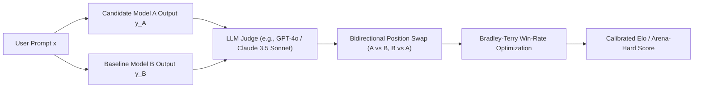

# LLM-as-a-Judge Calibration, Bradley-Terry Modeling & Arena-Hard (Li et al., LMSYS 2024)

## 1. The Evaluation Crisis in Frontier LLMs
As language models match or exceed human benchmark baselines on static multiple-choice evaluations (MMLU, GSM8K, ARC), these benchmarks suffer from severe **ceiling saturation** and **data contamination**. In response, the field transitioned to open-ended conversational evaluation using human preference crowdsourcing (e.g., LMSYS Chatbot Arena) and automated **LLM-as-a-Judge** scoring.
However, using LLMs as automated judges introduces severe statistical biases and calibration challenges that confound evaluation validity.

---

## 2. Statistical Foundation: The Bradley-Terry Preference Model

Pairwise comparisons between candidate model $A$ and baseline model $B$ on prompt $x$ are formalized under the **Bradley-Terry (BT) model**:

### 2.1 Latent Skill Formulation
Each model $i \in \{1, \dots, N\}$ possesses a latent skill rating $r_i \in \mathbb{R}$. In a pairwise match between model $i$ and model $j$, the probability that model $i$ wins ($i \succ j$) is given by the logistic sigmoid of their latent rating difference:
$$P(i \succ j) = \sigma(r_i - r_j) = \frac{1}{1 + e^{-(r_i - r_j)}} = \frac{e^{r_i}}{e^{r_i} + e^{r_j}}$$

### 2.2 Maximum Likelihood Estimation & Ties
Given empirical win-loss counts $W_{ij}$ (number of times model $i$ beat model $j$) and ties $T_{ij}$, the parameters $\mathbf{r} = (r_1, \dots, r_N)$ are estimated by maximizing the log-likelihood:
$$\mathcal{L}(\mathbf{r}) = \sum_{i < j} \left[ W_{ij} \ln \sigma(r_i - r_j) + W_{ji} \ln \sigma(r_j - r_i) + T_{ij} \ln \left( \sqrt{\sigma(r_i - r_j) \sigma(r_j - r_i)} \right) \right]$$

---

## 3. Systematic Biases in LLM Judges & Mathematical Mitigations

Lianmin Zheng et al. (*Judging LLM-as-a-Judge*, NeurIPS 2023) and Tianle Li et al. (*Arena-Hard*, arXiv:2406.11939) identify four primary failure modes of LLM evaluators:

### 3.1 Position Bias (First-Token Primacy & Recency Bias)
- **Pathology:** Judges exhibit a statistically significant bias toward whichever candidate response is presented first (Position 1) or second (Position 2), causing up to $15\%\text{--}25\%$ win-rate swings purely from order permutation.
- **Mitigation (Bidirectional Swap):** For every evaluation pair $(y_A, y_B)$, query the judge twice with swapped orders:
  $$S(A, B) = \frac{1}{2} \left[ \mathbb{I}(\text{Judge}(y_A, y_B) = A) + \mathbb{I}(\text{Judge}(y_B, y_A) = A) \right]$$
  If the judge outputs $A \succ B$ in prompt 1 but $B \succ A$ in prompt 2, the match is scored as an inconclusive tie ($S = 0.5$), effectively eliminating position bias.

### 3.2 Verbosity Bias (Length Confounding)
- **Pathology:** LLM judges systematically favor longer, verbose responses that employ Markdown lists, excessive pleasantries, and expanded verbiage, even when shorter responses are factually superior and more concise.
- **Mitigation (Length-Controlled Bradley-Terry):** Augment the Bradley-Terry regression model with an explicit length difference penalty:
  $$P(i \succ j) = \sigma\left( (r_i - r_j) + \beta \cdot \left( \text{len}(y_i) - \text{len}(y_j) \right) \right)$$
  where $\beta$ is estimated jointly via maximum likelihood. Subtracting $\beta \cdot \Delta \text{len}$ isolates the true semantic capability score $r_i$ from token bloat.

### 3.3 Self-Enhancement / Egocentric Bias
- **Pathology:** Models systematically favor responses generated by themselves or models sharing their architectural family (e.g., GPT-4 judging GPT-4 higher than Claude 3.5 Sonnet by $+10\%$ relative to human consensus).
- **Mitigation (Mixture of Judges, MoJ):** Form an evaluation ensemble spanning diverse, mutually independent model providers (e.g., OpenAI GPT-4o, Anthropic Claude 3.5 Sonnet, Google Gemini 1.5 Pro, Meta LLaMA-3.1-405B). Aggregate decisions via majority voting or weighted consensus:
  $$J_{\text{MoJ}}(A, B) = \text{sign}\left( \sum_{m=1}^M w_m \cdot J_m(A, B) \right)$$

---

## 4. The Arena-Hard Pipeline & BenchBuilder (LMSYS 2024)

### 4.1 Transition from MT-Bench to Arena-Hard
Earlier automated benchmarks (e.g., MT-Bench, 80 multi-turn prompts) saturated quickly: modern frontier models all scored between $8.8\text{--}9.2 / 10$, collapsing model separability.
Tianle Li et al. (arXiv:2406.11939) developed **Arena-Hard-Auto** by extracting 500 challenging prompts from 200,000+ real-world user interactions in the live Chatbot Arena:
- **BenchBuilder Filtering:** Selects prompts that maximize **separability** (distinguishing top-tier models from mid-tier models) and **prompt diversity** across technical domains (programming, mathematics, advanced reasoning).

### 4.2 Linear-Complexity Baseline Matching
Rather than executing an $\mathcal{O}(N^2)$ all-pairs round-robin tournament across $N$ models, Arena-Hard compares all candidate models against a single fixed anchor model (e.g., `gpt-4-0314`):
$$\mathcal{O}(N) \text{ comparisons}$$
- **Win-Rate Metric:**
  $$\text{Score}_{\text{Arena-Hard}}(M) = \frac{\text{Wins against Baseline} + 0.5 \cdot \text{Ties}}{\text{Total Matches}} \times 100$$
- **Human Correlation:** Achieves an extraordinary **$89\%\text{--}98\%$ correlation** (Pearson and Spearman) with human crowdsourced Chatbot Arena Elo ratings, while reducing evaluation cost to $\sim \$25$ per model.

---

## 5. Engineering Guidelines for Production LLM-as-a-Judge
1. **Always Enforce Position Swapping:** Never accept a single un-permuted pairwise judgment.
2. **Use Structured CoT Rubrics:** Force the judge to output step-by-step scoring reasoning before emitting the final preference tag (`<reasoning> ... </reasoning> <verdict>[[A]]</verdict>`).
3. **Anchor with Ground-Truth References:** For factual or coding queries, pass the gold-standard answer in the judge system prompt to eliminate judge hallucination.
4. **Calibrate Against Length:** Monitor average output length of candidate models; if length increases without Elo gains, penalize verbosity explicitly.
