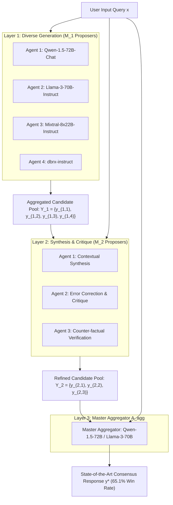

# Mixture-of-Agents & Layered Multi-Agent Collective Intelligence (Wang et al., Together AI 2024)

## 1. Executive Summary & Multi-Agent Scaling Paradigm

Frontier language model development has traditionally relied on pretraining scaling: multiplying parameters ($10\times$) and pretraining tokens ($10\times$). However, as compute limits and data depletion constrain pretraining returns, inference-time collective intelligence presents an orthogonal scaling vector.

Junlin Wang, Jue Wang, Ben Athiwaratkun, Ce Zhang, and James Zou (*Mixture-of-Agents Enhances Large Language Model Capabilities*, Together AI, Duke, UChicago, Stanford, June 2024 / arXiv:2406.04692) introduce **Mixture-of-Agents (MoA)**, a framework that harnesses the collective reasoning of diverse language models. MoA demonstrates that open-source models organized in layered collaborative topologies can consistently outperform the most powerful monolithic closed models (including GPT-4 Omni) across rigorous human-aligned benchmarks.

---

## 2. The LLM Collaborativeness Phenomenon

A foundational empirical finding identified by Wang et al. is the **LLM Collaborativeness Phenomenon**:
> *An LLM generates significantly higher-quality outputs when provided with candidate responses from other models—even if those auxiliary models have strictly lower individual capability or lower benchmark rankings than the evaluating model itself.*

### 2.1 Theoretical Explanation: Orthogonal Inductive Biases
When a single monolithic model $\pi_1$ attempts to answer complex query $x$, its output is biased by its pretraining corpus, tokenization boundaries, and post-training RLHF reward priors:
$$y_1 = \mu(x) + \epsilon_1(x)$$
where $\mu(x)$ is the underlying factual response and $\epsilon_1(x)$ represents idiosyncratic model hallucinations and reasoning blind spots.

If $M$ heterogeneous models $\{\pi_1, \pi_2, \dots, \pi_M\}$ derived from distinct model families (e.g., Llama, Qwen, Mistral) answer query $x$:
1. **Factual Reinforcement:** The shared factual truth $\mu(x)$ is invariant across training distributions, creating a strong harmonic consensus across proposals:
   $$\mathbb{E}_i[y_i(x)] \approx \mu(x)$$
2. **Noise Orthogonality:** Because the pretraining datasets, tokenizers, and architectures differ, their errors are largely uncorrelated:
   $$\operatorname{Cov}(\epsilon_i, \epsilon_j) \approx 0 \quad \text{for } i \neq j$$
3. **Low-Cost Fact Verification:** Evaluating whether an assertion is accurate given multiple reference viewpoints requires strictly less cognitive compute than generating a complete, novel proof from scratch.

---

## 3. Mathematical Topology of Layered Mixture-of-Agents

MoA structures multi-agent collaboration as a feedforward Directed Acyclic Graph (DAG) consisting of $L$ sequential layers.

### 3.1 Formal Forward Equations
Let $x$ denote the user instruction prompt. Each layer $l \in \{1, \dots, L\}$ consists of $M_l$ proposer agents $\mathcal{A}_l = \{A_{l, 1}, A_{l, 2}, \dots, A_{l, M_l}\}$:

1. **Input Layer ($l=1$):** Each proposer generates an independent candidate response:
   $$y_{1, i} \sim A_{1, i}(\cdot \mid x), \quad \forall i \in \{1, \dots, M_1\}$$
   The layer outputs candidate set $\mathcal{Y}_1 = \{y_{1, 1}, y_{1, 2}, \dots, y_{1, M_1}\}$.

2. **Intermediate Layers ($l \in \{2, \dots, L-1\}$):**
   Each proposer $A_{l, i}$ is provided with the original query $x$ along with the full ensemble of responses from layer $l-1$:
   $$y_{l, i} \sim A_{l, i}\left(\cdot \;\middle|\; \Phi\left(x, \mathcal{Y}_{l-1}\right)\right)$$
   where $\Phi(x, \mathcal{Y}_{l-1})$ is a structured context serialization template:
   $$\Phi(x, \mathcal{Y}) = \left[ \text{"User Query: "} x, \quad \left\{ \text{"Candidate Response "} j \text{:" } y_j \right\}_{j=1}^{|\mathcal{Y}|}, \quad \text{"Instruction: Synthesize, correct errors, and improve."} \right]$$

3. **Master Aggregator ($l=L$):**
   A designated high-capacity aggregator model $A_{\text{agg}}$ ingests the final candidate pool $\mathcal{Y}_{L-1}$ to synthesize the terminal answer:
   $$y^* \sim A_{\text{agg}}\left(\cdot \;\middle|\; \Phi\left(x, \mathcal{Y}_{L-1}\right)\right)$$

### 3.2 Proposer vs. Aggregator Role Specialization
- **Proposers ($A_{l, i}$):** Value is driven by **diversity**. Proposers can be smaller, faster models (e.g., Qwen-1.5-14B, Mixtral-8x7B) that supply varied perspectives, novel examples, and diverse structural angles.
- **Aggregator ($A_{\text{agg}}$):** Value is driven by **instruction following and critical synthesis capability**. The aggregator must possess strong evaluative attention to filter hallucinations, reconcile contradictions, and generate a cohesive narrative.

---

## 4. Empirical Evaluation & Benchmark Breakthroughs

Wang et al. evaluated MoA across premier conversational, general reasoning, and factuality benchmarks.

### 4.1 AlpacaEval 2.0 (Length-Controlled Win Rate vs. GPT-4 Turbo)

| Model Topology | Models Used | AlpacaEval 2.0 LC Win Rate (%) |
| :--- | :--- | :---: |
| **GPT-4 Omni (May 2024)** | Proprietary monolithic | $57.5\%$ |
| **Llama-3-70B-Instruct** | Single model baseline | $48.3\%$ |
| **Qwen-1.5-72B-Chat** | Single model baseline | $47.2\%$ |
| **Mixtral-8x22B-Instruct** | Single model baseline | $45.1\%$ |
| **MoA (Homogeneous, L=3)** | $3 \times$ Llama-3-70B-Instruct | $58.2\%$ |
| **MoA (Heterogeneous, L=3)** | Qwen-72B, Llama-3-70B, Mixtral-8x22B, dbrx | **$65.1\%$** |

> [!IMPORTANT]
> Heterogeneous MoA achieves **$65.1\%$**, establishing a massive **$+16.8\%$ absolute gain** over single-model Llama-3-70B and outperforming closed GPT-4 Omni ($57.5\%$) by **$+7.6\%$ absolute**, despite using exclusively open-source weights.

### 4.2 MT-Bench & FLASK Fine-Grained Dimensions
Across MT-Bench, MoA lifts scores from $8.95$ to **$9.24$**.
On FLASK, MoA exhibits outsized gains across:
- **Logical Robustness ($+24.1\%$):** Synthesis layers actively identify and eliminate mathematical and logical contradictions.
- **Factuality ($+18.7\%$):** Multi-model consensus suppresses hallucinations; facts present in only one model's response without corroboration are heavily down-weighted by the aggregator.
- **Completeness ($+28.3\%$):** Diverse proposers introduce orthogonal facets of the problem that a single model typically overlooks.

---

## 5. Architectural Dynamics & Ablation Studies

### 5.1 Layer Depth ($L$) vs. Model Count ($M$)
- **Layer Scaling ($L=1 \to 4$):**
  - $L=1$ (Single-layer voting): $52.4\%$
  - $L=2$ (One refinement layer): $61.8\%$ ($+9.4\%$ jump)
  - $L=3$ (Two refinement layers): **$65.1\%$** (Optimal)
  - $L=4$ (Three refinement layers): $65.3\%$ (Plateau, marginal return with added latency)
- **Agent Count Scaling ($M$ per layer):**
  Increasing proposers from $M=2 \to 6$ steadily improves diversity and synthesis quality. Beyond $M=6$, context length grows excessively, degrading aggregator attention fidelity without proportional accuracy gains.

### 5.2 Heterogeneity vs. Homogeneity
Running multiple instances of the same model (e.g., 6 instances of Llama-3-70B at different temperatures) yields $58.2\%$. Swapping in distinct architectures (Qwen + Llama + Mixtral + DBRX) delivers **$65.1\%$** ($+6.9\%$ boost). Heterogeneity in training distribution is the single most critical driver of MoA performance.

---

## 6. Serving Systems, Latency & KV Cache Optimization

While MoA delivers superior quality, multi-layer multi-agent inference increases token generation volume. Production deployments optimize MoA through specialized inference mechanics:

1. **Prefix KV Cache Sharing (RadixAttention):**
   In Layer 1, all $M_1$ agents process the exact same user query $x$. Systems using SGLang or vLLM execute this with zero redundant prefill compute via shared Radix prefix caching.
2. **Asynchronous Parallel Pipelining:**
   Agents within layer $l$ execute concurrently across distributed GPU worker nodes. Layer $l+1$ begins generation as soon as all $M_l$ candidate responses are streamed into the shared aggregator context buffer.
3. **Speculative Candidate Pruning:**
   If a fast, lightweight verifier detects that two candidate responses in Layer 1 are semantically redundant (cosine similarity of embedding $>0.92$), one is pruned before feeding into Layer 2, saving KV cache memory and aggregator context window space.

---

## 7. Directives for Prompt Engineering Mastery Vault

- Cross-Reference: [[mixture_of_agents_collaborative_swarms]], [[multi_agent_debate_consensus_elo]], [[test_time_compute_optimal_scaling]].
- Skill Codification: Equip autonomous agents with `mixture-of-agents-architect` to orchestrate heterogeneous agent pools with automated context deduplication and aggregator synthesis.
