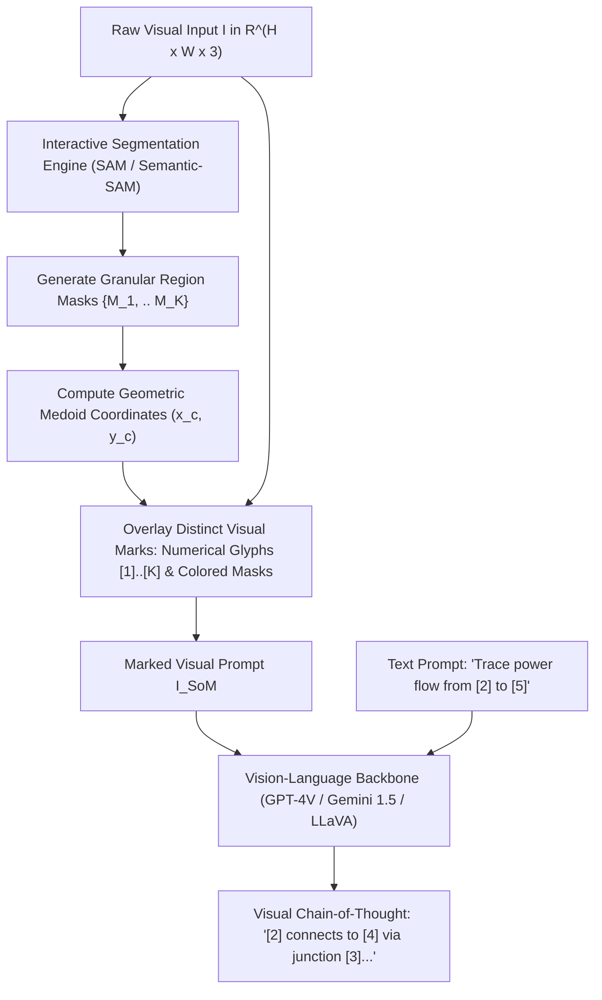
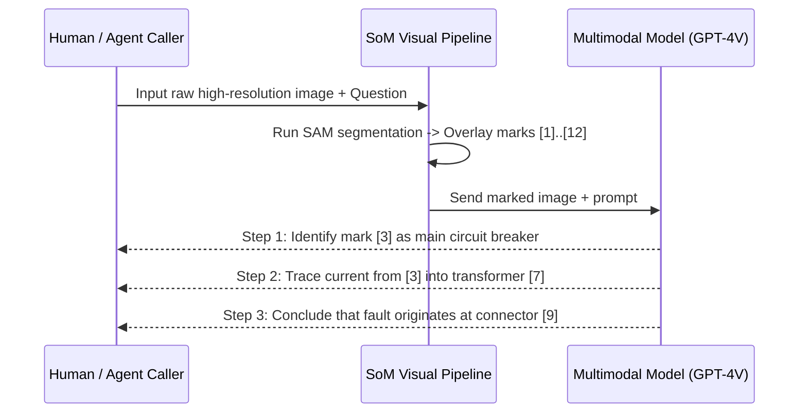

# Multimodal Visual Grounding, Set-of-Mark Prompting & Spatial Chain-of-Thought (Yang et al., CVPR 2024)

## 1. The Spatial Localization Dilemma in Vision-Language Models
Frontier Large Multimodal Models (LMMs)—such as GPT-4V, Gemini 1.5 Pro, Claude 3.5 Sonnet, and LLaVA-NeXT—have achieved near-human proficiency on holistic image captioning, high-level visual question answering, and document comprehension. However, across complex scientific, medical, and robotics tasks, these models encounter a severe architectural bottleneck: **fine-grained spatial grounding and visual referring expression comprehension**.

When prompted to locate objects via normalized bounding box coordinates:
$$\mathbf{b} = \left[ y_{\min}, x_{\min}, y_{\max}, x_{\max} \right] \in [0, 1000]^4$$
models exhibit severe coordinate hallucination ($>40\%$ error rates on RefCOCOg). This failure stems from three fundamental architectural misalignments:
1. **Patch Quantization Loss:** Vision transformers (ViT, CLIP, SigLIP) tokenize images into coarse $14\times 14$ or $16\times 16$ pixel patches, discarding precise sub-patch boundary contours.
2. **Text-Tokenizer Spatial Ignorance:** Byte-Pair Encoding (BPE) subword tokenizers treat coordinate strings (`"342"`, `"891"`) as discrete categorical tokens without continuous numerical or geometric priors.
3. **Cross-Attention Dispersion:** Intermediate cross-attention heads disperse probability mass broadly across semantic concepts rather than focusing on spatial edges.

---

## 2. The Set-of-Mark (SoM) Visual Prompting Architecture

Jianwei Yang, Hao Zhang, Feng Li, Xueyan Zou, Chunyuan Li, and Jianfeng Gao (*Set-of-Mark Prompting Unleashes Extraordinary Visual Grounding in GPT-4V*, Microsoft / CVPR 2024 / arXiv:2310.11441) bypass coordinate regression entirely by transmuting continuous spatial reasoning into discrete symbolic reference reasoning.

### 2.1 The Two-Stage Segmentation & Marking Protocol
The SoM pipeline operates upstream of the multimodal model without altering its parameter weights:

1. **Segment Candidate Extraction:**
   An off-the-shelf interactive visual foundation model (Segment Anything Model - SAM, or SEEM) generates candidate region masks:
   $$\mathcal{M} = \left\{ M_1, M_2, \dots, M_K \right\}, \quad M_k \in \{0, 1\}^{H \times W}$$
   Semantic granularity can be modulated across three levels:
   - *Semantic Level:* High-level objects (e.g., entire engine assembly).
   - *Instance Level:* Distinct physical components (e.g., alternator, belt, pulley).
   - *Part Level:* Sub-component surfaces and connectors (e.g., bolt heads, wire terminals).

2. **Visual Mark Superimposition:**
   For each mask $M_k$, compute its centroid or medoid:
   $$c_k = \left( \frac{1}{|M_k|} \sum_{(x, y) \in M_k} x, \quad \frac{1}{|M_k|} \sum_{(x, y) \in M_k} y \right)$$
   Render an alphanumeric tag $g_k = [k]$ surrounded by an opaque, high-contrast bounding circle or polygon boundary:
   $$I_{\text{marked}}(x, y) = \begin{cases} \text{Glyph}(g_k) & \text{if } (x, y) \in \text{Region}(c_k) \\ \alpha I(x, y) + (1-\alpha) \text{Color}(k) & \text{if } (x, y) \in M_k \\ I(x, y) & \text{otherwise} \end{cases}$$
   where $\alpha \in [0.4, 0.7]$ provides transparent color tinting.

---

## 3. Visual Chain-of-Thought (Visual CoT) & Stepwise Grounding

With visual marks embedded directly into the pixel space, the multimodal model's generation process transitions from myopic single-step prediction to **Visual Chain-of-Thought (Visual CoT)**:

### 3.1 Spatial Trajectory Reasoning
In complex navigational and mechanistic tasks, the model formulates step-by-step reasoning paths using sequence operators:
$$\mathcal{T}_{\text{Visual-CoT}} = \left( [k_1] \xrightarrow{\mathcal{R}_1} [k_2] \xrightarrow{\mathcal{R}_2} \dots \xrightarrow{\mathcal{R}_{N-1}} [k_N] \right)$$
where each $\mathcal{R}_i \in \{\text{adjacent}, \text{contains}, \text{connected\_to}, \text{occludes}\}$ represents an explicit spatial or topological relation.

### 3.2 Elimination of Coordinate Quantization Error
In coordinate-based prompting, a 1% error in normalized coordinates can cause a bounding box to shift completely off target in high-resolution $4\text{K}$ images. Under SoM, each mark $[k]$ is a discrete, unambiguous categorical token. The model only needs to classify which visual mark answers the query, transforming an ill-posed regression problem into a well-conditioned classification task.

---

## 4. Empirical Benchmarks & Performance Metrics

| Benchmark Task | Baseline Model | Baseline Prompting (Coordinates) | GPT-4V + Set-of-Mark (SoM) | Supervised Task-Specific SOTA |
| :--- | :--- | :--- | :--- | :--- |
| **RefCOCOg (Referring Expression Comprehension)** | GPT-4V | $64.2\%$ Acc | **$84.2\%$ Acc** | $82.5\%$ (G-DINO + SAM) |
| **RefCOCO+ (Spatial Referring Expression)** | GPT-4V | $58.1\%$ Acc | **$81.9\%$ Acc** | $80.2\%$ (UNINEXT) |
| **Flickr30k Entities (Phrase Grounding)** | GPT-4V | $67.4\%$ Recall | **$89.3\%$ Recall** | $87.8\%$ (MDETR) |
| **Visual Tool Use / Web UI Navigation** | GPT-4V | $43.2\%$ Success | **$79.8\%$ Success** | $65.4\%$ (Mind2Web) |

- **Zero-Shot Superiority:** Zero-shot GPT-4V with SoM outperforms supervised models specifically trained for hundreds of GPU hours on RefCOCOg, demonstrating that prompt engineering on visual representations can unlock latent capabilities superior to specialized fine-tuning.
- **Web UI & OS Automation:** In agentic workflows (e.g., WebArena, Mind2Web), SoM marks interactive DOM elements (buttons, inputs, links) with unique visual IDs, allowing agents to issue click actions (`click([4])`) with near-perfect spatial precision.

---

## 5. Architectural Directives for Autonomous Multimodal Systems
When constructing production vision-language pipelines:
1. **Never ask frontier LMMs for raw floating-point bounding boxes.** Use interactive segmentation (SAM) to overlay visual glyphs before inference.
2. **Employ Part-Level Granularity on Dense Schematics:** Tune SAM stability thresholds ($\text{iou\_threshold} \ge 0.88$, $\text{stability\_score} \ge 0.95$) to avoid cluttering images with $>50$ overlapping marks.
3. **Enforce Visual Chain-of-Thought in System Prompts:** Direct the model to cite the relevant numbered marks before generating final answers, grounding intermediate reasoning steps in verifiable visual evidence.
