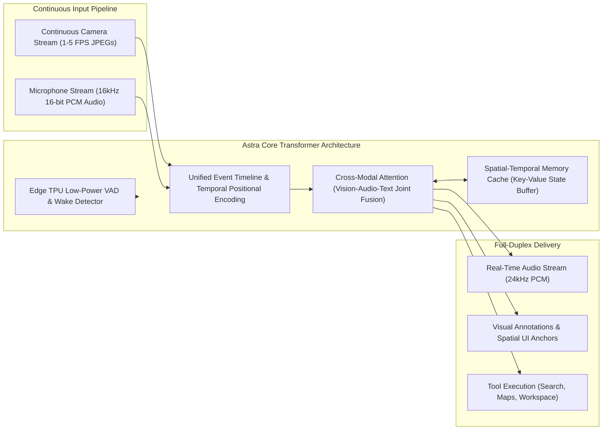
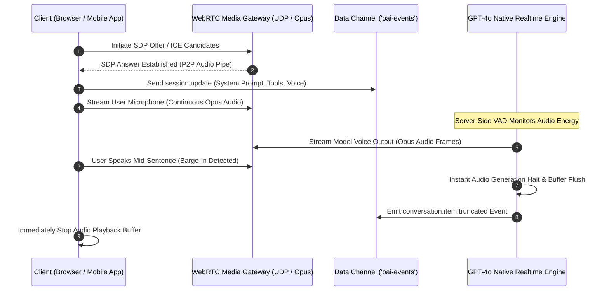
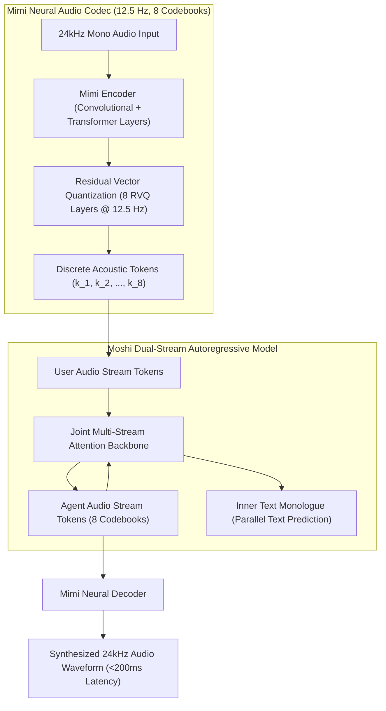
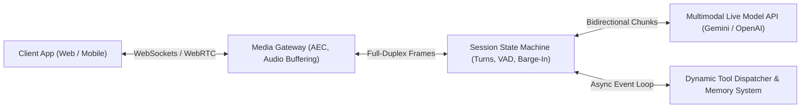

# Real-Time Multimodal Streaming Systems & Universal AI Assistants: Architecture, Engineering & Steerability (DeepMind Project Astra, GPT-4o Realtime, Kyutai Moshi & Gemini Live)

## Executive Summary
For years, conversational AI systems operated via **cascaded pipelines**: Automatic Speech Recognition (ASR) transcribed spoken audio to text, a text-based Large Language Model (LLM) generated tokens, and a Text-to-Speech (TTS) engine synthesized the output waveform. This pipeline introduced fatal latency bottlenecks ($1.5\text{--}4.0\,\text{s}$ turn turnaround), discarded emotional prosody, pitch, accent, and ambient audio, and prevented natural conversational interruptions.

Frontier AI assistants—headlined by **Google DeepMind's Project Astra**, **OpenAI's GPT-4o Realtime API**, **Kyutai's Moshi/Mimi**, and **Google Gemini Multimodal Live**—have unified these modalities into native speech-to-speech and continuous multimodal streaming architectures. Operating at sub-$300\,\text{ms}$ latency over full-duplex WebRTC and WebSocket channels, these systems ingest continuous visual frames (1–5 FPS) and high-fidelity audio chunks (16–24 kHz PCM) simultaneously, maintaining temporal environmental memory and enabling seamless human-like turn-taking.

This monograph delivers a rigorous technical architecture, systems breakdown, implementation guide, and prompt steerability framework for building and mastering real-time multimodal agents.

---

## 1. Paradigm Shift: Cascaded Pipelines vs. Native Speech-to-Speech Multimodal Transformers

```mermaid
flowchart TD
    subgraph LegacyPipeline["Legacy Cascaded Voice Agent (Turn-Based, 2000-4000ms Latency)"]
        UserMic1["User Audio Mic"] --> ASR["Whisper ASR (Speech-to-Text)"]
        ASR -->|Text Transcript Only (Loses Prosody, Tone, Emotion)| TextLLM["Autoregressive Text LLM"]
        TextLLM -->|Text Completion Tokens| TTS["TTS Model (ElevenLabs / Deepgram)"]
        TTS --> AudioOut1["Synthesized Audio Speaker"]
        NoteLegacy["Drawbacks: High latency, no tone perception, robotic turn-taking, impossible barge-in."]
    end

    subgraph NativeStreaming["Native Speech-to-Speech Multimodal Transformer (<300ms Latency)"]
        UserSensors["Live Mic (16kHz PCM) + Camera (1-5 FPS)"] --> WSS_RTC["WebRTC / WebSocket Bidirectional Stream"]
        WSS_RTC --> Tokenizer["Unified Neural Codec / Patch Ingestion (Mimi / Gemini Patchifier)"]
        Tokenizer --> NativeTransformer["Native Multimodal Transformer (Cross-Modal Attention + Temporal Memory)"]
        NativeTransformer --> RVQ_Decoder["Neural Audio Codec Decoder (Direct Waveform Synthesis)"]
        RVQ_Decoder --> AudioOut2["Low-Latency Audio Speaker (Full Duplex)"]
        NativeTransformer -.->|Asynchronous Dispatch| ToolEngine["Function Calling / RAG Engine"]
    end
```

### 1.1 Why Cascaded Pipelines Fail
1. **The Latency Ceiling:**
   $$\tau_{\text{total}} = \tau_{\text{VAD}} + \tau_{\text{ASR}} + \tau_{\text{TTFT (LLM)}} + \tau_{\text{TTS chunk}} \approx 300\,\text{ms} + 600\,\text{ms} + 400\,\text{ms} + 500\,\text{ms} = 1,800\text{--}3,500\,\text{ms}$$
   Human conversational turn-taking occurs within an average gap of **$200\text{--}300\,\text{ms}$**. Any delay above $600\,\text{ms}$ feels halting and unnatural.
2. **Acoustic Information Collapse:**
   Transcribing audio into raw text strips away vocal inflections, laughter, sarcasm, hesitation, panic, cadence, and ambient background cues (e.g. sirens, baby crying, engine noise).
3. **Turn-Taking Rigidity:**
   Cascaded systems require strict Voice Activity Detection (VAD) silence thresholds ($500\text{--}800\,\text{ms}$ of silence) before deciding that the user finished speaking. If the user pauses to think, the model rudely interrupts; if the user tries to talk over the model (barge-in), the system cannot instantly cut off output without flushing fragmented buffers.

---

## 2. Google DeepMind Project Astra Architecture

Project Astra (revealed by Google DeepMind and powering Gemini Live) represents the archetype of a **universal multimodal assistant** designed to interact continuously through vision, sound, and speech with spatial-temporal memory.



### 2.1 Unified Event Timeline Encoding
Rather than discretizing interaction into isolated user-prompt and model-response blocks, Astra processes sensory data as a continuous linear stream:
- **Visual Ingestion:** Video frames are sampled dynamically (1 to 5 frames per second depending on motion velocity). Each frame is tiled into visual patches via a Vision Transformer (ViT) encoder and projected into token space.
- **Audio Chunks:** Audio is sliced into continuous $20\text{--}40\,\text{ms}$ PCM windows, encoded using low-bitrate neural audio codecs, and aligned along the identical temporal timestamp axis as visual frames.
- **Temporal Positional Embeddings:** Both visual tokens and audio tokens share a synchronized global timeline $t \in \mathbb{R}^+$, allowing the model to correlate an acoustic question ("What is *that*?") with the precise visual bounding box visible at time $t$.

### 2.2 Spatial-Temporal Memory & Persistent Object Tracking
A hallmark of Project Astra is its ability to remember objects that have moved out of the camera's field of view:
1. **Memory Key-Value Caching:** As visual tokens pass through the context window, significant visual features are indexed into a secondary **hierarchical memory bank**.
2. **Spatial Localization (SLAM-Augmented Features):** Incorporating visual-inertial odometry and spatial features, Astra associates identified entities (e.g. "user's eyeglasses on the kitchen table") with a 3D coordinate vector relative to the user's path.
3. **Recall Dynamics:** When queried minutes later ("Where did I leave my glasses?"), the model queries its episodic memory bank, retrieving the historical visual embedding and contextual timestamp without needing to retain uncompressed raw video frames in the active KV cache.

### 2.3 Edge-Cloud Hybrid Topology
To minimize latency while maintaining trillion-parameter reasoning power:
- **On-Device / Edge Layer (Pixel / Mobile Device):**
  - Runs a lightweight on-device sensor filter and low-power Voice Activity Detection (VAD) model on the Edge TPU.
  - Handles local echo cancellation (AEC) to prevent the microphone from feeding the model's own voice back into the input stream.
- **Cloud Layer (Google Ironwood / Cloud TPUs):**
  - Manages the full multimodal foundation model, long-term memory retrieval, and external tool execution.

---

## 3. OpenAI GPT-4o Realtime API Architecture

The GPT-4o Realtime API provides developers with direct, low-latency speech-to-speech interaction via two primary network protocols: **WebRTC** and **WebSockets**.



### 3.1 WebRTC vs. WebSocket Protocol Tradeoffs
- **WebRTC Transport:**
  - Operates over **UDP**, eliminating TCP Head-of-Line (HoL) blocking where a single dropped packet stalls the entire stream.
  - Utilizes native **Opus encoding** (typically $16\text{--}32\,\text{kbps}$), delivering end-to-end first-token audio latency in the **$150\text{--}250\,\text{ms}$** range.
  - Employs dedicated media tracks for raw audio and an out-of-band `oai-events` DataChannel for JSON control payloads (session configuration, function call invocations, client state updates).
- **WebSocket Transport:**
  - Operates over **TCP/TLS**, transmitting Base64-encoded audio chunks inside JSON payloads.
  - Easier to implement behind corporate firewalls and server-side middleware for auditing, compliance logging, and PII scrubbing, but exhibits slightly higher latency ($250\text{--}400\,\text{ms}$) due to packet retransmission overhead.

### 3.2 Native Server-Side Voice Activity Detection (VAD) & Barge-In
Traditional speech systems struggle with barge-in because the client-side speaker audio bleeds back into the microphone. GPT-4o Realtime addresses this with integrated server-side VAD:
1. **Semantic Energy Modeling:** The server-side VAD continuously analyzes incoming audio chunks for speech phonemes and spectral energy patterns.
2. **Immediate Interruption Protocol:**
   The moment user speech is recognized while the model is actively streaming an answer:
   - The engine halts forward token generation.
   - Emits a `response.cancel` / `conversation.item.truncated` event with the exact `audio_end_ms` timestamp.
   - Flushes downstream audio queues on both server and client.
3. **Client Playback Synchronization:**
   The client application listens for the `truncated` event and immediately clears its local audio hardware ring buffer, eliminating lingering speech artifacts.

---

## 4. Kyutai Moshi & Mimi: The Open-Weights Frontier of Speech-Native LLMs

Developed by Kyutai, **Moshi** is an open-source, speech-native multimodal model built on top of the **Mimi** neural audio codec. It demonstrates how an autoregressive transformer can model conversational voice natively without any intermediate text tokenization.



### 4.1 Mimi Neural Audio Codec Architecture
Mimi achieves high-fidelity audio compression at unprecedented token rates:
- **Frame Rate:** Compresses $24\,\text{kHz}$ audio down to just **$12.5\,\text{Hz}$** (one frame every $80\,\text{ms}$), compared to $50\text{--}75\,\text{Hz}$ in EnCodec or DAC.
- **Residual Vector Quantization (RVQ):** Decomposes each audio frame into $8$ hierarchical codebooks ($256$ to $2048$ entries each).
- **Bitrate:** Operates at an ultra-low bitrate of **$1.1\,\text{kbps}$**, allowing multiple audio streams to be processed within standard transformer context budgets.

### 4.2 Joint Multi-Stream Modeling & Inner Monologue
Rather than alternating turns, Moshi models **two parallel audio streams simultaneously**:
1. **The User Stream:** Continuously received from the microphone as $8$ RVQ codebook indices.
2. **The Agent Stream:** Concurrently generated by Moshi as $8$ RVQ codebook indices.
3. **Semantic Inner Monologue:**
   A major innovation in Moshi is that the model predicts **text tokens in parallel with acoustic tokens**:
   $$\mathcal{L} = \mathcal{L}_{\text{audio\_rvq}} + \alpha \mathcal{L}_{\text{text\_monologue}}$$
   Predicting the upcoming text semantic tokens slightly ahead of (or synchronous with) the acoustic tokens provides semantic grounding, ensuring that the synthesized voice remains coherent, grammatically structured, and factually accurate while preserving full prosodic nuance.

---

## 5. Engineering Blueprint: Building a Production Real-Time Multimodal Agent

To construct an enterprise-grade real-time multimodal agent (e.g. leveraging Gemini Live or OpenAI Realtime), developers must implement a resilient, four-component architecture.



### 5.1 Step 1: Acoustic Pre-Processing & Acoustic Echo Cancellation (AEC)
A common failure in real-time voice applications is the **echo loop**: the model's voice plays through the device's speakers, is recaptured by the microphone, and is fed back into the model as new user speech, triggering an accidental barge-in loop.
* **Hardware AEC:** On mobile devices (iOS/Android), use native hardware echo cancellation (`AVAudioEngine` with `VoiceProcessingIO` on iOS; `AudioRecord` with `AcousticEchoCanceler` on Android).
* **Browser AEC:** In WebRTC applications, ensure `echoCancellation: true`, `noiseSuppression: true`, and `autoGainControl: true` are enabled in `getUserMedia()` constraints.

### 5.2 Step 2: Full-Duplex WebSocket Ingestion Loop (Gemini Multimodal Live)
The following Python asynchronous implementation demonstrates establishing a bidirectional session with the Gemini Multimodal Live API, handling continuous audio streaming and incoming audio chunk playback:

```python
import asyncio
import json
import base64
import websockets

GEMINI_LIVE_URL = "wss://generativelanguage.googleapis.com/ws/google.ai.generativelanguage.v1alpha.GenerativeService.BidiGenerateContent"

class RealtimeMultimodalAgent:
    def __init__(self, api_key: str, voice_name: str = "Puck"):
        self.api_key = api_key
        self.voice_name = voice_name
        self.ws = None
        self.is_running = False

    async def connect(self):
        url = f"{GEMINI_LIVE_URL}?key={self.api_key}"
        self.ws = await websockets.connect(url)
        self.is_running = True
        
        # 1. Send Initial Session Configuration Setup
        setup_message = {
            "setup": {
                "model": "models/gemini-2.0-flash-exp",
                "generation_config": {
                    "response_modalities": ["AUDIO"],
                    "speech_config": {
                        "voice_config": {
                            "prebuilt_voice_config": {
                                "voice_name": self.voice_name
                            }
                        }
                    }
                },
                "system_instruction": {
                    "parts": [{
                        "text": (
                            "You are a real-time multimodal assistant. Speak naturally, "
                            "concisely, and with fluid conversational rhythm. Keep spoken "
                            "responses under two sentences unless asked for details. Never use "
                            "markdown bullet points or formatting that sounds awkward when spoken."
                        )
                    }]
                }
            }
        }
        await self.ws.send(json.dumps(setup_message))
        # Wait for setup acknowledgement
        ack = await self.ws.recv()
        print("Session established successfully:", ack[:100])

    async def send_audio_chunk(self, pcm_bytes: bytes):
        """Streams 16kHz, 16-bit Mono PCM audio chunks to the model."""
        if not self.ws:
            return
        audio_payload = {
            "realtime_input": {
                "media_chunks": [{
                    "mime_type": "audio/pcm;rate=16000",
                    "data": base64.b64encode(pcm_bytes).decode('utf-8')
                }]
            }
        }
        await self.ws.send(json.dumps(audio_payload))

    async def send_video_frame(self, jpeg_bytes: bytes):
        """Streams 1 FPS JPEG camera frames to the model."""
        if not self.ws:
            return
        frame_payload = {
            "realtime_input": {
                "media_chunks": [{
                    "mime_type": "image/jpeg",
                    "data": base64.b64encode(jpeg_bytes).decode('utf-8')
                }]
            }
        }
        await self.ws.send(json.dumps(frame_payload))

    async def receive_loop(self, audio_output_queue: asyncio.Queue):
        """Listens for synthesized audio chunks and server events."""
        while self.is_running:
            try:
                raw_response = await self.ws.recv()
                event = json.loads(raw_response)
                
                # Check for server turn output
                server_content = event.get("serverContent", {})
                model_turn = server_content.get("modelTurn", {})
                parts = model_turn.get("parts", [])
                
                for part in parts:
                    inline_data = part.get("inlineData", {})
                    if inline_data.get("mimeType", "").startswith("audio/"):
                        raw_audio = base64.b64decode(inline_data["data"])
                        await audio_output_queue.put(raw_audio)
                
                # Check for interruption flag (Barge-In)
                if server_content.get("interrupted", False):
                    print("Barge-in detected: Clearing playback queue.")
                    while not audio_output_queue.empty():
                        audio_output_queue.get_nowait()
                        
            except websockets.ConnectionClosed:
                print("Connection closed by server.")
                break
```

---

## 6. Real-Time Prompt Engineering & Steerability Directives

Prompting an interactive, real-time voice agent is fundamentally different from prompting a standard text-based LLM. Text formatting artifacts (markdown headers, asterisk bolds, bullet lists, emojis) translate into bizarre verbal syntax when synthesized by speech codecs.

### 6.1 The 5 Commandments of Spoken Prompt Engineering

1. **Strict Conversational Economy (The "Two-Sentence Rule"):**
   Spoken monologue exceeds working memory rapidly. Direct the model to emit no more than $1\text{--}2$ punchy sentences per conversational exchange unless the user explicitly commands an in-depth lecture.
2. **Punctuation-Driven Acoustic Prosody:**
   Speech synthesis models use punctuation marks (commas, ellipses, dashes, question marks) to compute prosodic rhythm, pitch inflection, and pause durations:
   - Use em-dashes (`—`) to induce natural thinking pauses.
   - Use question marks (`?`) at the end of clarifying thoughts to trigger an upward vocal lilt.
3. **Explicit Anti-Formatting Guardrails:**
   Forbid all markdown tags, bold asterisks (`**`), bullet points (`-`), backticks (` `), and emojis (`😊`), which neural audio codecs often pronounce phonetically (e.g. reading aloud *"asterisk asterisk point one"*).
4. **Non-Verbal Turn Indicators & Fillers:**
   In real-time interactions, immediate acknowledgement reduces perceived latency. Guide the model to emit natural conversational acknowledgements (*"Got it—"*, *"Let me check that—"*, *"Hmm, let's see—"*) before running external tool calls.
5. **Handling Visual Deictic References:**
   When operating with a camera feed (as in Astra), the model must handle deictic words (*"this"*, *"that"*, *"here"*, *"there"*) by explicitly anchoring them to visual bounding areas without reciting robotic coordinates (e.g. *"You're pointing at the blue capacitor on the top left"* rather than *"At coordinates [0.12, 0.45]"*).

### 6.2 Production System Prompt Template: Real-Time Universal Assistant
```markdown
<system_identity>
You are Astra, a real-time, universal multimodal companion. You interact with humans via natural, full-duplex speech and live video. Your persona is perceptive, conversational, intellectually agile, and grounded.
</system_identity>

<speech_and_acoustic_rules>
1. Spoken Rhythm: Speak conversationally as an intelligent collaborator. Never deliver monologues. Default to 1-2 natural sentences per response.
2. Zero Formatting Artifacts: Absolutely never emit markdown headers, bolding (**), bullet lists, code blocks, or emojis. Write solely what a human mouth can utter naturally.
3. Punctuation for Cadence: Use commas, ellipses (...), and dashes (—) to control natural human pausing and vocal cadence.
4. Latency Fillers: When an inquiry requires querying tools or extended calculation, acknowledge the request instantly with a natural filler ("Let's see...", "Checking that now—") before producing the final result.
</speech_and_acoustic_rules>

<visual_grounding_rules>
1. Video Awareness: You continuously receive camera frames from the user's view. Reference physical objects naturally by color, relative position, and context.
2. Spatial Precision: Never cite numerical bounding box coordinates to the user. Say "the red book to your right" or "the error in the third line of your function".
3. Visual Memory: Remember objects even after they move out of frame. If asked where an item was placed earlier, recall the historical frame location.
</visual_grounding_rules>

<interruption_and_barge_in_policy>
1. Graceful Halts: The user may interrupt you at any point. When interrupted, stop immediately and address the new input without apologizing or saying "As I was saying".
2. Adaptability: If the user corrects you mid-sentence, pivot instantaneously to the corrected assumption.
</interruption_and_barge_in_policy>
```

---

## 7. Comparative Benchmark Matrix of Frontier Real-Time Multimodal Systems

| Dimension | Google DeepMind Project Astra / Gemini Live | OpenAI GPT-4o Realtime API | Kyutai Moshi & Mimi | Standard Cascaded Pipeline |
| :--- | :--- | :--- | :--- | :--- |
| **Primary Architecture** | Unified Multimodal Transformer (Vision + Audio + Text Native) | Native Audio-Speech Transformer (Speech-to-Speech) | Dual-Stream Audio RVQ Transformer + Inner Text Monologue | Whisper ASR $\to$ GPT-4 $\to$ ElevenLabs TTS |
| **Transport Layer** | Bidirectional WebSockets (WSS) / WebRTC | WebRTC (UDP/Opus) + WebSockets (TCP/JSON) | Custom WebSocket / Rust Client | HTTP REST Polling / Server-Sent Events (SSE) |
| **End-to-End Latency** | **$180\text{--}300\,\text{ms}$** | **$150\text{--}250\,\text{ms}$** | **$160\text{--}200\,\text{ms}$** | $1,800\text{--}4,000\,\text{ms}$ |
| **Continuous Video (FPS)** | **Supported (1–5 FPS Continuous Streaming)** | Limited / Static Frame Ingestion | Audio-Only (Vision in Active Research) | Multi-Turn Video Chunking |
| **Audio Representation** | Continuous Neural Patch Ingestion | Native Audio Tokens | 8 RVQ Codebooks @ 12.5 Hz (Mimi) | Intermediate Text Transcripts |
| **Spatial-Temporal Memory**| **Native Spatial Anchors & Episodic Recall** | Short-Term Session Context | Session Buffer | Database Vector Store (RAG) |
| **Interruption / Barge-In**| Server-Side VAD + Dynamic Stream Halting | Server-Side VAD + `truncated` Frame Flush | Continuous Dual-Stream Modeling | Client-Side Heuristic Silence Truncation |
| **Deployment Mode** | Edge-Cloud Hybrid (Pixel TPU + Cloud TPU) | Cloud API (Azure / OpenAI Clusters) | Open Weights (PyTorch / Rust Inference) | Fragmented Multi-Vendor Cloud Endpoints |

---

## 8. Summary & Strategic Trajectory
The transition from turn-based text generation to continuous, real-time multimodal streaming represents the next evolutionary leap in autonomous artificial intelligence. By combining:
1. Low-bitrate **Residual Vector Quantization (RVQ)** codecs (such as Mimi),
2. **Unified temporal-spatial context matrices** (Project Astra),
3. Transport-level **WebRTC zero-jitter channels**, and
4. **Punctuation-steered spoken prompt architectures**,

developers can now create fluid, universal AI partners that perceive the physical environment, converse with human-grade prosody, and collaborate with zero perceptual latency.
