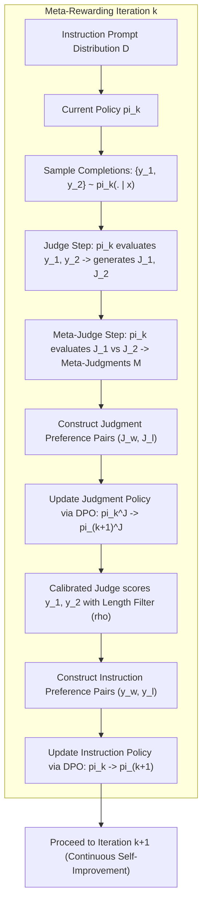
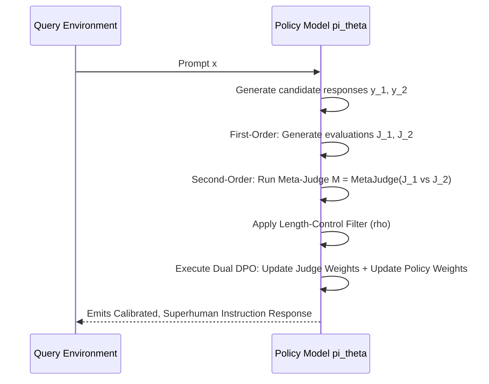

# Self-Improving Alignment, Self-Rewarding Language Models & Meta-Judges (Yuan et al. / Wu et al., Meta 2024)

## 1. Executive Summary & The Autonomous Alignment Frontier
Standard post-training alignment pipelines (RLHF, DPO, KTO) depend fundamentally on human pairwise preference datasets. However, as frontier large language models approach or exceed human expert reasoning across mathematics, competitive programming, formal verification, and multi-step planning, the **human annotation bottleneck** becomes insurmountable:
1. **The Human Capability Ceiling:** Human annotators cannot reliably verify complex mathematical derivations or edge-case software bugs, capping alignment signals below superhuman levels.
2. **Data Scarcity & Economic Cost:** Crowdsourced human annotation is economically unsustainable for continuous model retraining.
3. **Static Reward Model Exploitation:** External frozen reward models quickly become vulnerable to reward hacking (Goodhart's Law).

To overcome these barriers, autonomous alignment research has shifted toward **Self-Rewarding and Meta-Rewarding Language Models**, where the model generates its own training data, evaluates candidate completions using its own internal reasoning, and updates its policy via iterative preference optimization without external human intervention.

---

## 2. First-Order Self-Rewarding: Mechanics & Iterative DPO

Weizhe Yuan, Richard Yuanzhe Pang, Kyunghyun Cho, Xian Li, Sainbayar Sukhbaatar, Jing Xu, and Jason Weston (*Self-Rewarding Language Models*, Meta & NYU / ICML 2024 / arXiv:2401.10020) formulate an integrated architecture where the language model possesses two intrinsic skills trained into a single set of weights:
- **Skill 1 (Instruction Following):** Generating high-quality completions $y \sim \pi_\theta(\cdot \mid x)$.
- **Skill 2 (LLM-as-a-Judge):** Evaluating and scoring candidate responses $s \sim \pi_\theta(\cdot \mid \operatorname{JudgePrompt}(x, y))$.

### 2.1 The Self-Rewarding Iteration Cycle
In iteration $t \in \{1, 2, \dots\}$:
1. **Candidate Generation:** For prompt $x$, the model samples $K$ distinct completions:
   $$\{y_1, y_2, \dots, y_K\} \sim \pi_t(\cdot \mid x)$$
2. **Self-Scoring:** The model evaluates each candidate using an internal 5-point evaluation prompt:
   $$s_i = \operatorname{ExtractScore}\left( \pi_t\left( \cdot \mid \operatorname{Prompt}_{\text{judge}}(x, y_i) \right) \right), \quad s_i \in [1, 5]$$
3. **Preference Pair Construction:** Pairs with score differentials exceeding margin $\Delta s \ge 1$ form the synthetic preference dataset:
   $$\mathcal{D}_t = \left\{ (x, y_w, y_l) \;\middle|\; s(y_w) > s(y_l) \right\}$$
4. **Iterative Direct Preference Optimization (Iterative DPO):**
   $$\mathcal{L}_{\text{DPO}}(\theta_{t+1}) = -\mathbb{E}_{(x, y_w, y_l) \sim \mathcal{D}_t} \left[ \log \sigma \left( \beta \log \frac{\pi_{t+1}(y_w \mid x)}{\pi_t(y_w \mid x)} - \beta \log \frac{\pi_{t+1}(y_l \mid x)}{\pi_t(y_l \mid x)} \right) \right]$$

### 2.2 The Saturation Pathology
While Self-Rewarding improves Llama-2-70B across iterations $M_1 \to M_2$, it encounters a severe **saturation barrier at iteration 3**:
- The model's *generation* capability improves faster than its *evaluation* capability.
- Without external calibration, the judge develops blindspots, over-indexing on superficial stylistic markers (bullet points, bold headers, excessive pleasantries) and reinforcing its own hallucinations.

---

## 3. Second-Order Meta-Rewarding: LLM-as-a-Meta-Judge

To dismantle the saturation barrier, Tianhao Wu, Jason Weston et al. (*Meta-Rewarding Language Models: Self-Improving Alignment with LLM-as-a-Meta-Judge*, Meta / EMNLP 2024 / arXiv:2407.19594) introduce a second-order feedback loop where the model evaluates the quality of its own judgments.

### 3.1 Mathematical Formulation of the Meta-Judge
Let $J_1, J_2$ denote two independent judgments generated by the model for candidate pair $(y_1, y_2)$ on prompt $x$.
The **Meta-Judge prompt** instructs the model to inspect both judgment rationales across four formal criteria:
1. *Critique Accuracy:* Did the judge identify genuine factual errors in the response?
2. *Score Calibration:* Is the numerical score proportional to the critique severity?
3. *Position Invariance:* Is the judgment free from first-response position bias?
4. *Verbosity Neutrality:* Did the judge penalize unnecessary token padding?

The Meta-Judge generates a verdict $M \in \{J_1 \succ J_2, J_2 \succ J_1\}$, yielding judgment preference pairs $(J_w, J_l)$.

### 3.2 Dual-Track DPO Optimization
Meta-Rewarding executes two distinct DPO gradient steps in each iteration:
1. **Judge Policy DPO:**
   $$\mathcal{L}_{\text{judge}}(\theta) = -\mathbb{E} \left[ \log \sigma \left( \beta \log \frac{\pi_\theta(J_w \mid x, y_1, y_2)}{\pi_{\text{ref}}(J_w \mid x, y_1, y_2)} - \beta \log \frac{\pi_\theta(J_l \mid x, y_1, y_2)}{\pi_{\text{ref}}(J_l \mid x, y_1, y_2)} \right) \right]$$
2. **Instruction Policy DPO:**
   Conditioned on preference pairs $(y_w, y_l)$ verified by the updated, meta-calibrated judge:
   $$\mathcal{L}_{\text{instruction}}(\theta) = -\mathbb{E} \left[ \log \sigma \left( \beta \log \frac{\pi_\theta(y_w \mid x)}{\pi_{\text{ref}}(y_w \mid x)} - \beta \log \frac{\pi_\theta(y_l \mid x)}{\pi_{\text{ref}}(y_l \mid x)} \right) \right]$$

---

## 4. Length-Bias Mitigation: The Quality-Tier Mechanism

Uncontrolled self-training notoriously inflates response length ("length gaming"). To insulate Meta-Rewarding against verbosity exploitation, Wu et al. define **length-controlled quality tiers**:
$$y_w \succ y_l \iff \operatorname{Tier}(y_w) > \operatorname{Tier}(y_l) \quad \text{or} \quad \left( \operatorname{Tier}(y_w) = \operatorname{Tier}(y_l) \;\land\; \operatorname{len}(y_w) \le \operatorname{len}(y_l) \right)$$
where $\operatorname{Tier}(y) = \lfloor \operatorname{Score}(y) / \rho \rfloor$, with bin width $\rho = 0.5$.
This rule mathematically enforces that:
- A longer response is accepted *only* if its semantic quality crosses into a strictly superior quality tier.
- Within the same quality tier, the shorter, denser completion is strictly preferred, entirely halting length bloat.

---

## 5. Empirical Leaderboard Frontiers

| Model & Alignment Iteration | AlpacaEval 2.0 (LC Win Rate) | Arena-Hard-Auto Win Rate | Length (Mean Tokens) | Human Supervision Required |
| :--- | :--- | :--- | :--- | :--- |
| **Llama-3-8B-Instruct (Baseline)** | $22.9\%$ | $20.6\%$ | 2,050 | Human SFT + DPO |
| **Llama-3-8B + Self-Rewarding (Round 1)** | $28.4\%$ | $23.1\%$ | 2,420 | Zero (Self-Play) |
| **Llama-3-8B + Self-Rewarding (Round 2)** | $31.2\%$ | $24.5\%$ | 2,780 | Zero (Self-Play) |
| **Llama-3-8B + Self-Rewarding (Round 3)** | $30.8\%$ (Saturated) | $24.2\%$ (Degraded) | 3,150 | Zero (Self-Play) |
| **Llama-3-8B + Meta-Rewarding (Round 1)** | $32.1\%$ | $25.4\%$ | 2,120 | Zero (Self-Play) |
| **Llama-3-8B + Meta-Rewarding (Round 2)** | $36.8\%$ | $27.9\%$ | 2,180 | Zero (Self-Play) |
| **Llama-3-8B + Meta-Rewarding (Round 3)** | **$39.4\%$** | **$29.1\%$** | **2,240** | **Zero (Self-Play)** |

- **Breaking the Ceiling:** While standard Self-Rewarding degrades at Round 3, Meta-Rewarding maintains linear win-rate scaling across all three rounds.
- **Length Control:** Average response length expands by only $+9\%$ under Meta-Rewarding versus $+54\%$ under unregularized Self-Rewarding.

---

## 6. Engineering Directives for Autonomous Self-Alignment
When implementing autonomous self-improving alignment systems:
1. **Never optimize instruction policy on un-calibrated self-scores.** Always introduce a meta-evaluation tier or process verifier to cross-examine judgment validity.
2. **Incorporate Length Bins ($\rho$):** Enforce tier-based length penalties to prevent the model from discovering that cosmetic verbosity inflates self-rewards.
3. **Symmetrize Candidate Presentations:** Always evaluate candidate responses $(y_1, y_2)$ and $(y_2, y_1)$ to eliminate the $15\%\text{--}25\%$ position bias before emitting training pairs.
