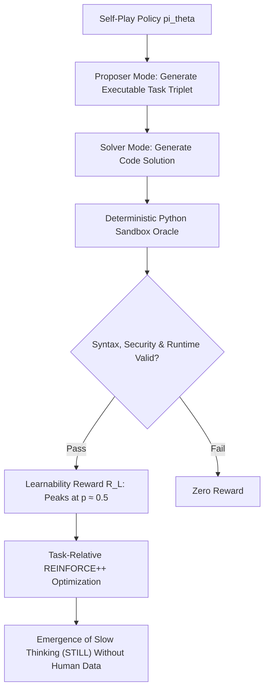

# Absolute Zero Reasoner (AZR)

The Absolute Zero Reasoner (Zhao et al., 2025) establishes tabula-rasa reasoning emergence in large language models without human prompts, fine-tuning traces, or neural reward models.

## Core Mechanics
1. **Autonomous Triplet Generation:** The policy alternates between proposer and solver roles, synthesizing problem-solution-verifier triplets across deductive, abductive, and inductive logic modes.
2. **Objective Execution Oracle:** Completely eliminates neural reward models and human annotations in favor of a deterministic Python sandbox evaluating unit tests and invariant assertions.
3. **Learnability Reward:**
   $$R_{\text{proposer}} = 1 - |2p - 1|$$
   where $p$ is the solver empirical pass rate, systematically driving the self-evolving curriculum toward the zone of proximal development ($p \approx 0.5$).
4. **Task-Relative REINFORCE++:** Maximizes progress while stabilizing gradient variance across heterogeneous self-generated code tasks.

Related: [[rlvr_verifiable_rewards_grpo]], [[math_shepherd_step_level_supervision]], [[s1_budget_forcing_test_time]], [[quiet_star_internal_rationales]]
