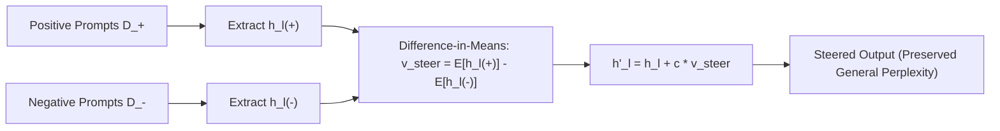

# Activation Addition (ActAdd) & Steering Vectors

## Weight-Free Behavioral Steering
Fine-tuning and RLHF alter model parameter weights globally, risking catastrophic forgetting, high training costs, and destructive interference with off-target capabilities. **Activation Addition (ActAdd)** (Turner et al., 2023 / arXiv:2308.10248) and Contrastive Activation Addition (CAA, Rimsky et al., 2024) control high-level behavior by computing and injecting static steering vectors directly into the Transformer's residual stream during inference.

## Mathematical Extraction & Injection
1. **Difference-in-Means Vector:** For contrastive prompt pairs $\mathcal{D}_+$ and $\mathcal{D}_-$ at intermediate layer $l$:
   $$\mathbf{v}_{\text{steer}}^{(l)} = \frac{1}{|\mathcal{D}_+|} \sum_{x \in \mathcal{D}_+} h_l(x) - \frac{1}{|\mathcal{D}_-|} \sum_{x \in \mathcal{D}_-} h_l(x)$$
2. **Inference Modification:** During forward autoregression on query $x$:
   $$h_l'(t) = h_l(t) + c \cdot \mathbf{v}_{\text{steer}}^{(l)}$$
   where $c \in \mathbb{R}$ controls the steering magnitude.

## Subspace Geometry & Off-Target Invariance
ActAdd leverages the Linear Representation Hypothesis: behavioral concepts (sycophancy, hallucination rate, persona, truthfulness) inhabit orthogonal linear subspaces in middle layers ($l \in [0.4L, 0.7L]$). Interventions at these layers steer specific behaviors while maintaining general benchmark accuracy and syntax fluency.

Related: [[alignment_mechanic]], [[loreft_representation_fine_tuning]], [[circuit_breakers_representation_rerouting]]
