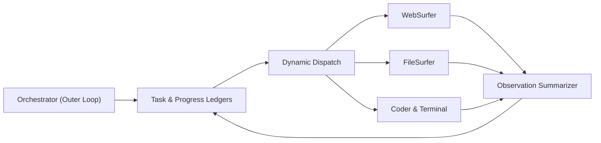

# Agent Orchestration: Dual-Loop Ledgers & Cyclic State Machines

## Dual-Loop Ledger System (Magentic-One)
Single-agent ReAct loops experience catastrophic context degradation, goal drift, and unrecoverable tool failures when tackling long-horizon tasks. Microsoft's **Magentic-One** (Fourney et al., 2024 / arXiv:2411.04468) solves this via dual-loop coordination:
1. **Outer Strategic Loop (Lead Orchestrator):** Manages goal decomposition and error recovery using two explicit, structured ledgers:
   - **Task Ledger:** Maintains step-by-step plans $\langle g_{\text{root}}, \{s_1, \dots, s_K\}, i_{\text{active}}\rangle$.
   - **Progress Ledger:** Tracks verified facts $\mathcal{F}_{\text{verified}}$, quarantined dead-ends $\mathcal{D}_{\text{dead\_ends}}$, and active uncertainties $\mathcal{U}$.
2. **Inner Execution Loop (Specialized Subagents):** Delegates focused operations to modular subagents (`MultimodalWebSurfer`, `FileSurfer`, `CoderTerminal`) with restricted toolsets ($\le 5$), shielding the orchestrator from raw observation noise.

## Cyclic Graph State Machines (LangGraph)
For deterministic workflow governance, agents are modeled as cyclic directed graphs $\mathcal{G} = \langle \mathcal{V}, \mathcal{E}, \mathcal{S} \rangle$ (Pregel actor model):
- **State Reducers:** $S_{t+1} = S_t \oplus \Delta S$.
- **Durable Checkpointing:** Atomically records state after each node transition to enable instantaneous fault recovery and transactional time-travel rollback.
- **Human-in-the-Loop:** Suspends execution before critical actions for external authorization.

## Performance
Magentic-One and cyclic graphs boost benchmark scores from $15.4\% \to \mathbf{42.6\%}$ on GAIA and $11.2\% \to \mathbf{35.8\%}$ on WebArena over un-orchestrated ReAct baselines.

Related: [[mixture_of_agents_collaborative_swarms]], [[agentic_memory_architect]], [[reasoning_search_planner]]
