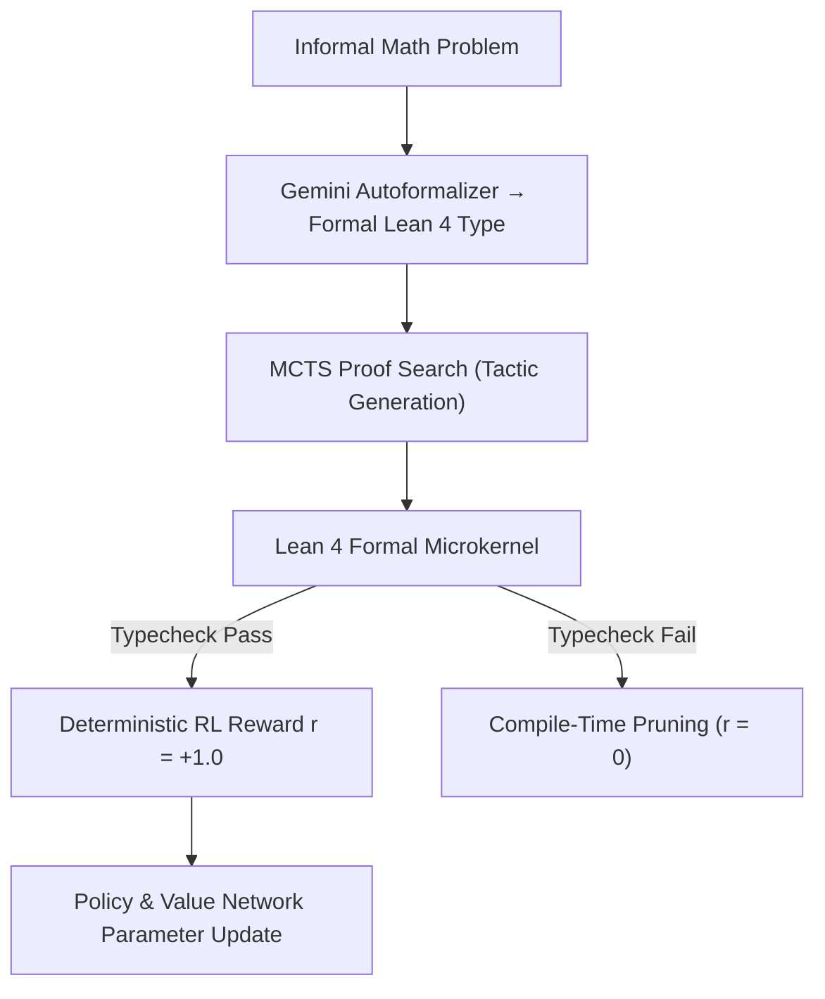

# AlphaProof: Neurosymbolic Theorem Proving with Lean 4

**AlphaProof** achieves silver-medal parity at the International Mathematical Olympiad (IMO 2024) by coupling a neural tactic generator (fine-tuned Gemini) with the formal, deterministic Lean 4 theorem prover inside an AlphaZero-style reinforcement learning loop.

## Mathematical Mechanics
1. **Autoformalization:** Converts natural language problem $P_{\text{informal}}$ into formal type specifications in dependent type theory:
   $$\text{Spec} \in \text{Type}_{\text{Lean 4}}$$
2. **Deterministic Symbolic Grounding:** The proof search eliminates neural hallucination by delegating validity checking to the compiler kernel:
   $$\text{Check}(\text{Proof}, \text{Spec}) \in \{\text{Valid}, \text{Error}\}$$
3. **Reinforcement Learning from Formal Verification:** Proof states are treated as board game nodes in a formal environment. Solved proofs provide dense, zero-noise ground-truth rewards, steering policy and value networks to discover complex lemmas in algebra, number theory, and combinatorics.

## Related Mechanics
- [[process_reward_models]]
- [[test_time_compute_scaling]]
- [[monte_carlo_tree_search_llm]]
