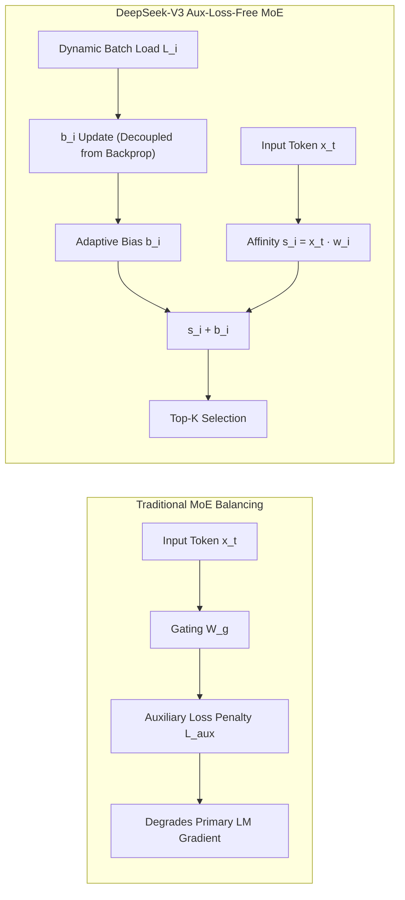

# Auxiliary-Loss-Free Load Balancing in Mixture-of-Experts (DeepSeek-V3 MoE)

## 1. The Dilemma of Auxiliary Loss in Sparse MoE
In conventional Mixture-of-Experts (MoE) architectures (Switch Transformer, GShard, Mixtral), routing networks select top-$k$ experts per token based on affine routing scores $s_i = x^\top w_i$. To prevent routing collapse where a few dominant experts receive all tokens, models rely on an auxiliary load-balancing loss:
$$\mathcal{L}_{\text{aux}} = \alpha \cdot N \sum_{i=1}^N f_i P_i$$
where $f_i$ is the fraction of tokens dispatched to expert $i$, $P_i = \frac{1}{T} \sum_{t=1}^T \text{Softmax}(x_t W_g)_i$ is the average routing probability, and $\alpha$ is a balancing penalty.

Crucially, **$\mathcal{L}_{\text{aux}}$ acts as an antagonistic regularization objective**: minimizing $\mathcal{L}_{\text{aux}}$ forces the router to dispatch tokens to suboptimal experts purely for balance, directly degrading the primary next-token prediction loss $\mathcal{L}_{\text{LM}}$.

## 2. Dynamic Expert-Level Bias Formulation (DeepSeek-V3)
DeepSeek-V3 completely removes $\mathcal{L}_{\text{aux}}$ from the loss function, maintaining optimal gradient fidelity for $\mathcal{L}_{\text{LM}}$. Instead, it introduces an expert-specific routing bias $b_i \in \mathbb{R}$:
$$g_{i, t} = \text{TopK}\left( \text{Softmax}\left( x_t W_g + b \right), k \right)_i$$

The bias vector $b$ is dynamically updated at the end of each step (or micro-batch) using the empirical expert load distribution:
$$b_i^{(t+1)} = b_i^{(t)} + \gamma \cdot \text{sign}\left(\bar{L} - L_i\right)$$
where $L_i = \frac{1}{T} \sum_{t=1}^T \mathbb{I}(\text{expert } i \text{ selected for token } t)$, $\bar{L} = \frac{k}{N}$ is the target mean load, and $\gamma$ is an adaptive step size.

If expert $i$ is overloaded ($L_i > \bar{L}$), $b_i$ decreases, making it harder for subsequent tokens to route to expert $i$ unless the intrinsic affinity $x_t w_i$ strongly warrants it. If underloaded, $b_i$ increases. Because $b$ does not receive backpropagation gradients ($\nabla_b \mathcal{L}_{\text{LM}} \equiv 0$), the base model capacity is preserved without Pareto degradation.
