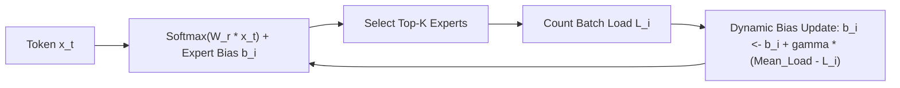

# Auxiliary-Loss-Free MoE Load Balancing

## The Gradient Interference of Auxiliary Losses
Traditional Mixture-of-Experts (MoE) architectures prevent expert collapse using an auxiliary load balancing loss $\mathcal{L}_{\text{aux}} = \alpha N \sum f_i P_i$. However, DeepSeek researchers (arXiv:2408.15664) prove that $\nabla \mathcal{L}_{\text{aux}}$ produces severe **gradient interference** against the primary language modeling gradient $\nabla \mathcal{L}_{\text{LM}}$, degrading reasoning performance.

## Dynamic Expert Bias Routing (DeepSeek-V3)
DeepSeek replaces auxiliary losses entirely with dynamic, non-differentiable additive routing biases:
1. **Biased Routing Score:**
   $$s_{i, t} = \operatorname{Softmax}(W_r x_t)_i + b_i$$
2. **Top-$K$ Selection:** Dispatches tokens to the $K$ experts with highest $s_{i, t}$.
3. **Unbiased Expert Weights:** Selection uses biased scores, but the gating weights for expert outputs use un-biased probabilities:
   $$w_{i, t} = \frac{\operatorname{Softmax}(W_r x_t)_i}{\sum_{j \in \mathcal{E}_{\text{active}}} \operatorname{Softmax}(W_r x_t)_j}$$
4. **Dynamic Load Feedback:** Biases $b_i$ update after each step based on actual expert load $L_i$:
   $$b_i \leftarrow b_i + \gamma (\bar{L} - L_i)$$

## Serving Impact
Deployed in **DeepSeek-V3** across 256 routed experts: eliminates gradient interference while maintaining load variance $<2\%$ throughout 14.8T token pretraining.

Related: [[mixture_of_agents_collaborative_swarms]], [[kv_cache_optimizer]], [[speculative_decoding_specialist]]
