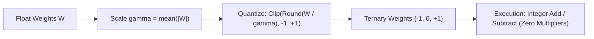

# BitNet b1.58 Ternary LLMs

BitNet b1.58 (Ma et al., Microsoft Research 2024) replaces floating-point matrix multiplications with integer additions by constraining all weights to ternary values $\{-1, 0, +1\}$.

## Mathematical Mechanics
$$W_b = \text{Clip}\left(\text{Round}\left(\frac{W}{\gamma + \epsilon}\right), -1, +1\right), \quad \gamma = \frac{1}{nm} \sum_{i,j} |W_{ij}|$$
1. **Absmean Quantization:** Computes average absolute weight magnitude $\gamma$, scales weights, rounds to nearest integer, and clips to $[-1, +1]$.
2. **Multiplication Elimination:** Converting weights to ternary values transforms GEMM operations entirely into integer additions and subtractions, bypassing energy-hungry floating-point multiplier circuits.
3. **Parity at 1.58 Bits:** Matches full-precision LLaMA models at identical parameter counts while cutting DRAM memory bandwidth and compute energy consumption by up to $82\%$.

Related: [[kivi_2bit_asymmetric_kv_quantization]], [[galore_gradient_low_rank_projection]], [[phi3_high_density_synthetic_curricula]]
