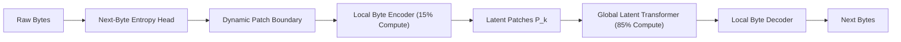

# Byte Latent Transformer (BLT)

Byte Latent Transformer (Patry et al., Meta AI 2024) obsoletes subword tokenization (BPE/WordPiece) by operating directly on raw UTF-8 byte streams with dynamic, entropy-based patch allocation.

## Core Mechanics
1. **Dynamic Entropy Segmentation:** A lightweight local model predicts the entropy $H(b_t)$ of upcoming bytes. Boundaries are dynamically placed where uncertainty spikes, allocating fine-grained patches to information-dense regions and coarse patches to predictable text.
2. **Compute Allocation Disconnect:** Replaces the uniform FLOP-per-token penalty of BPE. The deep global latent Transformer processes compressed byte patches, reserving 85% of parameters/compute for high-level semantic reasoning.
3. **Tokenizer Immunity:** Eliminates token-boundary vulnerabilities, spelling anomalies, subword glitch tokens, and language-dependent vocabulary inflation.

## Empirical Metrics
- Matches BPE-based LLaMA models at iso-FLOP and inference latency budgets.
- Extreme robustness against character-level typos, phonetic corruption, and zero-shot out-of-vocabulary injection.

Related: [[token_healing_subword_boundary_synchronization]], [[glitch_tokens_unembedded_spaces]], [[outlines_dfa_constrained_decoding]]
