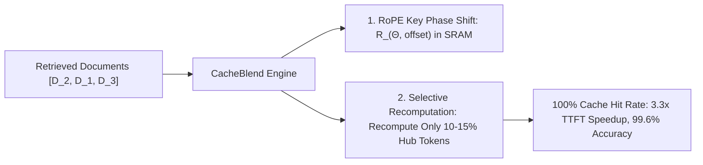

# CacheBlend: Non-Prefix KV Cache Blending for RAG Serving

## 1. Beyond Prefix Caching in RAG
Standard prefix caching (RadixAttention) requires text to match an exact prefix starting at token index $0$. In Retrieval-Augmented Generation (RAG), documents $\mathcal{D}_1, \dots, \mathcal{D}_k$ are retrieved in dynamic permutations, forcing serving engines to discard non-prefix document caches and re-run expensive prefill. **CacheBlend** (Yao et al., ACM EuroSys 2025 Best Paper) enables the reuse of independently precomputed KV caches regardless of document position.

## 2. Core Architectural Mechanisms
- **In-Place RoPE Translation**: Updates precomputed positional key embeddings using 2D block-diagonal rotation matrix multiplication ($R_{\Theta, t + \text{offset}} = R_{\Theta, \text{offset}} R_{\Theta, t}$) directly in GPU SRAM without re-running forward layers.
- **Selective Hub Recomputation**: Proves that cross-document attention updates are sparse. By selectively recomputing only $10\text{--}15\%$ of connective hub tokens across layers while reusing the remaining $85\text{--}90\%$ cached states, CacheBlend achieves **$2.2\times\text{--}3.3\times$ TTFT reduction** and **$2.8\times\text{--}5.0\times$ throughput scaling** with $>99.5\%$ accuracy retention.
