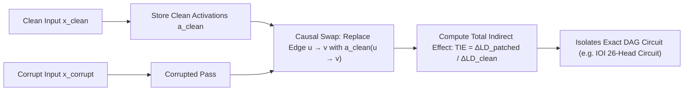

# Causal Mediation Analysis & Path Patching

**Causal Mediation Analysis (CMA)** and **Path Patching** (Wang et al., 2022; Goldowsky-Dill et al., 2023) constitute the foundational causal intervention methodology in mechanistic interpretability, establishing the exact computational subcircuits (nodes and directed edges) mediating specific algorithmic behaviors in transformers.

## Mathematical Mechanics
1. **Activation Patching:**
   Measures recovery of the clean logit difference $\text{LD} = \text{logit}(y_{\text{clean}}) - \text{logit}(y_{\text{corrupt}})$ when substituting clean activation $a_{\text{clean}}(M)$ into a corrupted forward pass:
   $$\text{TIE}(M) \triangleq \frac{\text{LD}\left(h_{\text{patched}}(M)\right) - \text{LD}\left(x_{\text{corrupt}}\right)}{\text{LD}\left(x_{\text{clean}}\right) - \text{LD}\left(x_{\text{corrupt}}\right)}$$
2. **Path Patching (Edge Isolation):**
   Isolates direct information transmission along edge $u \to v$ by freezing all other pathways in the corrupted state while injecting clean representations exclusively into $v$'s query, key, or value inputs.
3. **Circuit Discoveries:**
   Successfully discovered the **Indirect Object Identification (IOI)** circuit (26 heads across Duplicate Token, S-Inhibition, and Name Mover classes) and the **Greater-Than** monotonic arithmetic circuit, proving that complex behaviors decompose into sparse, interpretable computational subgraphs.

## Related Mechanics
- [[transcoder_networks_mlp_circuit_tracing]]
- [[induction_heads_icl_circuit]]
- [[sparse_autoencoders_dictionary_learning]]
- [[tcav_concept_activation_vectors_and_lat]]
