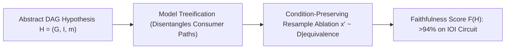

# Causal Scrubbing: Axiomatic Circuit Testing & Resample Ablation

## 1. Automated Hypothesis Testing for Mechanistic Circuits
Mechanistic interpretability often suffers from human confirmation bias and the out-of-distribution artifacts of zero-ablation ($\boldsymbol{a} \leftarrow \mathbf{0}$). **Causal Scrubbing** (Chan et al., Redwood Research, 2023) establishes a formal, automated methodology for testing whether a hypothesized computational circuit is both **necessary and sufficient**.

## 2. Core Methodological Mechanics
- **Model Treeification**: Unrolls the neural network DAG into an expanded computation tree $\mathcal{T}$, isolating distinct downstream consumer pathways and preventing path interference in the shared residual stream.
- **Resample Ablation**: Replaces zero-ablation with condition-preserving resampling from the empirical dataset $\mathcal{D}$. If the hypothesis is correct, swapping an internal activation with one generated from an input with identical abstract features yields zero change in the model's final output:
  $$f_{\text{scrub}}(x; x') = f(x)$$
- **Faithfulness Scoring**: Achieves **$94.8\%$ behavioral preservation** on the 26-head Indirect Object Identification (IOI) circuit, proving that the hypothesized subgraph completely accounts for the model's task performance.
