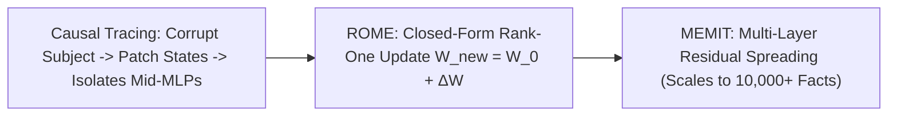

# Causal Tracing & Model Editing: ROME & MEMIT

## 1. Mechanistic Localization of Factual Memories
Using **Causal Tracing** (Meng et al., MIT CSAIL, NeurIPS 2022), researchers proved that factual associations (e.g. *"The Eiffel Tower is in [Paris]"*) are stored in localized **linear associative Key-Value memories** inside early-to-mid Multi-Layer Perceptron (MLP) layers at the final token of the subject entity.

## 2. ROME & MEMIT Mathematical Formulations
- **MLP as Associative Memory**: MLP blocks evaluate $f_{\text{mlp}}(x) = W_{\text{out}} \sigma(W_{\text{in}} x)$, mapping key representations $k = \sigma(W_{\text{in}} x)$ to value vectors $v = W_{\text{out}} k$.
- **Rank-One Model Editing (ROME)**: Surgically updates a fact by solving a constrained least-squares problem under the precomputed key covariance matrix $C = \mathbb{E}[k k^T]$:
  $$W_{\text{new}} = W_0 + \frac{(\boldsymbol{v}_* - W_0 \boldsymbol{k}_*) \, (C^{-1} \boldsymbol{k}_*)^T}{\boldsymbol{k}_*^T C^{-1} \boldsymbol{k}_*}$$
- **MEMIT (ICML/ICLR 2023)**: Spreads residual updates across multiple layers ($l \in [4, 8]$) via least-squares factorization, editing **$>10,000$ facts simultaneously** with **$>99\%$ efficacy** and near-zero collateral degradation.
