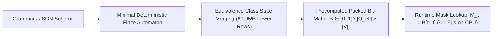

# Compressed Finite State Machines (cFSM) & Bit-Parallel Masking

**Compressed Finite State Machines (cFSM)** (XGrammar / vLLM, 2024) solve the $128\text{,}000+$ vocabulary token explosion bottleneck in structured generation by pre-indexing grammar state transitions into a static, equivalence-compressed bit-matrix, converting expensive runtime regex evaluations into a single $O(1)$ memory lookup.

## Mathematical Formalism
1. **Offline Bit-Matrix Precomputation:**
   $$B_{q, w} = \begin{cases} 1 & \text{if } \delta^*(q, \text{bytes}(w)) \neq \text{Error} \\ 0 & \text{otherwise} \end{cases}$$
2. **State Equivalence Reduction:**
   $$q_1 \sim q_2 \iff B_{q_1, :} \equiv B_{q_2, :}$$
   Compresses thousands of grammar states into a compact footprint ($2\text{--}8\,\text{MB}$ total memory).
3. **Sub-2 Microsecond Runtime Masking:**
   Runtime validity checks reduce to indexing $B[q_t]$, bypassing string matching entirely and slashing CPU masking overhead from $50\text{--}200\,\text{ms}$ down to **$<1.5\,\mu\text{s}$**, matching raw unconstrained generation speed.

## Related Mechanics
- [[llguidance_pushdown_constrained_decoding]]
- [[grammar_guided_speculative_decoding]]
- [[xgrammar_hardware_accelerated_decoding]]
- [[outlines_dfa_regex_constrained_decoding]]
