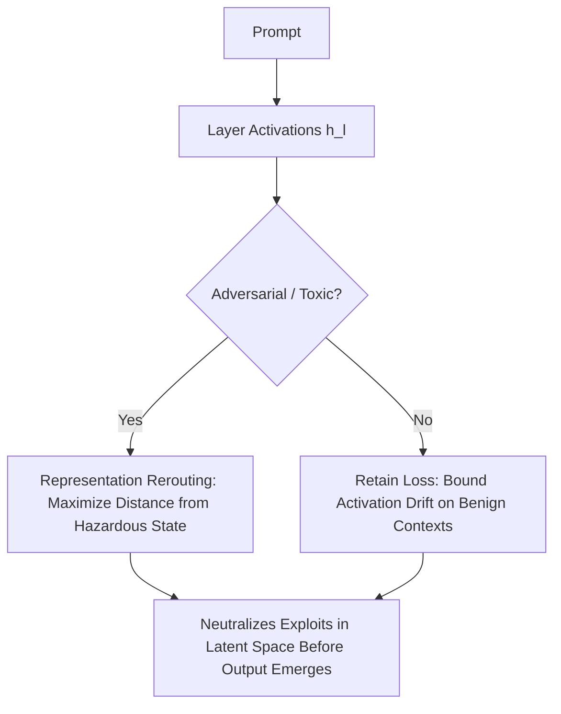

# Circuit Breakers: Representation Rerouting

Circuit Breakers (Zou et al., 2024) neutralize adversarial attacks and jailbreaks by intervening directly on internal activation trajectories rather than relying on brittle surface-level refusals.

## Core Mechanics
1. **Shortcoming of Surface Refusals:** Shallow token-level guardrails leave underlying adversarial circuits active in hidden layers, making models vulnerable to jailbreaks, token smuggling, and prefix injection.
2. **Representation Rerouting (RR):** Maps internal hidden activations elicited by harmful queries toward orthogonal, randomized target vectors by minimizing cosine similarity:
   $$\mathcal{L}_{\text{RR}} = \cos\left(h_l(x_{\text{harmful}}), h_l^*(x_{\text{harmful}})\right) + \lambda \|h_l(x_{\text{benign}}) - h_l^0(x_{\text{benign}})\|_2^2$$
3. **Utility Preservation:** Incorporates a strict $L_2$ retain loss on benign datasets to ensure zero degradation of mathematical, coding, and general reasoning capabilities.

Related: [[model_abliteration_refusal_geometry]], [[loreft_representation_finetuning]], [[representation_engineering_repe]], [[leace_closed_form_concept_erasure]]
