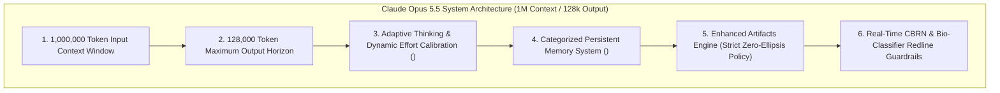

# Claude Opus 5.5 System Prompt Architecture (Pliny the Liberator Leak & Analysis)

## 1. Context Window & Generation Scale
Anthropic's **Claude Opus 5.5** (released September 22, 2026) features landmark computational specifications:
* **Context Window Capacity**: **1,000,000 tokens (1M tokens)** native input context.
* **Maximum Output Generation**: **128,000 tokens (128k output tokens)** per single forward generation pass.
* **System Prompt Extraction**: Extracted and published by prominent AI red-teamer Pliny the Liberator (`@elder_plinius`, author of `CL4R1T4S` and `L1B3RT45`). The core instruction suite spans over **270,000 characters** (~50,000 words), while the complete session dump with tool definitions and environment schemas occupies **1.9 MB** (~450,000 tokens).

With a 1M token context window, the model effortlessly prefills the entire 1.9 MB environment dump, leaving over 550,000 tokens of headroom for conversational state and document ingestion. Furthermore, the 128k token output horizon provides the physical generation bandwidth required to enforce the zero-ellipsis code generation mandate without truncation.

## 2. Core Architectural Subsystems in Opus 5.5

### A. Adaptive Thinking & Dynamic Effort Calibration
Unlike previous architectures requiring manual prompt toggles or static token budgets, Opus 5.5 employs an **always-on adaptive thinking loop**:
- The prompt instructs the model to evaluate the intrinsic complexity of incoming requests.
- For high-complexity tasks (formal theorem proving, complete codebase refactors, complex multi-constraint scheduling), it allocates tens of thousands of `<thinking>` tokens.
- For lightweight or direct queries, it dynamically collapses reasoning depth to deliver near-instantaneous output.

### B. Categorized Persistent Memory (`<claude_memory>`)
The system prompt establishes Anthropic's hierarchical persistent memory framework:
- Memory entries are partitioned into explicit categorical slots: user work style and formatting preferences, project-level architectural constraints, and historical technical decisions.
- Contains explicit reconciliation instructions to prune deprecated or conflicting memory items before generation.

### C. Strict Code Self-Containment (Zero-Ellipsis Mandate)
Leveraging its **128,000 token maximum output ceiling**, Opus 5.5 strictly forbids code truncation:
- Prohibits lazy placeholders such as `// ... rest of code remains unchanged ...` or `# existing logic goes here`.
- Mandates complete file generation or exact search-and-replace block formatting (`<<<< SEARCH / ==== / >>>> REPLACE`) for automated execution harnesses.

### D. Refined Safety & Bio-Defense Classifiers
The prompt integrates updated safety guidelines for chemical, biological, radiological, and nuclear (CBRN) threats. It mandates an **anti-preachiness protocol**: refusing dangerous actions plainly and neutrally without moral lecturing or patronizing tone.
