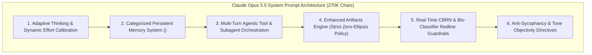

# Claude Opus 5.5 System Prompt Architecture (Pliny the Liberator Leak & Analysis)

## 1. Overview & Context of the 270,000-Character System Prompt
Following Anthropic's release of **Claude Opus 5.5** on **September 22, 2026**, prominent AI red-teamer Pliny the Liberator (`@elder_plinius`, author of `CL4R1T4S` and `L1B3RT45`) extracted and published the model's full internal instruction suite. Spanning over **270,000 characters**, this document represents the largest and most complex production agent operating prompt documented to date.

## 2. Core Architectural Subsystems in Opus 5.5

### A. Adaptive Thinking & Effort Calibration
Unlike previous models requiring explicit manual prompt instructions or fixed reasoning token budgets, Opus 5.5 features an **always-on adaptive thinking loop**:
- The prompt provides instructions for the model to self-evaluate task difficulty.
- For high-complexity tasks (formal theorem proving, multi-file code refactors), it allocates extensive `<thinking>` tokens.
- For lightweight queries, it dynamically collapses thinking depth to minimize latency.

### B. Categorized Persistent Memory (`<claude_memory>`)
The system prompt details Anthropic's hierarchical memory architecture:
- Memory entries are segmented into distinct categorical slots: user preferences, persistent project constraints, and historical architectural decisions.
- Explicit instructions govern memory pruning and prevent stale or contradictory entries from polluting generation context.

### C. Strict Code Self-Containment (Zero-Ellipsis Mandate)
Opus 5.5's coding instructions enforce a zero-tolerance policy against lazy placeholders:
- Prohibits comments like `// ... rest of code remains the same ...` or `# existing implementation`.
- Mandates full file emission or exact search-and-replace block formatting to ensure automated harness compatibility.

### D. Refined Safety & Bio-Defense Classifiers
The prompt integrates updated safety guidelines reflecting frontier bio-security (CBRN) policies, enforcing strict non-proliferation boundaries while maintaining a completely neutral, non-preachy conversational posture.
