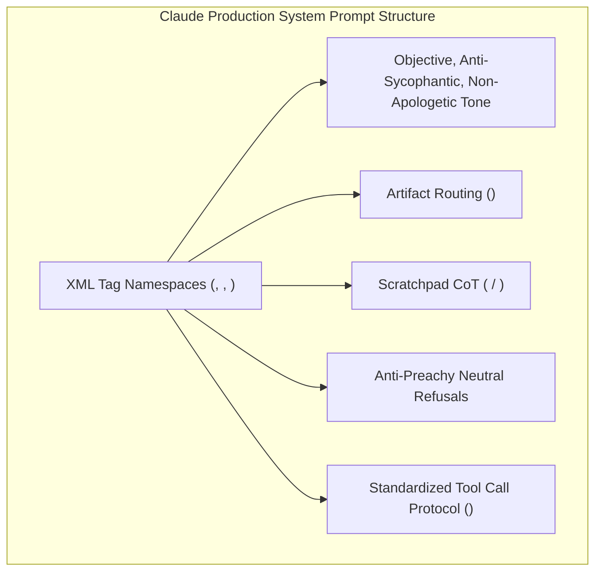

# Anthropic Claude System Prompt Architecture & CL4R1T4S Extractions

## 1. System Prompt Mechanics & Global Topology
As documented across official releases and verified via red-teaming extractions (e.g. Pliny the Liberator's `elder-plinius/CL4R1T4S` and `CLAUDE-CODE-SYSTEM-PROMPT`), Anthropic's Claude 3.5 / Opus system prompt represents one of the most rigorously engineered instruction sets in frontier AI.

Rather than relying on unstructured prose, Claude's system prompt organizes behavior into hierarchical, semantically isolated XML namespaces:
- `<persona_guidelines>`: Enforces intellectual humility, directness, anti-sycophancy, and eliminates conversational filler (e.g., forbidding boilerplate apologies like *"I apologize for the confusion"*).
- `<artifacts_protocol>`: Implements the UI artifact rendering engine (`<antArtifact>`), specifying explicit deterministic criteria for when code, documents, SVGs, or HTML widgets must be rendered in external sandboxes.
- `<tool_use>` & `<thinking>`: Orchestrates function calling and native latent reasoning scratchpads before token emission.
- `<safety_and_refusal_boundaries>`: Implements "anti-preachy" alignment—enforcing strict refusals on CBRN (chemical, biological, radiological, nuclear) and cyber-exploitation while mandating neutral, non-judgmental tone without moralizing lectures.

## 2. Core Architectural Subsystems

### A. The Artifact Engine (`<antArtifact>`)
The system prompt strictly delineates inline text from artifacts using deterministic heuristics:
1. **Creation Threshold:** Content must be $>15$ lines of code, intended for reuse or external execution, or complex structured documents (SVG, Mermaid, React, HTML).
2. **Reuse & Self-Containment:** Artifacts must be fully self-contained without ellipsis placeholders (`// ... rest of code unchanged ...`), preventing incomplete diff bugs.
3. **Suppression Rules:** Casual one-off explanations, brief conversational shell commands, and short utility scripts must never be converted into artifacts.

### B. Extended Thinking & Scratchpad Guidance
Claude is instructed to use hidden scratchpad tokens (`<thinking>`) to plan multi-step reasoning, verify mathematical consistency, and inspect code dependencies before generating the visible `<antArtifact>` or answering the user.

### C. Refusal Mechanics & Anti-Preachiness
Unlike early RLHF models that scolded users when sensitive keywords appeared, the system prompt commands:
- Understand user intent: Distinguish benign educational/security defense discussions from malicious synthesis.
- Flat refusals: State what cannot be done plainly and neutrally (*"I cannot assist with generating exploits."*) without lecturing, patronizing, or offering unsolicited moral advice.