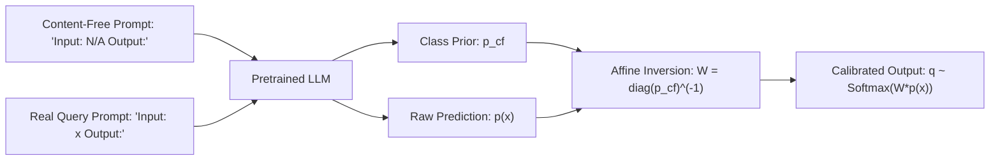

# Contextual Calibration & Surface Form Competition in Few-Shot ICL

## Theoretical Foundations & Systematic In-Context Biases
In-Context Learning (ICL) in large language models exhibits extreme performance sensitivity to demonstration order, formatting, and selection. Zihao Zhao et al. (*Calibrate Before Use: Improving Few-Shot Performance of Language Models*, ICML 2021 / arXiv:2102.09690) identify three intrinsic inductive biases that cause this instability:
1. **Majority Label Bias:** Over-predicting classes that appear with higher frequency in demonstrations.
2. **Recency Bias:** Disproportionately favoring the class of the final demonstration due to causal attention decay.
3. **Common Token Bias:** Strong pretraining priors favoring high-frequency English tokens over rare label names.

Furthermore, Holtzman et al. (*Surface Form Competition*, EMNLP 2021) demonstrate that semantic concepts split probability mass across synonymous tokenizations (e.g., `"computer"`, `"PC"`), artificially penalizing multi-synonym classes.

## Mathematical Formulation of Contextual Calibration
To measure class prior bias independently of query $x$, the model is queried with a content-free token $x_{\text{cf}} \in \{\text{"N/A"}, \text{""}, \text{"[MASK]"}\}$:
$$\hat{p}_{\text{cf}} = P(y \mid \mathcal{C}, x_{\text{cf}}) \in \mathbb{R}^C$$
For test input $x$, the raw probability vector $\hat{p}(x)$ is calibrated via diagonal affine transformation $W = \operatorname{diag}(\hat{p}_{\text{cf}})^{-1}$ and $b = \mathbf{0}$:
$$q_j(y \mid \mathcal{C}, x) = \frac{\hat{p}_j(x) / \hat{p}_{\text{cf}, j}}{\sum_{m=1}^C \hat{p}_m(x) / \hat{p}_{\text{cf}, m}}$$

Combined with domain-conditional normalization $P_{\text{calibrated}}(y \mid x) = \frac{P(y \mid x, \text{Prompt})}{P(y \mid \text{Domain})}$, surface form competition is neutralized.

## Empirical Impact
Contextual calibration provides **up to $+30.0\%$ absolute accuracy gains** across 20+ NLP classification benchmarks and reduces prompt order variance by **$-82\%$** ($\sigma = 18.4\% \to 3.2\%$).

Related: [[icl_mechanistic_theorist]], [[prompt_architect]], [[agent_eval_benchmarker]]
