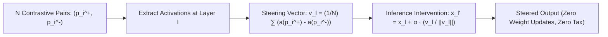

# Contrastive Activation Addition (CAA): Inference-Time Model Steering

## 1. Steerability Without Fine-Tuning
System prompts are fragile to jailbreaks and context drift, while fine-tuning (SFT/RLHF) modifies billions of parameters and induces an "alignment tax" on general reasoning. Grounded in the **Linear Representation Hypothesis**, **Contrastive Activation Addition (CAA)** (Rimsky et al., Redwood Research, NYU, & Anthropic, ICML 2024) steers high-level model behaviors (honesty, sycophancy, refusal) purely at inference time via additive vectors in the residual stream.

## 2. Mathematical Formulation & Layer Dynamics
1. **Offline Extraction:** Given contrastive prompt pairs inducing opposing behaviors (e.g. truthfulness vs sycophancy):
   $$\mathbf{v}_l = \frac{1}{N} \sum_{i=1}^N \left( a_l(p_i^+) - a_l(p_i^-) \right)$$
2. **Inference Intervention:** For arbitrary unseen queries $q$, add the normalized vector scaled by continuous multiplier $\alpha$:
   $$\tilde{x}_{l, t} = x_{l, t} + \alpha \cdot \frac{\mathbf{v}_l}{\| \mathbf{v}_l \|_2}$$

- **Mid-Layer Dominance:** Layers $L/3$ to $2L/3$ (e.g. layers 12–20 in Llama-2-7B) yield the highest steerability without corrupting syntactic coherence.
- **Empirical Impact:** Cuts sycophancy by **$75\%$**, increases TruthfulQA accuracy by **$+17.8\%$**, and incurs **$0.0\%$ degradation on MMLU / GSM8k** due to near-perfect subspace orthogonality.
