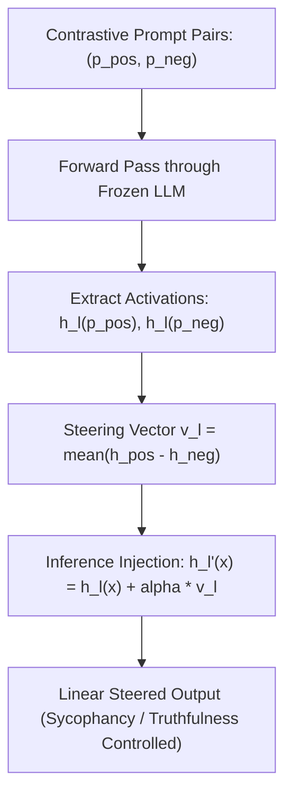

# Contrastive Activation Addition (CAA)

Contrastive Activation Addition (CAA; Rimsky et al., 2024) is a training-free activation engineering framework that modulates LLM behavioral traits by injecting mean-difference steering vectors directly into intermediate residual streams.

## Mathematical Mechanics
1. **Mean Difference Extraction:** Pairs $N$ prompts that differ solely along a target behavioral axis (e.g. sycophancy, hallucination, refusal). The steering vector $v_l$ is extracted at layer $l$:
   $$v_l = \frac{1}{N} \sum_{i=1}^N \left(h_l\left(p_{\text{pos}}^{(i)}\right) - h_l\left(p_{\text{neg}}^{(i)}\right)\right)$$
2. **Residual Stream Injection:** During inference on new inputs, the scaled vector is added at target layer $l$:
   $$h_l'(x_t) = h_l(x_t) + \alpha \cdot v_l$$
   where scalar $\alpha \in \mathbb{R}$ continuously modulates behavioral intensity ($\alpha > 0$ amplifies, $\alpha < 0$ suppresses).
3. **Linear Compositionality:** Multiple orthogonal steering vectors can be composed simultaneously without retraining:
   $$h_l'(x) = h_l(x) + \sum_{k} \alpha_k v_{l, k}$$

## Key Empirical Findings
- Middle-to-late transformer layers ($40\%\text{--}70\%$ depth) offer the highest steering efficacy and selectivity.
- Outperforms standard RLHF and system-prompt instructions in suppressing sycophancy and hallucinations on TruthfulQA with zero parameter degradation.

Related: [[representation_engineering_repe]], [[loreft_representation_finetuning]], [[model_abliteration_refusal_geometry]], [[proxy_tuning_logit_arithmetic]]
