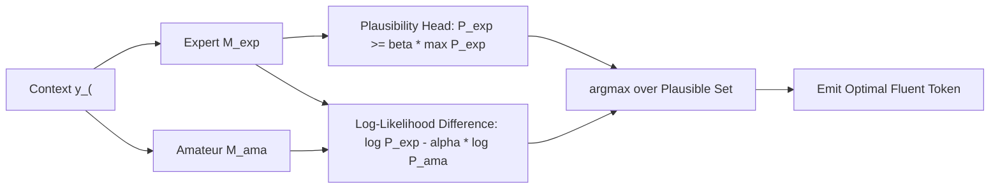

# Contrastive Decoding & Plausibility Filtering

## The Decoding Failure Trade-Off
Standard text decoding faces a fundamental dilemma: greedy search and beam search lead to local repetitions, bland phrasing, and syntax loops; stochastic sampling (top-$p$, temperature) prevents repetition but induces logical contradictions, incoherence, and factual hallucinations.

**Contrastive Decoding (CD)** (Li et al., ACL 2023 / arXiv:2210.15097) casts open-ended text generation as a zero-shot optimization problem comparing an **expert model** $M_{\text{exp}}$ against an **amateur model** $M_{\text{ama}}$.

## Mathematical Formulation
1. **Adaptive Plausibility Constraint:**
   Prunes nonsensical tokens that appear artificially favored solely due to near-zero amateur probability:
   $$\mathcal{V}_{\text{head}}(y_{<t}) = \left\{ v \in \mathcal{V} \;\middle|\; P_{\text{exp}}(v \mid y_{<t}) \ge \beta \max_{w \in \mathcal{V}} P_{\text{exp}}(w \mid y_{<t}) \right\}$$
   where $\beta \in (0, 1)$ (typically $\beta = 0.1$).
2. **Contrastive Objective:**
   Maximizes the difference in log-probabilities over the plausible set:
   $$\hat{y}_t = \arg\max_{v \in \mathcal{V}_{\text{head}}(y_{<t})} \left[ \log P_{\text{exp}}(v \mid y_{<t}) - \alpha \log P_{\text{ama}}(v \mid y_{<t}) \right]$$

## Empirical Superiority
Contrastive Decoding eliminates repetition loops and outmoded phrase attractors, yielding text with strictly higher human-rated coherence, lexical richness, and factuality than nucleus sampling.

Related: [[prompt_architect]], [[constrained_decoding_architect]], [[agent_eval_benchmarker]]
