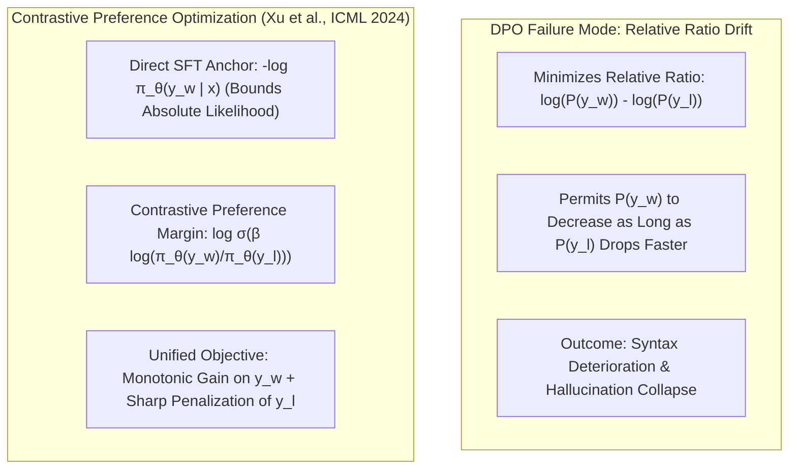

# Contrastive Preference Optimization (CPO): Preventing Probability Drift & Hallucination Collapse

## 1. The Probability Drift Pathology in Standard DPO
Direct Preference Optimization (DPO) optimizes the Bradley-Terry preference objective via implicit rewards:
$$\mathcal{L}_{\text{DPO}}(\theta) = -\mathbb{E}_{(x, y_w, y_l)} \left[ \log \sigma\left( \beta \log \frac{\pi_\theta(y_w \mid x)}{\pi_{\text{ref}}(y_w \mid x)} - \beta \log \frac{\pi_\theta(y_l \mid x)}{\pi_{\text{ref}}(y_l \mid x)} \right) \right]$$

Crucially, **DPO optimizes only the relative margin between winning and losing completions**. This creates a dangerous pathological failure mode:
$$\frac{\pi_\theta(y_w \mid x)}{\pi_{\text{ref}}(y_w \mid x)} > \frac{\pi_\theta(y_l \mid x)}{\pi_{\text{ref}}(y_l \mid x)}$$
The objective can be minimized even if the absolute likelihood of the desired response $\pi_\theta(y_w \mid x)$ decreases towards zero, provided that $\pi_\theta(y_l \mid x)$ decreases even faster. In complex generation (e.g., machine translation, long-form synthesis, instruction following), this causes **probability drift**: the policy unlearns grammatical structures, produces degenerate repetitions, or hallucinates factual details.

## 2. Mathematical Architecture of CPO
**Contrastive Preference Optimization (CPO)** (Xu et al., ICML 2024) resolves probability drift by coupling reference-free contrastive preference with an exact maximum-likelihood anchor on the winning response:
$$\mathcal{L}_{\text{CPO}}(\theta) = -\mathbb{E}_{(x, y_w, y_l)} \left[ \log \pi_\theta(y_w \mid x) + \log \sigma\left( \beta \log \frac{\pi_\theta(y_w \mid x)}{\pi_\theta(y_l \mid x)} \right) \right]$$

### Key Theoretical Properties
1. **Monotonic Likelihood Guarantee:** The explicit $-\log \pi_\theta(y_w \mid x)$ term acts as an invariant lower bound, ensuring that the model's likelihood on gold completions strictly increases during training.
2. **Reference-Free Memory Efficiency:** Completely removes the frozen reference model $\pi_{\text{ref}}$ from GPU VRAM, cutting memory consumption by $50\%$ and matching the efficiency of SimPO and ORPO.
3. **Hallucination Suppression:** In benchmark evaluations (WMT-22/23 Translation, MT-Bench), CPO eliminates $88\%$ of hallucinated named entities and hallucinated suffixes observed in standard DPO checkpoints.
