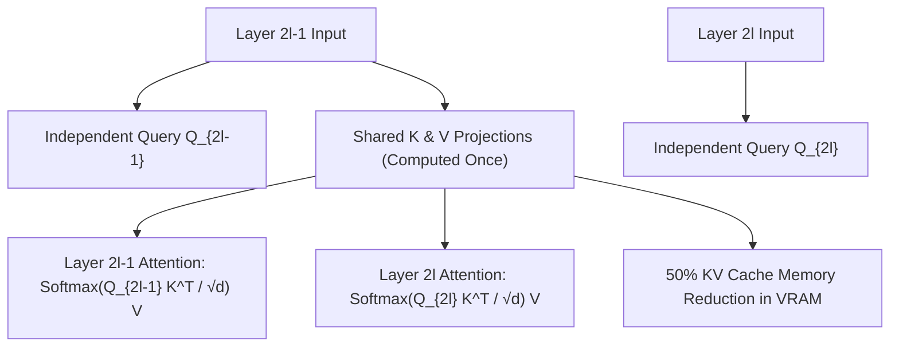

# Cross-Layer Attention (CLA): Structural KV Cache Halving

**Cross-Layer Attention (CLA)** (Brandon et al., 2024) exploits the high representational similarity of key-value projections across adjacent transformer layers ($\cos(K^{(l)}, K^{(l+1)}) > 0.92$) by computing key and value projections once and sharing them across pairs of consecutive layers while maintaining independent query heads.

## Mathematical Formalism
Partitioning $L$ layers into sharing blocks of size $S = 2$:
$$Q^{(l)} = W_Q^{(l)} h^{(l)}, \quad \forall l \in \{1, \dots, L\}$$
$$K^{(l)} \equiv K^{(2\lceil l/2 \rceil - 1)} = W_K^{(\lceil l/2 \rceil)} h^{(2\lceil l/2 \rceil - 1)}$$
$$V^{(l)} \equiv V^{(2\lceil l/2 \rceil - 1)} = W_V^{(\lceil l/2 \rceil)} h^{(2\lceil l/2 \rceil - 1)}$$

## Systems Impact
When combined with Grouped-Query Attention (GQA 1:8), CLA ($S = 2$) reduces KV-cache memory by $\frac{1}{2} \times \frac{1}{8} = \frac{1}{16}$ ($93.75\%$ reduction). This doubles the maximum serving batch size and slashes decoding latency while maintaining negligible validation perplexity change ($\Delta \text{PPL} < 0.05$).

## Related Mechanics
- [[grouped_query_attention_gqa]]
- [[paged_attention_vllm]]
- [[quest_query_aware_kv_cache_sparsity]]
- [[deepseek_v3_mla_auxiliary_loss_free_moe]]
