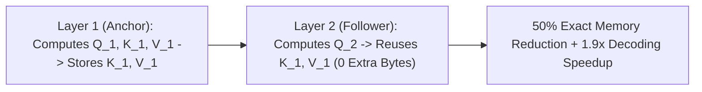

# Cross-Layer Attention (CLA): Layer-Wise KV Cache Sharing

## 1. The Cross-Layer Dimensionality
While Grouped-Query Attention (GQA) and Multi-Head Latent Attention (MLA) compress KV cache memory *within* individual layers, standard transformers still allocate $L$ distinct layer caches. **Cross-Layer Attention (CLA)** (Brandon et al., MIT, Stanford & CMU, NeurIPS 2024) introduces an orthogonal compression axis by **sharing Key and Value activations across adjacent layers**.

## 2. Mathematical Routing & Multiplicative Compression
For sharing ratio $R=2$:
- **Anchor Layers ($l \in \{0, 2, 4, \dots\}$)**: Instantiate and cache $\mathbf{K}_l = W_l^K \boldsymbol{x}_l, \mathbf{V}_l = W_l^V \boldsymbol{x}_l$.
- **Follower Layers ($l \in \{1, 3, 5, \dots\}$)**: Possess unique Query projections $W_l^Q \boldsymbol{x}_l$, but reuse the preceding anchor's cached keys and values:
  $$\mathbf{O}_l = \text{softmax}\left( \frac{\mathbf{Q}_l \, (\mathbf{K}_{l-1})^T}{\sqrt{d_k}} \right) \mathbf{V}_{l-1}$$

### Compounding Compression Gains:
- **Orthogonal to GQA & MLA**: Combining 2-to-1 CLA with GQA-8 cuts total KV cache size by **$16\times$** compared to dense MHA.
- **SRAM Persistence**: Because follower layers reuse anchor tensors already present in SRAM, memory bandwidth loads from HBM are cut in half, boosting serving throughput by up to **$1.94\times$** on vLLM with negligible perplexity difference ($\Delta \text{PPL} \le +0.08$).
