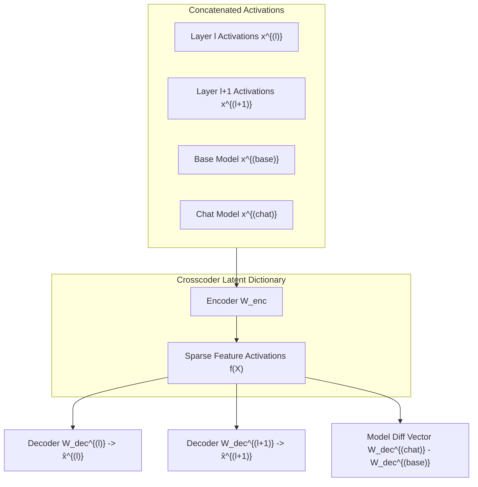

# Crosscoder Multi-Layer Residual Decomposition: Shared Latents Across Depths and Models

## 1. Mechanics of Cross-Layer and Cross-Model Autoencoding
Standard Sparse Autoencoders (SAEs) decompose the activation space $x^{(l)} \in \mathbb{R}^d$ of an isolated layer $l$ into sparse linear features. However, real mechanistic circuits operate across multiple sequential layers, and alignment transformations (e.g. RLHF) modify representations differentially across base and fine-tuned checkpoints.

**Crosscoders** (Anthropic, 2024) generalize SAEs by simultaneously training across a concatenated vector of representations from multiple model layers or paired model checkpoints:
$$X = \left[ x^{(1)\top}, x^{(2)\top}, \dots, x^{(L)\top} \right]^\top \in \mathbb{R}^{L \cdot d}$$

The crosscoder encoder maps this concatenated state into an overcomplete dictionary of $M \gg L \cdot d$ latent feature activations:
$$f(X) = \text{ReLU}\left( W_{\text{enc}} X + b_{\text{enc}} \right), \quad W_{\text{enc}} \in \mathbb{R}^{M \times (L \cdot d)}$$

Each latent feature $i \in \{1, \dots, M\}$ possesses an independent decoder vector for each layer $l$:
$$\hat{x}^{(l)} = \sum_{i=1}^M f(X)_i W_{\text{dec}, i}^{(l)} + b_{\text{dec}}^{(l)}, \quad W_{\text{dec}}^{(l)} \in \mathbb{R}^{d \times M}$$

## 2. Objective Function & Interpretability Gains
The crosscoder is trained using a composite reconstruction loss combined with an $L_1$ sparsity penalty computed across shared latents:
$$\mathcal{L}_{\text{Crosscoder}} = \sum_{l=1}^L \left\| x^{(l)} - \hat{x}^{(l)} \right\|_2^2 + \lambda \sum_{i=1}^M \left\| f(X)_i \right\|_1 \cdot \sqrt{\sum_{l=1}^L \left\| W_{\text{dec}, i}^{(l)} \right\|_2^2}$$

This formulation guarantees three structural properties:
1. **Circuit Invariance Detection:** Latents that activate identically across layers $l$ and $l+1$ identify persistent conceptual representations (e.g., entity identity) vs. transient computational scaffolding.
2. **Alignment Vector Isolation:** In cross-model crosscoders (Base vs. RLHF), features where $\left\| W_{\text{dec}, i}^{(\text{chat})} \right\| \gg \left\| W_{\text{dec}, i}^{(\text{base})} \right\|$ pinpoint the exact safety boundaries, refusal mechanisms, and persona steering latents injected during post-training.
3. **Parameter Efficiency:** Sharing latent dictionaries across $L$ layers eliminates the redundancy of training $L$ independent SAEs, reducing total latent feature count by $40\text{--}60\%$.
