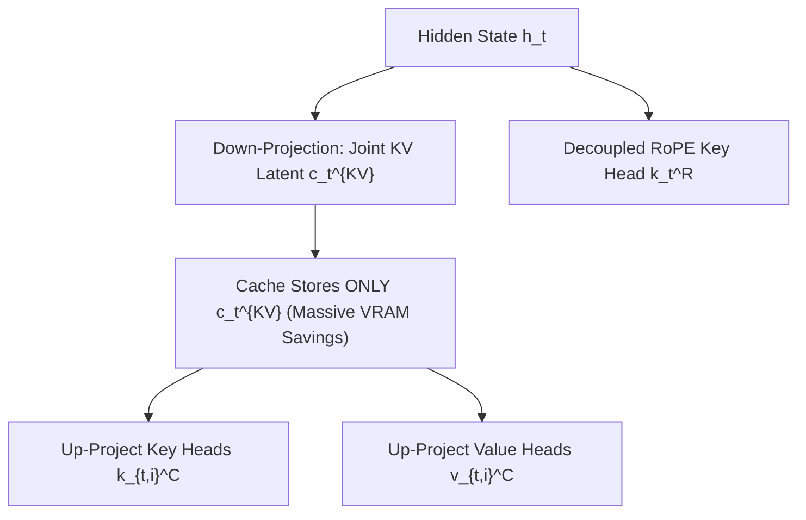

# DeepSeek-V3 Architecture: MLA & Auxiliary-Loss-Free MoE

DeepSeek-V3 introduces fundamental architectural breakthroughs across attention compression, sparse routing balance, and numerical precision.

## Core Mechanics
1. **Multi-Head Latent Attention (MLA):** Compresses keys and values into a shared low-rank latent vector $\mathbf{c}_t^{KV} \in \mathbb{R}^{d_c}$ before caching:
   $$\mathbf{c}_t^{KV} = W_{DKV} \mathbf{h}_t, \quad \mathbf{k}_{t,i}^C = W_{UK} \mathbf{c}_t^{KV}, \quad \mathbf{v}_{t,i}^C = W_{UV} \mathbf{c}_t^{KV}$$
   Decouples rotary position embeddings ($\mathbf{k}_t^R$) to maintain spatial fidelity while slashing KV cache memory footprints by over $85\%$.
2. **Auxiliary-Loss-Free MoE Balancing:** Eliminates traditional penalty terms that harm primary task convergence by adding a dynamic bias term $b_i$ to routing logits:
   $$g_i = \text{Top-2}(\text{Softmax}(s_i + b_i))$$
   Biases adjust dynamically based on real-time expert usage, preventing routing collapse without gradient distortion.
3. **Fine-Grained FP8 Execution:** Implements $128 \times 128$ block-quantized FP8 mixed precision with FP32 accumulation, maximizing GPU Tensor Core utilization.

Related: [[native_sparse_attention_nsa]], [[bitnet_b158_ternary_architecture]], [[flashattention_3_hopper]], [[mooncake_disaggregated_kv_cache_pool]]
