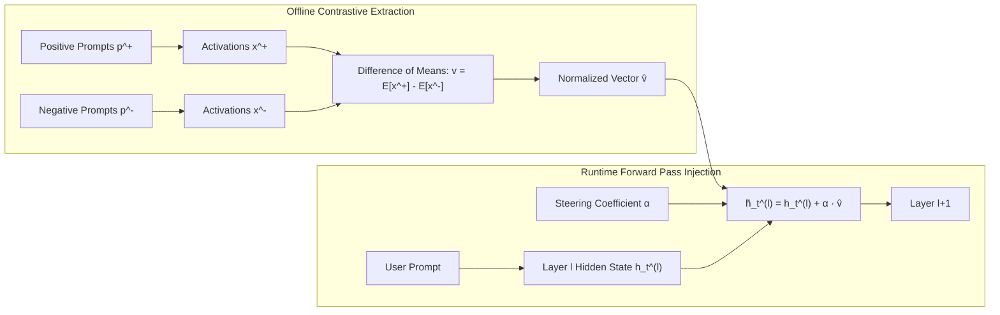

# Representation Engineering via Difference-of-Means Vector Steering

## 1. Contrastive Difference-of-Means Formulation
Representation Engineering (RepE, Zou et al., 2023) bypasses prompt engineering and fine-tuning by directly steering the internal activation space of deep transformer layers. The canonical steering vector $v_{\text{steer}} \in \mathbb{R}^d$ for a targeted concept $\mathcal{C}$ (e.g. honesty, toxicity, sycophancy, or domain persona) is derived using contrastive prompt pairs:
$$\mathcal{D}_{\text{contrast}} = \left\{ (p_i^+, p_i^-) \right\}_{i=1}^N$$
where $p_i^+$ elicits concept $\mathcal{C}$ and $p_i^-$ elicits its negative counter-concept $\neg \mathcal{C}$.

For a chosen intervention layer $l$, activations are collected at the final prompt token:
$$x_i^+ = \text{Act}^{(l)}(p_i^+), \quad x_i^- = \text{Act}^{(l)}(p_i^-)$$

The **Difference-of-Means (DoM)** steering vector is computed as:
$$v_{\text{steer}} = \frac{1}{N} \sum_{i=1}^N x_i^+ - \frac{1}{N} \sum_{i=1}^N x_i^-$$
$$\hat{v}_{\text{steer}} = \frac{v_{\text{steer}}}{\left\| v_{\text{steer}} \right\|_2}$$

## 2. Dynamic Runtime Activation Addition
During generation at inference time, the model's residual stream at layer $l$ is modified on every decoding step $t$:
$$\tilde{h}_t^{(l)} = h_t^{(l)} + \alpha \cdot \hat{v}_{\text{steer}}$$
where $\alpha \in \mathbb{R}$ is the intervention strength multiplier.

**Key Behavioral Dynamics:**
- **Monotonic Steering:** Modulating $\alpha > 0$ amplifies targeted behaviors (e.g., higher truthfulness on TruthfulQA, lower sycophancy). Inverting $\alpha < 0$ systematically suppresses the trait.
- **Subspace Orthogonality:** Difference-of-Means vectors at intermediate layers ($l \approx 0.5 \cdot L_{\text{total}}$) maintain high cosine orthogonality to syntax and formatting subspaces, preserving grammatical coherence while completely steering semantic behavior.
