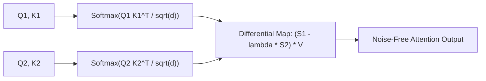

# Differential Transformer

Differential Transformer (Ye et al., Microsoft Research 2024) cancels common-mode attention noise in Transformer models by calculating attention via dual-softmax subtraction.

## Mathematical Mechanics
$$\text{DiffAttn}(X) = \left(\text{Softmax}\left(\frac{Q_1 K_1^T}{\sqrt{d}}\right) - \lambda \odot \text{Softmax}\left(\frac{Q_2 K_2^T}{\sqrt{d}}\right)\right) V$$
1. **Dual Softmax Projections:** Each head projects queries and keys into two distinct subspaces ($Q_1, K_1$ and $Q_2, K_2$).
2. **Noise Cancellation:** Standard softmax normalizers force attention mass onto irrelevant tokens due to the probability conservation constraint ($\sum p_i = 1$). Subtracting the two maps with learnable scalar $\lambda$ cancels out common-mode noise.
3. **Sparse Signal Amplification:** Dynamically emphasizes true causal associations while driving background noise to zero.

## Key Impacts
- Eliminates "lost-in-the-middle" performance collapse across extended sequence lengths.
- Slashes hallucination rates on complex multi-document summarization and long-context question answering.

Related: [[native_sparse_attention_nsa]], [[streaming_llm_sinks]], [[flashattention_3_hopper]], [[ring_attention_blockwise_transformers]]
