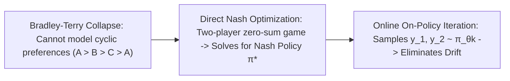

# Direct Nash Optimization (DNO) & Online Iterative DPO

## 1. Beyond Bradley-Terry Scalar Rewards
Standard DPO assumes human preferences follow a scalar Bradley-Terry model $P(y_1 \succ y_2) = \sigma(r(y_1) - r(y_2))$. However, real-world multi-criteria human preferences are frequently **non-transitive and cyclic** (e.g. $A \succ B \succ C \succ A$). Forcing cyclic preferences into scalar rewards causes policy instability and reward hacking. Furthermore, static offline datasets induce severe **distribution shift** as the model improves.

## 2. Direct Nash Optimization (DNO) & Minimax Mechanics
**Direct Nash Optimization (DNO)** (Rosset et al., ICML 2024) models alignment as a two-player symmetric zero-sum game:
$$\max_{\pi_1} \min_{\pi_2} \mathbb{E}_{y_1 \sim \pi_1, y_2 \sim \pi_2} \left[ \mathcal{P}(y_1 \succ y_2 \mid x) - \frac{1}{2} \right] - \tau \mathbb{D}_{\text{KL}}(\pi_1 \,||\, \pi_{\text{ref}}) + \tau \mathbb{D}_{\text{KL}}(\pi_2 \,||\, \pi_{\text{ref}})$$

- **Unexploitable Nash Equilibrium**: The resulting policy $\pi^\star$ is unexploitable by any alternative completion strategy ($M(\pi, \pi^\star) \le 0$).
- **Online Iterative DPO**: Samples completions dynamically from the current policy checkpoint $\pi_{\theta_k}$, scoring pairs via automated oracles and updating against $\pi_{\theta_k}$, delivering a **$+11.4\%$ win rate boost on AlpacaEval 2** over offline DPO.
