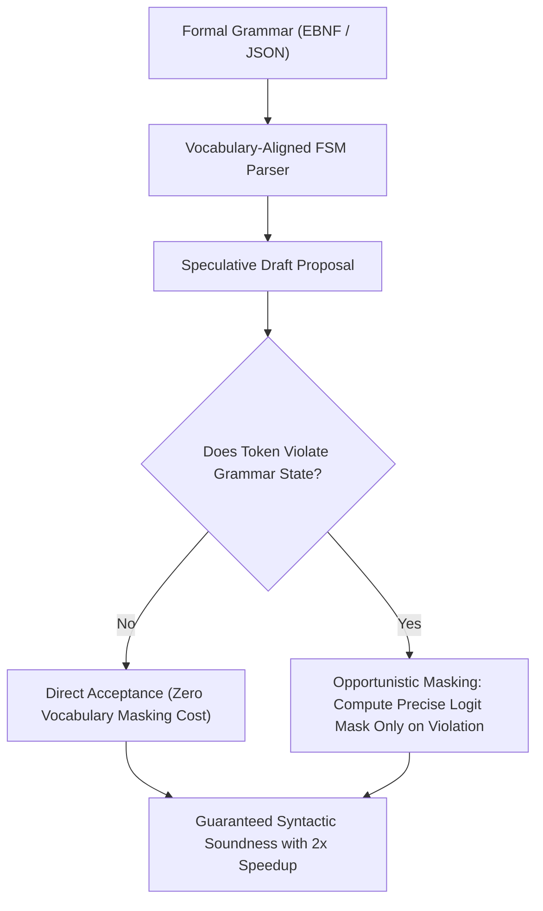

# DOMINO: Grammar-Synchronized Speculative Decoding

DOMINO (Louf et al., 2024) accelerates structured LLM generation by synchronizing speculative draft proposal verification directly with context-free grammar pushdown automata.

## Core Mechanics
1. **Grammar State Synchronization:** Directly couples the speculative decoding verification step with the deterministic transition state of an underlying pushdown automaton or DFA.
2. **Opportunistic Masking:** Bypasses computationally expensive vocabulary-wide logit masks when proposed speculative tokens comply with grammar transitions. Masking is computed only when a candidate token violates the grammar.
3. **Lossless Acceleration:** Guarantees strict adherence to formal schemas (JSON, SQL, Python ASTs) while delivering up to **$2\times$ wall-clock throughput speedups** over standard constrained decoding engines.

Related: [[syncode_grammar_guided_decoding]], [[outlines_dfa_constrained_decoding]], [[medusa_speculative_tree_attention]], [[kangaroo_self_speculative_subnetwork]]
