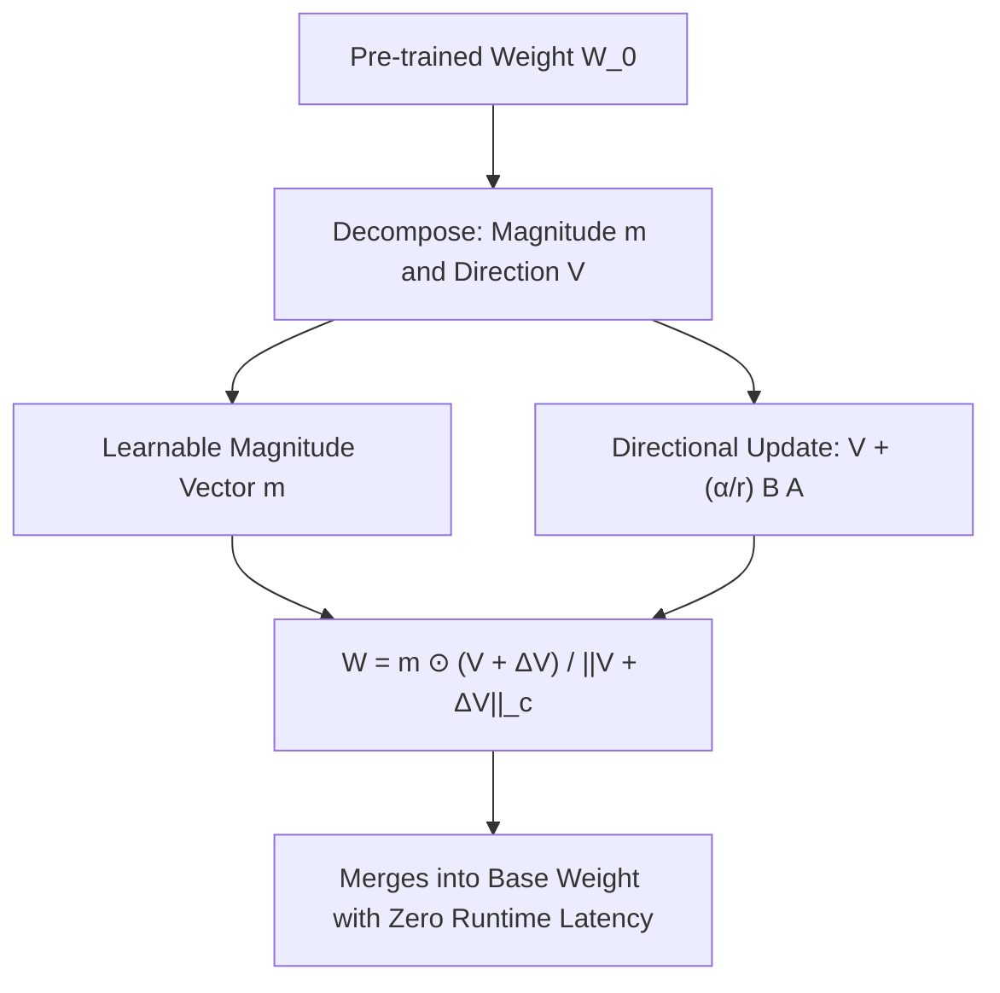

# DoRA: Weight-Decomposed Low-Rank Adaptation

**DoRA** decouples pre-trained weight matrices into independent magnitude and directional components, applying standard Low-Rank Adaptation (LoRA) exclusively to the directional updates to match full fine-tuning dynamics.

## Mathematical Mechanics
Weight matrices $W_0 \in \mathbb{R}^{d \times k}$ are decomposed column-wise:
$$W = m \odot \frac{V + \Delta V}{\|V + \Delta V\|_c}$$
where $m = \|W_0\|_c \in \mathbb{R}^{1 \times k}$ is the learnable magnitude vector, $V = W_0$, and directional perturbation $\Delta V = \frac{\alpha}{r} B A$.

Unlike standard LoRA which forces rigidly proportional adjustments between weight magnitude and direction, DoRA permits orthogonal updates along both axes. This design closely tracks full fine-tuning weight trajectories, delivering superior performance on commonsense reasoning and instruction benchmarks without adding latency during inference.

## Related Mechanics
- [[low_rank_adaptation_lora]]
- [[lora_plus_asymmetric_learning_rates]]
- [[qlora_normalfloat4_quantization]]
