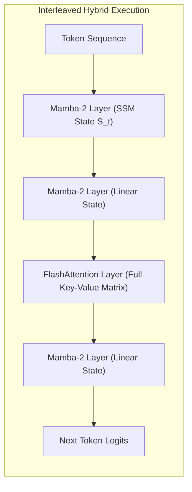

# Dual-State Attention Routing: Selective Linear Recurrence Hybrid Models

## 1. Mechanics of SSM-Transformer Hybridization
Standard Softmax Self-Attention scales quadratically $O(N^2)$ in context length and suffers from an unbounded linear memory growth $O(N)$ per decoding stream in the KV cache. Conversely, pure State-Space Models (SSM) like Mamba-2 or RWKV-6 possess constant $O(1)$ memory footprints and $O(N)$ linear compute, but suffer from finite-state memory compression bottlenecks on associative recall, needle-in-a-haystack tasks, and multi-hop reasoning.

**Dual-State Hybrid Routing** (exemplified by Jamba, StripedHyena, and Zamba) interleaves Linear Attention / SSM layers with standard Transformer Attention layers in a deterministic ratio (e.g. 1 Attention layer per 7 SSM layers, or 1:3):
$$h_{l+1} = \begin{cases} \text{Mamba2\_Block}(h_l) & \text{if } l \not\equiv 0 \pmod k \\ \text{TransformerAttention\_Block}(h_l) & \text{if } l \equiv 0 \pmod k \end{cases}$$

## 2. State-Space Equation & Associative Recall Recovery
The recurrent layers process inputs via continuous-time state space discretization:
$$h_t = \bar{A}_t h_{t-1} + \bar{B}_t x_t, \quad y_t = C_t h_t + D x_t$$
where $\bar{A}_t = \exp(\Delta_t A)$ is a data-dependent transition operator.

The periodic Transformer attention layer acts as an exact associative anchor: it reads from the full global token history, resolving the SSM's information dissipation over long horizons ($>64\text{K}$ tokens). 

**Hardware & Inference Impact:**
- **KV Cache Memory Footprint:** Reduces active KV cache memory by **$85\text{--}88\%$**, because only $1/k$-th of layers store Key-Value tensors.
- **Decoding Throughput:** Delivers up to **$3\times$ higher generation throughput** at $128\text{K}$ context window on 8xH100 clusters compared to pure Llama-3 architectures.
