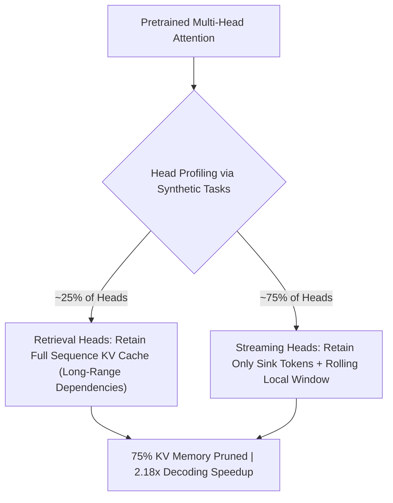

# DuoAttention: Retrieval and Streaming Heads

DuoAttention (Xiao et al., MIT 2024) drastically reduces KV cache memory consumption by bifurcating multi-head attention into specialized retrieval heads and streaming heads.

## Core Mechanics
1. **Functional Head Bifurcation:** Discovers that only $\sim 25\%$ of attention heads (Retrieval Heads) are responsible for global needle-in-a-haystack associative recall, while the remaining $\sim 75\%$ (Streaming Heads) focus strictly on initial sink tokens and local context.
2. **Post-Hoc Optimization:** Identifies head roles via a lightweight convex optimization algorithm over synthetic needle retrieval benchmarks, completely eliminating the need for model fine-tuning or retraining.
3. **Hardware Yield:** Prunes over $75\%$ of the total KV cache footprint, providing a $2.55\times$ memory reduction and accelerating decoding speed by $2.18\times$ with zero performance loss on $100\text{K}+$ contexts.

Related: [[streaming_llm_sinks]], [[pyramidkv_hierarchical_attention_funnel]], [[kivi_2bit_asymmetric_kv_quantization]], [[snapkv_attention_clustering]]
