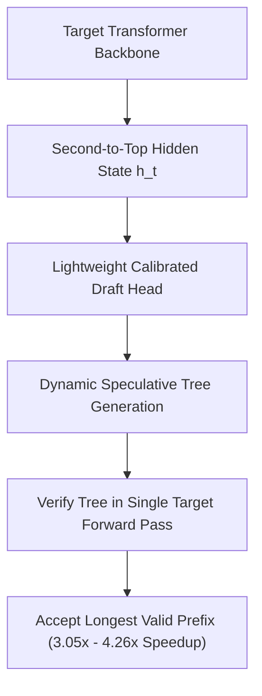

# EAGLE-2: Recurrent Feature Speculative Decoding

EAGLE-2 (Li et al., 2024) accelerates LLM inference losslessly by drafting sequences in second-to-top hidden feature space using dynamic, context-aware speculative trees.

## Core Mechanics
1. **Feature-Level Drafting:** Rather than drafting in discrete token vocabulary space where uncertainty compounds, EAGLE-2 generates candidates in the continuous second-to-top hidden state space of the target model.
2. **Probability Calibration:** Proves that the draft head's softmax probabilities accurately mirror true target acceptance likelihoods under causal verification.
3. **Dynamic Context-Aware Trees:** Dynamically expands speculative tree depth on confident tokens and widens/prunes branches on uncertain tokens, achieving **$3.05\times\text{--}4.26\times$ lossless wall-clock acceleration**.

Related: [[medusa_speculative_tree_attention]], [[kangaroo_self_speculative_subnetwork]], [[triforce_hierarchical_speculative_decoding]], [[lookahead_decoding_jacobi_iteration]]
