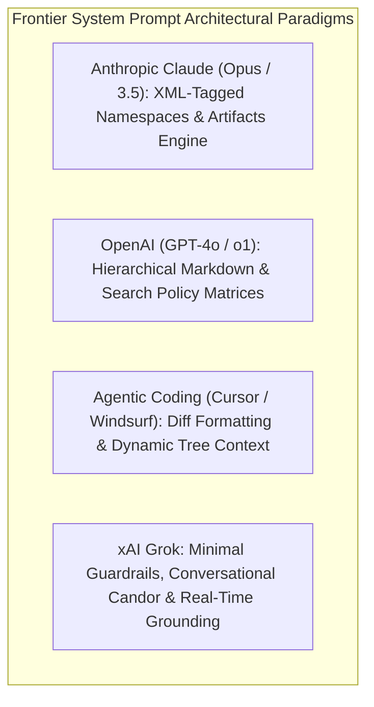

# Frontier Lab System Prompts & CL4R1T4S Comparative Architecture

## 1. System Prompt Repositories & Red-Team Extractions
System prompts represent the foundational steerability substrate of modern LLMs, setting the boundary conditions, persona boundaries, safety filters, and tool-use mechanics before user input is ingested. Repositories such as **`elder-plinius/CL4R1T4S`** (Pliny the Liberator), `asgeirtj/system_prompts_leaks`, and `Piebald-AI/claude-code-system-prompts` serve as empirical archives documenting how frontier AI labs architect production-grade instructions.

## 2. Comparative Analysis of Frontier Lab Architectures

| Dimension | Anthropic Claude (Opus / Sonnet) | OpenAI (ChatGPT-4o / o1) | Cursor / Windsurf / Coding Agents |
| :--- | :--- | :--- | :--- |
| **Structuring Paradigm** | Strict XML tags (`<instructions>`, `<rules>`, `<antArtifact>`) | Markdown headings (`# Instructions`, `## Guidelines`) | Custom XML + System Rules (`.cursorrules`, diff specs) |
| **Output / Artifact Handling** | Deterministic thresholding ($>15$ lines, self-contained `<antArtifact>`) | Canvas UI triggers, python code interpreter sandbox | Unified diff blocks (`<<<< SEARCH / ==== / >>>> REPLACE`) |
| **Reasoning Protocol** | Native `<thinking>` / `<antml:thought>` scratchpad prior to generation | Chain-of-thought suppression or hidden reasoning tokens (`<thought>`) | Multi-step agentic planning + file inspection verification |
| **Safety & Refusal Style** | **Anti-Preachy Alignment:** Flat refusal without moral lecturing | Policy boundary checks, polite redirect to safe topics | Relaxed safety filter for local software debugging |
| **Tone & Style Constraints** | Direct, anti-sycophantic, strictly no boilerplate apologies | Conversational, helpful, adaptive verbosity | Highly terse, minimal prose, direct patch application |

## 3. Engineering Lessons for Autonomous Agent Prompts
1. **XML Isolation Beats Markdown Delimiters:** Parsing engines handle `<tag>` enclosures with lower injection susceptibility than `#` Markdown headers.
2. **Explicit Artifact Thresholds:** Specifying quantifiable boundaries (e.g. *">15 lines of code"* vs *"short snippet"*) eliminates ambiguous formatting failures.
3. **Anti-Preachiness Directives:** Explicit instructions forbidding patronizing lectures preserve user trust during safety refusals.
